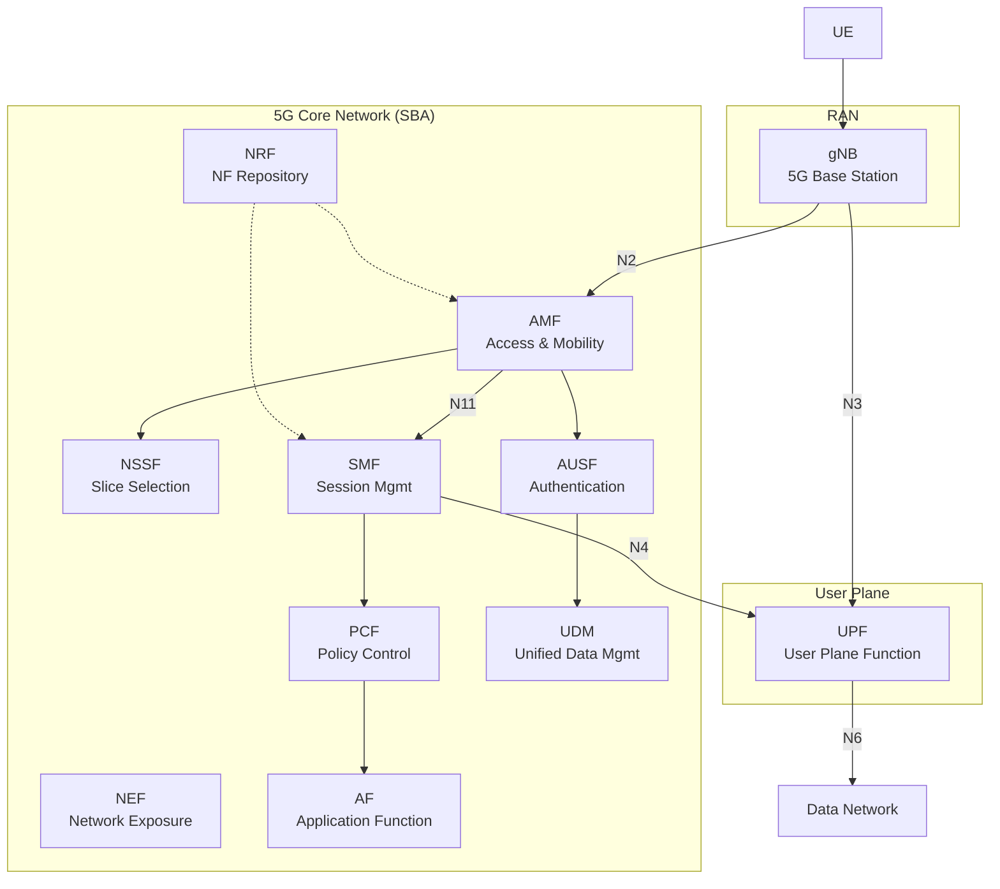
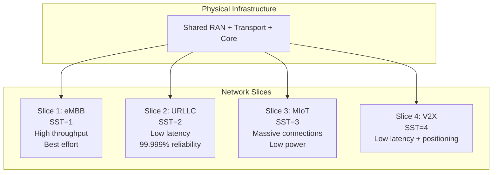
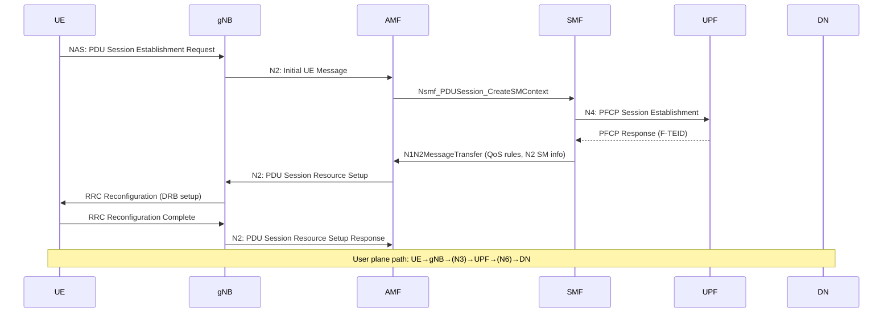
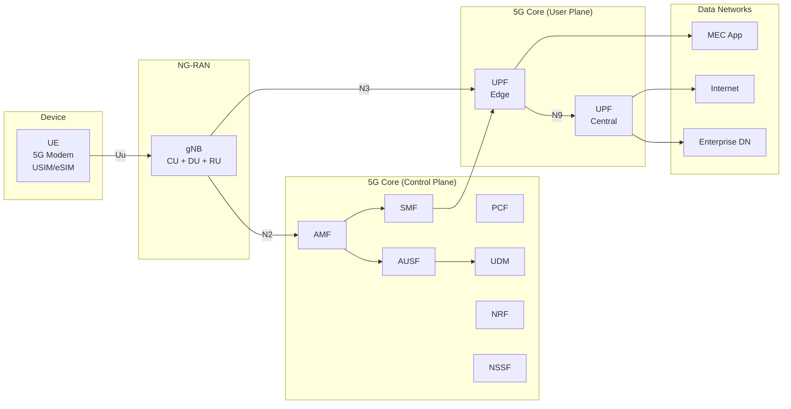
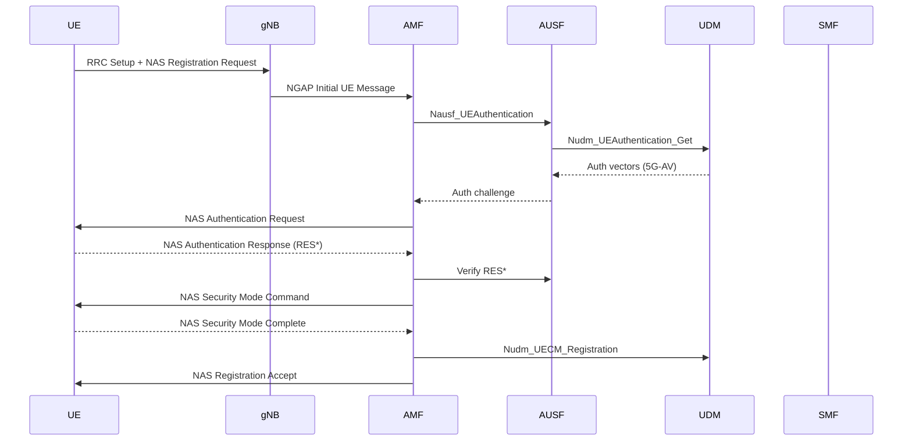

# 5G NR Architecture

**Topic:** 5G New Radio (NR) System Architecture — NG-RAN, 5G Core (5GC), Service-Based Architecture  
**Standards:** 3GPP TS 23.501, TS 38.300, TS 38.401, TS 23.502  
**SDO:** 3GPP  
**Audience:** Network architects, protocol engineers, system designers, telecom solution architects  
**Prerequisites:** LTE architecture (EPC, eNB), IP networking, service-oriented architecture concepts

---

## Chapter 1 — Historical Context & Origin Story

### 1.1 From EPC to 5G Core

| Era | Core Network | Architecture Style | Key Limitation |
|-----|-------------|-------------------|---------------|
| 2G | NSS (MSC/VLR/HLR) | Circuit-switched, monolithic | Voice-only, no data |
| 3G | CS core + PS core (SGSN/GGSN) | Hybrid circuit+packet | Complex dual-domain |
| 4G | EPC (MME/S-GW/P-GW) | All-IP, point-to-point interfaces | GTP tunneling, monolithic NFs |
| 5G | 5GC (AMF/SMF/UPF/...) | Service-Based Architecture (SBA) | N/A (current generation) |

### 1.2 Design Principles of 5G Architecture

| Principle | Rationale |
|-----------|-----------|
| Service-Based Architecture | Microservices model, HTTP/2-based APIs between NFs |
| Control/User Plane Separation (CUPS) | Independent scaling of control and data planes |
| Network slicing | Multiple isolated logical networks on shared infrastructure |
| Stateless network functions | State stored externally (UDSF) for elasticity |
| Edge computing support | UPF deployed at edge (MEC) for low latency |

---

## Chapter 2 — Standard Architecture & Structure

### 2.1 5G System (5GS) Reference Architecture (TS 23.501)



### 2.2 Key Reference Points

| Interface | Between | Protocol | Purpose |
|-----------|---------|----------|---------|
| N1 | UE ↔ AMF | NAS (5G-MM, 5G-SM) | Registration, authentication, session |
| N2 | gNB ↔ AMF | NGAP (over SCTP) | Control plane signaling |
| N3 | gNB ↔ UPF | GTP-U (over UDP/IP) | User plane data tunneling |
| N4 | SMF ↔ UPF | PFCP | Session rules, QoS enforcement |
| N6 | UPF ↔ DN | IP/Ethernet | Data network connectivity |
| N9 | UPF ↔ UPF | GTP-U | Inter-UPF forwarding |
| N11 | AMF ↔ SMF | SBI (HTTP/2) | Session management |
| Nausf/Nudm/Nnrf/... | Inter-NF (SBI) | HTTP/2 + JSON | Service-based interfaces |

---

## Chapter 3 — Technical Deep Dive

### 3.1 NG-RAN Architecture (TS 38.401)

```mermaid
graph TB
    subgraph "NG-RAN"
        subgraph "gNB (Disaggregated)"
            CU_CP[gNB-CU-CP<br/>RRC, PDCP-C]
            CU_UP[gNB-CU-UP<br/>PDCP-U, SDAP]
            DU[gNB-DU<br/>RLC, MAC, PHY-high]
            RU[RU<br/>PHY-low, RF]
        end
    end
    
    CU_CP -->|F1-C| DU
    CU_UP -->|F1-U| DU
    CU_CP -->|E1| CU_UP
    DU -->|Fronthaul<br/>eCPRI/O-RAN| RU
    
    CU_CP -->|N2 (NGAP)| AMF[AMF]
    CU_UP -->|N3 (GTP-U)| UPF[UPF]
    CU_CP -->|Xn| gNB2[Neighbor gNB]
```

### 3.2 CU/DU/RU Split Options

| Split | Location | Bandwidth Req | Latency Req | Use Case |
|-------|----------|--------------|------------|----------|
| Option 2 (PDCP/RLC) | CU-DU | ~Gbps | ~ms | Typical macro deployment |
| Option 6 (MAC/PHY) | High PHY split | Tens of Gbps | <250μs | Centralized scheduling |
| Option 7.2x (O-RAN) | Low PHY split | ~25 Gbps/cell | <100μs | O-RAN fronthaul |
| Option 8 (RF/PHY) | Full centralization | ~100+ Gbps | <50μs | C-RAN (impractical for most) |

### 3.3 5G Core Network Functions

| NF | Full Name | Key Functions |
|----|-----------|--------------|
| AMF | Access and Mobility Management Function | NAS signaling, registration, mobility, N2 termination |
| SMF | Session Management Function | PDU session establishment, QoS, UPF selection |
| UPF | User Plane Function | Packet routing, QoS enforcement, DPI, buffering |
| PCF | Policy Control Function | Policy decisions, charging rules, QoS policies |
| UDM | Unified Data Management | Subscription data, authentication credentials (replaces HSS) |
| AUSF | Authentication Server Function | 5G-AKA, EAP-AKA' authentication |
| NRF | NF Repository Function | NF discovery and registration (service registry) |
| NSSF | Network Slice Selection Function | Slice selection based on NSSAI |
| NEF | Network Exposure Function | API exposure to external AFs (capability exposure) |
| NWDAF | Network Data Analytics Function | AI/ML-based network analytics |
| UDR | Unified Data Repository | Centralized data store for all NFs |
| UDSF | Unstructured Data Storage Function | Stateless NF state storage |

### 3.4 Service-Based Architecture (SBA)

**Key Design:** All 5GC control plane NFs expose services via HTTP/2 + JSON APIs (RESTful). NFs register with NRF and discover each other dynamically.

| SBI Service | Provider NF | Consumer NF | Purpose |
|-------------|------------|-------------|---------|
| Namf_Communication | AMF | SMF | N1/N2 message forwarding |
| Nsmf_PDUSession | SMF | AMF | PDU session lifecycle |
| Nausf_UEAuthentication | AUSF | AMF | Authentication |
| Nudm_SubscriberDataManagement | UDM | AMF, SMF | Subscription data |
| Nnrf_NFManagement | NRF | All NFs | Registration/discovery |
| Npcf_SMPolicyControl | PCF | SMF | QoS/charging policies |
| Nnwdaf_AnalyticsInfo | NWDAF | Any NF | Network analytics |

### 3.5 Network Slicing



**S-NSSAI (Single Network Slice Selection Assistance Information):**
- **SST (Slice/Service Type):** 1=eMBB, 2=URLLC, 3=MIoT, 4=V2X
- **SD (Slice Differentiator):** Optional 24-bit value for operator-specific slices

---

## Chapter 4 — Implementation Guide

### 4.1 5G Deployment Options

| Option | Master Node | Secondary Node | Core | Timeline |
|--------|------------|---------------|------|----------|
| Option 2 (SA) | gNB | — | 5GC | 2020+ |
| Option 3/3a/3x (NSA) | eNB | gNB | EPC | 2019 (first deployments) |
| Option 4/4a | gNB | eNB | 5GC | Rare |
| Option 5 | eNB | — | 5GC | Migration path |
| Option 7/7a/7x | gNB | eNB | 5GC | Future dual connectivity |

### 4.2 PDU Session Establishment (TS 23.502)



### 4.3 QoS Framework

| QoS Parameter | Range | Description |
|--------------|-------|-------------|
| 5QI (5G QoS Identifier) | 1-255 | Standardized QoS characteristics |
| ARP (Allocation & Retention Priority) | 1-15 | Preemption priority |
| GBR (Guaranteed Bit Rate) | Variable | Minimum guaranteed rate |
| MBR (Maximum Bit Rate) | Variable | Rate cap |
| PDB (Packet Delay Budget) | 10-300ms | Max acceptable delay |
| PER (Packet Error Rate) | 10⁻²-10⁻⁶ | Target error rate |

**Standardized 5QI Values:**

| 5QI | Resource Type | PDB | PER | Example Service |
|-----|--------------|-----|-----|----------------|
| 1 | GBR | 100ms | 10⁻² | Conversational voice |
| 2 | GBR | 150ms | 10⁻³ | Live video streaming |
| 5 | Non-GBR | 100ms | 10⁻⁶ | IMS signaling |
| 9 | Non-GBR | 300ms | 10⁻⁶ | Video (buffered), TCP web |
| 82 | GBR | 10ms | 10⁻⁴ | Discrete automation |
| 85 | GBR | 5ms | 10⁻⁵ | Remote driving (URLLC) |

---

## Chapter 5 — Certification & Audit

### 5.1 5G NR Device Certification

| Stage | Testing | Body |
|-------|---------|------|
| RF conformance | TS 38.521 (FR1), TS 38.521-2 (FR2) | Accredited labs |
| Protocol conformance | TS 38.523 | Accredited labs |
| GCF certification | Validated test cases | GCF (Global Certification Forum) |
| PTCRB certification | US market validation | PTCRB |
| Operator IOT | Interoperability with live network | Operator lab |
| Field trials | Real-world performance | Operator |

### 5.2 5G Core NF Security Testing

| Standard | Target NF | Scope |
|----------|----------|-------|
| TS 33.512 | gNB | SCAS for gNB |
| TS 33.513 | UPF | SCAS for UPF |
| TS 33.514 | AMF | SCAS for AMF |
| TS 33.515 | SMF | SCAS for SMF |
| TS 33.517 | SEPP | SCAS for SEPP |
| TS 33.535 | AUSF/UDM | SCAS for authentication |

---

## Chapter 6 — Regional & Domain Variants

### 6.1 5G Deployment Models by Market

| Market | Architecture | Spectrum Strategy | Notable Feature |
|--------|-------------|------------------|----------------|
| US (T-Mobile) | SA + NSA | n41 (2.5 GHz) + n71 (600 MHz) | Largest SA deployment |
| US (Verizon) | NSA → SA | C-band n77 + mmWave n261 | mmWave focus |
| China (all 3 operators) | SA-first | n78 + n79 + n41 | Largest 5G network globally |
| South Korea | NSA → SA | n78 + n257 | First 5G launch (April 2019) |
| Japan (NTT DoCoMo) | SA | n78/n79 + n257 | Sub-6 + mmWave combined |
| EU (various) | Mix NSA/SA | n78 (3.5 GHz) | Fragmented spectrum |
| India (Jio/Airtel) | SA | n78 (3.3 GHz) + n258 | Large-scale SA from start |

---

## Chapter 7 — Comparison: 5G vs LTE Architecture

| Aspect | LTE (EPC) | 5G (5GC) |
|--------|----------|----------|
| Architecture style | Point-to-point (Diameter/GTP) | Service-Based (HTTP/2 REST) |
| Core NF interaction | Reference point (S6a, S11, etc.) | Service-based interfaces (Nxxx) |
| Session management | GTP-C tunnels (S11, S5/S8) | PFCP (N4), HTTP/2 (N11) |
| User plane protocol | GTP-U (S1-U, S5/S8) | GTP-U (N3, N9) |
| Mobility management | MME (single NF) | AMF (separated from SMF) |
| Policy | PCRF (Diameter Gx/Rx) | PCF (HTTP/2 SBI) |
| Subscription data | HSS (Diameter S6a) | UDM + UDR (SBI) |
| Network slicing | Not supported natively | Native (NSSF, S-NSSAI) |
| Edge computing | Indirect (LIPA/SIPTO) | Native (UPF at edge, LADN) |
| NF discovery | Static configuration | Dynamic via NRF |
| Scaling | Vertical (monolithic NFs) | Horizontal (microservices, Kubernetes) |

---

## Chapter 8 — Mermaid Architecture Diagrams

### 8.1 5G End-to-End Architecture



### 8.2 Registration Procedure



---

## Chapter 9 — Case Studies & Failure Analysis

### 9.1 Case Study: T-Mobile US SA Deployment

**Context:** T-Mobile launched the world's first nationwide 5G SA network (2020) using 600 MHz (n71) low-band + 2.5 GHz (n41) mid-band.

**Architecture decisions:** (1) SA from Day 1 on low-band (coverage). (2) n41 TDD for capacity layer (100 MHz bandwidth). (3) Cloud-native 5GC (containerized, Kubernetes). (4) Network slicing enabled for enterprise.

**Results:** 300M+ population covered. SA enabled VoNR, network slicing, standalone positioning. Lesson: SA-first with low-band provides nationwide coverage faster than mmWave-centric approach.

### 9.2 Failure: Early 5G mmWave Coverage Gaps

**Problem:** Initial 5G deployments (Verizon, 2019) focused on mmWave (28 GHz / n261). Signal propagation severely limited: <200m range, no building penetration, blocked by foliage.

**Impact:** "5G" coverage maps showed tiny hotspots. Consumer disappointment. Devices frequently fell back to LTE.

**Resolution:** Industry pivoted to mid-band (C-band, 3.5 GHz) as primary 5G layer with mmWave for dense urban hotspots only. 3GPP Rel-17 introduced FR2-2 (52.6-71 GHz) for further capacity.

---

## Chapter 10 — Future Evolution & Industry Trends

| Trend | Timeline | 5G Architecture Impact |
|-------|----------|----------------------|
| Cloud-native 5GC | Now | NFs as containers on Kubernetes, CI/CD |
| Network slicing commercialization | 2024+ | Slice-as-a-Service for enterprise |
| MEC (Multi-Access Edge Computing) | Now | UPF + app servers at edge |
| AI/ML in network (NWDAF) | Rel-18+ | Predictive optimization, anomaly detection |
| Network API monetization (NEF) | 2024+ | GSMA Open Gateway initiative |
| Energy efficiency | Rel-18+ | gNB sleep, UE power saving |
| Non-Public Networks (NPN) | Now | Private 5G for industry |
| Satellite integration (NTN) | Rel-17+ | LEO/GEO via standard 5G UE |

---

## Chapter 11 — Interview Questions & Career Guide

### Tier 1: Entry-Level

**Q1:** What are the main network functions in 5G Core?  
**A:** Key NFs: **AMF** (access/mobility management, NAS), **SMF** (session management, QoS), **UPF** (user plane forwarding), **UDM** (subscriber data), **AUSF** (authentication), **PCF** (policy), **NRF** (NF discovery), **NSSF** (slice selection). The architecture is Service-Based — NFs communicate via HTTP/2 REST APIs (SBI). AMF/SMF separation enables CUPS (Control/User Plane Separation).

### Tier 2: Mid-Level

**Q2:** Explain the N4 interface (SMF↔UPF) and PFCP protocol.  
**A:** **PFCP (Packet Forwarding Control Protocol, TS 29.244):** Control protocol between SMF and UPF. SMF installs forwarding rules (PDRs, FARs, QERs, URRs) into UPF via PFCP Session Establishment/Modification. **PDR** (Packet Detection Rule): Match criteria (GTP-U TEID, IP filters). **FAR** (Forwarding Action Rule): Forward, drop, buffer, duplicate. **QER** (QoS Enforcement Rule): Rate limiting per QoS flow. **URR** (Usage Reporting Rule): Volume/time measurement for charging. PFCP runs over UDP (port 8805), separate from user plane path.

### Tier 3: Senior

**Q3:** How does 5G network slicing work end-to-end?  
**A:** **Slice identification:** S-NSSAI (SST + SD). UE requests slices in Registration Request (Requested NSSAI). AMF consults NSSF for allowed slices. **Slice isolation:** Each slice has dedicated or shared NF instances (AMF shared, SMF/UPF per-slice). RAN: Slice-aware scheduling (RRM per slice). Transport: QoS-differentiated backhaul (DSCP marking). **Lifecycle:** Slice templates (NEST) → instantiation (CSMF/NSMF/NSSMF) → runtime (SLA monitoring) → decommission. **Challenge:** True RAN isolation difficult — typically QoS-based differentiation rather than hard partitioning.

---

## Chapter 12 — Cheat Sheet & Quick Reference

### 5G Architecture Key Facts

```
5GC NFs: AMF, SMF, UPF, PCF, UDM, AUSF, NRF, NSSF, NEF, NWDAF
SBI Protocol: HTTP/2 + JSON (RESTful)
N2 (gNB↔AMF): NGAP over SCTP
N3 (gNB↔UPF): GTP-U over UDP
N4 (SMF↔UPF): PFCP over UDP
N6 (UPF↔DN): IP/Ethernet
gNB split: CU-CP (RRC/PDCP-C) + CU-UP (SDAP/PDCP-U) + DU (RLC/MAC) + RU (PHY/RF)
F1: CU↔DU interface
E1: CU-CP↔CU-UP interface
Xn: Inter-gNB interface
```

### Network Slice Types (SST)

```
SST=1: eMBB (enhanced Mobile Broadband)
SST=2: URLLC (Ultra-Reliable Low-Latency)
SST=3: MIoT (Massive IoT)
SST=4: V2X (Vehicle-to-Everything)
SST=5-127: Operator-specific
```

---

*End of Document — 02_5G_NR_Architecture.md*
