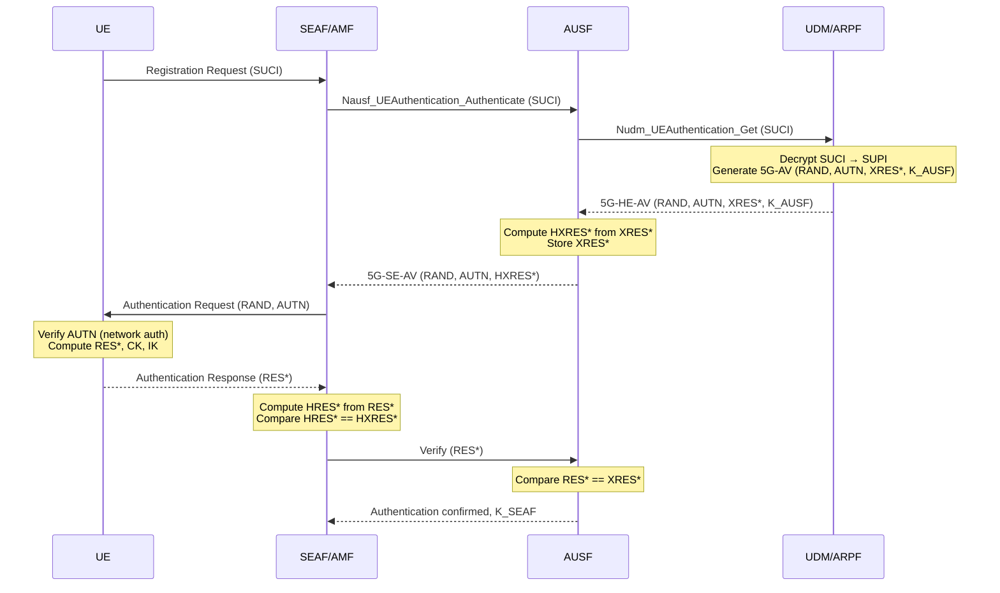
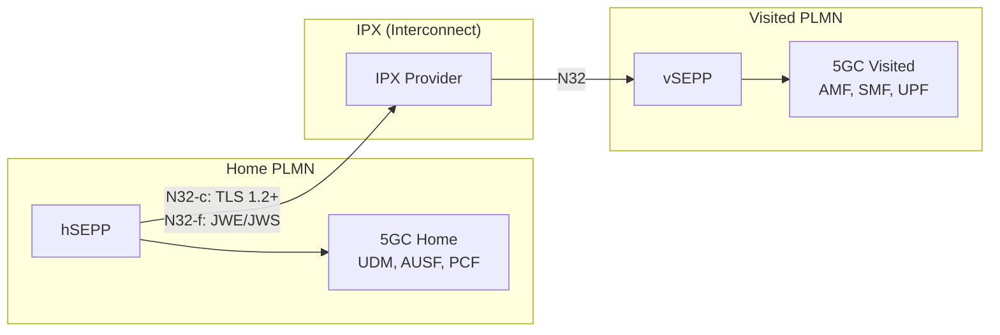
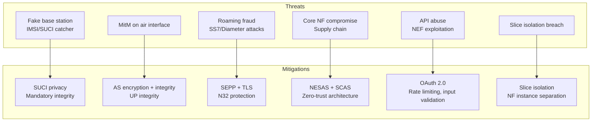

# 5G Security Architecture

**Topic:** 5G Network Security — Authentication, Privacy, Encryption, Network Element Security  
**Standards:** 3GPP TS 33.501, TS 33.512-33.536, GSMA NESAS, ETSI SCAS  
**SDO:** 3GPP SA3, GSMA, ETSI  
**Audience:** Telecom security engineers, network security architects, 5G security researchers  
**Prerequisites:** Cryptography fundamentals, LTE security (EPS-AKA), PKI, mobile network architecture

---

## Chapter 1 — Historical Context & Origin Story

### 1.1 Mobile Security Evolution

| Generation | Authentication | Encryption | Key Vulnerability |
|-----------|---------------|-----------|------------------|
| 1G (AMPS) | None | None | Cloning, eavesdropping |
| 2G (GSM) | A3/A8 (SIM) | A5/1 stream cipher | IMSI catchers, weak A5/1 |
| 3G (UMTS) | AKA (mutual auth) | KASUMI (128-bit) | Still sends IMSI in clear |
| 4G (LTE) | EPS-AKA | SNOW 3G, AES, ZUC | IMSI still exposed on air |
| 5G (NR) | 5G-AKA / EAP-AKA' | NEA1/2/3 + NIA1/2/3 | IMSI encrypted (SUCI) |

### 1.2 Key Security Improvements in 5G

| Improvement | Problem Solved | Mechanism |
|-------------|---------------|-----------|
| SUPI/SUCI privacy | IMSI catchers | ECIES encryption of SUPI → SUCI |
| Unified authentication | Heterogeneous access (3GPP/non-3GPP) | EAP framework (EAP-AKA', 5G-AKA) |
| SEPP (Security Edge Protection Proxy) | Roaming security | TLS + JWE between operator cores |
| 256-bit key hierarchy | Future-proofing | K → CK/IK → K_AUSF → K_SEAF → K_AMF → K_NAS/K_gNB |
| Network element security assurance | Supply chain trust | NESAS + SCAS standards |

---

## Chapter 2 — Standard Architecture & Structure

### 2.1 5G Security Specification Framework

| Standard | Scope |
|----------|-------|
| TS 33.501 | Security architecture and procedures for 5G |
| TS 33.220 | Generic Authentication Architecture (GAA/GBA) |
| TS 33.310 | Network domain security (NDS/IP, TLS profiles) |
| TS 33.401 | EPS security (LTE — baseline reference) |
| TS 33.512 | SCAS for gNB |
| TS 33.513 | SCAS for UPF |
| TS 33.514 | SCAS for AMF |
| TS 33.515 | SCAS for SMF |
| TS 33.516 | SCAS for general NFs |
| TS 33.517 | SCAS for SEPP |
| TS 33.535 | Authentication procedures |
| GSMA FS.13 | NESAS methodology |
| GSMA FS.16 | NESAS development and lifecycle |

### 2.2 Security Architecture Layers

```mermaid
graph TB
    subgraph "Layer 5: Application Security"
        A[Application layer security<br/>TLS, HTTPS, API security]
    end
    
    subgraph "Layer 4: Network Domain Security"
        B[Inter-NF: TLS 1.2/1.3<br/>Inter-PLMN: SEPP + IPX<br/>NDS/IP]
    end
    
    subgraph "Layer 3: Service-Based Security"
        C[OAuth 2.0 for NF authorization<br/>SBI security (HTTP/2 + TLS)]
    end
    
    subgraph "Layer 2: Access Security"
        D[Authentication: 5G-AKA / EAP-AKA'<br/>NAS security: encryption + integrity<br/>AS security: PDCP encryption + integrity]
    end
    
    subgraph "Layer 1: Subscriber Privacy"
        E[SUPI→SUCI encryption<br/>ECIES (Profile A: Curve25519, Profile B: secp256r1)]
    end
    
    A --> B --> C --> D --> E
```

---

## Chapter 3 — Technical Deep Dive

### 3.1 5G Key Hierarchy

```mermaid
graph TB
    K[K<br/>Permanent key in USIM + UDM<br/>256-bit]
    K --> CK_IK[CK, IK<br/>Cipher Key, Integrity Key<br/>128/256-bit]
    CK_IK --> K_AUSF[K_AUSF<br/>Anchor key at AUSF]
    K_AUSF --> K_SEAF[K_SEAF<br/>Key at SEAF (AMF)]
    K_SEAF --> K_AMF[K_AMF<br/>Key for AMF]
    K_AMF --> K_NAS_enc[K_NASenc<br/>NAS encryption]
    K_AMF --> K_NAS_int[K_NASint<br/>NAS integrity]
    K_AMF --> K_gNB[K_gNB<br/>Key for gNB]
    K_gNB --> K_RRC_enc[K_RRCenc<br/>RRC encryption]
    K_gNB --> K_RRC_int[K_RRCint<br/>RRC integrity]
    K_gNB --> K_UP_enc[K_UPenc<br/>User plane encryption]
    K_gNB --> K_UP_int[K_UPint<br/>User plane integrity]
```

### 3.2 Authentication Procedures

#### 5G-AKA (Primary Method)



### 3.3 SUPI/SUCI Privacy Protection

| Concept | Description |
|---------|-------------|
| SUPI (Subscription Permanent Identifier) | Permanent subscriber ID (equivalent to IMSI). Format: IMSI or NAI |
| SUCI (Subscription Concealed Identifier) | Encrypted SUPI (sent over the air instead of cleartext IMSI) |
| 5G-GUTI | Temporary identifier assigned by AMF (replaces TMSI) |
| Encryption scheme | ECIES (Elliptic Curve Integrated Encryption Scheme) |
| Profile A | Curve25519 + AES-128-CTR + HMAC-SHA-256 |
| Profile B | secp256r1 + AES-128-CTR + HMAC-SHA-256 |
| Home network public key | Stored in USIM; provisioned during SIM manufacturing |

**SUCI Construction:**
```
SUCI = SUPI_type | Home_Network_ID | Routing_Indicator | Protection_Scheme_ID | 
       Home_Network_Public_Key_ID | Scheme_Output(encrypted_MSIN)
```

### 3.4 Security Algorithms

| Algorithm ID | Encryption (NEA) | Integrity (NIA) |
|-------------|------------------|-----------------|
| 0 | NULL (no encryption) | NULL (no integrity) |
| 1 | SNOW 3G (128-EEA1) | SNOW 3G (128-EIA1) |
| 2 | AES-128-CTR (128-EEA2) | AES-128-CMAC (128-EIA2) |
| 3 | ZUC (128-EEA3) | ZUC (128-EIA3) |

**Mandatory support:** NEA0 (null), NIA1, NIA2 are mandatory for UE. NIA1 or NIA2 mandatory for gNB.

### 3.5 Roaming Security — SEPP



**N32 Interface (SEPP-to-SEPP):**
- **N32-c:** Control plane (TLS handshake, capability negotiation)
- **N32-f:** Forwarding plane (HTTP messages with JSON Web Encryption/Signature)
- **PRINS (Protection of IE over N32):** Per-IE protection — allows IPX to read routing info while protecting sensitive IEs

---

## Chapter 4 — Implementation Guide

### 4.1 5G Security Implementation Checklist

| Area | Requirement | Standard |
|------|-------------|----------|
| USIM | Support 5G-AKA and EAP-AKA' | TS 33.501 §6.1 |
| USIM | Store home network public key (for SUCI) | TS 33.501 §6.12 |
| UE | Support NAS encryption (NEA1/2/3) | TS 33.501 §6.7 |
| UE | Support NAS integrity (NIA1/2/3) | TS 33.501 §6.7 |
| UE | Support AS (RRC+UP) security | TS 33.501 §6.8 |
| gNB | Mandatory UP integrity protection for DRBs | TS 33.501 §6.8.1 |
| AMF | NAS security mode command | TS 33.501 §6.7.2 |
| AUSF | 5G-AKA/EAP-AKA' handling | TS 33.501 §6.1 |
| UDM | SUCI decryption (SIDF function) | TS 33.501 §6.12.3 |
| SEPP | N32-c/N32-f with TLS + JWE | TS 33.501 §9.9 |
| All NFs | TLS 1.2+ on SBI | TS 33.501 §13.1 |
| All NFs | OAuth 2.0 token for NF authorization | TS 33.501 §13.3 |

### 4.2 UE Security Context

```mermaid
statechart
    [*] --> Deregistered
    Deregistered --> RegisteredNoSecurity: Initial Registration
    RegisteredNoSecurity --> Authenticated: 5G-AKA/EAP-AKA' success
    Authenticated --> NASSecured: Security Mode Complete
    NASSecured --> ASSecured: RRC Security Activation
    ASSecured --> FullySecured: UP integrity/encryption
    FullySecured --> Idle: RRC Release
    Idle --> FullySecured: Service Request (resume context)
```

---

## Chapter 5 — Certification & Audit

### 5.1 GSMA NESAS (Network Equipment Security Assurance Scheme)

| Phase | Activity | Output |
|-------|----------|--------|
| Phase 1 | Vendor development process audit | Accreditation of vendor security processes |
| Phase 2 | Product security evaluation (SCAS) | Test report per NF type |

**NESAS Audit Domains:**
1. Security by design
2. Implementation security
3. Security testing
4. Vulnerability handling
5. Product lifecycle security
6. Build environment security

### 5.2 SCAS (Security Assurance Specifications)

| NF | SCAS Spec | Key Test Areas |
|----|-----------|---------------|
| gNB | TS 33.512 | Fronthaul security, key handling, measurement reporting |
| UPF | TS 33.513 | User plane integrity, lawful intercept, GTP-U security |
| AMF | TS 33.514 | NAS security, authentication handling, NGAP security |
| SMF | TS 33.515 | PFCP security, PDU session security |
| SEPP | TS 33.517 | N32 security, roaming protection |
| General NFs | TS 33.516 | Common requirements, SBI security, logging |

---

## Chapter 6 — Regional & Domain Variants

| Region/Domain | Security Regulation | Key Requirement |
|--------------|--------------------|-----------------| 
| EU | EU Cybersecurity Act + Toolbox | High-risk vendor restrictions, certification |
| US | FCC/CISA guidance | "Rip and replace" (Huawei/ZTE), supply chain security |
| India | DoT security directives | Security audit of network equipment, source code review |
| Germany | IT Security Act 2.0 | Critical infrastructure protection for telecom |
| Japan | NTT/KDDI security requirements | End-to-end encryption mandates |
| Private 5G | Various (NIST, IEC 62443) | Industrial security integration |

---

## Chapter 7 — Comparison: Security Across Generations

| Feature | 3G (UMTS) | 4G (LTE) | 5G (NR) |
|---------|-----------|----------|---------|
| Authentication | UMTS-AKA | EPS-AKA | 5G-AKA + EAP-AKA' |
| Mutual auth | Yes | Yes | Yes + home network verification |
| Subscriber privacy | IMSI sent in clear (first attach) | IMSI sent in clear | SUCI (ECIES encrypted) |
| NAS encryption | Yes (UEA1/2) | Yes (EEA1/2/3) | Yes (NEA1/2/3) |
| NAS integrity | Yes (UIA1/2) | Yes (EIA1/2/3) | Mandatory (NIA1/2/3) |
| UP encryption | Yes | Yes | Yes |
| UP integrity | No | No | Yes (optional→mandatory) |
| Key length | 128-bit | 128-bit | 256-bit hierarchy |
| Inter-operator security | MAP/SS7 (weak) | Diameter (IPsec) | SEPP (TLS + JWE) |
| Network element assurance | None formal | Limited | NESAS + SCAS |

---

## Chapter 8 — Mermaid Architecture Diagrams

### 8.1 5G Security Architecture Overview

```mermaid
graph TB
    subgraph "UE Security"
        A[USIM<br/>K, SUPI, HN Pub Key]
        B[ME<br/>Security algorithms<br/>Key storage]
    end
    
    subgraph "RAN Security"
        C[gNB<br/>AS security<br/>K_gNB derivation]
    end
    
    subgraph "Core Security"
        D[AMF/SEAF<br/>NAS security<br/>K_AMF]
        E[AUSF<br/>Auth anchor<br/>K_AUSF]
        F[UDM/ARPF/SIDF<br/>K storage<br/>SUCI→SUPI]
    end
    
    subgraph "Roaming Security"
        G[SEPP<br/>N32-c/N32-f<br/>TLS + JWE]
    end
    
    A --> B -->|SUCI, RES*| C
    C -->|N2 (NGAP/IPsec)| D
    D -->|SBI (TLS)| E
    E -->|SBI (TLS)| F
    D --> G
```

### 8.2 Threat Model (5G-Specific)



---

## Chapter 9 — Case Studies & Failure Analysis

### 9.1 IMSI Catcher Evolution to 5G

**Background:** IMSI catchers (fake base stations / Stingrays) exploit the fact that 2G/3G/4G devices send IMSI in cleartext during initial attach or when paged with IMSI.

**5G Mitigation:** SUCI replaces IMSI on air interface. Even fake gNB cannot obtain SUPI because decryption requires home network private key (stored only in UDM/SIDF).

**Remaining risk:** (1) Downgrade attacks — force UE to 4G/3G where IMSI is exposed. Mitigation: UE policy to reject fallback. (2) SUCI replay — attacker replays SUCI. Mitigation: SUCI contains random ephemeral key, so each SUCI is unique. (3) Metadata analysis — SUCI correlation across sessions if same routing indicator used.

### 9.2 SS7/Diameter Attack Legacy in 5G Roaming

**Problem:** In 2G/3G, SS7 signaling had no authentication. In 4G, Diameter improved but IPX providers could still intercept/modify messages. Location tracking, SMS interception possible.

**5G Solution:** SEPP introduced as mandatory roaming security gateway. N32 interface uses TLS + per-IE JSON Web Encryption. IPX providers can only see routing-level info (PRINS mechanism).

**Residual risk:** If operators disable N32 protection or use bilateral without SEPP (allowed for trusted partners), vulnerabilities remain.

---

## Chapter 10 — Future Evolution & Industry Trends

| Trend | Impact on 5G Security |
|-------|----------------------|
| Post-quantum cryptography | NIST PQC algorithms (CRYSTALS-Kyber, Dilithium) → future 3GPP study |
| Zero-trust architecture | Per-NF authentication, micro-segmentation |
| AI-powered threat detection | NWDAF for security analytics |
| Supply chain security | SBOM requirements, NESAS expansion |
| Open RAN security | New attack surface (open interfaces, multi-vendor) |
| Network slicing isolation | Formal verification of slice separation |
| 6G security | AI-native security, physical layer authentication |
| Quantum key distribution (QKD) | Research for ultra-secure backhaul links |

---

## Chapter 11 — Interview Questions & Career Guide

### Tier 1: Entry-Level

**Q1:** How does 5G protect subscriber identity compared to 4G?  
**A:** In 4G, the IMSI (subscriber permanent identifier) is sent in cleartext during initial attach, enabling IMSI catchers. In 5G, the SUPI (equivalent of IMSI) is never sent in cleartext. Instead, the UE computes a **SUCI** (Subscription Concealed Identifier) by encrypting the MSIN portion using ECIES (Elliptic Curve Integrated Encryption Scheme) with the home network's public key (stored in USIM). Only the home network's UDM (specifically the SIDF function) can decrypt SUCI back to SUPI using the corresponding private key. This prevents fake base stations from obtaining the subscriber's permanent identity.

### Tier 2: Mid-Level

**Q2:** Explain the 5G key hierarchy from K to user plane keys.  
**A:** Starting from permanent key **K** (256-bit, stored in USIM + UDM/ARPF): (1) UDM derives CK, IK from K using MILENAGE/TUAK. (2) **K_AUSF** derived at AUSF (anchor key for home network). (3) **K_SEAF** derived from K_AUSF (key at serving network AMF). (4) **K_AMF** derived from K_SEAF (AMF-specific key, refreshed on mobility). From K_AMF: (5) **K_NASenc, K_NASint** for NAS layer encryption/integrity. (6) **K_gNB** for RAN security. From K_gNB: (7) **K_RRCenc, K_RRCint** for RRC. (8) **K_UPenc, K_UPint** for user plane. Each derivation uses KDF (HMAC-SHA-256). Separation ensures compromise of one key doesn't expose others.

### Tier 3: Senior

**Q3:** What is the SEPP N32 PRINS mechanism and why is it needed?  
**A:** **PRINS (Protection of Relayed IE over N32):** In roaming, HTTP messages between SEPPs transit IPX (IP Exchange) providers who may need to read certain IEs (e.g., routing info) while sensitive IEs must remain protected. N32-f uses JWE (JSON Web Encryption) with per-IE granularity. The sending SEPP defines which IEs are: (1) **Protected:** Encrypted + integrity-protected (subscriber data, keys). (2) **Cipher-only:** Encrypted only. (3) **Clear:** Visible to IPX (routing info). This enables value-added services by IPX (analytics, routing) without exposing sensitive subscriber data. **Implementation:** Each N32-f message carries a JSON structure with protected headers, encrypted IEs (per JWE compact serialization), and clear-text routing IEs.

---

## Chapter 12 — Cheat Sheet & Quick Reference

### 5G Security Quick Facts

```
Authentication: 5G-AKA (primary) or EAP-AKA' (non-3GPP access)
Privacy: SUPI → SUCI (ECIES: Curve25519 or secp256r1)
NAS security: NEA1/2/3 (encryption) + NIA1/2/3 (integrity)
AS security: Same algorithms for RRC + UP
UP integrity: Supported in 5G (not in 4G)
Key hierarchy: K→CK/IK→K_AUSF→K_SEAF→K_AMF→K_NAS/K_gNB→K_RRC/K_UP
Roaming: SEPP (N32-c: TLS, N32-f: JWE/JWS)
NF authorization: OAuth 2.0 tokens (NRF as authorization server)
Equipment security: NESAS (process) + SCAS (product testing)
```

### Security Algorithm Selection

```
Mandatory UE: NIA1 (SNOW 3G), NIA2 (AES-CMAC)
Recommended: NEA2 (AES-CTR) + NIA2 (AES-CMAC)
Chinese networks: NEA3/NIA3 (ZUC) preferred
NULL encryption (NEA0): Allowed only for emergency calls
NULL integrity (NIA0): NEVER allowed for NAS after security activation
```

---

*End of Document — 03_5G_Security_Architecture.md*
