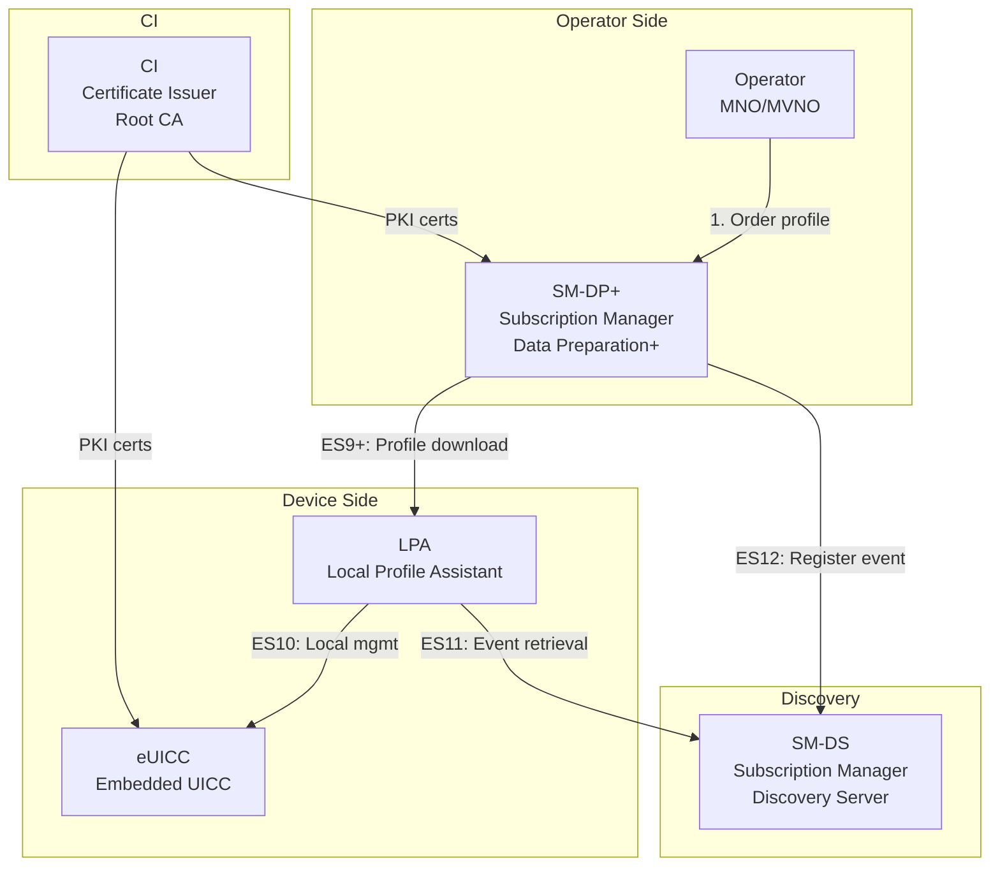
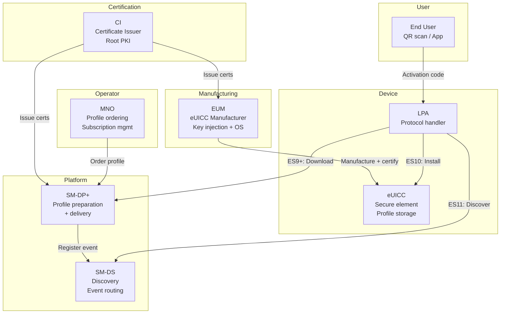
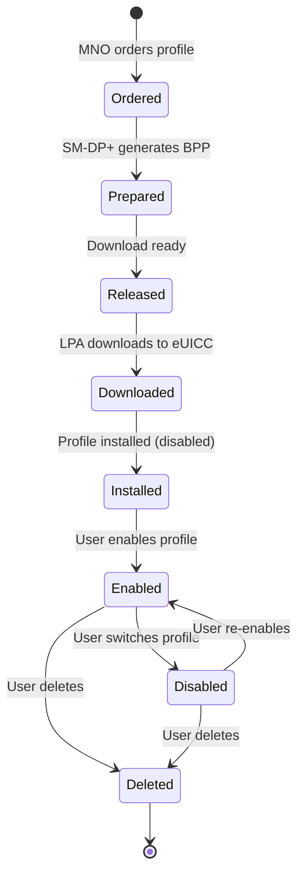

# eSIM & GSMA SGP.22 — Consumer Remote SIM Provisioning

**Topic:** Embedded SIM (eSIM) Architecture, Remote SIM Provisioning (RSP), Profile Management  
**Standards:** GSMA SGP.22 (Consumer RSP), SGP.02 (M2M RSP), SGP.32 (IoT RSP), ETSI TS 102 221  
**SDO:** GSMA, ETSI, GlobalPlatform  
**Audience:** eSIM platform engineers, mobile device architects, MNO product managers, IoT connectivity developers  
**Prerequisites:** UICC smart card architecture, PKI, TLS, mobile network basics

---

## Chapter 1 — Historical Context & Origin Story

### 1.1 SIM Card Evolution

| Era | Form Factor | Standard | Key Feature |
|-----|------------|----------|-------------|
| 1991 | Full-size (1FF) | GSM 11.11 | Credit card size, removable |
| 1996 | Mini-SIM (2FF) | ETSI TS 102 221 | 25×15mm, standard for 15+ years |
| 2003 | Micro-SIM (3FF) | ETSI TS 102 221 | 15×12mm, iPhone 4 (2010) |
| 2012 | Nano-SIM (4FF) | ETSI TS 102 221 | 12.3×8.8mm, current standard |
| 2016 | eUICC (eSIM) | GSMA SGP.22 | Embedded, remote provisioning |
| 2018 | iSIM | GSMA | SIM integrated into SoC die |
| 2023 | iSIM + eSIM coexistence | GSMA SGP.32 | IoT-optimized provisioning |

### 1.2 Why eSIM?

| Problem (Physical SIM) | eSIM Solution |
|------------------------|---------------|
| Logistics (ship SIM cards globally) | Remote provisioning over-the-air |
| Device size constraints (wearables, IoT) | Soldered chip, no slot needed |
| Switching operators requires physical swap | Download new profile remotely |
| M2M devices in remote locations | Remote management without physical access |
| Multi-profile support limited | Multiple profiles, switch without removal |
| Supply chain delays | Instant activation |

---

## Chapter 2 — Standard Architecture & Structure

### 2.1 GSMA eSIM Specification Family

| Specification | Version | Scope |
|--------------|---------|-------|
| SGP.01 | 1.0 | M2M Embedded UICC Architecture |
| SGP.02 | 4.2 | M2M Remote Provisioning (SM-SR + SM-DP) |
| SGP.21 | 2.5 | Consumer RSP Architecture |
| SGP.22 | 3.1 | Consumer RSP Technical Specification |
| SGP.23 | 1.3 | Consumer RSP Test Specification |
| SGP.24 | 1.0 | eSIM IoT Architecture (simplified) |
| SGP.31 | 1.0 | IoT eSIM Architecture |
| SGP.32 | 1.0 | IoT Remote SIM Provisioning |
| SGP.41 | draft | eSIM for Network Equipment |

### 2.2 Consumer RSP Architecture (SGP.22)



---

## Chapter 3 — Technical Deep Dive

### 3.1 Key Entities

| Entity | Role | Location |
|--------|------|----------|
| eUICC | Secure element storing profiles | Soldered in device (or removable eSIM) |
| LPA (Local Profile Assistant) | UI + protocol handler for RSP | Device OS (LPAd) or in eUICC (LPAe) |
| SM-DP+ | Prepares, stores, delivers profiles | Cloud (operator or third-party) |
| SM-DS | Event routing (connects SM-DP+ to eUICC) | Global discovery service |
| CI (Certificate Issuer) | Root PKI for eSIM ecosystem | GSMA-accredited CAs (currently: DigiCert, Symantec/Gemalto CIs) |
| Operator (MNO) | Orders profiles, manages subscriptions | Operator BSS/OSS |
| EUM (eUICC Manufacturer) | Manufactures eUICC, provisions initial keys | Chip manufacturer (Infineon, STMicro, Samsung, etc.) |

### 3.2 Profile Structure

An eSIM profile contains all the data needed to connect to a mobile network:

| Profile Element | Content |
|----------------|---------|
| MF (Master File) | Root of file system |
| ADF USIM | USIM application (IMSI, Ki, OPc, PLMN list) |
| ADF ISIM | IMS application (IMS Private/Public ID) |
| CSIM/CDMA | Legacy (if applicable) |
| NAA (Network Access Application) | Authentication algorithms (MILENAGE/TUAK) |
| Connectivity parameters | APN, PCO, QoS settings |
| OTA keys | Keys for remote profile management |
| Profile metadata | ICCID, profile name, icon, MCC/MNC |

### 3.3 Profile Download Procedure (ES9+)

```mermaid
sequenceDiagram
    participant User
    participant LPA
    participant eUICC
    participant SM-DP+
    participant SM-DS
    
    User->>LPA: Scan QR code / Enter activation code
    Note over LPA: Activation code: SM-DP+ address + matching ID
    LPA->>SM-DP+: ES9+ InitiateAuthentication
    SM-DP+->>LPA: ServerChallenge + serverCert
    LPA->>eUICC: ES10b AuthenticateServer
    Note over eUICC: Verify SM-DP+ cert chain to CI<br/>Generate eUICC challenge + signature
    eUICC-->>LPA: eUICC signature + EID + cert
    LPA->>SM-DP+: ES9+ AuthenticateClient (eUICC signed data)
    Note over SM-DP+: Verify eUICC cert chain to CI<br/>Match EID / confirmation code
    SM-DP+-->>LPA: Bound Profile Package (BPP) segments
    LPA->>eUICC: ES10b LoadBoundProfilePackage
    Note over eUICC: Decrypt + install profile<br/>Store in ISD-P (security domain)
    eUICC-->>LPA: Installation result
    LPA->>User: Profile installed, enable?
    User->>LPA: Enable profile
    LPA->>eUICC: ES10c EnableProfile
    Note over eUICC: Disable current profile<br/>Enable new profile<br/>Reset modem
```

### 3.4 Security Architecture

| Security Mechanism | Purpose | Algorithm |
|-------------------|---------|-----------|
| Mutual TLS (SM-DP+ ↔ LPA) | Transport security | TLS 1.2+ with ECDHE |
| eUICC authentication | Prove eUICC identity | ECDSA (P-256) with eUICC cert |
| SM-DP+ authentication | Prove server identity | ECDSA (P-256) with SM-DP+ cert |
| Profile encryption | Protect profile during download | SCP03t (Secure Channel Protocol) |
| Profile binding | Ensure profile only installs on target eUICC | EID-bound encryption |
| PKI hierarchy | Trust chain | CI → EUM cert → eUICC cert; CI → SM-DP+ cert |

### 3.5 M2M vs Consumer vs IoT RSP

| Feature | M2M (SGP.02) | Consumer (SGP.22) | IoT (SGP.32) |
|---------|-------------|-------------------|-------------|
| Profile push | SM-SR initiates | SM-DP+ + LPA (user-initiated) | Device-initiated or push |
| User interaction | None (unattended) | QR code / activation code | Minimal or none |
| Device type | M2M modules (vehicles, meters) | Smartphones, wearables | Sensors, trackers, constrained |
| Architecture | SM-SR + SM-DP (separate) | SM-DP+ (combined) | eIM (eSIM IoT Manager) |
| Profile switch | SM-SR controlled | User-driven (LPA) | Remote or automatic |
| Connectivity for download | Existing connectivity required | Wi-Fi or bootstrap profile | LPWAN or bootstrap |

---

## Chapter 4 — Implementation Guide

### 4.1 eSIM Integration in Device

| Component | Responsibility | Implementation |
|-----------|---------------|----------------|
| eUICC chip | Secure element, profile storage | Hardware (SiP or SoC-integrated) |
| Modem interface | ISO 7816 / SPI to eUICC | Baseband driver |
| LPA daemon (LPAd) | RSP protocol engine | OS service (Android LPA, iOS LPA) |
| LPA UI (LUId) | User interface for profile mgmt | Settings app / carrier app |
| LPA backend (LBPd) | Business logic bridge to OS | Platform-specific |

### 4.2 Activation Code Format

```
Activation Code: 1$<SM-DP+ address>$<matching ID>[$<OID>]

Example: 1$smdp.example.com$A1B2C3D4E5F6
```

| Field | Description |
|-------|-------------|
| Format version | Always "1" |
| SM-DP+ address | FQDN of the SM-DP+ server |
| Matching ID | Unique identifier to match profile to device |
| OID (optional) | Confirmation code required flag |

### 4.3 Android eSIM Implementation

```mermaid
graph TB
    subgraph "Android eSIM Stack"
        A[Settings UI<br/>Profile management]
        B[EuiccManager API<br/>android.telephony.euicc]
        C[LPA (EuiccService)<br/>Profile download/enable]
        D[Telephony Framework<br/>RIL/modem interface]
        E[eUICC Hardware<br/>Embedded UICC chip]
    end
    
    A --> B --> C --> D --> E
```

**Key Android APIs:**
- `EuiccManager.downloadSubscription()` — Initiate profile download
- `EuiccManager.switchToSubscription()` — Enable a profile
- `EuiccManager.deleteSubscription()` — Remove a profile
- `EuiccManager.getEid()` — Get eUICC identifier

---

## Chapter 5 — Certification & Audit

### 5.1 GSMA eSIM Certification (SAS)

| Certification | Scope | Requirement |
|--------------|-------|-------------|
| SAS-UP (UICC Production) | eUICC manufacturing security | Secure key injection, physical security |
| SAS-SM (Subscription Management) | SM-DP+, SM-DS security | Data center security, key management |
| GSMA SGP.23 | Consumer RSP conformance testing | Protocol compliance |
| GlobalPlatform compliance | Secure element OS | GP Card Spec 2.3+ |

### 5.2 eUICC Security Certification

| Scheme | Level | Application |
|--------|-------|-------------|
| Common Criteria (CC) | EAL4+ | eUICC hardware + OS |
| GSMA eUICC Security Assurance | — | eSIM-specific security evaluation |
| FIPS 140-2/3 | Level 2+ | US government requirements |
| EMVCo | — | If payment applets hosted |

---

## Chapter 6 — Regional & Domain Variants

| Market | eSIM Adoption | Key Driver |
|--------|-------------|-----------|
| US | High (iPhone, Pixel, Samsung) | iPhone 14+ US: eSIM only (no SIM tray) |
| EU | Growing | MVNO support, regulatory push |
| China | Limited (domestic) | China-specific eSIM ecosystem |
| Japan | Moderate | Rakuten Mobile eSIM-first |
| India | Growing (2023+) | Airtel/Jio eSIM support |
| IoT/M2M | High (automotive, logistics) | Remote provisioning essential |
| Wearables | Standard (Apple Watch, Galaxy Watch) | No space for SIM slot |

---

## Chapter 7 — Comparison: SIM Technologies

| Feature | Physical SIM | eSIM (SGP.22) | iSIM | SoftSIM |
|---------|-------------|---------------|------|---------|
| Form factor | Removable card (nano) | Soldered chip (5×6mm) | In SoC die | Software-only |
| Security | Dedicated SE | Dedicated SE | Integrated SE in SoC | TEE/TPM (lower) |
| Profile switch | Physical swap | Remote download | Remote download | Remote download |
| Multi-profile | No (1 active) | Yes (8+ profiles stored) | Yes | Yes |
| Cost (BOM) | ~$0.50 + slot | ~$1-2 (no slot) | ~$0.30 (integrated) | ~$0 (software) |
| Certification | Mature | SAS-UP + CC | New (Arm iSIM, Kigen) | No standard yet |
| Standardization | ETSI TS 102 221 | GSMA SGP.22 | GSMA (WIP) | No formal standard |

---

## Chapter 8 — Mermaid Architecture Diagrams

### 8.1 eSIM Ecosystem End-to-End



### 8.2 Profile Lifecycle



---

## Chapter 9 — Case Studies & Failure Analysis

### 9.1 Apple iPhone 14 (US): eSIM-Only

**Decision:** Apple removed the SIM tray from iPhone 14 (US models, 2022) — the first mainstream smartphone without physical SIM support.

**Technical implementation:** Dual eSIM support (2 active profiles simultaneously). Up to 8 eSIM profiles stored.

**Challenges:** (1) Not all US MVNOs supported eSIM at launch. (2) International travelers needed eSIM-compatible roaming. (3) Device transfer process required profile re-download. (4) Enterprise MDM needed eSIM provisioning APIs.

**Industry impact:** Accelerated eSIM adoption globally. Other OEMs followed (Samsung S24+ in some markets).

### 9.2 Automotive eSIM (M2M)

**Use case:** Connected cars use eSIM (SGP.02) for telematics, OTA updates, emergency calling (eCall), and infotainment connectivity.

**Architecture:** M2M RSP with SM-SR for remote management. Profile switches managed by OEM (not end user). Lifetime: 10-15 years (vehicle lifespan).

**Challenge:** Operator contracts change over vehicle lifetime. eSIM enables switching connectivity provider without physical access to embedded module.

---

## Chapter 10 — Future Evolution & Industry Trends

| Trend | Timeline | Impact |
|-------|----------|--------|
| eSIM-only devices | 2024+ | More OEMs removing SIM trays |
| iSIM (SIM on SoC) | 2024-2026 | Lower BOM cost, smaller form factor |
| SGP.32 IoT RSP | 2024+ | Simplified provisioning for constrained IoT |
| Multi-IMSI profiles | Now | Single profile with multiple operator identities |
| eSIM for enterprise | 2024+ | IT-managed eSIM provisioning via MDM |
| eSIM + Private 5G | 2025+ | Enterprise eSIM for private networks |
| SIMless authentication | Research | Network authentication without SIM/eSIM |
| Blockchain-based identity | Research | Decentralized subscriber identity |

---

## Chapter 11 — Interview Questions & Career Guide

### Tier 1: Entry-Level

**Q1:** What is an eUICC and how does it differ from a traditional UICC (SIM card)?  
**A:** A traditional UICC (SIM card) is a removable smart card with a single operator profile (IMSI, Ki, etc.) programmed during manufacturing. An **eUICC** (embedded UICC) is a secure element (same security level as traditional SIM) that supports **Remote SIM Provisioning** — profiles can be downloaded, installed, enabled, disabled, and deleted over-the-air after manufacturing. Key differences: (1) **Multiple profiles:** eUICC stores 8+ profiles, only one active at a time. (2) **Remote management:** No physical access needed to change operator. (3) **Form factor:** Usually soldered (MFF2 package, 5×6mm) but can be removable. (4) **Same security:** Same Common Criteria EAL4+ certification as traditional SIM.

### Tier 2: Mid-Level

**Q2:** Explain the mutual authentication between eUICC and SM-DP+ during profile download.  
**A:** During ES9+ AuthenticateClient/Server exchange: (1) **SM-DP+ → eUICC:** SM-DP+ sends its certificate (signed by CI) + server challenge. eUICC verifies cert chain to its stored CI root certificate. (2) **eUICC → SM-DP+:** eUICC signs a response (including server challenge + eUICC challenge) using its private key. SM-DP+ verifies eUICC certificate chain to CI. (3) **Result:** Both parties authenticated. Session keys derived for SCP03t secure channel. Profile encrypted specifically for this eUICC (bound to EID). **Critical:** If cert verification fails on either side, download aborts. This prevents: (a) Rogue SM-DP+ delivering malware profiles. (b) Unauthorized eUICCs receiving profiles.

### Tier 3: Senior

**Q3:** Describe the security challenges of eSIM in IoT (SGP.32) vs consumer (SGP.22).  
**A:** **IoT challenges unique to SGP.32:** (1) **No user interface:** Cannot display QR codes or confirmations. Requires unattended provisioning. (2) **Constrained connectivity:** May only have LPWAN (NB-IoT) — limited bandwidth for profile download. Solution: Optimized profile format, smaller certificates. (3) **Device identity bootstrapping:** How to authenticate device without prior connectivity? Solution: Pre-provisioned bootstrap profile or eIM (eSIM IoT Manager) with device attestation. (4) **Massive scale:** Millions of devices need provisioning. Solution: Batch operations, automated workflows via eIM. (5) **Long lifecycle without human intervention:** 10+ years unattended. Solution: Automatic profile recovery, fallback mechanisms. **vs SGP.22:** Consumer has LPA with UI, reliable Wi-Fi/cellular for download, user confirms operations. IoT must handle everything autonomously.

---

## Chapter 12 — Cheat Sheet & Quick Reference

### eSIM Key Terms

```
eUICC:     Embedded UICC (secure element supporting RSP)
EID:       eUICC Identifier (32-digit unique ID)
SM-DP+:    Subscription Manager - Data Preparation+ (profile server)
SM-DS:     Subscription Manager - Discovery Server (event routing)
LPA:       Local Profile Assistant (device-side RSP client)
ISD-P:     Issuer Security Domain - Profile (container for each profile)
ISD-R:     Issuer Security Domain - Root (eUICC OS authority)
ECASD:     eUICC Controlling Authority Security Domain (cert management)
BPP:       Bound Profile Package (encrypted profile for specific eUICC)
CI:        Certificate Issuer (root CA for eSIM ecosystem)
SAS:       Security Accreditation Scheme (GSMA certification)
```

### Interfaces

```
ES9+:   LPA ↔ SM-DP+     (Profile download, HTTPS)
ES10a:  LPA ↔ eUICC      (Service management, APDUs)
ES10b:  LPA ↔ eUICC      (Profile download, APDUs)
ES10c:  LPA ↔ eUICC      (Local profile mgmt, APDUs)
ES11:   LPA ↔ SM-DS      (Event retrieval, HTTPS)
ES12:   SM-DP+ ↔ SM-DS   (Event registration, HTTPS)
```

### Activation Code Format

```
1$<SM-DP+ FQDN>$<Matching ID>[$<OID for confirmation>]
Example: 1$rsp.example.com$ABC123DEF456
```

---

*End of Document — 04_eSIM_GSMA_SGP22.md*
