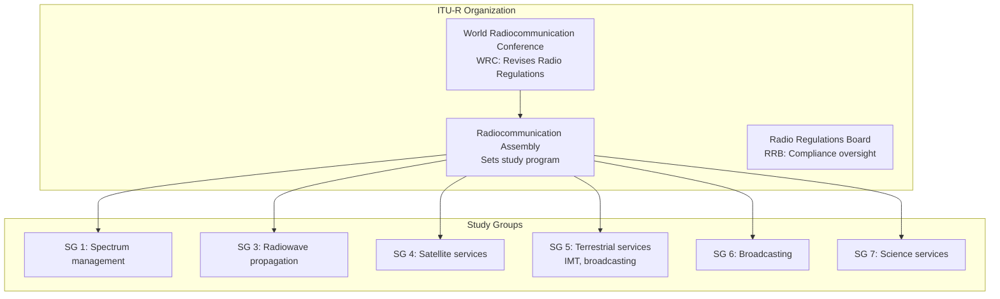
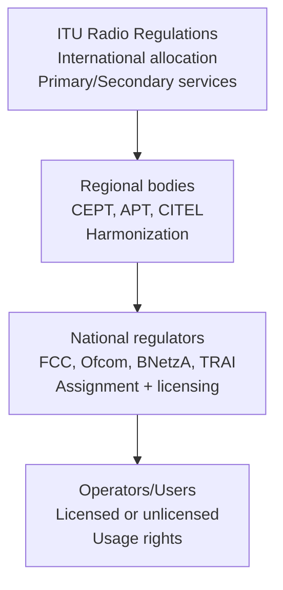

# ITU-R Spectrum Allocation

**Topic:** Radio Spectrum Management, ITU Radio Regulations, WRC Decisions, 5G/6G Band Planning  
**Standards:** ITU Radio Regulations (RR), ITU-R M.2083, M.2150, M.2160, WRC-23 Final Acts  
**SDO:** ITU-R (Radiocommunication Sector), WRC (World Radiocommunication Conference)  
**Audience:** Spectrum policy engineers, RF planning engineers, regulatory affairs professionals, telecom strategists  
**Prerequisites:** Radio wave propagation basics, cellular network concepts, regulatory framework understanding

---

## Chapter 1 — Historical Context & Origin Story

### 1.1 History of Spectrum Governance

| Year | Event | Significance |
|------|-------|-------------|
| 1865 | International Telegraph Union (ITU) founded | First international telecom coordination |
| 1906 | Berlin International Radiotelegraph Convention | First international radio regulations |
| 1927 | Washington Radio Conference | First allocation table by frequency |
| 1947 | ITU becomes UN specialized agency | Global scope, 193 member states |
| 1959 | ITU Radio Regulations established | Binding international treaty |
| 1979 | WARC-79 | Allocated spectrum for 1G mobile (800/900 MHz) |
| 1992 | WRC-92 | IMT-2000 (3G) spectrum identified |
| 2000 | WRC-2000 | Additional 3G bands |
| 2007 | WRC-07 | Digital dividend (700 MHz), IMT-Advanced bands |
| 2015 | WRC-15 | New bands for IMT above 6 GHz identified for study |
| 2019 | WRC-19 | mmWave bands for 5G (24.25-27.5 GHz, 37-43.5 GHz, etc.) |
| 2023 | WRC-23 | Additional mid-band IMT (3.3-3.4 GHz, 3.6-3.8 GHz, 6 GHz studies) |
| 2027 | WRC-27 (planned) | 6G bands, sub-THz studies, upper 6 GHz |

### 1.2 ITU-R Structure



---

## Chapter 2 — Standard Architecture & Structure

### 2.1 ITU Radio Regulations Framework

| Component | Purpose | Legal Status |
|-----------|---------|-------------|
| Radio Regulations (RR) | Global spectrum allocation + procedures | International treaty (binding) |
| Table of Frequency Allocations | Band-by-band service allocation | Part of RR |
| Footnotes (regional) | Region-specific allocations | Treaty force |
| ITU-R Recommendations | Technical standards + guidelines | Non-binding (but reference) |
| WRC Final Acts | Conference decisions | Treaty amendments |
| Resolution/Recommendation | Study mandates, guidelines | WRC policy direction |

### 2.2 ITU Regions

| Region | Coverage | Characteristics |
|--------|----------|----------------|
| Region 1 | Europe, Africa, Middle East, CIS | Conservative allocation, CEPT coordination |
| Region 2 | Americas (North + South) | FCC/ISED-led, auction-based |
| Region 3 | Asia-Pacific | Diverse (dense urban to rural), APT coordination |

### 2.3 Spectrum Allocation Hierarchy



---

## Chapter 3 — Technical Deep Dive

### 3.1 IMT Spectrum Bands

#### FR1: Sub-6 GHz (3GPP Bands)

| Band | Frequency | Bandwidth | Duplex | Region | Primary Use |
|------|-----------|-----------|--------|--------|------------|
| n1 | 2100 MHz | 2×60 MHz | FDD | Global | 3G/4G/5G refarming |
| n3 | 1800 MHz | 2×75 MHz | FDD | Global | LTE capacity, 5G DSS |
| n7 | 2600 MHz | 2×70 MHz | FDD | EU, APAC | LTE/5G capacity |
| n28 | 700 MHz | 2×30-45 MHz | FDD | EU, APAC | 5G coverage layer |
| n41 | 2.5 GHz | 194 MHz | TDD | US (T-Mobile), China | 5G capacity |
| n71 | 600 MHz | 2×35 MHz | FDD | US (T-Mobile) | 5G coverage |
| n77 | 3.3-4.2 GHz | Up to 900 MHz | TDD | US (C-band), APAC | Primary 5G mid-band |
| n78 | 3.3-3.8 GHz | Up to 500 MHz | TDD | EU, Korea, India | Primary 5G mid-band |
| n79 | 4.4-5.0 GHz | Up to 600 MHz | TDD | Japan, China | 5G capacity |

#### FR2: mmWave (24-71 GHz)

| Band | Frequency | Bandwidth | Region | Notes |
|------|-----------|-----------|--------|-------|
| n257 | 26.5-29.5 GHz | 3 GHz | US, Japan, Korea | 28 GHz band |
| n258 | 24.25-27.5 GHz | 3.25 GHz | EU, Japan | 26 GHz band |
| n259 | 39.5-43.5 GHz | 4 GHz | US | 39 GHz band |
| n260 | 37-40 GHz | 3 GHz | US | 37/39 GHz |
| n261 | 27.5-28.35 GHz | 850 MHz | US | LMDS band |
| n262 | 47.2-48.2 GHz | 1 GHz | US | V-band |

### 3.2 Propagation Characteristics by Band

| Frequency Range | Path Loss | Penetration | Range (typical) | Best For |
|----------------|-----------|-------------|-----------------|----------|
| Sub-1 GHz (700/800/900 MHz) | Low | Excellent (buildings) | 10-30 km | Coverage, rural, IoT |
| 1-3 GHz (mid-band) | Moderate | Good | 2-8 km | Urban capacity + coverage |
| 3-6 GHz (C-band) | Moderate-high | Moderate | 1-5 km | 5G capacity |
| 24-40 GHz (mmWave) | High | Poor | 100-500m | Dense urban hotspots |
| 40-71 GHz | Very high | Very poor | <200m | Indoor, fixed wireless |
| 100-300 GHz (sub-THz) | Extreme | Minimal | <50m | 6G research |

### 3.3 Shannon Capacity and Bandwidth

The theoretical channel capacity follows Shannon's theorem:

$$C = B \cdot \log_2(1 + \text{SNR})$$

Where:
- $C$ = channel capacity (bps)
- $B$ = bandwidth (Hz)
- $\text{SNR}$ = signal-to-noise ratio (linear)

**Implication for spectrum:** Doubling bandwidth doubles capacity (linear), while doubling SNR gives diminishing returns (logarithmic). This drives the push for wider bandwidths at higher frequencies.

### 3.4 WRC-23 Key Decisions

| Decision | Bands | Impact |
|----------|-------|--------|
| IMT identification: 3.3-3.4 GHz (Region 2) | 100 MHz | New mid-band for Americas |
| IMT identification: 3.6-3.8 GHz (Region 1 parts) | 200 MHz | More C-band in Africa/Middle East |
| 6 GHz upper (6.425-7.125 GHz) | 700 MHz | Studies for WRC-27 (IMT vs Wi-Fi) |
| 4.4-4.8 GHz (Region 1/Region 2) | 400 MHz | New IMT bands |
| Satellite (12 GHz, LEO) | Various | Direct-to-device spectrum sharing |
| Agenda for WRC-27 | — | Sub-THz studies, upper 6 GHz, more mmWave |

---

## Chapter 4 — Implementation Guide

### 4.1 National Spectrum Licensing Models

| Model | Description | Example |
|-------|-------------|---------|
| Auction | Competitive bidding for exclusive licenses | FCC (US), Ofcom (UK), BNetzA (DE) |
| Beauty contest | Merit-based assignment | Historical (declining use) |
| Administrative assignment | Government assigns to entities | Military, public safety |
| Unlicensed | Shared access with power/duty limits | 2.4/5/6 GHz (Wi-Fi), ISM |
| Licensed Shared Access (LSA) | Dynamic sharing with incumbent | EU CBRS-equivalent |
| CBRS (US) | Three-tier sharing (incumbent/PAL/GAA) | 3.5 GHz (US), dynamic SAS |
| Dynamic Spectrum Access (DSA) | Real-time sharing via database | TV white spaces, CBRS SAS |

### 4.2 Spectrum Valuation

| Method | Approach | Use |
|--------|----------|-----|
| Benchmarking | Compare prices from other countries | Pre-auction reserve pricing |
| DCF (Discounted Cash Flow) | Revenue potential from spectrum use | Operator business case |
| $/MHz/pop | Price per MHz per population covered | Cross-country comparison |
| Opportunity cost | Value of next-best alternative use | Policy decisions |

**Typical 5G mid-band auction prices:**
- US C-band (3.7 GHz): ~$1.2/MHz/pop (2021, record $81B total)
- India 3.3 GHz: ~$0.03/MHz/pop (2022)
- Germany 3.6 GHz: ~$0.20/MHz/pop (2019)

---

## Chapter 5 — Certification & Audit

### 5.1 Regulatory Approval for Radio Equipment

| Region | Regulator | Requirement | Key Standard |
|--------|-----------|-------------|--------------|
| Global | ITU-R | Frequency coordination | Radio Regulations |
| US | FCC | Equipment authorization (Part 15/22/24/27) | 47 CFR |
| EU | CE (RED) | Radio Equipment Directive 2014/53/EU | ETSI EN harmonized |
| UK | Ofcom | Radio equipment conformity (UKCA) | SI 2017/1206 |
| Japan | MIC/TELEC | Technical conformity | ARIB standards |
| China | MIIT/SRRC | Type approval | National standards |
| India | WPC/TEC | Equipment type approval | TEC standards |

### 5.2 EMC and RF Testing

| Test | Standard | Purpose |
|------|----------|---------|
| Spurious emissions | ETSI EN 301 908 / FCC Part 27 | Protect adjacent bands |
| Out-of-band emissions | 3GPP TS 38.104 (ACLR, SEM) | Coexistence |
| Receiver blocking | 3GPP TS 38.101 | Interference resilience |
| SAR (Specific Absorption Rate) | IEEE C95.1, ICNIRP | Human exposure safety |
| Coexistence studies | ITU-R M-series | Sharing with incumbents |

---

## Chapter 6 — Regional & Domain Variants

### 6.1 5G Mid-Band Allocation Comparison

| Country | Band | Total MHz | Operators | Assignment Method |
|---------|------|-----------|-----------|------------------|
| US | 3.7-3.98 GHz (C-band) | 280 MHz | 3 (Verizon, AT&T, T-Mobile) | Auction (2021) |
| Germany | 3.4-3.8 GHz | 400 MHz | 4 | Auction (2019) |
| South Korea | 3.42-3.7 GHz | 280 MHz | 3 | Auction (2018) |
| Japan | 3.6-4.1 GHz + 4.5-4.6 GHz | 600 MHz | 4 | Administrative |
| China | 3.3-3.6 GHz + 4.8-5.0 GHz | 500 MHz | 3 | Administrative |
| India | 3.3-3.67 GHz | 370 MHz | 3 | Auction (2022) |
| UK | 3.4-3.8 GHz | 400 MHz | 4 | Auction (2018/2021) |

### 6.2 Spectrum for Specific Use Cases

| Use Case | Band | Rationale |
|----------|------|-----------|
| 5G wide-area coverage | 700 MHz (n28) | Low propagation loss, building penetration |
| 5G urban capacity | 3.5 GHz (n78) | Balance of capacity and range |
| 5G hotspots | 26/28 GHz (n258/n257) | Massive bandwidth (400 MHz/carrier) |
| NB-IoT | In-band LTE (180 kHz) | Reuse existing spectrum |
| C-V2X | 5.9 GHz (n47) | Dedicated for ITS |
| Private 5G | 3.7-3.8 GHz (DE), CBRS (US) | Local licensing for industry |
| Satellite (NTN) | L/S-band (1-4 GHz) | Long-range, global coverage |

---

## Chapter 7 — Comparison: Spectrum Allocation Approaches

| Approach | Efficiency | Revenue | Innovation | Equity |
|----------|-----------|---------|-----------|--------|
| Auction (sealed-bid) | High | Maximum | Concentrated (wealthy bidders) | Low |
| Auction (CCA/SMRA) | High | High | Moderately concentrated | Moderate |
| Beauty contest | Low-moderate | Low | Diverse entrants | High |
| Administrative | Low | None | Government-directed | Variable |
| Unlicensed | Medium (shared) | None | Very high (Wi-Fi!) | High |
| Dynamic sharing (CBRS) | High | Moderate | High | High |

---

## Chapter 8 — Mermaid Architecture Diagrams

### 8.1 Global Spectrum Governance

```mermaid
graph TB
    subgraph "International"
        ITU[ITU-R<br/>Radio Regulations<br/>WRC decisions]
    end
    
    subgraph "Regional"
        CEPT[CEPT/ECC<br/>Europe]
        APT[APT<br/>Asia-Pacific]
        CITEL[CITEL<br/>Americas]
        ATU[ATU<br/>Africa]
    end
    
    subgraph "National"
        FCC[FCC (US)]
        Ofcom[Ofcom (UK)]
        BNetzA[BNetzA (DE)]
        TRAI[TRAI (India)]
        MIIT[MIIT (China)]
        MIC[MIC (Japan)]
    end
    
    ITU --> CEPT
    ITU --> APT
    ITU --> CITEL
    ITU --> ATU
    CEPT --> Ofcom
    CEPT --> BNetzA
    APT --> TRAI
    APT --> MIIT
    APT --> MIC
    CITEL --> FCC
```

### 8.2 5G Spectrum Layers

```mermaid
graph LR
    subgraph "Coverage Layer"
        A[Sub-1 GHz<br/>700/800/900 MHz<br/>Range: 10-30 km<br/>BW: 10-20 MHz]
    end
    
    subgraph "Capacity Layer"
        B[1-6 GHz<br/>Mid-band (C-band)<br/>Range: 1-5 km<br/>BW: 40-100 MHz]
    end
    
    subgraph "Hotspot Layer"
        C[24-71 GHz<br/>mmWave<br/>Range: 100-500m<br/>BW: 100-400 MHz]
    end
    
    A --> B --> C
```

---

## Chapter 9 — Case Studies & Failure Analysis

### 9.1 US C-Band Auction (Auction 107, 2021)

**Background:** FCC auctioned 280 MHz (3.7-3.98 GHz) of C-band spectrum previously used by satellite downlinks.

**Result:** $81.17 billion — highest-grossing spectrum auction in history. Verizon: $45.5B (161 MHz avg), AT&T: $23.4B (80 MHz avg).

**Challenge:** Aviation interference concerns (radar altimeters use 4.2-4.4 GHz). FAA raised safety issues. Resolution: Buffer zones around airports + power limits near runways + staged deployment (2022-2023).

**Lesson:** Coexistence with incumbents (satellite, aviation) requires extensive sharing studies before allocation.

### 9.2 6 GHz: IMT vs Wi-Fi Battle

**Conflict:** The 6 GHz band (5.925-7.125 GHz = 1200 MHz) is contested between:
- **Wi-Fi camp:** Wants unlicensed access (Wi-Fi 6E/7). US FCC opened full 1200 MHz for unlicensed (2020).
- **IMT camp:** Wants licensed mobile (5G/6G). China, some of Africa/Middle East favor IMT.

**WRC-23 outcome:** Studies for WRC-27 on upper 6 GHz (6.425-7.125 GHz) for IMT in Region 1. Lower 6 GHz remains unlicensed in Region 2.

**Stakes:** 1200 MHz of contiguous spectrum would be transformative for either technology. Decision shapes connectivity landscape for a decade.

---

## Chapter 10 — Future Evolution & Industry Trends

| Trend | Timeline | Spectrum Impact |
|-------|----------|----------------|
| 6G sub-THz bands (100-300 GHz) | WRC-27/31 | New allocations for sensing + communication |
| Upper 6 GHz (6.425-7.125 GHz) | WRC-27 | IMT vs Wi-Fi resolution |
| Dynamic Spectrum Sharing (DSS) | Now | LTE/NR coexistence in same band |
| AI-driven spectrum management | 2025+ | Real-time optimization, CBRS automation |
| Non-Terrestrial Networks (NTN) | Now | Satellite-terrestrial spectrum sharing |
| Direct-to-device (D2D) satellite | 2024+ | Sharing studies in L/S-band |
| Private network spectrum | Growing | Local licensing (Germany, UK, Japan model) |
| Spectrum trading/leasing | Mature (US/UK) | Secondary market efficiency |

---

## Chapter 11 — Interview Questions & Career Guide

### Tier 1: Entry-Level

**Q1:** What is the role of WRC and how does spectrum get allocated internationally?  
**A:** **WRC (World Radiocommunication Conference)** meets every 3-4 years (under ITU-R) to revise the Radio Regulations — the international treaty governing spectrum use. **Process:** (1) WRC sets agenda items for next conference. (2) ITU-R Study Groups conduct technical studies (sharing, propagation). (3) Regional bodies (CEPT, APT, CITEL) develop common proposals. (4) WRC delegates negotiate and adopt changes to the Table of Frequency Allocations. (5) National regulators implement WRC decisions domestically. **Allocation types:** Primary (full protection), Secondary (no interference to primary), Identified (for a specific service like IMT, via footnote). WRC decisions take 5-10 years from study to commercial use.

### Tier 2: Mid-Level

**Q2:** Explain the trade-offs between sub-6 GHz and mmWave for 5G deployment.  
**A:** **Sub-6 GHz (e.g., 3.5 GHz / n78):** Advantages: (1) Moderate propagation — 1-5 km cells achievable. (2) Building penetration acceptable. (3) Reasonable bandwidth (100 MHz). (4) MIMO gains at this frequency. Disadvantages: Limited total bandwidth (~300-400 MHz available). **mmWave (e.g., 28 GHz / n257):** Advantages: (1) Massive bandwidth (400 MHz per carrier, GHz total). (2) Spatial reuse (short range = frequency reuse). (3) Pencil beamforming with large antenna arrays. Disadvantages: (1) Path loss: $PL \propto f^2$ (20 dB more than 3.5 GHz). (2) No building penetration. (3) Blocked by foliage, rain attenuation. (4) Requires dense small cells ($$$). **Conclusion:** Layered approach: sub-1 GHz (coverage) + mid-band (capacity) + mmWave (hotspots). Mid-band (3-6 GHz) emerged as the "sweet spot" for 5G.

---

## Chapter 12 — Cheat Sheet & Quick Reference

### Key Spectrum Facts

```
ITU Regions: Region 1 (Europe/Africa), Region 2 (Americas), Region 3 (Asia-Pacific)
WRC cycle: Every 3-4 years (last: WRC-23, next: WRC-27)
Radio Regulations: International treaty, binding on 193 states
5G primary mid-band: 3.3-3.8 GHz (n78) globally
5G mmWave: 24.25-29.5 GHz (n257/n258), 37-43.5 GHz
Unlicensed: 2.4 GHz, 5 GHz, 6 GHz (Wi-Fi)
Path loss formula: PL(dB) = 32.4 + 20·log₁₀(f_MHz) + 20·log₁₀(d_km) [free space]
Shannon: C = B·log₂(1+SNR)
```

### 5G Band Categories

```
Coverage:  <1 GHz (n28=700MHz, n71=600MHz) — rural, indoor, IoT
Capacity:  1-6 GHz (n78=3.5GHz, n77=C-band, n41=2.5GHz) — urban
Hotspot:   24-71 GHz (n257=28GHz, n258=26GHz, n261=28GHz) — dense urban
```

---

*End of Document — 05_ITU_R_Spectrum_Allocation.md*
