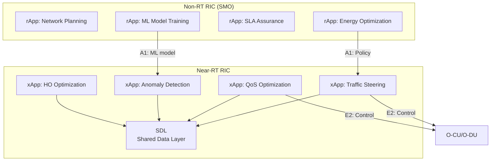

# OpenRAN Architecture

**Topic:** Open Radio Access Network — Disaggregated RAN, O-RAN Alliance Specifications, RIC, Open Fronthaul  
**Standards:** O-RAN Alliance (WG1-WG11), 3GPP TS 38.401, eCPRI (ETSI GS 110-003), TIP OpenRAN  
**SDO:** O-RAN Alliance, 3GPP, ETSI, Telecom Infra Project (TIP)  
**Audience:** RAN architects, network engineers, telecom cloud engineers, O-RAN xApp/rApp developers  
**Prerequisites:** 5G NR architecture, cloud-native concepts (containers, Kubernetes), 3GPP CU/DU/RU split

---

## Chapter 1 — Historical Context & Origin Story

### 1.1 Traditional RAN vs Open RAN

| Aspect | Traditional RAN | Open RAN |
|--------|----------------|----------|
| Architecture | Proprietary, integrated (single vendor) | Disaggregated, multi-vendor |
| Interfaces | Proprietary (vendor lock-in) | Open, standardized (O-RAN specs) |
| Hardware | Purpose-built (ASIC) | COTS (Commercial Off-The-Shelf) + accelerators |
| Software | Monolithic, vendor-specific | Modular, cloud-native |
| Intelligence | Static, rule-based | AI/ML-driven (RIC) |
| Deployment | Physical appliances | Virtualized/containerized (O-Cloud) |
| Cost model | High CAPEX, single-vendor support | Lower CAPEX, multi-vendor ecosystem |

### 1.2 Timeline

| Year | Event |
|------|-------|
| 2016 | xRAN Forum founded (AT&T, SK Telecom, Deutsche Telekom) |
| 2018 | C-RAN Alliance (China) |
| 2018 | O-RAN Alliance formed (merger of xRAN + C-RAN) |
| 2018 | TIP OpenRAN project launched (Facebook/Meta-led) |
| 2019 | O-RAN specifications first release |
| 2020 | Rakuten Mobile launches world's first fully virtualized OpenRAN network |
| 2021 | DISH Network selects OpenRAN for greenfield 5G (US) |
| 2022 | Deutsche Telekom, Vodafone announce Open RAN deployments |
| 2023 | O-RAN Alliance TIFG (Test & Integration Focus Group) matures |
| 2024 | Major operators scale Open RAN (production-grade) |

---

## Chapter 2 — Standard Architecture & Structure

### 2.1 O-RAN Alliance Working Groups

| WG | Focus | Key Deliverable |
|----|-------|-----------------|
| WG1 | Use cases and overall architecture | O-RAN architecture description |
| WG2 | Non-RT RIC and A1 interface | rApp framework, A1 policy |
| WG3 | Near-RT RIC and E2 interface | xApp framework, E2 service model |
| WG4 | Open Fronthaul | CUS-plane + M-plane specs |
| WG5 | Open F1/W1/E1/X2/Xn | 3GPP interface profiling for multi-vendor |
| WG6 | Cloudification and orchestration | O-Cloud, SMO architecture |
| WG7 | White-box hardware | Reference designs for O-RU, O-DU |
| WG8 | Stack reference design | L1/L2/L3 software architecture |
| WG9 | Open X-haul transport | Fronthaul/midhaul/backhaul transport |
| WG10 | OAM (Operations & Maintenance) | O1 interface, YANG models |
| WG11 | Security | Threat modeling, interface security |

### 2.2 O-RAN Logical Architecture

```mermaid
graph TB
    subgraph "SMO (Service Management & Orchestration)"
        SMO_NRT[Non-RT RIC<br/>rApps<br/>AI/ML training<br/>Policy (>1s)]
        SMO_OAM[O1: OAM<br/>Configuration<br/>PM/FM]
    end
    
    subgraph "Near-RT RIC"
        NRT[Near-RT RIC<br/>xApps<br/>RRM optimization<br/>(10ms-1s)]
    end
    
    subgraph "O-RAN RAN"
        O_CU_CP[O-CU-CP<br/>RRC, PDCP-C]
        O_CU_UP[O-CU-UP<br/>SDAP, PDCP-U]
        O_DU[O-DU<br/>RLC, MAC, High-PHY]
        O_RU[O-RU<br/>Low-PHY, RF]
    end
    
    SMO_NRT -->|A1: Policy| NRT
    SMO_OAM -->|O1: Config/PM/FM| O_CU_CP
    SMO_OAM -->|O1| O_DU
    SMO_OAM -->|O1| O_RU
    NRT -->|E2: RAN control| O_CU_CP
    NRT -->|E2| O_DU
    O_CU_CP -->|F1-C| O_DU
    O_CU_UP -->|F1-U| O_DU
    O_CU_CP -->|E1| O_CU_UP
    O_DU -->|Open Fronthaul<br/>(7.2x split)| O_RU
```

---

## Chapter 3 — Technical Deep Dive

### 3.1 O-RAN Interfaces

| Interface | Between | Protocol/Transport | Purpose |
|-----------|---------|-------------------|---------|
| A1 | Non-RT RIC ↔ Near-RT RIC | HTTP/REST (JSON) | Policy management, ML model deployment |
| E2 | Near-RT RIC ↔ O-CU/O-DU | ASN.1 over SCTP | Near-real-time RAN control |
| O1 | SMO ↔ O-RAN NFs | NETCONF/YANG, VES | Configuration, PM, FM |
| O2 | SMO ↔ O-Cloud | REST APIs | Cloud resource management |
| Open Fronthaul (CUS) | O-DU ↔ O-RU | eCPRI/UDP/IP or eCPRI/Ethernet | IQ data (C/U-plane), sync (S-plane) |
| Open Fronthaul (M) | SMO ↔ O-RU | NETCONF/YANG | O-RU management |
| F1 | O-CU ↔ O-DU | 3GPP F1AP/GTP-U | CU-DU interface (3GPP standard) |
| E1 | O-CU-CP ↔ O-CU-UP | 3GPP E1AP | CU-CP to CU-UP control |

### 3.2 RAN Intelligent Controller (RIC)

#### Non-RT RIC (> 1 second timescale)

| Function | Description |
|----------|------------|
| rApp hosting | Third-party applications for RAN optimization |
| AI/ML training | Train models on historical data, deploy to Near-RT RIC |
| A1 policy | Send policies (e.g., load balancing, handover thresholds) |
| R1 interface | Internal SMO integration |
| Data enrichment | Augment RAN data with external sources |

#### Near-RT RIC (10ms - 1 second timescale)

| Function | Description |
|----------|------------|
| xApp hosting | Real-time RAN optimization applications |
| E2 interface | Subscribe to RAN indicators, send control actions |
| Conflict mitigation | Resolve conflicting xApp actions |
| SDL (Shared Data Layer) | In-memory database (Redis-based) for xApp state |
| A1 policy reception | Receive policies from Non-RT RIC |

### 3.3 xApp Examples

| xApp | Function | Timescale | E2 Service Model |
|------|----------|-----------|-----------------|
| Traffic steering | Load balancing across cells | 100ms-1s | RC (RAN Control) |
| Handover optimization | Reduce ping-pong, optimize HO params | 100ms | RC |
| Anomaly detection | Detect RAN anomalies (interference, failure) | ~1s | KPM (Key Performance Measurement) |
| QoS optimization | Per-UE/per-slice QoS control | 10-100ms | RC |
| Energy saving | Cell on/off, capacity adaptation | ~1s | RC |
| Massive MIMO beamforming | Beam management optimization | 10ms | — |

### 3.4 Open Fronthaul (O-RAN WG4)

```mermaid
graph TB
    subgraph "O-DU"
        A[High-PHY<br/>Channel coding<br/>Scrambling<br/>Modulation<br/>Layer mapping<br/>Precoding]
    end
    
    subgraph "O-RU"
        B[Low-PHY<br/>iFFT/FFT<br/>CP add/remove<br/>Beamforming<br/>Digital/Analog RF]
    end
    
    subgraph "Fronthaul Planes"
        C[C-Plane<br/>Control: scheduling,<br/>beamforming commands]
        D[U-Plane<br/>User data: IQ samples<br/>(frequency domain)]
        E[S-Plane<br/>Synchronization:<br/>IEEE 1588 PTP]
        F[M-Plane<br/>Management:<br/>NETCONF/YANG]
    end
    
    A -->|eCPRI| C --> B
    A -->|eCPRI| D --> B
    E --> B
    F --> B
```

**Key Parameters:**

| Parameter | Value | Impact |
|-----------|-------|--------|
| Split point | 7.2x (between high-PHY and low-PHY) | Defines FH bandwidth requirement |
| Bandwidth per cell sector (100 MHz, 4T4R) | ~25 Gbps | High FH capacity needed |
| Max latency (one-way) | ~100 μs | Requires low-latency transport |
| Protocol | eCPRI (Type 1: UDP/IP, Type 2: Ethernet) | Packet-based |
| Compression | BFP (Block Floating Point), μ-law | Reduces bandwidth by 30-50% |

### 3.5 O-Cloud Architecture

```mermaid
graph TB
    subgraph "O-Cloud Platform"
        A[Kubernetes/Container Orchestration]
        B[Hardware Acceleration<br/>FPGA, GPU, Look-Aside accelerators]
        C[COTS Server<br/>x86/ARM]
        D[DPDK / SR-IOV<br/>High-performance networking]
    end
    
    subgraph "O-RAN Network Functions"
        E[O-CU-CP<br/>Container]
        F[O-CU-UP<br/>Container]
        G[O-DU<br/>Container/VM<br/>(real-time)]
    end
    
    E --> A
    F --> A
    G --> A
    A --> C
    A --> B
    A --> D
```

---

## Chapter 4 — Implementation Guide

### 4.1 Open RAN Deployment Models

| Model | Description | Example |
|-------|-------------|---------|
| Greenfield | New network built entirely on Open RAN | DISH (US), Rakuten (Japan) |
| Brownfield overlay | Open RAN in new sites/bands alongside legacy | DT, Vodafone |
| Rural/coverage extension | Open RAN for cost-effective rural deployment | Parallel Wireless, Mavenir |
| Private network | Enterprise/factory Open RAN | Industry 4.0, airports |
| Indoor (small cell) | Open RAN for indoor coverage | Enterprises, venues |

### 4.2 Hardware Stack

| Layer | Component | Options |
|-------|-----------|---------|
| O-RU | Radio unit (RF + low-PHY) | Fujitsu, Samsung, Comba, Benetel |
| O-DU server | Real-time processing | Dell, HPE, Supermicro (with FPGA/accelerator) |
| O-CU server | Non-real-time processing | Standard x86 servers |
| Accelerator | L1 processing offload | Intel FlexRAN (ACC100/200), Xilinx T1/T2 |
| Fronthaul switch | eCPRI switching | IP/Ethernet switches with PTP |
| Near-RT RIC | xApp platform | Standard cloud server |

### 4.3 Software Stack

| Component | Open Source Options | Commercial Options |
|-----------|-------------------|-------------------|
| O-DU L1/L2 | FlexRAN (Intel), ORAN SC | Mavenir, Radisys, Phluido |
| O-CU | ORAN SC (O-RAN Software Community) | Nokia, Ericsson (ORAN-compliant), Mavenir |
| Near-RT RIC | ORAN SC (RIC platform) | VMware (Dish), Wind River |
| Non-RT RIC | ORAN SC (SMO/Non-RT RIC) | Amdocs, Ericsson |
| O-Cloud | StarlingX, OpenStack, K8s | Red Hat OpenShift, Wind River Cloud Platform |

---

## Chapter 5 — Certification & Audit

### 5.1 O-RAN Certification

| Certification | Body | Scope |
|--------------|------|-------|
| O-RAN conformance | OTIC (O-RAN Testing & Integration Centers) | Interface conformance (E2, A1, O1, FH) |
| O-RAN interoperability | OTIC | Multi-vendor component testing |
| O-RAN end-to-end | OTIC | Full stack validation |
| Security certification | O-RAN WG11 + GSMA NESAS | O-RAN-specific security testing |
| TIP certification | TIP Community Labs | TIP OpenRAN compliance |

### 5.2 OTIC Locations

| OTIC | Location | Focus |
|------|----------|-------|
| OTIC Germany (DT) | Berlin | European Open RAN |
| OTIC Japan (KDDI/NTT) | Tokyo | APAC Open RAN |
| OTIC US (US Ignite) | Various | North America |
| OTIC India (TSDSI) | Bangalore | India Open RAN |
| OTIC Korea (TTA) | Seoul | Korean vendors |

---

## Chapter 6 — Regional & Domain Variants

| Region | Open RAN Policy | Key Deployments |
|--------|----------------|-----------------|
| US | Strong government support (NTIA/DoD) | DISH (greenfield), AT&T (pilots) |
| Germany | DT "O-RAN Town" (Neubrandenburg) | Multi-vendor live network |
| UK | Vodafone Open RAN commitments | Rural + urban sites |
| Japan | Rakuten Mobile (100% virtualized) | Largest Open RAN network |
| India | Government mandate (BSNL/MTNL) | Major OpenRAN tender |
| South Korea | SK Telecom, KT pilots | Domestic vendor ecosystem |

---

## Chapter 7 — Comparison: Traditional RAN vs Open RAN

| Criterion | Traditional RAN | Open RAN |
|-----------|----------------|----------|
| Vendor diversity | Single vendor per site | Multi-vendor (mix & match) |
| Time-to-market (new features) | Vendor roadmap dependent | xApp ecosystem (faster innovation) |
| CAPEX | Higher (proprietary HW) | Lower potential (COTS) |
| OPEX | Lower (single-vendor SLA) | Higher complexity (integration) |
| Performance (Day 1) | Optimized (years of tuning) | Maturing (improving rapidly) |
| Security surface | Smaller (integrated, opaque) | Larger (more interfaces to secure) |
| Scalability | Vertical | Horizontal (cloud-native) |
| Fronthaul bandwidth | Proprietary (optimized) | Open (eCPRI, higher overhead) |
| AI/ML integration | Vendor-internal | Open (RIC + xApps/rApps) |
| Ecosystem | Ericsson, Nokia, Samsung, Huawei | +Mavenir, Parallel Wireless, Altiostar, Radisys, etc. |

---

## Chapter 8 — Mermaid Architecture Diagrams

### 8.1 Complete O-RAN Architecture

```mermaid
graph TB
    subgraph "Service Management & Orchestration (SMO)"
        NRTRIC[Non-RT RIC<br/>rApps<br/>AI/ML training<br/>Policy management]
        OAM[O-RAN OAM<br/>FCAPS]
        O2_IF[O2 Interface<br/>Cloud lifecycle]
    end
    
    subgraph "Near-RT RIC Platform"
        NRTRIC_P[Near-RT RIC<br/>xApps<br/>E2 termination<br/>A1 policy handler<br/>SDL database]
    end
    
    subgraph "O-RAN RAN Nodes"
        OCU_CP[O-CU-CP]
        OCU_UP[O-CU-UP]
        ODU[O-DU]
        ORU[O-RU]
    end
    
    subgraph "O-Cloud Infrastructure"
        OCLOUD[O-Cloud<br/>Kubernetes<br/>COTS servers<br/>Accelerators]
    end
    
    subgraph "Transport"
        FH[Fronthaul<br/>eCPRI]
        MH[Midhaul<br/>IP/MPLS]
        BH[Backhaul<br/>IP/MPLS]
    end
    
    NRTRIC -->|A1| NRTRIC_P
    OAM -->|O1| OCU_CP
    OAM -->|O1| ODU
    OAM -->|O1/M-plane| ORU
    NRTRIC_P -->|E2| OCU_CP
    NRTRIC_P -->|E2| ODU
    OCU_CP -->|E1| OCU_UP
    OCU_CP -->|F1-C| ODU
    OCU_UP -->|F1-U| ODU
    ODU -->|Open FH (7.2x)| ORU
    O2_IF --> OCLOUD
    OCU_CP --> OCLOUD
    OCU_UP --> OCLOUD
    ODU --> OCLOUD
```

### 8.2 xApp / rApp Ecosystem



---

## Chapter 9 — Case Studies & Failure Analysis

### 9.1 Rakuten Mobile — World's First Cloud-Native Mobile Network

**Architecture:** 100% virtualized RAN + Core. No legacy equipment. Fully disaggregated (CU/DU/RU from multiple vendors). Kubernetes-based O-Cloud. Proprietary Rakuten Communications Platform (RCP) orchestration.

**Results:** (1) 40% lower CAPEX vs traditional. (2) Zero-touch operations (automated). (3) Covers 98% of Japan population. (4) Licensed RCP to other operators (1&1, Liantis).

**Challenges:** (1) Initial performance gaps (hand-off, coverage edge). (2) Integration complexity with multiple vendors. (3) First-mover disadvantage (uncharted problems). (4) Financial strain (high initial investment despite lower CAPEX promise).

### 9.2 Open RAN Security Concerns

**Challenge:** O-RAN introduces more interfaces → larger attack surface than integrated RAN.

**Specific risks:** (1) E2 interface: xApp could inject malicious RAN control. (2) Open Fronthaul: IQ sample interception/manipulation. (3) Multi-vendor trust: No single entity responsible for security. (4) O-Cloud: Container escape, K8s vulnerabilities.

**Mitigations (O-RAN WG11):** (1) Mutual TLS on all interfaces. (2) Zero-trust architecture. (3) xApp sandboxing and conflict resolution. (4) Security testing (OTIC). (5) NESAS extension for O-RAN components.

---

## Chapter 10 — Future Evolution & Industry Trends

| Trend | Timeline | Impact |
|-------|----------|--------|
| AI-native RAN (Rel-18+ xApps) | 2024+ | ML-driven scheduling, beamforming |
| Full-stack commercial maturity | 2025 | Performance parity with traditional RAN |
| Energy-efficient Open RAN | 2024+ | AI-driven cell sleep, load balancing |
| Open RAN for mmWave | 2025+ | High-frequency disaggregated RAN |
| RIC marketplace | 2024+ | Third-party xApp/rApp ecosystem |
| Converged Open RAN + private 5G | Now | Enterprise Open RAN solutions |
| O-RAN + NTN (satellite) | 2026+ | Non-terrestrial Open RAN |
| 6G Open Architecture | 2028+ | AI-native, semantic, disaggregated |

---

## Chapter 11 — Interview Questions & Career Guide

### Tier 1: Entry-Level

**Q1:** What is Open RAN and how does it differ from traditional RAN?  
**A:** **Open RAN** disaggregates the base station into open, standardized components (O-CU, O-DU, O-RU) from potentially different vendors, connected by open interfaces (O-RAN Alliance specifications). **Traditional RAN** is a vertically integrated system from a single vendor (Ericsson, Nokia, Huawei) with proprietary interfaces. **Key differences:** (1) **Open interfaces:** A1, E2, O1, Open Fronthaul (vs proprietary). (2) **Multi-vendor:** Mix Radio Units from one vendor with DU software from another. (3) **Intelligence:** RAN Intelligent Controller (RIC) adds AI/ML-based optimization via xApps/rApps. (4) **Cloud-native:** Runs on COTS hardware + containers (vs custom appliances). (5) **Ecosystem:** Third-party innovation through xApp marketplace.

### Tier 2: Mid-Level

**Q2:** Explain the E2 interface and its role in Near-RT RIC.  
**A:** **E2** is the interface between the Near-RT RIC and O-RAN network elements (O-CU-CP, O-CU-UP, O-DU). It enables near-real-time control (10ms to 1s granularity). **Protocol:** E2AP (ASN.1-encoded) over SCTP. **Service models:** Define what data RAN exposes and what control xApps can exercise: (1) **KPM (Key Performance Measurement):** Subscribe to UE/cell metrics (throughput, latency, CQI). (2) **RC (RAN Control):** Insert control actions (handover, scheduling priority, traffic steering). (3) **NI (Network Interface):** Message routing. **Procedures:** E2 Setup, RIC Subscription (periodic/event-triggered reporting), RIC Control (insert/policy). **Example flow:** xApp subscribes to KPM for cell load metrics → detects imbalance → sends RC control to trigger handover for specific UEs.

### Tier 3: Senior

**Q3:** What are the key challenges in Open Fronthaul (7.2x split) implementation?  
**A:** (1) **Bandwidth:** 100 MHz 4T4R cell needs ~25 Gbps raw (IQ samples). Even with BFP compression (50%), ~12.5 Gbps per cell. Massive MIMO (64T64R) multiplies this. (2) **Latency:** One-way FH latency must be <100 μs (includes propagation + switching + processing). Limits fiber distance to ~10-20 km. (3) **Synchronization:** O-RU requires <±65 ns time alignment (IEEE 1588 PTP with full TC/BC chain). jitter budget is extremely tight. (4) **Multi-vendor interop:** C/U/S/M-plane implementations from different vendors must work together. Compression algorithms, beamforming signaling, timing must align. (5) **Transport network:** Requires dedicated low-latency Ethernet (not traditional IP/MPLS backhaul). May need new fiber deployment. (6) **Cost:** High-bandwidth, low-latency transport can offset hardware savings from COTS.

---

## Chapter 12 — Cheat Sheet & Quick Reference

### O-RAN Key Interfaces

```
A1:  Non-RT RIC → Near-RT RIC (Policy, ML models) [HTTP/REST]
E2:  Near-RT RIC → O-CU/O-DU (Near-RT control) [ASN.1/SCTP]
O1:  SMO → All O-RAN NFs (Config, PM, FM) [NETCONF/YANG, VES]
O2:  SMO → O-Cloud (Infrastructure lifecycle) [REST]
FH:  O-DU → O-RU (IQ data, control, sync) [eCPRI]
F1:  O-CU → O-DU (3GPP standard) [F1AP/GTP-U]
E1:  O-CU-CP → O-CU-UP [E1AP]
```

### O-RAN Components

```
O-CU-CP:  RRC + PDCP-C (control plane, non-real-time)
O-CU-UP:  SDAP + PDCP-U (user plane, non-real-time)
O-DU:     RLC + MAC + High-PHY (near-real-time, <1ms)
O-RU:     Low-PHY + RF (real-time, <100μs)
Near-RT RIC: xApps, 10ms-1s control loop
Non-RT RIC: rApps, >1s, AI/ML training, policy
SMO: Service Management & Orchestration (ONAP-based)
O-Cloud: Cloud infrastructure (K8s + acceleration)
```

---

*End of Document — 06_OpenRAN_Architecture.md*
