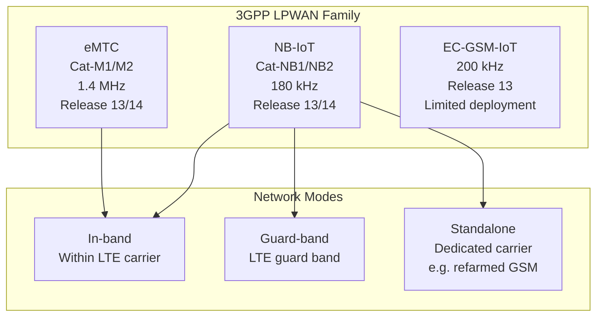
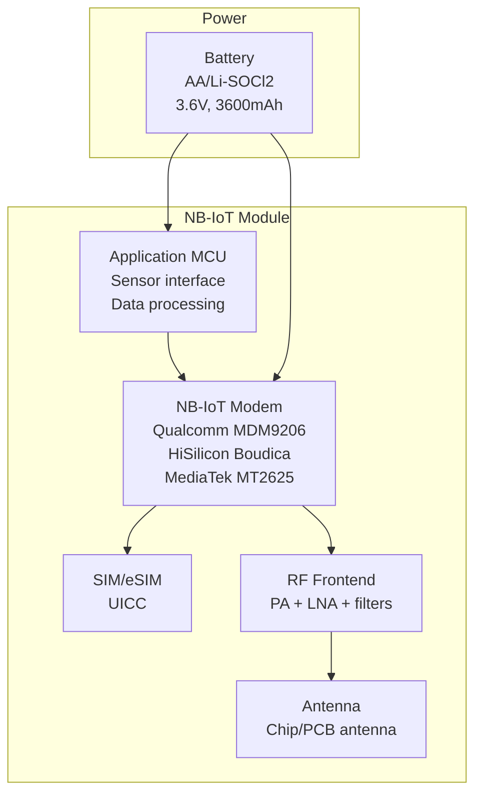
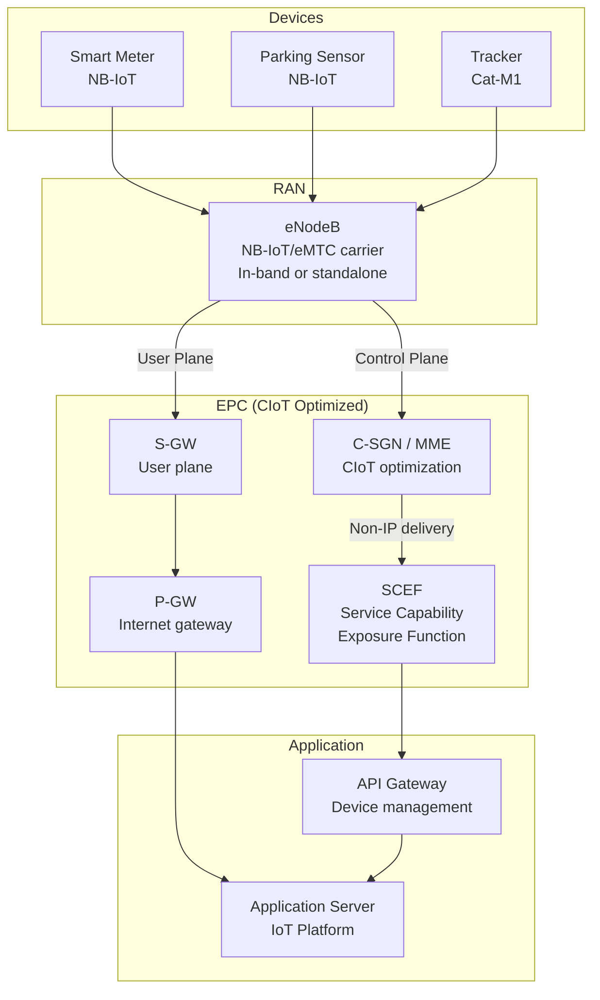
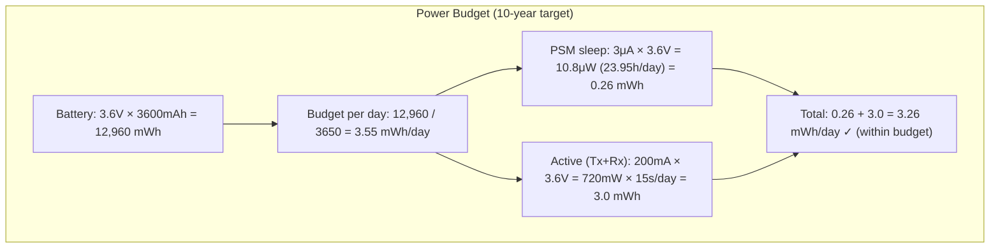

# NB-IoT, eMTC & LPWAN Technologies

**Topic:** Low-Power Wide-Area Networks for IoT — 3GPP NB-IoT (Cat-NB), eMTC (Cat-M), and Competing LPWAN Technologies  
**Standards:** 3GPP TS 36.211 (NB-IoT PHY), TS 36.321/331, TS 45.002 (EC-GSM-IoT), LoRaWAN 1.0.4, ETSI EN 303 204  
**SDO:** 3GPP, LoRa Alliance, ETSI, Sigfox (now UnaBiz), Wi-SUN Alliance  
**Audience:** IoT connectivity engineers, smart city architects, LPWAN solution designers, embedded firmware developers  
**Prerequisites:** Cellular network basics, RF propagation, battery life considerations, IoT use cases

---

## Chapter 1 — Historical Context & Origin Story

### 1.1 The IoT Connectivity Gap

Before LPWAN, IoT devices faced a dilemma:

| Technology | Range | Power | Cost | Limitation for IoT |
|-----------|-------|-------|------|-------------------|
| Wi-Fi | 50m | High | Low | No range, high power |
| Bluetooth | 10-100m | Low | Very low | No range |
| Zigbee/Z-Wave | 100m | Low | Low | No range, mesh complexity |
| 2G/3G/4G | km | Very high | Medium | Battery life (days, not years) |
| Satellite | Global | Very high | High | Cost, latency |

**LPWAN promise:** Km-range + years of battery life + low cost per device.

### 1.2 LPWAN Technology Timeline

| Year | Technology | Event |
|------|-----------|-------|
| 2009 | Sigfox | Founded (France), ultra-narrowband |
| 2012 | LoRa | Semtech acquires Cycleo (LoRa modulation patent) |
| 2015 | LoRaWAN | LoRa Alliance founded, LoRaWAN 1.0 |
| 2016 | NB-IoT (Cat-NB1) | 3GPP Release 13 (frozen June 2016) |
| 2016 | eMTC (Cat-M1) | 3GPP Release 13 |
| 2016 | EC-GSM-IoT | 3GPP Release 13 (GSM-based, limited adoption) |
| 2017 | NB-IoT/eMTC enhancements | 3GPP Release 14 |
| 2020 | NB-IoT/eMTC in 5G | 3GPP Release 16 (in-band 5G NR) |
| 2022 | Satellite NB-IoT | 3GPP Release 17 NTN for NB-IoT |

---

## Chapter 2 — Standard Architecture & Structure

### 2.1 3GPP IoT Technologies



### 2.2 Specification Mapping

| Technology | PHY | MAC | RRC | Core Network |
|-----------|-----|-----|-----|-------------|
| NB-IoT | TS 36.211 (§10) | TS 36.321 (§16) | TS 36.331 (§17) | TS 23.401 (CIoT EPS) |
| eMTC | TS 36.211 (§6) | TS 36.321 | TS 36.331 | TS 23.401 |
| 5G NB-IoT | TS 36.211 + TS 38.xxx coexistence | Same | Same | TS 23.501 (5GC) |

---

## Chapter 3 — Technical Deep Dive

### 3.1 NB-IoT (Narrowband IoT)

| Parameter | Cat-NB1 (Rel-13) | Cat-NB2 (Rel-14) |
|-----------|------------------|------------------|
| Bandwidth | 180 kHz (single PRB) | 180 kHz |
| DL peak rate | 26 kbps | 127 kbps (multi-carrier) |
| UL peak rate | 66 kbps (multi-tone) | 159 kbps |
| DL modulation | QPSK | QPSK |
| UL modulation | π/4-QPSK, π/2-BPSK | Same + 16QAM (optional) |
| Max coupling loss (MCL) | 164 dB | 164 dB |
| Coverage enhancement | Repetitions (up to 2048×) | Same + improved |
| Power saving | PSM + eDRX | PSM + eDRX (extended) |
| Positioning | CID, E-CID | OTDOA (Rel-14) |
| Mobility | Cell reselection only (no handover) | Same |

**Coverage Enhancement via Repetitions:**

$$\text{Processing Gain} = 10 \cdot \log_{10}(N_{rep}) \text{ dB}$$

For 128 repetitions: $10 \cdot \log_{10}(128) \approx 21$ dB gain → extends range significantly.

### 3.2 eMTC (enhanced Machine-Type Communication)

| Parameter | Cat-M1 (Rel-13) | Cat-M2 (Rel-14) |
|-----------|-----------------|-----------------|
| Bandwidth | 1.4 MHz (6 PRBs) | 5 MHz |
| DL peak rate | 1 Mbps | 4 Mbps |
| UL peak rate | 1 Mbps | 7 Mbps |
| Modulation | QPSK, 16QAM | Up to 64QAM |
| MCL | 156 dB | 156 dB |
| Coverage enhancement | Repetitions (up to 32×) | Same |
| Mobility | Full mobility (handover) | Full mobility |
| VoLTE | Supported (VoLTE-M) | Supported |
| Duplex | FDD + HD-FDD | FDD + TDD |

### 3.3 NB-IoT vs eMTC Comparison

| Feature | NB-IoT | eMTC (Cat-M) |
|---------|--------|-------------|
| Bandwidth | 180 kHz | 1.4 MHz |
| Data rate | ~100 kbps | ~1 Mbps |
| Coverage (MCL) | 164 dB (+20 dB vs LTE) | 156 dB (+15 dB vs LTE) |
| Latency | 1-10 seconds | 10-100 ms |
| Mobility | No handover (reselection only) | Full handover |
| Voice | No | Yes (VoLTE) |
| Best for | Meters, sensors (infrequent, small data) | Wearables, trackers, voice (frequent data) |
| Module cost target | < $5 | < $10 |
| Battery life | 10+ years | 5-10 years |
| Positioning | Basic (CID) | Enhanced (OTDOA) |

### 3.4 Power Saving Mechanisms

```mermaid
graph LR
    subgraph "Active"
        A[Connected Mode<br/>Data transfer]
    end
    
    subgraph "Light Sleep (eDRX)"
        B[Extended DRX<br/>Paging every X seconds/minutes<br/>DRX cycle up to 2621s (NB-IoT)]
    end
    
    subgraph "Deep Sleep (PSM)"
        C[Power Saving Mode<br/>Device unreachable<br/>Timer T3412 up to 413 days<br/>Lowest power (~3μA)]
    end
    
    A -->|Release| B
    B -->|eDRX expiry| C
    C -->|Wake (TAU timer or MO data)| A
```

| Mode | Power Consumption | Reachability | Latency |
|------|-------------------|-------------|---------|
| Connected (RRC_CONNECTED) | ~100-500 mA | Immediate | ms |
| Idle (normal DRX) | ~10 mA | 1.28-10.24s | seconds |
| eDRX (Idle) | ~1 mA average | 20s - 44 min | seconds-minutes |
| PSM | ~3-5 μA | None (device-initiated only) | N/A (device must wake) |

### 3.5 Non-3GPP LPWAN Comparison

| Parameter | NB-IoT | LoRaWAN | Sigfox | Wi-SUN |
|-----------|--------|---------|--------|--------|
| Spectrum | Licensed (operator) | Unlicensed (ISM) | Unlicensed (ISM) | Unlicensed (sub-GHz) |
| Bandwidth | 180 kHz | 125/250/500 kHz | 100 Hz UL, 600 Hz DL | 200 kHz - 1.2 MHz |
| Range | 10-15 km | 2-15 km (rural) | 10-50 km | 1-5 km (mesh) |
| Max data rate | 127 kbps | 50 kbps (SF7) | 100 bps | 300 kbps |
| Max payload | 1600 bytes | 243 bytes | 12 bytes (UL) | 2000+ bytes |
| Messages/day | Unlimited | Duty cycle limited (~100s) | 140 UL / 4 DL | Unlimited |
| QoS guarantee | Yes (licensed) | No (best effort) | No (best effort) | Limited |
| Topology | Star (cellular) | Star-of-stars | Star | Mesh |
| Security | 3GPP (SIM-based AKA) | AES-128 (AppSKey, NwkSKey) | AES-128 | PKI + AES |
| Ecosystem | Telecom operators | Community + operators | Sigfox/UnaBiz network | Utilities (smart grid) |

---

## Chapter 4 — Implementation Guide

### 4.1 NB-IoT Device Architecture



### 4.2 Protocol Stack (CIoT)

| Optimization | Standard Stack | CIoT Optimization |
|-------------|---------------|-------------------|
| Data transfer | IP + TCP/UDP + TLS | Non-IP Data Delivery (NIDD) |
| IP compression | Full headers | ROHC (Robust Header Compression) |
| Core path | S-GW → P-GW → Internet | Control Plane CIoT (via MME → SCEF) |
| Application | CoAP/MQTT over IP | CoAP via SCEF (Non-IP) |

### 4.3 AT Command Interface (Typical)

```
// Configure NB-IoT band
AT+NBAND=20                    // Band 20 (800 MHz, Europe)

// Set APN
AT+CGDCONT=1,"IP","nbiot.apn"

// Enable PSM
AT+CPSMS=1,,,"10100101","00000001"  // T3412=4h, T3324=16s

// Enable eDRX
AT+CEDRXS=1,5,"0101"          // NB-IoT mode, eDRX=81.92s

// Send UDP data
AT+NSOCR="DGRAM",17,1234,1    // Create UDP socket
AT+NSOST=0,"server.ip",5683,4,"AABBCCDD"  // Send 4 bytes
```

---

## Chapter 5 — Certification & Audit

### 5.1 NB-IoT/eMTC Device Certification

| Certification | Requirement | Body |
|--------------|-------------|------|
| 3GPP conformance | TS 36.521-1/3 (RF + protocol) | Accredited labs |
| GCF certification | Validated test cases for NB-IoT/eMTC | GCF |
| Operator approval | Network-specific IOT testing | Each operator |
| CE marking (EU) | RED compliance (ETSI EN 301 908) | Notified bodies |
| FCC (US) | Part 27 compliance | FCC |
| Carrier certification | AT&T/Verizon/T-Mobile specific | Operator lab |

### 5.2 LoRaWAN Certification

| Level | Scope | Body |
|-------|-------|------|
| LoRaWAN certification | Protocol conformance | LoRa Alliance |
| Regional certification | RF compliance | National regulators |
| Network server certification | Backend interoperability | LoRa Alliance |

---

## Chapter 6 — Regional & Domain Variants

### 6.1 NB-IoT Band Deployment

| Region | Band | Frequency | Deployment Mode |
|--------|------|-----------|----------------|
| Europe | B20 | 800 MHz | In-band / Guard-band |
| Europe | B8 | 900 MHz | Standalone (refarmed GSM) |
| China | B5 | 850 MHz | Large-scale |
| US | B12/13 | 700 MHz | In-band |
| India | B3 | 1800 MHz | In-band |
| Korea | B5 | 850 MHz | Standalone |
| Australia | B28 | 700 MHz | In-band |

### 6.2 Use Cases by Vertical

| Vertical | Use Case | Technology | Data Pattern |
|----------|----------|-----------|-------------|
| Utilities | Smart metering (gas/water/electric) | NB-IoT | Small data, 1-4 times/day |
| Smart city | Parking sensors | NB-IoT | Event-driven, small payload |
| Logistics | Asset tracking | eMTC | Periodic location, medium data |
| Agriculture | Soil moisture, weather | NB-IoT / LoRaWAN | Infrequent, small payload |
| Wearables | Pet/elderly trackers | eMTC | Continuous tracking |
| Industrial | Machine monitoring | eMTC / Wi-SUN | Medium data, continuous |
| Building | HVAC, lighting control | LoRaWAN / NB-IoT | Periodic, small |

---

## Chapter 7 — Comparison: LPWAN Decision Matrix

| Criterion | Best Choice | Rationale |
|-----------|------------|-----------|
| Need QoS guarantee | NB-IoT / eMTC | Licensed spectrum = guaranteed |
| Ultra-low cost (no SIM) | LoRaWAN / Sigfox | No operator subscription |
| Private network ownership | LoRaWAN | Self-deploy gateways |
| Deep indoor coverage | NB-IoT | 164 dB MCL, repetitions |
| Mobility (tracking) | eMTC | Full handover support |
| Voice capability | eMTC | VoLTE supported |
| Very remote areas | Satellite NB-IoT | 3GPP NTN (Rel-17) |
| Mesh networking | Wi-SUN | Smart grid/utility |
| Ultra-long battery (10+ years) | NB-IoT (PSM) | ~3μA in PSM |
| Large payload (firmware OTA) | eMTC | 1 Mbps, larger data |
| Massive scale (carrier-managed) | NB-IoT | Operator infrastructure |

---

## Chapter 8 — Mermaid Architecture Diagrams

### 8.1 NB-IoT Network Architecture



### 8.2 Battery Life Calculation



---

## Chapter 9 — Case Studies & Failure Analysis

### 9.1 China's Massive NB-IoT Deployment

**Scale:** >200 million NB-IoT connections (2023). Largest deployment globally. China Mobile, China Telecom, China Unicom all deploy.

**Use cases:** Smart gas metering (>100M devices), water metering, smoke detectors, smart locks, shared bicycles.

**Success factors:** (1) Government mandate for smart meter rollout. (2) Operator subsidy for NB-IoT modules. (3) Module cost driven to <$2 at scale. (4) Single band (B5/B8) simplifies deployment.

### 9.2 2G/3G Sunset Impact on IoT

**Problem:** Operators shutting down 2G/3G networks (AT&T 3G: Feb 2022, Vodafone 3G: 2023+). Legacy IoT devices (Cat-1, GPRS modems) lose connectivity.

**Impact:** Millions of devices in utility meters, vending machines, industrial equipment became non-functional.

**Solution:** NB-IoT and eMTC provide long-term IoT connectivity on LTE bands that operators commit to maintaining for 10+ years. Migration from 2G/3G IoT → NB-IoT/eMTC is industry priority.

---

## Chapter 10 — Future Evolution & Industry Trends

| Trend | Timeline | Impact |
|-------|----------|--------|
| Satellite NB-IoT (NTN) | 2024+ | Global coverage without terrestrial infrastructure |
| RedCap (5G NR reduced capability) | 2023+ | Bridge between eMTC and full 5G (100 Mbps, lower cost) |
| Ambient IoT (Rel-18) | 2025+ | Zero-energy devices (energy harvesting + backscatter) |
| NB-IoT/eMTC in 5G Core | Rel-16+ | Connected to 5GC (network slicing for IoT) |
| AI at the edge for IoT | Now | Local inference, reduce uplink data |
| LPWAN consolidation | Ongoing | NB-IoT gaining vs Sigfox (bankrupt 2022, acquired) |
| Private LPWAN | Growing | Enterprise-owned NB-IoT/LoRaWAN networks |

---

## Chapter 11 — Interview Questions & Career Guide

### Tier 1: Entry-Level

**Q1:** What is the difference between NB-IoT and eMTC?  
**A:** Both are 3GPP LPWAN technologies (Release 13+) for IoT, but optimized for different use cases: **NB-IoT (Cat-NB):** 180 kHz bandwidth, ~100 kbps, 164 dB MCL (deepest coverage), no handover (stationary devices), no voice. Best for: infrequent small data (meters, sensors). **eMTC (Cat-M):** 1.4 MHz bandwidth, ~1 Mbps, 156 dB MCL, full mobility (handover), VoLTE support. Best for: higher data rate, mobile IoT (trackers, wearables, voice). **Key trade-off:** NB-IoT = maximum coverage + lowest power for simple sensors. eMTC = more capability (speed, mobility, voice) at slightly higher power/cost.

### Tier 2: Mid-Level

**Q2:** Explain how PSM and eDRX work together to achieve 10-year battery life.  
**A:** **PSM (Power Saving Mode):** After data transmission, device enters deep sleep (3-5 μA). It's unreachable by the network. Wakes only on: (1) UE-initiated (MO data), or (2) TAU timer (T3412) expiry (configurable up to 413 days). Device retains registration but doesn't monitor paging. **eDRX (Extended Discontinuous Reception):** Between active periods and PSM, device monitors paging at extended intervals (up to 2621s for NB-IoT, 44 min for eMTC). Allows network-initiated DL while saving power. **Combined operation:** Active → eDRX (reachable at intervals) → PSM (unreachable, minimum power). **Battery math:** If device transmits 100 bytes once/day: Active time ~5-15s at ~200mA; remaining 23h 59m in PSM at 3μA. Total average current ~10 μA → 3600 mAh battery / 10 μA = 360,000 hours ≈ 41 years (theoretical). Practical: 10-15 years accounting for self-discharge and overhead.

### Tier 3: Senior

**Q3:** Compare the control plane vs user plane CIoT optimization paths in 3GPP.  
**A:** **User Plane path (traditional):** UE → eNB → S-GW → P-GW → Internet → Application Server. Data travels through full EPC user plane. Requires: RRC connection + data radio bearer + S1 bearer + S5/S8 bearer. Advantage: Standard IP path, any application. Disadvantage: Higher signaling overhead for small data (RRC setup, bearer activation). **Control Plane (CP) CIoT path:** UE → eNB → MME → SCEF → Application Server. Small data (≤1600 bytes) piggybacked on NAS signaling (in Attach/TAU or ESM Data Transport). No data bearer needed. Advantage: Less signaling (no RRC resume + bearer), faster for small payloads, enables Non-IP Data Delivery (NIDD). Disadvantage: Size-limited, higher core load (MME processes data), not suitable for streaming. **Design decision:** CP path for infrequent small messages (meter reads). UP path for larger/continuous data (firmware OTA, streaming).

---

## Chapter 12 — Cheat Sheet & Quick Reference

### LPWAN Technology Quick Comparison

```
NB-IoT:  Licensed, 180kHz, 100kbps, 164dB MCL, no mobility, 10+ year battery
eMTC:    Licensed, 1.4MHz, 1Mbps, 156dB MCL, full mobility, VoLTE, 5-10yr
LoRaWAN: Unlicensed, 125kHz, 50kbps, no QoS, private deployable, community
Sigfox:  Unlicensed, 100Hz, 100bps, 12-byte payload, 140 msg/day limit
Wi-SUN:  Unlicensed, sub-GHz mesh, 300kbps, smart grid/utility focus
```

### NB-IoT Key Parameters

```
Bandwidth: 180 kHz (1 PRB)
Subcarrier spacing: 15 kHz (12 subcarriers) or 3.75 kHz (48 subcarriers)
DL: OFDMA (same as LTE, narrowband)
UL: SC-FDMA (single-tone 3.75/15 kHz or multi-tone)
MCL: 164 dB
Repetitions: Up to 2048 (DL) / 128 (UL)
PSM: T3412 up to 413 days
eDRX: Up to 2621.44 seconds (43.7 minutes)
Deployment: In-band, Guard-band, or Standalone
```

---

*End of Document — 07_NB_IoT_eMTC_LPWAN.md*
