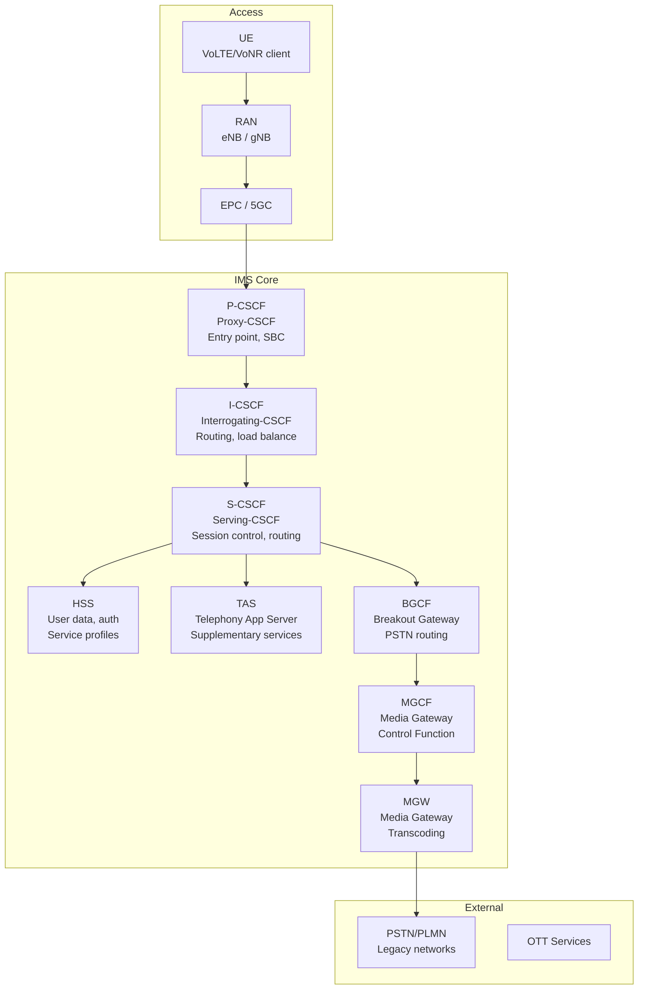
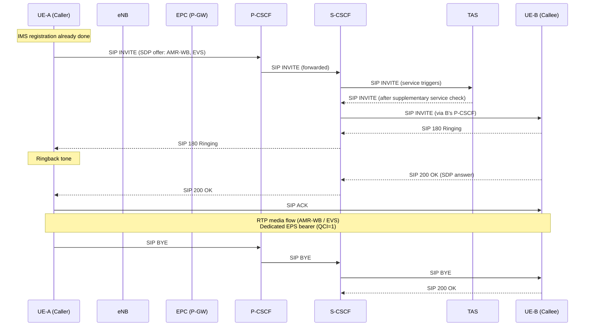
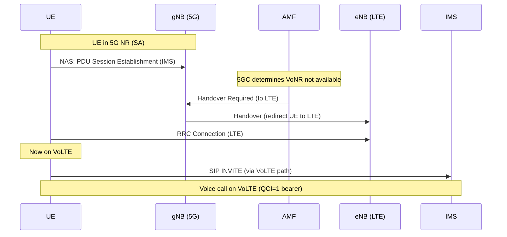
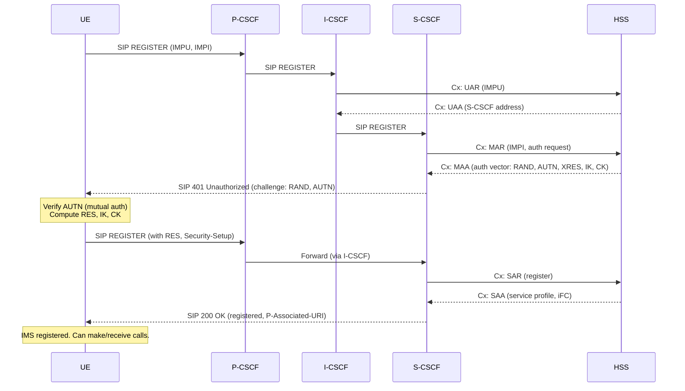
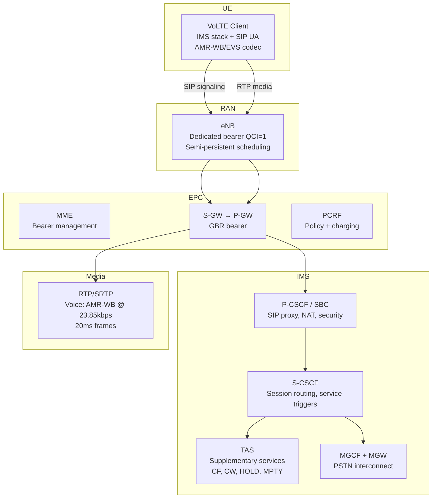
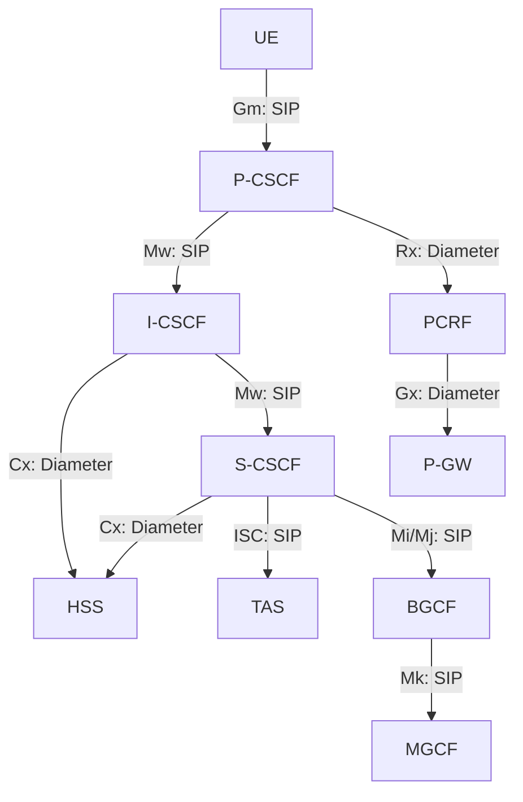

# IMS, VoLTE & VoNR

**Topic:** IP Multimedia Subsystem, Voice over LTE, Voice over New Radio  
**Standards:** 3GPP TS 23.228 (IMS Architecture), TS 24.229, GSMA IR.92 (VoLTE), IR.94 (ViLTE), GSMA VoNR Profile  
**SDO:** 3GPP, GSMA  
**Audience:** VoIP/IMS engineers, telecom core network architects, service platform developers  
**Prerequisites:** SIP protocol, RTP/RTCP, LTE/5G architecture, QoS concepts

---

## Chapter 1 — Historical Context & Origin Story

### 1.1 Voice in Mobile Networks Evolution

| Generation | Voice Technology | Path | Limitations |
|-----------|-----------------|------|------------|
| 2G (GSM) | Circuit-switched | MS→BTS→BSC→MSC→PSTN | Dedicated timeslot, inefficient |
| 3G (UMTS) | Circuit-switched | UE→NodeB→RNC→MSC→PSTN | Still CS domain, added AMR codec |
| 3G → 4G transition | CSFB (CS Fallback) | Drop to 3G/2G for voice | 2-4s call setup delay |
| 4G (LTE) | VoLTE (IMS-based) | UE→eNB→EPC→IMS→PSTN/VoIP | All-IP voice, HD quality |
| 5G (NR) | VoNR | UE→gNB→5GC→IMS | Native 5G voice, lowest latency |

### 1.2 IMS History

| Year | Milestone |
|------|-----------|
| 2000 | 3GPP Release 5: IMS architecture defined |
| 2002 | Release 6: IMS enhancements |
| 2004 | TISPAN (fixed-mobile IMS convergence) |
| 2008 | GSMA starts VoLTE work (One Voice initiative) |
| 2010 | GSMA IR.92 v1.0 (VoLTE IMS profile) |
| 2012 | SK Telecom launches world's first VoLTE service |
| 2014 | VoLTE global rollout begins (AT&T, Verizon, T-Mobile) |
| 2020 | VoNR first commercial (South Korea, China) |
| 2022 | VoNR mainstream (operators migrating from VoLTE) |

---

## Chapter 2 — Standard Architecture & Structure

### 2.1 IMS Architecture (TS 23.228)



### 2.2 Key Specifications

| Specification | Purpose |
|--------------|---------|
| TS 23.228 | IMS architecture |
| TS 24.229 | SIP/SDP procedures for IMS |
| TS 23.167 | IMS emergency calls |
| TS 26.114 | IP Multimedia media handling |
| TS 26.441 | EVS codec specification |
| GSMA IR.92 | VoLTE IMS profile (mandatory features) |
| GSMA IR.94 | Video over LTE (ViLTE) profile |
| GSMA IR.51 | IMS roaming architecture |
| GSMA VoNR Profile | VoNR interoperability requirements |

---

## Chapter 3 — Technical Deep Dive

### 3.1 VoLTE Call Flow



### 3.2 QoS for VoLTE

| QCI | Resource Type | Priority | PDB | PER | Use |
|-----|--------------|----------|-----|-----|-----|
| 1 | GBR | 2 | 100ms | 10⁻² | VoLTE voice (conversational) |
| 2 | GBR | 4 | 150ms | 10⁻³ | ViLTE video (live) |
| 5 | Non-GBR | 1 | 100ms | 10⁻⁶ | IMS signaling (SIP) |
| 9 | Non-GBR | 9 | 300ms | 10⁻⁶ | Default bearer (internet) |

**Bearer setup for VoLTE:**
1. Default bearer (QCI=9): Established at attach (internet)
2. IMS signaling bearer (QCI=5): Established at IMS registration
3. Voice bearer (QCI=1, GBR): Established per call (dedicated bearer)

### 3.3 Voice Codecs

| Codec | Standard | Rate | Quality | Bandwidth | Use |
|-------|----------|------|---------|-----------|-----|
| AMR-NB | TS 26.071 | 4.75-12.2 kbps | Narrowband (300-3400 Hz) | 8 kHz | Legacy (GSM/3G) |
| AMR-WB | TS 26.171 | 6.6-23.85 kbps | Wideband (50-7000 Hz) | 16 kHz | VoLTE HD voice |
| EVS | TS 26.441 | 5.9-128 kbps | Super-wideband (50-14000 Hz) | 32/48 kHz | VoLTE+ / VoNR |
| EVS-SWB | TS 26.441 | 9.6-128 kbps | Full-band (20-20000 Hz) | 48 kHz | Premium voice |

### 3.4 VoNR (Voice over New Radio)

| Aspect | VoLTE | VoNR |
|--------|-------|------|
| RAN | LTE (eNB) | 5G NR (gNB) |
| Core | EPC (MME, S/P-GW) | 5GC (AMF, SMF, UPF) |
| IMS | Same P/I/S-CSCF | Same (reuses IMS infrastructure) |
| QoS | QCI=1 (dedicated bearer) | 5QI=1 (QoS flow) |
| Codec | AMR-WB, EVS | EVS preferred |
| Latency | ~50-100ms mouth-to-ear | ~30-50ms (lower RAN latency) |
| Fallback | CSFB to 3G/2G (if no VoLTE) | EPS fallback to VoLTE (if no VoNR) |
| SRVCC | SRVCC to CS (if leaving LTE coverage) | Not needed (fallback to VoLTE) |

### 3.5 EPS Fallback for VoNR



---

## Chapter 4 — Implementation Guide

### 4.1 IMS Registration Flow



### 4.2 UE IMS Client Requirements (GSMA IR.92)

| Feature | Requirement |
|---------|-------------|
| SIP registration | Via P-CSCF (discovered via PCO/ePCO in bearer setup) |
| Codec | AMR-WB mandatory (EVS recommended) |
| SRTP | Mandatory (voice encryption) |
| PRECONDITION | Resource reservation (RFC 3312) |
| SRVCC | Single Radio Voice Call Continuity (handover to CS) |
| Emergency calls | IMS emergency registration + E911/112 |
| Supplementary services | HOLD, MPTY (conference), CLIP/CLIR, CF, CW |
| OIWA | Originating Identification (calling number) |

---

## Chapter 5 — Certification & Audit

### 5.1 VoLTE/VoNR Certification

| Certification | Body | Scope |
|--------------|------|-------|
| GSMA IR.92 compliance | GSMA | VoLTE UE minimum feature set |
| GCF VoLTE | GCF | UE IMS protocol conformance |
| PTCRB VoLTE | PTCRB | US market VoLTE testing |
| Operator IOT | Each operator | Interoperability + voice quality |
| OIWA (NG.114) | GSMA | Voice quality (POLQA/PESQ scoring) |

### 5.2 Voice Quality Metrics

| Metric | Standard | Range | VoLTE Target |
|--------|----------|-------|-------------|
| POLQA (MOS) | ITU-T P.863 | 1.0-5.0 | >3.5 (WB), >4.0 (SWB) |
| PESQ (MOS) | ITU-T P.862 | 1.0-4.5 | >3.5 |
| Delay (mouth-to-ear) | ITU-T G.114 | — | <150ms (one-way) |
| Jitter | — | — | <30ms |
| Packet loss | — | — | <1% |

---

## Chapter 6 — Regional & Domain Variants

| Region | VoLTE Status | VoNR Status | Key Operator |
|--------|-------------|-------------|-------------|
| US | Universal (2G/3G shutdown) | Rolling out | T-Mobile, AT&T, Verizon |
| Europe | Widespread | Starting (2024+) | DT, Orange, Vodafone |
| South Korea | Universal since 2012 | Live (SK Telecom, KT) | SK Telecom |
| China | Universal (3 operators) | Live (China Mobile, etc.) | China Mobile |
| Japan | Universal | Rolling out | NTT DoCoMo, KDDI |
| India | Growing (Jio native VoLTE) | Starting | Jio (VoLTE-first) |

---

## Chapter 7 — Comparison: Voice Technologies

| Feature | VoLTE | VoNR | VoWiFi | OTT VoIP |
|---------|-------|------|--------|----------|
| Network | LTE (EPC + IMS) | 5G NR (5GC + IMS) | Wi-Fi (ePDG + IMS) | Internet (any) |
| QoS | Guaranteed (QCI=1 GBR) | Guaranteed (5QI=1) | Best effort | Best effort |
| Quality | HD (AMR-WB/EVS) | SHD (EVS) | HD (same as VoLTE) | Variable |
| Latency | 50-100ms | 30-50ms | Variable (internet) | Variable |
| Emergency calls | Yes (E911/112) | Yes | Yes (some markets) | No (usually) |
| Roaming | Yes (IMS roaming) | Developing | Yes | N/A |
| Phone number | MSISDN | MSISDN | MSISDN | App-specific |
| Standard | GSMA IR.92 | GSMA VoNR | GSMA IR.51 | Proprietary |

---

## Chapter 8 — Mermaid Architecture Diagrams

### 8.1 VoLTE End-to-End Architecture



### 8.2 IMS Interfaces (Cx, Rx, Gm)



---

## Chapter 9 — Case Studies & Failure Analysis

### 9.1 VoLTE Roaming Challenges

**Problem:** VoLTE roaming requires IMS interworking between home and visited PLMNs. Two models exist:
- **S8HR (S8 Home Routed):** Voice traffic routed back to home IMS. High latency (media traverses home network).
- **LBO (Local Breakout):** Voice handled by visited IMS. Complex interconnect agreements needed.

**Impact:** Many operators fell back to CSFB when roaming (dropped to 3G for voice abroad). VoLTE roaming took years longer to implement than VoLTE itself.

**Resolution:** GSMA IPX (IP Exchange) interconnect + bilateral agreements. By 2024, major operators have VoLTE roaming (primarily S8HR model initially, LBO for quality).

### 9.2 CSFB to VoLTE Migration

**Challenge:** Transitioning from Circuit-Switched Fallback to VoLTE required: (1) IMS core deployment. (2) All devices support VoLTE (not just LTE data). (3) VoLTE-capable SIM provisioning. (4) P-CSCF discovery in device. (5) Quality assurance (voice MOS comparable to CS).

**Timeline:** Most operators took 2-4 years from first VoLTE launch to disabling CSFB. Key milestone: AT&T shut down 3G (Feb 2022), forcing all voice to VoLTE.

---

## Chapter 10 — Future Evolution & Industry Trends

| Trend | Timeline | Impact |
|-------|----------|--------|
| VoNR ubiquitous | 2025-2027 | All 5G SA networks support native VoNR |
| 2G/3G shutdown acceleration | 2025-2030 | VoLTE/VoNR mandatory for all voice |
| EVS codec mandatory | 2024+ | Super-wideband quality standard |
| Video calling (ViLTE/ViNR) | Now | Operator video (IR.94) vs OTT |
| IMS Data Channel | Rel-17+ | Bi-directional data in IMS calls |
| Network slicing for voice | 5G SA | Dedicated voice slice (guaranteed QoS) |
| Immersive voice (IVAS codec) | Rel-18 | 3D audio, spatial sound for XR |
| RCS (Rich Communication Services) | Now | SMS successor, integrated in Android |
| AI-enhanced voice | Research | Noise suppression, translation, enhancement |

---

## Chapter 11 — Interview Questions & Career Guide

### Tier 1: Entry-Level

**Q1:** What is VoLTE and why was it needed?  
**A:** **VoLTE (Voice over LTE)** is the standard method for carrying voice calls over 4G LTE networks using IMS (IP Multimedia Subsystem). **Why needed:** LTE is a pure packet-switched (all-IP) network — it has no circuit-switched domain for voice (unlike 2G/3G). Without VoLTE, LTE devices had to fall back to 3G/2G for voice (CSFB), causing: (1) 2-4 second call setup delay. (2) No simultaneous voice + data on LTE. (3) Required maintaining 2G/3G networks. VoLTE solves this by carrying voice as IP packets (VoIP) over LTE with guaranteed QoS (dedicated GBR bearer, QCI=1) and HD voice quality (AMR-WB codec, 50-7000 Hz vs narrowband 300-3400 Hz).

### Tier 2: Mid-Level

**Q2:** Explain the IMS registration and session establishment for VoLTE.  
**A:** **Registration:** (1) UE attaches to LTE, gets default bearer (QCI=9) + IMS signaling bearer (QCI=5). (2) UE discovers P-CSCF address (via PCO in PDN connectivity). (3) UE sends SIP REGISTER to P-CSCF → I-CSCF → S-CSCF. (4) S-CSCF challenges with IMS-AKA (Cx/MAR from HSS). (5) UE responds → S-CSCF verifies → 200 OK (registered). **Session (call):** (1) Caller sends SIP INVITE with SDP offer (codecs: AMR-WB, EVS). (2) SDP negotiation includes resource reservation (preconditions). (3) P-CSCF sends Rx to PCRF → PCRF triggers dedicated bearer (QCI=1, GBR) via Gx to P-GW. (4) Dedicated bearer established in RAN (eNB allocates resources). (5) SDP answer received, 200 OK, ACK → RTP media flows over dedicated bearer.

### Tier 3: Senior

**Q3:** Describe SRVCC and why it's being replaced.  
**A:** **SRVCC (Single Radio Voice Call Continuity, TS 23.216):** Handover mechanism from VoLTE (packet domain) to circuit-switched 2G/3G when UE moves out of LTE coverage during an active voice call. **Flow:** (1) eNB detects UE at LTE coverage edge. (2) eNB triggers SRVCC handover via MME. (3) MME coordinates with MSC (circuit domain) to create CS leg. (4) IMS session transferred from P-GW to MGW (media) + MGCF (signaling). (5) UE handed to 3G/2G with CS voice continuing seamlessly. **Complexity:** Requires: STN-SR in HSS, MSC enhanced for SRVCC, IMS ATCF/ATGW (Access Transfer Control/Gateway). Very complex inter-domain handover. **Why being replaced:** (1) 2G/3G networks shutting down (nowhere to handover to). (2) LTE coverage is near-universal in most markets. (3) In 5G SA: if VoNR is unavailable, UE falls back to VoLTE (EPS Fallback) before call starts — no mid-call handover needed. (4) Network simplification: removing CS domain entirely.

---

## Chapter 12 — Cheat Sheet & Quick Reference

### VoLTE/VoNR Quick Reference

```
VoLTE = Voice over LTE via IMS (GSMA IR.92)
VoNR = Voice over 5G NR via IMS (GSMA VoNR Profile)
IMS = IP Multimedia Subsystem (SIP-based session control)

Key QoS:
  Voice signaling: QCI=5 (Non-GBR, 100ms PDB)
  Voice media:     QCI=1 (GBR, 100ms PDB)
  Video media:     QCI=2 (GBR, 150ms PDB)

Codecs:
  AMR-WB: 23.85 kbps (HD voice, mandatory)
  EVS:    9.6-128 kbps (super HD, recommended)

IMS Entities:
  P-CSCF: Entry point (SBC + NAT traversal)
  I-CSCF: Routing to correct S-CSCF
  S-CSCF: Session control + service triggers
  TAS:    Telephony Application Server (supplementary services)
  HSS:    User profiles (Cx interface, Diameter)
  PCRF:   Policy (Rx from P-CSCF, Gx to P-GW)
```

### SIP Methods (VoLTE)

```
REGISTER:  IMS registration
INVITE:    Call initiation (SDP offer)
ACK:       Confirm session
BYE:       End call
CANCEL:    Cancel pending INVITE
SUBSCRIBE: Event subscription (reg, dialog)
NOTIFY:    Event notification
UPDATE:    Mid-session SDP renegotiation
REFER:     Call transfer
```

---

*End of Document — 08_IMS_VoLTE_VoNR.md*
