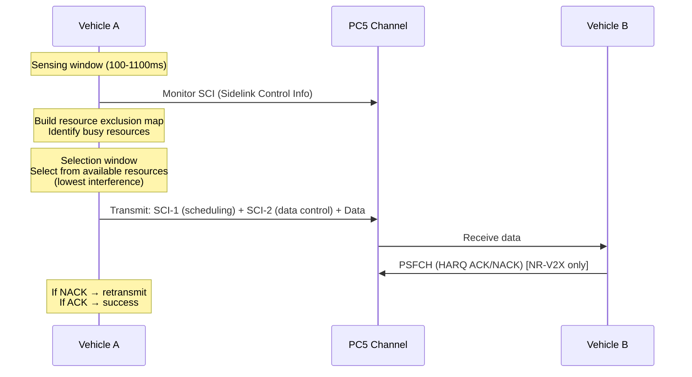
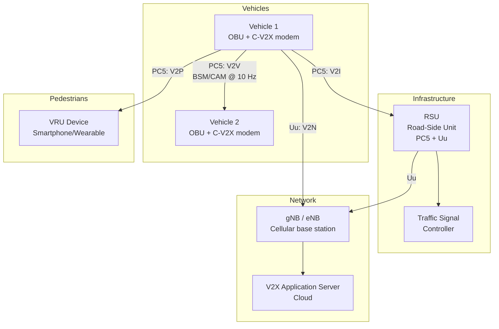

# C-V2X — Cellular Vehicle-to-Everything & Sidelink

**Topic:** Cellular V2X Communication — PC5 Sidelink, Uu-based V2X, 3GPP NR V2X  
**Standards:** 3GPP TS 36.885, TS 23.285, TS 38.885, SAE J3161, ETSI TS 103 613  
**SDO:** 3GPP, SAE International, ETSI, 5GAA (5G Automotive Association)  
**Audience:** Automotive V2X engineers, ADAS architects, connected vehicle developers, ITS engineers  
**Prerequisites:** LTE/5G NR basics, vehicular communications concepts, ITS standards

---

## Chapter 1 — Historical Context & Origin Story

### 1.1 V2X Technology Evolution

| Year | Technology | Standard | Capability |
|------|-----------|----------|-----------|
| 2010 | DSRC (802.11p) | IEEE 802.11p / WAVE | Basic safety messaging (BSM), 300m range |
| 2016 | LTE-V2X (Release 14) | 3GPP | Sidelink Mode 3/4, basic V2V |
| 2017 | 5GAA formed | — | Industry push for C-V2X |
| 2018 | C-V2X Phase 1 trials | 3GPP Rel-14/15 | V2V, V2I, V2P safety messages |
| 2020 | NR-V2X (Release 16) | 3GPP | Advanced V2X (platooning, remote driving) |
| 2021 | C-V2X commercial (China) | — | Large-scale RSU deployment |
| 2022 | NR-V2X enhancements (Rel-17) | 3GPP | Sidelink relay, positioning |
| 2024 | NR-V2X advanced (Rel-18) | 3GPP | Sidelink in unlicensed, L2 relay |

### 1.2 DSRC vs C-V2X

| Aspect | DSRC (802.11p) | C-V2X (LTE/NR Sidelink) |
|--------|---------------|--------------------------|
| Standard body | IEEE / ETSI ITS-G5 | 3GPP |
| Air interface | OFDM (802.11p) | SC-FDMA (LTE), OFDM (NR) |
| Spectrum | 5.9 GHz (dedicated ITS) | 5.9 GHz (same spectrum) |
| Range | ~300m (typical) | ~450m (LTE), 1km+ (NR) |
| Latency | ~2ms | ~5ms (LTE), <3ms (NR) |
| Reliability | Moderate (CSMA/CA) | Higher (SPS, HARQ in NR) |
| Evolution path | Limited (Wi-Fi 802.11bd) | 3GPP roadmap (NR-V2X → 6G) |
| Network dependency | None (ad-hoc) | Optional (Mode 2: autonomous) |
| Ecosystem | Mature (US DOT, ETSI) | Growing (China, OEMs) |

---

## Chapter 2 — Standard Architecture & Structure

### 2.1 C-V2X Communication Modes

```mermaid
graph TB
    subgraph "V2X Communication Types"
        V2V[V2V<br/>Vehicle-to-Vehicle<br/>Direct (PC5 sidelink)]
        V2I[V2I<br/>Vehicle-to-Infrastructure<br/>RSU (PC5 or Uu)]
        V2P[V2P<br/>Vehicle-to-Pedestrian<br/>Direct (PC5)]
        V2N[V2N<br/>Vehicle-to-Network<br/>Cellular (Uu interface)]
    end
    
    subgraph "Interfaces"
        PC5[PC5 Interface<br/>Direct sidelink<br/>No network required]
        Uu[Uu Interface<br/>Cellular uplink/downlink<br/>Via base station]
    end
    
    V2V --> PC5
    V2I --> PC5
    V2I --> Uu
    V2P --> PC5
    V2N --> Uu
```

### 2.2 Specification Framework

| Standard | Content |
|----------|---------|
| TS 23.285 | V2X architecture (LTE) |
| TS 23.287 | V2X architecture (NR) |
| TS 36.885 | LTE-V2X study item |
| TS 38.885 | NR-V2X study item |
| TS 36.211/212/213 (Rel-14+) | LTE sidelink PHY |
| TS 38.211/212/213 (Rel-16+) | NR sidelink PHY |
| TS 36.321 | LTE sidelink MAC |
| TS 38.321 | NR sidelink MAC |
| SAE J3161 | On-Board System Requirements for LTE-V2X |
| SAE J3161/1 | NR-V2X On-Board System Requirements |
| ETSI TS 103 613 | V2X over LTE-PC5 (ITS-G5 adaptation) |

---

## Chapter 3 — Technical Deep Dive

### 3.1 LTE-V2X Sidelink (Release 14/15)

| Parameter | LTE-V2X (PC5) |
|-----------|---------------|
| Frequency | 5.855-5.925 GHz (ITS band) |
| Bandwidth | 10/20 MHz |
| Subcarrier spacing | 15 kHz |
| Modulation | QPSK, 16QAM |
| Channel coding | Turbo codes |
| Multiple access | SC-FDMA |
| Subframe | 1 ms |
| HARQ | Blind retransmission (no feedback) |
| Mode 3 | Network-scheduled (eNB allocates resources) |
| Mode 4 | Autonomous (UE self-selects resources via SPS + sensing) |
| Max range | ~450m (23 dBm Tx power) |

### 3.2 NR-V2X Sidelink (Release 16+)

| Parameter | NR-V2X (PC5) |
|-----------|---------------|
| Frequency | 5.9 GHz (ITS) + FR1/FR2 bands |
| Bandwidth | Up to 40 MHz (5.9 GHz) |
| Subcarrier spacing | 15/30/60 kHz |
| Modulation | QPSK, 16QAM, 64QAM, 256QAM |
| Channel coding | LDPC (data), Polar (control) |
| Multiple access | OFDM |
| Slot duration | Flexible (0.5/1 ms) |
| HARQ | Feedback-based (PSFCH channel) |
| Mode 1 | Network-scheduled (gNB allocates) |
| Mode 2 | Autonomous (UE sensing + selection) |
| Groupcast/Unicast | Supported (in addition to broadcast) |
| QoS per flow | Supported (PPPP: ProSe Per Packet Priority) |

### 3.3 NR-V2X vs LTE-V2X Enhancement

| Feature | LTE-V2X (Rel-14) | NR-V2X (Rel-16) |
|---------|-------------------|------------------|
| Communication model | Broadcast only | Broadcast + Groupcast + Unicast |
| HARQ feedback | None (blind retx) | Yes (PSFCH — Physical Sidelink Feedback Channel) |
| Resource allocation | SPS (Semi-Persistent Scheduling) | Dynamic + SPS |
| Modulation | Up to 16QAM | Up to 256QAM |
| Reliability | ~90% within 300m | >99.99% (HARQ + retx) |
| Latency | ~20ms | <3ms (mini-slot) |
| Data rate | ~50 Mbps | ~1 Gbps (sidelink) |
| Use cases | Basic safety (BSM/CAM) | Advanced: platooning, remote driving, sensor sharing |
| Carrier | Single (5.9 GHz) | Multi-carrier, cross-carrier scheduling |

### 3.4 V2X Use Cases by Category

```mermaid
graph TB
    subgraph "Day-1 (LTE-V2X Sufficient)"
        A1[Forward collision warning]
        A2[Emergency brake warning]
        A3[Intersection movement assist]
        A4[Traffic signal status (V2I)]
    end
    
    subgraph "Day-2 (NR-V2X Required)"
        B1[Cooperative perception<br/>Sensor sharing (camera/lidar)]
        B2[Platooning<br/>Coordinated driving]
        B3[Remote driving<br/>Teleoperation]
        B4[Cooperative maneuver<br/>Lane change coordination]
    end
    
    subgraph "Requirements"
        C1[Latency: 100ms<br/>Reliability: 90%<br/>Rate: 10 kbps]
        C2[Latency: 3-10ms<br/>Reliability: 99.99%<br/>Rate: 10-1000 Mbps]
    end
    
    A1 --> C1
    A2 --> C1
    B1 --> C2
    B2 --> C2
    B3 --> C2
```

### 3.5 Resource Allocation Mode 2 (Autonomous)



---

## Chapter 4 — Implementation Guide

### 4.1 C-V2X OBU (On-Board Unit) Architecture

```mermaid
graph TB
    subgraph "Vehicle OBU"
        A[Application Layer<br/>BSM/CAM generation<br/>Threat assessment]
        B[V2X Stack<br/>Facilities layer<br/>GeoNetworking]
        C[C-V2X Modem<br/>Qualcomm 9150<br/>or similar chipset]
        D[Uu Modem<br/>Cellular (4G/5G)<br/>for V2N]
        E[GNSS<br/>GPS/GLONASS<br/>Positioning]
        F[HSM<br/>V2X certificate<br/>storage + signing]
        G[Antenna<br/>5.9 GHz + cellular<br/>+ GNSS]
    end
    
    A --> B --> C
    B --> D
    E --> B
    F --> B
    C --> G
    D --> G
```

### 4.2 V2X Protocol Stack

| Layer | Protocol | Function |
|-------|----------|----------|
| Application | BSM (SAE J2735), CAM/DENM (ETSI) | Safety messages |
| Facilities | GeoNetworking (ETSI EN 302 636) | Geographic addressing |
| Transport | BTP (Basic Transport Protocol) | Connectionless transport |
| Network | GN (GeoNetworking) or IPv6 | Routing |
| Access | C-V2X PC5 (3GPP) | Radio access |
| Security | IEEE 1609.2 / ETSI TS 103 097 | PKI, signing, encryption |

### 4.3 Message Types

| Message | Standard | Content | Rate |
|---------|----------|---------|------|
| BSM (Basic Safety Message) | SAE J2735 | Position, speed, heading, size, brake status | 10 Hz |
| CAM (Cooperative Awareness Message) | ETSI EN 302 637-2 | Similar to BSM (EU equivalent) | 1-10 Hz |
| DENM (Decentralized Environmental Notification) | ETSI EN 302 637-3 | Event notifications (accident, hazard) | Event-triggered |
| SPaT (Signal Phase and Timing) | SAE J2735 | Traffic signal state + timing | 10 Hz |
| MAP (Map Data) | SAE J2735 | Intersection geometry | Static/low rate |
| CPM (Collective Perception Message) | ETSI TR 103 562 | Sensor sharing (NR-V2X) | 10-20 Hz |

---

## Chapter 5 — Certification & Audit

### 5.1 C-V2X Device Certification

| Certification | Body | Scope |
|--------------|------|-------|
| 3GPP PC5 conformance | GCF / PTCRB | Sidelink protocol + RF |
| SAE J3161 compliance | SAE | OBU system requirements |
| 5GAA interoperability | 5GAA Plugfest | Multi-vendor V2X interop |
| ETSI EN 302 571 | ETSI | ITS-G5 RF characteristics |
| FCC Part 95 (US) | FCC | 5.9 GHz ITS band compliance |
| SCMS (US) | US DOT | Security credential management |
| EU C-ITS PKI | CCMS | European V2X PKI |

### 5.2 V2X Testing Methodology

| Test Type | Standard | Environment |
|-----------|----------|-------------|
| RF performance | 3GPP TS 36.521 / 38.521 | Anechoic chamber |
| Protocol conformance | 3GPP TS 36.523 (sidelink) | Test equipment (Keysight, R&S) |
| Interoperability | 5GAA Plugfest | Multi-vendor field test |
| Range/reliability | SAE J3061 (field test) | Highway, intersection scenarios |
| Security | IEEE 1609.2 / ETSI TS 103 097 | PKI validation |
| Application layer | SAE J2945/1 | BSM correctness, V2V scenarios |

---

## Chapter 6 — Regional & Domain Variants

| Region | V2X Technology | Spectrum | Deployment Status |
|--------|---------------|----------|------------------|
| US | C-V2X (FCC chose C-V2X over DSRC, 2020) | 5.895-5.925 GHz (30 MHz) | Early deployment, RSU pilots |
| EU | C-ITS (technology-neutral: DSRC or C-V2X) | 5.875-5.925 GHz (ITS-G5) | Mixed (DSRC legacy + C-V2X new) |
| China | C-V2X (national standard, mandatory) | 5.905-5.925 GHz (20 MHz) | Large-scale (millions of RSUs planned) |
| Japan | DSRC (760 MHz, dedicated) + C-V2X study | 755.5-764.5 MHz + 5.9 GHz | DSRC deployed, C-V2X evaluation |
| South Korea | C-V2X | 5.855-5.925 GHz | Pilot programs |

### 6.1 Regulatory Decisions

| Decision | Impact |
|----------|--------|
| FCC 2020: Reallocate 5.850-5.895 GHz to Wi-Fi, keep 5.895-5.925 GHz for C-V2X | Reduced V2X spectrum from 75 MHz to 30 MHz (US) |
| China 2018: C-V2X selected as national standard | Massive ecosystem investment in LTE-V2X + NR-V2X |
| EU 2019: Delegated Act (tech-neutral) | Both DSRC (ITS-G5) and C-V2X allowed |
| 5GAA advocacy | Global push for C-V2X adoption |

---

## Chapter 7 — Comparison: V2X Communication Technologies

| Feature | DSRC (802.11p) | LTE-V2X (Rel-14) | NR-V2X (Rel-16) | 802.11bd |
|---------|---------------|-------------------|------------------|----------|
| Modulation | OFDM | SC-FDMA | OFDM | OFDM |
| Bandwidth | 10 MHz | 10/20 MHz | Up to 40 MHz | 10/20 MHz |
| Max data rate | 27 Mbps | 50 Mbps | ~1 Gbps | 50+ Mbps |
| Latency | ~2ms | ~20ms | <3ms | ~2ms |
| Range | 300m | 450m | 1000m+ | 300-500m |
| Reliability | ~90% | ~95% | >99.99% | Improved |
| HARQ | No | No (blind retx) | Yes (feedback) | No |
| Communication model | Broadcast | Broadcast | Broadcast+Unicast+Groupcast | Broadcast |
| Use cases | Day-1 safety | Day-1 safety | Day-1 + Day-2 advanced | Day-1 safety |
| Maturity | Deployed (15+ years) | Commercial (China, 2021+) | Early deployment (2024+) | Specification (2024) |

---

## Chapter 8 — Mermaid Architecture Diagrams

### 8.1 C-V2X System Architecture



### 8.2 NR-V2X Protocol Stack

```mermaid
graph TB
    subgraph "Sidelink Protocol Stack (PC5)"
        A[Application<br/>BSM/CAM/DENM/CPM]
        B[SDAP<br/>QoS flow mapping]
        C[PDCP<br/>Ciphering, integrity]
        D[RLC<br/>Segmentation<br/>(UM mode)]
        E[MAC<br/>Resource selection<br/>HARQ entity]
        F[PHY<br/>PSCCH (SCI-1)<br/>PSSCH (SCI-2 + Data)<br/>PSFCH (HARQ feedback)]
    end
    
    A --> B --> C --> D --> E --> F
```

---

## Chapter 9 — Case Studies & Failure Analysis

### 9.1 China C-V2X Deployment

**Scale:** China has deployed tens of thousands of C-V2X RSUs across major cities (Beijing, Shanghai, Changsha, Wuxi). National C-V2X smart road plan (Ministry of Transport).

**Technology:** LTE-V2X (Rel-14) Mode 4 on 5.905-5.925 GHz. Chipsets: Qualcomm 9150 C-V2X, Huawei Balong, Datang, Autotalks.

**Use cases:** Traffic signal information (SPaT/MAP), collision warning, speed advisory, emergency vehicle preemption.

**Lessons:** (1) Government mandate accelerates adoption. (2) RSU infrastructure investment is critical (chicken-and-egg problem). (3) Interoperability testing essential (5GAA plugfests).

### 9.2 US Spectrum Controversy (5.9 GHz)

**Problem:** In 2020, FCC reallocated 45 MHz (5.850-5.895 GHz) of the original 75 MHz ITS band to unlicensed Wi-Fi use, leaving only 30 MHz (5.895-5.925 GHz) for C-V2X.

**Impact:** Automotive industry (5GAA, automakers) argued 30 MHz is insufficient for advanced V2X (sensor sharing requires high bandwidth). Wi-Fi industry argued the band was underutilized after 20 years of DSRC.

**Current status:** C-V2X operates in 30 MHz. NR-V2X may use additional licensed spectrum (via Uu interface) for high-bandwidth applications. The 30 MHz debate continues in regulatory proceedings.

---

## Chapter 10 — Future Evolution & Industry Trends

| Trend | Timeline | Impact |
|-------|----------|--------|
| NR-V2X commercial deployment | 2024-2026 | Advanced V2X (platooning, sensor sharing) |
| C-V2X + autonomous driving | 2025+ | Cooperative perception extends sensor range |
| V2X + MEC (edge computing) | Now | Low-latency cloud processing for V2X |
| Sidelink relay (Rel-17/18) | 2024+ | Range extension via relay vehicles |
| 6G V2X | 2030+ | Sub-ms latency, AI-integrated |
| V2X security standardization | Ongoing | SCMS (US), CCMS (EU), PKI harmonization |
| OEM integration | 2024+ | C-V2X standard in new vehicles (Ford, BMW, etc.) |
| Dual-mode (DSRC + C-V2X) | Now (some markets) | Transition period coexistence |

---

## Chapter 11 — Interview Questions & Career Guide

### Tier 1: Entry-Level

**Q1:** What is C-V2X and what are the four communication types?  
**A:** **C-V2X (Cellular Vehicle-to-Everything)** is a 3GPP-standardized technology for vehicle communication using two interfaces: **PC5 (sidelink):** Direct vehicle-to-vehicle/infrastructure/pedestrian without network. **Uu (cellular):** Through base station to cloud/network. **Four types:** (1) **V2V:** Vehicle-to-Vehicle (collision warning, emergency brake). (2) **V2I:** Vehicle-to-Infrastructure (traffic signals, road conditions). (3) **V2P:** Vehicle-to-Pedestrian (vulnerable road user alerts). (4) **V2N:** Vehicle-to-Network (traffic management, HD maps, remote driving). V2V/V2I/V2P typically use PC5 sidelink (low latency, no network dependency). V2N uses Uu (cellular, for non-safety, cloud-based services).

### Tier 2: Mid-Level

**Q2:** Explain NR-V2X Mode 2 resource allocation (autonomous sensing).  
**A:** In Mode 2, the vehicle autonomously selects sidelink resources without network scheduling: (1) **Sensing:** UE monitors PC5 channel for 100-1100ms, decodes SCI (Sidelink Control Information) from other vehicles to build an occupancy map. (2) **Resource exclusion:** Resources where sensed power exceeds threshold are excluded (busy). (3) **Candidate selection:** From remaining resources in the selection window, UE picks the set with lowest measured interference (RSRP). (4) **Semi-Persistent Scheduling (SPS):** UE reserves selected resources for periodic transmissions (e.g., BSM @ 10 Hz = every 100ms). Reservation indicated in SCI-1. (5) **Reselection:** If collision detected or reservation expired, UE triggers reselection. **vs Mode 1 (scheduled):** gNB allocates resources via DCI → more efficient but requires cellular coverage. Mode 2 works anywhere (highway, no coverage).

### Tier 3: Senior

**Q3:** Compare the reliability mechanisms of DSRC vs NR-V2X for safety-critical V2X.  
**A:** **DSRC (802.11p):** Uses CSMA/CA (listen-before-talk). (1) No guaranteed access — collision probability increases with vehicle density. (2) No HARQ (no retransmission feedback). (3) Reliability degrades significantly at >200 vehicles in range. (4) Mitigation: Congestion control (DCC — Decentralized Congestion Control, rate/power adaptation). **NR-V2X (Rel-16):** Multiple mechanisms: (1) **Sensing-based resource selection:** Avoids collisions by detecting occupied resources. (2) **HARQ with PSFCH:** Receiver sends ACK/NACK on Physical Sidelink Feedback Channel. Retransmission on NACK. (3) **Blind retransmission:** Additional redundancy (retx without waiting for feedback). (4) **LDPC coding:** Better coding gain than 802.11p convolutional codes. (5) **Groupcast with feedback:** For platooning, all group members confirm. **Result:** NR-V2X achieves >99.99% reliability at 3ms latency (10× improvement over DSRC) — critical for autonomous driving applications.

---

## Chapter 12 — Cheat Sheet & Quick Reference

### C-V2X Key Facts

```
Spectrum: 5.855-5.925 GHz (ITS band, varies by region)
LTE-V2X: Rel-14 (2017), broadcast only, Mode 3/4
NR-V2X:  Rel-16 (2020), unicast+groupcast+broadcast, Mode 1/2

Interfaces:
  PC5: Direct sidelink (V2V, V2I, V2P) — no network needed
  Uu:  Cellular (V2N) — through base station

Messages:
  BSM (US): SAE J2735, 10 Hz, ~300 bytes
  CAM (EU): ETSI EN 302 637-2, 1-10 Hz
  DENM (EU): Event-triggered hazard notification
  CPM: Collective Perception (sensor sharing, NR-V2X)

Security:
  Pseudonym certificates (privacy)
  ECDSA P-256 signing (authentication)
  SCMS (US) / CCMS (EU) PKI infrastructure
```

### NR-V2X Sidelink Channels

```
PSCCH: Physical Sidelink Control Channel (SCI-1: scheduling)
PSSCH: Physical Sidelink Shared Channel (SCI-2 + data)
PSFCH: Physical Sidelink Feedback Channel (HARQ ACK/NACK)
S-SSB: Sidelink Synchronization Signal Block
```

---

*End of Document — 09_C_V2X_Cellular_Sidelink.md*
