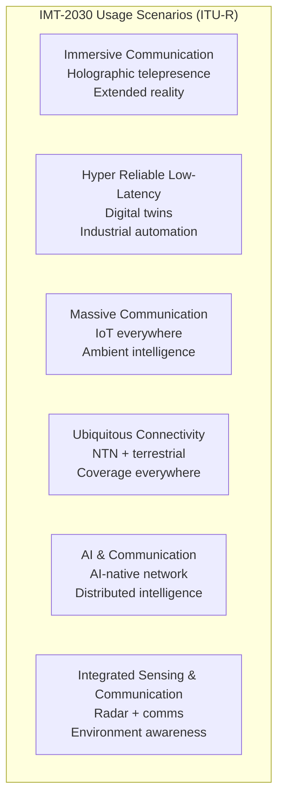
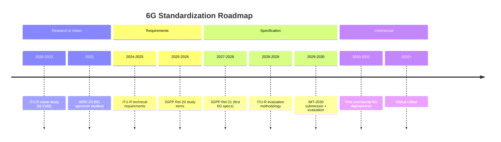
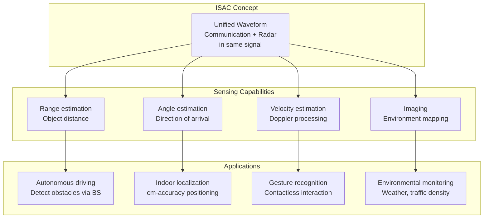
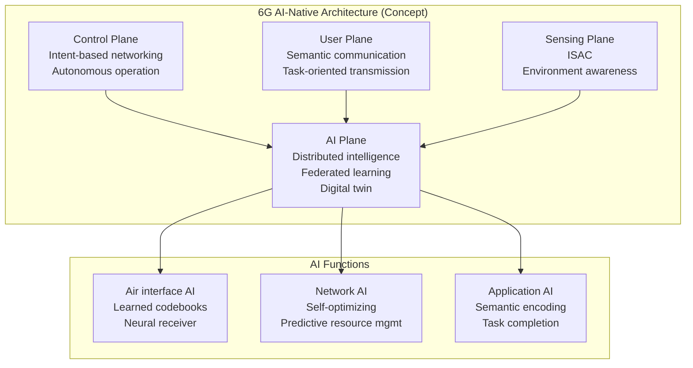
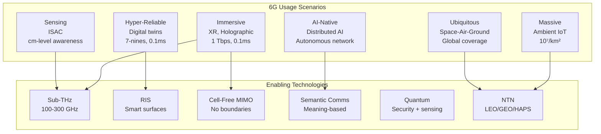
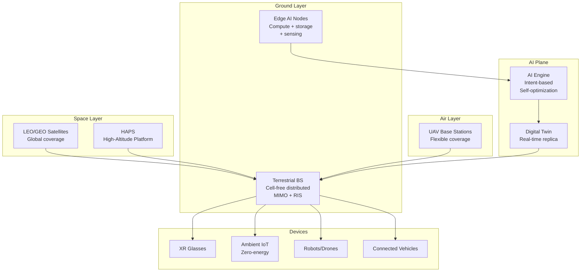

# 6G & IMT-2030 Vision

**Topic:** Sixth Generation Wireless — ITU IMT-2030 Framework, 6G Use Cases, Key Enabling Technologies  
**Standards:** ITU-R M.2160 (IMT-2030 Vision), 3GPP (Rel-20+ projected), ETSI ISG THz, IEEE  
**SDO:** ITU-R, 3GPP (future), ETSI, IEEE, Hexa-X (EU), NextG Alliance (US), NGMN  
**Audience:** Telecom researchers, network architects, wireless technology strategists, 6G system designers  
**Prerequisites:** 5G NR architecture, advanced wireless concepts (MIMO, mmWave), AI/ML basics

---

## Chapter 1 — Historical Context & Origin Story

### 1.1 Generation Cycle Pattern

| Generation | Vision Year | Standard Year | Commercial | Defining Feature |
|-----------|------------|--------------|-----------|-----------------|
| 1G | — | 1979 | 1979 | Analog voice |
| 2G | — | 1987 | 1991 | Digital voice + SMS |
| 3G | 1997 (IMT-2000) | 1999 | 2001 | Mobile data |
| 4G | 2008 (IMT-Advanced) | 2011 | 2012 | Mobile broadband |
| 5G | 2015 (IMT-2020) | 2018 | 2019 | eMBB + URLLC + mMTC |
| 6G | 2023 (IMT-2030) | ~2028-2029 | ~2030 | AI-native + sensing + ubiquitous |

### 1.2 6G Research Programs Worldwide

| Program | Region | Start | Focus |
|---------|--------|-------|-------|
| Hexa-X / Hexa-X-II | EU (Horizon Europe) | 2021/2023 | 6G system architecture, sustainability |
| NextG Alliance | US (ATIS-led) | 2020 | North American 6G roadmap |
| NGMN 6G Vision | Global (operators) | 2021 | Operator requirements |
| Beyond 5G Promotion Consortium | Japan | 2020 | Sub-THz, NTN, digital twin |
| IMT-2030 (6G) Push Group | China (MIIT) | 2019 | National 6G program |
| 6G Flagship | Finland (Oulu) | 2018 | First 6G research program globally |
| Samsung 6G Vision | Korea | 2020 | AI, sub-THz, holographic MIMO |
| One6G Association | Global | 2021 | 6G ecosystem development |

---

## Chapter 2 — Standard Architecture & Structure

### 2.1 ITU-R IMT-2030 Framework (M.2160)



### 2.2 IMT-2030 vs IMT-2020 KPIs

| KPI | 5G (IMT-2020) | 6G (IMT-2030 Target) | Improvement |
|-----|---------------|---------------------|-------------|
| Peak data rate | 20 Gbps | 1 Tbps | 50× |
| User experienced rate | 100 Mbps | 10 Gbps | 100× |
| Spectrum efficiency | 30 bps/Hz | 60+ bps/Hz | 2× |
| Area traffic capacity | 10 Mbps/m² | 100 Mbps/m² | 10× |
| Latency (user plane) | 1 ms | 0.1 ms (100 μs) | 10× |
| Connection density | 10⁶ devices/km² | 10⁷ devices/km² | 10× |
| Mobility | 500 km/h | 1000 km/h | 2× |
| Reliability | 99.999% (5 nines) | 99.99999% (7 nines) | 100× |
| Energy efficiency | Baseline | 100× improvement | 100× |
| Positioning accuracy | 10 cm (indoor) | 1 cm (3D) | 10× |
| Sensing resolution | N/A | cm-level range, °-level angle | New |

### 2.3 Standardization Timeline (Projected)



---

## Chapter 3 — Technical Deep Dive

### 3.1 Key Enabling Technologies

| Technology | Description | Maturity |
|-----------|-------------|----------|
| Sub-THz (100-300 GHz) | New spectrum for extreme bandwidth | Research |
| Reconfigurable Intelligent Surfaces (RIS) | Programmable reflectors for channel control | Prototype |
| AI-native air interface | ML-designed waveforms, learned codes | Research |
| Integrated Sensing & Communication (ISAC) | Radar + communication unified | Study items |
| Holographic MIMO | Continuous aperture, massive spatial multiplexing | Concept |
| Semantic communication | Transmit meaning, not bits | Early research |
| Cell-free massive MIMO | Distributed antennas, no cell boundaries | Prototype |
| Digital twin network | Real-time network replica for optimization | Developing |
| Quantum communication | QKD for ultra-secure links | Lab demo |
| Non-Terrestrial Networks (NTN) | LEO/GEO/HAPS native integration | Early commercial |
| Ambient IoT / Zero-energy | Backscatter + energy harvesting | Rel-18 study |
| Terahertz devices | InP/SiGe/CMOS THz transceivers | Lab-scale |

### 3.2 Sub-THz Communication

| Band | Frequency | Available BW | Challenge |
|------|-----------|-------------|-----------|
| D-band | 110-170 GHz | 60 GHz | Atmospheric absorption at 120/183 GHz |
| G-band | 140-220 GHz | 80 GHz | ~10 dB/km molecular absorption |
| 275-320 GHz | 275-320 GHz | 45 GHz | Severe path loss, very short range |

**Path loss at sub-THz:**

$$PL(d) = PL_0 + 20\log_{10}\left(\frac{4\pi d}{\lambda}\right) + \alpha_{atm} \cdot d$$

Where $\alpha_{atm}$ = atmospheric attenuation (dB/km), significant at specific frequencies (water vapor absorption lines at 183, 325 GHz).

**Use cases for sub-THz:** Short-range (1-100m), ultra-high-rate: wireless data centers, kiosk downloads, holographic display backhaul.

### 3.3 Integrated Sensing and Communication (ISAC)



### 3.4 Reconfigurable Intelligent Surfaces (RIS)

| Parameter | Description |
|-----------|------------|
| Concept | Large array of passive/semi-passive elements that reflect signals with programmable phase shifts |
| Elements | Meta-atoms (sub-wavelength, e.g., 100-10000 elements) |
| Power | Near-zero (passive reflection) or low (semi-passive with amplification) |
| Function | Create virtual LoS, enhance coverage, focus beams, null interference |
| Deployment | Walls, buildings, lamp posts |
| Standard | ETSI ISG RIS, 3GPP study (Rel-18+) |

### 3.5 AI-Native Network Architecture



---

## Chapter 4 — Implementation Guide

### 4.1 6G Network Architecture (Projected)

| Layer | 6G Concept | Difference from 5G |
|-------|-----------|-------------------|
| Air interface | AI-designed waveforms, sub-THz + mid-band | ML-optimized (vs handcrafted OFDM) |
| RAN | Cell-free distributed MIMO, RIS-assisted | No cell boundaries (vs cell-centric) |
| Core | Intent-based, autonomous, digital twin | Self-driving network (vs rule-based) |
| Compute | Native edge AI, split inference | Compute-communication convergence |
| Sensing | ISAC integrated in base stations | New capability (not in 5G) |
| Security | Quantum-safe, physical layer security | Post-quantum crypto (vs classical) |
| Connectivity | Terrestrial + NTN + underwater + body-area | True 3D coverage (vs ground-only) |

### 4.2 Projected 6G Device Requirements

| Parameter | 5G (2024) | 6G (2030 Target) |
|-----------|----------|------------------|
| Processing | 5G modem + AP | AI accelerator + 6G modem |
| Frequencies | Sub-6 + mmWave | Sub-6 + mmWave + sub-THz |
| Antenna | 4-8 elements | Holographic surface (100+ elements) |
| Sensing | GPS/IMU | Integrated radar + lidar-like |
| AI capability | Cloud-based | On-device neural processing |
| Power | Standard battery | Energy harvesting + wireless charging |
| Form factor | Phone/IoT | XR glasses, implants, ambient |

---

## Chapter 5 — Certification & Audit

### 5.1 IMT-2030 Evaluation Process (Projected)

| Phase | Activity | Timeline |
|-------|----------|----------|
| Vision | ITU-R M.2160 framework | 2023 (completed) |
| Requirements | Technical performance requirements | 2024-2025 |
| Evaluation methodology | How to assess candidate technologies | 2027-2028 |
| Technology submission | Proponents submit candidates | 2028-2029 |
| Evaluation | Independent evaluation groups assess | 2029-2030 |
| Specification | Approved as IMT-2030 | 2030 |

### 5.2 Pre-6G Research Validation

| Activity | Body | Focus |
|----------|------|-------|
| Channel measurement campaigns | Universities, 3GPP RAN | Sub-THz propagation characterization |
| Proof-of-concept demos | Industry (Nokia, Samsung, NTT) | Sub-THz links, RIS, ISAC |
| Testbeds | National programs (DARPA, Hexa-X) | System-level validation |
| Spectrum studies | ITU-R WP 5D + WP 1A | 6G band identification for WRC-27 |

---

## Chapter 6 — Regional & Domain Variants

| Region | 6G Program | Focus Areas | Target |
|--------|-----------|-------------|--------|
| EU | Hexa-X-II, SNS JU | Sustainability, digital inclusion, AI | 2030 |
| US | NextG Alliance, NSF, DARPA | AI, open architecture, security | 2030 |
| China | IMT-2030 Push Group | Sub-THz, satellite, massive IoT | 2030 |
| Japan | Beyond 5G/6G Strategy | NTN, terahertz, CPS (cyber-physical) | 2030 |
| South Korea | 6G R&D Program (MSIT) | Holographic, AI, sub-THz | 2028 (trials) |
| Finland | 6G Flagship (Oulu) | Academic research, standards leadership | 2030 |
| India | 6G Innovation Forum (TSDSI) | Affordable connectivity, rural | 2030+ |

---

## Chapter 7 — Comparison: 5G vs 6G

| Aspect | 5G (IMT-2020) | 6G (IMT-2030) |
|--------|---------------|---------------|
| Peak rate | 20 Gbps | 1 Tbps |
| Latency | 1 ms | 0.1 ms |
| Spectrum | Sub-6 + mmWave (to 71 GHz) | + Sub-THz (100-300 GHz) |
| Architecture | Cell-based, centralized RIC | Cell-free, AI-native, distributed |
| Intelligence | AI as optimization tool (NWDAF) | AI as design principle (native) |
| Sensing | Separate (not integrated) | ISAC (unified sensing + comms) |
| Coverage | Terrestrial primary (NTN add-on) | 3D ubiquitous (terrestrial + NTN + underwater) |
| Sustainability | Energy reduction efforts | Net-zero target, 100× efficiency |
| Security | Crypto-based | Quantum-safe + physical layer |
| Communication model | Bit-based | Semantic + task-oriented |
| Digital twin | Concept stage | Real-time network digital twin |
| Compute | Edge computing (MEC) | Compute-communication fusion |

---

## Chapter 8 — Mermaid Architecture Diagrams

### 8.1 6G System Vision



### 8.2 6G Network Architecture (Conceptual)



---

## Chapter 9 — Case Studies & Failure Analysis

### 9.1 Lessons from 5G for 6G Planning

| 5G Lesson | Implication for 6G |
|-----------|-------------------|
| mmWave coverage limitations | Sub-THz even more limited → need RIS, dense deployment |
| NSA delayed full capabilities | 6G should launch SA-first (no 5G anchor) |
| Network slicing slow adoption | 6G intent-based slicing must be simpler |
| Killer app unclear (beyond speed) | 6G needs clear value propositions (sensing, AI) |
| Open RAN integration complexity | 6G open architecture must simplify, not just disaggregate |
| Energy consumption increased | 6G must be energy-positive (net-zero networks) |

### 9.2 Sub-THz Communication Challenges

**Problem:** Above 100 GHz, atmospheric absorption, device power limitations, and CMOS/III-V technology constraints are severe.

**Specific challenges:** (1) Path loss: 20+ dB worse than mmWave at same distance. (2) Molecular absorption: Water vapor creates frequency-specific attenuation peaks (183 GHz, 325 GHz). (3) Device technology: Sub-THz power amplifiers have limited output (milliwatts). (4) Antenna arrays: Wavelength ~1mm → hundreds of elements needed for gain but fabrication is challenging.

**Potential solutions:** Extreme beamforming (pencil beams), RIS-assisted paths, short-range deployment only (<100m), new semiconductor processes (InP HBT, SiGe BiCMOS).

---

## Chapter 10 — Future Evolution & Industry Trends

| Milestone | Year | Event |
|-----------|------|-------|
| ITU-R requirements | 2025 | Technical KPIs formalized |
| WRC-27 | 2027 | 6G spectrum identification (sub-THz bands) |
| 3GPP Rel-20 | 2026-2027 | First 6G study items |
| 3GPP Rel-21 | 2028-2029 | First 6G normative specifications |
| First 6G trials | 2028-2029 | Korea, Japan, China expected first |
| IMT-2030 evaluation | 2029-2030 | ITU formally evaluates candidates |
| First commercial 6G | 2030-2031 | Expected in Korea, Japan, China |
| Global 6G | 2032-2035 | Widespread deployment |

### Paradigm Shifts Expected

| From (5G) | To (6G) |
|-----------|---------|
| Connected things | Connected intelligence |
| Bit-pipe communication | Semantic + goal-oriented communication |
| Separate sensing and comms | Integrated Sensing & Communication |
| Cell-centric | Cell-free / user-centric |
| Cloud AI | Distributed / federated AI |
| Terrestrial-first | 3D multi-layer (space-air-ground-sea) |
| Energy-consuming | Energy-neutral / harvesting |
| Human-centric | Human + machine + environment |

---

## Chapter 11 — Interview Questions & Career Guide

### Tier 1: Entry-Level

**Q1:** What are the main differences between 5G and 6G in terms of capabilities?  
**A:** 6G targets dramatic improvements: (1) **Speed:** 1 Tbps peak (50× over 5G's 20 Gbps). (2) **Latency:** 0.1 ms (10× over 5G's 1 ms). (3) **Reliability:** 99.99999% (100× improvement). (4) **New capabilities not in 5G:** Integrated sensing and communication (ISAC) — network doubles as radar/sensor. AI-native design — AI built into air interface, not just an add-on. Semantic communication — transmit meaning rather than raw bits. Sub-THz spectrum (100-300 GHz) — massive bandwidth. (5) **Philosophy shift:** 5G connects things; 6G connects intelligence and the physical/digital worlds (digital twin). Expected commercial launch: ~2030.

### Tier 2: Mid-Level

**Q2:** Explain Reconfigurable Intelligent Surfaces (RIS) and their role in 6G.  
**A:** **RIS** is a planar surface composed of many sub-wavelength elements (meta-atoms), each controllable to adjust the phase/amplitude of reflected electromagnetic waves. **Operation:** (1) Incident signal hits RIS. (2) Controller adjusts each element's reflection coefficient. (3) Reflected signal is steered toward desired direction (virtual beamforming). **Benefits for 6G:** (1) **Coverage extension:** Create virtual line-of-sight in blocked areas (sub-THz needs LoS). (2) **Near-zero power:** Passive reflection (no amplification needed). (3) **Interference management:** Null toward unintended receivers. (4) **Physical layer security:** Focus signal only at legitimate receiver. **Challenges:** (1) Channel estimation — need to know channel for each element. (2) Control overhead — many elements need frequent updates. (3) Deployment — where to place, how to integrate with network. **Standardization:** ETSI ISG RIS (study group), 3GPP studying for Rel-19/20.

### Tier 3: Senior

**Q3:** How would 6G AI-native architecture differ from 5G's approach to AI?  
**A:** **5G approach (AI as tool):** AI/ML added on top of existing architecture. NWDAF collects data, trains models offline, provides analytics. RIC uses AI for RAN optimization. Air interface is still hand-designed (OFDM, LDPC, etc.). AI doesn't change fundamental architecture. **6G AI-native (AI as design principle):** (1) **Air interface designed by AI:** Neural encoders/decoders replace traditional codecs. Channel codes learned by autoencoder. Waveforms optimized by ML for specific channels. (2) **AI plane:** New architectural plane alongside control/user/sensing. Distributed AI across network (federated learning). Digital twin for real-time "what-if" simulation. (3) **Autonomous operation:** Intent-based networking — operator expresses high-level goals, network self-configures. Zero-touch (no human intervention). Self-healing, self-optimizing. (4) **Semantic communication:** AI at Tx extracts meaning from source. AI at Rx reconstructs information from semantic representation. Dramatically reduces bandwidth for same task completion. **Challenge:** Explainability, safety certification (can you certify a learned air interface for safety-critical communications?).

---

## Chapter 12 — Cheat Sheet & Quick Reference

### 6G Key Facts

```
Timeline: 2030 commercial (3GPP Rel-21, ITU IMT-2030)
Peak rate: 1 Tbps
Latency: 0.1 ms
Reliability: 99.99999% (7 nines)
Spectrum: Sub-6 GHz + mmWave + Sub-THz (100-300 GHz)
Connection density: 10⁷ devices/km²
Positioning: 1 cm (3D)
Energy efficiency: 100× improvement over 5G
```

### 6G vs 5G Usage Scenarios

```
5G:  eMBB + URLLC + mMTC (3 scenarios)
6G:  Immersive + Hyper-Reliable + Massive + Ubiquitous + AI + Sensing (6 scenarios)

New in 6G:
  - Integrated Sensing & Communication (ISAC)
  - AI-native architecture
  - Semantic/goal-oriented communication
  - Digital twin network
  - Cell-free distributed MIMO
  - Reconfigurable Intelligent Surfaces (RIS)
  - Sub-THz (100-300 GHz) spectrum
  - Space-Air-Ground-Sea integration
```

### Key Research Programs

```
EU:     Hexa-X-II (Horizon Europe)
US:     NextG Alliance (ATIS), NSF RINGS
China:  IMT-2030 Push Group
Japan:  Beyond 5G Strategy
Korea:  6G R&D Program (MSIT)
Global: ITU-R WP 5D, NGMN, One6G
```

---

*End of Document — 10_6G_IMT_2030_Vision.md*
