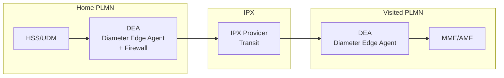
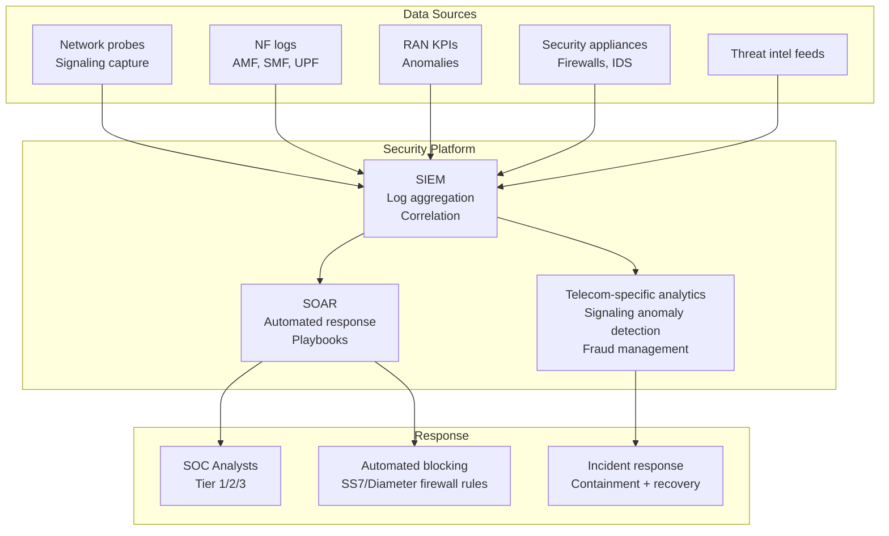
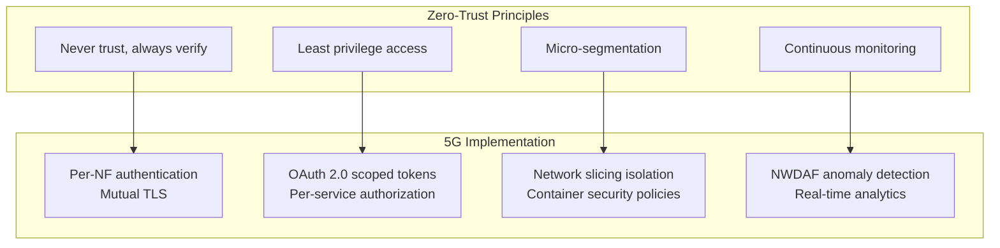
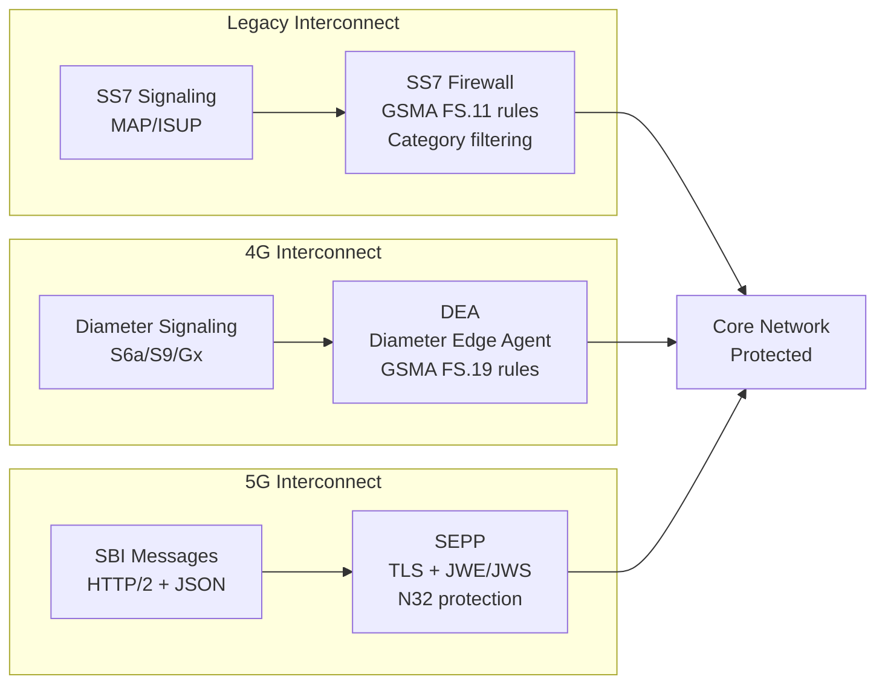

# Telecom Network Security

**Topic:** End-to-End Telecom Network Security — Signaling Security, Core Protection, RAN Security, Supply Chain  
**Standards:** 3GPP TS 33.xxx series, GSMA FS.11/FS.19/FS.31, NIST SP 800-187, ETSI EN 303 645  
**SDO:** 3GPP SA3, GSMA FASG, ENISA, NIST, ETSI  
**Audience:** Telecom security architects, SOC analysts (telecom), network security engineers, MNO CISOs  
**Prerequisites:** Mobile network architecture (2G-5G), IP security, cryptography, threat modeling

---

## Chapter 1 — Historical Context & Origin Story

### 1.1 Telecom Security Threat Evolution

| Era | Primary Threat | Attack Vector | Impact |
|-----|---------------|---------------|--------|
| 1990s (2G) | SIM cloning | COMP128 algorithm weakness | Billing fraud |
| 2000s (2G/3G) | SS7 exploitation | Unprotected signaling (no auth) | Location tracking, SMS intercept |
| 2010s (4G) | Diameter attacks | IPX interconnect vulnerabilities | Subscriber data leakage |
| 2014+ | IMSI catchers | Fake base stations | Surveillance, eavesdropping |
| 2018+ | Supply chain | Vendor backdoor concerns | National security |
| 2020+ | 5G threats | API abuse, slice isolation, MEC | Service disruption, data breach |
| 2023+ | AI-powered attacks | Automated vulnerability scanning | Evolving threat landscape |

### 1.2 Key Security Incidents

| Year | Incident | Impact |
|------|----------|--------|
| 2014 | SS7 vulnerabilities publicly demonstrated | Any phone globally trackable |
| 2017 | WannaCry impact on telecom (Telefonica) | Network operations disrupted |
| 2018 | Operation Soft Cell (APT) | Major operator compromised (CDR theft) |
| 2019 | Huawei/ZTE controversy | Supply chain security global debate |
| 2020 | SolarWinds supply chain attack | Telecom operators affected |
| 2021 | T-Mobile US data breach | 40M+ subscriber records stolen |
| 2023 | Multiple SIM swap fraud campaigns | Account takeover at scale |

---

## Chapter 2 — Standard Architecture & Structure

### 2.1 Telecom Security Standards Landscape

| Standard | Body | Scope |
|----------|------|-------|
| TS 33.501 | 3GPP | 5G security architecture |
| TS 33.117 | 3GPP | General security assurance requirements |
| TS 33.512-536 | 3GPP | SCAS for specific 5G NFs |
| GSMA FS.11 | GSMA FASG | SS7/MAP security guidelines |
| GSMA FS.19 | GSMA FASG | Diameter security guidelines |
| GSMA FS.31 | GSMA FASG | Diameter Roaming Security |
| GSMA FS.37 | GSMA FASG | 5G security best practices |
| GSMA NESAS | GSMA | Network Equipment Security Assurance |
| NIST SP 800-187 | NIST | 5G cybersecurity guide |
| ENISA 5G Security | ENISA | EU 5G threat landscape |
| EU 5G Toolbox | EU Commission | Risk mitigation measures |

### 2.2 Security Domains

```mermaid
graph TB
    subgraph "1. Access Security"
        A[UE-Network authentication<br/>Air interface encryption<br/>SUPI privacy]
    end
    
    subgraph "2. Network Domain Security"
        B[Inter-NF security (TLS)<br/>Inter-PLMN (SEPP/N32)<br/>IPsec for transport]
    end
    
    subgraph "3. Signaling Security"
        C[SS7/MAP firewalls<br/>Diameter Edge Agent<br/>NGAP/SBI protection]
    end
    
    subgraph "4. Infrastructure Security"
        D[VM/container hardening<br/>Cloud security (O-Cloud)<br/>Physical security]
    end
    
    subgraph "5. Operations Security"
        E[SOC/SIEM<br/>Incident response<br/>Vulnerability management]
    end
    
    subgraph "6. Supply Chain"
        F[Vendor assurance (NESAS)<br/>SBOM<br/>Third-party risk]
    end
    
    A --> B --> C --> D --> E --> F
```

---

## Chapter 3 — Technical Deep Dive

### 3.1 SS7/MAP Security Threats

| Attack | Mechanism | Impact | Mitigation |
|--------|-----------|--------|-----------|
| Location tracking | SendRoutingInfo + ProvideSubscriberInfo | Know subscriber's cell tower | SS7 firewall, MAP filtering |
| SMS interception | RegisterSS (forward SMS to attacker) | Read OTP, 2FA bypass | SMS home routing, firewall |
| Call interception | InsertSubscriberData (set CF) | Redirect calls to attacker | MAP Category filtering |
| Denial of Service | Cancel Location | Subscriber unreachable | Anomaly detection |
| Billing fraud | AnyTimeModification | Change charging parameters | Strict filtering |

### 3.2 Diameter Security Threats

| Attack | Mechanism | Impact |
|--------|-----------|--------|
| Location tracking | Insert-Subscriber-Data (IDR) | Track subscriber location |
| Session hijacking | Abort-Session-Request | Drop subscriber sessions |
| Information leakage | Authentication-Information-Request | Extract authentication vectors |
| DoS | Flooding Diameter messages | Overload HSS/MME |
| Roaming fraud | Manipulate roaming agreements | Financial loss |

**Mitigation architecture:**



### 3.3 5G-Specific Security Threats

| Threat Category | Specific Threat | 5G Mitigation |
|----------------|-----------------|---------------|
| Air interface | Fake base station (IMSI catcher) | SUCI privacy, integrity protection |
| Core network | NF impersonation | OAuth 2.0 + TLS mutual auth |
| SBI | API abuse (unauthorized NF access) | Token-based authorization, rate limiting |
| Network slicing | Cross-slice data leakage | Slice isolation (NF instances, transport QoS) |
| MEC | Edge application compromise | Application security, sandboxing |
| Supply chain | Malicious NF vendor code | NESAS audit + SCAS testing |
| Roaming | Inter-PLMN message manipulation | SEPP (N32 with TLS + JWE) |
| Open RAN | E2/A1/FH interface exploitation | O-RAN WG11 security specs |
| NTN | Satellite link interception | Encryption, beam security |

### 3.4 Security Monitoring Architecture



### 3.5 SIM Swap Fraud

| Stage | Attacker Action | Technical Mechanism |
|-------|----------------|---------------------|
| 1. Reconnaissance | Gather victim info (social media, breaches) | OSINT |
| 2. Social engineering | Contact operator, impersonate victim | Call center/retail manipulation |
| 3. SIM swap | Operator transfers number to new SIM | HLR/HSS provisioning update |
| 4. Account takeover | Receive SMS OTP on new SIM | 2FA bypass |
| 5. Financial fraud | Access bank accounts, crypto wallets | Account compromise |

**Mitigation:** Multi-factor verification for SIM changes, biometric auth, number lock features, real-time fraud detection (unusual provisioning patterns).

---

## Chapter 4 — Implementation Guide

### 4.1 Telecom Security Controls Framework

| Domain | Control | Standard |
|--------|---------|----------|
| Access | 5G-AKA / EAP-AKA' authentication | TS 33.501 |
| Air interface | NAS + AS encryption + integrity | TS 33.501 |
| NF-to-NF | TLS 1.2+ on all SBI interfaces | TS 33.501 §13 |
| Inter-PLMN | SEPP with N32-c/N32-f | TS 33.501 §9.9 |
| API security | OAuth 2.0 for NF authorization | TS 33.501 §13.3 |
| SS7/MAP | Signaling firewall (GSMA FS.11 rules) | GSMA FS.11 |
| Diameter | DEA + filtering rules (GSMA FS.19) | GSMA FS.19 |
| GTP | GTP firewall (anti-spoofing) | GSMA FS.20 |
| Infrastructure | Hardened OS, patching, access control | CIS benchmarks |
| Key management | HSM for subscriber keys, rotation policies | FIPS 140-2 |
| Monitoring | 24/7 SOC, telecom-specific SIEM | NIST CSF |
| Incident response | IR plan, tabletop exercises | NIST SP 800-61 |

### 4.2 Zero-Trust Architecture for 5G



### 4.3 Lawful Intercept (LI) Security

| Requirement | Standard | Implementation |
|-------------|----------|---------------|
| LI architecture | 3GPP TS 33.127/128 | ADMF + IRI-POI + CC-POI |
| LI security | TS 33.108 | Encrypted delivery, access control |
| EU privacy | ETSI TS 103 120 | GDPR-compliant LI |
| US CALEA | 47 USC 1002 | FCC requirements for carriers |
| Data protection | Local law | Minimal data, proportionality |

---

## Chapter 5 — Certification & Audit

### 5.1 Telecom Security Certifications

| Certification | Scope | Body |
|--------------|-------|------|
| GSMA NESAS | Vendor development + product security | GSMA (audit by accredited labs) |
| 3GPP SCAS | NF-specific security testing | 3GPP (testing per TS 33.51x) |
| ISO 27001 | Information security management | ISO (operator-level) |
| SOC 2 Type II | Security controls assurance | AICPA (cloud providers) |
| Common Criteria EAL4+ | Hardware security modules | CC recognition scheme |
| FIPS 140-3 | Cryptographic modules | NIST (US government) |
| EU Cybersecurity Act (EUCC) | ICT product certification | ENISA (EU scheme) |

### 5.2 Operator Security Audit Framework

| Audit Area | Framework | Frequency |
|-----------|-----------|-----------|
| Network infrastructure | NIST CSF / CIS Controls | Annual |
| Signaling security | GSMA FS.11/19 assessment | Semi-annual |
| Vendor security | NESAS + supply chain review | Per procurement |
| Cloud/virtualization | CSA CCM / K8s CIS | Quarterly |
| Access control | ISO 27001 A.9 | Annual |
| Incident response | NIST SP 800-61 | Quarterly (tabletop) |
| Penetration testing | OWASP, PTES | Annual (external), quarterly (internal) |

---

## Chapter 6 — Regional & Domain Variants

| Region | Key Regulation | Focus |
|--------|---------------|-------|
| EU | NIS2 Directive + EU 5G Toolbox | Critical infrastructure, high-risk vendor restrictions |
| US | CISA 5G Strategy + FCC | "Rip and replace" program, SBOM requirements |
| UK | Telecom Security Act 2021 | Mandatory security standards for operators |
| Germany | IT Security Act 2.0 | BSI certification for critical telecom components |
| India | DoT Security Conditions | Equipment testing, source code audit |
| Australia | Telecommunications Sector Security Reforms | Vendor exclusion (Huawei ban) |
| Japan | 5G security guidelines (MIC) | Supply chain transparency |

---

## Chapter 7 — Comparison: Security Across Network Generations

| Security Feature | 2G/3G | 4G (LTE) | 5G (NR) |
|-----------------|-------|----------|---------|
| Authentication | One-way (2G) / Mutual (3G) | EPS-AKA (mutual) | 5G-AKA + EAP-AKA' |
| Subscriber privacy | IMSI in clear | IMSI in clear (attach) | SUCI (ECIES encrypted) |
| Signaling security | SS7 (no auth) | Diameter (IPsec, weak) | SBI (TLS + OAuth) + SEPP |
| Air interface integrity | No (2G) / Yes (3G) | Mandatory (NAS) / No (UP) | Mandatory (NAS + UP optional) |
| Core security model | Perimeter | Perimeter + IPsec | Zero-trust (per-NF) |
| Equipment assurance | None | Limited | NESAS + SCAS |
| Roaming security | SS7 (open) | Diameter via IPX | SEPP + N32 (JWE) |
| Network exposure | None | Limited APIs | NEF (secured) |
| Threat landscape | Fraud, cloning | State actors, surveillance | APTs, supply chain, API abuse |

---

## Chapter 8 — Mermaid Architecture Diagrams

### 8.1 Telecom Security Layers

```mermaid
graph TB
    subgraph "Layer 1: Device/UE Security"
        A[SIM/eSIM<br/>Secure element<br/>5G-AKA keys]
    end
    
    subgraph "Layer 2: Air Interface Security"
        B[NAS encryption + integrity<br/>AS encryption + integrity<br/>SUCI privacy]
    end
    
    subgraph "Layer 3: RAN Security"
        C[gNB hardening<br/>Fronthaul encryption<br/>SCAS (TS 33.512)]
    end
    
    subgraph "Layer 4: Core Network Security"
        D[TLS on SBI<br/>OAuth 2.0<br/>NF isolation]
    end
    
    subgraph "Layer 5: Roaming/Interconnect Security"
        E[SEPP (N32)<br/>SS7/Diameter firewalls<br/>GTP firewalls]
    end
    
    subgraph "Layer 6: Application/Service Security"
        F[IMS security<br/>NEF API protection<br/>MEC sandboxing]
    end
    
    subgraph "Layer 7: Operations Security"
        G[SOC/SIEM<br/>Patch management<br/>Incident response]
    end
    
    A --> B --> C --> D --> E --> F --> G
```

### 8.2 Signaling Security Architecture



---

## Chapter 9 — Case Studies & Failure Analysis

### 9.1 SS7 Global Surveillance

**Background:** In 2014, researchers (Karsten Nohl, Tobias Engel) publicly demonstrated that SS7 signaling protocol has no authentication. Any entity with SS7 access (operators, MVNOs, IPX providers, roaming partners) can:
- Track any phone's location globally (SendRoutingInfo)
- Intercept SMS messages (RegisterSS to divert)
- Listen to voice calls (in combination with A5 weakness)

**Scale of problem:** >1000 entities worldwide have SS7 access. State actors and criminal organizations exploit this.

**Mitigation progress:** (1) GSMA FS.11 guidelines for SS7 filtering. (2) SMS home routing (prevent SMS interception). (3) SS7/MAP firewalls deployed by many operators. (4) However: many operators still haven't fully implemented. Some attacks still possible in 2024.

**Lesson for 5G:** SEPP and SBI security designed to prevent equivalent attacks. However, 2G/3G/4G will coexist for years, maintaining SS7/Diameter exposure.

### 9.2 Operation Soft Cell (2019)

**Attack:** APT group (attributed to Chinese state actor) compromised multiple telecom operators worldwide over 7+ years.

**Objective:** Access CDR (Call Detail Records) for targeted surveillance of individuals.

**Technique:** (1) Initial access via internet-facing servers. (2) Lateral movement through IT network. (3) Pivot to telecom-specific systems (BSS/OSS). (4) CDR database exfiltration for targeted subscribers.

**Impact:** Nation-state-level surveillance capability without SS7 exploitation. Direct database access bypasses signaling firewalls.

**Lesson:** IT/OT convergence in telecom means traditional IT threats (APTs, malware) directly impact telecom operations. Defense-in-depth required.

---

## Chapter 10 — Future Evolution & Industry Trends

| Trend | Impact on Telecom Security |
|-------|---------------------------|
| Post-quantum cryptography | Future-proof key exchange (CRYSTALS-Kyber) |
| AI-driven security | Automated threat detection, predictive analytics |
| Zero-trust everywhere | Per-microservice authentication in cloud-native 5G |
| SBOM (Software Bill of Materials) | Transparency in vendor software composition |
| Confidential computing | Protect data-in-use (SGX, TrustZone for NF workloads) |
| Deperimeterization | No trusted internal network assumption |
| 6G security | Physical layer auth, quantum communication, AI safety |
| Regulatory convergence | NIS2, EU Cybersecurity Act, US executive orders |
| Open RAN security | New interfaces = new attack surfaces |
| Private 5G security | Enterprise integration with corporate security |

---

## Chapter 11 — Interview Questions & Career Guide

### Tier 1: Entry-Level

**Q1:** What are the main security threats to mobile networks?  
**A:** Key threat categories: (1) **Signaling attacks:** SS7/Diameter exploitation for location tracking, SMS interception, call diversion (legacy networks). (2) **Air interface attacks:** Fake base stations (IMSI catchers), downgrade attacks (force 2G), eavesdropping. (3) **Core network compromise:** APT infiltration, NF exploitation, data breach (CDRs, subscriber records). (4) **Fraud:** SIM swap, international revenue share fraud (IRSF), roaming fraud. (5) **Supply chain:** Vendor backdoors, malicious firmware, compromised software updates. (6) **DDoS:** Signaling storms, UE-triggered NAS floods. (7) **API abuse:** Unauthorized access to network exposure functions. Each generation improves: 5G addresses many (SUCI for privacy, SEPP for roaming, NESAS for supply chain) but legacy interworking maintains older vulnerabilities.

### Tier 2: Mid-Level

**Q2:** How does a Diameter Edge Agent (DEA) protect against roaming attacks?  
**A:** **DEA** sits at the edge of an operator's Diameter signaling network (equivalent to a signaling firewall for 4G). **Protection mechanisms:** (1) **Message filtering:** Drop or modify Diameter messages based on GSMA FS.19 rules (e.g., block CLR from non-partner networks, restrict IDR to legitimate scenarios). (2) **Source validation:** Verify that Diameter messages come from legitimate roaming partners (based on origin realm/host). (3) **Category-based control:** Define which message types each partner is allowed to send (e.g., partner X can send ULR but not PUR). (4) **Rate limiting:** Prevent flooding attacks by throttling message rates per partner. (5) **Anomaly detection:** Flag unusual patterns (e.g., sudden surge of Authentication-Info requests for one subscriber). (6) **Topology hiding:** Mask internal network topology from roaming partners. **Deployment:** Typically inline on S6a/S9 roaming interfaces, before IPX transit.

### Tier 3: Senior

**Q3:** Design a zero-trust security architecture for a 5G core network.  
**A:** **Principles applied to 5GC:** (1) **Identity:** Every NF has a unique identity (X.509 cert). NRF acts as identity provider. No NF is trusted by default — even within the same network. (2) **Authentication:** Mutual TLS on every SBI interface (AMF↔SMF, SMF↔UDM, etc.). mTLS enforced at service mesh level. (3) **Authorization:** OAuth 2.0 with NRF as authorization server. Each NF gets scoped access tokens (e.g., SMF can call Npcf_SMPolicyControl but not Nudm_SubscriberDataManagement). Token validation at every service call. (4) **Micro-segmentation:** Each NF in its own container/pod. Network policies (Kubernetes NetworkPolicy or service mesh rules) restrict pod-to-pod communication to only required paths. (5) **Continuous verification:** NWDAF monitors NF behavior. Anomaly detection triggers token revocation. Short-lived tokens (force frequent re-authentication). (6) **Encryption everywhere:** Data-in-transit (TLS), data-at-rest (encrypted storage), data-in-use (confidential computing for sensitive NFs like AUSF/UDM). (7) **Supply chain:** NFs verified via SBOM + integrity checking at deployment. Signed container images. (8) **Monitoring:** Distributed tracing on all SBI calls. Real-time correlation for lateral movement detection.

---

## Chapter 12 — Cheat Sheet & Quick Reference

### Telecom Security Quick Reference

```
SS7 Security:    GSMA FS.11 (MAP filtering), SS7 firewall
Diameter Security: GSMA FS.19/31, DEA (Diameter Edge Agent)
5G Security:     TS 33.501, SEPP (N32), TLS + OAuth 2.0
Equipment:       GSMA NESAS + 3GPP SCAS
Supply Chain:    SBOM, vendor audit, NESAS Phase 1
Key Management:  HSM, FIPS 140-3, key rotation
Monitoring:      Telecom SIEM, signaling probes, NWDAF
Incident Response: NIST SP 800-61, operator CSIRT
Fraud Prevention: SIM swap detection, IRSF monitoring
Regulatory:      EU NIS2, UK TSA 2021, NIST SP 800-187
```

### Attack Surface by Generation

```
2G: SS7 (no auth), A5 cipher (broken), SIM cloning
3G: SS7 (inherited), IMSI exposed, improved auth
4G: Diameter (some auth), IMSI exposed, GTP vulnerabilities
5G: SBI (TLS+OAuth), SUCI privacy, SEPP, SCAS
    Remaining: legacy interworking, supply chain, Open RAN
```

### Security Standards Priority

```
Immediate: TS 33.501 (5G security), GSMA FS.11/19 (signaling)
Critical:  NESAS (equipment), SCAS (NF testing)
Compliance: NIS2 (EU), TSA (UK), ISO 27001 (global)
Emerging:  Post-quantum prep, AI security, O-RAN WG11
```

---

*End of Document — 11_Telecom_Network_Security.md*
