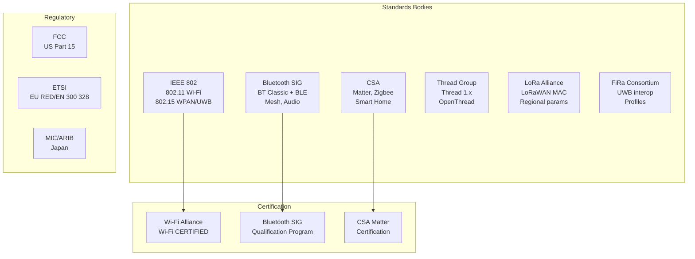
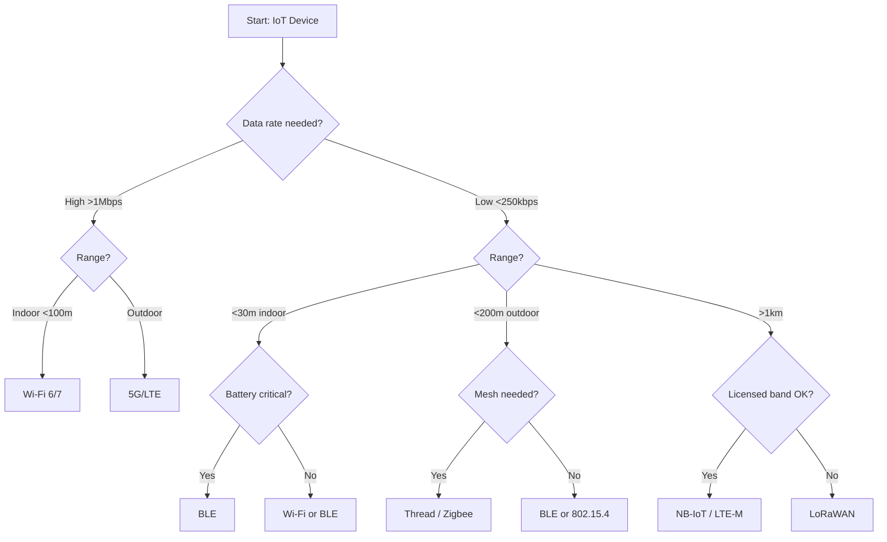
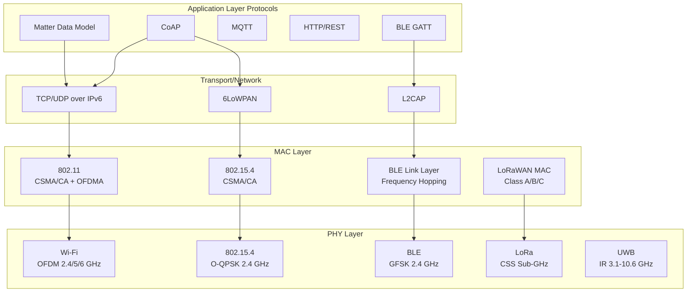
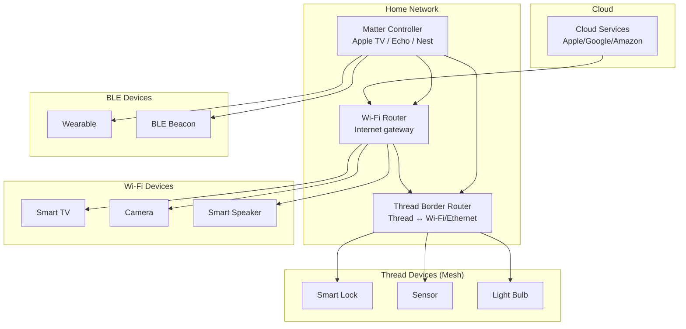

# Wireless, RF & IoT Standards Overview

**Topic:** Wireless Communication & IoT Standards Landscape — Wi-Fi, Bluetooth, Matter, Thread, UWB, LPWAN, RF Regulations  
**Standards:** IEEE 802.11, Bluetooth SIG, CSA Matter, Thread Group, IEEE 802.15.4z, LoRa Alliance, FCC Part 15, RED  
**SDO:** IEEE, Bluetooth SIG, Connectivity Standards Alliance (CSA), Thread Group, LoRa Alliance, FiRa, FCC, ETSI  
**Audience:** IoT architects, wireless engineers, embedded developers, RF compliance engineers, product managers  
**Prerequisites:** Basic RF concepts, networking fundamentals, embedded systems awareness

---

## Chapter 1 — Historical Context & Origin Story

### 1.1 Wireless Technology Timeline

| Year | Technology | Milestone |
|------|-----------|-----------|
| 1997 | IEEE 802.11 | Original Wi-Fi standard (2 Mbps) |
| 1998 | Bluetooth SIG | Founded by Nokia, Ericsson, IBM, Toshiba, Intel |
| 1999 | IEEE 802.11b | Wi-Fi 1 (11 Mbps, 2.4 GHz) |
| 2003 | ZigBee Alliance | Founded for 802.15.4-based IoT |
| 2004 | WPA2 | AES-CCMP security for Wi-Fi |
| 2009 | IEEE 802.11n | Wi-Fi 4 (MIMO, 600 Mbps) |
| 2010 | Bluetooth 4.0 | BLE revolution (Low Energy) |
| 2013 | IEEE 802.11ac | Wi-Fi 5 (MU-MIMO, 6.9 Gbps) |
| 2014 | LoRaWAN | LPWAN specification v1.0 |
| 2016 | Mirai botnet | IoT security wake-up call |
| 2018 | WPA3 | Modern Wi-Fi security (SAE) |
| 2019 | IEEE 802.11ax | Wi-Fi 6 (OFDMA, 9.6 Gbps) |
| 2020 | IEEE 802.15.4z | UWB secure ranging |
| 2022 | Matter 1.0 | Unified smart home protocol |
| 2024 | Wi-Fi 7 + BT 6.0 | Multi-Link Operation + Channel Sounding |

### 1.2 Technology Classification

| Category | Technologies | Frequency | Range | Data Rate |
|----------|-------------|-----------|-------|-----------|
| WLAN | Wi-Fi 4/5/6/6E/7 | 2.4/5/6 GHz | 50-100m indoor | 100 Mbps - 46 Gbps |
| WPAN | Bluetooth, BLE | 2.4 GHz | 10-100m | 1-2 Mbps |
| Mesh IoT | Thread, Zigbee, Z-Wave | 2.4 GHz / Sub-GHz | 10-30m per hop | 250 kbps |
| LPWAN | LoRaWAN, NB-IoT, Sigfox | Sub-GHz, LTE bands | 2-15 km | 0.3-250 kbps |
| Ranging | UWB (802.15.4z) | 3.1-10.6 GHz | 10-200m | Location focus |
| Smart Home | Matter (over Wi-Fi/Thread/BLE) | Various | In-home | Varies |

---

## Chapter 2 — Standard Architecture & Structure

### 2.1 SDO Ecosystem



### 2.2 Protocol Stack Comparison

| Layer | Wi-Fi | BLE | Thread | LoRaWAN | Matter |
|-------|-------|-----|--------|---------|--------|
| Application | HTTP/CoAP | GATT profiles | CoAP | Proprietary | Matter Data Model |
| Transport | TCP/UDP | L2CAP | UDP | — | UDP (MRP) |
| Network | IPv4/IPv6 | — | IPv6 (6LoWPAN) | — | IPv6 |
| MAC | 802.11 CSMA/CA | BLE link layer | 802.15.4 CSMA/CA | Class A/B/C ALOHA | (uses underlying) |
| PHY | OFDM/OFDMA | GFSK 1/2 Mbps | O-QPSK 250 kbps | CSS (LoRa) | (uses underlying) |
| Frequency | 2.4/5/6 GHz | 2.4 GHz | 2.4 GHz | Sub-GHz | 2.4 GHz |

---

## Chapter 3 — Technical Deep Dive

### 3.1 Spectrum Landscape

| Band | Frequency | Technologies | Regulation |
|------|-----------|-------------|-----------|
| Sub-GHz ISM | 868 MHz (EU) / 915 MHz (US) | LoRa, Sigfox, Z-Wave | ETSI EN 300 220, FCC Part 15.247 |
| 2.4 GHz ISM | 2400-2483.5 MHz | Wi-Fi, BLE, Zigbee, Thread | FCC 15.247, ETSI EN 300 328 |
| 5 GHz UNII | 5150-5850 MHz | Wi-Fi 5/6/7 | FCC 15.407, ETSI EN 301 893 |
| 6 GHz | 5925-7125 MHz | Wi-Fi 6E/7 | FCC 15.407, ETSI EN 303 687 |
| UWB | 3.1-10.6 GHz | IEEE 802.15.4z | FCC 15.517, ETSI EN 302 065 |

### 3.2 IoT Connectivity Selection Criteria

| Criterion | Wi-Fi | BLE | Thread | LoRaWAN | NB-IoT | UWB |
|-----------|-------|-----|--------|---------|--------|-----|
| Range | Medium | Short | Short (mesh) | Long | Long | Short |
| Power | High | Very Low | Very Low | Very Low | Low | Low |
| Data rate | Very High | Low | Low | Very Low | Very Low | Low |
| Latency | Low | Low | Medium | High | Medium | Very Low |
| Device cost | Medium | Very Low | Low | Low | Medium | Medium |
| Infrastructure | AP | — | Border Router | Gateway | Operator | — |
| IP native | Yes | No (BLE) | Yes (IPv6) | No | Yes | No |
| Best for | Streaming, high BW | Wearables, sensors | Smart home mesh | Agriculture, meters | Utility, smart city | Ranging, access |

### 3.3 Power Consumption Comparison

| Technology | Tx Power | Sleep Current | Battery Life (coin cell) |
|-----------|----------|--------------|--------------------------|
| Wi-Fi (802.11n) | 100-200 mW | 10-50 μA | Days-weeks |
| BLE (connection) | 10-30 mW | 1-3 μA | Years |
| Thread (802.15.4) | 10-30 mW | 1-5 μA | Years |
| LoRaWAN (Class A) | 25-100 mW | 1-2 μA | 5-10 years |
| NB-IoT (PSM) | 200 mW (Tx) | 3-5 μA | 10+ years |
| UWB | 30-50 mW | 1-5 μA | Months (frequent ranging) |

---

## Chapter 4 — Implementation Guide

### 4.1 Technology Selection Decision Tree



### 4.2 Coexistence Challenges (2.4 GHz)

| Issue | Cause | Mitigation |
|-------|-------|-----------|
| Wi-Fi ↔ BLE interference | Same 2.4 GHz band | Adaptive frequency hopping (BLE) |
| Wi-Fi ↔ Thread | Same band, different modulation | 802.15.4 CSMA-CA, channel selection |
| Microwave ovens | Broadband 2.45 GHz noise | Channel diversity, error correction |
| Dense Wi-Fi | Many APs on same channel | BSS Coloring (802.11ax), OBSS-PD |
| Wi-Fi ↔ Zigbee | Overlapping channels | Non-overlapping channel assignment |

---

## Chapter 5 — Certification & Audit

### 5.1 Certification Programs

| Technology | Program | Body | Requirements |
|-----------|---------|------|-------------|
| Wi-Fi | Wi-Fi CERTIFIED | Wi-Fi Alliance | Interop testing, conformance |
| Bluetooth | Bluetooth Qualification | Bluetooth SIG | QDID, compliance testing |
| Matter | Matter Certification | CSA | Protocol conformance + interop |
| Thread | Thread Certified | Thread Group | Stack conformance testing |
| LoRaWAN | LoRaWAN Certified | LoRa Alliance | Conformance + interop |
| UWB | FiRa Certified | FiRa Consortium | Interop profiles |
| RF (US) | FCC Authorization | FCC | EMC + spurious emissions testing |
| RF (EU) | CE marking (RED) | Notified Body | EN harmonized standards testing |

### 5.2 Certification Cost & Timeline

| Program | Typical Cost | Timeline | Validity |
|---------|-------------|----------|----------|
| Wi-Fi CERTIFIED | $20K-50K | 4-8 weeks | Per generation |
| Bluetooth QDID | $10K-30K | 2-6 weeks | Permanent (per design) |
| Matter | $15K-40K | 4-8 weeks | Per product |
| FCC (intentional radiator) | $10K-25K | 4-8 weeks | Until design change |
| CE (RED) | $8K-20K | 4-6 weeks | Until standard change |

---

## Chapter 6 — Regional & Domain Variants

| Region | 2.4 GHz | 5 GHz | 6 GHz | Sub-GHz IoT | Authority |
|--------|---------|-------|-------|-------------|-----------|
| US | 2400-2483.5 MHz, 1W EIRP | 5150-5850 MHz (UNII 1-4) | 5925-7125 MHz (full) | 902-928 MHz | FCC |
| EU | 2400-2483.5 MHz, 100mW EIRP | 5150-5725 MHz (DFS) | 5925-6425 MHz (lower only) | 863-870 MHz | ETSI/EC |
| Japan | 2400-2497 MHz, 10mW/MHz | 5150-5725 MHz | Under study | 920-928 MHz | MIC |
| China | 2400-2483.5 MHz | 5150-5350, 5725-5850 MHz | Under study | 470-510 MHz (LoRa) | MIIT |
| India | 2400-2483.5 MHz | 5150-5875 MHz | 5925-7125 MHz (approved 2023) | 865-867 MHz | DoT/WPC |

---

## Chapter 7 — Comparison: Short-Range Technologies

| Feature | Wi-Fi 6E | BLE 5.4 | Thread 1.3 | Matter 1.3 | UWB |
|---------|---------|---------|-----------|-----------|-----|
| Data rate | 9.6 Gbps | 2 Mbps | 250 kbps | (uses transport) | 6.8-27.2 Mbps |
| Range | 50-100m | 10-100m | 10-30m/hop | (uses transport) | 10-200m |
| Topology | Star (AP) | P2P, Star | Mesh (IP) | Star/Mesh | P2P |
| Power | High | Very Low | Very Low | Low-Medium | Low |
| IP support | Yes (IPv4/6) | No (native) | Yes (IPv6) | Yes (IPv6) | No |
| Security | WPA3 | AES-CCM | AES-CCM, MLE | Matter crypto | STS ranging |
| Best use case | Video, streaming | Wearables, beacons | Smart home mesh | Unified smart home | Secure access, locate |
| Ecosystem | Universal | Universal | Smart home | Smart home | Auto, mobile |

---

## Chapter 8 — Mermaid Architecture Diagrams

### 8.1 IoT Protocol Stack Taxonomy



### 8.2 Smart Home Connectivity



---

## Chapter 9 — Case Studies & Failure Analysis

### 9.1 Mirai Botnet (2016)

**Background:** IoT devices (cameras, routers, DVRs) with default passwords compromised at massive scale. Used to launch record DDoS attacks (1.2 Tbps against Dyn DNS).

**Root cause:** (1) Hard-coded default credentials. (2) No firmware update mechanism. (3) UPnP exposing devices to internet. (4) No device identity management.

**Industry response:** (1) ETSI EN 303 645 (IoT security baseline). (2) NIST IR 8259 (IoT device cybersecurity). (3) UK PSTI Act 2022 (mandatory IoT security). (4) US IoT Cybersecurity Improvement Act. (5) Matter standard includes mandatory security (certificate-based commissioning, encrypted communication).

### 9.2 Smart Home Fragmentation → Matter

**Problem (pre-2022):** Smart home devices required specific ecosystems: (1) Apple HomeKit (only Apple users). (2) Google Home (Weave/Thread). (3) Amazon Alexa (Wi-Fi + proprietary). (4) Samsung SmartThings (Zigbee/Z-Wave). (5) Consumers confused, developers had to support multiple protocols.

**Solution:** Matter 1.0 (2022) — unified protocol supported by all major ecosystems. IP-based, runs over Wi-Fi and Thread. Single certification → works everywhere. Backward compatibility via bridges.

---

## Chapter 10 — Future Evolution & Industry Trends

| Technology | Next Step | Timeline |
|-----------|-----------|----------|
| Wi-Fi | Wi-Fi 8 (802.11bn) — coordinated AP, 7.25 GHz | 2028 |
| Bluetooth | BT 6.1+ — enhanced channel sounding, AI-assisted | 2025+ |
| Matter | Matter 2.0 — cameras, robot vacuums, managed networks | 2025-2026 |
| Thread | Thread 2.0 — enhanced security, border router improvements | 2025 |
| UWB | Automotive integration (CCC 3.0), smart city | 2025+ |
| LoRaWAN | LoRaWAN Relay — extend coverage without gateways | 2024+ |
| NB-IoT/LTE-M | RedCap (5G NR-Light) — converge IoT into 5G | 2024-2025 |
| Ambient IoT | 3GPP Ambient IoT — zero-energy harvesting devices | 2025-2027 |
| 6 GHz | Global 6 GHz opening for Wi-Fi (WRC-23 progress) | 2024-2026 |

---

## Chapter 11 — Interview Questions & Career Guide

### Tier 1: Entry-Level

**Q1:** Compare BLE and Wi-Fi for IoT applications.  
**A:** **BLE:** (1) Ultra-low power (coin cell for years). (2) Low data rate (1-2 Mbps). (3) Short range (10-30m typical). (4) Simple stack, low cost. (5) Best for: wearables, beacons, sensors, health devices. **Wi-Fi:** (1) High power (needs mains or large battery). (2) High data rate (100+ Mbps). (3) Medium range (50-100m). (4) Complex stack, higher cost. (5) Best for: cameras, smart speakers, streaming devices. **Key difference:** Power vs. bandwidth tradeoff. Choose BLE when battery life is critical and data is small/infrequent. Choose Wi-Fi when high throughput is needed and power is available.

### Tier 2: Mid-Level

**Q2:** How does Thread differ from Zigbee and why did Matter choose Thread?  
**A:** **Key differences:** (1) **IP native:** Thread uses 6LoWPAN → full IPv6 addressing. Zigbee uses its own network layer (non-IP). (2) **No single point of failure:** Thread has no coordinator (unlike Zigbee coordinator). Any router can route. Leader is elected. (3) **Self-healing mesh:** Thread re-routes automatically on node failure. (4) **Security:** Thread uses DTLS + MLE with per-device keys. More modern crypto. (5) **Border Router:** Thread connects to IP networks via Border Router (Zigbee needs gateway/bridge with translation). **Why Matter chose Thread:** Matter is IP-based (UDP/IPv6). Thread provides native IPv6 mesh for low-power devices. No protocol translation needed. Multiple border routers for redundancy. Fits Matter's IP-first philosophy perfectly.

### Tier 3: Senior

**Q3:** Design a large-scale IoT deployment for a smart building (1000+ devices). What technologies would you use and why?  
**A:** **Architecture:** (1) **Sensors (temperature, humidity, occupancy) — Thread mesh:** Low power, self-healing mesh, IP-native. Border routers per floor. Hundreds of devices per Thread network. (2) **Cameras, displays — Wi-Fi 6E:** High bandwidth needed. Dedicated 6 GHz SSID (less interference). (3) **Access control — UWB + BLE:** UWB for precise ranging (door proximity), BLE for enrollment/fallback. (4) **Energy meters, HVAC — BACnet/IP or Modbus over Ethernet:** Industrial protocols for building systems. (5) **Outdoor perimeter sensors — LoRaWAN:** Long range, battery-powered, low data rate. (6) **Unified control — Matter over Thread/Wi-Fi:** Single protocol for multi-vendor interop. (7) **Backbone:** Ethernet + Wi-Fi 6E APs. Dedicated IoT VLAN. (8) **Security:** Micro-segmentation (IoT VLAN isolated), certificate-based device identity, encrypted communication, firmware OTA with code signing.

---

## Chapter 12 — Cheat Sheet & Quick Reference

### Technology Quick Selection

```
High bandwidth, mains powered     → Wi-Fi 6/6E/7
Low power, short range, wearable  → BLE 5.x
Smart home mesh, IP-native        → Thread (Matter)
Long range, low power, outdoors   → LoRaWAN
Licensed LPWAN, QoS needed        → NB-IoT / LTE-M
Precise location/ranging          → UWB (802.15.4z)
Unified smart home protocol       → Matter 1.x
```

### Key Standards

```
Wi-Fi:    IEEE 802.11ax (Wi-Fi 6), 802.11be (Wi-Fi 7)
BLE:      Bluetooth 5.4/6.0 (Bluetooth SIG)
Thread:   Thread 1.3 (Thread Group) + OpenThread
Matter:   Matter 1.3 (CSA)
UWB:      IEEE 802.15.4z + FiRa profiles
LoRaWAN:  LoRaWAN 1.0.4/1.1 (LoRa Alliance)
NB-IoT:   3GPP TS 36.xxx (Rel-13+)
Security: ETSI EN 303 645 (IoT baseline)
RF (US):  FCC Part 15
RF (EU):  RED 2014/53/EU + EN harmonized standards
```

---

*End of Document — 00_Wireless_RF_IoT_Overview.md*
