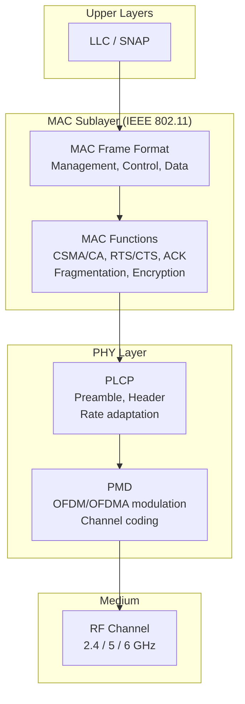
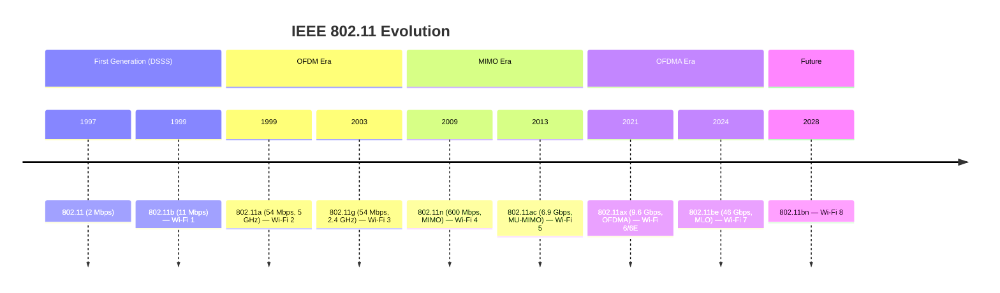
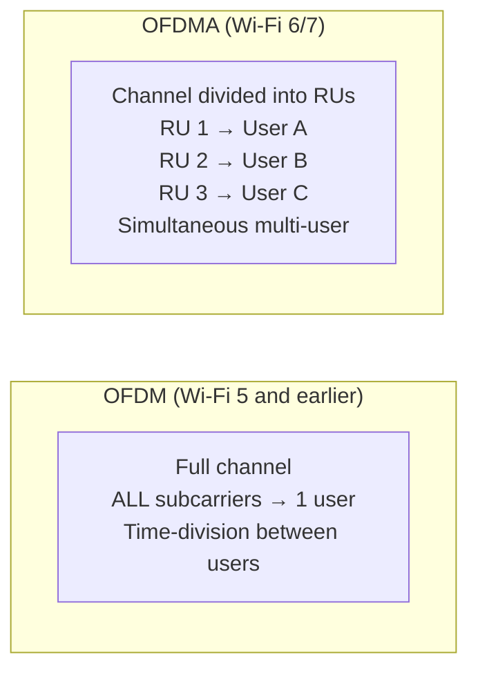
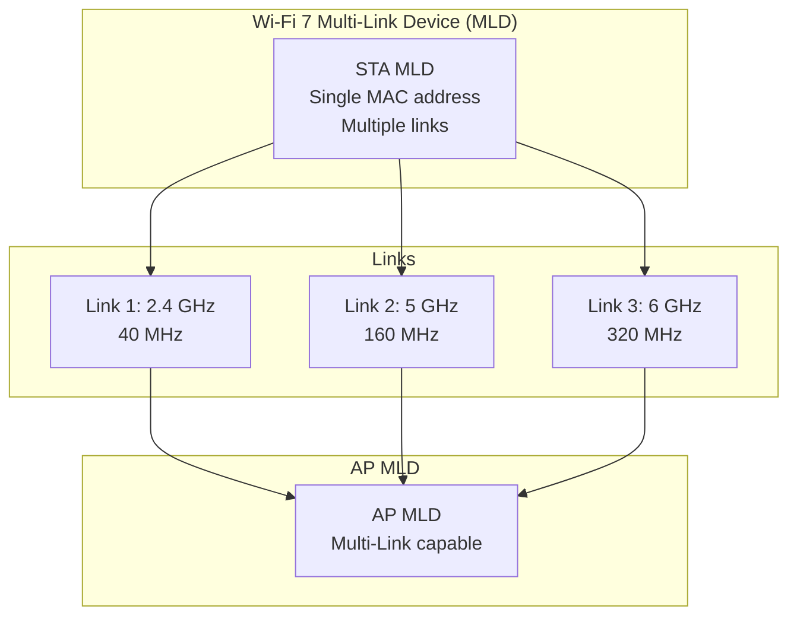

# Wi-Fi IEEE 802.11 History

**Topic:** Evolution of Wi-Fi from IEEE 802.11 (1997) to Wi-Fi 7 (2024) — Complete Generation History  
**Standards:** IEEE 802.11, 802.11b, 802.11a, 802.11g, 802.11n, 802.11ac, 802.11ax, 802.11be  
**SDO:** IEEE 802.11 Working Group, Wi-Fi Alliance  
**Audience:** Network engineers, wireless architects, embedded Wi-Fi developers, certification engineers  
**Prerequisites:** Basic RF principles, OFDM modulation, networking fundamentals

---

## Chapter 1 — Historical Context & Origin Story

### 1.1 Wi-Fi Origins

| Year | Event | Significance |
|------|-------|-------------|
| 1985 | FCC opens ISM bands | Unlicensed spectrum enables innovation |
| 1991 | NCR/AT&T WaveLAN | First commercial WLAN product |
| 1997 | IEEE 802.11 original | 2 Mbps (FHSS/DSSS), 2.4 GHz |
| 1999 | IEEE 802.11b | 11 Mbps, CCK modulation, Wi-Fi brand born |
| 1999 | IEEE 802.11a | 54 Mbps, OFDM, 5 GHz |
| 1999 | Wi-Fi Alliance formed | WECA → Wi-Fi Alliance (interop certification) |
| 2003 | IEEE 802.11g | 54 Mbps at 2.4 GHz (OFDM) |
| 2004 | WPA2 (802.11i) | AES-CCMP security standard |
| 2009 | IEEE 802.11n (Wi-Fi 4) | MIMO, 40 MHz, 600 Mbps |
| 2013 | IEEE 802.11ac (Wi-Fi 5) | 5 GHz, 160 MHz, MU-MIMO, 6.9 Gbps |
| 2018 | WPA3 | SAE (Dragonfly), forward secrecy |
| 2019 | Wi-Fi 6 naming | Wi-Fi Alliance introduces generation numbers |
| 2021 | IEEE 802.11ax (Wi-Fi 6) | OFDMA, BSS Coloring, TWT, 9.6 Gbps |
| 2021 | Wi-Fi 6E | Extension to 6 GHz band |
| 2024 | IEEE 802.11be (Wi-Fi 7) | 320 MHz, 4096-QAM, MLO, 46 Gbps |

### 1.2 Generation Naming (Wi-Fi Alliance)

| Marketing Name | IEEE Standard | Year | Key Feature |
|---------------|--------------|------|-------------|
| Wi-Fi 1 | 802.11b | 1999 | 11 Mbps, 2.4 GHz |
| Wi-Fi 2 | 802.11a | 1999 | 54 Mbps, 5 GHz, OFDM |
| Wi-Fi 3 | 802.11g | 2003 | 54 Mbps, 2.4 GHz, OFDM |
| Wi-Fi 4 | 802.11n | 2009 | MIMO, 600 Mbps |
| Wi-Fi 5 | 802.11ac | 2013 | MU-MIMO, 6.9 Gbps |
| Wi-Fi 6 | 802.11ax | 2021 | OFDMA, TWT |
| Wi-Fi 6E | 802.11ax (6 GHz) | 2021 | 6 GHz extension |
| Wi-Fi 7 | 802.11be | 2024 | MLO, 320 MHz, 46 Gbps |
| Wi-Fi 8 | 802.11bn | ~2028 | Under development |

---

## Chapter 2 — Standard Architecture & Structure

### 2.1 IEEE 802.11 Document Structure

| Amendment | Full Title | Pages | Scope |
|-----------|-----------|-------|-------|
| 802.11-2020 | Base standard (consolidated) | 4379 | PHY + MAC complete |
| 802.11ax-2021 | High Efficiency (HE) | 783 | OFDMA, TWT, BSS Coloring |
| 802.11be-2024 | Extremely High Throughput (EHT) | 1000+ | MLO, 320 MHz, 4096-QAM |
| 802.11i-2004 | Security (RSN) | 190 | WPA2, AES-CCMP |
| 802.11k/v/r | Roaming assistance | Various | Fast BSS transition |

### 2.2 802.11 Protocol Layers



---

## Chapter 3 — Technical Deep Dive

### 3.1 PHY Evolution Across Generations

| Generation | Modulation | Max BW | Max Streams | Max MCS | Peak Rate |
|-----------|-----------|--------|------------|---------|-----------|
| 802.11b | CCK/DSSS | 22 MHz | 1 | — | 11 Mbps |
| 802.11a/g | OFDM (64-QAM) | 20 MHz | 1 | MCS 8 | 54 Mbps |
| 802.11n (Wi-Fi 4) | OFDM (64-QAM) | 40 MHz | 4×4 | MCS 31 | 600 Mbps |
| 802.11ac (Wi-Fi 5) | OFDM (256-QAM) | 160 MHz | 8×8 | MCS 9 | 6.9 Gbps |
| 802.11ax (Wi-Fi 6) | OFDMA (1024-QAM) | 160 MHz | 8×8 | MCS 11 | 9.6 Gbps |
| 802.11be (Wi-Fi 7) | OFDMA (4096-QAM) | 320 MHz | 16×16 | MCS 13 | 46.1 Gbps |

### 3.2 Key Technology Innovations per Generation

| Gen | Innovation | Benefit |
|-----|-----------|---------|
| 11n | MIMO (spatial multiplexing) | Nx throughput with N antennas |
| 11n | 40 MHz channel bonding | 2× bandwidth |
| 11ac | MU-MIMO (downlink) | Serve multiple users simultaneously |
| 11ac | 80/160 MHz channels | Higher throughput |
| 11ac | Beamforming (standardized) | Better range/SNR |
| 11ax | OFDMA | Multi-user in frequency domain (like LTE) |
| 11ax | BSS Coloring | Reduce CCA false positives in dense environments |
| 11ax | TWT (Target Wake Time) | IoT power savings |
| 11ax | 1024-QAM | 25% throughput increase (close range) |
| 11be | Multi-Link Operation (MLO) | Aggregate bands, lower latency |
| 11be | 320 MHz channels | 2× bandwidth over 160 MHz |
| 11be | 4096-QAM | 20% throughput increase |
| 11be | Multi-RU puncturing | Use available spectrum flexibly |

### 3.3 OFDM Subcarrier Structure

| Generation | FFT Size (20 MHz) | Subcarrier Spacing | Symbol Duration | CP |
|-----------|-------------------|-------------------|-----------------|-----|
| 11a/g/n/ac | 64 | 312.5 kHz | 3.2 μs | 0.8 μs |
| 11ax | 256 | 78.125 kHz | 12.8 μs | 0.8/1.6/3.2 μs |
| 11be | 256 | 78.125 kHz | 12.8 μs | 0.8/1.6/3.2 μs |

**Wi-Fi 6/7 narrower subcarrier spacing (78.125 kHz):** 4× more subcarriers in same bandwidth → better OFDMA granularity for multi-user access.

### 3.4 Throughput Calculation

$$R = N_{SS} \times \frac{N_{SD} \times N_{BPSCS} \times R_{code}}{T_{SYM}}$$

Where:
- $N_{SS}$ = Number of spatial streams
- $N_{SD}$ = Number of data subcarriers
- $N_{BPSCS}$ = Bits per subcarrier per symbol (depends on QAM: 256-QAM = 8 bits)
- $R_{code}$ = Coding rate (e.g., 5/6)
- $T_{SYM}$ = OFDM symbol duration (including cyclic prefix)

---

## Chapter 4 — Implementation Guide

### 4.1 Wi-Fi SoC Market (2024)

| Vendor | Chip Family | Wi-Fi Gen | Target |
|--------|-----------|-----------|--------|
| Qualcomm | FastConnect 7900 | Wi-Fi 7 | Flagship smartphones |
| Qualcomm | QCA6696 | Wi-Fi 7 | Automotive |
| Broadcom | BCM4398 | Wi-Fi 7 | Enterprise AP, laptops |
| MediaTek | Filogic 880/380 | Wi-Fi 7 | Router, IoT |
| Intel | BE200 (Gale Peak 2) | Wi-Fi 7 | PC/Laptop |
| Espressif | ESP32-C6 | Wi-Fi 6 | IoT (low cost) |
| NXP | IW612 | Wi-Fi 6E | Automotive, industrial |
| Infineon | AIROC CYW55xxx | Wi-Fi 6E | IoT, wearables |

### 4.2 Wi-Fi Frame Types

| Category | Type | Purpose |
|----------|------|---------|
| Management | Beacon | AP announces presence (SSID, capabilities) |
| Management | Probe Request/Response | STA scans for networks |
| Management | Authentication | Open/SAE authentication |
| Management | Association | STA joins BSS |
| Control | RTS/CTS | Medium reservation |
| Control | ACK | Frame acknowledgement |
| Control | Block ACK | Aggregated acknowledgement |
| Data | QoS Data | User payload + QoS |
| Data | Null Data | Power management signaling |

---

## Chapter 5 — Certification & Audit

### 5.1 Wi-Fi Alliance Certification Programs

| Program | Scope | Mandatory Features |
|---------|-------|-------------------|
| Wi-Fi CERTIFIED 6 | 802.11ax compliance | OFDMA, WPA3, TWT |
| Wi-Fi CERTIFIED 6E | 6 GHz operation | AFC (US), low latency |
| Wi-Fi CERTIFIED 7 | 802.11be compliance | MLO, 320 MHz, 4096-QAM |
| WPA3-Personal | Security | SAE, PMF, forward secrecy |
| WPA3-Enterprise | Security | 192-bit suite, CNSA |
| Wi-Fi EasyConnect (DPP) | Provisioning | QR code setup |
| Wi-Fi Aware | Discovery | Pre-association service discovery |
| Passpoint (Hotspot 2.0) | Roaming | Automated hotspot authentication |

### 5.2 Certification Testing

| Test Category | Methodology | Equipment |
|--------------|-------------|-----------|
| Conformance | Protocol message sequence verification | Sniffer + test bed |
| Interoperability | Multi-vendor device communication | Wi-Fi Alliance test bed |
| Performance | Throughput, range, latency | Shielded chamber, controlled env |
| Security | WPA3 SAE exchange, PMF | Protocol analyzer |
| Coexistence | Operation alongside other Wi-Fi devices | Multiple APs + STAs |

---

## Chapter 6 — Regional & Domain Variants

### 6.1 Spectrum Availability by Region

| Band | US (FCC) | EU (ETSI) | Japan (MIC) | China (MIIT) |
|------|----------|----------|-------------|--------------|
| 2.4 GHz channels | 1-11 | 1-13 | 1-13 (14 legacy) | 1-13 |
| 5 GHz | UNII 1-4 (5150-5850) | 5150-5725 (DFS) | 5150-5725 | 5150-5350, 5725-5850 |
| 6 GHz | Full (5925-7125) | Lower (5925-6425) | Under study | Under study |
| DFS required | UNII-2, 2C, 2E | 5250-5725 | Yes | Yes |
| TPC required | UNII-2+ | Yes (>200mW) | Yes | Yes |

### 6.2 Power Limits

| Band | US (EIRP) | EU (EIRP) |
|------|-----------|-----------|
| 2.4 GHz indoor | 1W (30 dBm) | 100 mW (20 dBm) |
| 5 GHz UNII-1 | 200 mW (23 dBm) | 200 mW (23 dBm) |
| 5 GHz UNII-3 | 1W (30 dBm) | 1W (30 dBm) |
| 6 GHz LPI (indoor) | 30 mW/MHz | 200 mW (23 dBm) |
| 6 GHz SP (outdoor) | 36 dBm (AFC required) | Not allowed (lower only) |

---

## Chapter 7 — Comparison: Wi-Fi Generations

| Feature | Wi-Fi 4 (11n) | Wi-Fi 5 (11ac) | Wi-Fi 6 (11ax) | Wi-Fi 7 (11be) |
|---------|--------------|---------------|---------------|----------------|
| Year | 2009 | 2013 | 2021 | 2024 |
| Bands | 2.4 + 5 GHz | 5 GHz only | 2.4 + 5 + 6 GHz | 2.4 + 5 + 6 GHz |
| Max BW | 40 MHz | 160 MHz | 160 MHz | 320 MHz |
| Modulation | 64-QAM | 256-QAM | 1024-QAM | 4096-QAM |
| Access | CSMA/CA | CSMA/CA | OFDMA | OFDMA |
| MU-MIMO | No | DL only (4 users) | UL + DL (8 users) | 16 users |
| Streams | 4×4 | 8×8 | 8×8 | 16×16 |
| Peak rate | 600 Mbps | 6.9 Gbps | 9.6 Gbps | 46 Gbps |
| Key innovation | MIMO | Beamforming, MU | OFDMA, TWT | MLO, Puncturing |
| IoT feature | — | — | TWT (power save) | Restricted TWT |

---

## Chapter 8 — Mermaid Architecture Diagrams

### 8.1 Wi-Fi Evolution Timeline



### 8.2 OFDMA vs OFDM



### 8.3 Multi-Link Operation (Wi-Fi 7)



---

## Chapter 9 — Case Studies & Failure Analysis

### 9.1 WEP Crack (2001-2004)

**Issue:** Original Wi-Fi security (WEP) used RC4 with 24-bit IV → predictable key stream after ~4000 packets.

**Impact:** Any Wi-Fi network could be broken in minutes with tools like AirSnort, aircrack-ng.

**Resolution:** WPA (TKIP, interim fix) → WPA2 (AES-CCMP, 2004) → WPA3 (SAE, 2018). Each generation addressed weaknesses of the previous.

### 9.2 Dense Stadium Deployments

**Challenge:** 70,000+ users in a stadium with 500+ APs. Massive co-channel interference, roaming storms, capacity overload.

**Solutions:** (1) High-density AP design (sector antennas, 5 GHz only). (2) 802.11ax OFDMA (schedule users efficiently). (3) BSS Coloring (reduce unnecessary deferral). (4) Band steering (push capable clients to 5/6 GHz). (5) Wi-Fi 7 MLO will further improve by using all bands simultaneously.

---

## Chapter 10 — Future Evolution & Industry Trends

| Standard | Focus | Timeline |
|----------|-------|----------|
| 802.11bn (Wi-Fi 8) | Coordinated AP, full-duplex, 7.25 GHz | 2028-2030 |
| 802.11bp | In-vehicle networking (replacing Ethernet) | 2025 |
| 802.11bb | Light Communications (LiFi) | 2024 |
| 802.11az | Next-gen positioning (fine timing + FTM) | 2023 |
| AFC expansion | More countries enable outdoor 6 GHz | 2024-2026 |
| Upper 6 GHz (EU) | EU opening 6425-7125 MHz for Wi-Fi | 2025-2026 |

---

## Chapter 11 — Interview Questions & Career Guide

### Tier 1: Entry-Level

**Q1:** What is OFDMA and why was it introduced in Wi-Fi 6?  
**A:** **OFDMA** (Orthogonal Frequency Division Multiple Access) divides a Wi-Fi channel into smaller sub-channels called Resource Units (RUs), allowing the AP to serve multiple clients simultaneously in a single transmission opportunity. **Before (OFDM):** entire channel assigned to one user at a time (time-division). **With OFDMA:** frequency-division among multiple users. **Why introduced:** (1) Dense environments (many devices, small packets — IoT, phones). (2) Reduces latency (no waiting in queue for small packets). (3) Improves efficiency for mixed traffic (video + IoT + web). (4) Borrowed from cellular (LTE uses OFDMA). Example: A 20 MHz channel can be split into 9 RUs of 26 subcarriers each, serving 9 users simultaneously.

### Tier 2: Mid-Level

**Q2:** Explain Multi-Link Operation (MLO) in Wi-Fi 7 and its advantages.  
**A:** **MLO** allows a single Wi-Fi 7 device to simultaneously use multiple frequency bands (2.4 + 5 + 6 GHz) through a unified Multi-Link Device (MLD) entity. **Modes:** (1) **Simultaneous Transmit and Receive (STR):** Send on one link, receive on another concurrently. Requires sufficient antenna isolation. (2) **Non-STR (NSTR):** Can't TX/RX simultaneously on both links but switches dynamically. (3) **Enhanced MLO (eMLO):** Load balance across links. **Advantages:** (1) **Aggregated throughput:** Sum of all links' capacity. (2) **Lower latency:** If one link is busy, use another (redundancy). (3) **Better reliability:** Packet duplication across links for critical traffic. (4) **Seamless band steering:** No reassociation when switching bands. **Implementation:** Single MAC address for MLD, single security association (one 4-way handshake), unified power management.

### Tier 3: Senior

**Q3:** How would you design a Wi-Fi 7 enterprise deployment for a 50-floor office building?  
**A:** Key design considerations: (1) **Band planning:** 6 GHz as primary data (clean spectrum, 320 MHz channels). 5 GHz as secondary. 2.4 GHz for legacy/IoT only. (2) **AP density:** High-density model: 1 AP per 1500 sq ft. Use directional antennas (sector, 90°/120°). (3) **MLO strategy:** Configure AP MLDs with 2.4+5+6 links. Latency-sensitive (video conferencing) → duplicate across links. Throughput → aggregate. (4) **Channel planning:** 6 GHz: Three non-overlapping 320 MHz channels (sufficient for 3-sector reuse). 5 GHz: Use DFS channels, 80 MHz (more reuse). 2.4 GHz: Channels 1, 6, 11 only. (5) **Security:** WPA3-Enterprise (192-bit), 802.1X with RADIUS. SAE transition mode for mixed environments. (6) **Roaming:** 802.11r (Fast BSS Transition) + 802.11k (neighbor reports) + 802.11v (BSS Transition Management). Target: <20ms handoff. (7) **AFC:** Register with AFC system for outdoor 6 GHz APs (standard power). Indoor APs use LPI. (8) **Management:** Cloud-managed APs, AI-driven RF optimization, dynamic channel assignment.

---

## Chapter 12 — Cheat Sheet & Quick Reference

### Wi-Fi Generation Quick Reference

```
Wi-Fi 4 (11n):  2009, 2.4+5 GHz, 40 MHz, 4x4 MIMO, 600 Mbps
Wi-Fi 5 (11ac): 2013, 5 GHz, 160 MHz, MU-MIMO DL, 6.9 Gbps
Wi-Fi 6 (11ax): 2021, 2.4+5+6 GHz, 160 MHz, OFDMA+TWT, 9.6 Gbps
Wi-Fi 7 (11be): 2024, 2.4+5+6 GHz, 320 MHz, MLO+4096QAM, 46 Gbps
```

### Key Formulas

```
Path Loss: PL = 20log₁₀(4πd/λ) [free space]
Throughput: R = Nss × (Nsd × Nbpscs × Rcode) / Tsym
SNR for QAM: 256-QAM needs ~30 dB, 4096-QAM needs ~38 dB
Channel capacity: C = B × log₂(1 + SNR) [Shannon]
```

### Band Summary

```
2.4 GHz: 3 non-overlapping (1,6,11), good range, crowded
5 GHz:   25 channels (US), DFS on most, good balance
6 GHz:   59 channels (US), clean spectrum, short range
         320 MHz: 3 channels available (max BW)
```

---

*End of Document — 01_Wi_Fi_IEEE_802_11_History.md*
