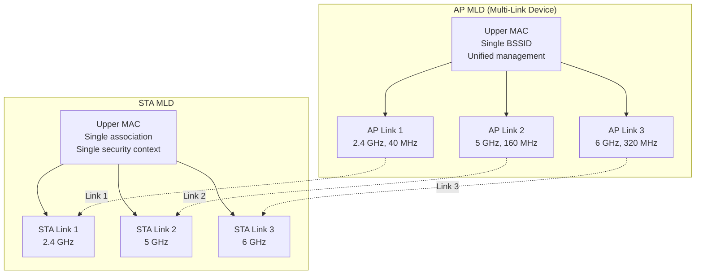
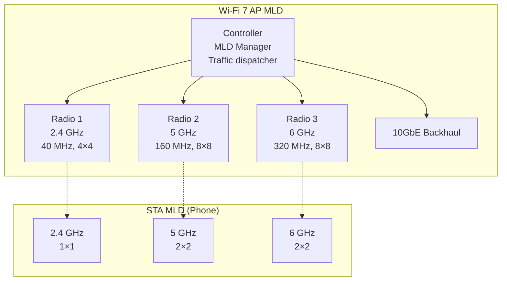
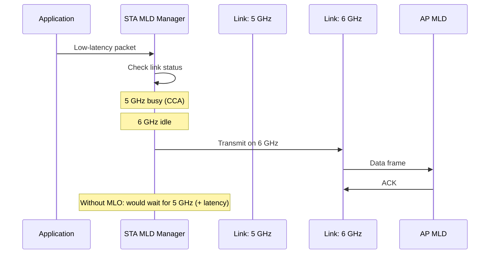

# Wi-Fi 7 — IEEE 802.11be (Extremely High Throughput)

**Topic:** Wi-Fi 7 (IEEE 802.11be EHT) — Multi-Link Operation, 320 MHz, 4096-QAM, Punctured Channels  
**Standards:** IEEE 802.11be-2024, Wi-Fi CERTIFIED 7  
**SDO:** IEEE 802.11 Working Group (TGbe), Wi-Fi Alliance  
**Audience:** Wi-Fi silicon engineers, wireless network architects, AP/router designers, enterprise WLAN planners  
**Prerequisites:** Wi-Fi 6 (802.11ax), OFDMA, MIMO fundamentals, 6 GHz spectrum regulations

---

## Chapter 1 — Historical Context & Origin Story

### 1.1 Timeline to Wi-Fi 7

| Date | Milestone |
|------|-----------|
| May 2019 | IEEE 802.11be Study Group formed |
| May 2020 | Task Group be (TGbe) officially established |
| 2021-2022 | Draft 1.0 - 2.0 specifications |
| Dec 2022 | Draft 3.0 (feature-complete) |
| 2023 | Draft 4.0 (comment resolution) |
| Jan 2024 | Wi-Fi Alliance launches Wi-Fi CERTIFIED 7 |
| 2024 | IEEE 802.11be amendment approved |
| 2024-2025 | Mass market AP/device availability |

### 1.2 Driving Requirements

| Requirement | Market Driver | Wi-Fi 7 Solution |
|------------|--------------|-------------------|
| Low latency (<5 ms) | AR/VR, cloud gaming, video conferencing | MLO (band switching), shorter TXOP |
| High throughput (>10 Gbps) | 8K video, wireless docking | 320 MHz, 4096-QAM, 16 streams |
| High reliability | Industrial IoT, telemedicine | MLO packet duplication |
| Deterministic access | Time-sensitive networking | Restricted TWT, triggered access |
| Dense deployment | Stadiums, airports, offices | 16 MU-MIMO users, OFDMA |

---

## Chapter 2 — Standard Architecture & Structure

### 2.1 Key 802.11be Features

| Feature | Description | Improvement over Wi-Fi 6 |
|---------|-------------|-------------------------|
| 320 MHz channels | Double the maximum bandwidth | 160 MHz → 320 MHz (2×) |
| 4096-QAM (MCS 12-13) | 12 bits per symbol per subcarrier | 1024-QAM → 4096-QAM (20% gain) |
| Multi-Link Operation (MLO) | Simultaneous multi-band operation | No equivalent in Wi-Fi 6 |
| 16×16 MIMO | 16 spatial streams | 8×8 → 16×16 (2×) |
| Multi-RU puncturing | Skip occupied sub-channels | Limited in Wi-Fi 6 |
| 16 MU-MIMO users | Simultaneous multi-user MIMO | 8 users → 16 users |
| Preamble puncturing | Flexible spectrum usage | Not available |
| Enhanced triggered access | Deterministic latency | Basic trigger frames (Wi-Fi 6) |

### 2.2 Wi-Fi 7 PHY Parameters

| Parameter | Value |
|-----------|-------|
| Bands | 2.4 GHz, 5 GHz, 6 GHz |
| Maximum bandwidth | 320 MHz |
| FFT size (320 MHz) | 4096 |
| Subcarrier spacing | 78.125 kHz |
| OFDM symbol | 12.8 μs + CP (0.8/1.6/3.2 μs) |
| Data subcarriers (320 MHz) | 3920 |
| Modulation | BPSK to 4096-QAM |
| Coding | BCC, LDPC |
| Max spatial streams | 16 |
| Max MCS | MCS 13 (4096-QAM, 5/6 coding) |
| Peak rate (16×16, 320 MHz, MCS 13) | 46.1 Gbps |

---

## Chapter 3 — Technical Deep Dive

### 3.1 Multi-Link Operation (MLO)



### MLO Modes

| Mode | Description | Use Case |
|------|-------------|----------|
| STR (Simultaneous TX/RX) | TX on one link while RX on another | Max throughput aggregation |
| NSTR (Non-STR) | Cannot TX/RX simultaneously across links | Cost-effective, simpler RF |
| eMLO | Enhanced: dynamic link management | Load balancing |

### MLO Traffic Handling

| Strategy | Mechanism | Benefit |
|----------|-----------|---------|
| Aggregation | Split traffic across all links | Maximum throughput |
| Redundancy | Duplicate packets on multiple links | Ultra-reliability (industrial) |
| Steering | Direct traffic to best available link | Latency optimization |
| Load balancing | Distribute based on link utilization | Fairness |

### 3.2 320 MHz Channel Plan (6 GHz)

| Channel | Center Frequency | Range |
|---------|-----------------|-------|
| 2 | 5955 MHz | 5945-6265 MHz |
| 66 | 6275 MHz | 6265-6585 MHz |
| 130 | 6595 MHz | 6585-6905 MHz |

Only 3 non-overlapping 320 MHz channels available in 6 GHz (1200 MHz band).

### 3.3 4096-QAM (MCS 12-13)

| MCS | Modulation | Coding Rate | Data Rate (320 MHz, 1 SS) |
|-----|-----------|-------------|--------------------------|
| 11 | 1024-QAM | 5/6 | 2882 Mbps |
| 12 | 4096-QAM | 3/4 | 3453 Mbps |
| 13 | 4096-QAM | 5/6 | 3840 Mbps |

**SNR requirement for 4096-QAM:** ~38-40 dB (only achievable at very short range, <5m typically). Practical benefit: Throughput boost for close-range connections (docking stations, VR headsets).

### 3.4 Multi-RU Puncturing

```mermaid
graph LR
    subgraph "320 MHz Channel (Before Puncturing)"
        A[80 MHz] B[80 MHz<br/>BLOCKED<br/>by radar/incumbent] C[80 MHz] D[80 MHz]
    end
    
    subgraph "320 MHz with Puncturing"
        E[80 MHz<br/>✓ Used] F[80 MHz<br/>✗ Punctured] G[80 MHz<br/>✓ Used] H[80 MHz<br/>✓ Used]
    end
```

**Benefit:** Instead of falling back to 160 MHz or less when a sub-channel is occupied, Wi-Fi 7 can "puncture" (skip) the occupied portion and still use 240 MHz. Maintains high throughput despite partial channel occupancy.

### 3.5 Peak Throughput Calculation

$$R_{max} = N_{SS} \times \frac{N_{SD} \times log_2(M) \times R}{T_{SYM} + T_{CP}}$$

For maximum configuration (16 SS, 320 MHz, 4096-QAM 5/6):

$$R = 16 \times \frac{3920 \times 12 \times 5/6}{12.8 \mu s + 0.8 \mu s} = 46,120 \text{ Mbps} \approx 46.1 \text{ Gbps}$$

---

## Chapter 4 — Implementation Guide

### 4.1 Wi-Fi 7 AP Architecture

| Component | Specification |
|-----------|--------------|
| Radio architecture | Tri-band (2.4 + 5 + 6 GHz), simultaneous |
| Antenna elements | 4×4 or 8×8 per band (high-end: 16×16) |
| Baseband | 320 MHz bandwidth processing |
| Memory | Large buffer for MLO frame aggregation |
| Backhaul | 10 Gbps Ethernet (or 2.5G×4 LAG) |
| CPU/NPU | Multi-core for MLD management |

### 4.2 Wi-Fi 7 Client Capabilities (Typical)

| Device Type | Links | Max BW | Streams | Practical Rate |
|------------|-------|--------|---------|----------------|
| Flagship phone | 2 (5+6 GHz) | 320 MHz | 2×2 | 5-7 Gbps |
| Laptop | 2-3 links | 320 MHz | 2×2 | 5-7 Gbps |
| VR headset | 2 (5+6 GHz) | 320 MHz | 2×2 | 5 Gbps, low latency |
| IoT device | 1 (2.4 GHz) | 20-40 MHz | 1×1 | 100-300 Mbps |
| Enterprise AP | 3 links | 320 MHz | 8×8 | Full capacity |

### 4.3 Deployment Considerations

| Factor | Recommendation |
|--------|---------------|
| Backhaul | Minimum 10GbE for 320 MHz channels |
| Channel planning (6 GHz) | Only 3 non-overlapping 320 MHz channels |
| AFC (US) | Required for Standard Power 6 GHz outdoor |
| Legacy support | Maintain 5 GHz for Wi-Fi 5/6 devices |
| MLO | Enable for latency-sensitive applications |
| Security | WPA3 mandatory; SAE + PMF |

---

## Chapter 5 — Certification & Audit

### 5.1 Wi-Fi CERTIFIED 7 Requirements

| Feature | Mandatory | Optional |
|---------|-----------|---------|
| MLO (2 links minimum) | Yes | 3+ links optional |
| 320 MHz (6 GHz) | Yes (if 6 GHz supported) | — |
| 4096-QAM | Yes | — |
| Preamble puncturing | Yes | — |
| WPA3 | Yes | — |
| TWT | Yes | Enhanced TWT |
| OFDMA (DL + UL) | Yes | — |
| MU-MIMO (up to 16) | DL mandatory | UL optional |

### 5.2 Testing Requirements

| Test Area | Method |
|-----------|--------|
| MLO establishment | Verify multi-link setup, teardown, transition |
| 320 MHz operation | Confirm full bandwidth PHY + MAC |
| Puncturing | Test with various puncture patterns |
| 4096-QAM | Rate adaptation, fallback behavior |
| Backward compatibility | Coexistence with Wi-Fi 6/6E devices |
| Security | WPA3-SAE handshake, PMF enforcement |

---

## Chapter 6 — Regional & Domain Variants

| Region | 320 MHz Availability | 6 GHz Band | MLO Bands | Status |
|--------|---------------------|-----------|-----------|--------|
| US | Yes (6 GHz) | Full 1200 MHz | 2.4+5+6 | Fully available |
| EU | Limited (lower 6 GHz only) | 480 MHz (5925-6425) | 2.4+5+6(partial) | One 320 MHz possible |
| Japan | Under study | Not yet allocated | 2.4+5 only currently | Pending |
| Korea | Yes | 5925-7125 MHz | 2.4+5+6 | Available |
| China | Limited | Under study | 2.4+5 primarily | Pending |

---

## Chapter 7 — Comparison: Wi-Fi 6 vs Wi-Fi 7

| Feature | Wi-Fi 6 (802.11ax) | Wi-Fi 7 (802.11be) |
|---------|--------------------|--------------------|
| Max bandwidth | 160 MHz | 320 MHz |
| Modulation | 1024-QAM | 4096-QAM |
| Peak rate | 9.6 Gbps | 46.1 Gbps |
| MIMO streams | 8×8 | 16×16 |
| MU-MIMO users | 8 | 16 |
| Multi-link | No | Yes (MLO) |
| Puncturing | Limited (secondary 80 MHz) | Flexible multi-RU |
| Latency target | <20 ms | <5 ms |
| 6 GHz | Extension (Wi-Fi 6E) | Native |
| Security minimum | WPA3 | WPA3 |
| Target application | Dense, efficiency | Latency, reliability, throughput |

---

## Chapter 8 — Mermaid Architecture Diagrams

### 8.1 Wi-Fi 7 System Architecture



### 8.2 MLO Packet Flow (Latency Optimization)



---

## Chapter 9 — Case Studies & Failure Analysis

### 9.1 AR/VR Streaming over Wi-Fi 7

**Use case:** Wireless VR headset (Apple Vision Pro, Meta Quest) requiring <5 ms motion-to-photon latency, 4K×4K per eye, 90-120 fps.

**Bandwidth requirement:** ~2-5 Gbps compressed video stream.

**Wi-Fi 7 solution:** (1) 320 MHz channel on 6 GHz (clean, wide bandwidth). (2) MLO: If 6 GHz link encounters interference, seamlessly redirect to 5 GHz without frame loss. (3) 4096-QAM at close range (~2m) for maximum efficiency. (4) Restricted TWT for deterministic scheduled access.

**Challenge:** Motion-to-photon latency budget: Only ~2 ms for wireless link (out of 11 ms total at 90 fps). Requires consistently <2 ms medium access time.

### 9.2 Enterprise Dense Deployment Challenges

**Problem:** 200-device conference room, video calls + screen sharing for all.

**Wi-Fi 7 advantages:** (1) 16 MU-MIMO users (2× Wi-Fi 6). (2) MLO load balancing across bands. (3) 320 MHz aggregate capacity. (4) Preamble puncturing maintains wide channels even with radar (DFS).

**Remaining challenge:** Backhaul becomes bottleneck (need 10GbE+). AP processing power for 16 MU-MIMO computation. Heat dissipation in ceiling-mounted APs.

---

## Chapter 10 — Future Evolution & Industry Trends

| Development | Timeline | Description |
|------------|----------|-------------|
| Wi-Fi 7 R2 | 2025 | Enhanced MLO, restricted TWT refinement |
| 802.11bn (Wi-Fi 8) | 2028-2030 | Coordinated AP (joint TX), full-duplex |
| UHR (Ultra High Reliability) | 802.11bn | <1 ms deterministic latency |
| 7.25 GHz band | Post WRC-27 | Additional spectrum for Wi-Fi |
| AI/ML in PHY | 802.11bn | ML-based channel estimation, rate adaptation |
| Integrated sensing | Future | Wi-Fi-based radar/motion detection |
| OFDMA enhancement | Ongoing | More flexible RU allocation |

---

## Chapter 11 — Interview Questions & Career Guide

### Tier 1: Entry-Level

**Q1:** What are the main new features in Wi-Fi 7 compared to Wi-Fi 6?  
**A:** Four key improvements: (1) **320 MHz bandwidth** (double Wi-Fi 6's 160 MHz). (2) **4096-QAM** (MCS 12-13, 20% more bits per symbol vs 1024-QAM). (3) **Multi-Link Operation (MLO):** Use multiple bands simultaneously (2.4+5+6 GHz) for aggregated throughput and lower latency. (4) **Multi-RU puncturing:** Skip occupied sub-channels instead of falling back to narrow channel. Also: 16×16 MIMO (up to 16 spatial streams), 16 MU-MIMO users.

### Tier 2: Mid-Level

**Q2:** Explain how preamble puncturing works in Wi-Fi 7.  
**A:** In Wi-Fi 6 and earlier, if any 20 MHz sub-channel within a wide channel (e.g., 160 MHz) is occupied (radar, incumbent user), the entire channel must be abandoned or narrowed. **Wi-Fi 7 puncturing:** (1) The AP identifies which 20/40 MHz sub-channels are unavailable. (2) It marks those sub-channels as "punctured" in the EHT-SIG field of the preamble. (3) Transmits on remaining sub-channels as a single wide transmission (not separate narrow channels). (4) Receiver knows which sub-channels are punctured from preamble and decodes only active portions. **Benefit:** 240 MHz usable out of 320 MHz (instead of falling back to 160 MHz). Maintains efficiency in congested spectrum. **Constraints:** Not all puncture patterns are allowed — must maintain minimum contiguous bandwidth for demodulation.

### Tier 3: Senior

**Q3:** What are the implementation challenges of 16×16 MU-MIMO in Wi-Fi 7?  
**A:** **Challenges:** (1) **Channel estimation:** 16 spatial streams require precise CSI (Channel State Information) for all 16 antennas to all users. Feedback overhead grows with N². Compressed beamforming report bandwidth increases dramatically. (2) **Beamforming computation:** Null steering for 16 simultaneous users requires massive matrix operations (SVD decomposition on 3920 subcarriers × 16 streams). Real-time computation demands very high MIPS. (3) **Calibration:** 16 TX/RX chains must be precisely calibrated (phase/amplitude). Manufacturing variance is harder to control. (4) **Physical design:** 16 antennas with sufficient spacing (λ/2 = 2.5 cm at 6 GHz). AP form factor grows. (5) **Diminishing returns:** In practice, rank of channel is limited by propagation environment (scattering). Indoor NLOS may only support 4-8 effective streams regardless of antenna count. (6) **Client support:** Most clients are 2×2 or 4×4. 16-user MU-MIMO requires 16 distinct clients simultaneously ready — scheduling complexity. **Reality:** 8×8 AP with 4-8 MU-MIMO users is the practical sweet spot for 2024-2025 deployments.

---

## Chapter 12 — Cheat Sheet & Quick Reference

### Wi-Fi 7 Key Specs

```
Standard:    IEEE 802.11be (Extremely High Throughput - EHT)
Bands:       2.4 GHz + 5 GHz + 6 GHz
Max BW:      320 MHz
Modulation:  4096-QAM (MCS 12-13)
Max Streams: 16×16 MIMO
Max MU:      16 users
Peak Rate:   46.1 Gbps
MLO:         Yes (aggregate/steer/duplicate)
Puncturing:  Multi-RU flexible puncturing
Security:    WPA3 mandatory
Target:      <5 ms latency, >10 Gbps real-world
```

### MLO Quick Reference

```
STR Mode:   Simultaneous TX/RX across links (max throughput)
NSTR Mode:  Alternate TX/RX (cost-effective)
Aggregation: Split packets across links → max throughput
Duplication: Same packet on multiple links → max reliability
Steering:    Choose best link per packet → min latency
Single association: One security handshake, one IP address
```

### Channel Plan (6 GHz, 320 MHz)

```
Channel  2: 5945-6265 MHz (center 5955 MHz)
Channel 66: 6265-6585 MHz (center 6275 MHz)
Channel 130: 6585-6905 MHz (center 6595 MHz)
Only 3 non-overlapping 320 MHz channels in full 6 GHz band
```

---

*End of Document — 02_Wi_Fi_7_IEEE_802_11be.md*
