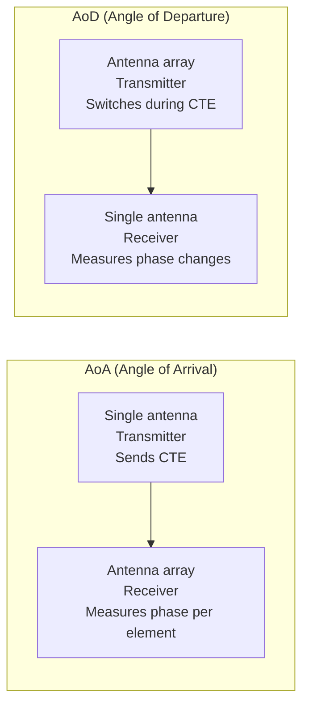
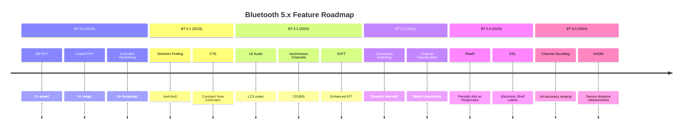
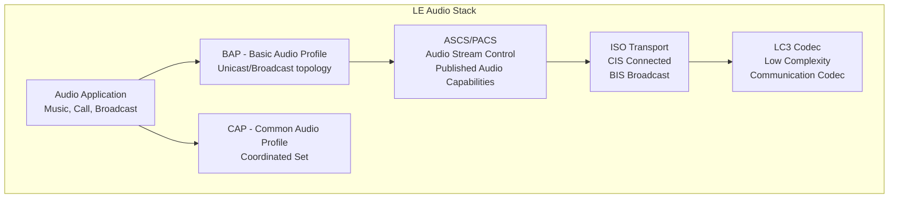
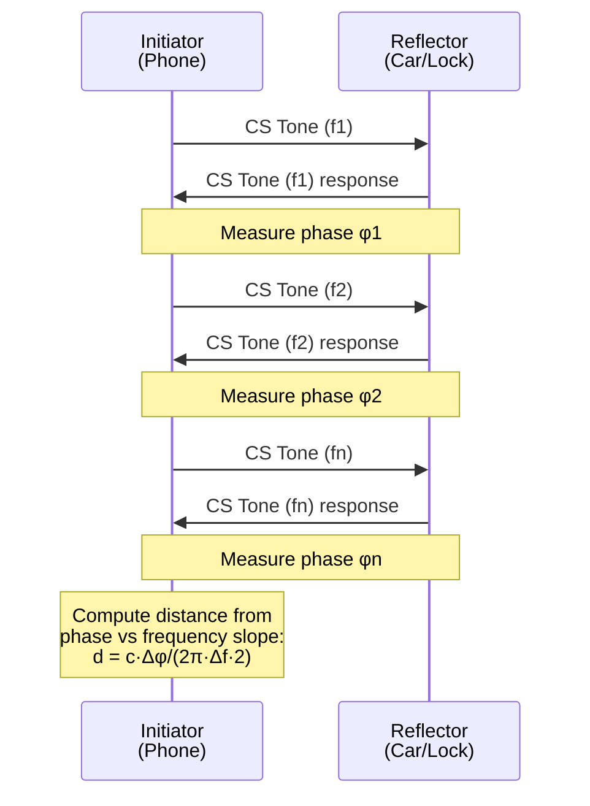

# Bluetooth 5 and 6 — Core Specification Evolution

**Topic:** Bluetooth 5.0 through 6.0 — Extended Range, LE Audio, Direction Finding, Channel Sounding  
**Standards:** Bluetooth Core Specification 5.0, 5.1, 5.2, 5.3, 5.4, 6.0  
**SDO:** Bluetooth Special Interest Group (Bluetooth SIG)  
**Audience:** Embedded Bluetooth developers, IoT product designers, audio engineers, automotive connectivity engineers  
**Prerequisites:** Bluetooth basics (Classic vs BLE), GATT, advertising, 2.4 GHz ISM band

---

## Chapter 1 — Historical Context & Origin Story

### 1.1 Bluetooth Version Timeline

| Version | Year | Key Feature | Impact |
|---------|------|-------------|--------|
| 1.0 | 1999 | Basic rate (1 Mbps) | Wireless headsets, serial replacement |
| 2.0+EDR | 2004 | Enhanced Data Rate (3 Mbps) | Stereo audio (A2DP) |
| 3.0+HS | 2009 | High Speed (via 802.11) | File transfer (rarely used) |
| 4.0 | 2010 | BLE (Low Energy) introduced | IoT revolution, fitness trackers |
| 4.1 | 2013 | Coexistence with LTE, IoT improvements | Industrial IoT |
| 4.2 | 2014 | LE Data Length Extension, IPv6/6LoWPAN | Higher throughput, IP connectivity |
| 5.0 | 2016 | 2 Mbps PHY, Coded PHY, extended advertising | 2× speed, 4× range |
| 5.1 | 2019 | Direction finding (AoA/AoD) | Indoor positioning |
| 5.2 | 2020 | LE Audio (LC3), EATT, LE Power Control | Audio revolution |
| 5.3 | 2021 | Connection subrating, channel classification | Reliability, power efficiency |
| 5.4 | 2023 | PAwR (Periodic Advertising w/ Responses) | Electronic shelf labels |
| 6.0 | 2024 | Channel Sounding (ranging), HADM | Cm-accuracy distance measurement |

### 1.2 BLE Market Growth

| Year | BLE Devices Shipped | Primary Applications |
|------|--------------------|--------------------|
| 2012 | 500M | Fitness trackers |
| 2015 | 2B | Beacons, wearables |
| 2018 | 4B | Smart home, audio |
| 2021 | 5.5B | Everything (mesh, audio, automotive) |
| 2024 | 7B+ | LE Audio, UWB complement, automotive |

---

## Chapter 2 — Standard Architecture & Structure

### 2.1 Bluetooth Protocol Stack

```mermaid
graph TB
    subgraph "Application Layer"
        A[Profiles<br/>GATT-based services<br/>HID, HFP, A2DP, LE Audio]
    end
    
    subgraph "Host"
        B[GAP - Generic Access Profile]
        C[GATT - Generic Attribute Profile]
        D[ATT - Attribute Protocol]
        E[SMP - Security Manager]
        F[L2CAP - Logical Link Control]
    end
    
    subgraph "Controller"
        G[HCI - Host Controller Interface]
        H[Link Layer<br/>Advertising, Scanning<br/>Connections, Encryption]
        I[PHY<br/>1M, 2M, Coded (S=2, S=8)]
    end
    
    A --> B
    A --> C
    C --> D
    D --> F
    E --> F
    F --> G
    G --> H
    H --> I
```

### 2.2 BLE PHY Options (BT 5.0+)

| PHY | Symbol Rate | Coding | Range | Data Rate | Use Case |
|-----|-----------|--------|-------|-----------|----------|
| LE 1M | 1 Msym/s | Uncoded | Baseline | 1 Mbps | Legacy compatible |
| LE 2M | 2 Msym/s | Uncoded | Shorter (~70%) | 2 Mbps | High throughput (audio) |
| LE Coded S=2 | 1 Msym/s | FEC (1/2) | 2× baseline | 500 kbps | Extended range |
| LE Coded S=8 | 1 Msym/s | FEC (1/8) | 4× baseline | 125 kbps | Maximum range (IoT) |

---

## Chapter 3 — Technical Deep Dive

### 3.1 Bluetooth 5.0 Key Features

| Feature | Specification | Benefit |
|---------|--------------|---------|
| 2M PHY | 2 Msym/s GFSK | 2× data rate (same range) or same rate in half time → power saving |
| Coded PHY (Long Range) | S=2 (500 kbps) or S=8 (125 kbps) | 4× range (tested: 300m+ outdoor) |
| Extended Advertising | Up to 255 bytes per ADV (chain) | 8× broadcast data capacity |
| Slot availability mask | Advertising on 37/38/39 + secondary channels | Reduced collision probability |

### 3.2 Bluetooth 5.1 — Direction Finding

| Method | Full Name | Mechanism | Accuracy |
|--------|-----------|-----------|----------|
| AoA | Angle of Arrival | Receiver antenna array, phase difference | ±5° (sub-meter) |
| AoD | Angle of Departure | Transmitter antenna array, phase difference | ±5° (sub-meter) |



**CTE (Constant Tone Extension):** Unmodulated carrier appended to BLE packet. Enables phase measurement without data interference.

### 3.3 Bluetooth 5.2 — LE Audio Foundation

| Feature | Description | Standard |
|---------|-------------|----------|
| LC3 Codec | Low Complexity Communication Codec | LE Audio mandatory codec |
| EATT | Enhanced ATT (multiple parallel bearers) | Reduced latency for multi-service |
| LE Power Control | Path loss-based TX power adjustment | Better coexistence, longer battery |
| Isochronous Channels (ISO) | Time-bounded audio streaming | CIS (Connected) + BIS (Broadcast) |

### 3.4 Bluetooth 5.3 — Reliability

| Feature | Benefit |
|---------|---------|
| Connection Subrating | Switch between fast/slow connection intervals without renegotiation |
| Channel Classification Enhancement | Better coexistence with Wi-Fi (improved channel map updates) |
| Periodic Advertising Enhancement | More flexible sync for mesh/broadcast |
| AdvDataInfo (ADI) in scan responses | Efficient duplicate filtering |

### 3.5 Bluetooth 5.4 — PAwR

**PAwR (Periodic Advertising with Responses):** Enables bidirectional communication in broadcast topology. Primary use case: Electronic Shelf Labels (ESL).

| Parameter | Value |
|-----------|-------|
| Topology | One-to-many (AP to thousands of ESL devices) |
| Communication | AP broadcasts → ESL responds in assigned slot |
| Latency | Configurable (seconds to minutes acceptable for ESL) |
| Power | Ultra-low (ESL sleeps, wakes only for its slot) |
| Scale | Thousands of devices per AP |

### 3.6 Bluetooth 6.0 — Channel Sounding (Ranging)

| Feature | Description |
|---------|-------------|
| Purpose | High-accuracy distance measurement (cm-level) |
| Method | Phase-Based Ranging (PBR) + Round-Trip Time |
| Accuracy | ±10 cm (typical), improving with multipath mitigation |
| Security | Secure ranging (prevents relay attacks) |
| Use cases | Digital car keys, secure access, find my device, spatial audio |
| Predecessor | Based on HADM (High Accuracy Distance Measurement) study |

**Channel Sounding principle:**

$$d = \frac{c \cdot \Delta\phi}{2\pi \cdot \Delta f \cdot 2}$$

Where: $c$ = speed of light, $\Delta\phi$ = phase difference, $\Delta f$ = frequency step.

Multiple frequency measurements → resolve multipath and improve accuracy.

---

## Chapter 4 — Implementation Guide

### 4.1 BLE SoC Options (2024)

| Vendor | Chip | BT Version | Features | Target |
|--------|------|------------|----------|--------|
| Nordic | nRF54H20 | 5.4+ | Multi-core, LE Audio | Premium IoT |
| Nordic | nRF52840 | 5.0 | Direction finding, mesh | General IoT |
| TI | CC2340 | 5.4 | Ultra-low power, PAwR | Battery IoT |
| Dialog/Renesas | DA14706 | 5.3 | LE Audio, wearable | Hearables |
| Qualcomm | QCC5181 | 5.4 | LE Audio, aptX | TWS earbuds |
| Infineon | AIROC CYW20829 | 5.4 | LE Audio + Wi-Fi combo | Smart home |
| Silicon Labs | EFR32BG24 | 5.4 | Direction finding, mesh | Industrial |
| Espressif | ESP32-C6 | 5.0 | Wi-Fi 6 + BLE combo | Cost-effective |

### 4.2 BLE Connection Parameters

| Parameter | Range | Typical | Impact |
|-----------|-------|---------|--------|
| Connection interval | 7.5 ms - 4 s | 15-30 ms (interactive), 1-4 s (sensor) | Power vs latency |
| Slave latency | 0-499 | 0 (interactive), 10-30 (sensor) | Power saving (skip intervals) |
| Supervision timeout | 100 ms - 32 s | 4-6 s | Disconnect detection |
| MTU | 23-517 bytes | 247 bytes | Throughput per packet |
| Data Length (DLE) | 27-251 bytes (PDU) | 251 bytes | Reduces overhead |

### 4.3 BLE Power Optimization

| Technique | Power Saving | Trade-off |
|-----------|-------------|-----------|
| Longer connection interval | 10-50× | Higher latency |
| Slave latency | 5-30× | Missed events |
| Coded PHY (S=8) | N/A (uses more TX time) | 4× range but 8× airtime |
| 2M PHY | 2× (half TX time) | Reduced range |
| Extended advertising | Fewer ADV events needed | Complexity |
| Subrating (BT 5.3) | Dynamic (no renegotiation) | Chip support needed |

---

## Chapter 5 — Certification & Audit

### 5.1 Bluetooth Qualification (QDID)

| Component | Requirement |
|-----------|-------------|
| Declaration | Register product with Bluetooth SIG |
| QDID | Obtain Qualification Design ID |
| Testing | Protocol conformance (PTS — Profile Tuning Suite) |
| ICS/IXIT | Implementation Conformance/Extra Information |
| Listing fee | Dependent on SIG membership level |
| Logo usage | Only after qualification |

### 5.2 Bluetooth SIG Membership

| Level | Annual Fee | Qualification Rights |
|-------|-----------|---------------------|
| Promoter | $0 (founding) | Unlimited |
| Associate | $35,000 | Unlimited qualifications |
| Small Associate | $8,000 | 2 qualifications/year |
| Adopter | $0 | Must pay per qualification ($8,000) |

### 5.3 Testing Requirements

| Test Type | Coverage | Tool |
|-----------|----------|------|
| RF PHY | TX power, sensitivity, spectrum | RF test equipment |
| Protocol | Link layer state machine | PTS (Profile Tuning Suite) |
| Profile | GATT service conformance | PTS + custom |
| Interoperability | Multi-vendor device testing | UnPlugFest events |
| Security | Pairing, encryption validation | Protocol analyzer |

---

## Chapter 6 — Regional & Domain Variants

| Application Domain | BT Features Used | Key Considerations |
|-------------------|-----------------|-------------------|
| Consumer audio | LE Audio (LC3), Auracast | Codec support, multi-stream |
| Automotive | Channel Sounding, CCC Digital Key | Secure ranging, relay attack prevention |
| Healthcare | GATT health profiles, BLE 5.0 | Regulatory (FDA for medical devices) |
| Industrial | Mesh 1.1, Coded PHY (range) | Reliability, interference rejection |
| Retail (ESL) | PAwR (BT 5.4) | Scale (10,000+ labels per store) |
| Smart home | Mesh, Matter commissioning | Interop with Thread/Wi-Fi |
| Indoor positioning | Direction finding (5.1) | AoA infrastructure cost |

---

## Chapter 7 — Comparison: BLE vs Competing Technologies

| Feature | BLE 5.4 | Thread 1.3 | Wi-Fi HaLow | UWB | Zigbee 3.0 |
|---------|---------|-----------|-------------|-----|-----------|
| Range | 10-100m | 10-30m/hop | 1 km | 10-200m | 10-30m/hop |
| Data rate | 2 Mbps | 250 kbps | 8 Mbps | 6.8 Mbps | 250 kbps |
| Power | Very Low | Very Low | Low | Low | Very Low |
| Topology | Star, Mesh | Mesh | Star | P2P | Mesh |
| IP | No (native) | IPv6 | IPv4/6 | No | No |
| Ranging | Yes (BT 6.0) | No | No | Yes (primary) | No |
| Audio | Yes (LE Audio) | No | No | No | No |
| Ecosystem | Universal | Smart home | IoT | Auto/mobile | Legacy IoT |
| Cost | Very Low | Low | Medium | Medium | Low |

---

## Chapter 8 — Mermaid Architecture Diagrams

### 8.1 Bluetooth 5.x Feature Evolution



### 8.2 LE Audio Architecture



### 8.3 Channel Sounding (BT 6.0)



---

## Chapter 9 — Case Studies & Failure Analysis

### 9.1 CCC Digital Key with Channel Sounding

**Use case:** Replace physical car key with smartphone. Bluetooth 6.0 Channel Sounding enables secure distance measurement.

**Security requirement:** Prevent relay attacks (thief amplifies signal to make car think phone is nearby). UWB-level security needed.

**Solution:** Channel Sounding with secure ranging: (1) Cryptographic challenge ensures tone sequence is authenticated. (2) Phase measurements bound to security session. (3) Sub-10 cm accuracy → car knows if phone is truly in pocket nearby vs. relayed signal.

### 9.2 Auracast (Broadcast Audio)

**Scenario:** Airport gate broadcasting flight announcements via LE Audio Broadcast (BIS).

**Challenge:** (1) Unlimited receivers (no pairing needed). (2) Low latency requirement (<40 ms). (3) Multi-language support.

**Solution with BT 5.2+ LE Audio:** (1) Broadcast Isochronous Stream (BIS) — no connection required. (2) Multiple BIS streams for multiple languages. (3) PA (Periodic Advertising) announces stream metadata. (4) Any LE Audio device can sync and listen.

---

## Chapter 10 — Future Evolution & Industry Trends

| Trend | BT Version | Impact |
|-------|-----------|--------|
| LE Audio mainstream | 5.2+ (2024-2025) | Replace Classic Audio entirely |
| Channel Sounding deployment | 6.0 (2025+) | Digital car keys, secure access |
| Bluetooth + UWB convergence | 6.0+ | BT for pairing/setup, UWB/CS for ranging |
| Ambient IoT integration | Future | BLE beacons + energy harvesting |
| AI-enhanced positioning | Future | ML-based multipath resolution |
| Mesh 2.0 | Under development | Larger scale, better reliability |
| Classic Audio sunset | 2027-2030 | All audio moves to LE Audio |
| 6.x enhancements | 2025-2026 | Improved CS accuracy, multi-path |

---

## Chapter 11 — Interview Questions & Career Guide

### Tier 1: Entry-Level

**Q1:** What is the difference between Bluetooth Classic and BLE?  
**A:** **Bluetooth Classic:** (1) Continuous connection-oriented. (2) Higher power consumption. (3) Higher data rate (2-3 Mbps with EDR). (4) Used for: audio streaming (A2DP), file transfer, phone calls (HFP). **BLE (Low Energy):** (1) Designed for intermittent, short data bursts. (2) Ultra-low power (coin cell battery for years). (3) Lower data rate (1-2 Mbps). (4) Connection or connectionless (advertising). (5) Used for: sensors, beacons, wearables, IoT. **Key architectural difference:** BLE uses advertising channels for discovery (3 dedicated channels) and connection events with configurable intervals. Classic uses continuous piconet connections. **BT 5.2 bridges them:** LE Audio brings high-quality audio to BLE, eventually replacing Classic Audio.

### Tier 2: Mid-Level

**Q2:** Explain how Bluetooth Coded PHY achieves 4× range.  
**A:** **Coded PHY (BT 5.0):** Uses Forward Error Correction (FEC) to improve receiver sensitivity. **Mechanism:** (1) Same 1 Msym/s symbol rate as LE 1M PHY. (2) Data bits are spread across more symbols (coding). (3) **S=2:** Each data bit encoded as 2 symbols → 500 kbps effective data rate. Provides ~5 dB coding gain → ~2× range. (4) **S=8:** Each data bit encoded as 8 symbols → 125 kbps effective data rate. Provides ~12 dB coding gain → ~4× range. **Trade-off:** Range increases at cost of data rate and increased airtime (more power per transaction but fewer transactions needed). **Link budget improvement:** If standard BLE sensitivity is -95 dBm, Coded S=8 achieves approximately -107 dBm sensitivity. Extra 12 dB → 4× distance (free space). **Practical:** Tested at 400m+ line-of-sight. Indoor: useful for large warehouses, building-wide connectivity.

### Tier 3: Senior

**Q3:** Design a Bluetooth-based indoor positioning system using AoA (5.1) for a warehouse.  
**A:** **System design:** (1) **Infrastructure:** Deploy AoA locator receivers (antenna arrays: 4×4 or circular, 8+ elements) at ceiling level. Spacing: 10-20m grid (depends on accuracy requirement). Each locator needs: BLE 5.1 radio + antenna array + Ethernet backhaul. (2) **Tags:** BLE 5.1 transmitters on assets/workers. Transmit CTE-enabled advertising packets. Battery-powered (coin cell: 1-2 years at 1 Hz update). (3) **Positioning engine:** Cloud/edge server. Receives IQ samples from multiple locators. Computes AoA per locator → triangulation for 2D/3D position. Multipath resolution algorithm (MUSIC/ESPRIT). (4) **Accuracy:** Typical: 0.5-1m (depending on multipath). Best case (LoS): 0.3m. Requires calibration per deployment. (5) **Challenges:** Multipath (metal racking in warehouse) → use multiple locators, ML-based fingerprinting. Calibration drift → periodic re-calibration. (6) **Scale:** Each locator handles 100+ simultaneous tags. 10,000+ tag capacity per site with proper locator density. (7) **Power:** Tags: <5 μA average at 1 Hz → 2+ years on CR2032. Locators: Mains/PoE powered.

---

## Chapter 12 — Cheat Sheet & Quick Reference

### BLE PHY Quick Reference

```
LE 1M:     1 Mbps, baseline range, legacy compatible
LE 2M:     2 Mbps, shorter range (~70%), less TX time → power save
Coded S=2: 500 kbps, 2× range (~5 dB gain)
Coded S=8: 125 kbps, 4× range (~12 dB gain)
```

### Version Feature Matrix

```
BT 5.0: 2M PHY + Coded PHY + Extended Advertising
BT 5.1: Direction Finding (AoA/AoD) + CTE
BT 5.2: LE Audio (LC3, ISO channels) + EATT + Power Control
BT 5.3: Subrating + Channel Classification Enhancement
BT 5.4: PAwR (Electronic Shelf Labels)
BT 6.0: Channel Sounding (cm-accuracy ranging)
```

### Key Numbers

```
BLE advertising channels: 37, 38, 39 (2402, 2426, 2480 MHz)
BLE data channels: 0-36 (2 MHz spacing)
Max TX power: +20 dBm (class 1), +4 dBm typical
Connection interval: 7.5 ms (min) to 4 s (max)
MTU: 23 (default) to 517 bytes (negotiated)
Max connection data rate: ~1.4 Mbps (LE 2M, DLE)
LC3 codec: 16-32 kbps mono (high quality at low bitrate)
```

---

*End of Document — 03_Bluetooth_5_and_6.md*
