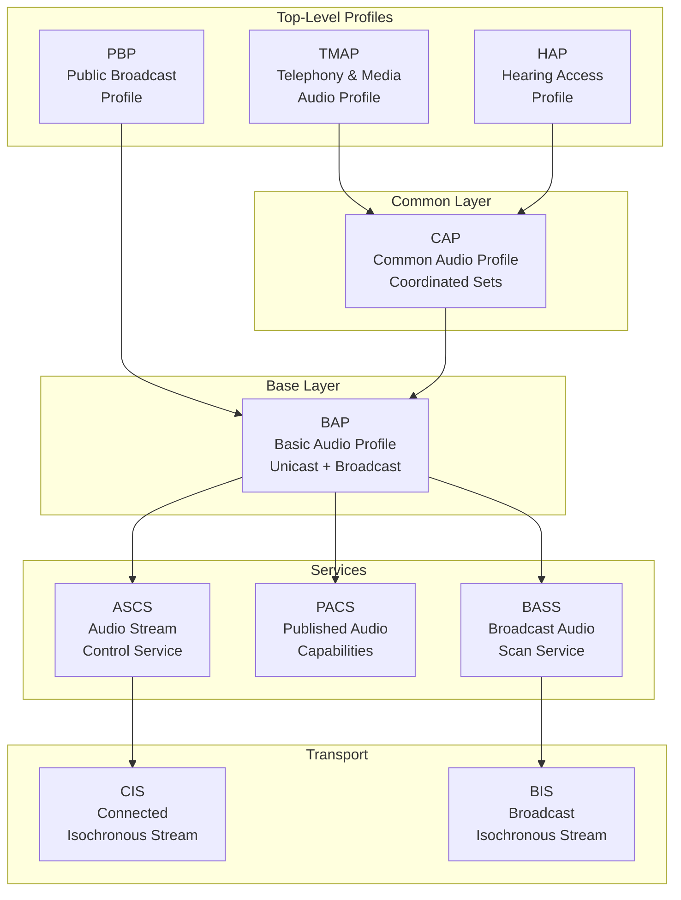
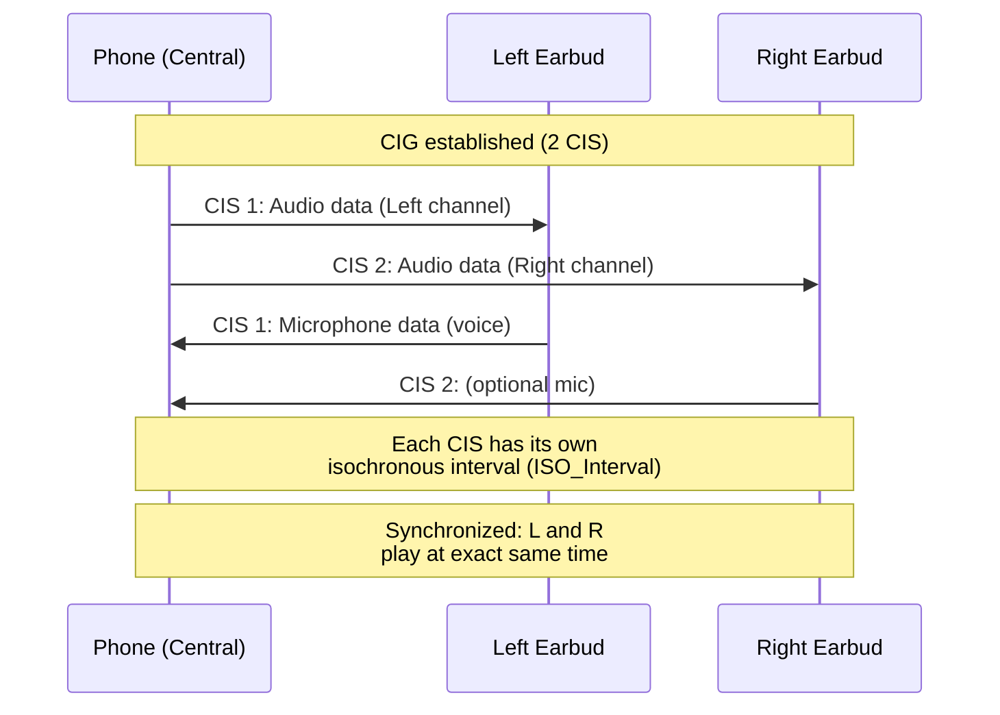
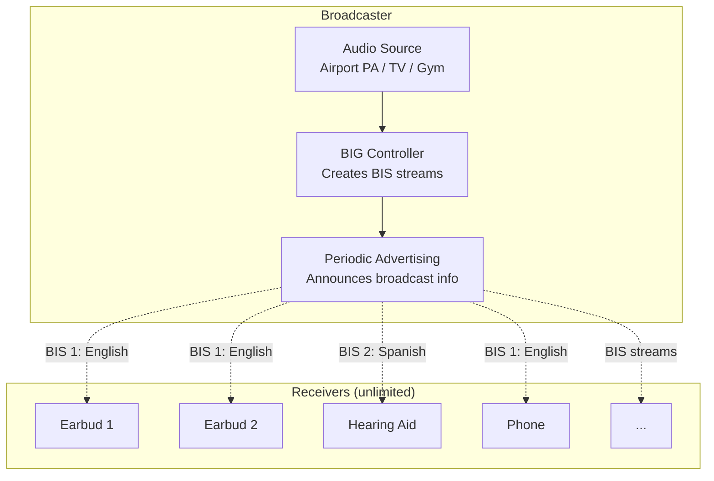
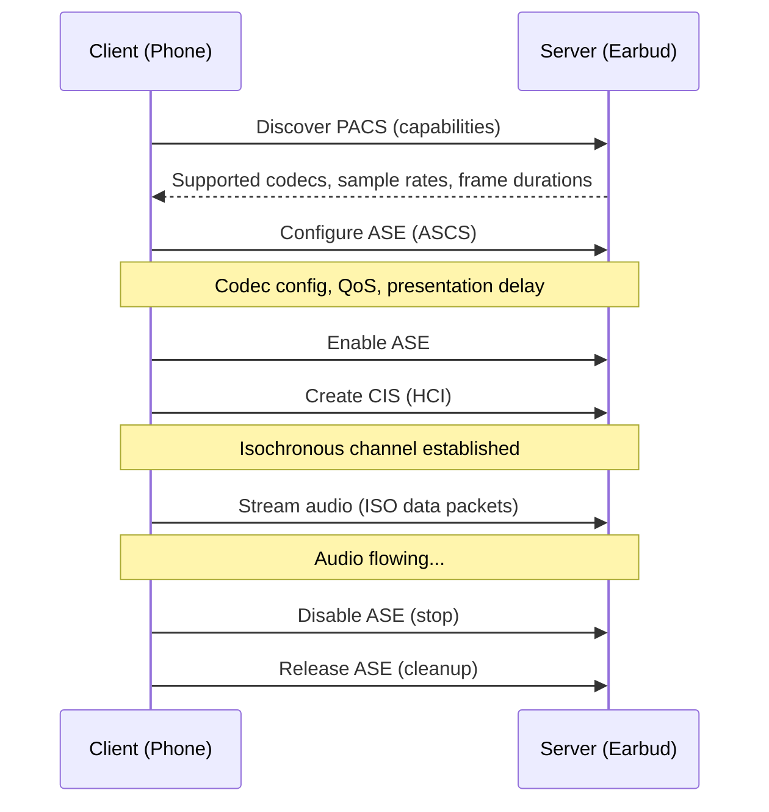
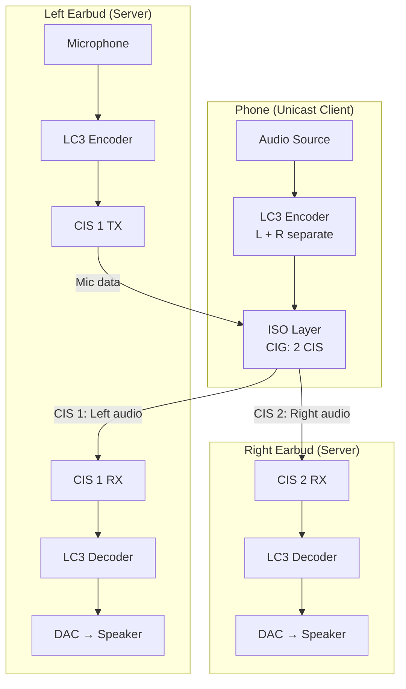
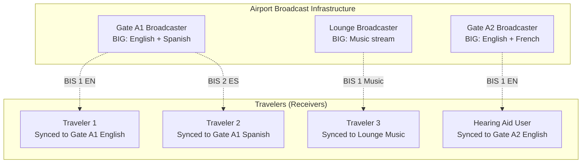

# BLE Audio / LE Audio

**Topic:** Bluetooth LE Audio — LC3 Codec, Isochronous Channels, Auracast Broadcast, Multi-Stream Audio  
**Standards:** Bluetooth Core Spec 5.2+, BAP, CAP, TMAP, HAP, PBP, LC3 Codec Specification  
**SDO:** Bluetooth SIG  
**Audience:** Audio product engineers, TWS earbud developers, hearing aid designers, BLE firmware developers  
**Prerequisites:** BLE fundamentals, Bluetooth 5.2+, basic audio/codec concepts, GATT profiles

---

## Chapter 1 — Historical Context & Origin Story

### 1.1 Audio over Bluetooth Evolution

| Era | Technology | Codec | Limitations |
|-----|-----------|-------|-------------|
| 2003 | A2DP (Classic Audio) | SBC (mandatory) | High latency, poor quality at low bitrate |
| 2009 | aptX (Qualcomm proprietary) | aptX | Better quality but proprietary, royalties |
| 2016 | aptX HD | aptX HD (24-bit/48kHz) | High quality but Classic only, power-hungry |
| 2018 | LDAC (Sony) | LDAC (990 kbps) | Hi-res but unstable, Classic BT |
| 2020 | LE Audio specification | LC3 | New era: BLE-based, standard codec |
| 2022 | LE Audio profiles published | LC3, BAP, CAP | Full stack available |
| 2023 | Auracast | BIS (Broadcast) | Public broadcast audio |
| 2024 | Market adoption | LC3plus (optional) | TWS, hearing aids, smartphones |

### 1.2 Why LE Audio?

| Classic Audio Problem | LE Audio Solution |
|----------------------|-------------------|
| SBC mandatory (poor at low bitrate) | LC3 (superior at ALL bitrates) |
| Point-to-point only | Broadcast (Auracast) — unlimited listeners |
| One stream per device (mono or stereo in one stream) | Multi-stream (independent L/R for TWS) |
| No standard hearing aid profile | HAP (Hearing Access Profile) — standard |
| High power (Classic BT radio) | BLE radio (lower power) |
| No multi-device sharing | Auracast — share audio publicly |

---

## Chapter 2 — Standard Architecture & Structure

### 2.1 LE Audio Profile Hierarchy



### 2.2 LE Audio Specifications

| Specification | Purpose |
|--------------|---------|
| LC3 Codec | Low Complexity Communication Codec (mandatory) |
| BAP (Basic Audio Profile) | Unicast + broadcast audio setup |
| CAP (Common Audio Profile) | Coordinated sets (L/R earbuds) |
| ASCS | Audio Stream Control Service (GATT) |
| PACS | Published Audio Capabilities Service |
| BASS | Broadcast Audio Scan Service |
| TMAP | Telephony & Media Audio Profile |
| HAP | Hearing Access Profile |
| PBP | Public Broadcast Profile (Auracast) |
| VCP | Volume Control Profile |
| MICP | Microphone Control Profile |
| CSIP | Coordinated Set Identification Profile |
| CCP | Call Control Profile |
| MCP | Media Control Profile |

---

## Chapter 3 — Technical Deep Dive

### 3.1 LC3 Codec

| Parameter | LC3 Specification |
|-----------|------------------|
| Sample rates | 8, 16, 24, 32, 44.1, 48 kHz |
| Frame duration | 7.5 ms or 10 ms |
| Bitrate range | 16-320 kbps per channel |
| Typical mono | 32 kbps (voice), 64-96 kbps (music) |
| Quality (MUSHRA) | LC3 @ 160 kbps ≈ SBC @ 345 kbps |
| Algorithmic delay | 7.5 ms (7.5 ms frame) or 10 ms (10 ms frame) |
| Complexity | ~2 MIPS per channel (encode) |

**Quality comparison (subjective MUSHRA scores):**

| Codec | Bitrate | Quality Score |
|-------|---------|--------------|
| SBC | 198 kbps | 60 |
| SBC | 345 kbps | 72 |
| LC3 | 96 kbps | 72 |
| LC3 | 160 kbps | 78 |
| LC3 | 320 kbps | 85 |
| AAC | 128 kbps | 75 |
| Opus | 128 kbps | 80 |

### 3.2 Isochronous Channels

| Type | Acronym | Description | Use Case |
|------|---------|-------------|----------|
| Connected Isochronous Stream | CIS | Point-to-point, bidirectional | Phone → earbuds (unicast) |
| Connected Isochronous Group | CIG | Multiple CIS synchronized | L + R earbud pair |
| Broadcast Isochronous Stream | BIS | One-to-many, unidirectional | Auracast, TV broadcast |
| Broadcast Isochronous Group | BIG | Multiple BIS synchronized | Multi-language broadcast |

### 3.3 CIS (Unicast) Operation



### 3.4 BIS (Broadcast) Operation — Auracast



### 3.5 Audio Quality Settings (Typical)

| Use Case | Codec Config | Bitrate | Frame | Latency |
|----------|-------------|---------|-------|---------|
| Voice call (NB) | LC3 16kHz | 32 kbps | 10 ms | Low |
| Voice call (WB) | LC3 32kHz | 64 kbps | 10 ms | Low |
| Music streaming | LC3 48kHz | 96-128 kbps | 10 ms | Medium |
| High quality | LC3 48kHz | 160-192 kbps | 10 ms | Medium |
| Gaming (low latency) | LC3 48kHz | 96 kbps | 7.5 ms | Very low |
| Broadcast (Auracast) | LC3 48kHz | 48-96 kbps | 10 ms | Acceptable |
| Hearing aid | LC3 24kHz | 48-64 kbps | 7.5 ms | Critical |

---

## Chapter 4 — Implementation Guide

### 4.1 LE Audio Roles

| Role | Description | Typical Device |
|------|-------------|---------------|
| Unicast Server | Receives audio (ASE sink) | Earbuds, hearing aids |
| Unicast Client | Sends audio (ASE source) | Phone, laptop |
| Broadcast Source | Generates broadcast | TV, airport, gym |
| Broadcast Sink | Receives broadcast | Earbuds, speakers |
| Broadcast Assistant | Helps sink find/sync broadcasts | Phone (control app) |
| Commander | Remotely controls server (volume, etc.) | Phone |

### 4.2 LE Audio Setup Flow (Unicast)



### 4.3 Presentation Delay

| Concept | Description |
|---------|-------------|
| Purpose | Ensure L and R earbuds render audio at same instant |
| Mechanism | Buffering delay at receiver before rendering |
| Typical | 20-40 ms (music), 10-20 ms (voice) |
| Constraint | All sinks in coordinated set use same presentation delay |
| Impact | Higher delay → more robustness (retransmission window) |

---

## Chapter 5 — Certification & Audit

### 5.1 LE Audio Qualification

| Component | Requirement |
|-----------|-------------|
| LC3 Codec | Must pass LC3 conformance test suite |
| BAP | Protocol conformance (PTS test cases) |
| CAP | Coordinated set operations |
| TMAP/HAP/PBP | Profile-specific test cases |
| Interoperability | Multi-vendor testing (UnPlugFests) |
| Audio quality | Subjective listening tests (optional) |

### 5.2 Certification Levels

| Level | Scope | Required For |
|-------|-------|-------------|
| Controller qualification | HCI, LE Isochronous support | SoC vendors |
| Host qualification | BAP, CAP, profiles | Stack vendors |
| Profile qualification | TMAP, HAP, PBP | End product |
| End product listing | Complete device | Market launch |

---

## Chapter 6 — Regional & Domain Variants

| Domain | LE Audio Application | Key Standard |
|--------|---------------------|-------------|
| Consumer TWS | Wireless earbuds (L+R independent streams) | TMAP + CAP |
| Hearing aids | HA streaming, assistive listening | HAP |
| Public venues | Airport/gym/museum broadcast | PBP (Auracast) |
| Gaming | Low-latency game audio | TMAP (7.5 ms frame) |
| Automotive | In-car audio zones, passengers | Multi-stream BIS |
| Telephony | VoIP over BLE | CCP + TMAP |
| Assistive | Real-time captioning, translation | Auracast + metadata |
| Broadcasting | TV audio to personal devices | BIS + PBP |

---

## Chapter 7 — Comparison: LE Audio vs Classic Audio

| Feature | Classic Audio (A2DP/HFP) | LE Audio |
|---------|-------------------------|----------|
| Radio | BR/EDR (Classic BT) | BLE |
| Mandatory codec | SBC | LC3 |
| Quality at 128 kbps | Poor (SBC) | Good (LC3) |
| Multi-stream | No (single stereo stream) | Yes (independent L/R) |
| Broadcast | No | Yes (Auracast/BIS) |
| Hearing aid support | Proprietary (MFi, ASHA) | Standard (HAP) |
| Bidirectional | HFP (narrowband) | Full duplex (CIS) |
| Power | Higher (Classic radio) | Lower (BLE radio) |
| Latency (min) | ~100 ms (SBC) | ~20 ms (LC3, 7.5 ms frame) |
| Coordinated set | No (single connection) | Yes (CSIP) |
| Volume control | AVRCP (limited) | VCP (standard, remote) |
| Ecosystem lock-in | Vendor codec (aptX, LDAC, AAC) | Standard LC3 (universal) |

---

## Chapter 8 — Mermaid Architecture Diagrams

### 8.1 TWS Earbud Architecture (LE Audio)



### 8.2 Auracast Deployment (Airport)



---

## Chapter 9 — Case Studies & Failure Analysis

### 9.1 Hearing Aid Standardization

**Problem (pre-2022):** No standard BLE hearing aid profile. Apple created MFi (Made for iPhone) — proprietary. Google created ASHA — Android-only. Hearing aids needed separate firmware for Apple vs Android.

**LE Audio solution:** HAP (Hearing Access Profile) — standard profile for all platforms. Benefits: (1) Single firmware for all phones. (2) Auracast allows hearing aids to receive public broadcasts (airport, church, museum). (3) Low latency (7.5 ms frame). (4) Low power. (5) Any LE Audio device can stream to hearing aids.

### 9.2 TWS Earbud True Wireless Challenge

**Classic Audio problem:** Phone sends single stereo stream to "primary" earbud → primary relays to secondary. Results in: (1) Asymmetric battery drain. (2) Higher latency on secondary earbud. (3) Synchronization issues (lip sync).

**LE Audio solution:** Multi-stream (CIG with 2 CIS). Phone sends independent streams directly to each earbud. Benefits: (1) Symmetric power consumption. (2) Equal latency on both sides. (3) Either earbud works independently. (4) Remove one → other continues seamlessly.

---

## Chapter 10 — Future Evolution & Industry Trends

| Trend | Timeline | Description |
|-------|----------|-------------|
| LC3plus adoption | 2024-2025 | Enhanced codec (super-wideband, 48 kbps hi-fi) |
| Auracast ecosystem | 2024-2026 | Venues, airports, museums deploy broadcast |
| Classic Audio phase-out | 2026-2030 | New devices LE Audio only |
| Spatial audio over LE | 2025+ | Head-tracked binaural rendering |
| LE Audio in automotive | 2025+ | Personal audio zones in car |
| Hearing aid ecosystem | 2024+ | All phones support HAP natively |
| Multi-device streaming | 2025+ | Stream to speaker + earbuds simultaneously |
| AI-enhanced audio | 2025+ | Noise cancellation via LE Audio metadata |

---

## Chapter 11 — Interview Questions & Career Guide

### Tier 1: Entry-Level

**Q1:** What is LC3 and why is it better than SBC?  
**A:** **LC3** (Low Complexity Communication Codec) is the mandatory codec for Bluetooth LE Audio. **Better than SBC because:** (1) **Quality:** At same bitrate, LC3 sounds significantly better. LC3 at 160 kbps ≈ SBC at 345 kbps (MUSHRA listening tests). (2) **Efficiency:** Achieves good audio quality at much lower bitrates (64-96 kbps for music vs SBC needing 200+ kbps). (3) **Lower latency:** Frame size 7.5 or 10 ms (vs SBC's variable frame model). (4) **Low complexity:** ~2 MIPS per channel encoding — suitable for tiny earbud chips. (5) **Standard:** No licensing fees (part of BT spec), unlike aptX/LDAC. LC3 enables better audio quality with less bandwidth and power — perfect for BLE radio.

### Tier 2: Mid-Level

**Q2:** Explain the difference between CIS and BIS, and when to use each.  
**A:** **CIS (Connected Isochronous Stream):** (1) Point-to-point (one sender, one receiver). (2) Requires BLE connection (ACL link first). (3) Bidirectional (can have audio both ways — call + mic). (4) Retransmissions possible (reliability). (5) **Use case:** Phone → earbuds (personal audio), calls. **BIS (Broadcast Isochronous Stream):** (1) One-to-many (one sender, unlimited receivers). (2) No connection required (receivers sync to periodic advertising). (3) Unidirectional only (broadcast → receivers). (4) No retransmission (fire-and-forget). (5) **Use case:** Auracast (airport announcements), TV audio sharing. **Group concepts:** CIG groups multiple CIS (e.g., L+R earbud pair). BIG groups multiple BIS (e.g., English + Spanish audio tracks in one broadcast).

### Tier 3: Senior

**Q3:** Design the LE Audio system for a multi-zone automotive cabin.  
**A:** **Requirements:** 4 seats with individual audio zones. Driver: navigation + calls. Passengers: individual entertainment. All: emergency announcements. **Architecture:** (1) **Head Unit as Unicast Client + Broadcast Source:** Sends CIS streams to each seat's speakers/headrests. Also broadcasts shared audio (emergency) as BIS. (2) **Per-seat Audio Server:** Headrest speakers or personal BLE earbuds. Each gets independent CIS (own content: music, podcast, movie audio). LC3 at 96 kbps per seat (mono) or 192 kbps (stereo). (3) **Coordinated Set:** Driver's seat earbuds = one coordinated set (CSIP). (4) **Telephony:** Driver's calls via CCP profile. Voice routed only to driver zone. Microphone from driver's headrest beamformed. (5) **Broadcast for announcements:** BIG with single BIS for "all passengers" (navigation ETA, emergency). All seats sync to this BIS when active. (6) **Presentation delay:** Calibrate to account for different speaker distances. ~5-10 ms should suffice in-cabin. (7) **QoS:** Isochronous interval 10 ms (music), 7.5 ms (calls). FT (flush timeout) = 2 (allow 1 retransmission for reliability over vibration/interference).

---

## Chapter 12 — Cheat Sheet & Quick Reference

### LE Audio Key Concepts

```
LC3:     Mandatory codec (better than SBC at all bitrates)
CIS:     Unicast (phone → earbuds), bidirectional, connected
BIS:     Broadcast (one → many), unidirectional, connectionless
CIG:     Group of CIS (e.g., L+R pair)
BIG:     Group of BIS (e.g., multi-language broadcast)
BAP:     Basic Audio Profile (setup unicast/broadcast)
CAP:     Common Audio Profile (coordinated sets)
TMAP:    Telephony & Media (calls + music)
HAP:     Hearing Access (hearing aids)
PBP:     Public Broadcast (Auracast)
Auracast: Marketing name for BLE audio broadcast (BIS)
```

### Typical Configurations

```
Voice call:   LC3 32 kHz, 64 kbps, 10 ms frame
Music:        LC3 48 kHz, 96-128 kbps, 10 ms frame
Hi-quality:   LC3 48 kHz, 160-192 kbps, 10 ms frame
Gaming:       LC3 48 kHz, 96 kbps, 7.5 ms frame (low latency)
Broadcast:    LC3 48 kHz, 48-96 kbps, 10 ms frame
Hearing aid:  LC3 24 kHz, 48-64 kbps, 7.5 ms frame
```

### LE Audio vs Classic Audio

```
Classic: SBC mandatory, single stream, no broadcast, high power
LE Audio: LC3, multi-stream, Auracast broadcast, low power
Transition: 2024-2030 (coexistence then LE Audio only)
```

---

*End of Document — 04_BLE_Audio_LE_Audio.md*
