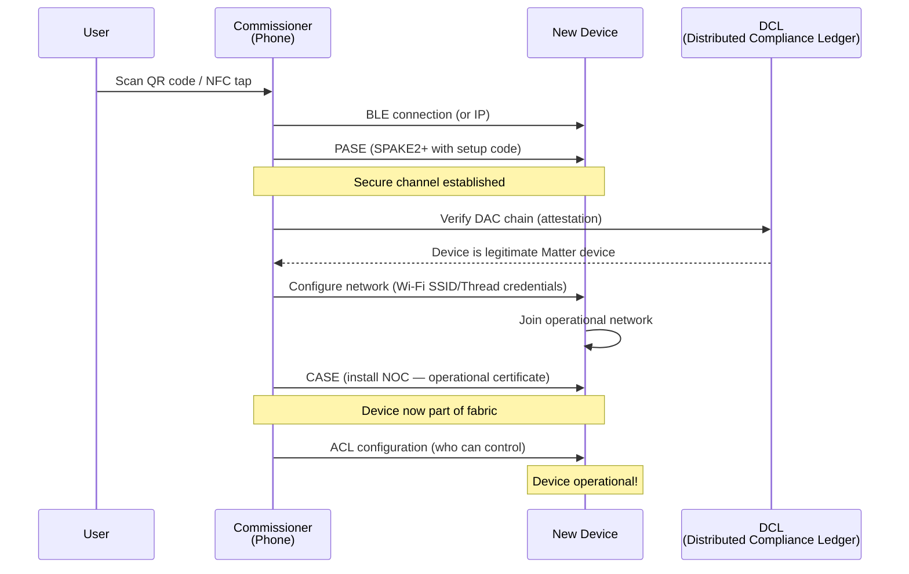
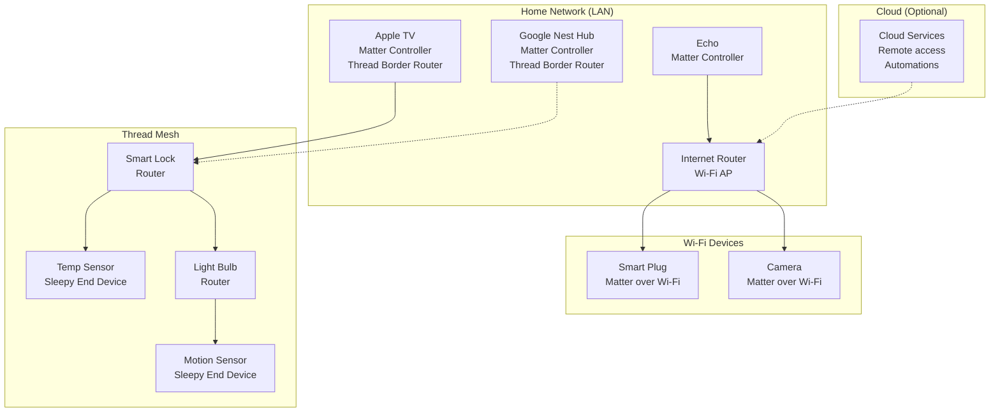

# Matter Smart Home Protocol

**Topic:** Matter (formerly CHIP) — Unified Smart Home Standard over IP (Wi-Fi, Thread, Ethernet)  
**Standards:** Matter 1.0, 1.1, 1.2, 1.3 (Connectivity Standards Alliance)  
**SDO:** Connectivity Standards Alliance (CSA), formerly Zigbee Alliance  
**Audience:** Smart home product developers, IoT architects, embedded engineers, home automation integrators  
**Prerequisites:** IPv6 networking, BLE basics, Thread/Wi-Fi, PKI/certificate concepts

---

## Chapter 1 — Historical Context & Origin Story

### 1.1 The Smart Home Fragmentation Problem

| Year | Issue | Impact |
|------|-------|--------|
| 2014 | Apple HomeKit (proprietary) | Only works with Apple devices |
| 2015 | Google Weave/Thread | Separate ecosystem |
| 2016 | Amazon Alexa Smart Home | Yet another protocol |
| 2017 | Samsung SmartThings (Zigbee/Z-Wave) | Multiple protocols needed |
| 2018 | Consumer confusion peaks | "Will this work with MY phone?" |
| 2019 | Project CHIP announced | Apple + Google + Amazon + Samsung unite |
| 2022 | Matter 1.0 released | Single protocol, all ecosystems |

### 1.2 Matter Timeline

| Date | Event |
|------|-------|
| Dec 2019 | Project Connected Home over IP (CHIP) announced |
| 2020 | Zigbee Alliance renamed to CSA; CHIP development |
| Oct 2022 | Matter 1.0 specification released |
| Nov 2022 | First Matter-certified devices ship |
| May 2023 | Matter 1.1 (bug fixes, EV charging) |
| Oct 2023 | Matter 1.2 (fridges, AC, smoke detectors) |
| May 2024 | Matter 1.3 (water management, energy, cameras preview) |
| 2025 | Matter 2.0 (cameras, robot vacuums, managed networks) |

### 1.3 Founding Members

Apple, Google, Amazon, Samsung, Comcast, IKEA, Signify (Philips Hue), Huawei, Nordic Semiconductor, NXP, Silicon Labs, Espressif, Texas Instruments

---

## Chapter 2 — Standard Architecture & Structure

### 2.1 Matter Protocol Stack

```mermaid
graph TB
    subgraph "Application Layer"
        A[Matter Data Model<br/>Clusters, Attributes, Commands<br/>Device Types]
    end
    
    subgraph "Interaction Model"
        B[Read/Write/Subscribe/Invoke<br/>Reporting, Events]
    end
    
    subgraph "Action Framing"
        C[TLV Encoding<br/>Interaction Model messages]
    end
    
    subgraph "Security"
        D[CASE / PASE<br/>Session establishment<br/>AES-CCM encryption]
    end
    
    subgraph "Message Layer"
        E[MRP - Message Reliability Protocol<br/>Retransmission, ACK]
    end
    
    subgraph "Transport"
        F[UDP / IPv6<br/>mDNS + DNS-SD discovery]
    end
    
    subgraph "Network"
        G[Wi-Fi | Thread | Ethernet<br/>BLE (commissioning only)]
    end
    
    A --> B --> C --> D --> E --> F --> G
```

### 2.2 Matter Device Types (1.3)

| Category | Device Types |
|----------|-------------|
| Lighting | On/Off Light, Dimmable, Color Temperature, Extended Color |
| Smart plugs | On/Off Plug, Dimmable Plug |
| Switches | On/Off Switch, Dimmer, Color Dimmer |
| Sensors | Contact, Occupancy, Temperature, Humidity, Light |
| HVAC | Thermostat, Fan, Room AC |
| Closures | Door Lock, Window Covering |
| Safety | Smoke/CO Alarm, Air Quality |
| Media | TV, Content App |
| Bridges | Bridge (connect non-Matter devices) |
| Energy | EV Charger, Solar Panel, Battery Storage |
| Water (1.3) | Valve, Leak Detector, Flow Sensor |

---

## Chapter 3 — Technical Deep Dive

### 3.1 Matter Data Model

| Concept | Description | Example |
|---------|-------------|---------|
| Node | A Matter device (commissioning unit) | Smart bulb |
| Endpoint | Logical device within a node | Endpoint 0: root, EP 1: light |
| Cluster | Group of related attributes/commands | On/Off cluster, Level cluster |
| Attribute | Data field within cluster (read/write) | OnOff (bool), CurrentLevel (uint8) |
| Command | Action to invoke | Toggle(), MoveToLevel(level, time) |
| Event | Asynchronous notification | StateChange, AlarmTriggered |

### 3.2 Security Architecture

| Component | Mechanism |
|-----------|-----------|
| Commissioning | PASE (Passcode-Authenticated Session Establishment) — SPAKE2+ |
| Session security | CASE (Certificate-Authenticated Session Establishment) — SIGMA |
| Encryption | AES-128-CCM on all messages |
| Device identity | DAC (Device Attestation Certificate) — per-device from manufacturer |
| Fabric | Logical grouping (trust domain) — each ecosystem is a fabric |
| Multi-admin | Device can belong to multiple fabrics (Apple + Google simultaneously) |
| Certificate chain | PAA → PAI → DAC (3-level PKI) |

### 3.3 Commissioning Flow



### 3.4 Multi-Fabric (Multi-Admin)

| Aspect | Description |
|--------|-------------|
| Concept | Single device controlled by multiple ecosystems |
| Example | Bulb registered to Apple Home AND Google Home AND Alexa |
| Mechanism | Device holds multiple NOCs (one per fabric) |
| Limit | Up to 5 fabrics per device (minimum required) |
| ACL | Each fabric has independent access control list |
| Independence | Removing from one fabric doesn't affect others |

### 3.5 Networking

| Transport | Use Case | Discovery |
|-----------|----------|-----------|
| Wi-Fi | High-bandwidth devices (cameras, speakers) | mDNS/DNS-SD |
| Thread | Low-power mesh (sensors, locks, bulbs) | DNS-SD over Thread |
| Ethernet | Bridges, hubs, high-reliability | mDNS/DNS-SD |
| BLE | Commissioning only (setup phase) | BLE advertising |

---

## Chapter 4 — Implementation Guide

### 4.1 Matter SDK (ConnectedHomeIP)

| Component | Language | Purpose |
|-----------|----------|---------|
| Matter SDK | C++ | Core protocol implementation |
| CHIP Tool | C++ | CLI commissioner for testing |
| chip-all-clusters-app | C++ | Reference device for all clusters |
| Python controller | Python | Scripted testing |
| Darwin Framework | Swift/ObjC | Apple platform integration |
| Android app | Kotlin | Google/Android commissioning |

**Repository:** github.com/project-chip/connectedhomeip (open source, Apache 2.0)

### 4.2 Platform Support

| Platform (SoC) | Vendor | Transport | Notes |
|----------------|--------|-----------|-------|
| nRF52840/nRF5340 | Nordic | Thread + BLE | Popular for Thread devices |
| EFR32MG24 | Silicon Labs | Thread + BLE | Multiprotocol (Zigbee + Thread) |
| ESP32/ESP32-C3/C6 | Espressif | Wi-Fi + BLE | Low-cost Wi-Fi Matter |
| CC2652/CC2674 | TI | Thread + BLE | Industrial IoT |
| RT1060/RW612 | NXP | Wi-Fi + Thread | Bridge/gateway |
| CYW30739 | Infineon | Thread + BLE | Low power |
| Ameba D/Z2 | Realtek | Wi-Fi + BLE | Smart home |

### 4.3 Device Development Steps

| Step | Action |
|------|--------|
| 1 | Select SoC + transport (Thread vs Wi-Fi) |
| 2 | Clone Matter SDK, configure for platform |
| 3 | Implement device type (select clusters) |
| 4 | Implement cluster logic (attribute storage, command handlers) |
| 5 | Generate DAC (from CSA or test CA) |
| 6 | Test with CHIP Tool / ecosystem apps |
| 7 | Pass Matter certification test harness |
| 8 | Submit to CSA for certification |
| 9 | List on DCL (Distributed Compliance Ledger) |
| 10 | Ship product |

---

## Chapter 5 — Certification & Audit

### 5.1 Matter Certification Process

| Phase | Activity | Outcome |
|-------|----------|---------|
| 1. Preparation | Implement using SDK, pass test harness locally | Ready for ATL |
| 2. ATL Testing | Authorized Test Lab runs official test suite | Test report |
| 3. Certification | CSA reviews, grants certification | Certification ID |
| 4. DCL Listing | Device attestation registered on blockchain | Discoverable |
| 5. Ecosystem | Submit to Apple/Google/Amazon for ecosystem compatibility | Works in ecosystem apps |

### 5.2 Test Harness

| Test Category | Coverage |
|--------------|----------|
| Protocol conformance | Message layer, security, commissioning |
| Cluster conformance | All mandatory cluster behaviors |
| Network | Thread/Wi-Fi operational behavior |
| Security | PASE/CASE, attestation, ACL |
| Multi-admin | Multiple fabric operation |
| OTA | Firmware update mechanism |

### 5.3 Cost

| Item | Estimated Cost |
|------|---------------|
| CSA membership (Participant) | $7,000-35,000/year |
| ATL testing | $10,000-30,000 per device |
| DAC provisioning | $0.01-0.10 per device (manufacturing) |
| Total per product | $20,000-50,000 (first device) |

---

## Chapter 6 — Regional & Domain Variants

| Region | Ecosystem Dominance | Matter Adoption |
|--------|-------------------|-----------------|
| North America | Apple + Google + Amazon | Fastest adoption |
| Europe | IKEA, Signify, Smart home brands | Strong (energy focus) |
| China | Tuya, Xiaomi, Huawei | Parallel ecosystems (some Matter) |
| Korea/Japan | Samsung, LG | Active CSA participation |
| India | Google + Amazon dominant | Growing |

---

## Chapter 7 — Comparison: Matter vs Legacy Protocols

| Feature | Matter | Zigbee 3.0 | Z-Wave | HomeKit | Alexa |
|---------|--------|-----------|--------|---------|-------|
| IP-based | Yes (IPv6) | No | No | Partial (HAP over IP) | Cloud-based |
| Transport | Wi-Fi/Thread/Ethernet | 802.15.4 | Sub-GHz (908/868 MHz) | Wi-Fi/BLE/Thread | Wi-Fi |
| Multi-ecosystem | Yes (native) | No (hub-specific) | No (hub-specific) | Apple only | Amazon only |
| Open source | Yes (Apache 2.0) | No (CSA members) | No (proprietary) | No (MFi) | No |
| Mesh | Thread (underlying) | Native mesh | Native mesh | Thread | No |
| Security | PKI + CASE/PASE | Network key | S2 (ECDH) | Ed25519 + SRP | Cloud TLS |
| Device types | 30+ (growing) | Mature (100+) | Mature (80+) | Growing | Cloud skills |
| Local control | Yes | Yes (hub) | Yes (hub) | Yes | Mostly cloud |
| Latency | Low (local) | Low | Low | Low | High (cloud) |

---

## Chapter 8 — Mermaid Architecture Diagrams

### 8.1 Matter Network Topology



### 8.2 Matter Security Architecture

```mermaid
graph TB
    subgraph "PKI Hierarchy"
        PAA[PAA<br/>Product Attestation Authority<br/>Root CA per vendor]
        PAI[PAI<br/>Product Attestation Intermediate<br/>Per product line]
        DAC[DAC<br/>Device Attestation Certificate<br/>Per physical device]
    end
    
    subgraph "Operational PKI (per Fabric)"
        RCAC[Root CA Certificate<br/>Fabric root (ecosystem)]
        ICAC[Intermediate CA<br/>Optional]
        NOC[NOC<br/>Node Operational Certificate<br/>Per device-in-fabric]
    end
    
    PAA --> PAI --> DAC
    RCAC --> ICAC --> NOC
    
    subgraph "Verification"
        DCL[DCL<br/>Distributed Compliance Ledger<br/>PAA trust anchors]
    end
    
    DAC --> DCL
```

---

## Chapter 9 — Case Studies & Failure Analysis

### 9.1 Matter 1.0 Launch Challenges

**Issues observed (2022-2023):** (1) Slow commissioning: Thread device setup took 30-60 seconds (user impatience). (2) Thread border router compatibility: Different vendors' border routers didn't always mesh well. (3) Limited device types: Only lights, plugs, sensors at launch (no cameras, vacuums). (4) Ecosystem fragmentation persists: Each ecosystem (Apple/Google/Amazon) adds proprietary extensions on top of Matter. (5) Bridge complexity: Existing Zigbee/Z-Wave devices needed bridges → another box.

**Resolutions:** (1) Matter 1.1-1.3: Bug fixes, optimization, more device types. (2) Thread 1.3 improvements: Better border router interop. (3) Ecosystem updates: Faster commissioning UX. (4) More device types each release.

### 9.2 Multi-Admin Success

**Scenario:** User has Apple HomePod, Google Nest, and Amazon Echo. Buys one Matter smart lock.

**Before Matter:** Would need to choose ONE ecosystem. Lock with HomeKit → can't use with Alexa.

**With Matter:** (1) Commission lock to Apple Home (first fabric). (2) Share to Google Home (second fabric). (3) Share to Alexa (third fabric). (4) All three can control the lock independently. (5) Remove one ecosystem → others unaffected.

---

## Chapter 10 — Future Evolution & Industry Trends

| Version | Timeline | New Capabilities |
|---------|----------|-----------------|
| Matter 1.4 | 2024 H2 | Solar panels, heat pumps, water heaters |
| Matter 2.0 | 2025 | Cameras (major!), robot vacuums, managed Wi-Fi |
| Future | 2026+ | Access control (commercial), health devices |
| Thread 2.0 | 2025 | Enhanced thread for Matter scale |
| Bridge improvements | Ongoing | Better non-Matter device integration |
| AI integration | 2025+ | LLM-based home automation (via Matter) |

---

## Chapter 11 — Interview Questions & Career Guide

### Tier 1: Entry-Level

**Q1:** What is Matter and why was it created?  
**A:** **Matter** is a unified smart home connectivity standard created by the Connectivity Standards Alliance (Apple, Google, Amazon, Samsung, etc.). **Why created:** (1) Smart home was fragmented — devices worked with only one ecosystem. (2) Developers had to support multiple protocols (HomeKit, Alexa, Google Home separately). (3) Consumers were confused about compatibility. **How it works:** (1) IP-based protocol (runs over Wi-Fi, Thread, or Ethernet). (2) Single certification → device works with ALL ecosystems. (3) Local control (no cloud dependency for basic operations). (4) Open source SDK (connectedhomeip). (5) Strong security (PKI-based, per-device certificates). **Result:** Buy any Matter device → works with Apple Home, Google Home, Alexa, SmartThings simultaneously (multi-admin).

### Tier 2: Mid-Level

**Q2:** Explain Matter's security model (PASE, CASE, DAC).  
**A:** **Three pillars:** (1) **PASE (Passcode-Authenticated Session Establishment):** Used during commissioning only. Protocol: SPAKE2+ (password-authenticated key exchange). Input: Setup code (QR code or manual 11-digit). Result: Secure channel without prior PKI. Purpose: Bootstrap trust for initial setup. (2) **CASE (Certificate-Authenticated Session Establishment):** Used for all operational communication. Protocol: SIGMA (variant of Noise NK). Each device has NOC (Node Operational Certificate) from fabric CA. Mutual authentication: both sides verify certificates. Result: Encrypted session (AES-128-CCM). (3) **DAC (Device Attestation Certificate):** Proves device is genuine Matter-certified hardware. Chain: PAA → PAI → DAC (per-device). Verified against DCL (blockchain-based trust anchor list) during commissioning. Prevents counterfeit devices from joining. **Together:** PASE bootstraps trust → DAC verifies legitimacy → NOC installed → CASE for all future sessions.

### Tier 3: Senior

**Q3:** How would you architect a Matter bridge for 500 legacy Zigbee devices?  
**A:** **Architecture:** (1) **Hardware:** Linux-based gateway (NXP/TI SoC) with 802.15.4 radio (Zigbee coordinator) + Ethernet/Wi-Fi (Matter transport). Sufficient RAM/flash for 500 bridged endpoints. (2) **Matter side:** Bridge device type (Endpoint 0 = Bridge root, EPs 1-500 = bridged devices). Each Zigbee device mapped to a Matter endpoint with appropriate clusters. Dynamic endpoint management (devices join/leave). (3) **Translation layer:** Zigbee Cluster Library (ZCL) → Matter cluster mapping (largely 1:1 for common clusters: OnOff, Level, Color, Temperature). Handle semantic differences (Zigbee groups → Matter group mechanism). (4) **Scaling challenge:** Matter has operational limits (~150 endpoints per node recommended). Solution: Multiple bridge instances or aggregation nodes. (5) **Commissioning:** Bridge itself commissions once to fabric. Bridged devices appear automatically (aggregated commissioning). Each bridged endpoint gets unique identifier (Bridged Device Basic Info cluster). (6) **Security:** Zigbee side: network key (link key per device if Zigbee 3.0). Matter side: full CASE security per session. Bridge is trust boundary — must protect key material. (7) **OTA:** Bridge firmware update via Matter OTA. Zigbee device firmware update via Zigbee OTA (initiated through bridge management).

---

## Chapter 12 — Cheat Sheet & Quick Reference

### Matter Quick Reference

```
Protocol:    IP-based (IPv6), runs on Wi-Fi / Thread / Ethernet
Commissioning: BLE (for Thread devices) or Wi-Fi
Security:    PASE (setup) → DAC (attestation) → CASE (operational)
Encryption:  AES-128-CCM on all messages
Transport:   UDP + MRP (reliable messaging)
Discovery:   mDNS / DNS-SD
Multi-admin: Up to 5 fabrics (ecosystems) per device
SDK:         Open source (connectedhomeip, Apache 2.0)
Cert body:   Connectivity Standards Alliance (CSA)
Versions:    1.0 (2022), 1.1, 1.2, 1.3 (2024)
```

### Key Concepts

```
Node:       Physical device (one commissioning unit)
Endpoint:   Logical device (EP0=root, EP1+=applications)
Cluster:    Feature group (OnOff, Level, Color, etc.)
Attribute:  Data field in cluster (readable/writable)
Command:    Action (Toggle, MoveToLevel, Lock)
Fabric:     Trust domain (one per ecosystem)
NOC:        Node Operational Certificate (per device per fabric)
DAC:        Device Attestation Certificate (per physical device)
```

### Transport Selection

```
Thread:  Low-power devices (sensors, locks, bulbs)
Wi-Fi:   High-bandwidth (cameras, speakers, displays)
Ethernet: Always-on (bridges, hubs, panels)
BLE:     Commissioning only (not operational)
```

---

*End of Document — 05_Matter_Smart_Home_Protocol.md*
