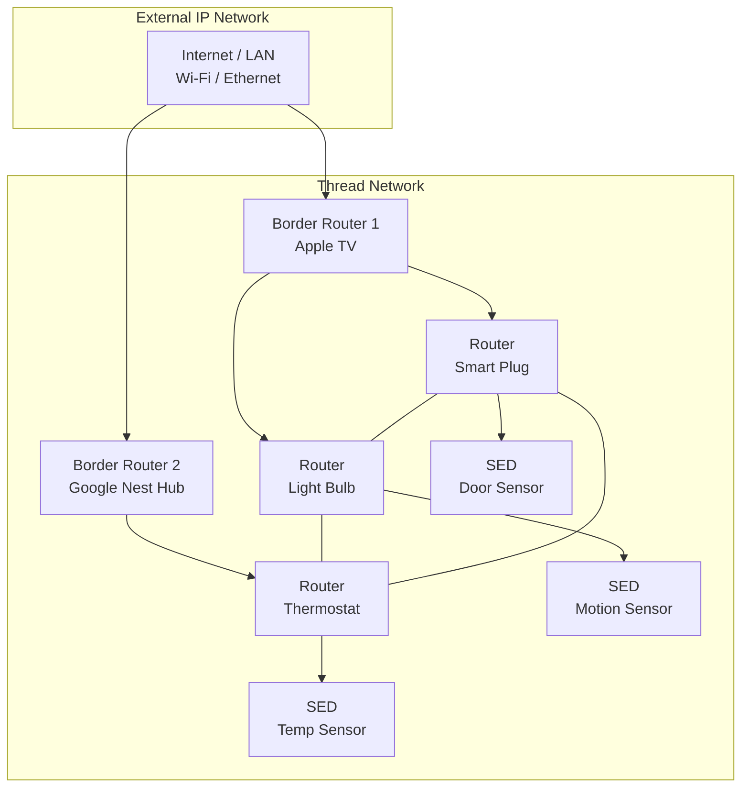
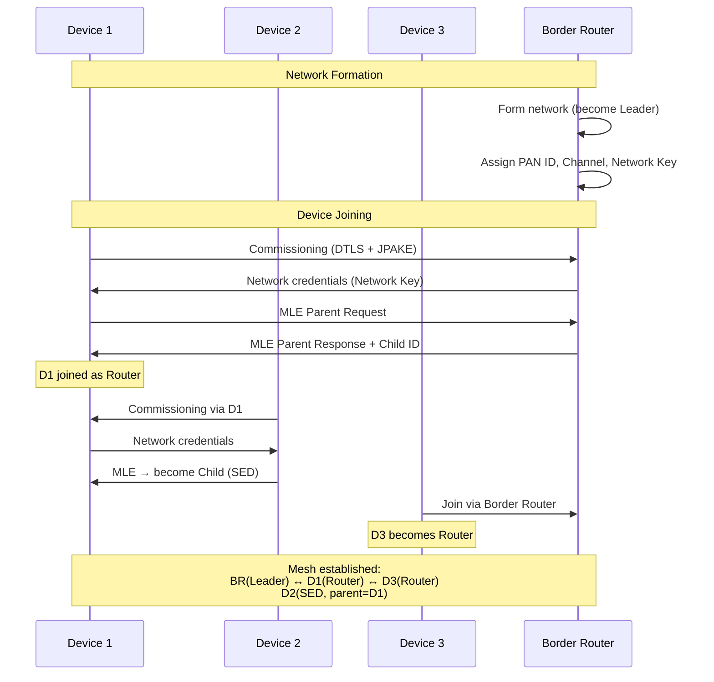
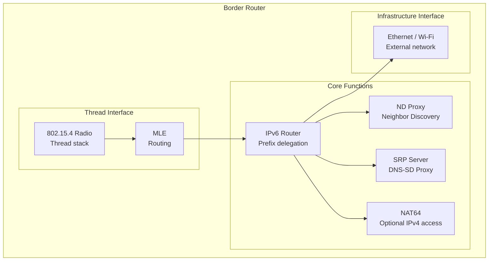

# Thread & 6LoWPAN Mesh Networking

**Topic:** Thread Protocol — IPv6 Mesh over IEEE 802.15.4, 6LoWPAN Adaptation, Border Routers, OpenThread  
**Standards:** Thread 1.1/1.2/1.3 (Thread Group), IEEE 802.15.4-2020, RFC 4944/6282 (6LoWPAN)  
**SDO:** Thread Group, IEEE 802.15, IETF (6LoWPAN WG)  
**Audience:** IoT mesh network engineers, smart home developers, embedded firmware engineers, Thread border router designers  
**Prerequisites:** IPv6 basics, IEEE 802.15.4 PHY/MAC, BLE (for commissioning), networking fundamentals

---

## Chapter 1 — Historical Context & Origin Story

### 1.1 Thread Origins

| Year | Event |
|------|-------|
| 2008 | 6LoWPAN RFC 4944 published (IPv6 over 802.15.4) |
| 2011 | RPL (Routing Protocol for LLN) RFC 6550 |
| 2014 | Thread Group formed (Nest/Google, ARM, Samsung, Silicon Labs, others) |
| 2015 | Thread 1.0 specification released |
| 2017 | OpenThread (open source stack) released by Google |
| 2019 | Thread 1.2 (backbone, domain proxy) |
| 2020 | Thread selected as transport for Project CHIP/Matter |
| 2022 | Thread 1.3 (improvements for Matter) |
| 2022 | Matter 1.0 ships — Thread becomes mainstream |
| 2024 | Thread deployed in Apple, Google, Amazon border routers |

### 1.2 Why Thread was Created

| Existing Solution | Problem | Thread's Answer |
|------------------|---------|-----------------|
| Zigbee | Non-IP (needs gateway translation) | Native IPv6 (end-to-end IP) |
| Zigbee | Single coordinator (SPOF) | No coordinator; elected leader |
| Wi-Fi | Too power-hungry for battery IoT | 802.15.4 (μA sleep, mW TX) |
| BLE | No native mesh (BLE Mesh added later) | Self-healing mesh from day one |
| Z-Wave | Proprietary, sub-GHz (different band) | Standard 802.15.4, 2.4 GHz |
| 6LoWPAN (raw) | No commissioning, no security standard | Complete secure stack |

---

## Chapter 2 — Standard Architecture & Structure

### 2.1 Thread Protocol Stack

```mermaid
graph TB
    subgraph "Application"
        A[CoAP / Matter / Custom<br/>Application protocol]
    end
    
    subgraph "Transport"
        B[UDP / TCP<br/>DTLS for security]
    end
    
    subgraph "Network"
        C[IPv6<br/>Unicast + Multicast<br/>ND (Neighbor Discovery)]
    end
    
    subgraph "Adaptation"
        D[6LoWPAN<br/>Header compression<br/>Fragmentation<br/>Mesh addressing]
    end
    
    subgraph "MAC"
        E[IEEE 802.15.4 MAC<br/>CSMA-CA<br/>Frame format]
    end
    
    subgraph "PHY"
        F[IEEE 802.15.4 PHY<br/>O-QPSK, 2.4 GHz<br/>250 kbps, 16 channels]
    end
    
    A --> B --> C --> D --> E --> F
```

### 2.2 Thread Device Roles

| Role | Description | Power | Forwarding |
|------|-------------|-------|-----------|
| Leader | Elected router that manages network parameters | Mains | Yes |
| Router | Forwards frames, always-on radio | Mains/battery | Yes |
| REED (Router Eligible End Device) | Can become router if needed | Mains | Potential |
| SED (Sleepy End Device) | Battery-powered, polls parent | Battery | No |
| SSED (Synchronized Sleepy End Device) | CSL-based, ultra-low power | Battery | No |
| Border Router | Connects Thread mesh to external IP network | Mains | Yes (bridge) |
| Commissioner | Authenticates and admits new devices | Any | N/A |

### 2.3 Thread Network Topology



---

## Chapter 3 — Technical Deep Dive

### 3.1 IEEE 802.15.4 PHY/MAC (Thread's Foundation)

| Parameter | Value |
|-----------|-------|
| Frequency | 2.4 GHz ISM (2400-2483.5 MHz) |
| Channels | 16 channels (11-26), 5 MHz spacing |
| Modulation | O-QPSK (Offset Quadrature Phase Shift Keying) |
| Data rate | 250 kbps |
| Max frame | 127 bytes (at MAC layer) |
| Access | CSMA-CA (Carrier Sense Multiple Access) |
| Addressing | 16-bit short address or 64-bit extended (EUI-64) |
| TX power | Typically 0-8 dBm |
| Sensitivity | -100 dBm (typical) |
| Range | 10-30m indoor (per hop) |

### 3.2 6LoWPAN Header Compression

**Problem:** IPv6 header is 40 bytes. 802.15.4 frame max is 127 bytes (after MAC overhead, ~80 bytes for payload). IPv6 header would consume half the frame!

**Solution (RFC 6282 — IPHC):**

| Field | IPv6 (uncompressed) | 6LoWPAN (compressed) |
|-------|---------------------|---------------------|
| Version | 4 bits | Implicit (always 6) |
| Traffic Class | 8 bits | Often 0 → elided |
| Flow Label | 20 bits | Often 0 → elided |
| Payload Length | 16 bits | Inferred from MAC frame length |
| Next Header | 8 bits | Compressed (UDP=17→1 bit flag) |
| Hop Limit | 8 bits | Kept (8 bits) or common values |
| Source Address | 128 bits | Derived from link-local MAC (0-16 bits) |
| Destination Address | 128 bits | Derived from link-local MAC (0-16 bits) |
| **Total IPv6** | **40 bytes** | **As low as 2-7 bytes** |

### 3.3 Thread Routing (MLE + Mesh)

| Component | Protocol | Function |
|-----------|----------|----------|
| Mesh Link Establishment (MLE) | Thread-specific | Discover neighbors, establish links, assign router IDs |
| Mesh forwarding | 802.15.4 mesh addressing | Forward frames hop-by-hop across mesh |
| Address mapping | Thread Address Query | Map IPv6 ↔ 802.15.4 short address |
| Leader election | Thread consensus | Select leader from routers (holds network data) |

**Routing table:** Each router maintains routing table for all other routers (max 32 routers per Thread network). Routes to sleepy end devices via parent router.

### 3.4 Thread Security

| Layer | Mechanism |
|-------|-----------|
| MAC (802.15.4) | AES-128-CCM (network-wide key: Network Key) |
| MLE | AES-128-CCM (MLE key, derived from Network Key) |
| Application (DTLS) | Per-session DTLS 1.2 (CoAP Secure) |
| Commissioning | DTLS with JPAKE (passphrase-based) |
| Network Key distribution | Encrypted via Commissioner session |
| Key rotation | Periodic key rotation (configurable) |

### 3.5 Border Router Function

| Function | Description |
|----------|-------------|
| IPv6 routing | Route between Thread mesh and external IPv6 network |
| ND Proxy | Proxy Neighbor Discovery for Thread devices |
| Prefix publication | Advertise external IPv6 prefixes into Thread |
| mDNS/DNS-SD | Proxy service discovery (Thread ↔ LAN) |
| NAT64 | Optional IPv4 connectivity for Thread devices |
| Backbone link | Connect multiple Thread partitions |
| SRP (Service Registration) | Thread devices register services via border router |

---

## Chapter 4 — Implementation Guide

### 4.1 OpenThread

| Aspect | Details |
|--------|---------|
| License | BSD 3-Clause (open source) |
| Language | C/C++ |
| Platforms | Nordic (nRF52/53/54), Silicon Labs (EFR32), TI (CC2652), ESP32-H2 |
| Features | Full Thread 1.3 stack, CLI, NCP (Network Co-Processor) mode |
| OTBR | OpenThread Border Router (Raspberry Pi / Linux) |
| Testing | Thread certification harness integration |

### 4.2 Thread SoC Options

| Vendor | Chip | CPU | Flash/RAM | Thread Version | Notes |
|--------|------|-----|-----------|----------------|-------|
| Nordic | nRF52840 | Cortex-M4 | 1MB/256KB | 1.3 | Most popular |
| Nordic | nRF5340 | Cortex-M33+M33 | 1MB/512KB | 1.3 | Dual-core |
| Silicon Labs | EFR32MG24 | Cortex-M33 | 1.5MB/256KB | 1.3 | Multiprotocol |
| TI | CC2652R7 | Cortex-M4F | 704KB/256KB | 1.3 | Low power |
| Espressif | ESP32-H2 | RISC-V | 4MB/320KB | 1.3 | Low cost |
| NXP | K32W148 | Cortex-M33 | 1.5MB/256KB | 1.3 | Matter-optimized |

### 4.3 Sleepy End Device (SED) Design

| Parameter | Typical | Aggressive |
|-----------|---------|-----------|
| Poll interval | 1-7 seconds | 10-60 seconds |
| Sleep current | 1-3 μA | 1-3 μA |
| TX current | 5-8 mA | 5-8 mA |
| Average current | 10-50 μA | 3-10 μA |
| Battery life (CR2032) | 1-3 years | 3-5 years |
| Latency to reach device | Up to poll interval | Up to poll interval |

---

## Chapter 5 — Certification & Audit

### 5.1 Thread Certification

| Level | Scope | Requirements |
|-------|-------|-------------|
| Thread Certified Component | SoC/module | Stack + PHY conformance |
| Thread Certified Product | End product | Full protocol + profile testing |
| Thread Border Router | Border router | Routing + backbone testing |
| Thread Test Harness | — | Official test tool from Thread Group |

### 5.2 Certification Process

| Step | Action |
|------|--------|
| 1 | Join Thread Group (membership required) |
| 2 | Implement Thread stack (OpenThread or commercial) |
| 3 | Pass Thread Test Harness (self-testing) |
| 4 | Submit to authorized test lab |
| 5 | Lab executes conformance test suite |
| 6 | Thread Group grants certification |
| 7 | Product listed on Thread Group website |

---

## Chapter 6 — Regional & Domain Variants

| Domain | Thread Usage | Notes |
|--------|-------------|-------|
| Smart home | Primary transport for Matter (sensors, locks, lights) | Mass market 2022+ |
| Commercial building | Lighting control (DALI over Thread) | Emerging |
| Smart city | Street lighting, parking sensors | Pilot deployments |
| Industrial | Limited (802.15.4e variants preferred) | Niche |
| Healthcare | Patient monitoring (low power) | Research phase |
| Agriculture | Limited (range insufficient vs LoRa) | Not ideal |

---

## Chapter 7 — Comparison: Thread vs Competitors

| Feature | Thread 1.3 | Zigbee 3.0 | Z-Wave (800) | BLE Mesh 1.1 | Wi-Fi HaLow |
|---------|-----------|-----------|-------------|-------------|-------------|
| PHY | 802.15.4 | 802.15.4 | Sub-GHz | 2.4 GHz BLE | Sub-GHz Wi-Fi |
| IP native | Yes (IPv6) | No | No | No | Yes (IPv4/6) |
| Data rate | 250 kbps | 250 kbps | 100 kbps | 1-2 Mbps | 8 Mbps |
| Range/hop | 10-30m | 10-30m | 30-100m | 10-30m | 1 km |
| Mesh | Self-healing | Tree/mesh | Mesh (source) | Flood mesh | No (star) |
| Power | Very low | Very low | Very low | Low | Low-medium |
| Max nodes | 250+ (32 routers) | 65K (theory) | 232 | 32K | AP-limited |
| Security | AES-128 + DTLS | AES-128 | S2 (ECDH) | AES-CCM | WPA3 |
| Coordinator | No (elected leader) | Yes (required) | Yes (required) | No | AP |
| Standard body | Thread Group | CSA | Z-Wave Alliance | Bluetooth SIG | Wi-Fi Alliance |
| Matter support | Native | Via bridge | Via bridge | Commissioning only | Transport option |

---

## Chapter 8 — Mermaid Architecture Diagrams

### 8.1 Thread Network Formation



### 8.2 Border Router Architecture



---

## Chapter 9 — Case Studies & Failure Analysis

### 9.1 Multiple Border Router Resilience

**Scenario:** Home has Apple TV (BR1) and Google Nest Hub (BR2) as Thread border routers. Apple TV loses power.

**Thread behavior:** (1) Both BR1 and BR2 are active routers in the same Thread network. (2) When BR1 goes offline, Thread mesh self-heals (~seconds). (3) Devices previously routing through BR1 switch paths to BR2. (4) External connectivity maintained via BR2. (5) No user intervention needed.

**Key design:** Thread's leader election and self-healing mesh ensure no single point of failure. Multiple border routers = redundant paths to IP network.

### 9.2 Scalability Challenge

**Problem:** Large Thread deployment (200+ nodes). 32 router limit reached. Performance degrades.

**Symptoms:** (1) Address queries increase (routing table full). (2) MLE handshake overhead. (3) Channel congestion (250 kbps shared).

**Solutions:** (1) Multiple Thread partitions (networks) with backbone links. (2) Careful placement: mains-powered devices as routers, battery as SEDs. (3) Thread 1.2 backbone feature: merge partitions via Ethernet backbone. (4) For >500 devices: consider multiple Thread networks with different channels.

---

## Chapter 10 — Future Evolution & Industry Trends

| Development | Timeline | Impact |
|------------|----------|--------|
| Thread 2.0 | 2025 | Improved scalability, enhanced security |
| Matter growth | 2024-2026 | Drives Thread adoption (every Matter sensor = Thread) |
| More border routers | 2024+ | Every smart speaker/display becomes Thread BR |
| Thread over 802.15.4g | Future | Sub-GHz for longer range |
| Credential sharing | 2024+ | iOS/Android share Thread network credentials |
| Commercial Thread | 2025+ | DALI lighting, building automation |
| Thread + Wi-Fi combo SoCs | 2024+ | Single chip: Wi-Fi + Thread (NXP RW612) |

---

## Chapter 11 — Interview Questions & Career Guide

### Tier 1: Entry-Level

**Q1:** What is Thread and how is it different from Zigbee?  
**A:** **Thread** is a low-power mesh networking protocol built on IEEE 802.15.4 (same PHY as Zigbee) but with native IPv6 addressing. **Key differences from Zigbee:** (1) **IP-native:** Thread uses IPv6 + 6LoWPAN. Devices have real IP addresses. Can communicate end-to-end with any IP device without protocol translation. Zigbee has its own non-IP network layer → needs a gateway/bridge to convert. (2) **No coordinator:** Thread uses an elected leader (any router can become leader). If leader fails, new one is elected. Zigbee requires a coordinator (single point of failure). (3) **Self-healing:** Thread mesh automatically reroutes around failures. Better resilience than Zigbee's tree topology. (4) **Border Router:** Thread connects to IP network via Border Router (simple routing, no translation). Zigbee needs application-level gateway. (5) **Chosen by Matter:** Thread is the mesh transport for Matter smart home standard.

### Tier 2: Mid-Level

**Q2:** Explain 6LoWPAN header compression and why it's critical for Thread.  
**A:** **Problem:** IEEE 802.15.4 has maximum 127-byte frames. After MAC header (~23 bytes), ~80 bytes remain for payload. IPv6 header alone is 40 bytes — leaving only 40 bytes for UDP + application data. Unacceptable. **6LoWPAN solution (RFC 6282, IPHC):** Compresses IPv6 + UDP headers from 48 bytes down to 6-7 bytes by: (1) **Version elided:** Always IPv6, no need to encode. (2) **Addresses compressed:** Link-local addresses derived from 802.15.4 MAC address (IID = EUI-64). If prefix matches default (fe80::/64 or mesh-local), only encode last 16 bits. (3) **UDP ports compressed:** If both ports in common range (0xF0Bx), encode in 4 bits each instead of 32. (4) **Traffic class/Flow label:** Usually 0, elided. (5) **Payload length:** Inferred from MAC frame length. **Result:** 40+8 = 48 bytes (IPv6+UDP) → 7 bytes. Leaves ~70 bytes for application payload per hop. **Fragmentation:** If application data exceeds single frame, 6LoWPAN fragments across multiple 802.15.4 frames.

### Tier 3: Senior

**Q3:** Design a Thread network for a 10-floor commercial building with 2000 devices.  
**A:** **Design:** (1) **Network partitioning:** 2000 devices exceed single Thread network practical limits (~250 nodes). Deploy one Thread network per 2-3 floors (4-5 networks total). Different 802.15.4 channels per network (reduce interference). (2) **Per-floor topology:** ~50-100 devices per floor. Mains-powered devices (lights, plugs) = Routers. Battery devices (sensors) = SEDs. Target: 10-15 routers per floor for good coverage. (3) **Border Routers:** 2 border routers per Thread network (redundancy). Connected via Ethernet backbone. Thread 1.2 backbone feature connects networks at IP layer. (4) **Backbone connectivity:** All border routers on building Ethernet. Thread backbone allows cross-network multicast. DNS-SD proxy for service discovery across networks. (5) **Commissioning:** Thread commissioner per network (building management system). Bulk commissioning via pre-provisioned credentials (manufacturing integration). (6) **Scalability management:** 32 router limit → use REED (promote on demand). Monitor network health (MLE metrics). Load-balance: ensure routers distributed evenly. (7) **Channel planning:** 16 channels available (802.15.4). Assign non-overlapping to adjacent networks. Also consider Wi-Fi interference (channels 15, 20, 25, 26 avoid Wi-Fi channels 1, 6, 11).

---

## Chapter 12 — Cheat Sheet & Quick Reference

### Thread Quick Facts

```
PHY:           IEEE 802.15.4, 2.4 GHz, 250 kbps
Addressing:    IPv6 (6LoWPAN compressed)
Mesh:          Self-healing, no coordinator
Max routers:   32 per network
Max nodes:     250+ (practical)
Security:      AES-128-CCM (MAC) + DTLS (app)
Range:         10-30m per hop (indoor)
Power:         ~3 μA sleep, 5-8 mA TX
Roles:         Leader, Router, REED, SED, SSED, Border Router
Transport for: Matter (smart home)
Open source:   OpenThread (Google, BSD license)
```

### Thread vs Zigbee Decision

```
Use Thread when:
  - Need IP connectivity (Matter, cloud)
  - No single point of failure required
  - Integration with IP ecosystem
  - Future-proof (Matter standard)

Use Zigbee when:
  - Large existing Zigbee deployment
  - Specific Zigbee profiles needed
  - Legacy equipment compatibility
  - Very large networks (65K theoretical)
```

### 6LoWPAN Compression Summary

```
IPv6 (40 bytes) + UDP (8 bytes) = 48 bytes uncompressed
6LoWPAN IPHC: ~6-7 bytes compressed
Compression ratio: ~7:1
Fragmentation threshold: ~80 bytes payload per frame
```

---

*End of Document — 06_Thread_6LoWPAN.md*
