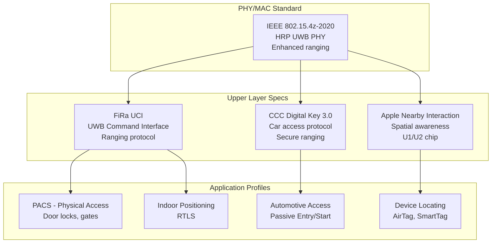
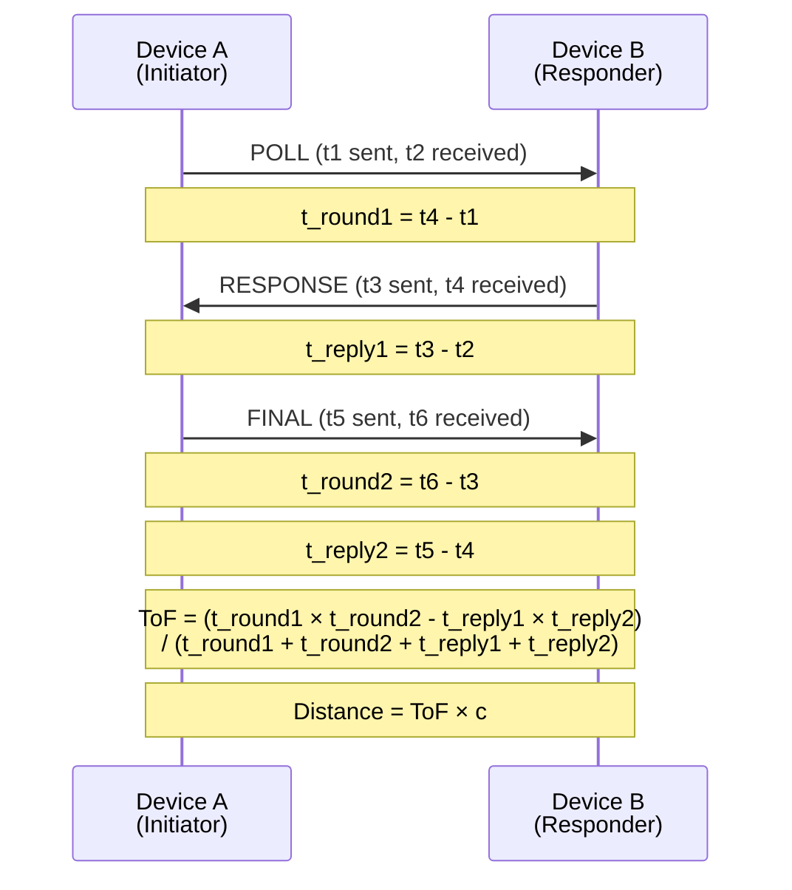
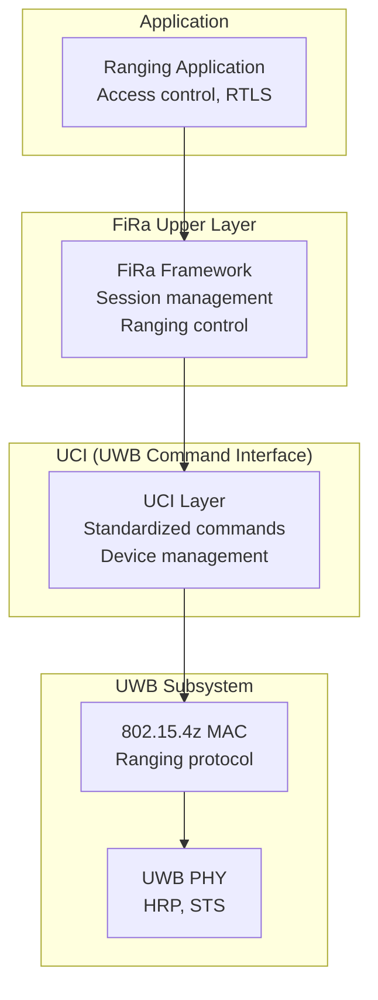
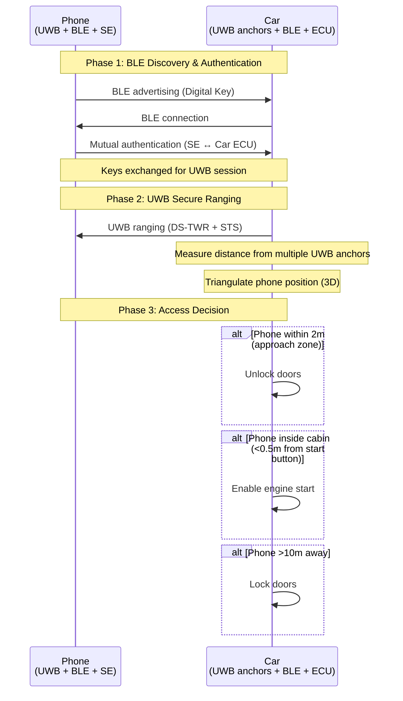

# Ultra-Wideband (UWB) — IEEE 802.15.4z

**Topic:** UWB Secure Ranging — IEEE 802.15.4z HRP, FiRa Consortium, CCC Digital Key, RTLS  
**Standards:** IEEE 802.15.4z-2020, FiRa UCI 1.0/2.0, CCC Digital Key 3.0, ISO/IEC 24730-62  
**SDO:** IEEE 802.15, FiRa Consortium, Car Connectivity Consortium (CCC)  
**Audience:** UWB product engineers, automotive access system designers, RTLS architects, mobile device engineers  
**Prerequisites:** RF fundamentals, time-of-flight ranging, basic security concepts, BLE (complementary)

---

## Chapter 1 — Historical Context & Origin Story

### 1.1 UWB Timeline

| Year | Event |
|------|-------|
| 2002 | FCC authorizes UWB (3.1-10.6 GHz) for commercial use |
| 2007 | IEEE 802.15.4a (UWB impulse radio PHY) |
| 2015 | Decawave DW1000 chip (first practical UWB ranging IC) |
| 2019 | Apple U1 chip (iPhone 11) — UWB goes mainstream |
| 2019 | FiRa Consortium founded (NXP, Bosch, HID, Samsung, Sony) |
| 2020 | IEEE 802.15.4z amendment (HRP UWB, STS security) |
| 2020 | CCC Digital Key 3.0 specification (UWB car access) |
| 2021 | Samsung Galaxy S21 Ultra with UWB |
| 2021 | Apple AirTag (UWB precise finding) |
| 2022 | BMW Digital Key Plus (UWB car unlock) |
| 2023 | Android UWB API standardized |
| 2024 | FiRa 2.0, wider automotive/smart home adoption |

### 1.2 UWB Definition

**Ultra-Wideband:** Signal with bandwidth >500 MHz or >20% of center frequency. Uses very short pulses (nanoseconds) enabling precise time measurements.

| Parameter | Value |
|-----------|-------|
| FCC-approved band | 3.1 - 10.6 GHz |
| Primary channels (HRP) | Channel 5 (6.5 GHz), Channel 9 (8 GHz) |
| Bandwidth per channel | ~500 MHz |
| TX power limit | -41.3 dBm/MHz (very low — noise-like) |
| Pulse duration | ~2 ns |
| Ranging accuracy | ±10 cm (typical) |

---

## Chapter 2 — Standard Architecture & Structure

### 2.1 UWB Standards Ecosystem



### 2.2 IEEE 802.15.4z HRP UWB Channels

| Channel | Center Freq | Bandwidth | Region |
|---------|-------------|-----------|--------|
| 5 | 6489.6 MHz | 499.2 MHz | Global |
| 6 | 6988.8 MHz | 499.2 MHz | US/EU |
| 8 | 7488.0 MHz | 499.2 MHz | US |
| 9 | 7987.2 MHz | 499.2 MHz | Global |
| 10 | 8486.4 MHz | 499.2 MHz | US |
| 11 | 8985.6 MHz | 499.2 MHz | US |
| 12 | 9484.8 MHz | 499.2 MHz | US |
| 13 | 9984.0 MHz | 499.2 MHz | US |
| 14 | 10483.2 MHz | 499.2 MHz | US |

**Most commonly used:** Channel 5 (6.5 GHz) and Channel 9 (8 GHz) — globally available.

---

## Chapter 3 — Technical Deep Dive

### 3.1 UWB Ranging Methods

| Method | Mechanism | Accuracy | Use Case |
|--------|-----------|----------|----------|
| TWR (Two-Way Ranging) | Round-trip time measurement | ±10 cm | P2P ranging (phone ↔ car) |
| SS-TWR (Single-Sided) | One round-trip | ±30 cm | Faster, less accurate |
| DS-TWR (Double-Sided) | Two round-trips | ±10 cm | Clock drift compensated |
| TDoA (Time Difference of Arrival) | Multiple anchors, time differences | ±30 cm | RTLS (infrastructure) |
| PDoA (Phase Difference of Arrival) | Phase across antenna elements | ±5° angle | Direction finding |

### 3.2 Two-Way Ranging (DS-TWR)



**Distance formula (DS-TWR):**

$$d = \frac{c}{2} \cdot \frac{T_{round1} \times T_{round2} - T_{reply1} \times T_{reply2}}{T_{round1} + T_{round2} + T_{reply1} + T_{reply2}}$$

### 3.3 Scrambled Timestamp Sequence (STS)

**802.15.4z security innovation:** STS prevents distance fraud (relay/replay attacks).

| Aspect | Description |
|--------|-------------|
| Purpose | Ensure ranging measurements are authentic (not replayed/relayed) |
| Mechanism | Cryptographically generated pseudo-random sequence in preamble |
| Key | Shared secret between ranging devices (from BLE secure channel) |
| Verification | Receiver correlates received STS against expected sequence |
| Security | Relay attack: attacker can't predict/generate valid STS |
| Modes | STS Mode 1 (with SFD), Mode 2 (no SFD), Mode 3 (segmented) |

### 3.4 UWB PHY Parameters (HRP)

| Parameter | Value |
|-----------|-------|
| Pulse shape | BPM-BPSK (Binary Position Modulation + BPSK) |
| Pulse duration | ~2 ns |
| PRF (Pulse Repetition Frequency) | BPRF: 62.4 MHz, HPRF: 124.8/249.6 MHz |
| Data rates | 850 kbps, 6.8 Mbps, 27.2 Mbps |
| Preamble | SYNC + SFD + STS |
| Ranging resolution | ~15 cm (single pulse), improved with averaging |
| Channel bandwidth | 499.2 MHz |

### 3.5 Angle of Arrival (AoA) with UWB

| Component | Description |
|-----------|-------------|
| Method | PDoA (Phase Difference of Arrival) across antenna pairs |
| Antenna | 2-4 element array (λ/2 spacing ≈ 2.3 cm at 6.5 GHz) |
| Accuracy | ±5° azimuth, ±5° elevation |
| Result | Range + Angle → 3D position |
| Application | Phone pointing at AirTag (directional arrow) |

---

## Chapter 4 — Implementation Guide

### 4.1 UWB Chipsets (2024)

| Vendor | Chip | Features | Target |
|--------|------|----------|--------|
| Apple | U1, U2 | Custom UWB, AoA | iPhone, AirTag, Apple Watch |
| NXP | SR150/SR040 | FiRa + CCC, automotive-grade | Car keys, IoT, mobile |
| Qorvo (Decawave) | DW3720 | 802.15.4z, STS | Industrial RTLS, IoT |
| Samsung | Exynos Connect U100 | FiRa, AoA | Galaxy phones, SmartTag |
| Qualcomm | QM35xx | FiRa + CCC | Android phones, automotive |
| STMicro | ST54J/K | UWB + NFC + SE | Secure access |

### 4.2 FiRa UCI Architecture



### 4.3 Typical UWB System Integration

| Component | Role |
|-----------|------|
| BLE | Discovery, pairing, key exchange (OOB for UWB) |
| UWB | Precise ranging and angle measurement |
| Secure Element | Store keys, run crypto for STS |
| Application processor | Business logic (unlock decision, UI) |

**Flow:** BLE discovers and authenticates → exchanges UWB session keys → UWB ranging starts → distance verified → action (unlock door/car).

---

## Chapter 5 — Certification & Audit

### 5.1 UWB Certification Programs

| Program | Body | Scope |
|---------|------|-------|
| FiRa Certified | FiRa Consortium | Interoperability for ranging |
| CCC Digital Key | CCC | Automotive access |
| Apple MFi (UWB) | Apple | Nearby Interaction integration |
| RF regulatory | FCC/ETSI/MIC | Emissions compliance |

### 5.2 FiRa Certification

| Level | Description |
|-------|-------------|
| PHY conformance | 802.15.4z HRP compliance |
| MAC conformance | Ranging protocol behavior |
| UCI conformance | Command interface interop |
| Profile conformance | Application profile (PACS, etc.) |
| Interoperability | Multi-vendor device ranging |

---

## Chapter 6 — Regional & Domain Variants

### 6.1 UWB Regulatory Status

| Region | Status | Band | Power |
|--------|--------|------|-------|
| US (FCC) | Fully approved | 3.1-10.6 GHz | -41.3 dBm/MHz |
| EU (ETSI) | Approved (EN 302 065) | 6.0-8.5 GHz (primary) | -41.3 dBm/MHz |
| Japan (MIC) | Approved | 3.4-4.8 GHz, 7.25-10.25 GHz | -41.3 dBm/MHz |
| China (MIIT) | Approved (restricted) | 6-9 GHz | Various |
| Korea (MSIT) | Approved | 3.1-10.6 GHz | -41.3 dBm/MHz |
| India | Under review | Expected 6-8.5 GHz | Pending |

### 6.2 Application Domains

| Domain | Use Case | Key Standard |
|--------|----------|-------------|
| Automotive | Passive entry/start (digital key) | CCC 3.0 |
| Consumer | Device finding (AirTag, SmartTag) | Apple NI / Samsung |
| Access control | Door/gate access | FiRa PACS |
| Industrial | Asset tracking, RTLS | ISO 24730-62 |
| Smart home | Room presence detection | FiRa + Matter |
| Retail | Indoor navigation, proximity marketing | FiRa |
| Healthcare | Staff/equipment tracking | RTLS |
| Logistics | Warehouse asset tracking | FiRa + TDoA |

---

## Chapter 7 — Comparison: UWB vs Other Ranging/Positioning

| Feature | UWB | BLE (RSSI) | BLE (AoA/AoD) | BT 6.0 (CS) | Wi-Fi RTT | GPS |
|---------|-----|-----------|---------------|-------------|-----------|-----|
| Accuracy | ±10 cm | ±2-5 m | ±0.5-1 m | ±10 cm | ±1-2 m | ±3-5 m |
| Indoor | Excellent | Good | Good | Good | Good | Poor |
| Range | 10-200m | 10-50m | 10-30m | 10-30m | 50-100m | Global |
| Security (relay) | STS (secure) | None | None | Crypto-bound | None | Spoofable |
| Power | Low | Very low | Low | Low | High | High |
| Infrastructure | Anchors (TDoA) or P2P | BLE beacons | Antenna arrays | P2P | APs | Satellites |
| Cost | Medium | Very low | Medium | Low | Low | Free (receiver) |
| Best for | Secure access, precise | Proximity | Indoor positioning | Secure access | Indoor nav | Outdoor |

---

## Chapter 8 — Mermaid Architecture Diagrams

### 8.1 UWB Digital Car Key (CCC 3.0)



### 8.2 RTLS Architecture (TDoA)

```mermaid
graph TB
    subgraph "Infrastructure (Anchors)"
        A1[Anchor 1<br/>Known position<br/>(0,0)]
        A2[Anchor 2<br/>Known position<br/>(10m,0)]
        A3[Anchor 3<br/>Known position<br/>(5m,8m)]
        A4[Anchor 4<br/>Known position<br/>(0,8m)]
    end
    
    subgraph "Positioning Engine"
        PE[Location Server<br/>TDoA calculation<br/>Multipath filtering]
    end
    
    subgraph "Tags"
        T1[Asset Tag 1]
        T2[Asset Tag 2]
        T3[Personnel Badge]
    end
    
    T1 -.->|Blink| A1
    T1 -.->|Blink| A2
    T1 -.->|Blink| A3
    T1 -.->|Blink| A4
    
    A1 --> PE
    A2 --> PE
    A3 --> PE
    A4 --> PE
    
    PE --> |Position: (x,y,z)| T1
```

---

## Chapter 9 — Case Studies & Failure Analysis

### 9.1 BMW Digital Key Plus

**Deployment:** BMW uses UWB (CCC Digital Key 3.0) for passive entry starting with iX (2022).

**Architecture:** 5-8 UWB anchors in vehicle (bumpers, mirrors, cabin). Phone/key fob with UWB chip. BLE for initial wake-up, UWB for precise localization.

**Security:** STS prevents relay attacks. Even if attacker amplifies BLE, UWB ranging detects true distance (speed of light can't be tricked). Time-of-flight bound: <10ns resolution → <3m accuracy minimum.

**User experience:** Walk up to car → doors unlock. Sit in driver seat → engine start enabled. Walk away → doors lock. No button presses, no phone interaction needed.

### 9.2 Relay Attack Prevention

**Classic keyless entry vulnerability:** Thief A stands near car, Thief B stands near owner's key (in house). They relay the signal → car thinks key is nearby → unlocks.

**Why UWB prevents this:** (1) UWB measures actual time-of-flight (speed of light = 30 cm/ns). (2) Relay adds cable/radio delay (even 10ns = 3m error → detected). (3) STS: Cryptographic sequence must match → can't replay old ranging sessions. (4) Even over-the-air relay adds measurable latency. (5) Combined: distance bounding + cryptographic freshness = relay-proof.

---

## Chapter 10 — Future Evolution & Industry Trends

| Trend | Timeline | Description |
|-------|----------|-------------|
| FiRa 2.0 | 2024-2025 | Enhanced interoperability, new profiles |
| Automotive standard adoption | 2024-2027 | All major OEMs adopt UWB digital key |
| Matter + UWB | 2025+ | Room presence for smart home automation |
| UWB in wearables | 2024+ | Smartwatch-based car keys, asset finding |
| 802.15.4ab | Under development | Next-gen UWB PHY (higher data rate + ranging) |
| UWB + AI | 2025+ | ML for multipath mitigation, accuracy improvement |
| Smart city | 2025+ | UWB for micro-location in urban environments |
| BT 6.0 Channel Sounding competition | 2024+ | Lower-cost alternative for some use cases |

---

## Chapter 11 — Interview Questions & Career Guide

### Tier 1: Entry-Level

**Q1:** What is UWB and what makes it suitable for precise ranging?  
**A:** **UWB (Ultra-Wideband)** uses very wide bandwidth signals (>500 MHz) with extremely short pulses (~2 nanoseconds). **Why precise ranging:** (1) **Time resolution:** Short pulses enable time measurement with sub-nanosecond precision. 1 ns = 30 cm at speed of light. UWB can resolve ~15 cm per measurement. (2) **Multipath resistance:** Wide bandwidth means high time resolution → can distinguish direct path from reflections (unlike narrowband signals). (3) **Low interference:** Extremely low power (-41.3 dBm/MHz) spread across wide band = noise-like. Doesn't interfere with other systems. (4) **Frequency:** 3.1-10.6 GHz (commonly 6.5 or 8 GHz). Common use cases: Digital car keys (±10 cm ranging, relay-proof), asset tracking (indoor), device finding (Apple AirTag).

### Tier 2: Mid-Level

**Q2:** Explain STS in IEEE 802.15.4z and how it prevents relay attacks.  
**A:** **STS (Scrambled Timestamp Sequence):** A cryptographically generated pseudo-random sequence embedded in the UWB frame preamble. **How it works:** (1) Both devices share a secret key (exchanged via BLE secure channel beforehand). (2) From this key + nonce, both independently generate the same STS sequence. (3) Initiator transmits frame with STS in preamble. (4) Responder correlates received signal against expected STS. (5) Only if correlation matches → ranging measurement is trusted. **Why prevents relay:** (1) **Replay:** Attacker records old frame, replays later. Fails because STS changes every session (nonce-based). (2) **Relay:** Attacker receives and re-transmits frame. Adds physical delay (propagation + electronics). Time-of-flight measurement includes relay delay → distance appears larger → detected as attack. (3) **Predict:** Attacker can't predict next STS without the shared key. Can't forge valid frames. **Result:** Cryptographic binding of time measurement to identity. Distance bounding is physically enforced.

### Tier 3: Senior

**Q3:** Design a UWB-based RTLS for a hospital tracking 5000 assets.  
**A:** **Architecture:** (1) **Infrastructure anchors:** TDoA mode (tags transmit, anchors listen). Deploy 4+ anchors per room/zone (ceiling mount). Wired synchronization between anchors (Ethernet + PTP for ns-level clock sync). Typical spacing: 15-20m in open areas, 8-10m in rooms. Total: ~200-400 anchors. (2) **Tags:** Battery-powered UWB tags on equipment (IV pumps, wheelchairs, beds). Blink rate: configurable (2 Hz when moving, 0.1 Hz stationary → 2+ year battery life). Form factor: credit card or badge. (3) **Location engine:** Server-side TDoA calculation. Multipath mitigation (ML-based, trained per floor). Zone detection + coordinate output. Integration with hospital asset management system. (4) **Accuracy:** ±30-50 cm in open areas. Room-level (which room) guaranteed. Bed-level (which bed) in favorable geometry. (5) **Scale:** 5000 tags × 2 blinks/sec = 10,000 blinks/sec. Each anchor processes independently. Server handles aggregation. Sharding by floor/wing. (6) **Integration:** BLE on tags for supplementary data (temperature sensors on cold-chain assets). Wi-Fi for tag firmware OTA and anchor connectivity. RTLS middleware exports to CMMS, EMR systems.

---

## Chapter 12 — Cheat Sheet & Quick Reference

### UWB Key Facts

```
Band:        3.1-10.6 GHz (commonly Ch5: 6.5 GHz, Ch9: 8 GHz)
Bandwidth:   499.2 MHz per channel
TX power:    -41.3 dBm/MHz (noise-like)
Pulse:       ~2 ns
Accuracy:    ±10 cm (TWR), ±30 cm (TDoA)
Range:       10-200m (depends on environment)
Data rate:   850 kbps / 6.8 Mbps / 27.2 Mbps
Security:    STS (relay-proof ranging)
Standards:   IEEE 802.15.4z, FiRa, CCC 3.0
```

### Ranging Methods

```
TWR:    Two-Way Ranging (P2P, most accurate)
DS-TWR: Double-Sided TWR (clock drift immune, ±10 cm)
SS-TWR: Single-Sided TWR (faster, less accurate)
TDoA:   Time Difference of Arrival (infrastructure, scalable)
PDoA:   Phase Difference of Arrival (angle measurement)
AoA:    Angle of Arrival (direction to target)
```

### Use Cases

```
Automotive:   Digital car key (CCC 3.0), passive entry
Consumer:     AirTag/SmartTag (precise finding)
Access:       Secure door/gate entry (FiRa PACS)
Industrial:   Asset tracking, RTLS (TDoA)
Smart home:   Room presence (with Matter)
Logistics:    Warehouse tracking
Healthcare:   Equipment/patient tracking
```

---

*End of Document — 07_UWB_IEEE_802_15_4z.md*
