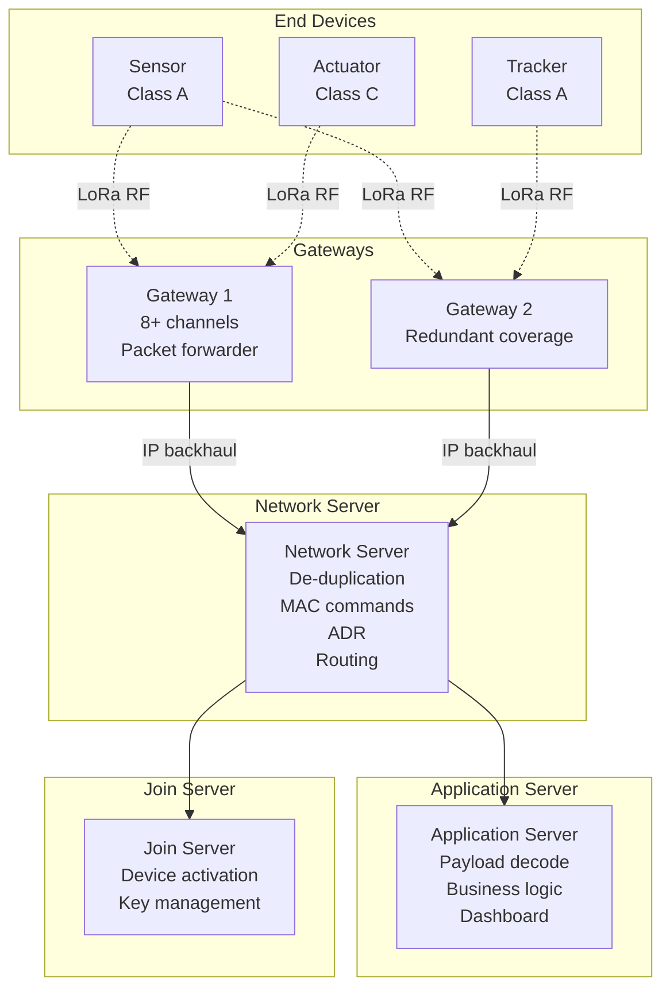
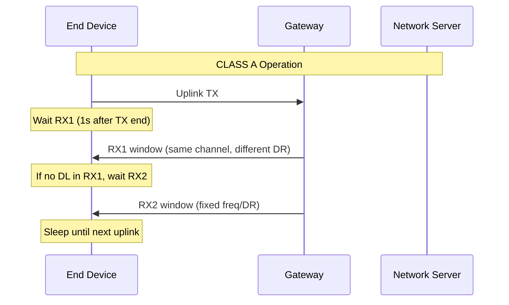

# LoRaWAN — Low Power Wide Area Network

**Topic:** LoRaWAN Protocol — LoRa Modulation, MAC Layer, Class A/B/C, Network Architecture, Security  
**Standards:** LoRaWAN 1.0.4, LoRaWAN 1.1, Regional Parameters RP002-1.0.4  
**SDO:** LoRa Alliance  
**Audience:** IoT network engineers, LPWAN solution architects, embedded firmware developers, smart city planners  
**Prerequisites:** RF basics, ISM band regulations, IoT concepts, basic networking

---

## Chapter 1 — Historical Context & Origin Story

### 1.1 LoRaWAN Timeline

| Year | Event |
|------|-------|
| 2009 | Semtech acquires LoRa modulation patent (Cycleo, France) |
| 2012 | First LoRa transceiver chips (SX1272/SX1276) |
| 2015 | LoRa Alliance founded; LoRaWAN 1.0 specification |
| 2017 | LoRaWAN 1.1 (security improvements, roaming) |
| 2018 | Semtech SX1261/1262 (improved power, global bands) |
| 2020 | LoRaWAN 1.0.4 (reconciled security) |
| 2021 | 170+ operators worldwide; 200M+ devices |
| 2023 | LoRaWAN Relay specification (extend coverage) |
| 2024 | LoRa Edge (GNSS + Wi-Fi sniffing for tracking) |

### 1.2 LPWAN Market Context

| Technology | Spectrum | Coverage | Organization | Status |
|-----------|----------|----------|-------------|--------|
| LoRaWAN | Unlicensed (ISM) | 2-15 km | LoRa Alliance | Dominant LPWAN |
| NB-IoT | Licensed (LTE) | 1-10 km | 3GPP | Operator-deployed |
| LTE-M | Licensed (LTE) | 5-15 km | 3GPP | Operator-deployed |
| Sigfox | Unlicensed | 3-50 km | Sigfox (bankrupt 2022) | Declining |
| Weightless | Unlicensed | 2-10 km | Weightless SIG | Niche |
| DASH7 | Unlicensed | 0.1-2 km | DASH7 Alliance | Niche |

---

## Chapter 2 — Standard Architecture & Structure

### 2.1 LoRaWAN Network Architecture



### 2.2 LoRa vs LoRaWAN

| Layer | Technology | Scope |
|-------|-----------|-------|
| PHY | LoRa (Semtech proprietary) | CSS modulation, chirp spread spectrum |
| MAC | LoRaWAN (LoRa Alliance open spec) | Channel access, security, device classes |
| Network | LoRaWAN Network Server | Routing, de-duplication, ADR |
| Application | User-defined | Business logic |

---

## Chapter 3 — Technical Deep Dive

### 3.1 LoRa Modulation (CSS — Chirp Spread Spectrum)

| Parameter | Description |
|-----------|-------------|
| Modulation type | Chirp Spread Spectrum (CSS) |
| Spreading Factor (SF) | 7-12 (higher = longer range, lower data rate) |
| Bandwidth (BW) | 125/250/500 kHz |
| Coding Rate (CR) | 4/5, 4/6, 4/7, 4/8 (FEC redundancy) |

**Data rate formula:**

$$R_b = SF \times \frac{BW}{2^{SF}} \times CR$$

Example (SF7, BW125, CR4/5):

$$R_b = 7 \times \frac{125000}{128} \times \frac{4}{5} = 5468 \text{ bps}$$

### 3.2 Spreading Factor Trade-offs

| SF | Bit Rate (125 kHz) | Sensitivity | Airtime (11 bytes) | Range |
|----|--------------------|-----------|--------------------|-------|
| 7 | 5,470 bps | -123 dBm | 56 ms | 2-5 km |
| 8 | 3,125 bps | -126 dBm | 103 ms | 3-7 km |
| 9 | 1,760 bps | -129 dBm | 185 ms | 4-9 km |
| 10 | 977 bps | -132 dBm | 371 ms | 5-11 km |
| 11 | 537 bps | -134.5 dBm | 741 ms | 6-13 km |
| 12 | 293 bps | -137 dBm | 1,482 ms | 7-15 km |

**Key property:** Orthogonality — different SFs can coexist on same channel without interference (quasi-orthogonal).

### 3.3 Device Classes

| Class | Downlink | Power | Latency (DL) | Use Case |
|-------|----------|-------|-------------|----------|
| A | After TX only (2 RX windows) | Lowest | Seconds-hours | Sensors, meters |
| B | Scheduled slots (beacon-sync) | Medium | 128s (max) | Periodic actuators |
| C | Continuous RX (always listening) | Highest | ~seconds | Actuators, alerts |



### 3.4 LoRaWAN Security (1.1)

| Key | Purpose | Scope |
|-----|---------|-------|
| AppKey | Root key (device identity) | Provisioned at manufacturing |
| NwkSEncKey | Network session encryption | MAC commands |
| SNwkSIntKey | Serving network integrity | Uplink MIC |
| FNwkSIntKey | Forwarding network integrity | Uplink MIC |
| AppSKey | Application session encryption | Payload encryption |

**Security architecture:** End-to-end encryption (AppSKey) — network server cannot read payload. Network layer integrity (NwkSKey) — prevents frame manipulation.

### 3.5 Adaptive Data Rate (ADR)

| Mechanism | Description |
|-----------|-------------|
| Purpose | Optimize SF and TX power per device |
| Control | Network server analyzes uplink SNR |
| Action | Sends MAC commands to device (LinkADRReq) |
| Result | Devices closer to gateway → lower SF (faster, less airtime) |
| Benefit | 6× capacity improvement vs fixed SF12 for all |

---

## Chapter 4 — Implementation Guide

### 4.1 LoRa Chip Options

| Vendor | Chip | Bands | Features |
|--------|------|-------|----------|
| Semtech | SX1261 | Sub-GHz (global) | Low power, +22 dBm |
| Semtech | SX1262 | Sub-GHz (global) | +22 dBm, TCXO |
| Semtech | SX1276/77/78/79 | Legacy (multi-band) | Proven, widely used |
| Semtech | LR1110/LR1120 | Sub-GHz + GNSS | LoRa Edge (tracking) |
| STMicro | STM32WL | Sub-GHz (SoC) | MCU + LoRa integrated |

### 4.2 Gateway Requirements

| Parameter | Indoor Gateway | Outdoor Gateway |
|-----------|---------------|-----------------|
| Channels | 8 (minimum) | 16-64 |
| Sensitivity | -137 dBm (SF12) | -141 dBm |
| TX power | +14 dBm (EU), +27 dBm (US) | +27-30 dBm |
| Backhaul | Ethernet/Wi-Fi/4G | Ethernet/4G/satellite |
| Antenna | Omnidirectional (indoor) | High-gain omni or sector |
| Coverage | 1-3 km (urban) | 5-15 km (suburban/rural) |
| Cost | $100-500 | $1,000-5,000 |

### 4.3 Network Server Options

| Platform | Type | Features |
|----------|------|----------|
| TTN (The Things Network) | Community (free) | Global coverage, limited downlinks |
| TTI (The Things Industries) | Commercial | Enterprise features, SLA |
| ChirpStack | Open source | Self-hosted, full feature |
| AWS IoT Core for LoRaWAN | Cloud | AWS integration, managed |
| Actility ThingPark | Commercial | Large-scale, roaming |
| Loriot | Commercial | Global, multi-tenant |

### 4.4 Regional Parameters

| Region | Frequency | Channels | TX Power | Duty Cycle |
|--------|-----------|----------|----------|-----------|
| EU868 | 863-870 MHz | 8 (+ additional) | 14 dBm (25 mW) | 1% (0.1% some sub-bands) |
| US915 | 902-928 MHz | 64+8 | 30 dBm (1W) | No duty cycle (FCC dwell time) |
| AU915 | 915-928 MHz | 64+8 | 30 dBm | No duty cycle |
| AS923 | 920-923 MHz | 8+ | 16 dBm | Varies by country |
| IN865 | 865-867 MHz | 3 | 30 dBm | No duty cycle |
| CN470 | 470-510 MHz | 96 | 19.15 dBm | No duty cycle |

---

## Chapter 5 — Certification & Audit

### 5.1 LoRaWAN Certification

| Program | Scope | Required |
|---------|-------|----------|
| LoRaWAN Certified (End Device) | MAC protocol conformance | For "LoRaWAN Certified" label |
| LoRaWAN Certified (Gateway) | Packet forwarder compliance | For gateway products |
| Regional conformance | Frequency plan compliance | Per region |
| RF certification | FCC/ETSI/MIC emissions | Mandatory for sale |

### 5.2 Certification Process

| Step | Activity |
|------|----------|
| 1 | Implement LoRaWAN stack (LoRaMac-node, STM32WL, etc.) |
| 2 | Self-test with LoRaWAN Certification Test Tool (LCTT) |
| 3 | Submit to authorized test house |
| 4 | Test house runs official test suite |
| 5 | LoRa Alliance grants certification |
| 6 | Product listed in LoRa Alliance device catalog |

---

## Chapter 6 — Regional & Domain Variants

| Application | Description | Typical Config |
|-------------|-------------|---------------|
| Smart metering | Gas/water/electric meters | Class A, SF10-12, 1 uplink/hour |
| Agriculture | Soil moisture, weather stations | Class A, SF8-10, 1-4 uplinks/day |
| Smart city | Parking, waste bins, street lights | Class A/C, various SF |
| Supply chain | Container tracking | Class A + GNSS (LoRa Edge) |
| Building automation | Environmental monitoring | Class A, SF7-9, 1/15min |
| Industrial | Predictive maintenance, vibration | Class A, SF7-8, 1/min |
| Utilities | Leak detection, pressure monitoring | Class A, SF10-12, 1/hour |

---

## Chapter 7 — Comparison: LoRaWAN vs NB-IoT vs LTE-M

| Feature | LoRaWAN | NB-IoT | LTE-M (Cat-M1) |
|---------|---------|--------|-----------------|
| Spectrum | Unlicensed (ISM) | Licensed (LTE guard band) | Licensed (LTE in-band) |
| Deployment | Private or public | Operator only | Operator only |
| Range | 2-15 km | 1-10 km | 5-15 km |
| Data rate (UL) | 0.3-50 kbps | 60-160 kbps | 375 kbps - 1 Mbps |
| Data rate (DL) | 0.3-50 kbps | 25-127 kbps | 375 kbps - 1 Mbps |
| Latency | 1-10 seconds | 1-10 seconds | 10-100 ms |
| Battery life | 10+ years (Class A) | 10+ years (PSM) | 5-10 years |
| Device cost | $3-8 (module) | $5-15 (module) | $8-20 (module) |
| Monthly cost | $0 (private) / $1-3 | $0.5-2 (operator plan) | $1-5 (operator plan) |
| Mobility | Limited | Limited | Yes (handover) |
| Voice | No | No | Yes (VoLTE) |
| Firmware OTA | Limited (Class C) | Yes | Yes |
| Private network | Yes (easy) | Difficult (licensed) | Difficult (licensed) |
| QoS guarantee | No (best effort, duty cycle) | Yes (licensed spectrum) | Yes |
| Positioning | RSSI + GNSS (LoRa Edge) | Cell-ID, OTDOA | Cell-ID, GNSS |

---

## Chapter 8 — Mermaid Architecture Diagrams

### 8.1 LoRaWAN Protocol Stack

```mermaid
graph TB
    subgraph "Application"
        APP[Application Payload<br/>Sensor data, commands<br/>Cayenne LPP / Custom]
    end
    
    subgraph "LoRaWAN MAC (L2)"
        MAC[MAC Layer<br/>Class A/B/C<br/>ADR, Duty cycle<br/>Security (AES-128)]
    end
    
    subgraph "LoRa PHY (L1)"
        PHY[LoRa Modulation<br/>CSS, SF7-12<br/>BW 125/250/500 kHz]
    end
    
    subgraph "Regional"
        REG[Regional Parameters<br/>EU868, US915, AS923<br/>Channel plans, power limits]
    end
    
    APP --> MAC --> PHY
    REG --> PHY
    REG --> MAC
```

### 8.2 LoRaWAN Security (v1.1)

```mermaid
graph TB
    subgraph "Device"
        D[End Device<br/>AppKey (root)]
    end
    
    subgraph "Join Server"
        JS[Join Server<br/>AppKey copy<br/>Derives session keys]
    end
    
    subgraph "Network Server"
        NS[Network Server<br/>NwkSEncKey<br/>SNwkSIntKey<br/>FNwkSIntKey]
    end
    
    subgraph "Application Server"
        AS[Application Server<br/>AppSKey]
    end
    
    D -->|JoinRequest (AppKey)| JS
    JS -->|JoinAccept + Keys| D
    JS -->|NwkS keys| NS
    JS -->|AppSKey| AS
    
    D -->|Encrypted payload (AppSKey)| AS
    D -->|MAC integrity (NwkSKey)| NS
```

---

## Chapter 9 — Case Studies & Failure Analysis

### 9.1 City-Wide Smart Water Metering

**Deployment:** City with 500,000 water meters, LoRaWAN network.

**Design:** (1) 50 outdoor gateways (macro coverage, tower-mounted). (2) Meters transmit once per hour (daily consumption reading). (3) SF distribution: 30% SF7-8 (close), 40% SF9-10 (medium), 30% SF11-12 (far). (4) Battery life target: 10 years (lithium primary battery).

**Challenges solved:** (1) Deep indoor penetration (meters in basements): Use SF12 (+14 dB link budget vs SF7). (2) Duty cycle (EU 1%): One transmission per hour = well within limits. (3) Network capacity: 50 gateways × 8 channels × SF diversity = sufficient for 500K devices at 1/hour. (4) Confirmed vs unconfirmed: Use unconfirmed uplinks (save battery). Server-side: if 3 consecutive messages lost → alert.

### 9.2 Duty Cycle Limitation (EU868)

**Problem:** EU regulations require 1% duty cycle in most sub-bands (0.1% in some). SF12 transmission of 51 bytes takes ~2.5 seconds. At 1% duty cycle: only 1 message per ~4 minutes.

**Impact:** Applications needing frequent updates (every 10 seconds) are not possible on EU868 with SF12.

**Mitigation:** (1) ADR: Move devices to lower SF when possible (SF7: 56ms → 1 message every 5.6s). (2) Use multiple sub-bands (aggregate duty cycle). (3) Design application for infrequent updates. (4) US915/AU915: No duty cycle limit (FCC allows dwell time limitation instead).

---

## Chapter 10 — Future Evolution & Industry Trends

| Development | Timeline | Description |
|------------|----------|-------------|
| LoRaWAN Relay | 2024 | Extend coverage without gateways (device-to-device relay) |
| LoRa 2.4 GHz | Available | ISM 2.4 GHz worldwide (no regional variants) |
| LoRa Edge (LR1120) | 2024 | Multi-constellation GNSS scanning |
| FUOTA (Firmware Update OTA) | Mature | Multicast firmware updates |
| Roaming | Growing | Inter-operator roaming agreements |
| Satellite LoRa | 2024+ | LEO satellite LoRaWAN (Lacuna Space, EchoStar) |
| Integration with 5G | Future | Private 5G + LoRaWAN hybrid deployments |
| AI at edge | 2024+ | Anomaly detection on gateway |

---

## Chapter 11 — Interview Questions & Career Guide

### Tier 1: Entry-Level

**Q1:** What is the difference between LoRa and LoRaWAN?  
**A:** **LoRa** = Physical layer modulation technique (Chirp Spread Spectrum). Proprietary to Semtech. Defines how bits become RF signals. Deals with: spreading factor, bandwidth, coding rate, frequency. **LoRaWAN** = MAC layer protocol (open specification by LoRa Alliance). Defines: device classes (A/B/C), security (AES-128 encryption), channel access rules, ADR, network architecture (devices → gateways → network server). **Analogy:** LoRa is like the Wi-Fi PHY (OFDM), LoRaWAN is like the Wi-Fi MAC (CSMA/CA, frame format). You can use LoRa without LoRaWAN (proprietary point-to-point links), but LoRaWAN always uses LoRa.

### Tier 2: Mid-Level

**Q2:** Explain Adaptive Data Rate (ADR) and its impact on network capacity.  
**A:** **ADR** is a network server mechanism that optimizes each device's spreading factor (SF) and TX power based on received signal quality. **How it works:** (1) Network server collects SNR from recent uplinks (typically last 20). (2) Calculates required SNR margin for reliable communication. (3) If SNR is much better than required → commands device to lower SF (faster) and/or reduce TX power. (4) If SNR is marginal → higher SF or more power. **Impact on capacity:** Without ADR: all devices use SF12 (maximum range, "safe" default). With ADR: nearby devices use SF7 (56ms airtime vs 1482ms for SF12). That's 26× less airtime → 26× more capacity from those devices. Since different SFs are quasi-orthogonal, they don't interfere with each other. Net result: **5-10× capacity improvement** for typical networks. **Trade-off:** ADR works best for static devices. Mobile devices should not use ADR (channel conditions change faster than ADR adapts).

### Tier 3: Senior

**Q3:** Design a nationwide LoRaWAN network for agricultural IoT (1M devices, 50 countries).  
**A:** **Architecture:** (1) **Regional parameters:** Each country needs correct frequency plan (EU868 for Europe, US915 for Americas, AS923 for Asia, etc.). Devices must be multi-band capable or region-specific SKUs. (2) **Deployment model:** Hybrid: public operator networks where available (Actility, TTI, Helium) + private gateways in remote agricultural areas. Roaming agreements between operators (LoRa Alliance roaming spec). (3) **Gateway infrastructure:** Rural coverage: high-tower gateways (50m+) with high-gain antennas → 10-15 km coverage. Satellite backhaul for remote areas without cellular. Solar-powered gateways for off-grid locations. (4) **Device design:** Agricultural sensors (soil moisture, weather, livestock): ultra-low power (10+ year battery). SF12 likely needed (rural, long range). Uplink every 15-60 minutes. Robust enclosure (IP67, -40 to +85°C). (5) **Network management:** Cloud-based multi-tenant network server. Per-country compliance (duty cycle EU, dwell time US). ADR enabled for devices with stable positions. FUOTA for firmware updates (multicast, Class B/C temporarily). (6) **Scale:** 1M devices × 4 uplinks/day = 4M messages/day. Distributed across 50 countries. ~20K devices per country average. Each gateway handles ~10K devices → 2 gateways per farm cluster minimum. (7) **Security:** LoRaWAN 1.1 (separate network and application keys). Join Server centralized (device identity management). AppSKey per device (end-to-end encrypted payloads).

---

## Chapter 12 — Cheat Sheet & Quick Reference

### LoRaWAN Key Facts

```
Modulation:   LoRa CSS (Chirp Spread Spectrum)
Band:         Sub-GHz ISM (EU868, US915, AS923, AU915, etc.)
Range:        2-15 km (urban-rural)
Data rate:    0.3-50 kbps (SF-dependent)
Battery:      10+ years (Class A, hourly TX)
Security:     AES-128 (network + application encryption)
Topology:     Star-of-stars (device → gateway → server)
Classes:      A (lowest power), B (scheduled DL), C (always-on DL)
Gateway:      8+ channels, IP backhaul
Certification: LoRa Alliance (LoRaWAN Certified)
```

### Spreading Factor Table

```
SF7:  5470 bps, -123 dBm, shortest range, least airtime
SF8:  3125 bps, -126 dBm
SF9:  1760 bps, -129 dBm
SF10:  977 bps, -132 dBm
SF11:  537 bps, -134.5 dBm
SF12:  293 bps, -137 dBm, longest range, most airtime
```

### Quick Selection: LoRaWAN vs NB-IoT

```
LoRaWAN when: Private network, no operator dependency, rural, lowest cost
NB-IoT when: Operator coverage exists, QoS needed, higher data rate, firmware OTA critical
```

---

*End of Document — 08_LoRaWAN_LPWAN.md*
