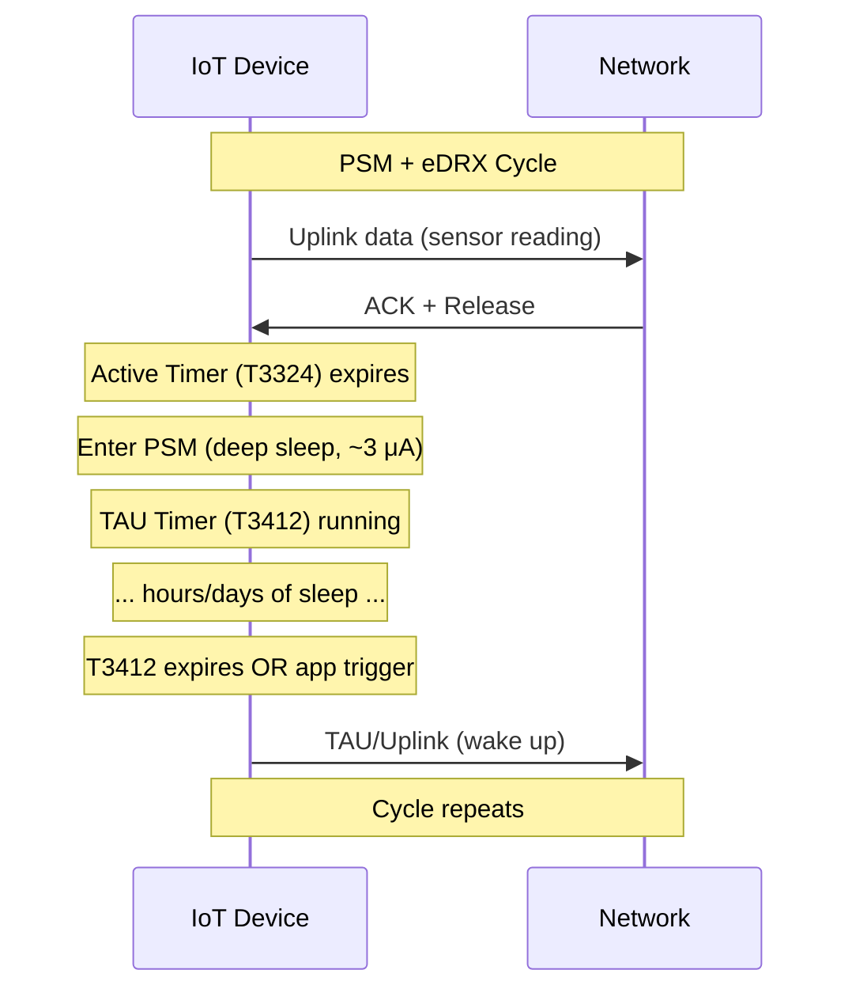

# NB-IoT & eMTC (Cat-M) — Cellular LPWAN

**Topic:** 3GPP Cellular IoT — NB-IoT (Cat-NB1/NB2), LTE-M (Cat-M1/M2), RedCap (NR-Light)  
**Standards:** 3GPP TS 36.211/321 (Rel-13/14), TS 38.300 (Rel-17 RedCap)  
**SDO:** 3GPP (RAN WG, SA WG)  
**Audience:** Cellular IoT engineers, LPWAN solution architects, modem firmware developers, MNO IoT teams  
**Prerequisites:** LTE fundamentals (OFDMA, resource blocks), basic 3GPP terminology, IoT concepts

---

## Chapter 1 — Historical Context & Origin Story

### 1.1 Cellular IoT Evolution

| Release | Year | Technology | Peak Rate | Key Feature |
|---------|------|-----------|-----------|-------------|
| Rel-12 | 2015 | Cat-0 | 1 Mbps DL/UL | Reduced complexity LTE |
| Rel-13 | 2016 | Cat-M1 (eMTC) | 1 Mbps | Half-duplex, PSM, eDRX |
| Rel-13 | 2016 | Cat-NB1 (NB-IoT) | 26 kbps DL, 62 kbps UL | 180 kHz BW, deep coverage |
| Rel-14 | 2017 | Cat-M2, Cat-NB2 | 4 Mbps / 127 kbps | Multicarrier, positioning |
| Rel-15 | 2018 | NB-IoT/eMTC enhancements | Improved | Wake-up signal, TDD |
| Rel-16 | 2020 | Further enhancements | — | Mobility, multicast |
| Rel-17 | 2022 | RedCap (NR-Light) | 150 Mbps DL | 5G IoT mid-tier |
| Rel-18 | 2024 | eRedCap | 10 Mbps DL | Further reduced complexity |

### 1.2 Market Drivers

| Driver | NB-IoT Use Case | LTE-M Use Case |
|--------|----------------|----------------|
| Ultra-low cost | Smart meters, sensors | Asset trackers |
| Deep coverage | Basement meters, underground | Remote monitoring |
| 10-year battery | Water meters, soil sensors | Wearables |
| Massive scale | Smart city (millions/cell) | Fleet management |
| Mobility | — (stationary) | Vehicle tracking, logistics |
| Voice | — | Personal safety (VoLTE) |

---

## Chapter 2 — Standard Architecture & Structure

### 2.1 NB-IoT vs LTE-M Comparison

| Parameter | NB-IoT (Cat-NB1/NB2) | LTE-M (Cat-M1/M2) |
|-----------|----------------------|---------------------|
| Bandwidth | 180 kHz (single PRB) | 1.4 MHz (6 PRBs) |
| DL peak rate | 26 kbps (NB1) / 127 kbps (NB2) | 1 Mbps (M1) / 4 Mbps (M2) |
| UL peak rate | 62 kbps (NB1) / 159 kbps (NB2) | 1 Mbps (M1) / 7 Mbps (M2) |
| Deployment mode | In-band, Guard-band, Standalone | In-band LTE |
| Duplex | Half-duplex (HD-FDD) | Half-duplex or Full-duplex |
| Mobility | Limited (cell reselection) | Full mobility (handover) |
| VoLTE | No | Yes |
| TX power | 14/20/23 dBm | 20/23 dBm |
| Coverage enhancement | +20 dB (MCL 164 dB) | +15 dB (MCL 156 dB) |
| Power saving | PSM + eDRX | PSM + eDRX + C-DRX |
| Positioning | OTDOA (Rel-14) | OTDOA + GNSS |

### 2.2 NB-IoT Deployment Modes

```mermaid
graph LR
    subgraph "In-Band"
        A[Within LTE carrier<br/>Uses 1 PRB (180 kHz)<br/>Inside LTE bandwidth]
    end
    
    subgraph "Guard-Band"
        B[In LTE guard band<br/>Uses unused edge PRBs<br/>No impact on LTE]
    end
    
    subgraph "Standalone"
        C[Independent carrier<br/>Re-farmed GSM channel<br/>200 kHz bandwidth]
    end
```

---

## Chapter 3 — Technical Deep Dive

### 3.1 NB-IoT Physical Layer

| Channel | Direction | Function |
|---------|-----------|----------|
| NPBCH | DL | Broadcast system information (MIB-NB) |
| NPDCCH | DL | Downlink control (scheduling) |
| NPDSCH | DL | Downlink shared data |
| NPSS/NSSS | DL | Synchronization signals |
| NPRACH | UL | Random access (preamble) |
| NPUSCH | UL | Uplink shared data |

**Key NB-IoT PHY characteristics:**
- Single subcarrier (15 kHz) or multi-tone (3.75/15 kHz) UL
- Repetitions (up to 2048) for coverage enhancement
- Single HARQ process (simplified)

### 3.2 Coverage Enhancement (Repetitions)

| Coverage Level | Repetitions | MCL | Use Case |
|---------------|-------------|-----|----------|
| Normal (CE Level 0) | 1-2 | 144 dB | Outdoor, good signal |
| Enhanced (CE Level 1) | 4-32 | 154 dB | Indoor, moderate |
| Deep (CE Level 2) | 64-2048 | 164 dB | Deep indoor, basement |

**MCL (Maximum Coupling Loss):** Path loss budget between device and base station.

$$MCL = P_{TX} + G_{antenna} - P_{sensitivity} - NF - Margin$$

NB-IoT: 164 dB MCL vs GSM 144 dB → 20 dB improvement → ~10× better penetration.

### 3.3 Power Saving Mechanisms

| Feature | Mechanism | Battery Impact |
|---------|-----------|---------------|
| PSM (Power Saving Mode) | Device enters deep sleep after TX, unreachable | ~3 μA sleep current |
| eDRX (Extended DRX) | Extended paging cycle (up to 2.9 hours NB-IoT) | Reachable periodically |
| C-DRX (Connected DRX) | DRX in connected state | Saves during active session |
| Release Assistance | Device requests immediate RRC release after TX | Faster transition to sleep |
| Early Data Transmission | Send data in RRC connection setup (Rel-15) | Skip full connection establishment |



### 3.4 Battery Life Estimation

| Scenario | NB-IoT | LTE-M |
|----------|--------|-------|
| 1 uplink/day, PSM | 10-15 years | 8-12 years |
| 1 uplink/hour, PSM | 5-8 years | 4-6 years |
| 1 uplink/10min, eDRX | 2-4 years | 2-3 years |
| Continuous tracking (no PSM) | Months | Months |

**Battery:** Typical 3.6V lithium primary (ER34615: 19 Ah) or 3.0V coin cell (CR123A: 1.5 Ah).

### 3.5 RedCap (Reduced Capability — Rel-17)

| Parameter | NR (full) | RedCap (Rel-17) | eRedCap (Rel-18) |
|-----------|-----------|-----------------|-------------------|
| Bandwidth | 100 MHz (FR1) | 20 MHz (FR1) | 5 MHz (FR1) |
| MIMO | 4×4 | 1×1 or 2×2 | 1×1 |
| DL peak | ~4.7 Gbps | ~150 Mbps | ~10 Mbps |
| Duplex | Full | Half or Full | Half |
| Target | Smartphone | Wearables, cameras, sensors | IoT sensors |
| Modem complexity | High | 60-65% reduction | Further reduction |
| Battery target | — | Days-weeks | Months-years |

---

## Chapter 4 — Implementation Guide

### 4.1 NB-IoT/LTE-M Module Options

| Vendor | Module | Technology | Data Rate | Features |
|--------|--------|-----------|-----------|----------|
| Quectel | BC66 | NB-IoT | 32 kbps | Ultra-low power, global |
| Quectel | BG95 | NB-IoT + Cat-M + GNSS | Cat-M 1 Mbps | Multi-mode |
| u-blox | SARA-R410M | NB-IoT + Cat-M | 1 Mbps | Automotive grade |
| u-blox | SARA-R5 | NB-IoT + Cat-M (Rel-14) | Cat-M2 4 Mbps | 5G-ready |
| Nordic | nRF9160 | NB-IoT + Cat-M (SiP) | 1 Mbps | Integrated modem + MCU |
| Nordic | nRF9161 | NB-IoT + Cat-M | 1 Mbps | Updated, lower power |
| Telit | ME310G1 | NB-IoT | 127 kbps | Tiny, low cost |
| Sierra | HL7812 | Cat-M | 10 Mbps (Cat-M2) | Carrier certified |

### 4.2 AT Command Interface (Typical)

| Command | Function |
|---------|----------|
| AT+CFUN=1 | Full functionality mode |
| AT+CGDCONT=1,"IP","apn" | Set APN |
| AT+COPS=1,2,"operator" | Manual network selection |
| AT+CPSMS=1,,,"TAU","Active" | Configure PSM timers |
| AT+CEDRXS=1,5,"value" | Configure eDRX |
| AT+CSCON? | Connection status |
| AT+CGSN | IMEI query |

### 4.3 Protocol Stack for IoT Applications

| Layer | Options | Recommended |
|-------|---------|-------------|
| Application | Custom, LwM2M, MQTT-SN | LwM2M (device management) |
| Transport | UDP, TCP, CoAP, MQTT | CoAP over UDP (NB-IoT), MQTT (LTE-M) |
| Security | DTLS 1.2, TLS 1.2/1.3 | DTLS for CoAP, TLS for MQTT |
| Bearer | NB-IoT / LTE-M | Based on use case |

---

## Chapter 5 — Certification & Audit

### 5.1 Certification Requirements

| Certification | Body | Purpose |
|--------------|------|---------|
| 3GPP conformance | Accredited lab (PTCRB) | Protocol compliance |
| Carrier certification | Each MNO (AT&T, Verizon, etc.) | Network compatibility |
| PTCRB | CTIA/PTCRB | North America device certification |
| GCF | GCF | Global certification (EU, Asia) |
| RF/SAR | FCC/CE | Regulatory emissions |

### 5.2 Carrier Certification Process

| Step | Activity | Duration |
|------|----------|----------|
| 1 | Module vendor certifies module (PTCRB/GCF) | 3-6 months |
| 2 | Device manufacturer integrates module | 1-3 months |
| 3 | Carrier lab testing (AT&T, Verizon, etc.) | 4-8 weeks |
| 4 | Field trials (if required) | 2-4 weeks |
| 5 | Carrier approves device for their network | — |

**Note:** Using pre-certified modules (Quectel, u-blox) dramatically reduces end-device certification effort.

---

## Chapter 6 — Regional & Domain Variants

### 6.1 Operator Deployments

| Region | NB-IoT | LTE-M | Notes |
|--------|--------|-------|-------|
| Europe | Vodafone, T-Mobile, Orange | T-Mobile, KPN | Strong NB-IoT |
| US | T-Mobile, AT&T | AT&T, Verizon, T-Mobile | Strong LTE-M |
| China | China Mobile, China Telecom, China Unicom | Limited | Largest NB-IoT deployment globally |
| Japan | SoftBank, KDDI, NTT Docomo | All three | Both technologies |
| Korea | SK Telecom, KT, LG U+ | All three | Early adopters |
| India | Jio, Airtel (trials) | Jio, Airtel | Growing |
| Australia | Telstra | Telstra | Both technologies |

### 6.2 Band Allocation

| Band | Frequency | Technology | Region |
|------|-----------|-----------|--------|
| Band 8 | 900 MHz | NB-IoT | EU, APAC |
| Band 20 | 800 MHz | NB-IoT | EU |
| Band 28 | 700 MHz | NB-IoT / LTE-M | APAC, EU |
| Band 3 | 1800 MHz | NB-IoT / LTE-M | Global |
| Band 12/13 | 700 MHz | LTE-M / NB-IoT | US (AT&T/Verizon) |
| Band 4/66 | 1700/2100 MHz | LTE-M | US (T-Mobile) |
| Band 5 | 850 MHz | NB-IoT | China, US |

---

## Chapter 7 — Comparison: Cellular IoT Categories

| Feature | Cat-1 | Cat-M1 | Cat-NB1 | RedCap | Cat-4 (ref) |
|---------|-------|--------|---------|--------|-------------|
| DL rate | 10 Mbps | 1 Mbps | 26 kbps | 150 Mbps | 150 Mbps |
| UL rate | 5 Mbps | 1 Mbps | 62 kbps | 50 Mbps | 50 Mbps |
| Bandwidth | 20 MHz | 1.4 MHz | 180 kHz | 20 MHz | 20 MHz |
| Duplex | Full | Half/Full | Half | Half/Full | Full |
| Antenna | 2 RX | 1 RX | 1 RX | 1-2 RX | 2 RX |
| Mobility | Full | Full | Limited | Full | Full |
| VoLTE | Yes | Yes | No | Yes | Yes |
| PSM/eDRX | No | Yes | Yes | Yes | No |
| Module cost | $10-20 | $8-15 | $5-10 | $15-25 | $20-40 |
| Battery | Days | Years | 10+ years | Weeks-months | Hours |
| Use case | Video, gateway | Tracker, wearable | Meter, sensor | Camera, wearable | Router, CPE |

---

## Chapter 8 — Mermaid Architecture Diagrams

### 8.1 Cellular IoT Network Architecture

```mermaid
graph TB
    subgraph "IoT Devices"
        D1[NB-IoT Device<br/>Smart meter]
        D2[LTE-M Device<br/>Asset tracker]
        D3[RedCap Device<br/>Industrial camera]
    end
    
    subgraph "RAN"
        ENB[eNB / gNB<br/>Base station<br/>NB-IoT + LTE-M + NR]
    end
    
    subgraph "Core (EPC / 5GC)"
        MME[MME/AMF<br/>Mobility management]
        SGW[S-GW/UPF<br/>User plane]
        SCEF[SCEF/NEF<br/>IoT exposure<br/>(Non-IP data)]
    end
    
    subgraph "IoT Platform"
        IOT[IoT Platform<br/>Device management<br/>Data ingestion<br/>LwM2M server]
    end
    
    D1 -.->|NB-IoT| ENB
    D2 -.->|LTE-M| ENB
    D3 -.->|NR RedCap| ENB
    ENB --> MME
    ENB --> SGW
    MME --> SCEF
    SGW --> IOT
    SCEF --> IOT
```

### 8.2 Power Saving Mode Timeline

```mermaid
gantt
    title NB-IoT Device Power States
    dateFormat X
    axisFormat %s
    
    section Power State
    TX (uplink data)          :active, 0, 2
    RX (DL window)            :active, 2, 3
    Active Timer (T3324)      :crit, 3, 13
    eDRX Paging               :13, 14
    PSM (deep sleep ~3μA)     :done, 14, 100
    Wake (TAU or app trigger) :active, 100, 102
```



---

## Chapter 9 — Case Studies & Failure Analysis

### 9.1 Smart Meter Deployment (China — 300M NB-IoT Connections)

**Scale:** China Mobile deployed 300M+ NB-IoT connections by 2023, primarily smart meters (gas, water, electricity).

**Architecture:** (1) NB-IoT Band 5/8 deployment on existing LTE towers. (2) In-band mode (reusing LTE spectrum). (3) Deep coverage mode (CE Level 2) for basement meters. (4) PSM with daily reporting. (5) 10-year battery target (lithium primary cells).

**Challenges:** (1) Initial firmware issues (PSM timer not honored by some networks). (2) Coverage holes in rural areas (solved with more base stations). (3) CoAP/LwM2M payload optimization needed (every byte costs airtime at SF-equivalent repetitions).

### 9.2 LTE-M for Asset Tracking (Global)

**Use case:** Container tracking across 100+ countries.

**Challenge:** (1) Roaming: NB-IoT roaming not widely supported (limited by some operators). LTE-M roaming more available but still gaps. (2) Solution: Multi-mode modules (NB-IoT + LTE-M + 2G fallback). (3) Band support: Need multi-band module (B3/B8/B20/B28 for global coverage). (4) Power: GPS fix consumes significant power. Solution: GNSS + Wi-Fi sniffing for position (less power than full GPS lock).

---

## Chapter 10 — Future Evolution & Industry Trends

| Trend | Timeline | Description |
|-------|----------|-------------|
| NB-IoT/LTE-M in 5G Core | Rel-16+ | Connected to 5GC (not just EPC) |
| RedCap deployment | 2024-2025 | Mid-tier 5G IoT devices |
| eRedCap (Rel-18) | 2025-2026 | Further reduced NR for sensors |
| Ambient IoT (Rel-19) | 2025-2027 | Zero-energy backscatter devices |
| NTN for IoT | Rel-17+ | Satellite NB-IoT/LTE-M |
| 2G/3G sunset | 2025-2030 | NB-IoT/LTE-M replace legacy IoT |
| DECT-2020 NR | 2024+ | Unlicensed alternative (ETSI) |
| Private networks | Growing | Enterprise NB-IoT/LTE-M on CBRS |

---

## Chapter 11 — Interview Questions & Career Guide

### Tier 1: Entry-Level

**Q1:** What is the difference between NB-IoT and LTE-M?  
**A:** Both are 3GPP cellular IoT technologies, but optimized differently: **NB-IoT:** (1) Ultra-narrow bandwidth (180 kHz = 1 PRB). (2) Very low data rate (26-127 kbps). (3) Deepest coverage (+20 dB over GSM). (4) No mobility (cell reselection only, no handover). (5) No voice. (6) Cheapest modules (~$3-5). (7) Best for: static sensors, meters, basement devices. **LTE-M:** (1) Wider bandwidth (1.4 MHz = 6 PRBs). (2) Higher data rate (1-4 Mbps). (3) Good coverage (+15 dB). (4) Full mobility (handover between cells). (5) Supports VoLTE. (6) Moderate cost modules (~$8-15). (7) Best for: trackers, wearables, anything mobile or needing voice. **Common:** Both support PSM + eDRX (long battery life), both are licensed spectrum (guaranteed QoS), both part of 3GPP standards.

### Tier 2: Mid-Level

**Q2:** Explain PSM and eDRX, and how they achieve multi-year battery life.  
**A:** **PSM (Power Saving Mode):** (1) After data transmission, device starts Active Timer (T3324, configurable: 2s-186min). (2) During Active Timer: device is reachable (for DL messages). (3) After Active Timer expires → device enters PSM (essentially powered off from radio perspective). (4) In PSM: ~3 μA current (vs ~50 mA during TX). Device is unreachable. (5) Device wakes when: (a) application trigger (sensor event), or (b) TAU Timer (T3412) expires (must re-register, configurable: 10min-413 days). **eDRX (Extended DRX):** (1) Extends the paging cycle (when network can reach device). (2) NB-IoT eDRX: up to 2.9 hours between paging occasions. (3) LTE-M eDRX: up to 43 minutes. (4) Device wakes briefly at each paging occasion to check for DL. (5) Between paging occasions: deep sleep. **Combined:** PSM for maximum battery savings (unreachable). eDRX when downlink reachability needed but infrequent. **Battery math:** 19 Ah battery, 3 μA PSM, 50 mA TX for 2s/day → average ~5 μA → ~430,000 hours → 49 years (theoretical). Real-world: 10-15 years (leakage, aging, retransmissions).

### Tier 3: Senior

**Q3:** Design a multi-mode IoT device supporting NB-IoT, LTE-M, and LoRaWAN for global deployment.  
**A:** **Architecture:** (1) **Hardware:** Multi-mode cellular module (Nordic nRF9160: NB-IoT + LTE-M, global bands). Plus: LoRa transceiver (Semtech SX1262) on separate SPI. Application MCU (nRF52840 or similar) coordinating both radios. GNSS receiver for positioning. (2) **RAT selection logic:** Priority: LTE-M (best for mobility + data rate) → NB-IoT (better coverage) → LoRaWAN (no cellular coverage). Fallback criteria: RSRP < -120 dBm and consecutive failures > 3 → try next RAT. GPS fix failure → use cell-ID or Wi-Fi fingerprinting. (3) **Power management:** Primary mode: PSM (cellular) or Class A (LoRaWAN). Wake on: sensor event, timer, or eDRX paging. When LoRaWAN active: cellular modem completely powered off. GNSS duty-cycled (fix every N hours, not continuous). (4) **Protocol:** CoAP + DTLS for NB-IoT (small payload, low overhead). MQTT + TLS for LTE-M (when connected longer). LoRaWAN native MAC for LoRa mode. LwM2M for device management (common across all bearers). (5) **Global considerations:** Multi-band cellular (B3/B5/B8/B12/B13/B20/B28). LoRa Regional Parameters: store multiple configs, select by GPS country. SIM: eSIM (eUICC) for multi-operator roaming. Regulatory: FCC + CE + MIC pre-certified modules. (6) **Deployment cost:** Module BOM: ~$20-30. Cellular: $1-3/month/device (operator plan). LoRa: $0 (private gateway) or $1/month (public network). Strategy: Use LoRa for routine data, cellular for critical alerts or firmware OTA.

---

## Chapter 12 — Cheat Sheet & Quick Reference

### NB-IoT vs LTE-M Decision

```
NB-IoT: Static, tiny data (<200 bytes), deepest coverage, cheapest
LTE-M:  Mobile, larger data, voice needed, faster response
Both:   PSM/eDRX for battery, licensed spectrum (QoS guaranteed)
```

### Key Parameters

```
NB-IoT:
  Bandwidth:  180 kHz (1 PRB)
  DL rate:    26-127 kbps
  Coverage:   MCL 164 dB (+20 dB vs GSM)
  Battery:    10-15 years (PSM)
  Bands:      B8 (EU), B20 (EU), B5 (China), B12/13 (US)

LTE-M:
  Bandwidth:  1.4 MHz (6 PRBs)
  DL rate:    1-4 Mbps
  Coverage:   MCL 156 dB (+15 dB vs GSM)
  Battery:    5-12 years (PSM)
  Mobility:   Full handover
  Voice:      VoLTE supported
  Bands:      B4/12/13 (US), B3/8/20/28 (EU/APAC)

RedCap (5G IoT):
  Bandwidth:  20 MHz
  DL rate:    150 Mbps
  Target:     Wearables, cameras, industrial sensors
  When:       Need more than Cat-M but less than full 5G
```

### Power Saving Quick Reference

```
PSM:     Device sleeps (unreachable), ~3 μA, wakes on app/timer
eDRX:    Extended paging cycle (reachable periodically)
         NB-IoT: up to 2.9 hours
         LTE-M: up to 43 minutes
RAI:     Release Assistance Indicator (fast transition to idle)
EDT:     Early Data Transmission (send in connection setup)
```

---

*End of Document — 09_NB_IoT_eMTC_Cat_M.md*
