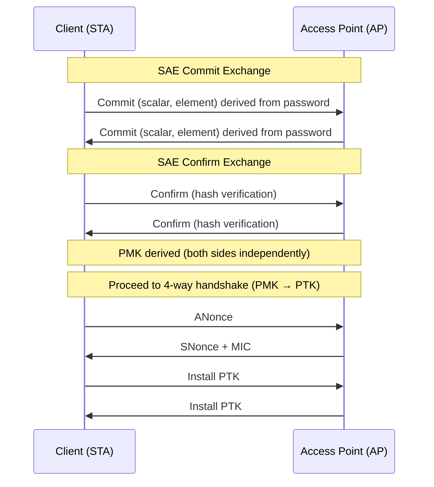

# Wi-Fi Security — WPA3 & Beyond

**Topic:** Wi-Fi Security Evolution — WPA3-Personal (SAE), WPA3-Enterprise (192-bit), PMF, OWE, Wi-Fi Enhanced Open  
**Standards:** IEEE 802.11i (WPA2), IEEE 802.11w (PMF), WPA3 (Wi-Fi Alliance 2018), SAE (RFC 7664)  
**SDO:** Wi-Fi Alliance, IEEE 802.11 Working Group  
**Audience:** Network security engineers, Wi-Fi architects, penetration testers, enterprise IT security teams  
**Prerequisites:** 802.11 fundamentals, cryptography basics (AES, ECC), authentication protocols (EAP, RADIUS)

---

## Chapter 1 — Historical Context & Origin Story

### 1.1 Wi-Fi Security Timeline

| Year | Standard | Security | Key Weakness |
|------|----------|----------|-------------|
| 1997 | 802.11 (original) | WEP (RC4, 40/104-bit) | Trivially broken (IV reuse) |
| 2003 | WPA (interim fix) | TKIP (RC4 + MIC) | Still RC4-based |
| 2004 | WPA2 (802.11i) | CCMP (AES-128) | 4-way handshake vulnerable to KRACK |
| 2009 | 802.11w | PMF (Protected Management Frames) | Optional (not enforced) |
| 2018 | WPA3 | SAE + mandatory PMF | Initial Dragonblood vulnerabilities |
| 2019 | Wi-Fi Enhanced Open | OWE (Opportunistic Wireless Encryption) | No authentication |
| 2020 | WPA3-Enterprise 192-bit | CNSA suite (AES-256-GCM) | Complex deployment |
| 2024 | Wi-Fi 7 security | WPA3 mandatory + SAE-PK | Side-channel mitigations |

### 1.2 Key Vulnerabilities That Drove WPA3

| Attack | Year | Target | Impact |
|--------|------|--------|--------|
| WEP cracking (FMS, PTW) | 2001-2007 | WEP | Complete key recovery in minutes |
| TKIP Michael attack | 2008 | WPA (TKIP) | Message forgery |
| Hole196 | 2010 | WPA2 GTK | Insider broadcast injection |
| KRACK (Key Reinstallation) | 2017 | WPA2 4-way handshake | Nonce reuse, traffic decryption |
| PMKID attack | 2018 | WPA2-PSK | Offline dictionary attack without client |
| DragonBlood | 2019 | WPA3-SAE (implementation) | Side-channel, partition attacks |

---

## Chapter 2 — Standard Architecture & Structure

### 2.1 WPA3 Modes

| Mode | Authentication | Encryption | Use Case |
|------|---------------|-----------|----------|
| WPA3-Personal | SAE (Simultaneous Authentication of Equals) | AES-CCMP-128 or AES-GCMP-256 | Home, small office |
| WPA3-Enterprise | EAP + 802.1X | AES-CCMP-128 (minimum) | Corporate |
| WPA3-Enterprise 192-bit | EAP-TLS + CNSA suite | AES-256-GCM | Government, high-security |
| Wi-Fi Enhanced Open (OWE) | None (opportunistic) | AES-CCMP-128 | Public hotspots |
| WPA3 Transition Mode | SAE + WPA2-PSK simultaneous | AES-CCMP | Migration period |

### 2.2 SAE (Simultaneous Authentication of Equals)



**SAE properties:**
- Based on Dragonfly key exchange (RFC 7664)
- Zero-knowledge proof: password never sent over air
- Forward secrecy: each session has unique PMK
- Resistant to offline dictionary attacks
- Uses ECC (Elliptic Curve Cryptography) or FFC (Finite Field Cryptography)

---

## Chapter 3 — Technical Deep Dive

### 3.1 SAE Dragonfly Protocol Details

| Step | Operation | Purpose |
|------|-----------|---------|
| Password to Element | H2E (Hash-to-Element) or H2C (Hash-to-Curve) | Convert password to ECC point |
| Commit | Exchange scalar + element (ECC point) | Prove knowledge of password |
| Confirm | Exchange confirm values (hash of shared secret) | Verify both sides derived same PMK |
| PMK derivation | KDF(shared_key, context) | Derive Per-Message Key |

**Hash-to-Element (H2E):** Replaces hunting-and-pecking (H2C) to eliminate timing side-channel. Mandatory in WPA3 implementations since 2020 update.

$$P = H2E(password, SSID) = \text{SSWU}(H(password || SSID || counter))$$

### 3.2 Protected Management Frames (PMF — 802.11w)

| Frame Type | WPA2 (without PMF) | WPA3 (mandatory PMF) |
|-----------|--------------------|-----------------------|
| Deauthentication | Unprotected (spoofable) | Protected (BIP-CMAC-128) |
| Disassociation | Unprotected | Protected |
| Action frames | Unprotected | Protected |
| Beacon/Probe | Unprotected | Partially (RSNXE) |

**Impact:** Without PMF → deauthentication attacks trivial (force disconnect, capture handshake). With PMF → management frames authenticated, deauth attacks blocked.

### 3.3 WPA3-Enterprise 192-bit (CNSA Suite)

| Component | Algorithm | Key Size |
|-----------|-----------|----------|
| Key Exchange | ECDH (P-384) | 384-bit |
| Authentication | EAP-TLS (TLS 1.2+ mandatory) | Certificate-based |
| Data Encryption | AES-256-GCM (GCMP-256) | 256-bit |
| Integrity | BIP-GMAC-256 | 256-bit |
| Hash | SHA-384 | 384-bit |
| Certificate | ECDSA P-384 or RSA 3072+ | — |

**CNSA = Commercial National Security Algorithm Suite** (NSA/NIST).

### 3.4 OWE (Opportunistic Wireless Encryption)

| Property | Open Network | OWE (Enhanced Open) |
|----------|-------------|---------------------|
| Authentication | None | None |
| Encryption | None (plaintext) | AES-CCMP (Diffie-Hellman) |
| Eavesdropping | Trivial | Protected |
| MITM | Trivial | Still possible (no auth) |
| User experience | "Open" network | "Open" network (transparent) |

**Use case:** Public Wi-Fi (airports, cafes) — provides encryption without requiring passwords. Does NOT authenticate the AP (MITM still possible without additional verification).

### 3.5 WPA2 vs WPA3 Security Comparison

| Attack | WPA2-PSK | WPA3-SAE |
|--------|----------|----------|
| Offline dictionary attack | Possible (capture handshake → brute force) | Impossible (SAE is PAKE) |
| PMKID attack | Possible (no client needed) | Impossible |
| KRACK (nonce reuse) | Vulnerable | Mitigated (fresh PMK per session) |
| Deauth attack | Works (no PMF) | Blocked (PMF mandatory) |
| Evil twin (credential theft) | Possible (capture PSK attempt) | Harder (SAE doesn't leak password) |
| Forward secrecy | No (same PSK → decrypt all past traffic) | Yes (per-session PMK) |
| Dictionary attack speed | Fast (GPU: millions/sec) | Slow (requires AP interaction per guess) |

---

## Chapter 4 — Implementation Guide

### 4.1 WPA3 Deployment Checklist

| Task | Requirement |
|------|-------------|
| AP firmware | Must support WPA3 (firmware update for existing APs) |
| Client support | Windows 10+, macOS 10.15+, Android 10+, iOS 13+ |
| Transition mode | Enable WPA2/WPA3 mixed during migration |
| PMF | Set to Required (not Optional) for WPA3 |
| H2E | Ensure SAE uses Hash-to-Element (not hunting-and-pecking) |
| RADIUS (Enterprise) | Update to support EAP-TLS 1.3, CNSA ciphers |
| Certificates | Deploy PKI for 192-bit mode (P-384 ECDSA) |
| Testing | Verify client compatibility before enforcing WPA3-only |

### 4.2 Enterprise WPA3 Configuration

| Component | Configuration |
|-----------|---------------|
| RADIUS server | FreeRADIUS 3.2+, Microsoft NPS (limited) |
| EAP method | EAP-TLS (certificate-based, mandatory for 192-bit) |
| TLS version | TLS 1.2 minimum, TLS 1.3 recommended |
| Certificate | Server: RSA 3072+ or ECDSA P-384. Client: same |
| SSID configuration | RSN (WPA3-Enterprise), PMF required |
| Group cipher | GCMP-256 (192-bit mode) |
| Management frame protection | BIP-GMAC-256 |

### 4.3 SAE-PK (SAE Public Key)

| Feature | Standard SAE | SAE-PK |
|---------|-------------|--------|
| Evil twin protection | No | Yes (AP proves identity via public key) |
| Password format | Any passphrase | Encoded format (includes PK fingerprint) |
| MITM resistance | Limited | Strong (AP authenticates with private key) |
| Complexity | Simple | Requires key pair per SSID |
| Use case | Home networks | Public/semi-public (e.g., hotel, campus) |

---

## Chapter 5 — Certification & Audit

### 5.1 Wi-Fi Alliance Certification

| Program | Requirement |
|---------|-------------|
| Wi-Fi CERTIFIED WPA3 | SAE + PMF + appropriate ciphers |
| Wi-Fi CERTIFIED Enhanced Open | OWE implementation |
| Wi-Fi 6E certification | WPA3 mandatory (6 GHz band) |
| Wi-Fi 7 certification | WPA3 mandatory (all bands) |

### 5.2 Security Audit Areas

| Area | Test |
|------|------|
| SAE implementation | Timing analysis (H2E required), commit/confirm validation |
| PMF enforcement | Deauth resistance testing |
| Transition mode | Downgrade attack testing (WPA2 forced) |
| Certificate validation | EAP-TLS server cert pinning, CRL checking |
| Key management | PTK/GTK rotation, key lifetime |
| Roaming security | FT (Fast Transition) with PMF |

---

## Chapter 6 — Regional & Domain Variants

### 6.1 Regulatory Requirements

| Region | WPA3 Status | Notes |
|--------|-------------|-------|
| US (FCC/Wi-Fi Alliance) | Mandatory for Wi-Fi 6E/7 certification | Government: CNSA suite |
| EU (ETSI) | Recommended | GDPR drives encryption needs |
| China | WPA3 or WAPI (GB 15629.11) | China-specific WAPI still required |
| Japan | Follows Wi-Fi Alliance | — |
| Military/Government | WPA3-Enterprise 192-bit (CNSA) | NSA CSI guidance |

### 6.2 Domain-Specific Requirements

| Domain | Minimum | Recommended |
|--------|---------|-------------|
| Home | WPA3-Personal | SAE + PMF |
| Enterprise | WPA3-Enterprise | 192-bit for sensitive |
| Healthcare | WPA3-Enterprise | Per HIPAA requirements |
| Government (US) | WPA3-Enterprise 192-bit | CNSA suite, DoD STIG |
| IoT | WPA3-Personal or OWE | Device capability dependent |
| Public hotspot | OWE (Enhanced Open) | + Passpoint (Hotspot 2.0) |

---

## Chapter 7 — Comparison: Wi-Fi Security Protocols

| Feature | WEP | WPA | WPA2 | WPA3 |
|---------|-----|-----|------|------|
| Year | 1997 | 2003 | 2004 | 2018 |
| Cipher | RC4 | TKIP (RC4) | CCMP (AES-128) | CCMP/GCMP (AES-128/256) |
| Key exchange | Static (manual) | PSK or 802.1X | PSK or 802.1X | SAE or 802.1X |
| PMF | No | No | Optional (802.11w) | Mandatory |
| Forward secrecy | No | No | No | Yes (SAE) |
| Offline dictionary | N/A (worse) | Yes | Yes | No (SAE = PAKE) |
| Status | Broken (deprecated) | Deprecated | Secure (with patches) | Current standard |

---

## Chapter 8 — Mermaid Architecture Diagrams

### 8.1 Wi-Fi Security Evolution

```mermaid
graph TB
    subgraph "1997-2003: Broken"
        WEP[WEP<br/>RC4, 40/104-bit<br/>Cracked in minutes]
    end
    
    subgraph "2003-2018: Adequate"
        WPA[WPA<br/>TKIP + MIC<br/>Interim fix]
        WPA2[WPA2<br/>AES-CCMP<br/>Vulnerable to KRACK/offline]
    end
    
    subgraph "2018+: Strong"
        WPA3P[WPA3-Personal<br/>SAE (Dragonfly)<br/>Forward secrecy]
        WPA3E[WPA3-Enterprise<br/>EAP-TLS + CNSA<br/>AES-256-GCM]
        OWE[Enhanced Open<br/>OWE (DH)<br/>Encryption without auth]
    end
    
    WEP -->|Replaced| WPA
    WPA -->|Replaced| WPA2
    WPA2 -->|KRACK attack| WPA3P
    WPA2 -->|Enterprise| WPA3E
    WPA2 -->|Open networks| OWE
```

### 8.2 WPA3-Enterprise 192-bit Architecture

```mermaid
graph TB
    subgraph "Client"
        C[Supplicant<br/>802.1X client<br/>EAP-TLS<br/>Client cert (P-384)]
    end
    
    subgraph "AP/Controller"
        AP[Authenticator<br/>WPA3-Enterprise<br/>PMF mandatory<br/>GCMP-256]
    end
    
    subgraph "RADIUS"
        R[RADIUS Server<br/>EAP-TLS<br/>TLS 1.2+ (P-384)<br/>Server cert validation]
    end
    
    subgraph "PKI"
        CA[Certificate Authority<br/>ECDSA P-384<br/>CRL/OCSP]
    end
    
    C -->|EAP-TLS (TLS 1.2, ECDHE-ECDSA-AES256-GCM)| AP
    AP -->|RADIUS (EAP relay)| R
    R -->|Verify client cert| CA
    C -->|Verify server cert| CA
    R -->|MSK → AP| AP
    AP -->|GCMP-256 data frames| C
```

---

## Chapter 9 — Case Studies & Failure Analysis

### 9.1 KRACK Attack (2017) — Why WPA3 Was Needed

**Vulnerability:** Key Reinstallation Attack discovered by Mathy Vanhoef. 4-way handshake: if message 3 retransmitted → client reinstalls PTK → resets nonce counter → nonce reuse in AES-CCMP → traffic decryption (and injection on Linux/Android with all-zero key).

**Impact:** Every WPA2 device vulnerable (protocol-level flaw, not implementation bug). Android 6.0 (wpa_supplicant 2.x): installed all-zero encryption key → trivial decryption.

**Fix:** WPA2 patches (prevent nonce reuse). WPA3-SAE: fundamentally different (per-session PMK, fresh key material always).

### 9.2 DragonBlood Attacks (2019) — WPA3 Implementation Issues

**Vulnerabilities found in early WPA3 implementations:** (1) **Timing side-channel:** SAE hunting-and-pecking algorithm timing varies with password → leaks information. Fix: Hash-to-Element (H2E) eliminates timing dependency. (2) **Cache-based side-channel:** Memory access patterns during ECC operations leak bits. Fix: Constant-time implementations. (3) **Transition mode downgrade:** Attacker forces WPA2 connection (strips WPA3 capability from beacons). Fix: RSNXE protection in 4-way handshake. (4) **Group downgrade:** Force weaker ECC group. Fix: Validate group in confirm exchange.

**Lesson:** Protocol design was sound, but implementation quality matters. Constant-time crypto implementation is essential.

---

## Chapter 10 — Future Evolution & Industry Trends

| Trend | Timeline | Description |
|-------|----------|-------------|
| WPA3 mandatory (Wi-Fi 7) | 2024+ | No WPA2 fallback on new 802.11be devices |
| SAE-PK deployment | 2024+ | Evil twin protection for public networks |
| Post-quantum migration | 2027+ | Replace ECDH with PQ-KEM in SAE |
| Wi-Fi 8 (802.11bn) | 2028+ | New security enhancements |
| WLAN zero-trust | Growing | Per-frame authentication concepts |
| Passpoint (Hotspot 2.0) + WPA3 | Now | Secure roaming on public networks |
| IoT onboarding (DPP) | Growing | Device Provisioning Protocol (QR-based) |

---

## Chapter 11 — Interview Questions & Career Guide

### Tier 1: Entry-Level

**Q1:** Why is WPA3 more secure than WPA2 for password-based networks?  
**A:** Three key improvements: (1) **SAE replaces PSK 4-way handshake:** WPA2-PSK: attacker captures handshake → offline brute-force (GPU can test millions of passwords/second). WPA3-SAE: password-authenticated key exchange (PAKE) — each guess requires interaction with AP. Offline dictionary attacks impossible. (2) **Forward secrecy:** WPA2: same PSK → same PMK for all sessions. If PSK compromised, all past captured traffic decryptable. WPA3: each session derives unique PMK. Compromising one session doesn't reveal others. (3) **Mandatory PMF:** WPA2: management frames unprotected → deauthentication attacks easy. WPA3: PMF mandatory → can't force disconnect to capture new handshake.

### Tier 2: Mid-Level

**Q2:** Explain how SAE (Dragonfly) achieves resistance to offline dictionary attacks.  
**A:** SAE is a PAKE (Password-Authenticated Key Exchange) based on Diffie-Hellman. **How it works:** (1) Both parties (STA + AP) independently convert password to an ECC point using H2E (Hash-to-Element): $P = H2E(password, SSID)$. (2) Each generates a random scalar $r$ and computes: $scalar = (r + mask) \mod q$, $element = -mask \times P + r \times G$. (3) Exchange scalar + element (Commit message). (4) Each derives shared secret: $K = r \times (peer\_scalar \times P + peer\_element)$. (5) Exchange Confirm (hash of K + transcript). **Why offline attack fails:** The scalar/element pair is randomized every session. An attacker capturing the Commit exchange cannot verify a password guess without completing the protocol with the AP (online interaction required). Rate limiting on AP (e.g., 10 attempts/sec) makes brute-force impractical. Compare: WPA2-PSK handshake contains enough information to verify password offline (PMK = PBKDF2(password, SSID) → compare MIC).

### Tier 3: Senior

**Q3:** Design secure Wi-Fi architecture for a hospital (HIPAA compliance, IoT medical devices, guest access).  
**A:** **Network segmentation:** (1) Corporate SSID: WPA3-Enterprise (EAP-TLS, certificate-based). Employee laptops with MDM-managed certificates. RADIUS with NPS/FreeRADIUS + Active Directory. (2) Medical device SSID: WPA3-Enterprise (EAP-TLS for capable devices, EAP-PEAP for legacy). VLAN isolation per device class. Network access control (NAC) for posture checking. MAC-based (for legacy devices that can't do 802.1X) — segmented, monitored VLAN. (3) Guest SSID: OWE (Enhanced Open) + Captive portal (terms acceptance). Or Passpoint (Hotspot 2.0) for roaming users. Isolated VLAN with internet-only access. (4) **PMF:** Mandatory on all SSIDs (prevent deauth attacks on critical medical devices). (5) **WIDS/WIPS:** Wireless intrusion detection: detect rogue APs, evil twins. Automated containment (deauth rogue — allowed since legitimate WIPS). (6) **IoT security challenges:** Many medical IoT devices: only support WPA2-PSK (legacy). Solution: Dedicated IoT VLAN with WPA2-PSK (strong random key, per-device if possible). Micro-segmentation via SDN/firewall. Monitoring for anomalies. Plan WPA3 migration as devices are replaced. (7) **Compliance:** HIPAA: encryption in transit (WPA3/WPA2 + VPN). Audit logs: 802.1X RADIUS accounting. Vulnerability scanning of Wi-Fi infrastructure quarterly. Penetration testing annually.

---

## Chapter 12 — Cheat Sheet & Quick Reference

### WPA3 Quick Facts

```
WPA3-Personal:  SAE (Dragonfly), forward secrecy, no offline dictionary
WPA3-Enterprise: EAP-TLS, AES-128 minimum, PMF mandatory
WPA3-192-bit:  CNSA suite, AES-256-GCM, ECDH P-384, government-grade
Enhanced Open:  OWE (DH encryption, no authentication), public hotspots
PMF:           Mandatory in WPA3 (blocks deauth attacks)
SAE-PK:        AP proves identity (prevents evil twin)
Transition:    WPA2+WPA3 mixed mode (for migration)
```

### Common Attacks & Mitigations

```
Attack                  | WPA2 Status      | WPA3 Mitigation
Offline dictionary      | Vulnerable       | SAE (PAKE, online only)
KRACK (nonce reuse)     | Vulnerable       | Fresh PMK per session
Deauthentication        | Trivial          | PMF mandatory
Evil twin               | Possible         | SAE-PK (AP authentication)
PMKID capture           | Possible         | Not applicable (SAE)
Eavesdropping (open)    | Plaintext        | OWE (encrypted)
```

### Deployment Decision

```
Home:          WPA3-Personal (SAE)
Enterprise:    WPA3-Enterprise (EAP-TLS)
Government:    WPA3-Enterprise 192-bit (CNSA)
Public Wi-Fi:  OWE (Enhanced Open) + Passpoint
IoT:           WPA3-Personal (if capable) or DPP onboarding
Migration:     WPA2/WPA3 Transition Mode → WPA3-only
6 GHz (Wi-Fi 6E/7): WPA3 mandatory (no WPA2 allowed)
```

---

*End of Document — 10_Wi_Fi_Security_WPA3.md*
