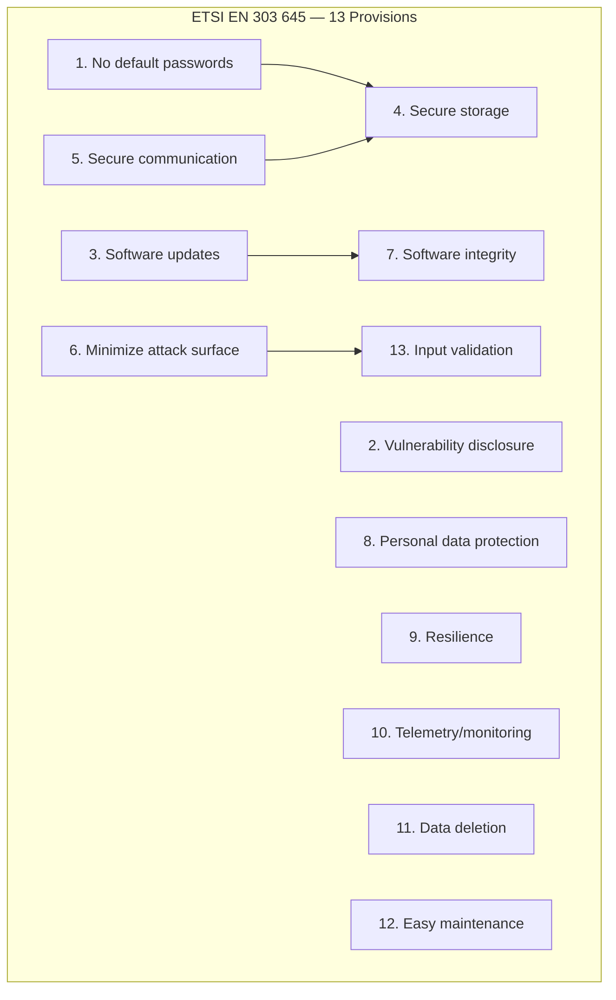
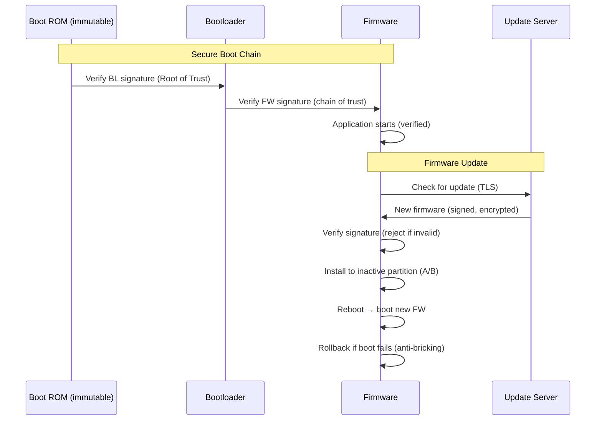
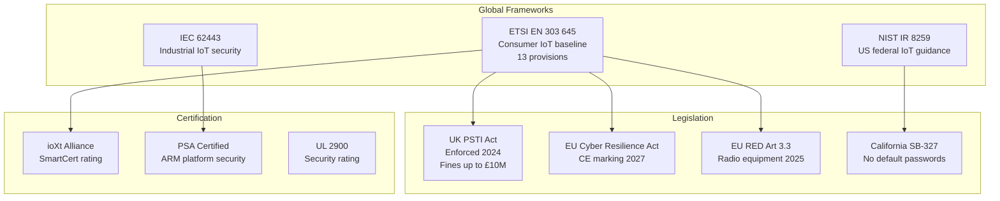
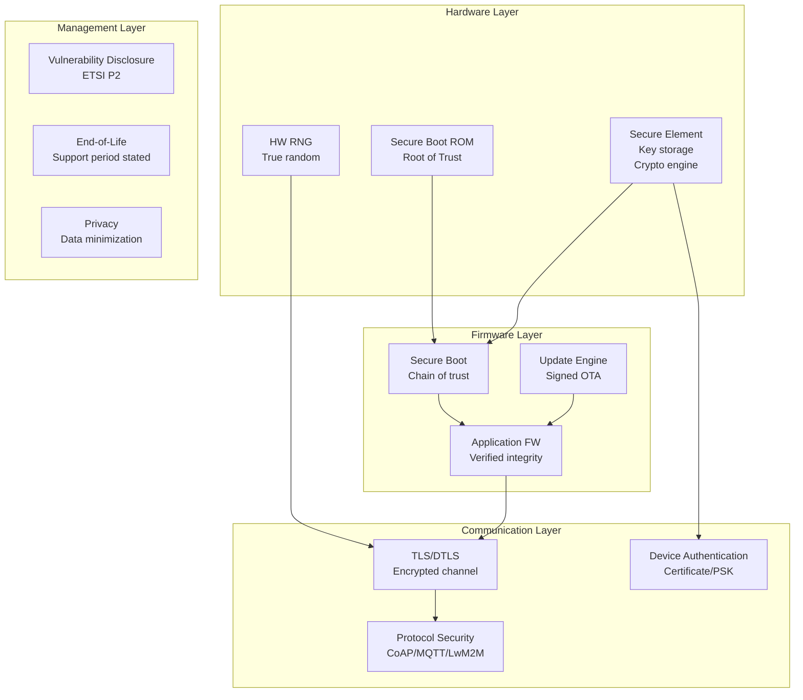

# IoT Security Standards

**Topic:** IoT Device Security — ETSI EN 303 645, NIST IR 8259, UK PSTI Act, IEC 62443 for IoT, Consumer IoT Security  
**Standards:** ETSI EN 303 645 v2.1.1 (2020), NIST IR 8259A/B, UK PSTI Act 2022, IEC 62443-4-2  
**SDO:** ETSI (TC CYBER), NIST, UK Government (DCMS), IEC  
**Audience:** IoT product managers, security architects, firmware developers, compliance officers, device manufacturers  
**Prerequisites:** Basic cybersecurity concepts, IoT architecture, networking fundamentals, embedded systems awareness

---

## Chapter 1 — Historical Context & Origin Story

### 1.1 IoT Security Timeline

| Year | Event | Impact |
|------|-------|--------|
| 2014 | HP study: 70% IoT devices have critical vulnerabilities | Industry awareness |
| 2016 | Mirai botnet (600K devices, DDoS 1.2 Tbps on Dyn) | Wake-up call for industry |
| 2017 | UK DCMS "Secure by Design" code of practice | First government guidance |
| 2018 | California SB-327 (IoT security law) | First US state law |
| 2019 | ETSI TS 103 645 (technical specification) | Industry baseline |
| 2020 | ETSI EN 303 645 (harmonized standard) | EU regulatory framework |
| 2020 | NIST IR 8259A/B (IoT device capabilities) | US federal guidance |
| 2021 | US Executive Order 14028 (Cybersecurity) | Software supply chain focus |
| 2022 | UK PSTI Act (Product Security and Telecommunications Infrastructure) | Enforceable law (UK) |
| 2023 | EU Cyber Resilience Act (CRA) proposed | Mandatory CE marking for IoT |
| 2024 | EU CRA enacted, PSTI Act enforced (April 2024) | Active enforcement begins |
| 2025 | EU RED delegated acts (radio equipment cybersecurity) | Mandatory August 2025 |

### 1.2 Mirai Botnet — The Catalyst

| Aspect | Detail |
|--------|--------|
| Attack type | DDoS via IoT botnet (cameras, routers, DVRs) |
| Scale | 600,000+ compromised devices |
| Target | Dyn DNS → Twitter, Netflix, Reddit, GitHub offline |
| Root cause | Default credentials (admin/admin, root/root) |
| Devices exploited | IP cameras (Dahua, Hikvision), routers (Huawei), DVRs |
| Impact | Regulatory response globally |

---

## Chapter 2 — Standard Architecture & Structure

### 2.1 Key IoT Security Standards Mapping

| Standard | Scope | Type | Region |
|----------|-------|------|--------|
| ETSI EN 303 645 | Consumer IoT devices | Harmonized standard | EU/Global |
| NIST IR 8259A | IoT device cybersecurity capabilities | Guidance | US |
| NIST IR 8259B | Non-technical supporting capabilities | Guidance | US |
| UK PSTI Act | Consumer connectable products | Law (enforceable) | UK |
| IEC 62443-4-2 | Industrial IoT / component security | International standard | Global |
| EU CRA | All digital products with connectivity | Regulation | EU |
| EU RED Art. 3.3(d/e/f) | Radio equipment cybersecurity | Delegated regulation | EU |
| UL 2900-1 | Software cybersecurity (network-connected) | Standard | US/Global |
| OWASP IoT Top 10 | IoT vulnerability categories | Guidance | Global |

### 2.2 ETSI EN 303 645 — 13 Provisions

| # | Provision | Summary |
|---|-----------|---------|
| 1 | No universal default passwords | Unique per device, or user-set at setup |
| 2 | Implement means to manage vulnerability reports | Disclosure policy, contact point |
| 3 | Keep software updated | Update mechanism, timely patches |
| 4 | Securely store sensitive security parameters | Encrypted storage, no hardcoded keys |
| 5 | Communicate securely | TLS/DTLS, no plaintext sensitive data |
| 6 | Minimize exposed attack surfaces | Disable unused ports/services, least privilege |
| 7 | Ensure software integrity | Verified boot, signed firmware updates |
| 8 | Ensure personal data is secure | Privacy by design, data minimization |
| 9 | Make systems resilient to outages | Graceful degradation, local functionality |
| 10 | Examine system telemetry data | Anomaly detection, audit logging |
| 11 | Make it easy to delete user data | Factory reset, data erasure mechanism |
| 12 | Make installation and maintenance easy | Secure defaults, user guidance |
| 13 | Validate input data | Input sanitization, buffer overflow protection |



---

## Chapter 3 — Technical Deep Dive

### 3.1 UK PSTI Act — Mandatory Requirements (Enforced April 2024)

| Requirement | Detail | Penalty |
|-------------|--------|---------|
| No universal default passwords | Must be unique per device or set by user at first use | Up to £10M or 4% global turnover |
| Vulnerability disclosure policy | Published point of contact, timeline for response | Same |
| Transparency on software updates | State minimum support period at point of sale | Same |

**Scope:** All consumer "internet-connectable" and "network-connectable" products sold in UK. Includes: smart TVs, cameras, speakers, toys, routers, wearables.

### 3.2 NIST IR 8259A — Device Cybersecurity Capabilities

| Capability | Description |
|-----------|-------------|
| Device Identification | Unique logical/physical identity |
| Device Configuration | Ability to restrict configuration changes |
| Data Protection | Cryptographic protection (at rest + in transit) |
| Logical Access | Authentication, authorization mechanisms |
| Software Update | Secure update mechanism (integrity verified) |
| Cybersecurity State Awareness | Logging, event reporting, anomaly detection |

### 3.3 IEC 62443-4-2 — Component Security Levels

| Security Level | Definition | Example |
|---------------|------------|---------|
| SL 1 | Protection against casual/unintentional violation | Consumer IoT |
| SL 2 | Protection against intentional attack (low resources) | Commercial building |
| SL 3 | Protection against sophisticated attack (moderate resources) | Critical infrastructure |
| SL 4 | Protection against state-level actor (extensive resources) | Military, nuclear |

### 3.4 OWASP IoT Top 10 (2018)

| Rank | Vulnerability | Mitigation |
|------|--------------|-----------|
| 1 | Weak/guessable/hardcoded passwords | Unique per device, complexity enforcement |
| 2 | Insecure network services | Disable unnecessary ports, firewall |
| 3 | Insecure ecosystem interfaces | API authentication, input validation |
| 4 | Lack of secure update mechanism | Signed firmware, verified updates |
| 5 | Use of insecure/outdated components | CVE tracking, SBOM, patching |
| 6 | Insufficient privacy protection | Data minimization, encryption |
| 7 | Insecure data transfer/storage | TLS, encrypted storage, key management |
| 8 | Lack of device management | Remote management, decommissioning |
| 9 | Insecure default settings | Secure by default, disable unused features |
| 10 | Lack of physical hardening | Tamper detection, secure boot, debug disable |

### 3.5 Secure Boot & Firmware Update Chain



---

## Chapter 4 — Implementation Guide

### 4.1 IoT Security Implementation Priorities

| Priority | Action | Standard Reference |
|----------|--------|-------------------|
| P0 (Critical) | Eliminate default passwords | ETSI P1, PSTI R1 |
| P0 (Critical) | Implement secure update mechanism | ETSI P3, P7 |
| P1 (High) | Use TLS/DTLS for all communications | ETSI P5 |
| P1 (High) | Implement secure boot chain | ETSI P7 |
| P2 (Medium) | Minimize exposed attack surface | ETSI P6 |
| P2 (Medium) | Publish vulnerability disclosure policy | ETSI P2, PSTI R2 |
| P3 (Normal) | Factory reset (data erasure) | ETSI P11 |
| P3 (Normal) | State support period publicly | PSTI R3 |

### 4.2 Hardware Security for IoT

| Feature | Purpose | Implementation |
|---------|---------|---------------|
| Secure element (SE) | Key storage, crypto operations | ATECC608A, OPTIGA Trust M |
| Trusted Execution Environment (TEE) | Isolated execution | ARM TrustZone, RISC-V PMP |
| Hardware RNG | Cryptographic randomness | On-chip TRNG |
| Secure boot ROM | Immutable root of trust | Fused key in OTP memory |
| Debug disable | Prevent JTAG/SWD extraction | Fuse JTAG disable in production |
| Anti-tamper | Physical attack detection | Mesh, sensors, zeroization |

### 4.3 Communication Security

| Protocol | Use Case | IoT Recommendation |
|----------|----------|-------------------|
| TLS 1.2/1.3 | TCP-based (MQTT, HTTP) | Mandatory for IP-connected |
| DTLS 1.2/1.3 | UDP-based (CoAP, LwM2M) | Mandatory for constrained IoT |
| OSCORE | CoAP object security | End-to-end (through proxies) |
| COSE | CBOR Object Signing/Encryption | Firmware signatures |
| PSK | Pre-shared key (resource-limited) | Acceptable for constrained devices |
| Certificate | PKI-based authentication | Preferred for capable devices |

---

## Chapter 5 — Certification & Audit

### 5.1 IoT Security Certification Programs

| Program | Standard | Levels | Region |
|---------|----------|--------|--------|
| ioXt Alliance | ETSI EN 303 645 based | SmartCert (1-5 stars) | Global |
| GSMA IoT Security Assessment | GSMA guidelines | Self-assessment + audit | Global |
| UL IoT Security Rating | UL 2900 series | Bronze/Silver/Gold/Platinum/Diamond | US/Global |
| PSA Certified | ARM Platform Security Architecture | Level 1/2/3 | Global |
| SESIP (GlobalPlatform) | Security Evaluation Standard for IoT Platforms | Level 1-5 | Global |
| CTIA Cybersecurity | IoT device security | Certification program | US |
| BSI IT-Grundschutz | German IT security | Various | Germany |
| CSA STAR | Cloud Security Alliance | Self/Third-party/Continuous | Global |

### 5.2 EU Cyber Resilience Act (CRA) Certification

| Category | Examples | Assessment |
|----------|----------|-----------|
| Default (non-critical) | Most consumer IoT | Self-assessment |
| Important Class I | Password managers, routers, IoT gateways | Harmonized standard or third-party |
| Important Class II | Firewalls, IDS, HSMs, smart meters | Third-party assessment |
| Critical | Smart cards, hardware security modules | EU scheme certification |

---

## Chapter 6 — Regional & Domain Variants

### 6.1 Global IoT Security Legislation

| Region | Law/Standard | Status | Key Requirement |
|--------|-------------|--------|----------------|
| UK | PSTI Act 2022 | Enforced (April 2024) | 3 requirements (passwords, disclosure, updates) |
| EU | Cyber Resilience Act | Enacted (2024, enforcement 2027) | CE marking for cybersecurity |
| EU | RED Art. 3.3(d)(e)(f) | Mandatory (August 2025) | Radio equipment cybersecurity |
| US | CYBER Trust Mark (voluntary) | 2024 | Consumer IoT labeling |
| US | NIST IR 8259 | Guidance | Federal procurement |
| US | California SB-327 | Enforced (2020) | No default passwords |
| Singapore | CLS (Cybersecurity Labelling) | Active | 4 levels |
| Finland | Cybersecurity Label | Active | Based on ETSI EN 303 645 |
| India | TEC (Telecom) | Draft | IoT security requirements |
| Japan | IoT Security Guidelines (METI) | Guidance | Based on IPA |
| Australia | CoP (Code of Practice) | Voluntary | Based on ETSI EN 303 645 |

### 6.2 Domain-Specific IoT Security

| Domain | Standard | Focus |
|--------|----------|-------|
| Consumer IoT | ETSI EN 303 645 | Baseline security, privacy |
| Industrial IoT | IEC 62443 | Safety + security, zones/conduits |
| Automotive IoT | ISO/SAE 21434 + UN R155 | Vehicle cybersecurity |
| Medical IoT | FDA Premarket Guidance + IEC 62443-4-1 | Patient safety |
| Smart home | Matter (security built-in) | Device attestation, secure commissioning |
| Building automation | BACnet Secure Connect | IP-based BAS security |

---

## Chapter 7 — Comparison: IoT Security Frameworks

| Feature | ETSI EN 303 645 | NIST IR 8259 | IEC 62443-4-2 | UK PSTI |
|---------|-----------------|-------------|---------------|---------|
| Scope | Consumer IoT | All IoT (federal) | Industrial IoT | Consumer connectable |
| Type | Harmonized standard | Guidance | International standard | Law |
| Enforceable | Via EU RED/CRA | Federal procurement | Contractual | Yes (fines) |
| Provisions | 13 provisions, 67 requirements | 6 capabilities | 7 FR (Foundational Requirements) | 3 requirements |
| Certification | Via ioXt, national schemes | Self-assessment | ISASecure (ISCI) | Self-declaration |
| Complexity | Medium | Low-Medium | High | Low |
| Target audience | Device manufacturers | Device + ecosystem | System integrators | Manufacturers + retailers |

---

## Chapter 8 — Mermaid Architecture Diagrams

### 8.1 IoT Security Regulatory Landscape



### 8.2 IoT Device Security Architecture



---

## Chapter 9 — Case Studies & Failure Analysis

### 9.1 Mirai Botnet Attack (2016) — Root Cause Analysis

| Factor | Detail |
|--------|--------|
| Vulnerability | Default credentials (61 username/password pairs hardcoded) |
| Devices | IP cameras, DVRs, routers (Dahua, Hikvision, Huawei, Realtek) |
| Exploitation | Telnet brute-force with known default credentials |
| Scale | 600,000+ devices infected |
| Attack | DDoS against Dyn DNS (1.2 Tbps) → major internet outage |
| Duration | September-November 2016 |

**Mapping to ETSI EN 303 645:** (1) Provision 1 violated: Universal default passwords. (2) Provision 3 violated: No update mechanism on many devices. (3) Provision 6 violated: Telnet open and exposed. (4) Provision 5 violated: No encryption (telnet = plaintext).

**Post-Mirai improvements:** Industry created ETSI EN 303 645, UK PSTI Act, California SB-327 — all directly addressing Mirai-style attacks.

### 9.2 Ring Doorbell Credential Stuffing (2019)

**Attack:** Attackers used credential stuffing (leaked passwords from other breaches) to access Ring accounts. No 2FA required by default. Live video/audio access gained.

**Lessons → Standards mapping:** (1) ETSI P1: Strong, unique passwords (but user responsibility here). (2) NIST: Multi-factor authentication should be available. (3) OWASP #1: Weak password policies. (4) Industry response: Ring mandated 2FA, improved notification of new logins.

---

## Chapter 10 — Future Evolution & Industry Trends

| Trend | Timeline | Description |
|-------|----------|-------------|
| EU CRA enforcement | 2027 | All IoT products need CE cybersecurity marking |
| US CYBER Trust Mark | 2024-2025 | Voluntary consumer IoT label (FCC) |
| SBOM mandate | Growing | Software Bill of Materials for IoT firmware |
| Post-quantum readiness | 2025-2030 | Crypto-agile IoT devices |
| AI/ML for IoT security | Now | Anomaly detection, behavioral analysis |
| Zero Trust IoT | Growing | Per-device identity, continuous verification |
| Device attestation | Growing | Remote attestation of device state |
| Secure by Default | Regulatory push | No user configuration needed for baseline security |
| Firmware transparency | Emerging | Binary Transparency logs for firmware |
| Lifecycle security | CRA/PSTI | Mandatory support period disclosure |

---

## Chapter 11 — Interview Questions & Career Guide

### Tier 1: Entry-Level

**Q1:** What are the top 3 requirements of the UK PSTI Act?  
**A:** (1) **No universal default passwords:** Every device must have a unique password or require the user to set one during setup. Hardcoded or shared default passwords (admin/admin) are illegal. (2) **Vulnerability disclosure policy:** Manufacturer must provide a public point of contact for reporting security issues. Must acknowledge reports and provide timeline for fixes. (3) **Transparency on update support:** Must state at point of sale the minimum period the device will receive security updates. **Penalties:** Up to £10 million or 4% of global turnover. **Scope:** All consumer "internet-connectable" and "network-connectable" products sold in UK (since April 2024).

### Tier 2: Mid-Level

**Q2:** How does ETSI EN 303 645 differ from IEC 62443-4-2, and when would you use each?  
**A:** **ETSI EN 303 645:** (1) Designed for consumer IoT (smart speakers, cameras, toys). (2) 13 high-level provisions with 67 testable requirements. (3) Self-assessment possible. (4) Focus: baseline security, privacy, usability. (5) Used for: EU regulatory compliance (RED, CRA), consumer products. (6) Security level: One level (baseline). **IEC 62443-4-2:** (1) Designed for industrial IoT/OT (SCADA, PLCs, industrial networks). (2) 7 Foundational Requirements (FR1-FR7) with Component Requirements (CR). (3) Four Security Levels (SL1-SL4, from casual to state-level threats). (4) Part of larger 62443 series (process, system, component). (5) Used for: Industrial control systems, critical infrastructure. (6) Requires formal assessment for higher SLs. **When to use:** Consumer IoT product → ETSI EN 303 645. Industrial/OT/critical infrastructure → IEC 62443. Product spanning both (e.g., smart building controller) → Apply both where relevant. EU market → ETSI EN 303 645 (harmonized for CRA/RED). Supply chain requirement from industrial customer → IEC 62443.

### Tier 3: Senior

**Q3:** Design a security architecture for a large-scale IoT deployment (100K devices, 50 countries) meeting ETSI EN 303 645 and EU CRA requirements.  
**A:** **Architecture layers:** (1) **Device hardware:** Secure element (ATECC608A or equivalent) for key storage + device identity. Hardware RNG for cryptographic operations. Secure boot ROM (OTP fused root-of-trust key). Anti-tamper: disable JTAG/SWD in production firmware. (2) **Firmware security:** Secure boot chain (ROM → bootloader → application). Signed firmware updates (ECDSA P-256 minimum). A/B partition for atomic updates + rollback. SBOM generated at build time (SPDX format). Dependency tracking for CVE monitoring. (3) **Communication:** TLS 1.3 for cloud connectivity (mutual authentication). DTLS 1.2 for constrained devices (CoAP). Certificate-based device identity (X.509 from device CA). Certificate rotation capability (short-lived certs preferred). (4) **Cloud/platform:** Device provisioning: zero-touch (factory-provisioned certificates). Fleet management: policy-based grouping. OTA update infrastructure: staged rollout (canary → 10% → 50% → 100%). Anomaly detection: behavioral baseline per device type. (5) **Compliance mapping (ETSI EN 303 645):** P1: Device has unique, random password (generated during provisioning). P2: security@company.com published, 90-day fix timeline. P3: OTA mechanism, minimum 5-year support period stated. P4: Keys in secure element (never exposed). P5: TLS 1.3, no plaintext. P6: Only necessary ports open (MQTT 8883). P7: Secure boot + signed updates. P8: Data minimization, local processing where possible. P9: Local functionality continues without cloud. P10: Device logs anomalies, reports to cloud. P11: Factory reset wipes all personal data. P12: Secure defaults, guided setup. P13: All inputs validated (protocol parser fuzzing tested). (6) **EU CRA compliance:** Self-assessment (default category) or third-party (if Important Class I/II). Technical documentation maintained. Conformity declaration + CE marking. 5-year security support (or product lifetime). Report actively exploited vulnerabilities to ENISA within 24 hours. SBOM provided to authorities on request.

---

## Chapter 12 — Cheat Sheet & Quick Reference

### IoT Security Standards Quick Selection

```
Consumer IoT (EU):     ETSI EN 303 645 → CRA compliance
Consumer IoT (UK):     PSTI Act (3 mandatory requirements)
Consumer IoT (US):     NIST IR 8259A + CYBER Trust Mark (voluntary)
Industrial IoT:        IEC 62443-4-2 (Security Levels 1-4)
Automotive IoT:        ISO/SAE 21434 + UN R155
Medical IoT:           FDA Guidance + IEC 62443
Smart Home:            Matter (security built-in) + ETSI EN 303 645
```

### ETSI EN 303 645 — Top Priorities

```
#1: No default passwords (UNIQUE per device or user-set)
#2: Vulnerability disclosure policy (public contact)
#3: Keep software updated (mechanism + timeline)
#5: Secure communications (TLS/DTLS, no plaintext)
#7: Software integrity (secure boot + signed updates)
```

### IoT Security Anti-Patterns (AVOID)

```
❌ Hardcoded credentials (admin/admin)
❌ Telnet/FTP exposed (use SSH/SFTP or disable)
❌ No update mechanism (device becomes legacy vulnerability)
❌ Plaintext communication (HTTP, MQTT without TLS)
❌ No secure boot (firmware tampering possible)
❌ JTAG/SWD enabled in production (physical extraction)
❌ No vulnerability disclosure process (no way to report)
❌ Unlimited support without stating period (misleading)
```

---

*End of Document — 11_IoT_Security_Standards.md*
