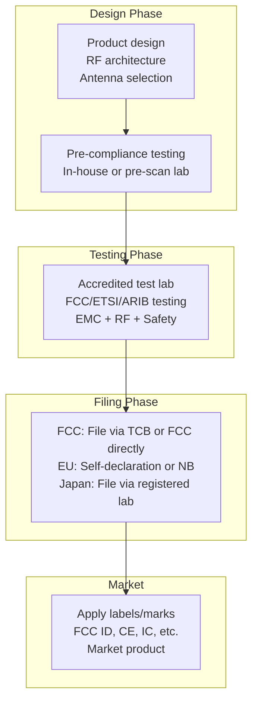
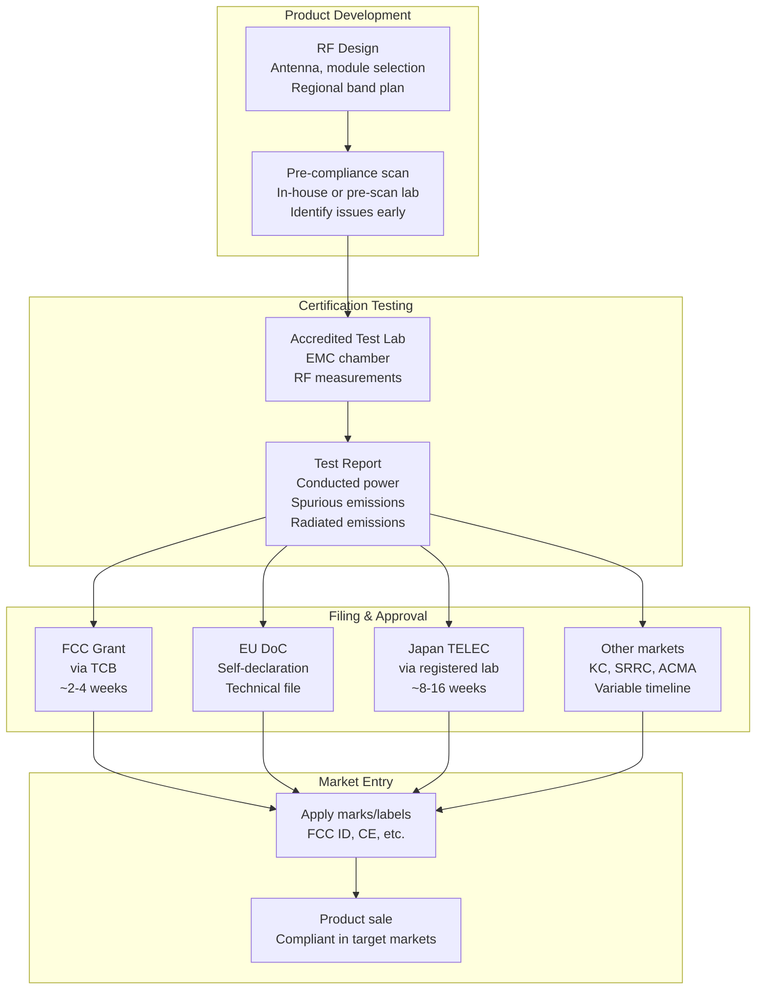
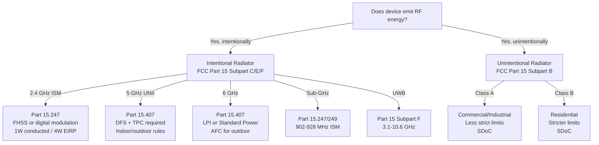

# RF Regulatory Compliance — FCC, RED & Global

**Topic:** Radio Frequency Regulatory Standards — FCC Part 15, EU RED 2014/53/EU, ETSI EN 300 328, Global Type Approval  
**Standards:** FCC 47 CFR Part 15, RED 2014/53/EU, ETSI EN 300 328, ETSI EN 301 893, ARIB STD-T66/T71, IC RSS-247  
**SDO:** FCC (US), EU Commission (CE), ETSI (EU harmonized), ARIB (Japan), IC (Canada), ACMA (Australia)  
**Audience:** RF engineers, regulatory compliance managers, product certification engineers, antenna designers, IoT hardware teams  
**Prerequisites:** Basic RF concepts (frequency, power, bandwidth), antenna fundamentals, modulation basics, EMC awareness

---

## Chapter 1 — Historical Context & Origin Story

### 1.1 RF Regulation Timeline

| Year | Event | Impact |
|------|-------|--------|
| 1927 | US Radio Act | First US spectrum regulation |
| 1934 | FCC established | US communications regulation authority |
| 1938 | ITU Radio Regulations | International spectrum allocation |
| 1985 | FCC Part 15 ISM rules | Unlicensed ISM bands (spread spectrum) → enabled Wi-Fi |
| 1999 | EU R&TTE Directive 1999/5/EC | First EU radio equipment directive |
| 2014 | EU RED 2014/53/EU | Replaced R&TTE, stronger requirements |
| 2016 | RED enforcement | Mandatory for EU market |
| 2017 | FCC KDB updates (modular approval) | Streamlined IoT certification |
| 2022 | EU RED delegated acts (cybersecurity) | Articles 3.3(d)(e)(f) |
| 2025 | RED cybersecurity enforcement | Mandatory August 2025 |

### 1.2 ISM Band Allocation (Global)

| Band | Frequency | Region | Common Use |
|------|-----------|--------|-----------|
| 433 MHz | 433.05-434.79 MHz | EU/Asia (ITU Region 1/3) | Short-range devices, LoRa |
| 868 MHz | 863-870 MHz | EU (ETSI) | LoRaWAN, Z-Wave, SRD |
| 915 MHz | 902-928 MHz | US/Americas (ITU Region 2) | LoRaWAN, Zigbee |
| 2.4 GHz | 2400-2483.5 MHz | Global | Wi-Fi, Bluetooth, Zigbee |
| 5 GHz | 5150-5850 MHz | Global (varies) | Wi-Fi 5/6 (UNII bands) |
| 6 GHz | 5925-7125 MHz | US/EU (new) | Wi-Fi 6E/7 |
| 60 GHz | 57-71 GHz | Global (varies) | WiGig, 802.11ad/ay |

---

## Chapter 2 — Standard Architecture & Structure

### 2.1 Global Regulatory Bodies

| Region | Body | Mark | Scope |
|--------|------|------|-------|
| US | FCC (Federal Communications Commission) | FCC ID | Radio equipment, EMC |
| EU | EU Commission (notified bodies) | CE marking | Radio, EMC, safety, health |
| UK | UKCA (Ofcom) | UKCA mark | Post-Brexit UK compliance |
| Canada | ISED (Innovation, Science and Economic Development) | IC ID | Radio equipment |
| Japan | MIC (Ministry of Internal Affairs) | TELEC/JATE | Radio equipment (ARIB standards) |
| Australia | ACMA (Australian Communications and Media Authority) | RCM mark | Radio + EMC |
| China | SRRC (State Radio Regulation of China) | SRRC mark | Radio equipment |
| Korea | KCC (Korea Communications Commission) | KC mark | Radio + EMC |
| India | WPC (Wireless Planning & Coordination) | WPC ETA | Radio equipment |
| Brazil | ANATEL | ANATEL mark | Radio + telecom |

### 2.2 FCC Part 15 Structure

| Subpart | Scope |
|---------|-------|
| Subpart A | General provisions, definitions |
| Subpart B | Unintentional radiators (digital devices, Class A/B) |
| Subpart C | Intentional radiators (transmitters in ISM bands) |
| Subpart D | Unlicensed PCS devices (1920-1930 MHz) |
| Subpart E | Unlicensed NII devices (5 GHz UNII) |
| Subpart F | Ultra-wideband (UWB) devices |
| Subpart G | Access broadband over power line |
| Subpart H | TV white spaces |

### 2.3 EU RED 2014/53/EU — Essential Requirements

| Article | Requirement | Harmonized Standard |
|---------|-------------|-------------------|
| 3.1(a) | Health and safety | EN 62311 (EMF), EN 62368-1 (safety) |
| 3.1(b) | Electromagnetic compatibility (EMC) | EN 301 489 series |
| 3.2 | Effective use of radio spectrum | EN 300 328, EN 301 893, EN 300 220 |
| 3.3(d) | Network protection (does not harm) | EN 303 645 (cybersecurity) |
| 3.3(e) | Personal data and privacy | EN 303 645 |
| 3.3(f) | Fraud protection | EN 303 645 |

---

## Chapter 3 — Technical Deep Dive

### 3.1 FCC Part 15 — Key Emission Limits

| Parameter | FCC Part 15.247 (2.4 GHz ISM) |
|-----------|-------------------------------|
| Max conducted power | 30 dBm (1 W) |
| Max EIRP | 36 dBm (4 W) with antenna gain |
| Occupied bandwidth | ≥ 500 kHz (FHSS) or 500 kHz (DSSS) |
| Frequency hopping | ≥ 15 channels (if < 250 kHz/channel) |
| Spurious emissions | -20 dBc (in-band), Part 15.209 (out-of-band) |
| 6 dB bandwidth rule | Signal must occupy 6 dB bandwidth meeting minimum |

**EIRP calculation:**

$$EIRP = P_{conducted} + G_{antenna} - L_{cable}$$

Example: 20 dBm conducted + 6 dBi antenna - 2 dB cable loss = 24 dBm EIRP.

For point-to-multipoint: EIRP ≤ 36 dBm (30 dBm + 6 dBi antenna).  
For fixed point-to-point: Higher EIRP allowed (1:3 reduction rule above 6 dBi).

### 3.2 ETSI EN 300 328 — 2.4 GHz Wideband Transmission

| Parameter | Requirement |
|-----------|-------------|
| Frequency range | 2400-2483.5 MHz |
| Max EIRP | 100 mW (20 dBm) — general. Some categories allow more |
| Duty cycle | Category-dependent (or LBT: Listen Before Talk) |
| Adaptive mechanisms | Required for wideband (≥ 5 MHz) |
| Frequency hopping (FHSS) | ≥ 15 hop channels, ≥ 20 MHz total hopping bandwidth |
| Spectrum access | LBT + AFA (Adaptive Frequency Agility) for some categories |
| Spurious emissions | EN 301 489-17 (EMC), EN 300 328 (in-band) |

### 3.3 ETSI EN 301 893 — 5 GHz RLAN

| Sub-band | Frequency | EIRP Limit | Requirements |
|----------|-----------|-----------|-------------|
| UNII-1 | 5150-5250 MHz | 200 mW (23 dBm) | Indoor only (EU) |
| UNII-2 | 5250-5350 MHz | 200 mW (23 dBm) | DFS + TPC mandatory |
| UNII-2e | 5470-5725 MHz | 1 W (30 dBm) | DFS + TPC mandatory |
| UNII-3 | 5725-5850 MHz | 2 W (33 dBm) | Outdoor allowed |

**DFS (Dynamic Frequency Selection):** Must detect weather radar and vacate channel within 10 seconds. Channel Availability Check (CAC): 60 seconds listening before using channel.

**TPC (Transmit Power Control):** Must reduce power by 3 dB or more from maximum when interference detected.

### 3.4 Sub-GHz Regulations (ETSI EN 300 220)

| Sub-band (EU) | Frequency | Power | Duty Cycle | Use |
|---------------|-----------|-------|-----------|-----|
| g (SRD) | 863-868 MHz | 25 mW | 0.1% | General SRD |
| g1 | 868.0-868.6 MHz | 25 mW | 1% | LoRaWAN default |
| g2 | 868.7-869.2 MHz | 25 mW | 0.1% | LoRaWAN |
| g3 | 869.4-869.65 MHz | 500 mW | 10% | High-power SRD |
| g4 | 869.7-870.0 MHz | 25 mW | 1% | General |

### 3.5 FCC vs ETSI Key Differences

| Aspect | FCC (US) | ETSI (EU) |
|--------|----------|-----------|
| Power limit (2.4 GHz) | 1 W conducted, 4 W EIRP | 100 mW EIRP (20 dBm) |
| 5 GHz indoor/outdoor | Less restrictive | Strict indoor-only for some bands |
| Sub-GHz | 902-928 MHz, 1 W | 863-870 MHz, 25-500 mW, duty cycle |
| Duty cycle | Not regulated (dwell time instead) | Strictly regulated (0.1%-10%) |
| Spectrum access | FHSS or DSSS/CSS | LBT + AFA required (wideband) |
| DFS (5 GHz) | Required (UNII-2/2e) | Required (5250-5725 MHz) |
| Channel bandwidth | Minimum 500 kHz (2.4 GHz) | Category-based (EN 300 328) |
| Modular approval | KDB 996369 | Not applicable (whole device) |

---

## Chapter 4 — Implementation Guide

### 4.1 Certification Process Overview



### 4.2 FCC Certification Types

| Type | Scope | When Used |
|------|-------|-----------|
| Certification (FCC ID) | Intentional radiators (transmitters) | Wi-Fi, Bluetooth, LoRa, cellular |
| Supplier's Declaration of Conformity (SDoC) | Unintentional radiators (Class A/B) | Digital devices, computers |
| Verification | Simple intentional/unintentional radiators | Certain receivers, low-risk |

### 4.3 FCC Modular Approval (KDB 996369)

| Requirement | Description |
|-------------|-------------|
| Shielding | Module must be shielded (metal can or equivalent) |
| Buffered modulation/data | No direct data path to antenna |
| Antenna connector | Standard connector (SMA, U.FL) or permanently attached |
| Power supply regulation | Module regulates own power |
| Compliance labeling | Module has FCC ID label (or host states "Contains FCC ID") |
| Limited module conditions | Must work within grant conditions in any host |
| Test methodology | Tested standalone + in representative host |
| Module documentation | Integration guide for host manufacturers |

**Benefit:** End-product manufacturer uses pre-certified module → avoids full FCC testing (only unintentional emissions testing needed).

### 4.4 RF Testing Requirements

| Test | Standard | Purpose |
|------|----------|---------|
| Conducted output power | Part 15.247 / EN 300 328 | Verify max TX power |
| Occupied bandwidth | Part 15.247 | Verify signal stays within limits |
| Spurious emissions (conducted) | Part 15.207 / EN 301 489 | Out-of-band conducted emissions |
| Radiated emissions | Part 15.209 / EN 301 489 | Radiated spurious emissions |
| Band edge compliance | Part 15.247 | Signal at band edges |
| Antenna gain verification | FCC/ETSI | Confirm EIRP within limits |
| DFS (5 GHz) | Part 15.407 / EN 301 893 | Radar detection and avoidance |
| Frequency stability | Part 15.247 | Over temperature range |
| SAR (if body-worn) | Part 2.1093 / EN 62311 | RF exposure (< 1.6 W/kg FCC, < 2 W/kg EU) |

---

## Chapter 5 — Certification & Audit

### 5.1 Certification Costs & Timeline

| Market | Typical Cost | Timeline | Notes |
|--------|-------------|----------|-------|
| FCC (US) | $5,000-30,000 | 4-8 weeks | TCB processing ~2 weeks |
| CE/RED (EU) | $5,000-25,000 | 4-12 weeks | Self-declaration possible |
| IC (Canada) | $3,000-10,000 | 2-4 weeks (often concurrent with FCC) | Mutual recognition with FCC |
| TELEC (Japan) | $10,000-40,000 | 8-16 weeks | Translation required, specific tests |
| SRRC (China) | $5,000-20,000 | 8-20 weeks | In-country testing required |
| KC (Korea) | $5,000-15,000 | 4-8 weeks | In-country testing |
| ACMA (Australia) | $2,000-8,000 | 2-4 weeks | Supplier declaration (no lab filing) |

### 5.2 Global Type Approval Strategy

| Strategy | Description | Pros | Cons |
|----------|-------------|------|------|
| Modular approach | Use pre-certified module | Fast, low cost per SKU | Limited design flexibility |
| Full device certification | Certify entire product | Maximum flexibility | Expensive per market |
| Mutual recognition | Leverage bilateral agreements | Save testing | Limited scope (FCC↔IC) |
| CB Scheme | Test once (IEC safety) | Accepted in 50+ countries | Safety only (not RF) |
| Regional grouping | Test once per region | Efficient | Must cover all sub-variants |

---

## Chapter 6 — Regional & Domain Variants

### 6.1 Wi-Fi Regulatory Comparison (2.4 GHz)

| Region | Frequency | Max EIRP | Channels | Special |
|--------|-----------|----------|----------|---------|
| US (FCC) | 2400-2483.5 MHz | 4 W (36 dBm) | 1-11 | High power allowed |
| EU (ETSI) | 2400-2483.5 MHz | 100 mW (20 dBm) | 1-13 | LBT for wideband |
| Japan (ARIB) | 2400-2483.5 MHz | 200 mW (23 dBm) | 1-13+14 | Channel 14 (802.11b only) |
| China (SRRC) | 2400-2483.5 MHz | 100 mW (20 dBm) | 1-13 | SRRC mandatory |
| Australia (ACMA) | 2400-2483.5 MHz | 4 W (36 dBm) | 1-13 | Follows FCC power |

### 6.2 6 GHz Band (Wi-Fi 6E/7) — New Allocation

| Region | Range | Power | Status |
|--------|-------|-------|--------|
| US (FCC) | 5925-7125 MHz (full 1200 MHz) | LPI: 5 dBm/MHz, SP: 23 dBm/MHz | Available |
| EU (CEPT) | 5945-6425 MHz (lower 480 MHz) | 200 mW EIRP (LPI) | Available |
| UK (Ofcom) | 5925-6425 MHz | 250 mW EIRP (LPI) | Available |
| Japan | 5925-6425 MHz | Under consideration | Expected 2025 |
| Korea | 5925-7125 MHz | 200 mW | Available |
| Canada | 5925-7125 MHz | Similar to FCC | Available |
| China | TBD | TBD | Under study |

**LPI = Low Power Indoor**, **SP = Standard Power** (AFC-managed outdoor).

---

## Chapter 7 — Comparison: Certification Approaches

| Approach | FCC (US) | CE (EU) | MIC (Japan) |
|----------|----------|---------|-------------|
| Declaration type | FCC Grant (TCB/FCC) | EU DoC (self-declaration) | MIC Certificate (TELEC/JATE) |
| Testing standard | 47 CFR Part 15 | ETSI EN 300/301 series | ARIB STD-T66/T71 |
| Test lab requirement | FCC-accredited (A2LA) | Notified body (optional) | MIC-registered lab |
| Label | FCC ID (e.g., 2ABCD-MODEL) | CE mark + NB number | TELEC number |
| Market surveillance | FCC OET/EB | National authorities | MIC |
| Pre-market testing | Mandatory (lab report) | Recommended (presumption) | Mandatory |
| Language | English | Local language + English | Japanese required |
| Module approval | Yes (KDB 996369) | No formal equivalent | Yes (partial) |
| Validity | Permanent (unless revoked) | Manufacturer responsibility | 5-year renewal (some) |

---

## Chapter 8 — Mermaid Architecture Diagrams

### 8.1 Global RF Certification Flow



### 8.2 FCC Part 15 Decision Tree



---

## Chapter 9 — Case Studies & Failure Analysis

### 9.1 Wi-Fi Router Exceeding EIRP (EU Market)

**Problem:** IoT company designed Wi-Fi router with 3 dBi antenna for US market (FCC: 30 dBm conducted + 6 dBi = 36 dBm EIRP allowed). Attempted to sell same hardware in EU. EU limit: 20 dBm EIRP. Router conducted power: 20 dBm + 3 dBi antenna = 23 dBm EIRP → 3 dB over EU limit.

**Consequence:** Failed CE testing. Required firmware-based power reduction for EU SKU. Lesson: Design for most restrictive market first (EU for 2.4 GHz), then increase power for permissive markets (US).

**Fix:** Create region-specific firmware that limits conducted power. EU firmware: 17 dBm conducted + 3 dBi = 20 dBm EIRP (compliant). Region locked at factory (prevent user changing to US power in EU).

### 9.2 DFS Failure — 5 GHz Product Recall

**Problem:** Manufacturer's 5 GHz outdoor AP failed to properly implement DFS (radar detection). Deployed near airport, interfered with weather radar.

**Regulatory action:** FCC citation, mandatory firmware update. Product pulled from market until DFS re-certified. $100K+ in retesting, legal, and remediation costs.

**Root cause:** DFS algorithm thresholds set too high (missed radar pulses). Insufficient testing with all radar waveform types (FCC defines specific test patterns).

**Lesson:** DFS testing is complex (multiple radar types, timing requirements). Use pre-certified Wi-Fi modules with proven DFS implementations rather than custom designs.

---

## Chapter 10 — Future Evolution & Industry Trends

| Trend | Timeline | Description |
|-------|----------|-------------|
| 6 GHz expansion (global) | 2024-2026 | More countries opening 6 GHz for Wi-Fi |
| EU RED cybersecurity (Art. 3.3) | August 2025 | Mandatory cybersecurity for radio equipment |
| AFC (Automated Frequency Coordination) | 2024+ | Database-driven power control for 6 GHz outdoor |
| FCC 5.9 GHz reallocation | Ongoing | C-V2X vs Wi-Fi dispute |
| mmWave unlicensed (60 GHz+) | Growing | More devices in 57-71 GHz |
| Software-defined radio rules | Emerging | Regulatory challenges for SDR |
| AI/ML in spectrum management | Future | Dynamic spectrum sharing |
| Post-quantum implications | 2025-2030 | Impact on DPP, secure boot for radio firmware |
| Green certification | Growing | Energy efficiency requirements in RED |

---

## Chapter 11 — Interview Questions & Career Guide

### Tier 1: Entry-Level

**Q1:** What is the difference between FCC Part 15 Subpart B and Subpart C?  
**A:** **Subpart B — Unintentional Radiators:** Devices that generate RF as a byproduct of their operation (not designed to transmit). Examples: computers, monitors, USB cables, digital circuits. Compliance: Radiated and conducted emission limits (Class A: commercial, Class B: residential). Approval: Supplier's Declaration of Conformity (SDoC) — no FCC ID needed. **Subpart C — Intentional Radiators:** Devices designed to transmit RF energy. Examples: Wi-Fi routers, Bluetooth devices, LoRa modules, cellular phones. Compliance: Conducted power limits, spurious emissions, occupied bandwidth, specific rules per band (15.247 for 2.4 GHz, 15.407 for 5 GHz). Approval: FCC Certification required (FCC ID assigned). Testing more extensive (power, spurious, band edge, timing). **Key difference:** Intentional radiators (Subpart C) require FCC Certification (FCC ID). Unintentional radiators (Subpart B) only need self-declaration (SDoC).

### Tier 2: Mid-Level

**Q2:** Explain the EU RED 2014/53/EU essential requirements and how to demonstrate conformity.  
**A:** **Three essential requirements:** (1) **Article 3.1(a) — Safety:** Product must be safe for users. Harmonized standards: EN 62368-1 (safety), EN 62311 (EMF/SAR exposure). (2) **Article 3.1(b) — EMC:** Must not cause harmful interference and must be immune to disturbance. Harmonized standard: EN 301 489 series (EMC for radio equipment). (3) **Article 3.2 — Effective spectrum use:** Must efficiently use radio spectrum (not waste it). Harmonized standards: EN 300 328 (2.4 GHz), EN 301 893 (5 GHz), EN 300 220 (sub-GHz). **Demonstrating conformity (3 routes):** (1) Harmonized standards (presumption of conformity): Test to relevant EN standard → self-declare. Most common, cheapest. (2) EU-type examination: Submit to Notified Body for evaluation. Required if no harmonized standard exists. (3) Full quality assurance: ISO 9001 + Notified Body oversight. Used for complex or high-volume products. **Documentation:** Technical Construction File (TCF): test reports, design docs, risk assessment. EU Declaration of Conformity (DoC): formal statement of compliance. CE marking: affixed to product + packaging.

### Tier 3: Senior

**Q3:** Design a global certification strategy for a multi-radio IoT product (Wi-Fi 6E + BLE + LoRa + GNSS) targeting 25 countries.  
**A:** **Product architecture (regulatory optimization):** (1) **Modular design:** Use pre-certified modules where possible: Wi-Fi 6E + BLE combo module (e.g., Qualcomm QCA6696 or similar) → pre-certified for FCC/CE/IC. LoRa module (e.g., Semtech SX1262-based, FCC/CE certified). GNSS: receiver only (no transmission → no RF certification needed). Only antenna + integration testing required for host product. (2) **Multi-market approach:** Group 1 (FCC + IC): US + Canada — mutual recognition, test once. Group 2 (CE + UKCA): EU + UK — same standards (EN 300 328, EN 301 893), separate declarations. Group 3 (APAC): Japan (TELEC), Korea (KC), Australia (ACMA) — each separate. Group 4 (Other): India (WPC), Brazil (ANATEL), China (SRRC) — in-country testing. (3) **Testing strategy:** Use single test lab that holds accreditations for multiple markets (UL, TÜV, Bureau Veritas). Run all RF tests once → generate reports for each market format. DFS testing: one comprehensive test covers FCC + ETSI (different waveform requirements). SAR testing: only if body-worn (< 20 cm from body). (4) **6 GHz (Wi-Fi 6E) challenge:** US: full 5925-7125 MHz, LPI + SP (AFC). EU: only 5945-6425 MHz, LPI only. Japan/China: not yet allocated. Solution: firmware region-locking (detect country or manufacture per-region SKU). AFC client implementation for US standard power outdoor. (5) **LoRa regional compliance:** EU868 (1% duty cycle), US915 (FCC Part 15.247), AS923 (ARIB/region-specific). Module must support all regional parameters. Factory-configured or GPS-based region detection. (6) **Timeline optimization:** Start FCC + CE + IC simultaneously (14-16 weeks). Japan/Korea: submit after FCC data available (share test data, 8-12 additional weeks). China: plan 16-20 weeks (in-country requirement). Total: ~24 weeks for 25 countries (parallel testing strategy). (7) **Cost estimate:** Lab testing (all standards): $60,000-100,000. Filing fees (25 countries): $30,000-50,000. Consulting + project management: $20,000-40,000. Total: $110,000-190,000. Savings from modular approach: 40-60% vs full device certification per market.

---

## Chapter 12 — Cheat Sheet & Quick Reference

### Key Power Limits (2.4 GHz ISM)

```
FCC (US):    30 dBm conducted, 36 dBm EIRP (with 6 dBi antenna)
ETSI (EU):   20 dBm EIRP (100 mW) — regardless of antenna gain
ARIB (JP):   23 dBm EIRP (200 mW)
ACMA (AU):   36 dBm EIRP (follows FCC)
IC (Canada):  30 dBm conducted, 36 dBm EIRP (same as FCC)
SRRC (China): 20 dBm EIRP (100 mW, same as ETSI)
```

### FCC vs CE Quick Comparison

```
FCC:  Higher power (US), no duty cycle, FHSS/DSSS rules
CE:   Lower power (EU), duty cycle (sub-GHz), LBT required (wideband)
FCC:  FCC ID required (intentional radiators)
CE:   Self-declaration (with harmonized standards)
FCC:  Modular approval available (KDB 996369)
CE:   No formal modular approval (test whole device)
```

### Certification Decision Matrix

```
Using pre-certified module?  → Only unintentional emissions test (Subpart B)
Custom RF design?           → Full intentional radiator certification required
5 GHz product?              → DFS + TPC testing mandatory (FCC + ETSI)
Body-worn?                  → SAR testing required (FCC < 1.6 W/kg, EU < 2 W/kg)
6 GHz product?              → Check each market (not all have allocated 6 GHz)
Sub-GHz (EU)?               → Duty cycle regulations apply (0.1% - 10%)
Sub-GHz (US)?               → No duty cycle (902-928 MHz, 1 W allowed)
```

### Common Pitfalls

```
❌ Same power settings for all regions (EU 20 dBm vs US 36 dBm EIRP)
❌ Forgetting DFS testing for 5 GHz (expensive recall risk)
❌ No region-locking mechanism (user changes region = non-compliant)
❌ Antenna gain not accounted in EIRP calculation
❌ Missing spurious emissions below 1 GHz (harmonics of 2.4 GHz)
❌ Using US-only 902-928 MHz in Europe (illegal — EU uses 863-870 MHz)
❌ No SAR test for wearable product (FCC enforcement risk)
❌ Relying on module certification with non-listed antenna
```

---

*End of Document — 12_RF_Regulatory_FCC_RED.md*
