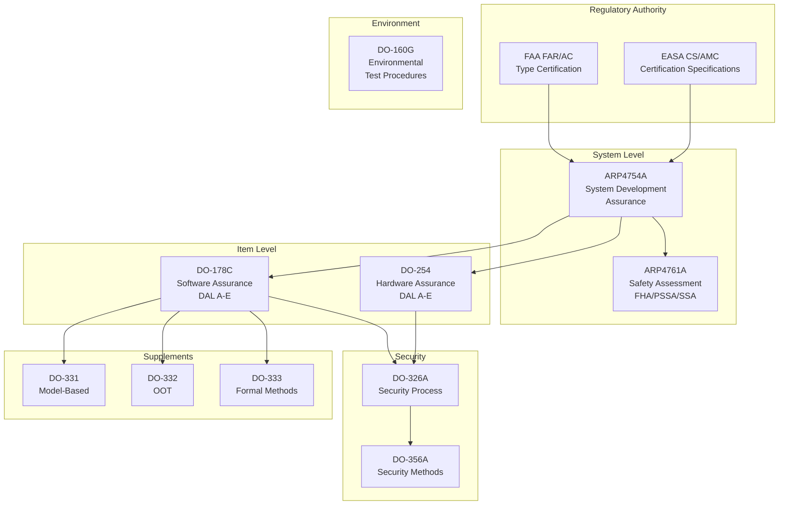
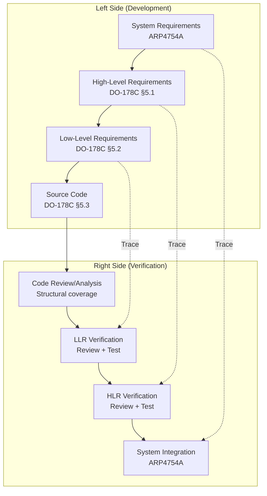
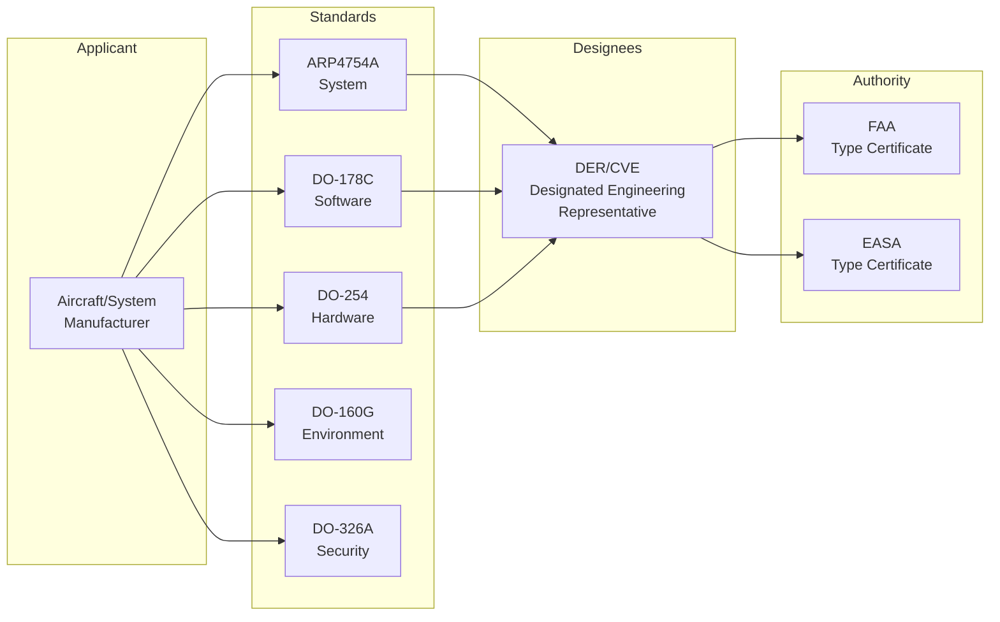
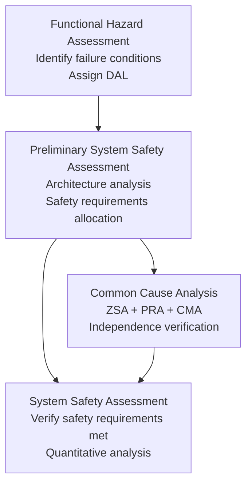

# Aerospace, Avionics & Space Standards — Overview

**Topic:** Aerospace Standards Landscape — Certification Framework, DO-178C/DO-254/ARP4754A Ecosystem, FAA/EASA Regulatory Architecture  
**Standards:** DO-178C, DO-254, ARP4754A, ARP4761A, DO-326A, DO-160G, ARINC 429/664, MIL-STD-1553, ECSS-E-ST-40C  
**SDO:** RTCA, EUROCAE, SAE, FAA, EASA, ESA/ECSS, NASA, DoD  
**Audience:** Avionics engineers, DER/CVE, safety assessors, certification engineers, systems architects  
**Prerequisites:** Systems engineering fundamentals, software/hardware design concepts, safety concepts

---

## Chapter 1 — Historical Context & Origin Story

### 1.1 Aviation Safety & Standards Timeline

| Year | Event | Impact |
|------|-------|--------|
| 1926 | US Air Commerce Act | First federal aviation regulation |
| 1944 | ICAO Chicago Convention | International civil aviation framework |
| 1958 | FAA established | US civil aviation authority created |
| 1967 | Apollo 1 fire | NASA safety culture reform |
| 1974 | DO-178 published | First avionics software guidance |
| 1982 | DO-178A | Updated software considerations |
| 1985 | Therac-25 accidents | Software safety awareness intensified |
| 1992 | DO-178B | Major revision (structured testing, MC/DC) |
| 1994 | DO-254 published | Hardware design assurance (FPGAs/ASICs) |
| 1996 | Ariane 5 Flight 501 | Software reuse without validation lesson |
| 2001 | ARP4754 published | System-level development assurance |
| 2010 | ARP4754A revision | Enhanced system development process |
| 2011 | DO-178C published | Replaced DO-178B (model-based, OOT, formal methods) |
| 2018 | DO-326A/DO-356A | Airworthiness security standards |
| 2019 | Boeing 737 MAX crashes | Certification reform, MCAS scrutiny |
| 2023 | ARP4761A revision | Updated safety assessment methods |
| 2024 | AI/ML in aviation guidance (draft) | Emerging certification framework |

### 1.2 Regulatory Bodies

| Body | Region | Scope | Key Standard |
|------|--------|-------|-------------|
| FAA | USA | Civil aviation certification | FAR Part 25, AC 20-115D |
| EASA | Europe | Civil aviation certification | CS-25, AMC 20-3 |
| RTCA | USA | Standards development (avionics) | DO-178C, DO-254, DO-160G |
| EUROCAE | Europe | Standards development (avionics) | ED-12C, ED-80 |
| SAE | Global | Systems & safety methods | ARP4754A, ARP4761A |
| ICAO | International | International aviation regulations | Annexes 1-19 |
| ECSS | Europe (ESA) | Space engineering standards | ECSS-E-ST-40C |
| NASA | USA | Space & aeronautics | NASA-STD-8739.8A |
| DoD | USA | Military avionics | MIL-STD-1553B |

---

## Chapter 2 — Standard Architecture & Structure

### 2.1 Avionics Standards Hierarchy



### 2.2 Development Assurance Levels (DAL)

| DAL | Failure Condition | Probability | Example System |
|-----|------------------|-------------|---------------|
| A | Catastrophic | < 10⁻⁹ per flight hour | Flight control primary, engine FADEC |
| B | Hazardous/Severe-Major | < 10⁻⁷ per flight hour | Autopilot, landing gear |
| C | Major | < 10⁻⁵ per flight hour | Communication, navigation |
| D | Minor | < 10⁻³ per flight hour | Passenger entertainment, cabin lighting |
| E | No safety effect | — | Non-safety displays, airline admin |

---

## Chapter 3 — Technical Deep Dive

### 3.1 DO-178C Objectives by DAL

| Activity | DAL A | DAL B | DAL C | DAL D | DAL E |
|----------|-------|-------|-------|-------|-------|
| Total objectives | 71 | 69 | 62 | 26 | 0 |
| With independence | 30 | 18 | 5 | 2 | 0 |
| Structural coverage | MC/DC | DC | SC | — | — |
| Requirements traceability | Full | Full | Full | Partial | — |
| Configuration management | Full | Full | Full | Partial | — |

**Coverage types:**
- **MC/DC** (Modified Condition/Decision Coverage): Every condition independently affects decision outcome
- **DC** (Decision Coverage): Every decision (branch) exercised true/false
- **SC** (Statement Coverage): Every statement executed at least once

### 3.2 V-Model in Avionics Development



### 3.3 Avionics Data Buses

| Bus | Standard | Speed | Topology | Domain |
|-----|----------|-------|----------|--------|
| ARINC 429 | ARINC 429 | 12.5/100 kbps | Point-to-point (1 TX, N RX) | Civil avionics |
| MIL-STD-1553 | MIL-STD-1553B | 1 Mbps | Shared bus (command/response) | Military |
| AFDX | ARINC 664 Part 7 | 100 Mbps | Switched Ethernet (deterministic) | Modern civil (A380, 787) |
| CAN Aero | ARINC 825 | 1 Mbps | CAN bus for aircraft | Small aircraft, subsystems |
| TTP | SAE AS6003 | 25 Mbps | Time-triggered bus | Safety-critical |
| SpaceWire | ECSS-E-ST-50-12C | 200 Mbps | Point-to-point serial | Spacecraft |

---

## Chapter 4 — Implementation Guide

### 4.1 DO-178C Project Planning

| Phase | Key Activities | Outputs |
|-------|---------------|---------|
| Planning | PSAC, SDP, SVP, SCM Plan, SQA Plan | Plans (5 minimum) |
| Requirements | System requirements allocation, HLR development | SRD, HLR document |
| Design | Architecture, LLR development | LLR document, ICD |
| Coding | Implementation per coding standards | Source code |
| Integration | Build, link, load | Executable object code |
| Verification | Reviews, analysis, testing | Test cases, results, coverage |
| Configuration Management | Baseline, change control | CI/audit records |
| Quality Assurance | Process compliance audits | SQA records |
| Certification Liaison | SOI reviews, DER/CVE interaction | Stage of Involvement docs |

### 4.2 Key Planning Documents (DO-178C)

| Document | Acronym | Purpose |
|----------|---------|---------|
| Plan for Software Aspects of Certification | PSAC | Roadmap for certification activities |
| Software Development Plan | SDP | Development methods, tools, standards |
| Software Verification Plan | SVP | Verification strategy, test approach |
| Software Configuration Management Plan | SCMP | CM process, baselines, change control |
| Software Quality Assurance Plan | SQAP | QA activities, audits, compliance |

---

## Chapter 5 — Certification & Audit

### 5.1 FAA Certification Process

| Stage | Activity | FAA Involvement |
|-------|----------|-----------------|
| SOI #1 | Planning review | FAA reviews PSAC, plans |
| SOI #2 | Development review | Process & standards check |
| SOI #3 | Verification review | Test results, coverage analysis |
| SOI #4 | Final review | Complete compliance package |
| Type Certificate (TC) | Approval to fly | FAA issues TC/STC |

### 5.2 Certification Cost & Timeline

| DAL | Typical Lines of Code | Cost per LOC | Total SW Cost | Timeline |
|-----|----------------------|-------------|---------------|----------|
| A | 10K-500K | $50-200/LOC | $5M-100M | 3-7 years |
| B | 10K-200K | $30-150/LOC | $2M-30M | 2-5 years |
| C | 5K-100K | $20-80/LOC | $500K-8M | 1-3 years |
| D | 5K-50K | $10-40/LOC | $100K-2M | 6-18 months |
| E | Any | $5-15/LOC | Minimal | 3-12 months |

---

## Chapter 6 — Regional & Domain Variants

| Domain | Primary Standard | Regulatory Body |
|--------|-----------------|-----------------|
| Civil transport aircraft | DO-178C + DO-254 | FAA/EASA |
| Rotorcraft | DO-178C (same) | FAA FAR Part 29 |
| Small aircraft | DO-178C (simplified via ASTM F3153) | FAA FAR Part 23 |
| UAV/UAS | Emerging (ASTM F3269, JARUS) | FAA Part 107+ |
| Military aircraft | DO-178C + MIL-STD | DoD (NAVAIR, AFLCMC) |
| Space (ESA) | ECSS-E-ST-40C, ECSS-Q-ST-80C | ESA |
| Space (NASA) | NASA-STD-8739.8A | NASA |
| Launch vehicles | FAR Part 450 (FAA AST) | FAA AST |

---

## Chapter 7 — Comparison: Avionics vs Automotive vs Medical Safety

| Aspect | DO-178C (Avionics) | ISO 26262 (Automotive) | IEC 62304 (Medical) |
|--------|--------------------|-----------------------|---------------------|
| Levels | DAL A-E | ASIL A-D | Class A-C |
| Highest level | DAL A (10⁻⁹/fh) | ASIL D (10⁻⁸/h) | Class C (death/serious) |
| Coverage (highest) | MC/DC | MC/DC (branch) | No explicit coverage |
| Independence | Mandatory (DAL A/B) | Recommended | Recommended (Class C) |
| Tool qualification | DO-330 (TQL 1-5) | ISO 26262-8 TCL/TD | IEC 62304 (limited) |
| Formal methods | DO-333 (supplement) | Not standard | Not standard |
| Security | DO-326A | ISO/SAE 21434 | IEC 81001-5-1 |
| Certification body | FAA/EASA (government) | Self-declaration + audits | FDA/notified body |
| Cost (DAL A/ASIL D) | $50-200/LOC | $20-80/LOC | $15-50/LOC |
| Maturity | ~50 years | ~15 years | ~20 years |

---

## Chapter 8 — Mermaid Architecture Diagrams

### 8.1 Complete Avionics Certification Ecosystem



### 8.2 Safety Assessment Process (ARP4761A)



---

## Chapter 9 — Case Studies & Failure Analysis

### 9.1 Ariane 5 Flight 501 (1996)

| Aspect | Detail |
|--------|--------|
| Event | Self-destruction 37 seconds after launch |
| Root cause | Integer overflow: 64-bit float → 16-bit integer conversion |
| Software reused | Inertial Reference System code from Ariane 4 |
| Validation failure | Code not re-validated for Ariane 5 trajectory (higher values) |
| Lesson | Software reuse requires re-validation in new operational context |
| Standard impact | Strengthened requirements traceability in ECSS standards |

### 9.2 Boeing 737 MAX (2018-2019)

| Aspect | Detail |
|--------|--------|
| Events | Lion Air 610 (Oct 2018), Ethiopian 302 (Mar 2019): 346 fatalities |
| Root cause | MCAS (Maneuvering Characteristics Augmentation System) design |
| Contributing factors | Single AoA sensor input, insufficient pilot training, certification gaps |
| Certification failure | FAA delegated authority to Boeing (ODA); insufficient oversight |
| Reform | FAA reauthorization (2020), JATR recommendations, increased independence |
| Standard impact | Renewed focus on system-level safety assessment (ARP4754A/4761A) |

---

## Chapter 10 — Future Evolution & Industry Trends

| Trend | Timeline | Description |
|-------|----------|-------------|
| AI/ML in avionics | 2024-2030 | EASA AI concept paper, DO-178C for ML (W-shaped lifecycle) |
| Autonomous flight | 2025-2035 | Urban air mobility (eVTOL), autonomous cargo |
| DO-178C modernization | 2025+ | Discussion on next revision (DO-178D?) |
| Model-based certification | Growing | DO-331 adoption increasing |
| Multi-core guidance | 2024+ | CAST-32A/AMC 20-193 for multi-core processors |
| Cybersecurity emphasis | Now | DO-326A/DO-356A mandatory for new programs |
| Digital thread | Growing | End-to-end traceability (requirements → field data) |
| COTS in avionics | Growing | Commercial off-the-shelf with partitioning (ARINC 653) |

---

## Chapter 11 — Interview Questions & Career Guide

### Tier 1: Entry-Level

**Q1:** What are the Development Assurance Levels (DAL) and how are they determined?  
**A:** DALs (A through E) represent the rigor of development assurance required based on the severity of failure conditions. **Determination process:** (1) ARP4754A Functional Hazard Assessment (FHA) identifies what happens if a function fails. (2) Failure severity classified: Catastrophic → DAL A, Hazardous → DAL B, Major → DAL C, Minor → DAL D, No effect → DAL E. (3) Probability requirements: DAL A < 10⁻⁹/flight-hour, DAL B < 10⁻⁷/fh, DAL C < 10⁻⁵/fh. (4) DAL flows down to software (DO-178C) and hardware (DO-254). **Impact on development:** DAL A requires 71 objectives (MC/DC coverage, independence). DAL D requires only 26 objectives (minimal verification). Cost difference: 10-50× between DAL A and DAL D.

### Tier 2: Mid-Level

**Q2:** Explain how DO-178C, DO-254, and ARP4754A work together in a certification program.  
**A:** **Three-layer framework:** (1) **ARP4754A (System level):** Defines development assurance process for aircraft/systems. Performs FHA → assigns DALs. Allocates safety requirements to software and hardware items. Ensures system architecture supports safety (independence, dissimilarity). (2) **DO-178C (Software):** Applies to all airborne software at assigned DAL. Defines objectives for planning, development, verification, CM, QA. Produces evidence: test results, coverage analysis, traceability. (3) **DO-254 (Hardware):** Applies to complex electronic hardware (FPGAs, ASICs, PLDs). Mirrors DO-178C structure for hardware design assurance. Covers design, verification, CM, process assurance. **Interaction flow:** ARP4754A → allocates functions and DALs → DO-178C (software items) + DO-254 (hardware items). System-level verification (ARP4754A) confirms software + hardware integration meets system requirements. Safety assessment (ARP4761A) runs in parallel, informing architecture decisions.

### Tier 3: Senior/Distinguished

**Q3:** You're the DER for a DAL A flight control system using a multi-core processor. What certification challenges exist and how do you address them?  
**A:** **Multi-core challenges (CAST-32A / AMC 20-193):** (1) **Interference channels:** Shared resources (cache, memory bus, I/O) create coupling between cores. DAL A requires demonstrating that interference between partitions cannot cause failure. Must identify all interference channels: shared L2/L3 cache, memory controller bandwidth, shared peripherals, interrupt routing. (2) **Resource partitioning:** Robust partitioning (temporal + spatial) per ARINC 653. Each partition has guaranteed time slice (TDMA scheduling). Memory protection (MMU/MPU) between partitions. Worst-Case Execution Time (WCET) must account for interference. (3) **Certification approach:** (a) Identify all shared resources (hardware analysis). (b) Demonstrate robust partitioning OR demonstrate no interference (testing + analysis). (c) WCET analysis must include multi-core interference overhead. (d) Exhaust testing: run maximum interference patterns while measuring timing. (e) Configuration lockdown: disable unused cores, fix cache partitioning. (4) **Mitigation strategies:** Disable all but one core (simplest, but wastes resources). Hardware cache partitioning (ARM MPAM, Intel CAT). Memory bandwidth reservation per partition. Time-triggered architecture (deterministic scheduling). Lockstep mode (for DAL A redundancy). (5) **Evidence required:** Multi-core interference analysis document. WCET analysis including interference. Robust partitioning demonstration. Integration test with interference injection. Configuration management of RTOS/hypervisor settings.

---

## Chapter 12 — Cheat Sheet & Quick Reference

### Standards Quick Reference

```
System Level:    ARP4754A (development) + ARP4761A (safety assessment)
Software:        DO-178C (+ supplements DO-331/332/333)
Hardware:        DO-254 (FPGAs, ASICs, complex PLDs)
Environment:     DO-160G (environmental testing)
Security:        DO-326A (process) + DO-356A (methods)
Data Bus:        ARINC 429 (legacy) → AFDX/ARINC 664 (modern)
Military Bus:    MIL-STD-1553B (command/response)
Space:           ECSS-E-ST-40C (ESA) / NASA-STD-8739.8A (NASA)
```

### DAL Quick Decision

```
Can failure kill everyone?         → DAL A (Catastrophic, 10⁻⁹/fh)
Can failure injure/impair crew?    → DAL B (Hazardous, 10⁻⁷/fh)
Can failure cause significant work? → DAL C (Major, 10⁻⁵/fh)
Can failure cause minor nuisance?  → DAL D (Minor, 10⁻³/fh)
No safety effect at all?          → DAL E (No objectives)
```

### Certification Tips

```
DO-178C: Plan early (PSAC), trace everything, independence for DAL A/B
DO-254: Same rigor as DO-178C for complex hardware (DAL A/B/C)
ARP4754A: Start with FHA → DAL assignment drives everything
DO-160G: Environmental testing (vibration, temp, EMI) — test early
Security (DO-326A): Now mandatory for new programs — integrate early
Tools: Qualify to DO-330 (TQL depends on tool's role and DAL)
```

---

*End of Document — 00_Aerospace_Standards_Overview.md*
