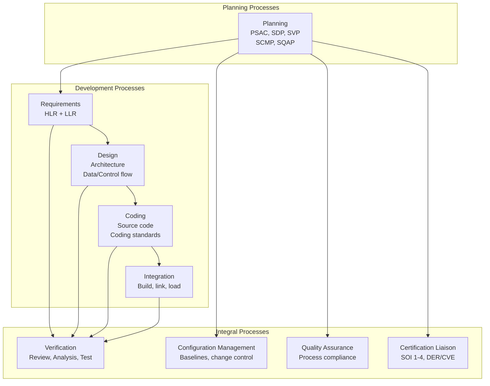
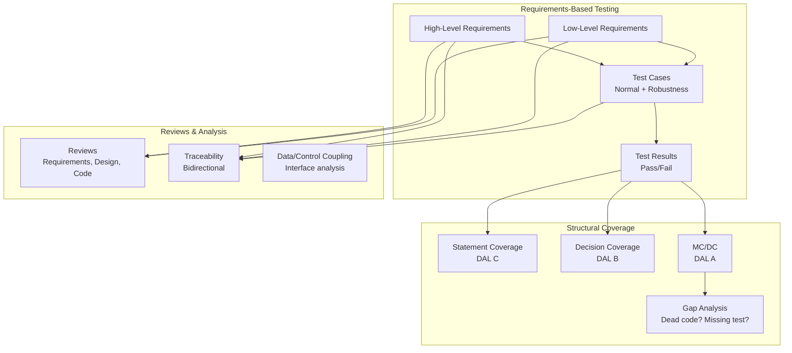
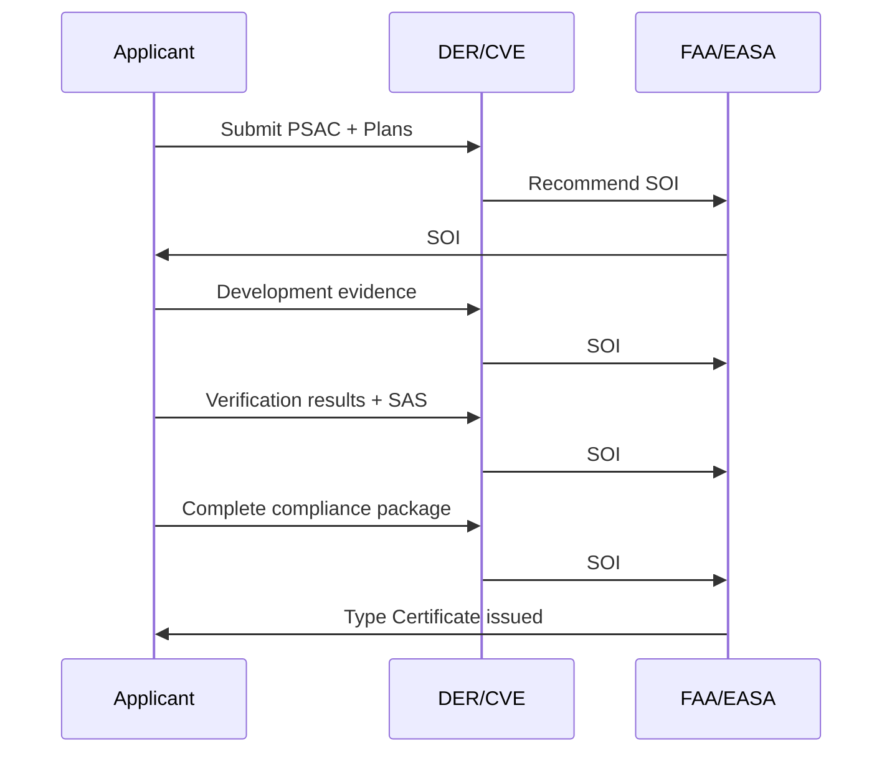

# DO-178C — Software Considerations in Airborne Systems

**Topic:** DO-178C / ED-12C — Avionics Software Development & Verification Assurance  
**Standards:** RTCA DO-178C (2011), EUROCAE ED-12C, Supplements DO-331/332/333, DO-330  
**SDO:** RTCA (Radio Technical Commission for Aeronautics), EUROCAE  
**Audience:** Avionics software engineers, DERs (Designated Engineering Representatives), certification engineers, QA leads, project managers  
**Prerequisites:** Software engineering fundamentals, V-model development, embedded systems, basic safety concepts

---

## Chapter 1 — Historical Context & Origin Story

### 1.1 DO-178 Evolution

| Version | Year | Key Change |
|---------|------|-----------|
| DO-178 | 1974 | First guidance for airborne software |
| DO-178A | 1985 | Structured programming emphasis |
| DO-178B | 1992 | Formal objectives, MC/DC coverage, process-based |
| DO-178C | 2011 | Model-based (DO-331), OOT (DO-332), Formal Methods (DO-333), Tool Qualification (DO-330) |

### 1.2 Key Differences: DO-178B vs DO-178C

| Aspect | DO-178B (1992) | DO-178C (2011) |
|--------|---------------|----------------|
| Model-based development | Not addressed | DO-331 supplement |
| Object-oriented | Not addressed | DO-332 supplement |
| Formal methods | Not addressed | DO-333 supplement |
| Tool qualification | Briefly mentioned | Full standard (DO-330) |
| Parameter data | Limited | Explicit guidance (§2.4.1) |
| Reuse/PLE | Limited | Enhanced guidance |
| Traceability | Required | Emphasized bidirectional |

### 1.3 Industry Context

| Event | Year | Lesson for DO-178C |
|-------|------|-------------------|
| Ariane 5 crash | 1996 | Reuse without revalidation |
| Boeing 777 certification | 1995 | First large-scale DO-178B DAL A |
| A380 development | 2005 | AFDX, massive software scale |
| Therac-25 radiation incidents | 1985 | Software safety without hardware interlocks |
| Boeing 737 MAX | 2019 | System-level assumptions, single-sensor |

---

## Chapter 2 — Standard Architecture & Structure

### 2.1 DO-178C Document Structure

| Section | Title | Content |
|---------|-------|---------|
| 1 | Introduction | Purpose, scope, relationship to other documents |
| 2 | System aspects | Interface with ARP4754A, safety requirements |
| 3 | Software life cycle | Processes (planning through integral) |
| 4 | Software planning | Plans (PSAC, SDP, SVP, SCMP, SQAP) |
| 5 | Software development | Requirements, design, coding, integration |
| 6 | Software verification | Reviews, analysis, testing |
| 7 | Software configuration management | Baselines, change control, archival |
| 8 | Software quality assurance | Compliance, audits, issue reporting |
| 9 | Certification liaison | SOI, compliance matrix, DER interaction |
| 10 | Overview of aircraft/engine certification | Regulatory framework |
| 11 | Software life cycle data | Document descriptions |
| 12 | Additional considerations | PLE, user-modifiable SW, COTS |
| Annex A | Objectives tables | Tables A-1 through A-10 |

### 2.2 DO-178C Process Model



---

## Chapter 3 — Technical Deep Dive

### 3.1 Objectives by Process Area (Annex A)

| Table | Process | DAL A | DAL B | DAL C | DAL D |
|-------|---------|-------|-------|-------|-------|
| A-1 | Planning | 7 | 7 | 7 | 3 |
| A-2 | Development (Requirements) | 7 | 7 | 7 | 3 |
| A-3 | Development (Design) | 13 | 13 | 9 | 5 |
| A-4 | Development (Coding/Integration) | 9 | 9 | 9 | 4 |
| A-5 | Verification (Requirements) | 7 | 7 | 6 | 2 |
| A-6 | Verification (Design) | 5 | 5 | 4 | 2 |
| A-7 | Verification (Code) | 9 | 7 | 6 | 2 |
| A-8 | Testing | 7 | 7 | 7 | 2 |
| A-9 | Configuration Management | 6 | 6 | 6 | 3 |
| A-10 | Quality Assurance | 1 | 1 | 1 | 0 |
| **Total** | | **71** | **69** | **62** | **26** |

### 3.2 Structural Coverage Criteria

| Coverage Type | DAL | Definition |
|--------------|-----|-----------|
| MC/DC (Modified Condition/Decision) | A | Every condition independently shown to affect decision outcome |
| DC (Decision Coverage) | B | Every branch point exercised both true and false |
| SC (Statement Coverage) | C | Every statement executed at least once |
| None required | D/E | No structural coverage mandated |

**MC/DC Example:**

For decision: `(A AND B) OR C`

| Test | A | B | C | Result | Demonstrates |
|------|---|---|---|--------|-------------|
| 1 | T | T | F | T | A affects (compare T5) |
| 2 | T | F | F | F | B affects (compare T1) |
| 3 | F | T | F | F | A affects (compare T1) |
| 4 | F | F | T | T | C affects (compare T3) |
| 5 | F | T | T | T | Baseline |

Minimum MC/DC: N+1 tests for N conditions (in best case).

### 3.3 Verification Activities

| Activity | Purpose | Method |
|----------|---------|--------|
| Requirements-based testing | Verify each requirement | Test cases from requirements |
| Structural coverage analysis | Verify code exercised | Coverage tool, gap analysis |
| Requirements review | Check correctness, completeness | Inspection/checklist |
| Design review | Architecture adequacy | Inspection/checklist |
| Code review | Coding standards compliance | Inspection/analysis |
| Data/control coupling analysis | Interface correctness | Analysis/testing |
| Traceability analysis | Bidirectional trace | Matrix verification |
| Robustness testing | Behavior under abnormal inputs | Test with invalid inputs |

### 3.4 Tool Qualification (DO-330)

| Tool Qualification Level (TQL) | Criteria | Example |
|-------------------------------|----------|---------|
| TQL-1 | Tool could insert error (DAL A/B) AND output not verified | Code generator for DAL A |
| TQL-2 | Tool could insert error (DAL C) AND output not verified | Code generator for DAL C |
| TQL-3 | Tool could insert error (DAL D) AND output not verified | Code generator for DAL D |
| TQL-4 | Tool could fail to detect error (DAL A/B) | Coverage analyzer, static analysis |
| TQL-5 | Tool could fail to detect error (DAL C/D) | Test result checker for DAL C |

**Criteria 1 (TQL-1/2/3):** Tool output is part of airborne software (e.g., auto-code generator). If tool has error, airborne code has error.

**Criteria 2 (TQL-4/5):** Tool used to verify (e.g., test tool, coverage analyzer). If tool fails, verification is inadequate.

---

## Chapter 4 — Implementation Guide

### 4.1 Project Lifecycle Phases

| Phase | Duration (DAL A, 100K LOC) | Key Deliverables |
|-------|--------------------------|------------------|
| Planning | 3-6 months | PSAC, SDP, SVP, SCMP, SQAP |
| Requirements | 6-12 months | HLR, LLR, traceability matrix |
| Design & Coding | 12-24 months | Source code, architecture doc |
| Verification | 12-24 months | Test cases, results, coverage |
| Certification | 6-12 months | SAS, SOI reviews, final package |
| **Total** | **3-7 years** | Complete certification evidence |

### 4.2 Key Documents (Software Life Cycle Data)

| Document | Section | Content |
|----------|---------|---------|
| PSAC | §11.1 | Certification roadmap, compliance method |
| SDP | §11.2 | Dev process, methods, standards |
| SVP | §11.3 | Verification approach, test strategy |
| SCMP | §11.4 | CM tools, baselines, change process |
| SQAP | §11.5 | QA audits, reviews, non-compliance handling |
| SRS (HLR) | §11.9 | High-level software requirements |
| SDD (LLR + Design) | §11.10 | Detailed design, low-level requirements |
| Source Code | §11.11 | Implementation |
| Test Cases/Procedures | §11.13 | Test definitions, expected results |
| Test Results | §11.14 | Actual results, pass/fail |
| SCI (Software Configuration Index) | §11.16 | List of configuration items |
| SAS (Software Accomplishment Summary) | §11.20 | Compliance summary for certification |

### 4.3 Coding Standards (Typical DAL A/B)

| Standard | Domain | Key Rules |
|----------|--------|----------|
| MISRA C:2012 | C language | 175 rules (mandatory/advisory) |
| MISRA C++:2023 | C++ language | Modern C++ rules |
| JSF++ (AV Rule) | C++ for avionics | 222 rules (Joint Strike Fighter) |
| CERT C | C security | Secure coding rules |
| JPL C Rules | C for space | 10 rules (NASA/JPL) |

---

## Chapter 5 — Certification & Audit

### 5.1 Stage of Involvement (SOI) Reviews

| SOI | Timing | Purpose | Authority Focus |
|-----|--------|---------|-----------------|
| SOI #1 | Planning complete | Review plans, PSAC | Are plans adequate for DAL? |
| SOI #2 | Development in progress | Review processes | Are processes being followed? |
| SOI #3 | Verification complete | Review results | Are objectives satisfied? |
| SOI #4 | Before TC/STC | Final compliance | Is evidence complete and correct? |

### 5.2 Common Certification Findings

| Finding Category | Example | Impact |
|----------------|---------|--------|
| Traceability gaps | Requirements not traced to tests | Rework (add test cases) |
| Coverage gaps | MC/DC not achieved (dead code) | Deactivated code justification or removal |
| Independence violation | Same person reviewed and developed | Re-review with independent reviewer |
| CM deficiency | Baseline inconsistency | Rebuild + re-verify |
| Coding standard violation | Unresolved MISRA deviations | Document deviation or fix code |
| Tool qualification | Tool not qualified to appropriate TQL | Qualify tool or manually verify output |

---

## Chapter 6 — Regional & Domain Variants

### 6.1 DO-178C Equivalents

| Standard | Region | Equivalent To |
|----------|--------|--------------|
| DO-178C | USA (RTCA) | Avionics software |
| ED-12C | Europe (EUROCAE) | Same content as DO-178C |
| STANAG 4404 | NATO | Military avionics software |
| GOST R | Russia | National adaptation |
| CAAC AC-21-SFDC | China | Based on DO-178C |

### 6.2 Military Adaptations

| Standard | Application |
|----------|-------------|
| MIL-STD-882E | System safety (military) — interfaces with DO-178C |
| DO-178C + FACE | Future Airborne Capability Environment (portability) |
| DEF STAN 00-55 | UK military safety-critical software (historical) |
| MIL-HDBK-516C | Airworthiness (uses DO-178C for SW) |

---

## Chapter 7 — Comparison: DO-178C Supplements

| Aspect | DO-331 (Model-Based) | DO-332 (OOT) | DO-333 (Formal Methods) |
|--------|---------------------|--------------|------------------------|
| Scope | Models as development/verification artifacts | Inheritance, polymorphism, overloading | Mathematical proofs for verification |
| Benefit | Early verification, auto-code generation | Modern languages (C++, Java, Ada 2012) | Replace testing with proofs (coverage) |
| Challenge | Model coverage criteria, qualified tools | Structural coverage of dynamic dispatch | Proof tool qualification, scalability |
| DAL applicability | All DALs | All DALs | All DALs (most valuable at DAL A) |
| Industry adoption | High (Simulink, SCADE) | Growing (C++ in avionics) | Niche (Airbus, specific applications) |
| Tool examples | SCADE, Simulink, TargetLink | Polyspace, Frama-C | Astree, CompCert, SPARK/Ada |

---

## Chapter 8 — Mermaid Architecture Diagrams

### 8.1 DO-178C Verification Flow



### 8.2 Certification Liaison Flow



---

## Chapter 9 — Case Studies & Failure Analysis

### 9.1 DO-178C DAL A Success: Fly-By-Wire Flight Control

**System:** Primary flight control computer (DAL A).

**Statistics:** ~200K lines of Ada code. 4-year development cycle. MC/DC coverage: 100% (no dead code). 15,000+ test cases. 3 independent verification teams. Zero post-certification safety defects in 15 years of operation.

**Key practices:** (1) Formal specification (SPARK Ada — contracts proven at compile time). (2) Auto-code generation from SCADE model (DO-330 TQL-1 qualified tool). (3) Independent verification team (different organization). (4) 100% bidirectional traceability (requirements ↔ tests ↔ code). (5) Robustness testing for all interface boundaries.

### 9.2 MC/DC Coverage Challenge

**Problem:** Legacy code at DAL B (DC only) being upgraded to DAL A (MC/DC required).

**Approach:** (1) Ran existing tests with MC/DC measurement → 72% MC/DC (insufficient). (2) Analyzed uncovered conditions → identified 200+ conditions needing additional tests. (3) Some uncovered conditions were unreachable (defensive coding) → documented as "dead code" or justified. (4) Added 800 new test cases → achieved 100% MC/DC (excluding justified dead code). (5) Total rework: 6 months, $2M additional cost.

**Lesson:** Consider target DAL from project start. Upgrading DAL mid-program is expensive.

---

## Chapter 10 — Future Evolution & Industry Trends

| Trend | Timeline | Description |
|-------|----------|-------------|
| DO-178C for ML/AI | 2024-2030 | EASA AI concept paper, W-shaped lifecycle, learning assurance |
| Multi-core (CAST-32A) | Now | Interference analysis, partitioning evidence |
| Model-based adoption | Growing | SCADE, Simulink auto-code generation (DO-331) |
| DevSecOps for avionics | Emerging | CI/CD adapted for DO-178C processes |
| COTS qualification | Growing | Linux in partitioned avionics (ARINC 653) |
| Formal methods | Growing | SPARK Ada proving, CompCert verified compiler |
| Product line engineering (PLE) | Growing | 150% model, variability management |
| Cybersecurity integration | Now | DO-326A/356A as companion to DO-178C |
| Agile in DO-178C | Cautious | Iterative development within DO-178C framework |

---

## Chapter 11 — Interview Questions & Career Guide

### Tier 1: Entry-Level

**Q1:** What is the purpose of DO-178C and what are its key objectives?  
**A:** DO-178C provides guidance for producing airborne software that performs its intended function with a level of confidence appropriate to the software's contribution to aircraft safety. **Key aspects:** (1) Process-based assurance (not product certification — certifies the development process). (2) 71 objectives (DAL A) covering: planning, requirements, design, coding, verification, CM, QA. (3) Evidence-based: produces artifacts (plans, requirements, test results, traces) that demonstrate compliance. (4) Accepted by FAA (AC 20-115D) and EASA (AMC 20-3) as acceptable means of compliance. (5) Applied at item level (software component), not system level (that's ARP4754A).

### Tier 2: Mid-Level

**Q2:** Explain MC/DC coverage and why it's required for DAL A.  
**A:** **MC/DC (Modified Condition/Decision Coverage):** Requires that every condition in a decision is shown to independently affect the decision's outcome. **Why DAL A:** (1) DAL A = Catastrophic failure condition (< 10⁻⁹/fh). Maximum assurance needed. (2) MC/DC reveals masking: conditions that appear tested but are masked by other conditions in complex boolean expressions. (3) Catches dead conditions: code that can never influence execution (dead code or unreachable conditions). (4) More thorough than DC (Decision Coverage): DC tests T/F of entire decision. MC/DC tests each condition's independent effect. **Example:** For `(A && B) || C`: DC only needs 2 tests (decision T, decision F). MC/DC needs minimum 4 tests (each of A, B, C shown to independently flip the outcome). **Practical impact:** MC/DC typically requires 2-5× more test cases than DC. Drives better understanding of code logic. Forces removal of dead code or justification.

### Tier 3: Senior/Distinguished

**Q3:** How would you architect a DO-178C DAL A project using model-based development (DO-331)?  
**A:** **Architecture:** (1) **Modeling tool:** SCADE Suite or Simulink/Embedded Coder (with DO-330 TQL-1 qualification kit). (2) **Model as specification:** High-Level Requirements expressed as formal SCADE models. Models are simulatable → early requirements validation. Model review replaces traditional HLR document review (or model IS the HLR). (3) **Code generation:** Qualified code generator (TQL-1) → generated code does not need code review (trusted output). Generated code + hand-written interface code (glue code manually reviewed). (4) **Verification strategy:** Model-level testing: test cases execute against model (fast iteration). Model coverage analysis (MC/DC at model level per DO-331). Auto-generated test harness from model. Code-level structural coverage: verify generated code matches model intent. If code generator is TQL-1 qualified → model coverage can satisfy code coverage (with mapping analysis). (5) **Traceability:** System Requirements → Model Elements → Generated Code → Object Code. Test Cases → Model Requirements → System Requirements. Bidirectional, automated (tool-supported). (6) **Benefits vs traditional:** Earlier defect detection (model simulation before coding). Reduced verification cost (model-level MC/DC faster than code-level). Consistent code quality (no human coding errors in generated portions). Faster iteration (model change → regenerate → re-run model tests). (7) **Challenges:** Tool qualification effort (TQL-1 is significant — DO-330 compliance). Model complexity management (large models need good architecture). Glue code still needs traditional DO-178C verification. Model traceability to system requirements requires discipline.

---

## Chapter 12 — Cheat Sheet & Quick Reference

### DO-178C Essentials

```
Purpose:      Guidance for airborne software certification
Replaces:     DO-178B (1992)
Equivalent:   ED-12C (EUROCAE)
Recognized:   FAA AC 20-115D, EASA AMC 20-3
Objectives:   DAL A=71, B=69, C=62, D=26, E=0
Coverage:     DAL A=MC/DC, B=DC, C=SC, D/E=None
Supplements:  DO-331 (Model), DO-332 (OOT), DO-333 (Formal Methods)
Tool Qual:    DO-330 (TQL 1-5)
Plans:        PSAC, SDP, SVP, SCMP, SQAP (5 minimum)
Final Doc:    SAS (Software Accomplishment Summary)
Reviews:      SOI #1 (Plan), #2 (Dev), #3 (Verify), #4 (Final)
```

### Common Pitfalls

```
❌ Starting MC/DC analysis late (find gaps early)
❌ Insufficient independence for DAL A/B reviews
❌ Untraced requirements (every req needs test + code trace)
❌ Dead code without justification (remove or document)
❌ Tool used without qualification (DO-330)
❌ COTS software used without proper credit/qualification
❌ Deferred defects (open PRs at certification time)
❌ CM baseline inconsistency (rebuild before SOI)
```

### Quick Decisions

```
Need code generator?  → TQL-1 (if output not independently verified)
Need test tool?      → TQL-4/5 (depending on DAL)
Using C++ at DAL A?  → Apply DO-332 + restrict features
Using Simulink?      → Apply DO-331, qualify code gen (TQL-1)
Want fewer tests?    → Formal methods (DO-333) can replace testing
Reusing software?    → Evaluate change impact + re-verify affected
```

---

*End of Document — 01_DO_178C_Avionics_Software.md*
