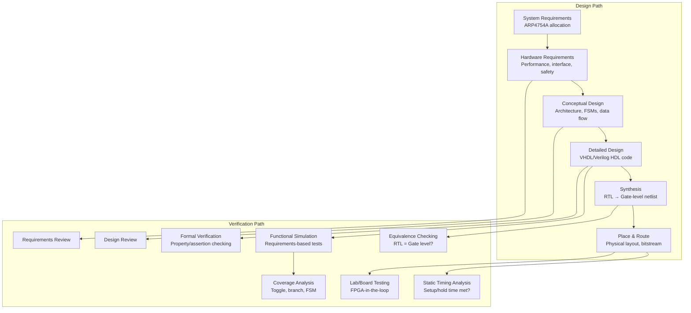

# DO-254 — Design Assurance for Airborne Electronic Hardware

**Topic:** DO-254 / ED-80 — Hardware Design Assurance for FPGAs, ASICs, PLDs in Avionics  
**Standards:** RTCA DO-254 (2000), EUROCAE ED-80, FAA AC 20-152A, EASA AMC 20-152A  
**SDO:** RTCA, EUROCAE, FAA, EASA  
**Audience:** FPGA/ASIC design engineers, hardware verification engineers, DERs, certification managers  
**Prerequisites:** Digital design fundamentals (VHDL/Verilog), FPGA design flow, basic safety concepts, DO-178C awareness

---

## Chapter 1 — Historical Context & Origin Story

### 1.1 DO-254 Timeline

| Year | Event |
|------|-------|
| 1994 | DO-254 published (Design Assurance Guidance for Airborne Electronic Hardware) |
| 2000 | FAA Advisory Circular AC 20-152 (acceptance of DO-254) |
| 2005 | Industry adoption begins (FPGA complexity increasing) |
| 2008 | FAA Order 8110.105 (guidance on complex hardware) |
| 2010 | CAST papers (Certification Authorities Software Team) on hardware |
| 2016 | EASA AMC 20-152A published |
| 2019 | Increased enforcement (modern FPGAs = essentially software) |
| 2024 | DO-254 revision discussions (addressing modern SoC/FPGA complexity) |

### 1.2 Why DO-254 Exists

| Factor | Pre-DO-254 | Post-DO-254 |
|--------|-----------|-------------|
| Hardware complexity | Simple SSI/MSI logic (verifiable by inspection) | Complex FPGAs with millions of gates |
| Design method | Schematic capture, truth tables | HDL (VHDL/Verilog), IP cores, synthesis |
| Failure modes | Component failures (addressed by DO-160G, derating) | Design errors (logic bugs in HDL) |
| Verification | Board-level test (boundary scan, functional) | Simulation, formal, FPGA-in-the-loop |
| Assumption | "Hardware doesn't have bugs" | Complex hardware has software-like design errors |

---

## Chapter 2 — Standard Architecture & Structure

### 2.1 DO-254 Document Structure

| Section | Title | Content |
|---------|-------|---------|
| 1 | Introduction | Scope, applicability |
| 2 | System aspects | Relationship to ARP4754A, safety |
| 3 | Hardware design life cycle | Planning through certification liaison |
| 4 | Planning | PHAC, plans |
| 5 | Hardware design | Requirements, conceptual design, detailed design |
| 6 | Validation & verification | Reviews, analysis, testing |
| 7 | Configuration management | CM process for hardware |
| 8 | Process assurance | QA for hardware process |
| 9 | Certification liaison | SOI, compliance evidence |
| 10 | Hardware design life cycle data | Document descriptions |
| 11 | Additional considerations | COTS, IP cores, PLD types |
| Appendix A | Hardware design assurance table | Objectives by DAL |
| Appendix B | Hardware design considerations | Complex vs simple |

### 2.2 When DO-254 Applies

| Device Type | DO-254 Required? | Rationale |
|-------------|------------------|-----------|
| FPGA (complex) | Yes (DAL A-C mandatory) | Complex programmable device |
| ASIC | Yes | Custom logic design |
| CPLD (complex) | Yes | Programmable logic |
| Simple PLD (PAL/GAL) | Maybe (if complex function) | Depends on complexity |
| Discrete logic (74xx) | No | Simple, verifiable by inspection |
| Microprocessor (COTS) | No (software → DO-178C) | Hardware qualification by usage |
| SoC with programmable logic | Yes (for programmable portion) | Mixed: DO-178C (SW) + DO-254 (HW) |

### 2.3 DO-254 Process Model

```mermaid
graph TB
    subgraph "Planning"
        PHAC[Plan for Hardware<br/>Aspects of Certification<br/>(PHAC)]
        HDP[Hardware Design Plan]
        HVP[Hardware Verification Plan]
        HCMP[HW CM Plan]
        HPAP[HW Process Assurance Plan]
    end
    
    subgraph "Design"
        REQ[Requirements Capture<br/>Hardware requirements]
        CONCEPT[Conceptual Design<br/>Architecture, partitioning]
        DETAIL[Detailed Design<br/>HDL coding, synthesis]
        IMPL[Implementation<br/>Place & route, timing closure]
    end
    
    subgraph "Verification"
        SIM[Simulation<br/>Functional verification]
        FORMAL[Formal Verification<br/>Property checking]
        LAB[Lab Testing<br/>FPGA-in-the-loop]
        COV[Coverage Analysis<br/>Code + functional]
    end
    
    subgraph "Integral"
        CM[Configuration Management]
        PA[Process Assurance]
        CL[Certification Liaison]
    end
    
    PHAC --> REQ --> CONCEPT --> DETAIL --> IMPL
    IMPL --> SIM --> COV
    IMPL --> FORMAL
    IMPL --> LAB
```

---

## Chapter 3 — Technical Deep Dive

### 3.1 DO-254 Objectives by DAL

| Category | DAL A | DAL B | DAL C | DAL D | DAL E |
|----------|-------|-------|-------|-------|-------|
| Planning | Yes | Yes | Yes | Yes | — |
| Requirements | Yes | Yes | Yes | Partial | — |
| Conceptual design | Yes | Yes | Yes | Yes | — |
| Detailed design | Yes | Yes | Yes | Partial | — |
| HDL coding | Yes | Yes | Yes | Partial | — |
| Verification | Yes | Yes | Yes | Partial | — |
| Coverage analysis | Yes | Yes | Reduced | — | — |
| Configuration management | Full | Full | Full | Reduced | — |
| Process assurance | Full | Full | Full | Reduced | — |

### 3.2 Hardware Design Levels

| Level | Name | Content |
|-------|------|---------|
| Requirements | Hardware requirements | Functional, performance, interface, safety |
| Conceptual design | Architecture | Block diagram, data flow, partitioning decisions |
| Detailed design | HDL design | VHDL/Verilog source, timing constraints |
| Implementation | Physical design | Synthesis, P&R, bitstream/GDSII |

### 3.3 Verification Methods

| Method | Applicability | Coverage |
|--------|-------------|----------|
| Requirements-based simulation | All DALs | Functional correctness |
| Formal property checking | DAL A/B | Exhaustive proof (bounded) |
| Structural coverage (HDL) | DAL A/B/C | Toggle, statement, branch, expression |
| FPGA-in-the-loop testing | All DALs | Real hardware behavior |
| Timing analysis (STA) | All DALs | Meet timing constraints |
| Equivalence checking | All DALs | RTL vs gate-level match |
| Power analysis | All DALs | Power consumption verification |
| Environmental testing (DO-160G) | All DALs | Temperature, vibration, EMI |

### 3.4 Coverage Metrics for DO-254

| Coverage Type | DAL A | DAL B | DAL C | Description |
|--------------|-------|-------|-------|-------------|
| Toggle coverage | Yes | Yes | Reduced | Each signal toggled 0→1 and 1→0 |
| Statement coverage | Yes | Yes | Yes | Each HDL statement executed |
| Branch/decision coverage | Yes | Yes | Reduced | Each decision true/false |
| Expression coverage | DAL A only | — | — | Each condition independently affects expression |
| FSM coverage | Yes | Yes | Yes | All states visited, all transitions taken |
| Functional coverage | Yes | Yes | Yes | User-defined coverage points |

### 3.5 Simple vs Complex Hardware

| Criterion | Simple | Complex |
|-----------|--------|---------|
| Technology | Discrete, simple PAL/GAL | FPGA, ASIC, complex CPLD |
| Verification | Inspection/test sufficient | DO-254 process required |
| Design errors | Manufacturing defects dominant | Design errors dominant |
| Gate count guideline | < ~1000 equivalent gates (informal) | > 1000 gates |
| DO-254 applicability | Limited (traditional hardware qualification) | Full DO-254 |

---

## Chapter 4 — Implementation Guide

### 4.1 FPGA Design Flow (DO-254 Compliant)

| Step | Activity | DO-254 Mapping |
|------|----------|---------------|
| 1 | Capture requirements from system | Requirements (§5.1) |
| 2 | Architecture design (block diagram) | Conceptual design (§5.2) |
| 3 | HDL coding (VHDL/Verilog) | Detailed design (§5.3) |
| 4 | Functional simulation | V&V (§6) |
| 5 | Synthesis (RTL → netlist) | Implementation |
| 6 | Place & Route | Implementation |
| 7 | Static Timing Analysis (STA) | V&V |
| 8 | Equivalence checking (RTL vs gate) | V&V |
| 9 | Coverage analysis | V&V (§6.3) |
| 10 | Lab testing (FPGA board) | V&V |
| 11 | Environmental testing (DO-160G) | Qualification |
| 12 | Configuration management | CM (§7) |

### 4.2 Tool Chain (Typical DO-254)

| Tool | Purpose | Vendor Examples |
|------|---------|----------------|
| HDL editor/lint | Coding, style checking | Aldec, Mentor/Siemens |
| Simulator | Functional verification | ModelSim/Questa, VCS, Xcelium |
| Formal verifier | Property checking | JasperGold, VC Formal, Questa Formal |
| Synthesis | RTL → netlist | Vivado (Xilinx), Quartus (Intel) |
| P&R | Physical implementation | Vivado, Quartus, Libero (Microchip) |
| STA | Timing analysis | Vivado, Quartus (built-in), PrimeTime |
| Coverage | Structural + functional | Questa, VCS, Xcelium |
| Equivalence checking | RTL vs gate-level | Conformal (Cadence), Formality (Synopsys) |
| Requirements management | Traceability | DOORS, Jama, Polarion |

### 4.3 FPGA Selection for DO-254

| Vendor | Family | Features | DO-254 Support |
|--------|--------|----------|---------------|
| Xilinx (AMD) | Zynq UltraScale+ | FPGA + ARM (SoC) | Configuration monitoring, SEU mitigation |
| Intel (Altera) | Stratix/Agilex | High-performance | Triple Module Redundancy (TMR) |
| Microchip (Microsemi) | PolarFire / RTG4 | Flash-based, radiation-tolerant | Inherently immune to SEU (flash) |
| Microchip | RTAX | Radiation-hardened (space-grade) | DO-254 flight heritage |
| Lattice | Certus/ECP5 | Low power | Simple designs |

---

## Chapter 5 — Certification & Audit

### 5.1 DO-254 Certification Evidence

| Artifact | Purpose |
|----------|---------|
| PHAC (Plan for Hardware Aspects of Certification) | Roadmap for certification |
| Hardware Requirements | What the device must do |
| Conceptual Design Data | Architecture decisions |
| Detailed Design Data (HDL) | Implementation |
| Verification Results | Test/analysis results |
| Coverage Analysis Report | Structural + functional coverage |
| Configuration Index | All items and their versions |
| Hardware Accomplishment Summary (HAS) | Compliance summary |
| Problem Reports | All issues and resolutions |
| Traceability Data | Requirements ↔ Design ↔ Verification |

### 5.2 Common DO-254 Audit Findings

| Finding | Frequency | Resolution |
|---------|-----------|-----------|
| Incomplete traceability | High | Add missing traces (requirements → tests) |
| Insufficient coverage | High | Additional test cases, formal verification |
| Unused IP core functionality | Medium | Document unused features, constrain |
| Tool chain not characterized | Medium | Document tools, assess impact |
| SEU mitigation not addressed | Medium | Add TMR, scrubbing, CRC (for SRAM FPGAs) |
| Synthesis constraints undocumented | Medium | Capture all constraints in CM |
| No errata assessment | Medium | Review FPGA vendor errata vs design usage |

---

## Chapter 6 — Regional & Domain Variants

| Context | Standard | Notes |
|---------|----------|-------|
| US civil aviation | DO-254 + FAA AC 20-152A | Primary acceptance means |
| EU civil aviation | ED-80 + EASA AMC 20-152A | Equivalent to DO-254 |
| Military (US) | DO-254 (often) + MIL-HDBK-516C | Military uses DO-254 for PLD |
| Space (ESA) | ECSS-E-HB-20-01A | Similar concepts, radiation focus |
| Space (NASA) | NASA-HDBK-4008 | Programmable logic devices |
| Automotive FPGA | No equivalent (ISO 26262 Part 11 — semiconductors) | Less mature than DO-254 |

---

## Chapter 7 — Comparison: DO-254 vs DO-178C

| Aspect | DO-254 (Hardware) | DO-178C (Software) |
|--------|-------------------|---------------------|
| Scope | FPGAs, ASICs, complex PLDs | Airborne software |
| Objectives | ~30 (varies by DAL) | 71 (DAL A) |
| Coverage | Toggle, branch, expression, FSM | MC/DC, DC, SC |
| Implementation | Synthesis + P&R (vendor tools) | Compilation + linking |
| Unique challenges | SEU mitigation, errata, timing | Multi-core, COTS, stack overflow |
| Physical verification | DO-160G (environmental) | N/A (runs on hardware) |
| Tool qualification | Characterized (not DO-330 directly) | DO-330 (formal TQL) |
| Maturity | Less mature (smaller community) | Very mature (large community) |
| Typical cost (DAL A) | $2M-20M | $5M-100M |

---

## Chapter 8 — Mermaid Architecture Diagrams

### 8.1 DO-254 Design & Verification Flow



### 8.2 SEU Mitigation Architecture

```mermaid
graph TB
    subgraph "SRAM FPGA (SEU Vulnerable)"
        CFG[Configuration Memory<br/>Bitstream (SRAM cells)<br/>Vulnerable to radiation]
        LOGIC[User Logic<br/>Flip-flops, LUTs<br/>Can be upset]
    end
    
    subgraph "Mitigation"
        TMR[Triple Module Redundancy<br/>3x logic + voter<br/>Masks single upset]
        SCRUB[Configuration Scrubbing<br/>Periodic readback + correct<br/>Repairs configuration upsets]
        ECC[ECC on Block RAM<br/>Error correction for memory]
        CRC[CRC checking<br/>Detect configuration errors]
    end
    
    subgraph "Alternatives"
        FLASH[Flash-based FPGA<br/>Inherently immune to SEU<br/>(PolarFire, RTG4)]
        ANTIFUSE[Antifuse FPGA<br/>One-time programmable<br/>Radiation hardened]
    end
    
    CFG --> SCRUB
    CFG --> CRC
    LOGIC --> TMR
    LOGIC --> ECC
```

---

## Chapter 9 — Case Studies & Failure Analysis

### 9.1 FPGA SEU Event in Flight

**Event:** SRAM-based FPGA in navigation system experienced Single Event Upset (SEU) during high-altitude flight (cosmic radiation).

**Impact:** Navigation display showed erroneous data for 3 seconds before scrubbing corrected the configuration memory.

**Root cause:** Configuration scrubbing interval was 10 seconds. SEU corrupted a LUT driving the display data path.

**Resolution:** (1) Reduced scrubbing interval to 100ms. (2) Added TMR on safety-critical logic paths. (3) Added CRC checking on configuration memory with interrupt on error. (4) Considered migration to flash-based FPGA for next revision.

### 9.2 DO-254 Coverage Gap Discovery

**Problem:** DAL B FPGA achieved 95% toggle coverage, but formal verification revealed a deadlock condition in the state machine that simulation never exercised.

**Root cause:** State machine had 64 states but simulation only exercised 58 (90.6% FSM coverage). Remaining 6 states were reachable only under specific timing conditions that testbench didn't generate.

**Resolution:** (1) Added formal property checking (liveness check: always eventually reaches IDLE state). (2) Formal tool found reachable deadlock state. (3) Fixed RTL design (added timeout recovery). (4) 100% FSM state and transition coverage achieved.

**Lesson:** Simulation coverage (toggle, statement) is necessary but not sufficient. Formal verification catches corner cases that simulation cannot practically reach.

---

## Chapter 10 — Future Evolution & Industry Trends

| Trend | Timeline | Description |
|-------|----------|-------------|
| DO-254 revision | Under discussion | Update for modern FPGAs (SoCs, AI accelerators) |
| FPGA SoCs (Zynq, Versal) | Now | Mixed DO-254 (FPGA) + DO-178C (processor) on one chip |
| Formal verification growth | Growing | Replacing simulation for completeness (DAL A/B) |
| IP core qualification | Growing | Third-party IP (PCIe, DDR controller) — assess and qualify |
| AI/ML in FPGAs | Emerging | Neural network accelerators in avionics (future DO-254 challenge) |
| RISC-V in avionics | 2024+ | Open-source processor cores — DO-254 qualification path |
| Radiation-hardened FPGAs | Ongoing | Microchip RT PolarFire, Xilinx XQRKU060 |
| Tool automation | Growing | Automated traceability, coverage closure |
| Cloud-based EDA | Emerging | FPGA design in cloud (security concerns for avionics) |

---

## Chapter 11 — Interview Questions & Career Guide

### Tier 1: Entry-Level

**Q1:** What is DO-254 and when does it apply?  
**A:** DO-254 provides design assurance guidance for airborne electronic hardware — specifically complex electronic hardware where design errors are the primary concern (not just manufacturing defects). **Applies to:** FPGAs, ASICs, complex CPLDs — any programmable or custom logic device where the design is created through HDL (like VHDL/Verilog) and synthesis tools. **Does NOT apply to:** Simple discrete logic (verifiable by inspection), COTS microprocessors (software running on them is DO-178C). **Why needed:** Modern FPGAs have millions of logic elements — design errors in HDL are essentially "software bugs in hardware." Traditional component qualification (temperature/vibration testing) doesn't catch logic design errors.

### Tier 2: Mid-Level

**Q2:** Compare verification approaches for DO-254 DAL A vs DAL C FPGA designs.  
**A:** **DAL A (Catastrophic):** (1) Full requirements-based simulation (all requirements have test cases). (2) Formal property checking (exhaustive proof of key properties). (3) Structural coverage: toggle (100%), branch (100%), expression coverage, FSM coverage (all states + transitions). (4) Equivalence checking (RTL vs synthesized gate-level). (5) Static timing analysis with sign-off margin. (6) Lab testing (FPGA-in-the-loop) with environmental conditions. (7) SEU analysis + mitigation verification (TMR effectiveness). (8) Independence: verification done by team independent of design. **DAL C (Major):** (1) Requirements-based simulation (all requirements tested). (2) Structural coverage: toggle (best effort), statement coverage. Reduced requirements vs DAL A. (3) Equivalence checking (recommended, not always required). (4) STA (standard). (5) Basic lab testing. (6) No formal verification requirement (but useful). (7) No independence requirement (same team can verify). **Key difference:** DAL A requires exhaustive coverage + formal methods + independence. DAL C focuses on requirements-based verification with reduced structural coverage.

### Tier 3: Senior

**Q3:** Architect a DO-254 DAL A FPGA design for a flight control actuator controller, addressing SEU, timing, and certification.  
**A:** **Design architecture:** (1) **Technology selection:** Microchip PolarFire (flash-based, inherently SEU-immune for configuration). OR Xilinx UltraScale+ with comprehensive TMR + scrubbing. Decision: PolarFire preferred (eliminates configuration SEU concern). (2) **Redundancy:** TMR on all safety-critical logic paths (actuator command, feedback loop). Majority voter outputs feed actuator drivers. Separate error flag if voter detects disagreement. (3) **Design partitioning:** Safety-critical partition (DAL A): actuator control law, watchdog, limit checking. Non-safety partition (DAL D): diagnostics, telemetry, BIT. Physical separation (different clock domains, separate I/O banks). (4) **Verification strategy:** Formal verification: prove no deadlock in FSMs, prove actuator command always bounded. Simulation: 100% requirements coverage, functional coverage model. Coverage targets: 100% toggle, 100% branch, 100% FSM, 100% expression (DAL A). Equivalence checking: RTL = post-synthesis netlist. STA: 20% timing margin (to account for aging, temperature). Lab testing: inject faults (stuck-at, timing), verify safe behavior. (5) **SEU mitigation (for user logic flip-flops):** TMR on registers + majority voter (corrects single upsets). ECC on all block RAMs. Periodic readback with CRC for overall integrity check. SEU rate analysis: demonstrate probability < 10⁻⁹/fh contribution. (6) **Configuration management:** HDL source under CM (Git + formal baseline). Synthesis constraints (XDC/SDC) under CM. Bitstream version register readable by system. Known-good bitstream comparison (golden reference). (7) **Certification artifacts:** PHAC, HAS, requirements document, conceptual design, detailed design (HDL), V&V results, coverage reports, traceability matrix, problem reports, configuration index.

---

## Chapter 12 — Cheat Sheet & Quick Reference

### DO-254 Quick Facts

```
Standard:     DO-254 (RTCA) / ED-80 (EUROCAE)
Published:    2000
Applies to:   Complex electronic hardware (FPGAs, ASICs, CPLDs)
DAL:          Same A-E as DO-178C (from ARP4754A FHA)
Key document: PHAC (Plan for Hardware Aspects of Certification)
Final doc:    HAS (Hardware Accomplishment Summary)
Coverage:     Toggle, branch, expression, FSM
FAA guidance: AC 20-152A, Order 8110.105
EASA:         AMC 20-152A
```

### When to Apply DO-254

```
FPGA (any):              YES — DO-254 required (DAL A-C mandatory)
ASIC (custom):           YES — Full DO-254
CPLD (complex):          YES — If complex function
Simple PAL/GAL:          MAYBE — If verifiable by inspection, may not need
Discrete 74xx logic:     NO — Traditional hardware qualification
COTS processor:          NO — Software is DO-178C, HW usage qualified
SoC (Zynq):            SPLIT — FPGA fabric: DO-254, ARM core SW: DO-178C
```

### FPGA Technology Selection (Avionics)

```
Flash-based (PolarFire): SEU immune config, good for DAL A
SRAM-based (Xilinx):     Higher performance, needs TMR + scrubbing
Antifuse (RTAX):         Radiation-hard, one-time program, space-grade
Key factors:             SEU tolerance, temperature range, availability, tool support
```

---

*End of Document — 02_DO_254_Avionics_Hardware.md*
