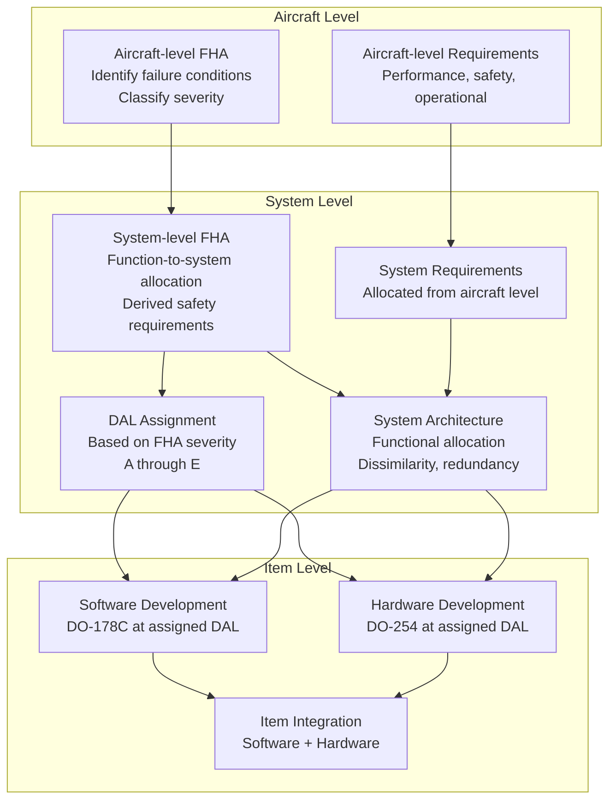

# ARP4754A — System Development Assurance

**Topic:** ARP4754A — Guidelines for Development of Civil Aircraft and Systems  
**Standards:** SAE ARP4754A (2010), SAE ARP4761A (2023), FAA AC 20-174, EASA AMC 20-148  
**SDO:** SAE International (S-18 Committee)  
**Audience:** Systems engineers, safety assessors, certification authorities, DERs/CVEs, program managers  
**Prerequisites:** Systems engineering concepts, V-model, DO-178C/DO-254 familiarity, basic safety/reliability concepts

---

## Chapter 1 — Historical Context & Origin Story

### 1.1 ARP4754 Evolution

| Year | Event |
|------|-------|
| 1996 | SAE ARP4754 published (first version) |
| 2001 | Initial industry adoption (Boeing 787, Airbus A380 programs) |
| 2010 | ARP4754A revision (significant update — current version) |
| 2011 | FAA AC 20-174 (acceptance of ARP4754A) |
| 2012 | EASA AMC 20-148 (European acceptance) |
| 2019 | Post-737 MAX: Renewed emphasis on system-level safety |
| 2023 | ARP4761A published (updated safety assessment methods) |
| 2024 | Discussions on ARP4754B (addressing AI/ML, autonomy) |

### 1.2 The Gap ARP4754A Fills

```mermaid
graph TB
    subgraph "Before ARP4754A"
        GAP[Gap between:<br/>Regulations (FAR 25.1309)<br/>and<br/>Item-level standards<br/>(DO-178C, DO-254)]
    end
    
    subgraph "With ARP4754A"
        REG[Regulations<br/>FAR 25.1309<br/>"Safe design"]
        SYS[ARP4754A<br/>System Development<br/>Assurance]
        SW[DO-178C<br/>Software Items]
        HW[DO-254<br/>Hardware Items]
    end
    
    REG --> SYS
    SYS --> SW
    SYS --> HW
```

---

## Chapter 2 — Standard Architecture & Structure

### 2.1 ARP4754A Scope

| Aspect | Coverage |
|--------|----------|
| System architecture | Functional decomposition, allocation |
| Development assurance | Process rigor based on DAL |
| Safety assessment interface | Integration with ARP4761A |
| Requirements management | Validation, traceability |
| Implementation | Allocation to DO-178C (SW) and DO-254 (HW) |
| Integration & verification | System-level V&V |
| Configuration management | System-level CM |
| Process assurance | System QA |
| Certification liaison | Interface with authority |

### 2.2 ARP4754A Process Model



---

## Chapter 3 — Technical Deep Dive

### 3.1 Functional Hazard Assessment (FHA)

| Step | Activity | Output |
|------|----------|--------|
| 1 | Identify aircraft/system functions | Function list |
| 2 | Identify failure conditions for each function | Failure condition list |
| 3 | Classify severity (Catastrophic → No Effect) | Severity classification |
| 4 | Assign DAL based on severity + architecture | DAL assignment |
| 5 | Derive safety requirements | Safety requirements |

**Failure Condition Classification:**

| Severity | Definition | Probability Requirement | DAL |
|----------|-----------|------------------------|-----|
| Catastrophic | Loss of aircraft, multiple fatalities | < 10⁻⁹ per flight hour | A |
| Hazardous | Large reduction in safety margins, serious injury | < 10⁻⁷ per flight hour | B |
| Major | Significant reduction in capability | < 10⁻⁵ per flight hour | C |
| Minor | Slight reduction, inconvenience | < 10⁻³ per flight hour | D |
| No Safety Effect | No operational impact | — | E |

### 3.2 DAL Assignment Process

```mermaid
graph TB
    FHA[FHA: Function X failure<br/>= Catastrophic]
    
    SINGLE[Single system implementing<br/>function X<br/>→ DAL A required]
    
    REDUNDANT[Redundant architecture:<br/>System A + System B<br/>each implementing function X]
    
    INDEP[If truly independent<br/>(no common cause)<br/>Each system: 10⁻⁵ × 10⁻⁵ = 10⁻¹⁰<br/>→ Each can be DAL C]
    
    PARTIAL[If partially independent<br/>Common mode addressed<br/>→ DAL B + DAL B possible]
    
    FHA --> SINGLE
    FHA --> REDUNDANT
    REDUNDANT --> INDEP
    REDUNDANT --> PARTIAL
```

**Key principle:** Architectural mitigation (redundancy, dissimilarity) can reduce individual DAL, provided independence is demonstrated and common cause failures are addressed.

### 3.3 Development Assurance for Systems

| Activity | DAL A | DAL B | DAL C | DAL D |
|----------|-------|-------|-------|-------|
| System requirements capture | Required | Required | Required | Required |
| Derived requirements identification | Required | Required | Required | Recommended |
| Requirements validation | Required (independence) | Required | Required | Recommended |
| Architecture definition | Required | Required | Required | Required |
| Safety requirements allocation | Required | Required | Required | — |
| Integration verification | Required (independence) | Required | Required | Partial |
| System-level testing | Required | Required | Required | Partial |
| Traceability | Complete bidirectional | Complete | Complete | Partial |

### 3.4 Interface with ARP4761A Safety Assessment

| Phase | Safety Activity | ARP4761A Method |
|-------|----------------|----------------|
| Concept | Aircraft-level FHA | Qualitative (expert judgment) |
| Preliminary Design | PSSA (Preliminary System Safety Assessment) | FTA, FMEA, DD, Markov |
| Detailed Design | CCA (Common Cause Analysis) | ZSA, PRA, CMA |
| Verification | SSA (System Safety Assessment) | Quantitative FTA, FMEA |

**CCA Sub-analyses:**
- **ZSA** (Zonal Safety Analysis): Physical proximity of components
- **PRA** (Particular Risk Analysis): External events (fire, bird strike, lightning)
- **CMA** (Common Mode Analysis): Common design, manufacturing, maintenance errors

---

## Chapter 4 — Implementation Guide

### 4.1 System Development Process Steps

| Step | Activity | Output |
|------|----------|--------|
| 1 | Allocate aircraft functions to systems | Functional architecture |
| 2 | Perform system-level FHA | Failure conditions + severity |
| 3 | Define system architecture (redundancy, dissimilarity) | Physical architecture |
| 4 | Assign DAL to each item (SW/HW) | DAL assignment document |
| 5 | Derive safety requirements from FHA/PSSA | Safety requirements |
| 6 | Allocate requirements to SW (DO-178C) and HW (DO-254) | Requirements allocation |
| 7 | Develop items per assigned DAL | SW/HW artifacts |
| 8 | Integrate and verify at system level | Integration test results |
| 9 | Perform SSA (verify safety requirements met) | SSA report |
| 10 | Certification liaison (comply with FAR/CS 25.1309) | Compliance evidence |

### 4.2 Key Planning Documents

| Document | Content |
|----------|---------|
| System Development Plan | Development process, methods, standards |
| System Verification Plan | V&V strategy, integration test approach |
| System Safety Plan | Safety assessment approach (FHA, PSSA, SSA) |
| Certification Plan | Regulatory strategy, means of compliance |
| Configuration Management Plan | System-level CM process |

### 4.3 Requirements Validation

| Method | Purpose | When Used |
|--------|---------|-----------|
| Requirements review | Completeness, correctness, testability | All requirements |
| Prototyping/simulation | Validate behavior before implementation | Complex functions |
| Analysis | Mathematical/logical analysis | Performance requirements |
| Tracing to regulations | Compliance verification | All safety requirements |
| Customer/operator review | Operational adequacy | Operational requirements |

---

## Chapter 5 — Certification & Audit

### 5.1 Regulatory Framework

| Regulation | Scope | Key Paragraph |
|-----------|-------|---------------|
| FAR 25.1309 | Equipment, systems, and installations | Failure probability requirements |
| FAR 25.1301 | Function and installation | Equipment performs intended function |
| CS-25.1309 | EASA equivalent | Same intent as FAR 25.1309 |
| AC 25.1309-1A | Advisory Circular | System design and analysis guidance |
| AC 20-174 | Advisory Circular | Development assurance (accepts ARP4754A) |

### 5.2 Compliance Evidence

| Evidence | Purpose |
|----------|---------|
| FHA report | Justifies DAL assignments |
| PSSA report | Shows architecture meets safety targets |
| SSA report | Demonstrates safety requirements satisfied |
| System requirements document | Complete, correct, traceable |
| Integration test results | System functions correctly |
| Traceability matrix | Requirements → design → verification |
| Configuration index | System configuration under CM |

---

## Chapter 6 — Regional & Domain Variants

| Domain | System-Level Standard | Notes |
|--------|----------------------|-------|
| Civil transport (FAA) | ARP4754A + AC 20-174 | Primary acceptance |
| Civil transport (EASA) | ARP4754A + AMC 20-148 | European equivalent |
| Rotorcraft | ARP4754A (FAR 29.1309) | Same standard applies |
| Small aircraft (Part 23) | ARP4754A (simplified, ASTM F3061) | Reduced rigor possible |
| Military (US DoD) | ARP4754A or MIL-HDBK-516C | Military can reference |
| Space | Similar concepts in ECSS-E-ST-10C | System engineering standard |
| Automotive | ISO 26262 (Part 3: Concept Phase) | Similar FHA → ASIL assignment |

---

## Chapter 7 — Comparison: ARP4754A vs ISO 26262 (System Level)

| Aspect | ARP4754A (Aerospace) | ISO 26262 Part 3 (Automotive) |
|--------|---------------------|-------------------------------|
| Hazard analysis | FHA (per function) | HARA (Hazard Analysis and Risk Assessment) |
| Safety levels | DAL A-E | ASIL A-D + QM |
| Probability target (highest) | 10⁻⁹/flight-hour | 10⁻⁸/hour (qualitative) |
| Architecture influence | DAL reduction via redundancy | ASIL decomposition (D → B+B) |
| Safety requirements | Derived from PSSA/FTA | Safety goals → FSR → TSR |
| Verification | System-level V&V | Integration testing (Part 4) |
| Independence | Required for DAL A/B | Required for ASIL C/D |
| Authority | FAA/EASA (government certification) | Self-assessment (manufacturer) |
| Maturity | Since 1996 (ARP4754) | Since 2011 (ISO 26262:2011) |

---

## Chapter 8 — Mermaid Architecture Diagrams

### 8.1 ARP4754A V-Model

```mermaid
graph TB
    subgraph "Left (Development)"
        L1[Aircraft Functions<br/>& Requirements]
        L2[System Architecture<br/>& Requirements]
        L3[Item Requirements<br/>(allocated to SW/HW)]
        L4[Item Design<br/>& Implementation]
    end
    
    subgraph "Right (Verification)"
        R1[Aircraft Integration<br/>& Validation]
        R2[System Integration<br/>& Verification]
        R3[Item Integration<br/>& Verification]
        R4[Item Testing<br/>(unit/component)]
    end
    
    subgraph "Safety (Parallel)"
        S1[Aircraft FHA]
        S2[System FHA + PSSA]
        S3[CCA + SSA]
    end
    
    L1 --> L2 --> L3 --> L4
    L4 --> R4 --> R3 --> R2 --> R1
    L1 -.-> S1
    L2 -.-> S2
    R2 -.-> S3
    S1 -.-> L2
    S2 -.-> L3
```

### 8.2 DAL Assignment via Architecture

```mermaid
graph TB
    FC[Failure Condition:<br/>Loss of flight control<br/>= CATASTROPHIC<br/>Target: < 10⁻⁹/fh]
    
    subgraph "Option 1: Single System"
        SS[Single FCC<br/>Must be DAL A<br/>(entire path)]
    end
    
    subgraph "Option 2: Dual Redundant"
        S1[FCC-1 (DAL B)<br/>P(fail) < 10⁻⁴/fh]
        S2[FCC-2 (DAL B)<br/>P(fail) < 10⁻⁴/fh]
        V1[Voter/Monitor<br/>Detects disagreement]
        NOTE1[Combined: 10⁻⁴ × 10⁻⁴<br/>+ common cause<br/>= 10⁻⁹ if independent]
    end
    
    subgraph "Option 3: Dissimilar Triple"
        T1[FCC-A (DAL C)<br/>Different vendor]
        T2[FCC-B (DAL C)<br/>Different design]
        T3[FCC-C (DAL C)<br/>Different technology]
        V2[2-of-3 Voter]
    end
    
    FC --> SS
    FC --> S1
    FC --> T1
    S1 --> V1
    S2 --> V1
    T1 --> V2
    T2 --> V2
    T3 --> V2
```

---

## Chapter 9 — Case Studies & Failure Analysis

### 9.1 Boeing 737 MAX — System-Level Safety Failure

**ARP4754A Relevance:** The MCAS (Maneuvering Characteristics Augmentation System) disaster highlighted failures at the system level that ARP4754A is designed to prevent.

| Issue | ARP4754A Principle Violated |
|-------|----------------------------|
| Single AoA sensor input to MCAS | Architecture should address single-point failures |
| MCAS classified as non-hazardous initially | FHA underestimated failure severity |
| No DAL A rigor on MCAS | Incorrect DAL assignment (too low) |
| Inadequate pilot training on failure | Operational procedures part of safety analysis |
| Boeing self-certification (ODA) | Certification liaison inadequate |

**Corrective actions (industry-wide):** (1) Reassess single-sensor architectures for flight-critical functions. (2) Strengthen FHA review (independent assessment). (3) FAA reduced delegation for novel/complex systems. (4) Emphasis on system-level safety (ARP4754A) not just item-level (DO-178C).

### 9.2 Successful System Architecture: A380 Flight Control

**Architecture:** Triple-redundant flight control computers (FCC). Primary: 3× FCPC (Flight Control Primary Computer). Secondary: 3× FCSC (Flight Control Secondary Computer). Dissimilar hardware AND software (different vendors, different languages). Result: No single failure (or common design error) can cause loss of flight control.

**DAL assignment:** Each computer: DAL B (due to triple redundancy + dissimilarity). System-level DAL A achieved through architectural mitigation. Common cause addressed via: different processors, different compilers, different teams, different specification interpretations.

---

## Chapter 10 — Future Evolution & Industry Trends

| Trend | Timeline | Description |
|-------|----------|-------------|
| ARP4754B (potential) | Under discussion | AI/ML, autonomy, software-defined aircraft |
| EASA AI Roadmap | 2024-2030 | Level 1 (assistance) → Level 3 (autonomy) |
| Urban Air Mobility (UAM) | 2024-2030 | eVTOL certification (Part 23/special conditions) |
| Model-based systems engineering (MBSE) | Growing | SysML replacing documents |
| Digital twin for safety | Emerging | Runtime safety monitoring |
| Increased autonomy | 2025-2040 | Reduced crew, single pilot, autonomous cargo |
| Multi-core at system level | Now | CAST-32A guidance for system allocation |
| Cybersecurity integration | Now | DO-326A as integral part of system development |

---

## Chapter 11 — Interview Questions & Career Guide

### Tier 1: Entry-Level

**Q1:** What is the purpose of ARP4754A and how does it relate to DO-178C and DO-254?  
**A:** ARP4754A bridges the gap between aircraft-level regulations (FAR/CS 25.1309) and item-level standards (DO-178C for software, DO-254 for hardware). **Purpose:** (1) Ensures system-level development assurance (not just individual items). (2) Performs safety assessment (FHA) → assigns Development Assurance Levels. (3) Allocates requirements from system to software/hardware items. (4) Ensures system architecture meets safety targets. **Relationship:** ARP4754A sits ABOVE DO-178C/DO-254. It tells them WHAT to do (requirements, DAL) and they define HOW to do it (process objectives). Without ARP4754A, you might perfectly execute DO-178C at the wrong DAL or with missing safety requirements.

### Tier 2: Mid-Level

**Q2:** Explain DAL decomposition through architectural mitigation with an example.  
**A:** DAL decomposition allows reducing the assurance level of individual items by using architectural redundancy, provided independence is demonstrated. **Example:** Flight control function failure = Catastrophic → requires DAL A (10⁻⁹/fh). **Without decomposition:** Single FCC must be entirely DAL A (expensive, ~$50M for SW alone). **With decomposition:** Two independent FCCs, each DAL B. Each has P(failure) < 10⁻⁴/fh. Combined probability: 10⁻⁴ × 10⁻⁴ = 10⁻⁸ (if independent). But must add common cause analysis. If common cause shown to be < 10⁻⁹ → system target met. **Requirements for valid decomposition:** (1) True independence (no common hardware, software, sensors, power supply). (2) CCA demonstrates no credible common cause exceeding target. (3) Monitoring: one system must detect failure of the other. (4) Voter/comparator must itself be DAL A (it's single-point). **ARP4754A role:** Documents the decomposition rationale in PSSA. Derives independence requirements. Validates in SSA.

### Tier 3: Senior/Distinguished

**Q3:** How would you structure the system development assurance for a novel single-pilot commercial aircraft?  
**A:** **Challenge:** Removing the co-pilot removes a safety layer. Must compensate with technology. (1) **FHA impact:** "Pilot incapacitation" now has no redundancy (previously: other pilot takes over). Reclassify many failure conditions: functions that were "minor" (co-pilot handles) become "major" or "hazardous" (no co-pilot backup). New failure condition: "Automation fails to support single pilot adequately" — potentially catastrophic. (2) **Architecture strategy:** Increased automation → higher DAL for automation (DAL A for functions replacing co-pilot). Dissimilar monitoring: automated co-pilot function with independent sensors. Ground-based remote assist capability (data link with ground crew). Pilot health monitoring (incapacitation detection → automatic safe landing). (3) **DAL assignments:** Automated landing (pilot incapacitation) → DAL A. Pilot monitoring system → DAL B (hazardous if it fails to detect). Workload management AI → DAL B or C (depending on function). Standard avionics → DAL per traditional FHA. (4) **Novel challenges (ARP4754A):** AI/ML systems: no current DO-178C path for learning systems. Solution: EASA AI Roadmap (W-shaped lifecycle, learning assurance). Runtime monitoring: independent monitor checks AI decisions. Human factors: ARP4754A traditionally assumes pilot can take over — must update assumptions. Operational environment: new failure conditions from single-pilot fatigue, workload. (5) **Safety assessment (ARP4761A):** Full re-FHA of all aircraft functions (new operational context). Common cause analysis: automated systems share computing → strict partitioning. Markov analysis for complex redundancy architectures. Exposure time analysis: longer pilot reaction times → tighter probability requirements. (6) **Certification strategy:** FAA special conditions (no existing regulation for single-pilot transport). EASA CS-25 amendments. Extensive flight testing with safety crew.

---

## Chapter 12 — Cheat Sheet & Quick Reference

### ARP4754A Key Concepts

```
Purpose:     System-level development assurance for civil aircraft
Published:   2010 (SAE ARP4754A)
Accepted:    FAA AC 20-174, EASA AMC 20-148
Key output:  DAL assignment, safety requirements, architecture rationale
Feeds into:  DO-178C (SW), DO-254 (HW)
Companion:   ARP4761A (safety assessment methods: FHA, PSSA, SSA, CCA)
```

### Safety Assessment Flow

```
1. Aircraft FHA → Failure conditions + severity
2. DAL assignment → Based on severity + architecture
3. PSSA → Derive safety requirements, architecture decisions
4. CCA → Common cause analysis (ZSA + PRA + CMA)
5. Item development → DO-178C / DO-254 at assigned DAL
6. SSA → Verify safety requirements met (quantitative)
```

### DAL Decomposition Rules

```
Catastrophic (DAL A) can decompose to:
  - DAL A + DAL A (no benefit without independence)
  - DAL B + DAL B (if independent, CCA passes)
  - DAL C + DAL C + DAL C (triple redundant, dissimilar)
  
Key rule: Voter/Monitor is typically highest DAL (single-point)
Key rule: Independence must be DEMONSTRATED (not assumed)
Key rule: Common cause failure cannot exceed system target
```

---

*End of Document — 03_ARP4754A_System_Development.md*
