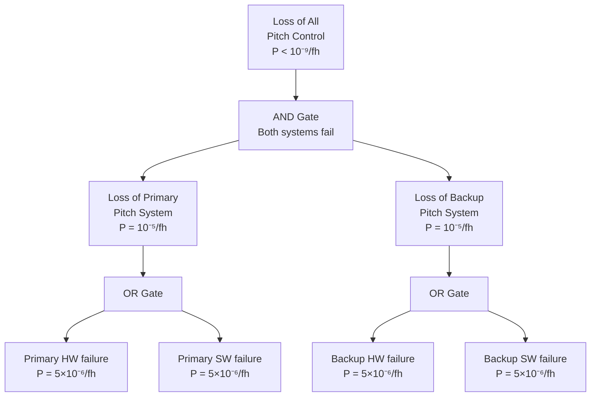
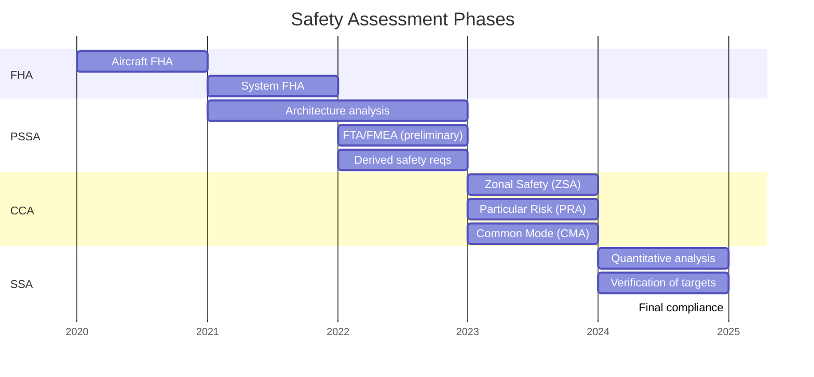
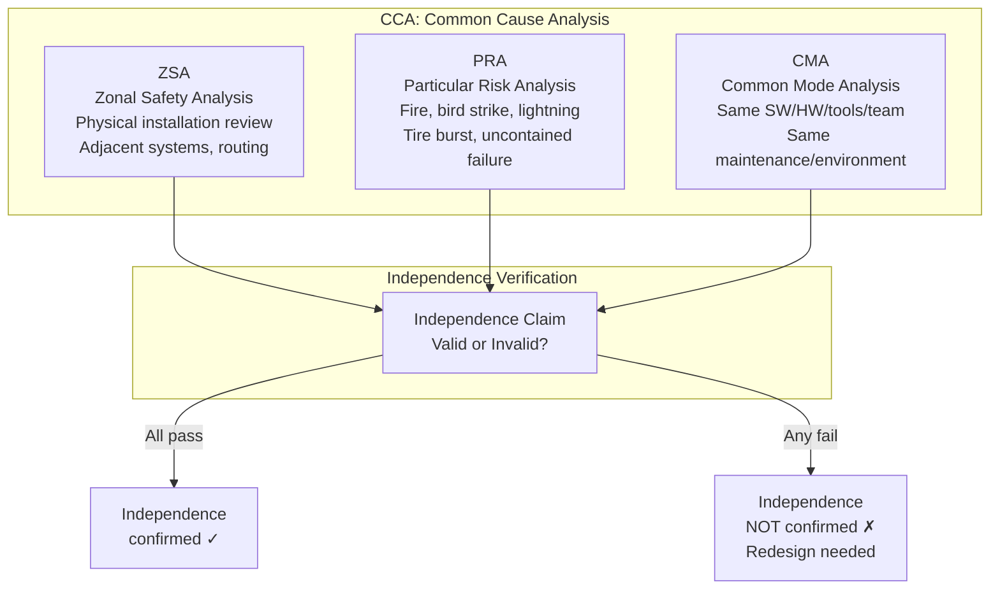

# ARP4761A — Safety Assessment Methods for Airborne Systems

**Topic:** ARP4761A — Safety Assessment Process and Methods (FHA, PSSA, SSA, CCA, FTA, FMEA)  
**Standards:** SAE ARP4761A (2023), SAE ARP4761 (1996 original), FAA AC 25.1309-1A  
**SDO:** SAE International (S-18 Committee)  
**Audience:** Safety assessors, systems engineers, DERs/CVEs, reliability engineers, certification engineers  
**Prerequisites:** ARP4754A fundamentals, probability theory, Boolean algebra, system architecture concepts

---

## Chapter 1 — Historical Context & Origin Story

### 1.1 ARP4761 Evolution

| Year | Event |
|------|-------|
| 1996 | ARP4761 published (Safety Assessment Process) |
| 2001 | Industry adoption alongside ARP4754 |
| 2010 | ARP4754A update (companion standard updated) |
| 2019 | Boeing 737 MAX: safety assessment scrutiny intensified |
| 2023 | ARP4761A published (major revision — expanded methods) |
| 2024 | Industry transition from ARP4761 to ARP4761A |

### 1.2 ARP4761A vs ARP4761

| Aspect | ARP4761 (1996) | ARP4761A (2023) |
|--------|---------------|-----------------|
| Scope | Process overview + basic methods | Expanded methods + detailed guidance |
| FTA guidance | Basic | Comprehensive (quantitative + qualitative) |
| FMEA guidance | Basic | Detailed (effects at multiple levels) |
| Markov analysis | Mentioned | Full guidance (complex dependencies) |
| Dependency diagrams | Not included | Added (DD method) |
| CCA methods | ZSA + PRA + CMA | Expanded with examples |
| Bayesian networks | Not included | Added (probabilistic inference) |
| Human factors | Limited | Enhanced |

---

## Chapter 2 — Standard Architecture & Structure

### 2.1 Safety Assessment Process Overview

```mermaid
graph TB
    subgraph "Phase 1: FHA"
        FHA[Functional Hazard Assessment<br/>Identify failure conditions<br/>Classify severity<br/>Determine DAL]
    end
    
    subgraph "Phase 2: PSSA"
        PSSA[Preliminary System<br/>Safety Assessment<br/>Examine architecture<br/>Derive safety requirements]
        FTA_P[Fault Tree Analysis<br/>(top-down, deductive)]
        DD[Dependency Diagrams<br/>(reliability block diagrams)]
        FMEA_P[FMEA<br/>(bottom-up, inductive)]
        MAR[Markov Analysis<br/>(state-based, repair)]
    end
    
    subgraph "Phase 3: CCA"
        CCA[Common Cause Analysis]
        ZSA[Zonal Safety Analysis<br/>Physical proximity]
        PRA[Particular Risk Analysis<br/>External events]
        CMA[Common Mode Analysis<br/>Design/process commonality]
    end
    
    subgraph "Phase 4: SSA"
        SSA[System Safety Assessment<br/>Verify targets met<br/>Quantitative analysis]
    end
    
    FHA --> PSSA
    PSSA --> FTA_P
    PSSA --> DD
    PSSA --> FMEA_P
    PSSA --> MAR
    PSSA --> CCA
    CCA --> ZSA
    CCA --> PRA
    CCA --> CMA
    PSSA --> SSA
    CCA --> SSA
```

### 2.2 When Each Method is Used

| Method | Type | Direction | Best For |
|--------|------|-----------|----------|
| FTA | Deductive | Top-down | Probability of top event, independence analysis |
| FMEA | Inductive | Bottom-up | Identifying all failure effects, maintenance |
| DD (Dependency Diagram) | Modeling | Block diagram | Reliability calculation, redundancy |
| Markov | State-based | State transition | Repair, latent failures, sequence-dependent |
| Bayesian Network | Probabilistic | Directed graph | Complex conditional dependencies |

---

## Chapter 3 — Technical Deep Dive

### 3.1 Functional Hazard Assessment (FHA)

| Column | Content | Example |
|--------|---------|---------|
| Function | System function being assessed | "Provide pitch control" |
| Failure condition | What happens if function fails | "Loss of pitch control" |
| Phase | Flight phase (takeoff, cruise, approach, landing) | "All phases" |
| Effect on aircraft | Consequence of failure | "Unable to control pitch → crash" |
| Classification | Severity category | "Catastrophic" |
| Probability requirement | Target probability | "< 10⁻⁹ per flight hour" |
| DAL | Development Assurance Level | "A" |
| Safety requirement (derived) | Safety requirement to prevent/mitigate | "Pitch control shall have independent backup" |

### 3.2 Fault Tree Analysis (FTA)

**Structure:** Top event → intermediate events → basic events (connected by AND/OR gates).



**Quantitative FTA:**
- OR gate: $P_{out} = 1 - \prod(1 - P_i) \approx \sum P_i$ (for small probabilities)
- AND gate: $P_{out} = \prod P_i$ (independent events)
- Example: $P_{top} = P_{primary} \times P_{backup} = 10^{-5} \times 10^{-5} = 10^{-10}$ (meets 10⁻⁹ target)

### 3.3 FMEA (Failure Mode and Effects Analysis)

| Column | Content |
|--------|---------|
| Item/Function | Component or function being analyzed |
| Failure mode | How the item can fail (open, short, stuck, erroneous) |
| Failure cause | Root cause of failure (wear, overstress, design) |
| Local effect | Effect on immediate component/subsystem |
| Next higher effect | Effect on parent system |
| End effect | Effect on aircraft/safety |
| Severity | Classification (Catastrophic → No Effect) |
| Failure rate | λ (failures per hour) |
| Detection means | How failure is detected (BITE, pilot, maintenance) |
| Compensating provisions | Redundancy, procedures, maintenance |
| Remarks | Additional notes |

### 3.4 Common Cause Analysis (CCA)

| Sub-analysis | Focus | Method |
|-------------|-------|--------|
| ZSA (Zonal Safety Analysis) | Physical proximity effects | Inspect installation zones for cascading failures |
| PRA (Particular Risk Analysis) | External events | Analyze: fire, bird strike, lightning, uncontained engine failure, tire burst |
| CMA (Common Mode Analysis) | Design/process commonality | Identify: common SW/HW, common tools, common maintenance, common environment |

**CMA checklist (typical):**
- Same software in redundant channels?
- Same hardware vendor/design?
- Same development team/process?
- Same power supply?
- Same maintenance crew/procedure?
- Same environmental exposure?
- Same production batch/lot?

### 3.5 Markov Analysis

| Use Case | When to Apply |
|----------|--------------|
| Latent failures | Failure detected only during maintenance (exposure time matters) |
| Repair/recovery | System can recover from failure state |
| Sequence-dependent | Order of failures matters (A then B ≠ B then A) |
| Complex redundancy | Non-simple voting, degraded modes |
| Time-dependent | Failure rates change over time |

**Example: Dual-redundant with latent failure detection**

States: (1) Both working (2) One failed (latent) (3) Both failed (hazardous)

$$P_{hazardous} = \lambda_1 \times \lambda_2 \times T_{exposure}$$

Where $T_{exposure}$ = maintenance interval (time latent failure undetected).

---

## Chapter 4 — Implementation Guide

### 4.1 Safety Assessment Tool Selection

| Tool | Type | Features |
|------|------|----------|
| CAFTA (EPRI) | FTA | Industry-standard fault tree software |
| Isograph FaultTree+ | FTA + FMEA | Integrated safety suite |
| ReliaSoft (HBM) | FMEA + FTA + RBD | Comprehensive reliability |
| RAM Commander | FTA + FMEA + Markov | Multi-method |
| Medini Analyze | Safety analysis | Automotive + aerospace |
| ASCE FTA | Open source | Academic/simple FTAs |

### 4.2 Typical Failure Rates (Avionics)

| Component | Failure Rate (per flight hour) |
|-----------|-------------------------------|
| Microprocessor (COTS) | 10⁻⁵ to 10⁻⁶ |
| FPGA (quality) | 10⁻⁶ to 10⁻⁷ |
| Discrete component (resistor) | 10⁻⁹ to 10⁻¹⁰ |
| Connector pin | 10⁻⁸ to 10⁻⁹ |
| Software (per execution hour, DAL A) | Assumed 10⁻⁵ (not directly quantifiable) |
| Power supply module | 10⁻⁵ to 10⁻⁶ |
| Sensor (redundant) | 10⁻⁵ to 10⁻⁶ per sensor |

**Note:** Software failure probability cannot be directly calculated from physical reliability. Industry uses assumed values or architecture arguments (dissimilarity eliminates common SW failures).

### 4.3 FAR 25.1309 Probability Requirements

| Failure Condition | Probability per Flight Hour |
|------------------|-----------------------------|
| Catastrophic | < 10⁻⁹ (extremely improbable) |
| Hazardous | < 10⁻⁷ (extremely remote) |
| Major | < 10⁻⁵ (remote) |
| Minor | < 10⁻³ (reasonably probable) |
| No effect | — (no requirement) |

---

## Chapter 5 — Certification & Audit

### 5.1 Safety Assessment Deliverables

| Deliverable | Content | Timing |
|-------------|---------|--------|
| Aircraft-level FHA | Top-level failure conditions + classification | Early (concept phase) |
| System-level FHA | Per-system failure conditions + DAL | Requirements phase |
| PSSA report | Architecture safety analysis (FTA/FMEA/DD) | Design phase |
| CCA report | Common cause analysis (ZSA + PRA + CMA) | Design phase |
| SSA report | Final quantitative analysis (verify targets met) | Verification phase |
| Safety compliance statement | Demonstration of compliance with 25.1309 | Certification |

### 5.2 Authority Review Points

| Review | Focus | Evidence |
|--------|-------|----------|
| SOI #1 (Planning) | Safety plan adequate? | Safety assessment plan, FHA methodology |
| SOI #2 (Development) | PSSA driving design correctly? | PSSA results, derived safety requirements |
| SOI #3 (Verification) | SSA complete and correct? | SSA, quantitative results, CCA |
| SOI #4 (Final) | Full compliance demonstration? | Complete safety package |

---

## Chapter 6 — Regional & Domain Variants

| Domain | Safety Assessment Method | Standard |
|--------|-------------------------|----------|
| Civil aviation | FHA + PSSA + SSA + CCA | ARP4761A |
| Military aviation | System Safety Assessment | MIL-STD-882E |
| Automotive | HARA + FMEA + FTA | ISO 26262 (Part 9) |
| Railway | Risk assessment + FMEA | EN 50129 + IEC 62278 (RAMS) |
| Nuclear | Probabilistic Safety Assessment (PSA) | IEC 61513 |
| Medical devices | Risk management | ISO 14971 |
| Space | FMECA + FTA | ECSS-Q-ST-30C, ECSS-Q-ST-40C |

---

## Chapter 7 — Comparison: Safety Analysis Methods

| Feature | FTA | FMEA | Markov | Dependency Diagram | Bayesian Network |
|---------|-----|------|--------|-------------------|-----------------|
| Direction | Top-down | Bottom-up | State-based | Block-based | Conditional |
| Type | Deductive | Inductive | Analytical | Analytical | Probabilistic |
| Strength | Probability of specific event | Comprehensive failure catalog | Complex dependencies | Reliability calculation | Conditional reasoning |
| Weakness | Focused on one top event | Time-consuming for large systems | State explosion | Simple logic only | Requires conditional probabilities |
| Quantitative | Yes | Yes (with rates) | Yes | Yes | Yes |
| Qualitative | Yes (cut sets) | Yes (effects analysis) | No | No | No |
| Common cause | Yes (via modeling) | Limited | Yes | Limited | Yes |
| Best for | Catastrophic/hazardous analysis | Maintenance, MTBF, coverage | Latent failures, repair | Simple redundancy | Complex inference |
| Software tools | CAFTA, FaultTree+ | FMEA Pro, Xfmea | SHARPE, RAM Commander | ReliaSoft, BlockSim | BayesiaLab, Hugin |

---

## Chapter 8 — Mermaid Architecture Diagrams

### 8.1 Safety Assessment in Development Lifecycle



### 8.2 CCA Methods Interaction



---

## Chapter 9 — Case Studies & Failure Analysis

### 9.1 Latent Failure + Active Failure = Catastrophic

**Scenario:** Dual-channel flight control system. Channel A has latent failure (undetected). Channel B then experiences active failure. Both channels lost → catastrophic.

**Safety assessment approach (ARP4761A):** (1) FTA: Model as AND gate (Channel A failed AND Channel B failed AND latent failure undetected). (2) Markov analysis: State model with detection interval. (3) Probability: $P_{catastrophic} = \lambda_A \times T_{latent} \times \lambda_B$. If $\lambda_A = \lambda_B = 10^{-5}/fh$ and $T_{latent}$ = 1000 fh (maintenance interval): $P = 10^{-5} \times 10^3 \times 10^{-5} = 10^{-7}/fh$ (only meets Hazardous, NOT Catastrophic).

**Solution:** (1) Reduce maintenance interval: $T_{latent}$ = 10 fh → $P = 10^{-9}/fh$ ✓. (2) OR add preflight BITE (Built-In Test): $T_{latent}$ = 1 fh → $P = 10^{-10}/fh$ ✓. (3) Derive safety requirement: "Latent failure of Channel A shall be detected within 1 flight hour."

### 9.2 Common Mode Failure Discovery

**Context:** Dual-redundant air data system. Each channel uses different pitot probes (physical independence). Both channels use same air data computer algorithm (software commonality).

**CMA finding:** Common software → common design error could fail both channels simultaneously. Not truly independent despite separate physical inputs.

**Resolution:** (1) Dissimilar algorithms in each channel (different teams, different methods). (2) Or: add third independent source (GPS-derived air data). (3) Update FTA: Cannot use AND gate for dual channel (common SW voids independence).

---

## Chapter 10 — Future Evolution & Industry Trends

| Trend | Timeline | Description |
|-------|----------|-------------|
| ARP4761A industry adoption | 2024-2026 | Transition from ARP4761 to ARP4761A |
| Bayesian methods | Growing | Probabilistic networks for complex systems |
| Model-based safety analysis | Growing | Automated FTA/FMEA from system models |
| AI/ML system safety | 2024-2030 | How to assess non-deterministic systems |
| Dynamic safety assessment | Emerging | Runtime safety monitoring, adaptive |
| Digital twin safety | Emerging | Virtual testing of failure scenarios |
| Multi-system integration | Growing | Drones in airspace, autonomous + manned |
| MBSA tools | Growing | AADL/EAST-ADL → automated safety analysis |

---

## Chapter 11 — Interview Questions & Career Guide

### Tier 1: Entry-Level

**Q1:** What is the difference between FTA and FMEA?  
**A:** **FTA (Fault Tree Analysis):** (1) Top-down / deductive approach. (2) Starts with specific undesired event (top event). (3) Determines all combinations of lower-level failures causing it. (4) Uses logic gates (AND, OR) to model relationships. (5) Best for: calculating probability of specific catastrophic/hazardous events. **FMEA (Failure Mode and Effects Analysis):** (1) Bottom-up / inductive approach. (2) Starts with individual component/function failure modes. (3) Traces effects upward to system/aircraft level. (4) Tabular format (systematic, comprehensive). (5) Best for: identifying ALL failure effects, maintenance planning, failure detection means. **Complementary:** FTA answers "how can THIS specific bad thing happen?" FMEA answers "what happens if THIS component fails?" Both are needed for complete safety assessment (ARP4761A recommends using both).

### Tier 2: Mid-Level

**Q2:** Explain how Common Cause Analysis (CCA) validates independence claims in redundant architectures.  
**A:** CCA comprises three sub-analyses that challenge independence assumptions: (1) **ZSA (Zonal Safety Analysis):** Examines physical installation. Question: "Can a single physical event (fire, flood, mechanical damage) affect both redundant channels?" Check: wire routing (same bundle?), component proximity (same zone?), structural failure propagation. Example: Both FCCs in same avionics bay → fire in bay loses both. Fix: physically separate. (2) **PRA (Particular Risk Analysis):** Examines specific external threats. Question: "Can a bird strike / uncontained engine failure / tire burst / lightning affect both channels?" Check: Trajectory analysis for debris. Protection requirements (shielding, separation). Example: Engine failure debris path crosses both hydraulic lines. Fix: route lines on opposite sides of aircraft. (3) **CMA (Common Mode Analysis):** Examines design/process/operational commonality. Question: "Can a common design error, manufacturing defect, or maintenance error affect both channels simultaneously?" Check: Same SW/HW, same development team, same tools, same maintenance procedure, same environmental stress. Example: Same software in both channels → one bug fails both. Fix: dissimilar software (different teams, different languages). **Validation flow:** If any CCA sub-analysis identifies a credible common cause → the AND gate in the FTA becomes invalid → must redesign architecture or add mitigation → re-analyze.

### Tier 3: Senior

**Q3:** A new aircraft design shows a quantitative safety gap: the calculated probability of "total loss of thrust" is 3×10⁻⁹/fh against a 10⁻⁹/fh target. Walk through your approach to closing this gap.  
**A:** **Step 1: Validate the analysis.** Review FTA assumptions: are failure rates conservative? Data sources credible (MIL-HDBK-217, field data)? Are AND/OR gates correct? Any modeling errors? Re-examine exposure times for latent failures. If analysis is pessimistic (conservative) → may already meet target with refined data. **Step 2: Identify dominant cut sets.** Minimal cut sets: which combinations contribute most to top event? Typically 80/20 rule: few cut sets dominate probability. Focus improvement on dominant contributors. **Step 3: Architectural mitigations.** Add monitoring/detection: reduce latent failure exposure time. Example: If dominant cut set involves latent fuel valve failure with 1000 fh exposure → add BITE → reduce to 1 fh exposure → factor of 1000 improvement. Add redundancy: if single-point failure identified → add redundant path. Dissimilarity: if common mode is dominant → diversify design. **Step 4: Quantify improvement.** Recalculate FTA with improved architecture/detection. Show new probability < 10⁻⁹/fh. **Step 5: If still insufficient.** Argue operational credit: ETOPS regulations allow credit for pilot action (with time). Argue exposure credit: failure condition only catastrophic in specific flight phases. Argue conservatism credit: identify conservative assumptions in analysis. **Step 6: Document.** Update PSSA → SSA with revised architecture. Derive new safety requirements (e.g., "BITE shall detect fuel valve failure within 1 fh"). Flow requirements to DO-178C/DO-254 items. Certification presentation: show authority the gap closure rationale.

---

## Chapter 12 — Cheat Sheet & Quick Reference

### ARP4761A Methods Quick Selection

```
"What causes this specific failure?"        → FTA (top-down)
"What happens if this component fails?"     → FMEA (bottom-up)
"Can a single event defeat redundancy?"     → CCA (ZSA + PRA + CMA)
"Complex repair/detection timing?"          → Markov analysis
"Reliability of redundant architecture?"    → Dependency Diagram (RBD)
"Conditional dependencies?"                 → Bayesian Network
```

### Probability Requirements (FAR 25.1309)

```
Catastrophic:  < 10⁻⁹/fh  (Extremely Improbable)
Hazardous:     < 10⁻⁷/fh  (Extremely Remote)
Major:         < 10⁻⁵/fh  (Remote)
Minor:         < 10⁻³/fh  (Reasonably Probable)
No Effect:     No requirement
```

### FTA Gate Logic

```
OR gate:   P_out ≈ P₁ + P₂ + ... + Pₙ  (for small P)
AND gate:  P_out = P₁ × P₂ × ... × Pₙ  (independent)
Latent:    P_out = λ × T_exposure  (probability of being in failed state)
```

### CCA Quick Checklist

```
ZSA: Same physical zone? Same routing? Same structural bay?
PRA: Bird strike path? Engine burst debris? Fire zone? Lightning?
CMA: Same software? Same hardware? Same team? Same tools? Same maintenance?
```

---

*End of Document — 04_ARP4761A_Safety_Assessment.md*
