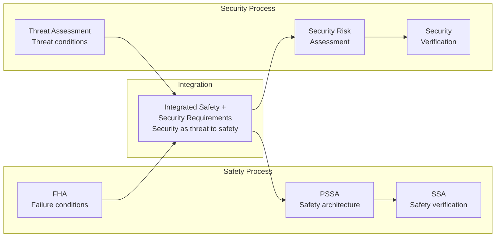

# DO-326A — Airworthiness Security Process Specification

**Topic:** DO-326A / ED-202A — Airworthiness Security Process, Threat Assessment, Security Risk Management for Avionics  
**Standards:** RTCA DO-326A (2018), DO-356A (2018), DO-355A, EUROCAE ED-202A, ED-203A  
**SDO:** RTCA (SC-216), EUROCAE (WG-72)  
**Audience:** Avionics cybersecurity engineers, security assessors, DERs, certification engineers, SOC analysts for aviation  
**Prerequisites:** DO-178C familiarity, general cybersecurity concepts (CIA triad), threat modeling, ARP4754A system concepts

---

## Chapter 1 — Historical Context & Origin Story

### 1.1 Aviation Security Standards Timeline

| Year | Event |
|------|-------|
| 2007 | FAA special conditions for cybersecurity (Boeing 787) |
| 2010 | RTCA SC-216 / EUROCAE WG-72 joint committee formed |
| 2014 | DO-326 (first edition — withdrawn) |
| 2018 | DO-326A published (Airworthiness Security Process Specification) |
| 2018 | DO-356A published (Airworthiness Security Methods and Considerations) |
| 2018 | DO-355A (Information Security Guidance for Continuing Airworthiness) |
| 2019 | FAA Policy Statement PS-AIR-21.16-02 (cybersecurity) |
| 2020 | EASA Acceptable Means of Compliance for cybersecurity |
| 2022 | EU Aviation Cybersecurity Regulation 2023/203 (Part-IS) |
| 2024 | Increased enforcement; cybersecurity mandatory for all new type certificates |

### 1.2 Why Aviation Cybersecurity Emerged

| Driver | Detail |
|--------|--------|
| Connected aircraft | EFBs, Wi-Fi, satcom, ACARS, ADS-B → expanded attack surface |
| Boeing 787 | First aircraft with passenger Wi-Fi + aircraft systems (network isolation scrutiny) |
| Regulations | FAR 25.1309 didn't explicitly address intentional threats |
| Chris Roberts incident (2015) | Security researcher claimed to access IFE → flight system (disputed) |
| FAA Special Conditions | Boeing 787/747-8 special conditions for network security |
| Growing attack sophistication | Nation-state threats to aviation infrastructure |

---

## Chapter 2 — Standard Architecture & Structure

### 2.1 DO-326A/DO-356A/DO-355A Relationship

| Standard | Scope | Analogy to Safety |
|----------|-------|-------------------|
| DO-326A | Security process and objectives (WHAT to do) | Like ARP4754A (process) |
| DO-356A | Security methods and considerations (HOW to do it) | Like ARP4761A (methods) |
| DO-355A | Continuing airworthiness security | Like MSG-3 (maintenance) |

```mermaid
graph TB
    subgraph "Security Standards"
        DO326A[DO-326A / ED-202A<br/>Security Process<br/>Objectives & activities]
        DO356A[DO-356A / ED-203A<br/>Security Methods<br/>Threat assessment, risk]
        DO355A[DO-355A<br/>Continuing Airworthiness<br/>Operational security]
    end
    
    subgraph "Interface Standards"
        DO178C[DO-178C<br/>Software (security req as input)]
        DO254[DO-254<br/>Hardware (security req as input)]
        ARP4754A[ARP4754A<br/>System development]
    end
    
    DO326A --> DO356A
    DO326A --> DO355A
    DO326A --> DO178C
    DO326A --> DO254
    DO326A --> ARP4754A
```

### 2.2 Security Assessment vs Safety Assessment

| Aspect | Safety (ARP4761A) | Security (DO-326A/DO-356A) |
|--------|-------------------|---------------------------|
| Threat source | Accidental failures (random) | Intentional attacks (adversary) |
| Analysis method | FHA, FTA, FMEA | Threat Assessment, Attack Trees |
| Risk metric | Probability per flight hour | Threat condition (likelihood + impact) |
| Mitigation | Redundancy, monitoring, design | Barriers, access control, monitoring |
| Quantification | Statistical (failure rates) | Qualitative (attacker capability, motivation) |
| Standard | ARP4761A | DO-356A |
| Dynamic | Static (design-time) | Dynamic (threat landscape evolves) |
| Updates | Rarely needed | Continuous monitoring required |

---

## Chapter 3 — Technical Deep Dive

### 3.1 DO-326A Security Process

| Phase | Activity | Output |
|-------|----------|--------|
| Planning | Security planning (scope, methods, team) | Security Plan |
| Aircraft Security Assessment | Identify security perimeter, zones, interfaces | APSA (Aircraft Preliminary Security Assessment) |
| System Security Assessment | Threat assessment per system | Threat conditions, security requirements |
| Item Security Assessment | Allocate security requirements to SW/HW | DO-178C/DO-254 security objectives |
| Security Verification | Verify security requirements implemented | Security test results |
| Continuing Airworthiness | Maintain security post-certification | DO-355A activities |

### 3.2 Threat Assessment Process (DO-356A)

```mermaid
graph TB
    subgraph "Step 1: Asset Identification"
        A1[Identify security-relevant<br/>assets and functions<br/>(flight control, navigation, comms)]
    end
    
    subgraph "Step 2: Threat Scenarios"
        A2[Identify threat scenarios<br/>Who, What, How<br/>(nation-state, criminal, insider)]
    end
    
    subgraph "Step 3: Attack Vectors"
        A3[Identify attack vectors<br/>Maintenance port, Wi-Fi, ACARS<br/>Supply chain, insider access]
    end
    
    subgraph "Step 4: Threat Conditions"
        A4[Define threat conditions<br/>(security equivalent of<br/>failure conditions)]
    end
    
    subgraph "Step 5: Security Risk Assessment"
        A5[Assess likelihood × impact<br/>Determine Security Assurance Level<br/>(equivalent to DAL)]
    end
    
    subgraph "Step 6: Security Requirements"
        A6[Derive security requirements<br/>Barriers, controls, monitoring<br/>Allocate to systems/items]
    end
    
    A1 --> A2 --> A3 --> A4 --> A5 --> A6
```

### 3.3 Aircraft Security Zones

| Zone | Description | Examples | Security Level |
|------|-------------|----------|---------------|
| Aircraft Control Domain (ACD) | Safety-critical systems | Flight controls, engine FADEC, braking | Highest security |
| Airline Information Services Domain (AISD) | Airline operational | AOC, ACARS, crew applications | High security |
| Passenger Information and Entertainment (PIDS) | Passenger-facing | IFE, passenger Wi-Fi | Moderate security |
| Open World | External networks | Internet, cellular, airport | Untrusted |

**Key principle:** Unidirectional data flow from low-security to high-security domains must be prevented (or strictly controlled with data diodes, filtering gateways).

### 3.4 Security Requirements Categories

| Category | Examples |
|----------|---------|
| Access control | Authentication for maintenance ports, role-based access |
| Data protection | Encryption of sensitive data (navigation databases, keys) |
| Network security | Firewall between domains, intrusion detection |
| Software integrity | Secure boot, signed firmware updates, anti-tamper |
| Physical security | Tamper-evident seals, locked avionics bays |
| Monitoring | Security event logging, anomaly detection |
| Key management | Cryptographic key lifecycle (generation, storage, rotation) |
| Supply chain | Trusted suppliers, counterfeit part avoidance |

### 3.5 Threat Condition Classification

| Severity | Definition | Example |
|----------|-----------|---------|
| Catastrophic | Threat leads to aircraft loss | Unauthorized flight control commands |
| Hazardous | Threat leads to major safety impact | Navigation data corruption during approach |
| Major | Threat significantly degrades operations | Communication system denial |
| Minor | Threat causes operational inconvenience | IFE system failure |
| No security effect | Threat has no impact | Passenger cannot access specific content |

---

## Chapter 4 — Implementation Guide

### 4.1 Security Architecture Patterns

| Pattern | Description | Application |
|---------|-------------|-------------|
| Network domain separation | Physical/logical isolation between zones | ACD vs PIDS separation |
| Data diode | One-way data flow (hardware-enforced) | PIDS → ACD data only |
| Filtering gateway | Application-layer inspection + whitelisting | AISD ↔ ACD controlled interface |
| Defense in depth | Multiple layers of security controls | Network + application + physical |
| Least privilege | Minimum access for each function | Role-based access to maintenance |
| Secure boot chain | Verified software integrity at startup | All flight-critical systems |
| Monitoring & alerting | Runtime security anomaly detection | Network IDS on AFDX |

### 4.2 DO-326A Implementation Checklist

| Activity | Deliverable |
|----------|-------------|
| Define security perimeter | Security environment diagram |
| Identify assets | Asset list with criticality |
| Perform threat assessment | Threat model document |
| Classify threat conditions | Threat condition list with severity |
| Derive security requirements | Security requirements document |
| Allocate to systems | Requirements allocation matrix |
| Implement security controls | Design documentation |
| Verify security requirements | Security test results |
| Penetration testing | Test report (DO-356A recommended) |
| Certify with authority | Security aspects package |

### 4.3 Penetration Testing (DO-356A Guidance)

| Level | Scope | Method |
|-------|-------|--------|
| Level 1 | Network security | Port scanning, vulnerability scanning |
| Level 2 | Application security | Protocol fuzzing, authentication testing |
| Level 3 | System security | Multi-step attack scenarios, lateral movement |
| Level 4 | Physical + logical | Hardware attacks, debug port access, fault injection |

---

## Chapter 5 — Certification & Audit

### 5.1 FAA/EASA Security Certification

| Milestone | Activity | Authority |
|-----------|----------|-----------|
| Type Certificate application | Include cybersecurity in cert basis | FAA/EASA |
| Security plan review | Authority reviews approach | FAA AIR, EASA cert team |
| Threat assessment review | Validate threat model completeness | DER/CVE + security specialist |
| Security requirements review | Verify requirements address threats | Authority + specialist |
| Verification review | Confirm implementation + testing | Authority |
| Continuing airworthiness | Security update process | Operator + authority |

### 5.2 Part-IS (EU Aviation Cybersecurity)

| Aspect | Requirement |
|--------|-------------|
| Scope | Organizations (airlines, airports, ATM, manufacturers) |
| ISMS | Information Security Management System required |
| Risk assessment | Regular threat and risk assessment |
| Incident reporting | Mandatory cybersecurity incident reporting |
| Supply chain | Security requirements on suppliers |
| Training | Staff cybersecurity awareness training |
| Effective | 2023 (organizations), 2025 (full compliance) |

---

## Chapter 6 — Regional & Domain Variants

| Region/Domain | Standard | Status |
|---------------|----------|--------|
| FAA (US) | DO-326A + PS-AIR-21.16-02 | Mandatory for new TCs |
| EASA (EU) | ED-202A + Part-IS | Mandatory |
| Military (US) | RMF (Risk Management Framework) + DO-326A | Depends on program |
| Space | NIST SP 800-53, CNSSI 1253 | Security controls for space systems |
| Ground systems (ATM) | ED-205A (ATM Security) | EUROCAE/EUROCONTROL |
| Airlines (operational) | DO-355A + Part-IS | Continuing airworthiness |

---

## Chapter 7 — Comparison: Aviation Security vs Safety

| Dimension | Safety (ARP4754A/4761A) | Security (DO-326A/DO-356A) |
|-----------|------------------------|---------------------------|
| Threat model | Random failure (probability-based) | Intentional adversary (capability-based) |
| Failure cause | Aging, manufacturing, environment | Attacker exploiting vulnerability |
| Analysis timing | Design-time (mostly static) | Continuous (threat landscape changes) |
| Requirements driver | Failure condition severity | Threat condition + attacker capability |
| DAL equivalent | DAL (Development Assurance Level) | Security Assurance Level (informal) |
| Testing | Requirements-based + structural | Penetration testing + fuzzing |
| Maintenance | Scheduled (AMP) | Vulnerability management (PSIRT) |
| Quantification | Precise (10⁻⁹/fh) | Qualitative (low/medium/high/critical) |
| Interaction | Safety considers security failure as potential cause | Security protects safety-critical functions |

---

## Chapter 8 — Mermaid Architecture Diagrams

### 8.1 Aircraft Network Security Architecture

```mermaid
graph TB
    subgraph "Aircraft Control Domain (ACD)"
        FCS[Flight Control System<br/>DAL A, isolated]
        NAV[Navigation System<br/>IRS, GPS, FMC]
        ENG[Engine FADEC<br/>Full authority digital]
    end
    
    subgraph "Airline Information Services (AISD)"
        AOC[AOC Communications<br/>ACARS, CPDLC]
        EFB[Electronic Flight Bag<br/>Charts, performance]
        MAINT[Maintenance Systems<br/>BITE data, health monitoring]
    end
    
    subgraph "Passenger Domain (PIDS)"
        IFE[In-Flight Entertainment<br/>Movies, games]
        WIFI[Passenger Wi-Fi<br/>Internet access]
        USB[USB Charging<br/>Power only (no data)]
    end
    
    subgraph "Security Boundaries"
        FW1[Firewall / Data Diode<br/>ACD ← AISD<br/>One-way or strict filter]
        FW2[Firewall / Gateway<br/>AISD ↔ PIDS<br/>Strict access control]
    end
    
    ACD --- FW1
    FW1 --- AISD
    AISD --- FW2
    FW2 --- PIDS
    WIFI --- PIDS
```

### 8.2 Security Assessment Integration with Safety



---

## Chapter 9 — Case Studies & Failure Analysis

### 9.1 Boeing 787 Network Security Architecture

**Challenge:** First commercial aircraft with: passenger Wi-Fi, crew tablets (EFBs), real-time health monitoring — all sharing physical aircraft network infrastructure.

**Architecture:** (1) Three network domains: Open (passenger), Airline (operational), Closed (aircraft control). (2) Security Gateway Controller (SGC): Application-level gateway between domains. (3) AFDX network: Deterministic, separated from passenger traffic. (4) Data diodes: Hardware-enforced one-way data flow (aircraft → ground, never reverse for critical data).

**FAA Special Conditions (SC):** Required Boeing to demonstrate that no communication path exists from open/passenger domain to aircraft control domain that could affect safety. Boeing demonstrated through: architecture analysis, formal verification of gateway rules, penetration testing.

### 9.2 ACARS Vulnerability Research

**Finding (2013):** Researchers demonstrated theoretical ability to send spoofed ACARS messages (unencrypted, no authentication) to aircraft.

**DO-326A response:** (1) Identified ACARS as an attack vector (threat assessment). (2) Security requirement: ACARS messages affecting flight operations must be authenticated. (3) Migration path: FANS 1/A+ with CPDLC over ATN/IPS (with security). (4) Near-term: Operational procedures (crew verification of critical messages).

**Lesson:** Legacy avionics protocols (designed in 1970s-1980s) lack security. DO-326A forces assessment of all external interfaces.

---

## Chapter 10 — Future Evolution & Industry Trends

| Trend | Timeline | Description |
|-------|----------|-------------|
| Part-IS full compliance | 2025 | EU aviation organizations must comply |
| Automated threat intelligence | Growing | AI-driven threat assessment for aviation |
| Zero trust architecture | Emerging | Beyond perimeter security in aircraft |
| Quantum-safe cryptography | 2027+ | Post-quantum algorithms for avionics |
| Connected aircraft growth | Now | More connectivity → more attack surface |
| Software-defined aircraft | 2025+ | OTA updates → supply chain security critical |
| UTM/UAS security | 2024+ | Drone corridor security, C2 link protection |
| Space cybersecurity | Growing | Satellite communication security (CISA guidance) |
| AI in security monitoring | Emerging | Real-time anomaly detection on aircraft networks |

---

## Chapter 11 — Interview Questions & Career Guide

### Tier 1: Entry-Level

**Q1:** What is the purpose of DO-326A and how does it differ from DO-178C?  
**A:** **DO-326A purpose:** Provides the security process for airworthiness — how to identify, assess, and mitigate cybersecurity threats to aircraft systems. It's the "security equivalent" of the safety process (ARP4754A). **Key difference from DO-178C:** DO-178C addresses software development assurance (building software correctly). DO-326A addresses security (protecting systems from intentional threats). DO-178C deals with accidental failures → process rigor prevents bugs. DO-326A deals with intelligent adversaries → security controls prevent exploitation. **Relationship:** DO-326A produces security requirements → these become inputs to DO-178C (software must implement the security control) and DO-254 (hardware must enforce the boundary). Example: DO-326A requires "maintenance port shall authenticate users." DO-178C implements the authentication algorithm. DO-254 implements the hardware access control.

### Tier 2: Mid-Level

**Q2:** Describe the aircraft security domain model and explain how network separation is achieved.  
**A:** **Domain model (DO-326A):** (1) **Aircraft Control Domain (ACD):** Flight controls, navigation, engine management. Highest security. No external access. Deterministic AFDX network. (2) **Airline Information Services Domain (AISD):** Operational communications (ACARS, AOC), electronic flight bags, maintenance data. Controlled access. (3) **Passenger Information & Entertainment (PIDS):** IFE, passenger Wi-Fi, personal device connectivity. Least trusted. **Separation mechanisms:** (a) Physical separation: Completely separate network hardware (different cables, switches). (b) Logical separation: VLANs with strict ACLs on managed switches. (c) Data diodes: Hardware-enforced one-way communication (e.g., flight data → maintenance display, never reverse). (d) Filtering gateways: Application-layer firewalls that inspect and whitelist specific data types (e.g., weather data can flow from AISD to ACD, but only with validated format and content). (e) Security Gateway Controller (SGC): Purpose-built device that manages inter-domain communication with security policies. **Verification:** Penetration testing confirms no data flow from PIDS→ACD. Formal analysis of gateway rules. Physical inspection of cable routing.

### Tier 3: Senior

**Q3:** How would you integrate DO-326A security with DO-178C software development for a DAL A fly-by-wire system?  
**A:** (1) **Security threat assessment (DO-326A/DO-356A):** Identify all interfaces to the fly-by-wire FCC: maintenance port (ARINC 615A data loader), ARINC 429/AFDX inputs from other systems, discrete I/O from cockpit controls. Assess threat scenarios: malicious firmware upload, spoofed sensor data, denial of service. Classify threat conditions: unauthorized FCC command = Catastrophic. (2) **Derive security requirements:** SR-001: FCC shall authenticate firmware before loading (signed with ECDSA P-384). SR-002: FCC shall validate all ARINC 429 input data ranges (reject out-of-range). SR-003: Maintenance port shall require two-factor authentication. SR-004: FCC shall detect and reject replayed messages (sequence number + timeout). SR-005: No bi-directional connection between FCC and PIDS domain (verified by architecture). (3) **Integrate with DO-178C:** Add security requirements to DO-178C HLR document (traced like any other requirement). Implement in code: cryptographic verification at bootloader, input validation in data handling modules, authentication state machine. Security requirements get same DAL A treatment: MC/DC coverage, independent verification, full traceability. (4) **Verification (combined):** Requirements-based testing: test cases for all security requirements (positive + negative). Penetration testing (DO-356A): attempt to bypass authentication, inject malicious firmware, fuzz interfaces. Security-specific analysis: crypto algorithm correctness, key management, timing attacks. DO-178C structural coverage: security code paths included in MC/DC measurement. (5) **Tool qualification:** Crypto library: if not independently verified → TQL-1 qualification needed. Or use certified crypto library (FIPS 140-2/3 validated). Static analysis tools: check for security vulnerabilities (buffer overflow, integer overflow). (6) **Continuing airworthiness (DO-355A):** Vulnerability monitoring (CVE tracking for components). Security update process (field-loadable software with signing). Incident response plan.

---

## Chapter 12 — Cheat Sheet & Quick Reference

### DO-326A Key Concepts

```
DO-326A:  Security PROCESS (what to do) — like ARP4754A for security
DO-356A:  Security METHODS (how to do it) — like ARP4761A for security
DO-355A:  Continuing airworthiness security — post-certification
Threat Assessment: Identify threats, attack vectors, threat conditions
Security Zones:    ACD (highest), AISD (medium), PIDS (lowest)
Integration:       Security requirements → DO-178C/DO-254 as inputs
```

### Aircraft Security Domains

```
ACD (Aircraft Control Domain):
  - Flight controls, navigation, engines
  - Highest security, NO external access
  - AFDX deterministic network

AISD (Airline Information Services):
  - ACARS, AOC, EFB, maintenance
  - Controlled access, encrypted comms
  - Gateway to/from ACD (filtered)

PIDS (Passenger Information & Entertainment):
  - IFE, Wi-Fi, USB charging
  - Untrusted (passengers + internet)
  - NO connection to ACD (verified)
```

### Security vs Safety

```
Safety:    Random failures → probability analysis → redundancy
Security:  Intentional threats → threat assessment → barriers/controls
Both:      Protect aircraft from harm (different threat sources)
Link:      Security failure can CAUSE safety failure
Process:   Run in parallel, share requirements interface
```

---

*End of Document — 05_DO_326A_Security.md*
