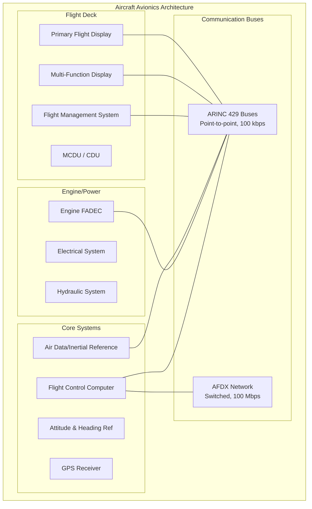
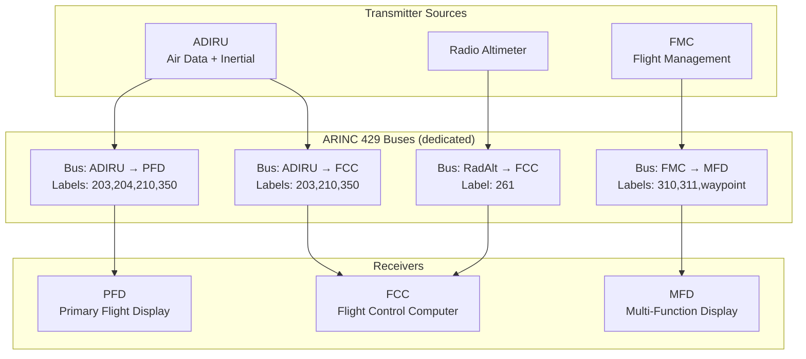
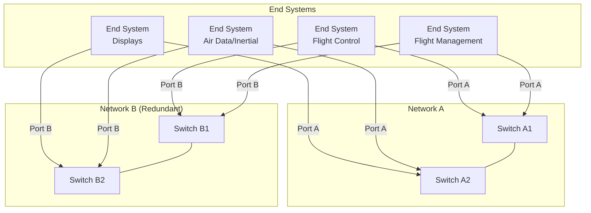

# ARINC Data Bus Standards — Avionics Communication Networks

**Topic:** ARINC 429, ARINC 664 Part 7 (AFDX), ARINC 825 (CAN Bus), ARINC 629, ARINC 717/767  
**Standards:** ARINC 429-18, ARINC 664P7-1, ARINC 825-5, ARINC 629-4, ARINC 717-13  
**SDO:** AEEC (Airlines Electronic Engineering Committee) / SAE ITC (International Telecommunications Committee)  
**Audience:** Avionics systems engineers, data bus integrators, DO-178C/DO-254 developers, aircraft network designers  
**Prerequisites:** Digital communications fundamentals, Manchester encoding, Ethernet basics, real-time systems concepts

---

## Chapter 1 — Historical Context & Origin Story

### 1.1 ARINC Data Bus Evolution

| Year | Standard | Significance |
|------|----------|--------------|
| 1953 | ARINC formed | Airlines Electronic Engineering Committee |
| 1977 | ARINC 429 | Digital data bus standard (replaces analog/synchro) |
| 1980s | ARINC 629 | Multi-transmitter bus (Boeing 777) |
| 1988 | ARINC 717 | Digital flight data recorder interface |
| 2005 | ARINC 664 Part 7 | AFDX — switched Ethernet for aircraft (A380) |
| 2007 | ARINC 825 | CAN bus for aircraft applications |
| 2012 | ARINC 664P7-1 | Enhanced AFDX (updated) |
| 2019 | ARINC 825-5 | CAN bus updated for DO-178C integration |
| 2020s | TSN (emerging) | Time-Sensitive Networking for next-gen avionics |

### 1.2 Technology Generations

| Generation | Era | Technology | Bandwidth | Aircraft |
|-----------|-----|------------|-----------|----------|
| Gen 1 | 1970s | ARINC 429 (simplex) | 100 kbps | 757/767, A320 |
| Gen 2 | 1990s | ARINC 629 (multi-tx) | 2 Mbps | 777 |
| Gen 2.5 | 1990s | MIL-STD-1553B | 1 Mbps | Military (F-16, F-22) |
| Gen 3 | 2000s | AFDX (switched Ethernet) | 100 Mbps | A380, A350, 787 |
| Gen 4 | 2020s+ | TSN / DDS / 1G Ethernet | 1+ Gbps | Future programs |

---

## Chapter 2 — Standard Architecture & Structure

### 2.1 ARINC Data Bus Comparison

| Feature | ARINC 429 | ARINC 629 | ARINC 664P7 (AFDX) | ARINC 825 (CAN) | MIL-STD-1553B |
|---------|-----------|-----------|--------------------|-----------------|--------------| 
| Topology | Point-to-point (bus) | Multi-transmitter bus | Switched network | Multi-master bus | Command/response bus |
| Speed | 12.5 / 100 kbps | 2 Mbps | 10/100 Mbps | 1 Mbps | 1 Mbps |
| Transmitters | 1 per bus | Multiple (120) | Multiple (switched) | Multiple | 1 Bus Controller |
| Receivers | Up to 20 | Multiple | Multiple (VLs) | Multiple | Up to 31 RTs |
| Redundancy | Separate buses | Dual bus | Dual network (A/B) | Dual CAN | Dual bus |
| Determinism | Inherent (periodic) | CSMA (basic priority) | Virtual Links (BAG) | Priority (ID-based) | TDM (time slots) |
| Encoding | Bipolar RZ | Manchester | 8B/10B (Ethernet) | NRZ (CAN 2.0) | Manchester |
| Wire | Twisted pair (shielded) | Twisted pair | Cat5e / fiber | Twisted pair | Twisted pair (shielded) |
| Aircraft use | Most civil aircraft | Boeing 777 | A380, A350, 787 | Sensors, actuators | Military platforms |

### 2.2 System Architecture Overview



---

## Chapter 3 — Technical Deep Dive

### 3.1 ARINC 429 — Detailed

**Physical layer:**
- Twisted shielded pair (75-85 Ω impedance)
- Bipolar Return-to-Zero (RZ) encoding
- High speed: 100 kbps ± 1% | Low speed: 12.5 kbps ± 1%
- Voltage: +10V (HI), -10V (LO), 0V (NULL)
- Simplex: one transmitter, up to 20 receivers

**Word format (32 bits):**

| Bits | Field | Description |
|------|-------|-------------|
| 1-8 | Label | Equipment/parameter identification (octal) |
| 9-10 | SDI | Source/Destination Identifier |
| 11-28 | Data | Parameter value (BNR or BCD) |
| 29-30 | SSM | Sign/Status Matrix |
| 31 | Parity | Odd parity (bit 32) |
| 32 | Parity bit | Ensures odd number of 1s |

**Data encoding formats:**
- BNR (Binary): Twos-complement binary for analog parameters (altitude, airspeed)
- BCD (Binary Coded Decimal): For discrete digits (frequencies, codes)
- Discrete: Individual bit flags (switches, status)

**Label examples (ARINC 429 Attachment 2):**

| Label (Octal) | Parameter | Rate |
|------|-----------|------|
| 203 | Computed airspeed | 50 ms |
| 204 | Mach number | 100 ms |
| 210 | Altitude | 50 ms |
| 310 | Latitude | 200 ms |
| 311 | Longitude | 200 ms |
| 350 | Heading (magnetic) | 50 ms |
| 270 | Discrete status | On change |

### 3.2 ARINC 664 Part 7 (AFDX) — Detailed

**Architecture:** Deterministic switched Ethernet for safety-critical avionics.

| Feature | Value |
|---------|-------|
| Physical | Full-duplex switched Ethernet (100BASE-TX or 1000BASE-T) |
| Frame format | IEEE 802.3 with AFDX-specific fields |
| Determinism | Virtual Links (VL) with Bandwidth Allocation Gap (BAG) |
| Redundancy | Dual independent networks (Network A, Network B) |
| Switching | Purpose-built AFDX switches (not commercial Ethernet) |
| Integrity | Sequence number, redundancy management, CRC |
| Jitter | Bounded by BAG and technology latency |

**Virtual Link (VL) concept:**

```mermaid
graph LR
    subgraph "End System 1"
        ES1[End System 1<br/>Source<br/>VL100: 128 bytes, BAG=4ms<br/>VL200: 512 bytes, BAG=16ms]
    end
    
    subgraph "Switch 1"
        SW1[AFDX Switch<br/>Policing: rate limiting<br/>per VL (BAG enforcement)]
    end
    
    subgraph "Switch 2"
        SW2[AFDX Switch<br/>Forward based on<br/>VL destination table]
    end
    
    subgraph "End Systems"
        ES2[End System 2<br/>Receiver VL100]
        ES3[End System 3<br/>Receiver VL100, VL200]
    end
    
    ES1 --> SW1
    SW1 --> SW2
    SW2 --> ES2
    SW2 --> ES3
```

**Key parameters:**
- **BAG (Bandwidth Allocation Gap):** Minimum interval between frames on a VL (1, 2, 4, 8, 16, 32, 64, 128 ms)
- **Lmax:** Maximum frame size for a VL (64–1518 bytes)
- **Bandwidth per VL:** $BW = \frac{L_{max} \times 8}{BAG}$ bits/sec
- **Jitter:** Technology-dependent (switch latency) ≤ 500 µs typical
- **Maximum latency:** Bounded and calculable (switches add fixed delay)

**AFDX Frame Format:**

| Field | Bytes | Content |
|-------|-------|---------|
| Destination MAC | 6 | Multicast (VL ID encoded) |
| Source MAC | 6 | End System ID |
| Ethertype | 2 | 0x0800 (IPv4) |
| IP header | 20 | Standard IPv4 (UDP) |
| UDP header | 8 | Source/dest port |
| Payload | 0-1471 | Application data |
| Sequence number | 1 | Frame sequencing (0-255) |
| FCS | 4 | Ethernet CRC-32 |

### 3.3 ARINC 825 (CAN for Aircraft)

**Overview:** CAN 2.0B adapted for aircraft use with aviation-specific extensions.

| Feature | Value |
|---------|-------|
| Physical | CAN 2.0B (ISO 11898-2) |
| Speed | 1 Mbps (standard), 125/250/500 kbps |
| Frame | Extended (29-bit ID) |
| ID structure | Function Code + LCC + Node ID |
| Applications | Smart sensors, actuators, utility systems |
| Certification | Can support up to DAL C applications |

**ARINC 825 ID Structure (29 bits):**

| Bits | Field | Description |
|------|-------|-------------|
| 28-26 | LCC | Logical Communication Channel (priority) |
| 25-19 | Function Code | Message type |
| 18-11 | Source ID | Transmitting node |
| 10-3 | Server/Client | Service identification |
| 2-0 | Reserved | Future use |

### 3.4 ARINC 629 (Boeing 777)

| Feature | Value |
|---------|-------|
| Architecture | Multi-transmitter, linear bus |
| Speed | 2 Mbps |
| Access method | CSMA with terminal gap protocol |
| Terminals | Up to 120 per bus |
| Word size | 20-bit word, 16-bit data + 4-bit label |
| Aircraft | Boeing 777 (primary avionics bus) |
| Status | Legacy (replaced by AFDX in new designs) |

---

## Chapter 4 — Implementation Guide

### 4.1 ARINC 429 Implementation

**Hardware components:**

| Component | Function |
|-----------|----------|
| Line driver (TX) | Generates bipolar RZ signal (±10V) |
| Line receiver (RX) | Detects and decodes bipolar RZ |
| Controller ASIC/FPGA | Word formatting, label filtering, FIFO |
| Isolation transformer | Galvanic isolation (lightning protection) |

**Common ARINC 429 ICs:**

| Vendor | Part | Channels |
|--------|------|----------|
| DDC (Data Device Corp) | DD-42912 | 12 TX + 12 RX |
| Holt Integrated | HI-3593 | 1 TX + 2 RX (SPI) |
| Holt Integrated | HI-3210 | 2 TX + 4 RX |
| ACCES I/O | AcroPack | 4-16 channels |

### 4.2 AFDX Implementation

**End System design:**

| Component | Function |
|-----------|----------|
| PHY (100BASE-TX) | Physical Ethernet interface |
| MAC | Frame generation/reception |
| Virtual Link scheduler | Enforces BAG timing per VL |
| Redundancy management | Dual-network integrity checking |
| Sequence number | Detect missing/duplicate frames |
| Configuration tables | VL parameters (BAG, Lmax, destinations) |
| BITE | Built-in test (link status, error counters) |

**AFDX Switch design:**

| Function | Detail |
|----------|--------|
| Policing | Rate-limit each VL (reject excess traffic) |
| Filtering | Accept only configured VL source/dest |
| Forwarding | Static routing table (no learning) |
| Priority | 2 priority levels (high/low) |
| Redundancy | Independent A/B network paths |
| Monitoring | Port statistics, error counters |

### 4.3 Latency Calculation (AFDX)

**End-to-end maximum latency:**

$$T_{max} = T_{ES\_queuing} + \sum_{switches} T_{switch} + T_{propagation} + T_{jitter}$$

| Component | Typical Value |
|-----------|---------------|
| End System queuing | BAG (worst case) |
| Switch latency | 10-150 µs per switch |
| Propagation (100m cable) | ~0.5 µs |
| Technology jitter | ≤ 500 µs |

**Example:** VL with BAG=4ms, 2 switches:  
$T_{max} = 4ms + 2 \times 0.15ms + 0.001ms + 0.5ms = 4.8ms$

---

## Chapter 5 — Certification & Audit

### 5.1 DO-178C/DO-254 Considerations per Bus

| Bus | SW DAL | HW DAL | Certification Path |
|-----|--------|--------|-------------------|
| ARINC 429 | A-E (depends on function) | A-E | Mature; many certified designs exist |
| AFDX End System | A-D (function-dependent) | A-D | COTS AFDX End Systems available (DAL A) |
| AFDX Switch | A-B (network is safety-critical) | A-B | Switch is shared resource (high assurance) |
| ARINC 825 (CAN) | B-C (typically) | B-C | Newer; fewer certified implementations |

### 5.2 Certification Artifacts

| Artifact | Content |
|----------|---------|
| ICD (Interface Control Document) | All bus parameters, labels, VLs, timing |
| Network Loading Analysis | Bandwidth utilization ≤ capacity (AFDX) |
| Latency Analysis | Worst-case end-to-end delay (deterministic proof) |
| FMEA | Failure modes of bus interface (stuck, babbling, silent) |
| Test procedures | Conformance testing (protocol compliance) |
| EMI/EMC test results | DO-160G Section 20-22 compliance |

---

## Chapter 6 — Regional & Domain Variants

| Platform | Primary Bus | Secondary | Notes |
|----------|-------------|-----------|-------|
| Airbus A320 (original) | ARINC 429 | — | Pure 429 architecture |
| Airbus A380 | AFDX | ARINC 429 (sensors) | First AFDX aircraft |
| Airbus A350 | AFDX | ARINC 429 | Enhanced AFDX |
| Boeing 777 | ARINC 629 | ARINC 429 | Only 629 aircraft |
| Boeing 787 | AFDX | ARINC 429, CAN | Common Core System |
| Boeing 737 MAX | ARINC 429 | — | Traditional architecture |
| Embraer E2 | AFDX | ARINC 429 | Primus Epic IMA |
| Military (F-16, F-22) | MIL-STD-1553B | Fiber Channel | Military standard |
| Helicopters | ARINC 429 | MIL-STD-1553B | Mixed civil/military |
| UAVs/Drones | CAN (ARINC 825) | Ethernet | Weight/cost sensitive |

---

## Chapter 7 — Comparison: ARINC 429 vs AFDX

| Dimension | ARINC 429 | AFDX (ARINC 664P7) |
|-----------|-----------|---------------------|
| Year introduced | 1977 | 2005 |
| Bandwidth | 100 kbps | 100 Mbps (1000× more) |
| Topology | Point-to-point (1TX → N RX) | Switched full-duplex |
| Wiring | Many dedicated buses (100s of wires) | 2 networks (significantly less wiring) |
| Weight | Heavy (hundreds of buses) | Light (shared network) |
| Determinism | Inherent (periodic, no contention) | Designed (VLs, BAG, policing) |
| Flexibility | Low (dedicated bus per function) | High (add VLs by configuration) |
| Cost of change | High (rewiring) | Low (software/table change) |
| Proven track record | 45+ years | 20 years |
| Certification heritage | Extensive (thousands of applications) | Growing (A380, A350, 787) |
| Failure mode | Bus affects only connected systems | Switch failure affects many systems |
| Typical use today | Sensors, legacy interfaces | Core IMA backbone |

---

## Chapter 8 — Mermaid Architecture Diagrams

### 8.1 ARINC 429 Multi-Bus Architecture



### 8.2 AFDX Dual-Network Architecture



---

## Chapter 9 — Case Studies & Failure Analysis

### 9.1 AFDX Babbling Idiot Protection

**Problem:** What if an End System transmits more traffic than its VL allocation (malfunction)?

**AFDX solution:** Switch policing — each AFDX switch monitors incoming traffic per VL. If frames arrive faster than BAG allows → excess frames dropped at switch. Effect: faulty End System cannot starve other VLs. Network determinism maintained for all other traffic.

**Comparison with ARINC 429:** 429's point-to-point topology inherently isolates — one bus failure cannot affect another bus. AFDX uses switch policing to achieve equivalent isolation.

### 9.2 ARINC 429 Data Staleness

**Problem:** ARINC 429 receivers get periodic data (e.g., altitude every 50ms). If transmitter fails silent (no signal), receiver continues using last received value → stale data.

**Mitigation:** (1) SSM field (Sign/Status Matrix): transmitter sets "Normal Operation," "Test," "Failure," or "No Computed Data." (2) Receiver timeout: if no new word received within expected period + margin → declare data invalid. (3) Cross-check: compare with other sources (e.g., barometric altitude vs GPS altitude).

---

## Chapter 10 — Future Evolution & Industry Trends

| Trend | Timeline | Description |
|-------|----------|-------------|
| Time-Sensitive Networking (TSN) | 2025+ | IEEE 802.1 TSN for next-gen avionics |
| 1 Gbps AFDX | 2025+ | Higher bandwidth for future aircraft |
| TTP (Time-Triggered Protocol) | Niche | Deterministic for ultra-critical |
| DDS (Data Distribution Service) | Emerging | Publish-subscribe for avionics middleware |
| SpaceWire | Space | High-speed serial link for spacecraft |
| Fiber optics | Growing | Weight reduction, EMI immunity |
| Wireless avionics (WAIC) | Emerging | Intra-aircraft wireless (sensor networks) |
| ARINC 429 sunset | Gradual | Will remain for sensors/simple interfaces decades |

---

## Chapter 11 — Interview Questions & Career Guide

### Tier 1: Entry-Level

**Q1:** Explain the ARINC 429 word format and why it uses bipolar RZ encoding.  
**A:** **32-bit word format:** Bits 1-8: Label (identifies the parameter, octal notation). Bits 9-10: SDI (Source/Destination Identifier — multi-system discrimination). Bits 11-28: Data (18 bits — BNR twos-complement or BCD). Bits 29-30: SSM (Sign/Status Matrix — data validity indicator). Bit 31-32: Parity (odd parity for error detection). **Bipolar RZ encoding:** Signal uses three levels: +10V (logic HI), -10V (logic LO), 0V (NULL). "Return to Zero" means signal returns to 0V between each bit period. **Why bipolar RZ:** (1) Self-clocking: transitions provide timing reference (no separate clock line). (2) DC balance: equal positive and negative voltages → no DC offset buildup. (3) Null detection: absence of signal (no transitions) = no transmission → easy silence detection. (4) Noise immunity: large voltage swing (20V peak-to-peak) → excellent noise margin in aircraft environment.

### Tier 2: Mid-Level

**Q2:** How does AFDX achieve deterministic behavior using Virtual Links, and how is bandwidth guaranteed?  
**A:** **Virtual Link (VL):** A unidirectional logical connection from one source End System to one or more destination End Systems. Each VL has two guaranteed parameters: (1) **BAG (Bandwidth Allocation Gap):** Minimum time between consecutive frames on this VL. Values: 1, 2, 4, 8, 16, 32, 64, 128 ms. Source cannot transmit faster than one frame per BAG period. (2) **Lmax:** Maximum frame size for this VL (bytes). **Bandwidth guarantee:** Maximum bandwidth per VL = (Lmax × 8) / BAG bits/sec. Example: Lmax = 512 bytes, BAG = 4ms → BW = 4096/0.004 = 1.024 Mbps. **Determinism mechanism:** (a) **Source-side:** VL scheduler in End System enforces BAG timing. Only transmits at configured rate. (b) **Switch-side policing:** Each AFDX switch independently monitors incoming frames per VL. If frames arrive faster than BAG → dropped (babbling idiot protection). (c) **Static routing:** Switches use configured forwarding tables (no dynamic learning). Path through network is deterministic. (d) **Priority:** Two levels (high priority for critical, low for less critical). High always forwarded before low. (e) **Bounded latency:** Since every VL is rate-limited and paths are static → worst-case latency is calculable and bounded. **Network planning:** Total VL bandwidth sum must not exceed link capacity (network loading analysis required for certification).

### Tier 3: Senior

**Q3:** You're architecting the communication network for a new aircraft with IMA. Compare bus technologies and justify your selection.  
**A:** **Architecture decision framework:** (1) **Core backbone (IMA cabinets):** AFDX (ARINC 664P7). Justification: High bandwidth (100 Mbps, upgradeable to 1 Gbps), deterministic (VLs), proven in A380/A350/787, supports IMA resource sharing. Dual-redundant networks for fault tolerance. (2) **Sensor interfaces (remote data concentrators):** ARINC 429 for legacy sensors. Justification: Thousands of qualified sensors speak 429, simple integration, point-to-point isolation (no cascading failures). ARINC 825 (CAN) for new smart sensors. Justification: Lighter wiring than multiple 429 buses, bidirectional, suitable for distributed I/O. DAL C applications (utility systems, cabin). (3) **Flight-critical I/O (fly-by-wire):** Dedicated ARINC 429 or dedicated AFDX VLs with strict isolation. Justification: FBW must be independent of other traffic. Separate physical network or strict VL policing. Consider TTP/FlexRay for highest criticality (time-triggered, deterministic). (4) **Network architecture principles:** Defense in depth: physical separation (dedicated buses) + logical separation (VL policing) + application-level validation. Independence: dissimilar networks for redundant channels (channel A on network A, channel B on network B). Latency budget: allocate latency to each segment (sensor → RDC → AFDX → IMA → actuator). Network loading: prove total bandwidth < capacity with margin (typically ≤ 70% utilization). (5) **Certification strategy:** AFDX switches: DAL A (shared safety-critical resource). End Systems: DAL per function (A for FBW, D for cabin). ARINC 429 interfaces: re-use certified ICs (Holt, DDC). Network analysis tool: prove determinism (schedulability analysis, worst-case latency). DO-178C for all network SW, DO-254 for ASIC/FPGA End Systems.

---

## Chapter 12 — Cheat Sheet & Quick Reference

### ARINC 429 Quick Reference

```
Speed:       100 kbps (high) / 12.5 kbps (low)
Encoding:    Bipolar Return-to-Zero (±10V)
Topology:    1 transmitter → up to 20 receivers (simplex)
Word:        32 bits [Label(8) | SDI(2) | Data(18) | SSM(2) | Parity(1)]
Data format: BNR (binary) or BCD (decimal)
SSM values:  00=Normal, 01=No Computed Data, 10=Test, 11=Failure
Impedance:   75-85 Ω (shielded twisted pair)
```

### AFDX Quick Reference

```
Speed:       100 Mbps full-duplex (Ethernet-based)
Topology:    Switched, dual redundant (Network A + B)
Determinism: Virtual Links (VL) with BAG timing
BAG values:  1, 2, 4, 8, 16, 32, 64, 128 ms
Frame:       Standard Ethernet + sequence number
Max frame:   1518 bytes (Ethernet standard)
Policing:    Switch drops excess traffic per VL
Latency:     Bounded, calculable (switch hops × latency)
```

### Bus Selection Decision Tree

```
Need > 1 Mbps?
  YES → AFDX (100 Mbps switched Ethernet)
  NO  → Continue...
    
Need point-to-point simplicity?
  YES → ARINC 429 (proven, isolated, simple)
  NO  → Continue...

Need multi-master for sensors?
  YES → ARINC 825 / CAN (bidirectional, lightweight)
  NO  → Continue...

Military application?
  YES → MIL-STD-1553B (command/response, proven)
  NO  → ARINC 429 or AFDX (civil standard)
```

---

*End of Document — 06_ARINC_Data_Bus_Standards.md*
