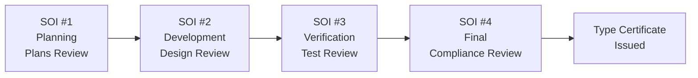

# FAA Type Certification — Airworthiness Approval Process

**Topic:** FAA Type Certification, FAR Part 25/23, Advisory Circulars, DER/ODA, SOI Process  
**Standards:** 14 CFR Part 25, Part 23, AC 20-115D, AC 25.1309-1A, Order 8110.49, FAA Order 8150.1  
**SDO:** FAA (Federal Aviation Administration), US Department of Transportation  
**Audience:** DERs (Designated Engineering Representatives), certification engineers, project leads, ODA holders, compliance managers  
**Prerequisites:** Aviation regulatory fundamentals, DO-178C/DO-254 familiarity, ARP4754A system concepts

---

## Chapter 1 — Historical Context & Origin Story

### 1.1 FAA Certification Timeline

| Year | Event |
|------|-------|
| 1926 | Air Commerce Act (first US aviation regulation) |
| 1938 | Civil Aeronautics Act (CAA established) |
| 1958 | Federal Aviation Act → FAA created |
| 1967 | DOT established, FAA under DOT |
| 1970s | FAR Part 25 (Transport Category) codified |
| 1981 | DER (Designated Engineering Representative) program formalized |
| 2005 | ODA (Organization Designation Authorization) program |
| 2009 | Part 23 rewrite initiative (performance-based) |
| 2017 | Part 23 Amendment 64 (revolutionary rewrite) |
| 2019 | Boeing 737 MAX: certification reform begins |
| 2020 | FAA Order 8110.49A (software approval) updated |
| 2024 | FAA Reauthorization Act: enhanced oversight requirements |

### 1.2 Certification Types

| Type | Purpose | Example |
|------|---------|---------|
| Type Certificate (TC) | New aircraft/engine/propeller design | Boeing 787 TC |
| Supplemental Type Certificate (STC) | Modification to existing TC | Adding winglets to 737 |
| Amended Type Certificate (ATC) | Major change to existing TC | 737 MAX from 737 NG |
| Parts Manufacturer Approval (PMA) | Replacement/modification parts | Aftermarket brake disc |
| Technical Standard Order (TSO) | Standalone article approval | GPS receiver to TSO-C196 |
| Field Approval | Minor modification (single aircraft) | Instrument panel change |

---

## Chapter 2 — Standard Architecture & Structure

### 2.1 FAR (Federal Aviation Regulations) Structure

| Part | Category | Examples |
|------|----------|---------|
| Part 21 | Certification procedures (how to certify) | Subpart B (TC), Subpart O (ODA) |
| Part 23 | Normal category airplanes (≤19 pax, single/multi-engine) | Cessna, Cirrus, King Air |
| Part 25 | Transport category airplanes | Boeing, Airbus, Embraer |
| Part 27 | Normal category rotorcraft | Bell 407, Robinson R44 |
| Part 29 | Transport category rotorcraft | S-92, CH-47 (civil) |
| Part 33 | Aircraft engines | CFM LEAP, PW1000G |
| Part 35 | Propellers | Hamilton Standard |

### 2.2 Certification Basis

```mermaid
graph TB
    subgraph "Certification Basis"
        TYPE[Type Certificate Application]
        AMDT[Applicable Amendment<br/>(date of application)]
        SC[Special Conditions<br/>(novel features)]
        ELOS[Equivalent Level of Safety<br/>(alternate compliance)]
        EXMPT[Exemptions<br/>(if regulation impossible)]
    end
    
    subgraph "Means of Compliance"
        AC[Advisory Circulars<br/>AC 20-115D (software)<br/>AC 25.1309-1A (systems)]
        CERT_PLAN[Certification Plan<br/>Show compliance method per rule]
        CRI[Certification Review Items<br/>Agreed method of compliance]
    end
    
    subgraph "Showing Compliance"
        ANALYSIS[Analysis & Calculation]
        TEST[Testing (ground + flight)]
        INSPECTION[Inspection]
        SIM[Simulation]
        COMBO[Combination]
    end
    
    TYPE --> AMDT
    TYPE --> SC
    TYPE --> ELOS
    TYPE --> EXMPT
    AMDT --> CERT_PLAN
    SC --> CERT_PLAN
    CERT_PLAN --> AC
    AC --> ANALYSIS
    AC --> TEST
    AC --> INSPECTION
    AC --> SIM
    AC --> COMBO
```

### 2.3 Key FAR 25 Sections for Avionics/Systems

| Section | Title | Requirement |
|---------|-------|-------------|
| 25.1301 | Function and installation | Each item must function properly |
| 25.1309 | Equipment, systems, installations | Safety assessment (probability + severity) |
| 25.1316 | System lightning protection | HIRF/lightning immunity |
| 25.1317 | HIRF protection | High Intensity Radiated Fields |
| 25.1322 | Flight crew alerting | Warning, caution, advisory systems |
| 25.1329 | Flight guidance system | Autopilot, flight director, autothrottle |
| 25.1353 | Electrical equipment | Design standards for electrical systems |
| 25.1431 | Electronic equipment | Installation standards |
| 25.1523 | Minimum flight crew | Workload assessment |

---

## Chapter 3 — Technical Deep Dive

### 3.1 FAR 25.1309 — The Core Safety Rule

**Full text (simplified):**
"The airplane equipment, systems, and installations ... must be designed to ensure that ... the occurrence of any failure condition which would prevent the continued safe flight and landing ... is extremely improbable."

**Compliance framework (AC 25.1309-1A):**

| Failure Classification | Probability | Development Assurance | Effect |
|-----------------------|-------------|----------------------|--------|
| Catastrophic | < 10⁻⁹/fh | DAL A | Loss of aircraft |
| Hazardous/Severe Major | < 10⁻⁷/fh | DAL B | Large safety margin reduction |
| Major | < 10⁻⁵/fh | DAL C | Significant safety margin reduction |
| Minor | < 10⁻³/fh | DAL D | Slight safety margin reduction |
| No Safety Effect | — | DAL E | No effect on safety |

### 3.2 SOI (Stage of Involvement) Process

| SOI | Phase | FAA Activity | Applicant Activity |
|-----|-------|-------------|-------------------|
| SOI #1 | Planning | Review plans/standards | Submit plans (PSAC, PHAC, Safety Plan) |
| SOI #2 | Development | Review requirements & design | Submit HLR, architecture, safety analysis |
| SOI #3 | Verification | Review test plans & results | Submit test procedures & results |
| SOI #4 | Final | Review complete package | Submit final compliance documents |



### 3.3 AC 20-115D — Software Approval

| Topic | Content |
|-------|---------|
| Purpose | FAA acceptance of DO-178C as means of compliance |
| Scope | All airborne software requiring approval |
| Applicability | Part 23, 25, 27, 29, 33, 35, TSO |
| DO-178C supplements | DO-331 (MBD), DO-332 (OOT), DO-333 (FM) allowed |
| Tool qualification | TQL-1 through TQL-5 based on tool impact |
| SOI process | Four stages for software oversight |
| Key principle | "Intent-based" compliance (meet objectives, not prescriptive steps) |

### 3.4 DER (Designated Engineering Representative)

| Aspect | Detail |
|--------|--------|
| Authority | Acts on behalf of FAA Administrator |
| Types | Systems, Structures, Propulsion, Flight Test, Software |
| Appointment | FAA Order 8100.8 (designee management) |
| Scope | Defined in delegation letter (aircraft types, regulations) |
| Responsibility | Make findings of compliance for specific regulations |
| Limitation | Cannot approve own work (independence) |
| Software DER | Specifically trained in DO-178C, makes SOI findings |
| Number (US) | ~4000 active DERs across disciplines |

### 3.5 ODA (Organization Designation Authorization)

| Aspect | Detail |
|--------|--------|
| Authority | Organization authorized to make compliance findings |
| Scope | Broader than individual DER (organization-wide) |
| Unit members | Engineers with ODA authority (UM = Unit Members) |
| ODA holder | Boeing, Airbus NA, GE Aviation, Honeywell, Collins |
| FAA oversight | Periodic audits, spot checks, issue-based intervention |
| Benefit | Faster certification (fewer FAA engineer reviews) |
| Risk | Self-oversight → requires robust internal processes |
| Post-737 MAX | Enhanced FAA oversight of ODA activities required |

---

## Chapter 4 — Implementation Guide

### 4.1 Type Certificate Project Lifecycle

| Phase | Duration (typical) | Activities |
|-------|-------------------|-----------|
| Pre-application | 6-12 months | Familiarization, technology maturation |
| Application | Day 0 | Formal TC application filed (14 CFR 21.15) |
| Certification basis | 3-6 months | Agree applicable regulations + special conditions |
| Compliance planning | 6-12 months | Certification plan, means of compliance |
| Design & development | 2-5 years | Engineering, test article fabrication |
| Ground testing | 1-2 years | Structural, systems, environmental, EMI |
| Flight testing | 1-2 years | Certification flight test program |
| Final review | 6-12 months | Complete compliance documentation |
| TC issuance | Day N | Type Certificate issued |
| **Total typical** | **5-10 years** | **New transport aircraft** |

### 4.2 Certification Plan Structure

| Section | Content |
|---------|---------|
| 1. Project description | Aircraft/system description, novel features |
| 2. Certification basis | Applicable rules, amendments, SCs, ELOS |
| 3. Means of compliance | Method per regulation (analysis, test, inspection) |
| 4. Compliance schedule | Milestones, SOI timing |
| 5. Delegated activities | What DER/ODA will approve vs FAA |
| 6. Issue papers | Open certification issues requiring resolution |
| 7. Test plans | Ground + flight test overview |

### 4.3 Compliance Methods

| Method | When Used | Example |
|--------|-----------|---------|
| Analysis | Mathematical proof adequate | Fault tree for 25.1309 |
| Ground test | Physical test demonstrates compliance | EMI test for 25.1317 |
| Flight test | Must demonstrate in flight | Handling qualities (25.143) |
| Inspection | Visual/physical examination | Installation (25.1301) |
| Simulation | Validated simulation accepted | Icing performance |
| Similarity | Similar to previously approved design | Minor modifications |
| Combination | Multiple methods together | Analysis + test for systems |

---

## Chapter 5 — Certification & Audit

### 5.1 FAA Organization Structure (Certification)

| Office | Role |
|--------|------|
| Aircraft Certification Service (AIR) | Overall certification policy |
| AIR-600 | Transport Airplane Directorate |
| AIR-700 | Small Airplane & Rotorcraft |
| ACO (Aircraft Certification Office) | Regional offices (Seattle, Wichita, etc.) |
| Flight Standards (AFS) | Operational approval (airline oversight) |
| AVS (Aviation Safety) | Parent organization of AIR and AFS |

### 5.2 Post-737 MAX Reforms

| Reform | Detail |
|--------|--------|
| Aircraft Certification, Safety, and Accountability Act (2020) | Congressional mandate |
| Enhanced FAA oversight of ODA | More direct FAA involvement |
| System safety assessment reform | Additional scrutiny of assumptions |
| Human factors emphasis | Pilot interaction, training requirements |
| Whistleblower protections | ODA Unit Members can report to FAA directly |
| Multi-failure analysis | Consider combinations previously considered "extremely improbable" |
| Software transparency | FAA access to source data for critical systems |
| JATR (Joint Authorities Technical Review) | Multi-authority review for complex systems |

---

## Chapter 6 — Regional & Domain Variants

| Authority | Regulation | Scope |
|-----------|-----------|-------|
| FAA (US) | 14 CFR Part 25 | Transport aircraft |
| EASA (EU) | CS-25 | Large aeroplanes |
| TCCA (Canada) | CAR 525 | Transport category |
| ANAC (Brazil) | RBAC 25 | Transport category |
| CAAC (China) | CCAR-25 | Large aircraft (C919) |
| DGCA India | CAR 25 | Transport category |
| Bilateral (BASA) | US-EU agreement | Mutual recognition (with validation) |

### Bilateral Safety Agreement (BASA)

| Aspect | Detail |
|--------|--------|
| Purpose | Mutual acceptance of certification findings |
| US-EU | Technical Implementation Procedures (TIP) |
| Process | Validation: accepting authority reviews + validates |
| Limitation | Each authority retains sovereign approval right |
| Post-737 MAX | EASA performed independent review of 737 MAX return |

---

## Chapter 7 — Comparison: FAA vs EASA Certification

| Dimension | FAA | EASA |
|-----------|-----|------|
| Regulation | 14 CFR Part 25 | CS-25 |
| Advisory material | Advisory Circulars (AC) | Acceptable Means of Compliance (AMC) |
| Software standard | AC 20-115D → DO-178C | AMC 20-115D → ED-12C |
| Designation system | DER, ODA | DOA (Design Organisation Approval) |
| Issue resolution | Issue Papers + CRI | CRI (Certification Review Item) |
| Organization approval | ODA (US) | DOA (EU) |
| Flight test | FAA flight test branch | EASA flight test + NAA support |
| Independence | Post-MAX reforms ongoing | Historically more independent oversight |
| Novel features | Special Conditions (SC) | Special Conditions (CRI) |
| Timeline | Concurrent with EASA (for large programs) | Validation after FAA (for US-designed aircraft) |

---

## Chapter 8 — Mermaid Architecture Diagrams

### 8.1 Type Certificate Process Flow

```mermaid
graph TB
    APP[TC Application<br/>14 CFR 21.15] --> BASIS[Certification Basis<br/>Applicable rules<br/>+ Special Conditions]
    BASIS --> PLAN[Certification Plan<br/>Means of compliance<br/>per regulation]
    PLAN --> DEV[Design & Development<br/>Engineering work<br/>per DO-178C/DO-254]
    
    DEV --> SOI1[SOI #1: Plans OK?]
    SOI1 -->|Yes| SOI2[SOI #2: Design OK?]
    SOI2 -->|Yes| SOI3[SOI #3: Verification OK?]
    SOI3 -->|Yes| SOI4[SOI #4: Complete?]
    SOI4 -->|Yes| TIA[Type Inspection<br/>Authorization (TIA)]
    TIA --> FLT[Certification<br/>Flight Testing]
    FLT --> TC[Type Certificate<br/>Issued ✓]
    
    SOI1 -->|No| FIX1[Address findings]
    SOI2 -->|No| FIX2[Address findings]
    SOI3 -->|No| FIX3[Address findings]
    FIX1 --> SOI1
    FIX2 --> SOI2
    FIX3 --> SOI3
```

### 8.2 DER/ODA Delegation Structure

```mermaid
graph TB
    FAA[FAA Administrator<br/>Aviation Safety (AVS)]
    
    subgraph "Direct FAA"
        ACO[Aircraft Certification<br/>Office (ACO)]
        ASI[Aviation Safety<br/>Inspector (ASI)]
    end
    
    subgraph "Delegated (Individual)"
        DER[DER<br/>Designated Engineering<br/>Representative<br/>Individual authority]
    end
    
    subgraph "Delegated (Organization)"
        ODA[ODA<br/>Organization Designation<br/>Authorization<br/>Boeing, Honeywell, etc.]
        UM[Unit Members<br/>Engineers making findings<br/>within ODA scope]
    end
    
    FAA --> ACO
    FAA --> DER
    FAA --> ODA
    ACO --> ASI
    ODA --> UM
```

---

## Chapter 9 — Case Studies & Failure Analysis

### 9.1 Boeing 737 MAX Certification Issues

| Issue | Detail |
|-------|--------|
| MCAS (Maneuvering Characteristics Augmentation System) | Single-sensor (AoA) input to flight control |
| Classification | Originally assessed as "Major" (not Catastrophic) |
| Actual effect | Catastrophic (uncontrollable nose-down) |
| Root cause (certification) | Inadequate system safety assessment assumptions |
| ODA role | Boeing ODA approved MCAS changes with limited FAA oversight |
| Congressional finding | "Regulatory capture" — FAA too reliant on ODA |
| Fix | Dual AoA + disagree alert + pilot training + design change |
| Reform | Enhanced FAA oversight, multi-failure analysis, pilot HF |

### 9.2 Certification Success: Airbus A350 XWB

| Aspect | Achievement |
|--------|-------------|
| Timeline | TC application 2008 → TC issued 2014 (6 years) |
| Dual certification | FAA + EASA concurrent |
| Composite structure | >50% carbon fiber (novel → special conditions) |
| IMA architecture | AFDX-based, DAL A (new for Airbus program) |
| Software scope | >1 million lines DAL A/B code |
| Approach | Early engagement with both authorities |
| Key enabler | Mature DOA + experienced certification team |

---

## Chapter 10 — Future Evolution & Industry Trends

| Trend | Timeline | Description |
|-------|----------|-------------|
| Performance-based certification | Growing | Objectives not prescriptive rules (Part 23 model) |
| Automated certification evidence | Emerging | Model-based → automated compliance artifacts |
| eVTOL certification | 2024-2027 | New category (Part 21.17(b) SC) |
| Autonomous aircraft | 2027+ | No pilot → fundamental regulatory change |
| AI/ML in flight-critical systems | 2025+ | How to certify non-deterministic systems |
| Continuous airworthiness monitoring | Growing | Health monitoring replaces periodic inspection |
| Digital twin certification | Emerging | Virtual testing for compliance |
| International harmonization | Ongoing | Common standards (FAA/EASA/TCCA alignment) |
| Part 23 success → Part 25 reform | 2025+ | Performance-based approach for transport aircraft |

---

## Chapter 11 — Interview Questions & Career Guide

### Tier 1: Entry-Level

**Q1:** What is the purpose of FAR 25.1309 and how does it relate to DO-178C?  
**A:** **FAR 25.1309 purpose:** It's THE fundamental rule for aircraft systems safety. It requires that: (1) Systems perform their intended function. (2) No single failure causes a catastrophic condition. (3) Combinations of failures leading to catastrophic conditions are "extremely improbable" (< 10⁻⁹/fh). (4) The crew is alerted to unsafe conditions. **Relationship to DO-178C:** 25.1309 establishes the safety target (e.g., catastrophic = 10⁻⁹/fh). ARP4754A/ARP4761A perform safety assessment → determine DAL. DO-178C is the MEANS to achieve the required assurance level (DAL A–E). AC 20-115D connects them: "Compliance with DO-178C at the appropriate DAL is an acceptable means of showing compliance with the software aspects of 25.1309." So: 25.1309 = WHAT you must achieve. DO-178C = HOW you demonstrate it for software.

### Tier 2: Mid-Level

**Q2:** Explain the SOI process and what evidence is reviewed at each stage.  
**A:** **SOI (Stage of Involvement):** The framework for FAA oversight of software/hardware development projects. Defines WHEN the FAA (or DER/ODA) reviews evidence and makes findings. **SOI #1 — Planning (Start of project):** Evidence reviewed: Plan for Software Aspects of Certification (PSAC), Software Development Plan, Software Verification Plan, Configuration Management Plan, Quality Assurance Plan, transition criteria. FAA finding: Plans are adequate to achieve the required DAL objectives. **SOI #2 — Development (During design):** Evidence reviewed: High-Level Requirements (HLR), Software Architecture, traceability (requirements → design), preliminary safety analysis (PSSA inputs), derived requirements identified and fed back. FAA finding: Requirements and architecture are correct and consistent with safety requirements. **SOI #3 — Verification (During testing):** Evidence reviewed: Test procedures, test results, structural coverage results (MC/DC for DAL A), problem reports (open/closed), verification method adequacy. FAA finding: Verification complete and successful, all objectives met. **SOI #4 — Final (End of project):** Evidence reviewed: Software Configuration Index (SCI), Software Accomplishment Summary (SAS), open problem report summary, configuration management records, final release. FAA finding: All DO-178C objectives met, software approved for intended function at stated DAL. **Key principle:** SOI is NOT prescriptive timing. Applicant and FAA/DER agree on when to conduct each SOI. Multiple SOI #2s may occur (iterative development). SOI #3 may overlap with SOI #2. Flexibility while maintaining rigor.

### Tier 3: Senior

**Q3:** How would you handle a novel technology (e.g., AI/ML in DAL B application) that has no existing Advisory Circular?  
**A:** **Step 1: Identify the regulatory gap.** FAR 25.1309 still applies (technology-neutral regulation). But no AC exists for AI/ML as means of compliance. DO-178C assumes deterministic software (AI/ML is inherently non-deterministic). Issue: How to show "correct behavior under all operating conditions" for learning systems? **Step 2: Engage FAA early (pre-application).** Request familiarization meeting with ACO. Present: technology description, intended function, proposed safety architecture. Objective: Understand FAA's risk perception, identify path forward. **Step 3: Propose certification approach.** Option A — Special Condition: Propose SC per 14 CFR 21.16 for novel feature. Define performance requirements (not implementation requirements). Define monitoring/oversight architecture. Option B — Equivalent Level of Safety (ELOS): Propose that architectural safeguards provide equivalent safety to traditional DO-178C DAL B. **Step 4: Develop certification plan for AI/ML:** (a) Architectural containment: AI/ML operates within safety monitor envelope. Traditional (DO-178C DAL A) monitor validates AI/ML outputs. If AI/ML output exceeds envelope → traditional backup takes over. (b) Training data assurance: Demonstrate training data completeness, absence of bias. Configuration management of training sets (version-controlled). (c) Operational domain: Define "Operational Design Domain" (ODD) clearly. Show adequate performance within ODD (extensive testing). (d) Runtime monitoring: Real-time confidence monitoring. Graceful degradation if confidence drops. (e) Verification approach: Requirements-based testing (input/output behavior). Robustness testing (adversarial inputs, edge cases). Statistical demonstration (millions of test cases for probability argument). **Step 5: Issue Paper / CRI.** Document the agreed means of compliance as an Issue Paper (FAA) or CRI (joint with EASA). This becomes the project-specific "AC equivalent." Other programs can reference it as precedent. **Step 6: Long-term industry participation.** Engage in EUROCAE WG-114 / SAE G-34 (AI/ML certification standards). Contribute lessons learned to emerging guidance (future AC). FAA Roadmap for AI Safety Assurance.

---

## Chapter 12 — Cheat Sheet & Quick Reference

### FAR 25.1309 Probability Requirements

```
Catastrophic:  < 10⁻⁹/fh  → DAL A (extremely improbable)
Hazardous:     < 10⁻⁷/fh  → DAL B (extremely remote)
Major:         < 10⁻⁵/fh  → DAL C (remote)
Minor:         < 10⁻³/fh  → DAL D (reasonably probable)
No Effect:     No requirement → DAL E
```

### SOI Quick Summary

```
SOI #1 (Planning):      Plans OK? → PSAC, SDP, SVP, CMP, QAP
SOI #2 (Development):   Design OK? → HLR, architecture, traceability
SOI #3 (Verification):  Testing OK? → Results, coverage, PRs closed
SOI #4 (Final):         Complete? → SCI, SAS, config records
```

### Key Advisory Circulars

```
AC 20-115D:     Software (DO-178C acceptance)
AC 25.1309-1A:  System safety assessment (probability/severity)
AC 20-152A:     DO-254 acceptance (airborne electronic hardware)
AC 20-174:      DO-326A acceptance (security)
AC 25.1322-1:   Flight crew alerting
AC 25.1329-1C:  Flight guidance systems
```

### Certification Paths

```
New design:        Type Certificate (TC) — 14 CFR 21.11
Modification:      Supplemental Type Certificate (STC) — 21.113
Standalone article: Technical Standard Order (TSO) — 21.603
Parts:             Parts Manufacturer Approval (PMA) — 21.303
Minor change:      Field Approval (Form 337) — 21.95
```

---

*End of Document — 07_FAA_Type_Certification.md*
