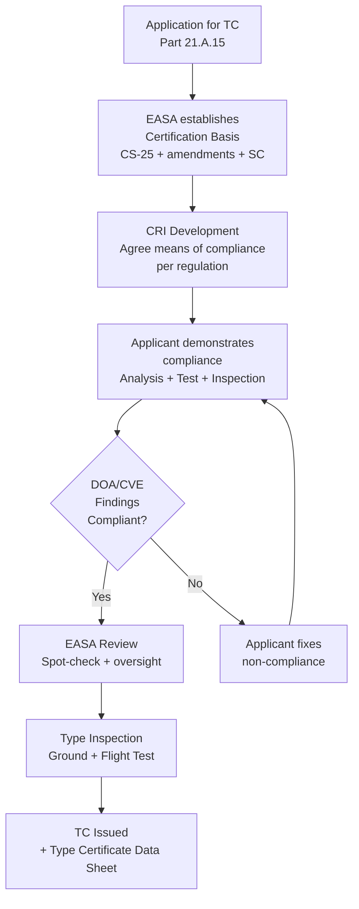
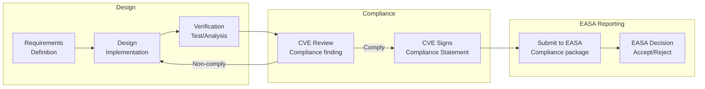

# EASA CS-25 Certification — European Aviation Safety

**Topic:** EASA CS-25 (Large Aeroplanes), CS-23, AMC 20-3, AMC 20-115D, AMC 20-152A, CM-AS-006  
**Standards:** CS-25 Amendment 27, CS-23 Amendment 5, AMC/GM 20-115D, AMC/GM 20-152A  
**SDO:** EASA (European Union Aviation Safety Agency)  
**Audience:** Design Organisation Approval (DOA) engineers, EASA certification specialists, compliance managers, CVEs  
**Prerequisites:** FAA certification basics (Part 25), DO-178C/DO-254, system safety concepts (ARP4754A/4761A)

---

## Chapter 1 — Historical Context & Origin Story

### 1.1 EASA Evolution Timeline

| Year | Event |
|------|-------|
| 1970 | JAA (Joint Aviation Authorities) formed |
| 1990s | JAR-25 (Joint Aviation Requirements) for transport aircraft |
| 2002 | EASA established (Regulation EC 1592/2002) |
| 2003 | EASA operational (took over JAA functions) |
| 2008 | Basic Regulation update (EC 216/2008) |
| 2018 | New Basic Regulation (EU 2018/1139) |
| 2020 | CS-25 Amendment 26 (latest major) |
| 2022 | Part-IS (Information Security regulation) |
| 2023 | CS-25 Amendment 27 |
| 2024 | Enhanced oversight (post-737 MAX reform) |

### 1.2 From JAA to EASA

| Aspect | JAA (pre-2003) | EASA (2003+) |
|--------|---------------|-------------|
| Legal status | Coordination body (no legal force) | EU Agency (legally binding) |
| Standards | JAR-25 (recommendation) | CS-25 (Certification Specification) |
| Approval | National authorities issued certificates | EASA issues Type Certificate |
| Scope | Airworthiness only | Airworthiness + operations + licensing + ATM |
| Staff | ~100 (coordination only) | ~1000+ (full certification authority) |

---

## Chapter 2 — Standard Architecture & Structure

### 2.1 EASA Regulatory Framework

```mermaid
graph TB
    subgraph "EU Level"
        BR[Basic Regulation<br/>EU 2018/1139<br/>Essential requirements]
    end
    
    subgraph "Implementing Rules"
        IR_21[Part 21<br/>Certification of aircraft<br/>+ organizations]
        IR_ML[Part M / Part ML<br/>Continuing airworthiness]
        IR_145[Part 145<br/>Maintenance organisations]
    end
    
    subgraph "Certification Specifications"
        CS25[CS-25<br/>Large Aeroplanes]
        CS23[CS-23<br/>Normal-category Aeroplanes]
        CSETSO[CS-ETSO<br/>European TSO]
    end
    
    subgraph "Guidance Material"
        AMC[AMC<br/>Acceptable Means of<br/>Compliance (presumed)]
        GM[GM<br/>Guidance Material<br/>(explanatory)]
        CM[CM<br/>Certification Memoranda<br/>(policy)]
    end
    
    BR --> IR_21
    BR --> IR_ML
    IR_21 --> CS25
    IR_21 --> CS23
    CS25 --> AMC
    CS25 --> GM
    AMC --> CM
```

### 2.2 CS-25 vs FAR Part 25

| Aspect | CS-25 (EASA) | FAR Part 25 (FAA) |
|--------|-------------|-------------------|
| Legal basis | EU 2018/1139 (Basic Regulation) | 49 USC §44701 (Federal Aviation Act) |
| Numbering | CS 25.xxx (mirrors FAR numbering) | 14 CFR 25.xxx |
| Amendments | Currently Amendment 27 | Currently Amendment 151 |
| Guidance | AMC/GM (Acceptable Means of Compliance) | AC (Advisory Circulars) |
| Organization | DOA (Design Organisation Approval) | ODA (Organization Designation Authorization) |
| Issues | CRI (Certification Review Item) | Issue Paper / CRI |
| Designation | CVE (Compliance Verification Engineer) | DER (Designated Engineering Representative) |
| Special conditions | SC (Special Condition) | SC (Special Condition) |
| ELOS | ELOS (Equivalent Level of Safety) | ELOS |
| Harmonization | ~90% identical to FAR 25 | ~90% identical to CS-25 |

### 2.3 Key CS-25 Sections (Systems/Software)

| Section | Title | Content |
|---------|-------|---------|
| CS 25.1309 | Equipment, systems, installations | System safety (identical concept to FAR) |
| CS 25.1316 | System lightning protection | Lightning certification |
| CS 25.1317 | HIRF protection | EMI susceptibility |
| CS 25.1302 | Installed systems and equipment for use by crew | Human factors in design |
| CS 25.1322 | Flight crew alerting | Warning/caution/advisory systems |

---

## Chapter 3 — Technical Deep Dive

### 3.1 AMC 20-115D — Software Considerations

| Aspect | Detail |
|--------|--------|
| Purpose | EASA acceptance of ED-12C (= DO-178C) |
| Equivalence | ED-12C is identical to DO-178C (joint RTCA/EUROCAE) |
| Supplements | ED-218A (= DO-331, MBD), ED-217 (= DO-332, OOT), ED-216 (= DO-333, FM) |
| Key difference from FAA | More prescriptive on certain aspects (CM, QA) |
| CRI applicability | May add EASA-specific objectives via CRI |
| Tool qualification | Same TQL framework as DO-178C |
| EASA-specific concerns | Multi-core processors (AMC 20-193), AI/ML (developing) |

### 3.2 AMC 20-152A — Hardware (ED-80 / DO-254)

| Aspect | Detail |
|--------|--------|
| Purpose | EASA acceptance of ED-80 (= DO-254) for airborne hardware |
| Scope | All complex electronic hardware (AEH) — FPGAs, ASICs, CPLDs |
| Simple vs complex | Simple hardware: deterministic behavior verifiable by test |
| Complex hardware | Requires full DO-254 process per DAL |
| EASA emphasis | More emphasis on ASIC/FPGA design verification vs FAA |
| IP cores | Guidance on commercial IP integration + verification |
| COTS components | Detailed guidance on commercial hardware usage |

### 3.3 CM-AS-006 — Certification Memorandum for Avionics Software

| Topic | Content |
|-------|---------|
| Multi-core processors | Interference analysis between cores required |
| Resource usage | WCET, stack, memory — demonstrate no interference |
| Partitioning | Time and space partitioning requirements (ARINC 653) |
| Shared cache | Cache interference analysis or mitigation required |
| DAL independence | Cores running different DAL software must be isolated |
| Verification | Demonstrate interference freedom at system level |

### 3.4 DOA (Design Organisation Approval)

```mermaid
graph TB
    subgraph "EASA"
        EASA_TC[EASA Certification<br/>Directorate]
        PCM[Project Certification<br/>Manager (PCM)]
    end
    
    subgraph "DOA Organization"
        HoD[Head of Design<br/>Organisation]
        CVE[CVE<br/>Compliance Verification<br/>Engineer]
        DESIGN[Design Engineers<br/>SW/HW/Systems]
        IND[Independent Checking<br/>(verification)]
    end
    
    subgraph "DOA Scope"
        SCOPE[Terms of Approval<br/>Aircraft types<br/>Regulation scope<br/>Privileges]
    end
    
    EASA_TC --> PCM
    PCM -->|"Oversight"| HoD
    HoD --> CVE
    HoD --> DESIGN
    CVE -->|"Findings"| DESIGN
    CVE -->|"Reports to"| HoD
    HoD --> SCOPE
    IND -->|"Reviews"| DESIGN
```

### 3.5 CVE (Compliance Verification Engineer)

| Aspect | Detail |
|--------|--------|
| Role | Makes compliance findings on behalf of DOA |
| Equivalent | Similar to FAA DER but within DOA structure |
| Authority | Defined in DOA procedures manual |
| Independence | Cannot verify own design work |
| Specialties | Systems, structures, flight test, software, hardware |
| Training | EASA Module training + experience + DOA approval |
| Limit | Scope defined by DOA (aircraft types, regulations) |
| EASA oversight | EASA can limit/revoke CVE privileges |

---

## Chapter 4 — Implementation Guide

### 4.1 EASA Certification Process

| Phase | EASA Activity | Applicant Activity |
|-------|--------------|-------------------|
| Application | Accept application, assign PCM | Submit application (Part 21.A.15) |
| Certification basis | Agree CS-25 + amendments + SC | Propose applicable regulations |
| CRI phase | Develop CRIs (means of compliance) | Respond to CRIs, propose methods |
| Compliance | EASA reviews compliance evidence | Submit compliance docs + test data |
| Type Inspection | EASA inspection of prototype | Ground + flight test program |
| TC issuance | Issue TC + TCDS | Final compliance package |

### 4.2 CRI (Certification Review Item)

| Field | Content |
|-------|---------|
| CRI number | Unique identifier (e.g., B-01, D-05) |
| Subject | Regulation paragraph (e.g., CS 25.1309) |
| Applicability | Specific to aircraft type/modification |
| Issue | What needs to be demonstrated |
| Means of compliance | Agreed method (analysis, test, etc.) |
| Status | Open / Closed / Proposed |
| Owner | EASA PCM + applicant project team |

### 4.3 EASA-Specific Software Concerns

| Topic | EASA Position |
|-------|--------------|
| Multi-core | Must demonstrate interference freedom (CM-AS-006) |
| COTS software | Case-by-case; may require additional testing |
| Open source | Must meet DO-178C objectives (no "free pass") |
| AI/ML | Developing position (Roadmap AI 2.0) |
| Agile development | Acceptable if DO-178C objectives met (intent-based) |
| Model-based | ED-218A (DO-331) accepted; model as source or specification |
| Cybersecurity | ED-202A (DO-326A) mandatory for new TCs |
| Field-loadable | Must protect against unauthorized modification |

---

## Chapter 5 — Certification & Audit

### 5.1 DOA Audit Schedule

| Audit Type | Frequency | Scope |
|-----------|-----------|-------|
| Initial DOA approval | Once | Full assessment of organization |
| Continuation audit | Annual | Sample of ongoing projects |
| Project-specific audit | As needed | Deep dive on specific certification |
| Triggered audit (issue) | As needed | Response to finding/incident |
| Surveillance | Ongoing | EASA monitoring of DOA activities |

### 5.2 DOA Privileges & Levels

| Level | Privilege | Example |
|-------|-----------|---------|
| Level A | Full: approve major changes + STCs | Airbus, Dassault |
| Level B | Approve minor changes | Medium-sized DOAs |
| Level C | Classify changes only | Smaller organizations |
| No privilege | Submit everything to EASA | Basic DOA |

---

## Chapter 6 — Regional & Domain Variants

| Authority | European Equivalent | Notes |
|-----------|-------------------|-------|
| FAA (US) | EASA (EU) | Bilateral (BASA/TIP) |
| TCCA (Canada) | TAP with EASA | Technical cooperation |
| ANAC (Brazil) | BA with EASA | Growing acceptance |
| CAAC (China) | BA with EASA | COMAC C919 process |
| UK CAA (post-Brexit) | Separate authority | Was EASA member state |
| GCAA (UAE) | Accepts EASA TC | Validation process |

### Post-Brexit UK CAA

| Aspect | Change |
|--------|--------|
| Pre-2021 | UK was EASA member state |
| Post-2021 | UK CAA independent authority |
| Recognition | Transitional arrangements (existing TCs recognized) |
| New TCs | Require separate UK validation |
| Impact | Additional workload for manufacturers |

---

## Chapter 7 — Comparison: EASA vs FAA Detailed

| Feature | EASA | FAA |
|---------|------|-----|
| Regulatory philosophy | Prescriptive + performance-based | More performance-based |
| Organization oversight | Continuous surveillance | Issue-based intervention |
| Applicant independence | CVE within DOA (internal) | DER independent or ODA UM |
| Multi-core policy | CM-AS-006 (explicit requirements) | No equivalent yet (case-by-case) |
| Cybersecurity | ED-202A mandatory (Part-IS) | DO-326A via policy statement |
| AI/ML | Roadmap AI 2.0 (proactive) | Developing (CAST position) |
| Flight test | EASA + NAA pilots | FAA pilots at ACO level |
| Post-cert oversight | Mandatory Continuing Airworthiness (Part M) | AD system + CAAM |
| Fee structure | Published fee scheme | Varies (government-funded + user fees) |
| Languages | English (primary), translations available | English only |
| Timeline | Often follows FAA for US designs | Leads for EU designs |

---

## Chapter 8 — Mermaid Architecture Diagrams

### 8.1 EASA Certification Decision Flow



### 8.2 DOA Internal Process



---

## Chapter 9 — Case Studies & Failure Analysis

### 9.1 EASA Independent Review of 737 MAX

| Aspect | Detail |
|--------|--------|
| Context | After Lion Air 610 and Ethiopian 302 crashes |
| EASA response | Independent review (did NOT simply accept FAA findings) |
| Review scope | MCAS design, training, certification basis |
| EASA requirements | Additional requirements beyond FAA for return to service |
| Specific additions | Synthetic airspeed display, additional AOA checks |
| Timeline | EASA cleared 737 MAX in Jan 2021 (after FAA Nov 2020) |
| Lesson | Bilateral acceptance ≠ automatic acceptance (sovereignty preserved) |

### 9.2 A400M Software Certification

| Aspect | Detail |
|--------|--------|
| Challenge | Military transport with civil-derivative certification (EASA TC) |
| Standard | CS-25 + military special conditions |
| Software | Flight control software to DAL A (ED-12C) |
| Unique issues | Military mission systems + civil airworthiness (dual cert) |
| Multi-core | Early adopter of CM-AS-006 guidance |
| Outcome | TC issued, but program delays (partly certification complexity) |

---

## Chapter 10 — Future Evolution & Industry Trends

| Trend | Timeline | Description |
|-------|----------|-------------|
| EASA AI Roadmap 2.0 | 2024-2027 | Framework for certifying AI/ML in aviation |
| eVTOL certification (SC-VTOL) | 2024-2026 | Special Condition for air taxis (Volocopter, Lilium) |
| Part-IS full compliance | 2025 | Cybersecurity mandatory for all organizations |
| Sustainability requirements | Growing | Environmental certification aspects |
| Performance-based CS-25 | 2025+ | Moving from prescriptive to objectives-based |
| Hydrogen/electric propulsion | 2027+ | New certification challenges (CS-E update) |
| Digital DOA | Emerging | Paperless compliance, model-based evidence |
| Multi-core standard | 2025 | Formal AMC for multi-core (beyond CM-AS-006) |
| Autonomous operations | 2028+ | Reduced crew → unmanned → new regulation needed |

---

## Chapter 11 — Interview Questions & Career Guide

### Tier 1: Entry-Level

**Q1:** What is a CRI (Certification Review Item) and how is it used in EASA certification?  
**A:** **Definition:** A CRI is a formal document between EASA and the applicant that agrees the specific means of compliance for a particular certification requirement. **Purpose:** (1) Clarifies how a specific CS-25 paragraph will be demonstrated for this project. (2) May add additional requirements beyond standard AMC (for novel features). (3) May accept alternative means of compliance (if standard AMC doesn't apply). **Process:** EASA proposes CRI (or applicant requests one) → applicant responds with proposed compliance method → EASA agrees/modifies → CRI becomes binding for this project. **Example CRI:** CRI B-01: "Software Development — The applicant shall demonstrate compliance with CS 25.1309 for software aspects by following ED-12C Level A for all flight-critical functions. The following additional considerations apply: (a) multi-core interference analysis per CM-AS-006, (b) tool qualification for automated code generation per ED-12C §12.2." **Key point:** CRIs are project-specific. Different aircraft programs may have different CRIs for the same CS-25 paragraph (depending on technology novelty and EASA concerns).

### Tier 2: Mid-Level

**Q2:** Compare the DOA/CVE system with the FAA's ODA/DER system.  
**A:** **DOA (Design Organisation Approval):** (1) EASA approves the ORGANIZATION (not individuals). (2) Organization maintains a Design Organisation Manual (DOM) describing processes. (3) CVEs (Compliance Verification Engineers) operate within DOA under DOM procedures. (4) Levels of privilege: A (full), B (minor changes), C (classify only). (5) Head of Design Organization is responsible for compliance findings. **ODA (Organization Designation Authorization):** (1) FAA authorizes the organization to make findings on FAA's behalf. (2) ODA Procedures Manual describes authorities and processes. (3) Unit Members (UMs) make findings within ODA scope. (4) ODA Administrator manages the program. **DER (Designated Engineering Representative):** (1) INDIVIDUAL appointed by FAA. (2) Acts independently (not necessarily within an organization). (3) Makes findings of compliance per delegation letter. **Key differences:** (a) DOA = EASA approves organization. ODA = FAA delegates to organization. DER = FAA delegates to individual. (b) DOA is mandatory for design organizations in EU. ODA/DER is optional (applicant can submit everything to FAA directly). (c) DOA has graduated privileges (A/B/C). ODA has defined scope (aircraft types, regulations). (d) Post-737 MAX: both systems face increased scrutiny on self-oversight independence.

### Tier 3: Senior

**Q3:** You're leading certification of a new eVTOL aircraft in Europe. How does the EASA process differ from traditional CS-25?  
**A:** **1. Certification basis:** Not CS-25 (too heavy) or CS-23 (not applicable). EASA uses Special Condition SC-VTOL (means of compliance for VTOL aircraft). SC-VTOL was developed specifically for electric air taxis. Combines elements of CS-23 (performance-based) + CS-27 (rotorcraft) + novel requirements. **2. Key differences from CS-25:** (a) Distributed electric propulsion: No equivalent in CS-25 (single/dual engine). New failure analysis approach (N-1 motor loss = minor). (b) Autonomy readiness: Level of automation higher than traditional aircraft. Human factors: pilot monitoring vs. active control. (c) Energy storage: Battery thermal runaway analysis (no CS-25 equivalent). Crashworthiness with lithium batteries. (d) Operations: Urban environment (VTOL-specific risks: population overflights). Operating rules (U-space integration, vertiports). **3. EASA eVTOL process:** (a) Early engagement: EASA assigns dedicated PCM for eVTOL programs. (b) CRI-heavy: Many novel features → many CRIs to agree compliance methods. (c) Powered lift: New category between fixed-wing and rotorcraft. (d) Type rating: New pilot qualifications (not traditional CPL/ATPL). (e) Continuing airworthiness: Battery degradation monitoring, software updates. **4. Practical challenges:** (a) No service history → limited failure rate data. Must use engineering analysis + similarity + early flight test. (b) Software intensity: Fly-by-wire with no mechanical reversion → DAL A for all flight control software. (c) Energy management: Battery SOC monitoring critical (no fuel dump option). (d) Noise certification: Community acceptance requires strict noise limits (CS-36 adapted). **5. Timeline:** EASA TC expected for first eVTOL: 2024-2026 (Volocopter, Lilium targets). Compressed timeline vs traditional 7-10 year TC program. EASA using "agile certification" concepts.

---

## Chapter 12 — Cheat Sheet & Quick Reference

### EASA Document Hierarchy

```
Basic Regulation (EU 2018/1139):    Legal framework
  └── Implementing Rules (Part 21): How to certify
       └── CS-25 / CS-23:           Technical requirements
            └── AMC:                 Accepted compliance methods
                 └── GM:             Guidance (explanatory)
                      └── CM:        Certification Memoranda (policy)
```

### Key EASA Standards (Software/Hardware)

```
AMC 20-115D:  Software → ED-12C (= DO-178C)
AMC 20-152A:  Hardware → ED-80 (= DO-254)
AMC 20-189:   Multi-core processors
CM-AS-006:    Multi-core interference (detailed)
AMC 20-193:   COTS hardware
ED-202A:      Security (= DO-326A)
```

### DOA vs FAA Equivalents

```
EASA DOA          ↔  FAA ODA
EASA CVE          ↔  FAA DER/ODA Unit Member
EASA PCM          ↔  FAA ACO Project Officer
CRI               ↔  Issue Paper / CRI
AMC               ↔  Advisory Circular (AC)
CS-25             ↔  FAR Part 25 (14 CFR 25)
TCDS              ↔  TCDS
SC (Special Cond) ↔  SC (Special Condition)
```

### EASA Certification Checklist

```
1. Application (Part 21.A.15)
2. Certification basis agreed (CS-25 + SCs)
3. CRIs developed and responded to
4. Compliance demonstrated (analysis/test/inspection)
5. CVE findings (DOA internal review)
6. Submit compliance package to EASA
7. EASA review + type inspection
8. TC issued + TCDS published
```

---

*End of Document — 08_EASA_CS25_Certification.md*
