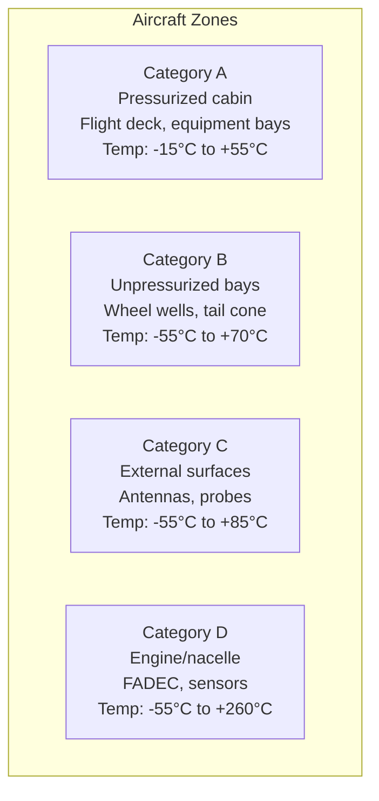
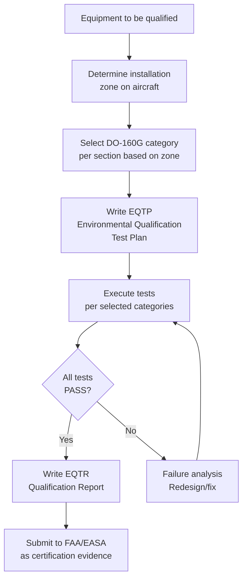
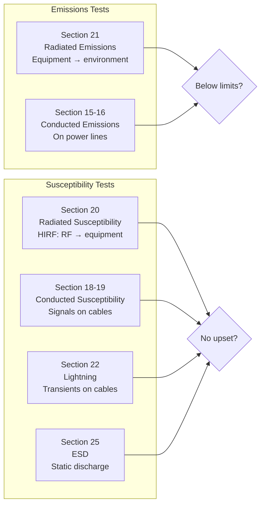

# DO-160G — Environmental Conditions & Test Procedures for Airborne Equipment

**Topic:** RTCA DO-160G / EUROCAE ED-14G — Environmental Test Standard for Avionics  
**Standards:** RTCA DO-160G (2010), EUROCAE ED-14G, MIL-STD-810H (military equivalent)  
**SDO:** RTCA (SC-135) / EUROCAE (WG-14)  
**Audience:** Environmental test engineers, EMC engineers, qualification engineers, avionics hardware designers, DERs  
**Prerequisites:** Basic physics (thermodynamics, electromagnetics), electronics fundamentals, DO-254 familiarity

---

## Chapter 1 — Historical Context & Origin Story

### 1.1 DO-160 Revision History

| Version | Year | Key Changes |
|---------|------|-------------|
| DO-160 | 1975 | First edition — basic environmental tests |
| DO-160A | 1980 | Minor updates |
| DO-160B | 1984 | EMI/EMC improvements |
| DO-160C | 1989 | HIRF added, EMC updated |
| DO-160D | 1997 | Significant EMC overhaul, new lightning tests |
| DO-160E | 2004 | Additional lightning waveforms, updates |
| DO-160F | 2007 | Icing conditions, power supply updates |
| DO-160G | 2010 | Current edition — comprehensive update |
| DO-160H | TBD | Expected: GaN/SiC, USB power, Li-ion |

### 1.2 Why DO-160G Exists

| Purpose | Detail |
|---------|--------|
| Standardization | Common test methods for all airborne equipment manufacturers |
| Certification | Demonstrates compliance with FAR 25.1309, CS-25 |
| Qualification | Proves equipment survives aircraft environment |
| Interchangeability | Any approved equipment works in any aircraft zone |
| Reliability | Equipment proven before flight installation |

---

## Chapter 2 — Standard Architecture & Structure

### 2.1 DO-160G Sections Overview

| Section | Topic | Test Type |
|---------|-------|-----------|
| 4 | Temperature and Altitude | Environmental |
| 5 | Temperature Variation | Environmental |
| 6 | Humidity | Environmental |
| 7 | Operational Shocks and Crash Safety | Mechanical |
| 8 | Vibration | Mechanical |
| 9 | Explosion Proofness | Safety |
| 10 | Waterproofness | Environmental |
| 11 | Fluids Susceptibility | Chemical |
| 12 | Sand and Dust | Environmental |
| 13 | Fungus Resistance | Environmental |
| 14 | Salt Spray | Environmental |
| 15 | Magnetic Effect | EMC |
| 16 | Power Input | Electrical |
| 17 | Voltage Spike (power lines) | Electrical |
| 18 | Audio Frequency Conducted Susceptibility | EMC |
| 19 | Induced Signal Susceptibility | EMC |
| 20 | Radio Frequency Susceptibility (Radiated) | EMC |
| 21 | Radio Frequency Emission (Radiated) | EMC |
| 22 | Lightning Induced Transient Susceptibility | EMC |
| 23 | Lightning Direct Effects | EMC/Structural |
| 24 | Icing | Environmental |
| 25 | Electrostatic Discharge (ESD) | EMC |
| 26 | Fire, Flammability | Safety |
| 27 | Smoke Density | Safety |

### 2.2 Equipment Categories

| Category | Location | Environment |
|----------|----------|-------------|
| A | Temperature/altitude controlled (pressurized cabin) | Mild |
| B | Non-temperature controlled (unpressurized bay) | Moderate |
| C | External (outside skin) | Severe |
| D | Engine/nacelle environment | Extreme (vibration + temp) |



---

## Chapter 3 — Technical Deep Dive

### 3.1 Section 4 — Temperature & Altitude

| Category | Operating Low | Operating High | Storage | Altitude |
|----------|-------------|---------------|---------|----------|
| A1 | -15°C | +55°C | -55°C to +85°C | 15,000 ft |
| A2 | -15°C | +55°C | -55°C to +85°C | 35,000 ft |
| B1 | -30°C | +55°C | -55°C to +85°C | 15,000 ft |
| B2 | -55°C | +70°C | -55°C to +85°C | 35,000 ft |
| C1 | -55°C | +70°C | -55°C to +85°C | 35,000 ft |
| D1 | -55°C | +85°C | -55°C to +85°C | 35,000 ft |
| D2 | -55°C | +160°C | -55°C to +160°C | 35,000 ft |
| D3 | -55°C | +260°C | -55°C to +260°C | Engine area |

**Test procedure:**
1. Short-term operating high temperature (2 hours at max)
2. Short-term operating low temperature (2 hours at min)
3. Altitude test (combined with temperature if applicable)
4. Decompression test (rapid altitude change: 8,000→51,000 ft in <1 sec for Cat B/C)
5. Ground survival (storage temperature: unpowered, extreme temps)

### 3.2 Section 8 — Vibration

| Category | Application | Frequency Range | Typical Level |
|----------|-------------|-----------------|---------------|
| S (standard) | Fixed-wing, non-engine | 10-2000 Hz | 0.04 g²/Hz |
| U (helicopter) | Rotary wing (severe) | 10-2000 Hz | 0.15-0.3 g²/Hz |
| R (propeller) | Propeller-driven | 10-2000 Hz | Higher at blade-pass freq |
| J (jet engine) | Engine-mounted | 10-2000 Hz | Very high (N1/N2 harmonics) |

**Random vibration test:**
- Duration: 2 hours per axis (X, Y, Z) = 6 hours total
- Temperature: combined with operational temperature
- Monitoring: equipment must function throughout test

**Sine-on-random (helicopter):**
- Random base + sine tones at rotor harmonics (1/rev, 2/rev, 4/rev)
- Simulates specific helicopter vibration signature

### 3.3 Section 16 — Power Input

| Power Type | Characteristics |
|-----------|----------------|
| 28 VDC (normal) | 22-29 VDC steady, spikes to 80V (200 µs) |
| 28 VDC (emergency) | 18-29 VDC |
| 115 VAC (400 Hz) | 108-118V, 393-407 Hz |
| 270 VDC (newer) | 250-280 VDC |
| USB power (emerging) | 5V, limited power |

**Key tests:**
- Normal operating voltage range
- Abnormal voltage (overvoltage/undervoltage)
- Power interruption (50 ms to 200 ms)
- Voltage spikes (Section 17): 600V on 28V lines, 1500V on 115V lines

### 3.4 Section 20 — RF Susceptibility (HIRF)

| Category | Field Strength | Application |
|----------|---------------|-------------|
| L (low) | Limited | IFE, cabin systems |
| M (medium) | Moderate | Non-critical avionics |
| W (Severe/Cat 1) | High (DAL C/D) | Important systems |
| Y (Severe/Cat 2) | Very High (DAL A/B) | Flight-critical systems |

**HIRF test levels (Cat Y — flight-critical):**

| Frequency | Field Strength (V/m) |
|-----------|---------------------|
| 10 kHz – 100 kHz | 50 V/m |
| 100 kHz – 400 MHz | 100 V/m |
| 400 MHz – 700 MHz | 700 V/m |
| 700 MHz – 1 GHz | 700 V/m |
| 1 GHz – 8 GHz | 2000 V/m |
| 8 GHz – 18 GHz | 3000 V/m |

### 3.5 Section 22 — Lightning Indirect Effects

**Waveform components:**

| Waveform | Description | Application |
|----------|-------------|-------------|
| Waveform 1 | 6.4 × 40 µs (voltage) | External cables, power |
| Waveform 2 | 0.5 × 69 µs (voltage) | Internal cables |
| Waveform 3 | 6.4 × 69 µs (current) | Signal cables |
| Waveform 4 | Damped oscillatory (1 MHz) | Internal resonances |
| Waveform 5A | Multiple stroke (current) | Structural current |
| Waveform 5B | Multiple burst | Shielded cables |

**Pin injection test levels:**

| Level | Voltage (WF1/WF2) | Current (WF3) | Application |
|-------|-------------------|---------------|-------------|
| 1 | 50V / 50V | 10A | Well-protected internal |
| 2 | 125V / 125V | 25A | Moderate protection |
| 3 | 300V / 300V | 50A | External, less protected |
| 4 | 750V / 750V | 125A | External, minimal protection |
| 5 | 1600V / 1600V | 250A | Directly exposed |

### 3.6 Section 21 — RF Emissions

| Category | Limit | Application |
|----------|-------|-------------|
| L (low) | Less restrictive | Non-interference systems |
| M (medium) | Standard civil | Most avionics |
| H (high) | Stringent | Communications equipment area |

**Test method:** Measure radiated emissions from equipment (150 kHz – 6 GHz). Compare against limit curve. Emissions must be below limits to avoid interfering with aircraft communications/navigation.

---

## Chapter 4 — Implementation Guide

### 4.1 Test Facility Requirements

| Test | Facility/Equipment |
|------|-------------------|
| Temperature/Altitude | Thermal chamber with altitude simulation (vacuum) |
| Vibration | Electrodynamic shaker (X/Y/Z axes) |
| HIRF (radiated) | Anechoic chamber or OATS (Open Area Test Site) |
| Lightning (pin injection) | Transient generator (Thermo Fisher, EMCE) |
| ESD | ESD simulator gun (HBM, CDM models) |
| Power input | Programmable AC/DC power source |
| EMC emissions | Spectrum analyzer + antennas + shielded room |
| Humidity | Climate chamber (95% RH, 40-65°C) |

### 4.2 Test Sequence (Recommended)

| Order | Test | Rationale |
|-------|------|-----------|
| 1 | Visual inspection + functional baseline | Reference before stress |
| 2 | Temperature/altitude (Section 4) | Most common failure mode |
| 3 | Temperature variation (Section 5) | Thermal cycling stress |
| 4 | Humidity (Section 6) | Moisture ingress check |
| 5 | Vibration (Section 8) | Mechanical robustness |
| 6 | Shock (Section 7) | Impact survivability |
| 7 | Power input (Section 16) | Electrical robustness |
| 8 | EMC tests (Sections 15-22) | Electromagnetic compatibility |
| 9 | Final functional + visual | Compare to baseline |

### 4.3 Test Report Requirements

| Section | Content |
|---------|---------|
| DUT identification | Part number, serial number, software version |
| Test configuration | Setup photos, cable routing, antenna positions |
| Test conditions | Categories selected, justification |
| Pass/fail criteria | Derived from equipment specification |
| Results | Measured data, graphs, photos |
| Deviations | Any test deviations + justification |
| Conclusion | Compliance statement per section |

---

## Chapter 5 — Certification & Audit

### 5.1 DO-160G in Certification

| Context | Application |
|---------|-------------|
| TC (Type Certificate) | Equipment qualified for installation zones |
| STC (Supplemental TC) | Modified equipment re-qualified |
| TSO (Technical Standard Order) | Environmental qualification per TSOA |
| PMA | Must meet same environmental requirements |

### 5.2 Certification Evidence

| Deliverable | Content |
|-------------|---------|
| Environmental Qualification Test Plan (EQTP) | Categories, setup, pass/fail criteria |
| Environmental Qualification Test Report (EQTR) | Full test results + compliance statement |
| Equipment Qualification Form | Summary for certification package |
| DO-160G compliance matrix | Section-by-section compliance status |
| Installation instructions | Required equipment environment (from test results) |

---

## Chapter 6 — Regional & Domain Variants

| Standard | Domain | Relationship to DO-160G |
|----------|--------|------------------------|
| MIL-STD-810H | Military (US) | Broader scope, more severe, different categories |
| MIL-STD-461G | Military EMC (US) | More detailed EMC, different limits |
| DEF-STAN 00-35 | UK Military | British defence environmental standard |
| EN 2591 series | European (civil) | Aerospace series environmental tests |
| IEC 60068 | Commercial/industrial | Less severe, different test profiles |
| EUROCAE ED-14G | European civil aviation | Identical to DO-160G (joint document) |

### DO-160G vs MIL-STD-810H Comparison

| Aspect | DO-160G | MIL-STD-810H |
|--------|---------|-------------|
| Scope | Civil airborne equipment | Military (all environments) |
| Temperature | -55 to +85°C (typical) | -51 to +71°C (standard), wider ranges |
| Vibration | Random (PSD profiles) | Random + sine + gunfire |
| EMC | Sections 15-22 | Separate standard (MIL-STD-461G) |
| Sand/dust | Section 12 (basic) | Method 510 (more severe) |
| Salt fog | Section 14 (48 hrs) | Method 509 (longer) |
| Shock | 6g-40g crash safety | 40g+ (weapon shock, shipboard) |
| Altitude | 70,000 ft max | Altitude + rapid decompression |
| Tailoring | Category-based selection | Method-based tailoring |

---

## Chapter 7 — Comparison: Key Environmental Test Parameters

| Parameter | Cat A (cabin) | Cat B (unpress.) | Cat C (external) | Cat D (engine) |
|-----------|------|------|------|------|
| Temp high (op) | +55°C | +70°C | +70°C | +85-260°C |
| Temp low (op) | -15°C | -55°C | -55°C | -55°C |
| Altitude | 15-35 kft | 35 kft | 35 kft | 35 kft |
| Vibration | Low (S curve) | Moderate | Moderate-High | Very High |
| HIRF | Cat L/M | Cat W | Cat W/Y | Cat Y |
| Lightning | Level 1-2 | Level 3-4 | Level 4-5 | Level 5 |
| Humidity | 95% RH | 95% RH | Condensation | Condensation |

---

## Chapter 8 — Mermaid Architecture Diagrams

### 8.1 DO-160G Test Selection Process



### 8.2 EMC Test Flow



---

## Chapter 9 — Case Studies & Failure Analysis

### 9.1 Lightning-Induced FPGA Latch-Up

**Scenario:** Flight control module failed DO-160G Section 22, Level 3 (lightning indirect effects). Pin injection on ARINC 429 input caused FPGA latch-up → complete system lockup (not recoverable without power cycle).

**Root cause:** FPGA I/O cell parasitic thyristor triggered by transient exceeding absolute maximum rating (despite TVS diode protection). TVS clamping voltage was 40V; FPGA absolute max was 5.5V → gap allowed destructive current.

**Fix:** (1) Added secondary protection (series resistor + capacitor) to slow transient. (2) Changed TVS to lower clamping voltage (8V). (3) Added isolation transformer on ARINC 429 interface. (4) FPGA input protection redesigned (Schmitt trigger + current limiting).

**Lesson:** DO-160G lightning tests stress the entire protection chain. Must analyze transient path from connector pin through every protection stage to silicon die.

### 9.2 HIRF Failure in GPS Receiver

**Scenario:** GPS receiver passed all functional tests but failed DO-160G Section 20 Category W (200 V/m at 1.5 GHz — near GPS L1 frequency 1575.42 MHz).

**Root cause:** Enclosure shielding effectiveness insufficient at GPS frequency. GPS antenna coupling allowed external field into front-end LNA → saturation → loss of lock.

**Fix:** (1) Improved enclosure shielding (conductive gaskets, filtered connectors). (2) Added bandpass filter before LNA (reject out-of-band interference). (3) Added AGC (Automatic Gain Control) with wider dynamic range. (4) Re-test: passed at Cat W levels.

---

## Chapter 10 — Future Evolution & Industry Trends

| Trend | Timeline | Description |
|-------|----------|-------------|
| DO-160H development | 2025+ | Next revision addressing new technologies |
| GaN/SiC power devices | Growing | New power device environmental concerns |
| Li-ion battery testing | Growing | Fire/thermal runaway test requirements |
| Higher power density | Growing | Thermal management more challenging |
| 5G interference | Now | New RF environment considerations |
| Composite structures | Growing | Changed lightning protection (no metal skin) |
| Electric propulsion | 2025+ | High voltage (800V+) power bus environments |
| Space crossover | Growing | LEO satellites using modified DO-160G profiles |
| Automated testing | Growing | Standardized test automation (reduce cost) |
| Combined environments | Emerging | Simultaneous temperature + vibration + altitude |

---

## Chapter 11 — Interview Questions & Career Guide

### Tier 1: Entry-Level

**Q1:** What is DO-160G and what types of tests does it cover?  
**A:** **Definition:** DO-160G is the standard defining environmental conditions and test procedures for airborne electronic equipment. It ensures equipment can survive and function in the aircraft environment. **Test categories (26 sections):** (1) **Environmental:** Temperature (Section 4), humidity (6), altitude (4), sand/dust (12), salt spray (14), icing (24). (2) **Mechanical:** Vibration (8), shock (7). (3) **Electrical:** Power input (16), voltage spikes (17). (4) **EMC:** Conducted susceptibility (18-19), radiated susceptibility (20/HIRF), radiated emissions (21), lightning (22-23), ESD (25), magnetic effects (15). (5) **Safety:** Explosion proofness (9), fire/flammability (26), smoke density (27). **Key concept:** Equipment is tested per its installation CATEGORY (determined by where on the aircraft it will be installed). Category A (pressurized cabin) = mildest. Category D (engine area) = most severe.

### Tier 2: Mid-Level

**Q2:** Explain how DO-160G Section 22 (lightning indirect effects) works and how test levels are selected.  
**A:** **What Section 22 tests:** Simulates the electrical transients induced on equipment wiring when lightning strikes the aircraft. It's INDIRECT effects — not the lightning channel itself (that's Section 23, direct effects). **Mechanism:** Lightning current flows through aircraft skin → generates magnetic field → induces voltage/current on internal cables (like a transformer). Level depends on: (1) Cable shielding, (2) Equipment location relative to lightning entry/exit points, (3) Cable routing (proximity to structure). **Waveforms (key ones):** WF1 (6.4×40µs voltage): Represents voltage induced by diffusing magnetic field — dominant on long cables, external interfaces. WF3 (6.4×69µs current): Represents current induced on cable shields — transfers through shield imperfections. WF4 (damped oscillatory 1MHz): Represents resonant responses inside aircraft structure. WF5A/5B (multiple stroke): Represents multiple lightning return strokes in quick succession. **Level selection (1-5):** Based on Aircraft Lightning Zoning Analysis: Level 1 (50V/10A): Well-shielded internal cables, far from entry points. Level 3 (300V/50A): Moderate exposure (typical avionics bay). Level 5 (1600V/250A): Direct exposure (external sensors, unshielded). **Test method:** Pin injection — apply waveform directly to equipment connector pins (one at a time or bundled) while equipment is operating. Pass criteria: no loss of function, no damage, data integrity maintained.

### Tier 3: Senior

**Q3:** You're designing a DAL A flight control module. Walk through your DO-160G qualification strategy.  
**A:** **1. Installation analysis:** Determine installation location: avionics bay (Category A2). Determine cable routing: ARINC 429 from ADIRU, AFDX from switches, discrete from cockpit, power from RPDU. Determine lightning zone: Zone 2A (swept stroke with hang-on). **2. Category selection per section:** Temperature: A2 (-15°C to +55°C, 35,000 ft altitude). Vibration: S1 (standard fixed-wing, avionics bay — random profile). HIRF: Category Y (DAL A = most severe: up to 3000 V/m at 18 GHz). Lightning: Level 3 (typical for avionics bay cables). Power input: Category A (28 VDC normal). ESD: Category B (personnel handling). **3. Design-for-qualification (proactive):** Thermal: Design margin of +10°C above test temperature. Use components rated to Grade 1 (-40 to +125°C) minimum. Calculate power dissipation → ensure junction temp within limits at +55°C ambient. EMC: Shielded enclosure with conductive gaskets (>40 dB at 1 GHz). Filtered connectors (feedthrough capacitors) on all I/O. Internal PCB: ground planes, controlled impedance, decoupling. Lightning: TVS protection on all external interfaces (ARINC 429, discretes). Series impedance (resistors) to limit current to silicon. Isolation transformers on communication interfaces. Power: Input filter (LC) to handle Section 17 spikes (600V/28VDC). EMI filter to pass Section 18 (conducted susceptibility). Hold-up capacitance for 50ms power interrupt. Vibration: PCBA conformal coating to prevent tin whiskers/fatigue. Component selection: BGA preferred over QFP (better vibration performance). Connector: high-retention force, backshell with strain relief. **4. Qualification test campaign:** Phase 1 (Development): Pre-qualification testing on engineering units (identify issues early). Phase 2 (Formal): Full DO-160G qualification on production-representative units. Phase 3 (Certification): Submit EQTR as part of TC/STC compliance package. **5. Re-qualification triggers:** Design change to protection circuits → re-test affected sections. New component (different manufacturer) → assess impact on EMC/vibration. Software change → typically NO re-qualification needed (environment unchanged). **6. Cost/schedule:** Budget: ~$150K-$500K for full DO-160G qualification (all sections). Duration: 3-6 months (test lab availability is typical bottleneck). Risk: plan for at least one failure and redesign iteration.

---

## Chapter 12 — Cheat Sheet & Quick Reference

### DO-160G Section Quick Reference

```
Section 4:  Temperature & Altitude (most fundamental test)
Section 7:  Shock (crash safety: 6g, operational: varies)
Section 8:  Vibration (random PSD, 6 hours total)
Section 16: Power input (voltage range, interruption)
Section 17: Voltage spike (600V on 28VDC lines)
Section 20: HIRF — RF susceptibility (up to 3000 V/m for DAL A)
Section 21: RF emissions (must not interfere)
Section 22: Lightning indirect (pin injection, Levels 1-5)
Section 25: ESD (±15kV air discharge)
```

### Category Selection Guide

```
Location → Category:
  Pressurized cabin, temp-controlled → A (mild)
  Unpressurized bay, unheated       → B (moderate)
  External (antennas, probes)        → C (severe)
  Engine/nacelle area                → D (extreme)

DAL → HIRF Category:
  DAL A/B (Catastrophic/Hazardous)  → Category Y (3000 V/m)
  DAL C/D (Major/Minor)             → Category W/M (100-700 V/m)
  DAL E (No effect)                 → Category L (basic)
```

### Lightning Levels

```
Level 1: 50V / 10A      (well-protected internal)
Level 2: 125V / 25A     (shielded internal)
Level 3: 300V / 50A     (typical avionics bay)
Level 4: 750V / 125A    (less protected)
Level 5: 1600V / 250A   (external, exposed)
```

### Common Failure Modes (by Section)

```
Section 4:  Component failure at temperature extremes
Section 8:  Solder joint fatigue, connector fretting
Section 20: HIRF upset (CPU latch-up, data corruption)
Section 22: Lightning transient exceeds protection (TVS failure)
Section 25: ESD damage to unprotected I/O
Section 16: Power brown-out → watchdog reset → loss of data
```

---

*End of Document — 09_DO_160G_Environmental.md*
