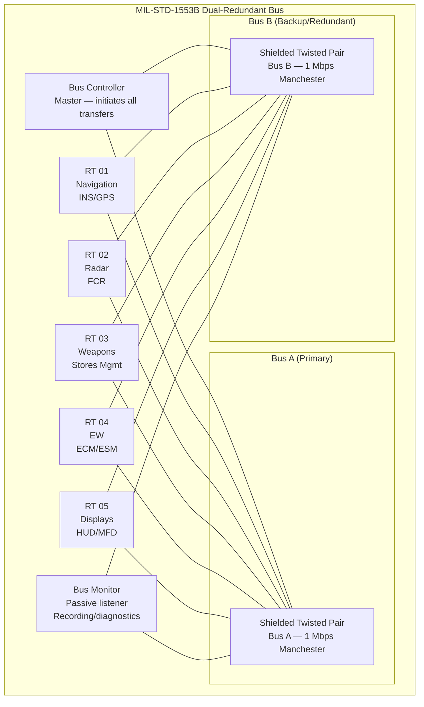
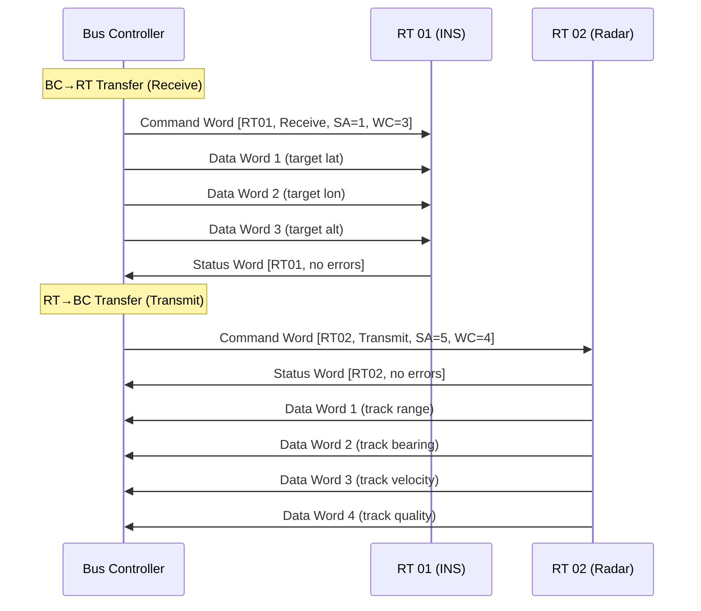

# MIL-STD-1553B — Military Multiplex Data Bus

**Topic:** MIL-STD-1553B — Digital Time-Division Command/Response Multiplex Data Bus  
**Standards:** MIL-STD-1553B (1978, Notice 2 1986), MIL-HDBK-1553A, AS15531 (SAE), STANAG 3838  
**SDO:** US Department of Defense (DoD), SAE International (AS-1B committee)  
**Audience:** Military avionics engineers, data bus integrators, embedded systems developers, test engineers, defense contractors  
**Prerequisites:** Digital communications fundamentals, Manchester encoding, real-time systems, embedded bus protocols

---

## Chapter 1 — Historical Context & Origin Story

### 1.1 MIL-STD-1553 Timeline

| Year | Event |
|------|-------|
| 1968 | F-16 development drives need for digital avionics bus |
| 1973 | MIL-STD-1553 (original) published |
| 1975 | MIL-STD-1553A (first revision — minor changes) |
| 1978 | MIL-STD-1553B (definitive version — still current) |
| 1980s | Widespread adoption: F-16, F/A-18, AH-64, B-1B |
| 1986 | Notice 2 (clarifications, no technical changes) |
| 1988 | SAE AS15531 (commercial equivalent) published |
| 1990s | STANAG 3838 (NATO adoption) |
| 2000s | Enhanced 1553 concepts (EBR — 10 Mbps) proposed |
| 2010s | MIL-STD-1553C discussions (backward-compatible high speed) |
| 2020s | Still in active use on 100+ platforms; no replacement mandated |

### 1.2 Why 1553 Endures

| Factor | Detail |
|--------|--------|
| Proven reliability | 50+ years, billions of operational hours |
| Deterministic | Exact timing predictable (command/response) |
| Fault-tolerant | Dual-redundant bus, automatic switchover |
| EMI-resilient | Transformer coupling, Manchester encoding, shielded cable |
| Standardized | Global (NATO STANAG, SAE, international military) |
| Backward-compatible | 1978 standard still interoperable with new designs |
| Qualification heritage | Extensive test/qualification data available |

---

## Chapter 2 — Standard Architecture & Structure

### 2.1 Bus Architecture



### 2.2 Terminal Types

| Terminal | Role | Count per Bus |
|----------|------|---------------|
| Bus Controller (BC) | Master — initiates all transfers | 1 (+ backup BC) |
| Remote Terminal (RT) | Slave — responds to BC commands | Up to 31 |
| Bus Monitor (BM) | Passive listener (no transmission) | 1+ (optional) |
| Backup BC | Takes over if primary BC fails | 1 (typically an RT with BC capability) |

### 2.3 Physical Layer

| Parameter | Value |
|-----------|-------|
| Data rate | 1 Mbps (Manchester II biphase) |
| Encoding | Manchester II (self-clocking) |
| Cable | Shielded twisted pair (78 Ω ± 2 Ω) |
| Coupling | Transformer (isolation) |
| Stub length | Direct: ≤ 1 ft; Transformer-coupled: ≤ 20 ft |
| Bus length | Up to 300 ft (without repeaters) |
| Voltage | Peak-to-peak: 6-18V (at transformer secondary) |
| Terminals/bus | Max 31 RTs + 1 BC |
| Redundancy | Dual bus (A + B) — independent |

---

## Chapter 3 — Technical Deep Dive

### 3.1 Word Formats (20-bit words)

**Three word types — all are 20 bits (3 µs sync + 16 data + 1 parity):**

| Word Type | Sync Pattern | Content |
|-----------|-------------|---------|
| Command | 3 µs positive→negative | RT Address (5) + T/R (1) + Subaddress (5) + Word Count (5) |
| Data | 3 µs negative→positive | 16 bits of data |
| Status | 3 µs positive→negative | RT Address (5) + Status bits (11) |

**Command Word (16 bits after sync):**

| Bits | Field | Description |
|------|-------|-------------|
| 1-5 | RT Address | Remote Terminal (0-30, 31 = broadcast) |
| 6 | T/R | Transmit (1) or Receive (0) |
| 7-11 | Subaddress | Data area within RT (0/31 = mode codes) |
| 12-16 | Word Count/Mode | Number of data words (1-32; 0 = 32) |
| 17 | Parity | Odd parity over bits 1-16 |

**Status Word (16 bits after sync):**

| Bits | Field | Description |
|------|-------|-------------|
| 1-5 | RT Address | Responding RT address |
| 6 | Message Error | Error detected in message |
| 7 | Instrumentation | RT has diagnostic data |
| 8 | Service Request | RT needs attention |
| 9-11 | Reserved | Set to 0 |
| 12 | Broadcast Received | Confirms broadcast reception |
| 13 | Busy | RT cannot process |
| 14 | Subsystem Flag | Subsystem fault |
| 15 | Dynamic Bus Control Accept | Will accept BC role |
| 16 | Terminal Flag | RT internal fault |
| 17 | Parity | Odd parity |

### 3.2 Transfer Types

| Transfer | Flow | Sequence |
|----------|------|----------|
| BC → RT (Receive) | BC sends data to RT | Command + Data words → Status from RT |
| RT → BC (Transmit) | BC requests data from RT | Command → Status + Data words from RT |
| RT → RT | Direct transfer between RTs | Command(TX) → Command(RX) + Data → Status(TX) + Status(RX) |
| Broadcast BC → RT(s) | BC sends to all (addr 31) | Command(31) + Data → No status response |
| Mode Code (no data) | Control/status | Command (SA=0 or 31) → Status |
| Mode Code (with data) | Control/status + 1 word | Command + Data → Status |

### 3.3 Timing Requirements

| Parameter | Value |
|-----------|-------|
| Bit time | 1.0 µs (1 Mbps) |
| Word time | 20 µs (20 bits × 1 µs) |
| Sync pulse | 3.0 µs |
| Response time (RT) | 4.0-12.0 µs (after last bit of command) |
| Intermessage gap | ≥ 4.0 µs (minimum) |
| Max message (32 words) | 32 × 20 µs + 2 × 20 µs (cmd+status) = 680 µs |
| Bus cycle (typical) | 10-20 ms (application-dependent) |
| Dead time (no response) | 14 µs → declare RT failure |

### 3.4 Error Detection & Handling

| Error Type | Detection Method |
|-----------|-----------------|
| Manchester encoding error | Violated Manchester transitions |
| Parity error | Odd parity check per word |
| Sync error | Invalid sync pattern |
| Word count error | Mismatch between command and received count |
| Response timeout | No status word within 14 µs |
| Invalid response | Wrong RT address in status word |
| Bit count error | Too many/few bits in word |

**BC error handling strategy (typical):**
1. First failure: Retry on same bus (1-2 retries)
2. Continued failure: Switch to alternate bus (Bus A → Bus B)
3. Both buses fail: Declare RT offline, continue with remaining RTs
4. BC failure: Backup BC takes over (dynamic bus control)

### 3.5 Mode Codes

| Mode Code | Function |
|-----------|----------|
| 00000 (Dynamic Bus Control) | Transfer BC role to another RT |
| 00001 (Synchronize, no data) | Time synchronization signal |
| 00010 (Transmit Status) | Request RT status word |
| 00011 (Initiate Self-Test) | Command RT to run BITE |
| 00100 (Transmitter Shutdown) | Inhibit RT transmitter |
| 00101 (Override Transmitter Shutdown) | Re-enable RT transmitter |
| 10000 (Transmit Vector Word) | Request interrupt vector |
| 10001 (Synchronize, with data) | Time sync + data word |
| 10010 (Transmit Last Command) | Echo last command received |
| 10011 (Transmit BIT Word) | Request Built-In Test result |

---

## Chapter 4 — Implementation Guide

### 4.1 Hardware Components

| Component | Function | Examples |
|-----------|----------|---------|
| 1553 Transceiver | Manchester encoding/decoding, bus isolation | DDC BU-61580, Holt HI-1565 |
| Bus Controller IC | Protocol engine (BC + RT + BM in one) | DDC ACE/PACE, Elbit MBI-5250 |
| Coupling transformer | Galvanic isolation (pulse transformer) | MIL-PRF-21038 compliant |
| Stub coupler | Direct or transformer-coupled connection | Resistor network + transformer |
| Cable | Twinax shielded, 78 Ω | MIL-C-17 (RG-cables) |
| Connector | Circular military | MIL-DTL-38999, MIL-DTL-26482 |

### 4.2 Common 1553 ICs

| Vendor | Part Number | Features |
|--------|-------------|---------|
| DDC (Data Device Corp) | BU-67118F | Multi-function (4 channels) |
| DDC | ACE MK2 (BU-61580) | Single-channel, legacy standard |
| Holt Integrated | HI-6130/HI-6131 | Single/dual channel, SPI/parallel |
| Elbit Systems | MBI-5254 | High integration, DO-254 heritage |
| Alta Data Technologies | AltaCore | FPGA IP core |

### 4.3 Bus Controller Message Schedule

**Example F-16 bus cycle (12.5 ms cycle):**

| Time (ms) | Message | Purpose |
|-----------|---------|---------|
| 0.0 | BC → RT01 (INS) | Request navigation data |
| 0.7 | RT01 → BC | INS sends position/velocity |
| 1.5 | BC → RT02 (Radar) | Send target designation |
| 2.2 | RT02 → BC | Radar sends track data |
| 3.0 | BC → RT03 (SMS) | Send weapon release command |
| 3.7 | RT03 → BC | SMS status |
| 4.5 | BC → RT04 (EW) | Request threat data |
| 5.2 | RT04 → BC | EW threat warning |
| 6.0 | BC → RT05 (Display) | Send display data |
| 6.7 | RT05 → BC | Display status/button presses |
| 7.5-12.5 | Background messages | Lower priority, if time available |

### 4.4 Software Architecture (BC)

```
BC Main Loop (12.5 ms cycle):
  1. Execute major frame messages (navigation, weapons)
  2. Execute minor frame messages (rotating schedule)
  3. Execute asynchronous messages (event-driven)
  4. Check RT health status (last status word analysis)
  5. Handle errors (retry, bus switch, RT offline)
  6. Service mode code requests (sync, BIT)
  7. Update bus controller status to host CPU
  8. Wait for next cycle trigger (from timer)
```

---

## Chapter 5 — Certification & Audit

### 5.1 MIL-STD-1553B Compliance Testing

| Test Category | Reference | Content |
|---------------|-----------|---------|
| Electrical | MIL-STD-1553B §4 | Voltage, impedance, rise time |
| Protocol | MIL-STD-1553B §4 | Timing, word formats, error handling |
| Environmental | MIL-STD-810H | Temperature, vibration, EMI |
| EMC | MIL-STD-461G | Conducted/radiated emissions + susceptibility |
| Validation | SAE AS15531 | Detailed test procedures |

### 5.2 Validation Test Equipment

| Equipment | Purpose |
|-----------|---------|
| Bus analyzer (DDC BusTools) | Protocol monitoring, error injection |
| Programmable RT simulator | Simulate all 31 RTs for BC testing |
| Oscilloscope (≥500 MHz) | Waveform verification (rise time, voltage) |
| TDR (Time Domain Reflectometer) | Cable impedance measurement |
| Bus coupler tester | Transformer isolation verification |

---

## Chapter 6 — Regional & Domain Variants

| Standard | Region | Relationship |
|----------|--------|-------------|
| MIL-STD-1553B | US DoD | Primary (definitive standard) |
| STANAG 3838 AVS | NATO | NATO adoption of 1553B |
| DEF-STAN 00-18 | UK | British adoption |
| SAE AS15531 | Commercial (SAE) | Commercial equivalent (identical spec) |
| MIL-STD-1553C | US DoD (proposed) | Enhanced: backward-compatible high speed |
| EBR-1553 | Research | Enhanced Bit Rate: 10 Mbps |
| EFABUS (Eurobus) | Eurofighter | 1553 variant with extensions |

### Platform Usage

| Platform | Bus Type | Notes |
|----------|----------|-------|
| F-16 Fighting Falcon | MIL-STD-1553B | Original driver for standard |
| F/A-18 Hornet/Super Hornet | MIL-STD-1553B | Multiple buses (weapons, displays) |
| F-22 Raptor | MIL-STD-1553B + FC | 1553 for legacy, Fiber Channel for high-speed |
| F-35 Joint Strike Fighter | MIL-STD-1553B + FC + Ethernet | Mixed architecture |
| AH-64 Apache | MIL-STD-1553B | 3 buses (pilot, copilot, combined) |
| B-1B Lancer | MIL-STD-1553B | Multiple buses |
| V-22 Osprey | MIL-STD-1553B | Flight-critical bus |
| Space Shuttle (legacy) | MIL-STD-1553B | Payload bus |
| International Space Station | MIL-STD-1553B | Some subsystems |
| Eurofighter Typhoon | STANAG 3838 | European variant |

---

## Chapter 7 — Comparison: MIL-STD-1553B vs Other Avionics Buses

| Feature | MIL-STD-1553B | ARINC 429 | AFDX | CAN (ARINC 825) |
|---------|--------------|-----------|------|------------------|
| Domain | Military | Civil | Civil (modern) | Civil/military (auxiliary) |
| Architecture | Command/response | Simplex (1 TX) | Switched Ethernet | Multi-master |
| Speed | 1 Mbps | 100 kbps | 100 Mbps | 1 Mbps |
| Determinism | Guaranteed (BC schedules) | Inherent (periodic) | VL + BAG | Priority-based |
| Redundancy | Dual bus (A/B) | Separate buses | Dual network | Dual CAN |
| Max terminals | 31 RTs | 20 receivers | Hundreds | ~100 nodes |
| Topology | Linear bus | Point-to-point | Star (switches) | Linear bus |
| Error handling | Status word + retry + bus switch | SSM field | Sequence number | CAN error frame |
| Bidirectional | Yes (command/response) | No (simplex) | Yes (full duplex) | Yes (multi-master) |
| Weight | Moderate (twinax cable) | Heavy (many buses) | Light (2 networks) | Light |
| Cost | Medium | Low (mature) | High (switches) | Low |
| Certification | MIL-HDBK-516C | DO-178C/DO-254 | DO-178C/DO-254 | DO-178C/DO-254 |

---

## Chapter 8 — Mermaid Architecture Diagrams

### 8.1 Command/Response Message Flow



### 8.2 Dual-Redundant Bus Failover

```mermaid
graph TB
    subgraph "Normal Operation"
        BC_N[Bus Controller<br/>Using Bus A]
        BUS_A_N[Bus A: Active]
        BUS_B_N[Bus B: Standby]
    end
    
    subgraph "Failure Detection"
        FAIL[RT fails to respond<br/>on Bus A<br/>(timeout > 14 µs)]
        RETRY[Retry on Bus A<br/>(1-2 attempts)]
    end
    
    subgraph "Bus Switchover"
        SWITCH[Switch to Bus B<br/>Same command]
        BUS_B_ACT[Bus B: Now Active]
    end
    
    subgraph "Total Failure"
        BOTH_FAIL[Both buses fail<br/>for this RT]
        OFFLINE[Declare RT offline<br/>Continue with others]
    end
    
    BC_N --> FAIL
    FAIL --> RETRY
    RETRY -->|Still fails| SWITCH
    SWITCH --> BUS_B_ACT
    RETRY -->|Success| BC_N
    BUS_B_ACT -->|Success| BC_N
    BUS_B_ACT -->|Fails| BOTH_FAIL
    BOTH_FAIL --> OFFLINE
```

---

## Chapter 9 — Case Studies & Failure Analysis

### 9.1 BC Single Point of Failure Mitigation

**Problem:** Bus Controller is single point of failure. If BC fails, all communication stops.

**Solution — Dynamic Bus Control:**
1. Primary BC operates normally
2. Backup BC (typically RT with BC capability) monitors bus as Bus Monitor
3. If backup detects no BC activity for timeout period (e.g., 50 ms)
4. Backup issues Dynamic Bus Control Accept → becomes new BC
5. Transition time: < 100 ms (one missed bus cycle)

**Implementation detail:** Mode Code 00000 (Dynamic Bus Control) allows controlled handoff. Primary BC can voluntarily transfer to backup (planned maintenance mode). Unplanned: backup detects bus silence → assumes BC role.

### 9.2 RT Address Conflict

**Scenario:** During integration, two RTs accidentally configured with same address (RT 05). Both respond to commands for RT 05 → electrical collision on bus → garbled status word → BC sees message error.

**Detection:** Bus analyzer shows: command to RT 05 → invalid status (Manchester violations from two simultaneous transmitters). Bit error rate spike only for RT 05 messages.

**Resolution:** (1) Review RT address configuration (hardware straps or software). (2) Assign unique addresses. (3) Verify with bus analyzer (protocol validation). (4) Add address verification to integration test procedures.

---

## Chapter 10 — Future Evolution & Industry Trends

| Trend | Timeline | Description |
|-------|----------|-------------|
| MIL-STD-1553C | Under development | Backward-compatible 10+ Mbps mode |
| Enhanced Bit Rate (EBR) | Research | 10 Mbps using existing cable (frequency shift) |
| Fiber optic 1553 | Deployed (some) | Fiber physical layer with 1553 protocol |
| Integration with Ethernet | Growing | Gateway: 1553 ↔ AFDX/Ethernet for new subsystems |
| 1553 sunset? | Not foreseeable | Too deeply embedded in platforms (50+ year programs) |
| Cybersecurity for 1553 | Growing | Message authentication, intrusion detection |
| MOSA (Modular Open Systems) | Now | Standard interfaces including 1553 bridging |
| Digital twin / simulation | Growing | Full bus simulation for development/test |
| TmNS (Telemetry Network Standard) | Emerging | Higher-speed test instrumentation bus |

---

## Chapter 11 — Interview Questions & Career Guide

### Tier 1: Entry-Level

**Q1:** Describe the MIL-STD-1553B bus architecture and the three terminal types.  
**A:** **Architecture:** MIL-STD-1553B is a command/response multiplex data bus. It uses dual-redundant shielded twisted pair cable at 1 Mbps with Manchester II encoding. Only one terminal (the Bus Controller) can initiate communication. **Three terminal types:** (1) **Bus Controller (BC):** The master. Initiates ALL data transfers. Sends commands to Remote Terminals. Manages bus schedule (who talks when). Handles errors (retry, bus switching). Only ONE active BC per bus (plus optional backup). (2) **Remote Terminal (RT):** The slave. Responds ONLY when commanded by BC. Can transmit or receive data (as directed by BC command). Each has unique address (0-30). Up to 31 RTs per bus. (3) **Bus Monitor (BM):** Passive listener. Receives ALL traffic on the bus. Does NOT transmit (no status response). Used for: flight data recording, diagnostics, bus analysis. **Why this architecture:** Command/response ensures determinism — BC controls exactly when each terminal communicates. No collisions (unlike Ethernet CSMA/CD). Timing is completely predictable. Dual redundancy provides fault tolerance.

### Tier 2: Mid-Level

**Q2:** Explain the error handling and fault tolerance mechanisms in MIL-STD-1553B.  
**A:** **Error Detection (per message):** (1) Manchester encoding errors: mid-bit transition violation. (2) Parity check: odd parity on each 20-bit word. (3) Sync pattern errors: invalid or missing sync. (4) Word count mismatch: received words ≠ commanded count. (5) Response timeout: no status word within 14 µs of command. (6) Invalid status: wrong RT address in status word. (7) Bit count error: word has wrong number of bits. **BC Error Handling Strategy:** Level 1 — Retry same bus: Re-issue same command (typically 1-2 retries). ~50% of transient errors recover on retry. Level 2 — Alternate bus: Switch from Bus A to Bus B and retry. Handles single-bus failures (cable damage, coupler fault). Level 3 — RT offline: If both buses fail for an RT, declare it offline. Remove from schedule. Continue with remaining RTs. Periodically poll to see if it recovers. Level 4 — BC failover: If BC itself fails, backup BC detects bus silence. Backup assumes BC role (Dynamic Bus Control). Transition within 1 bus cycle (~12.5 ms). **Status Word Flags (from RT):** Bit 6 (Message Error): RT detected error in received message. Bit 13 (Busy): RT cannot process command now (try again later). Bit 14 (Subsystem Flag): RT's connected subsystem has fault. Bit 16 (Terminal Flag): RT itself has internal fault. These flags give BC diagnostic information for each RT.

### Tier 3: Senior

**Q3:** You're modernizing an F-16 avionics architecture. How do you integrate new high-bandwidth subsystems while maintaining the existing 1553 bus infrastructure?  
**A:** **Constraint analysis:** (1) Existing 1553 bus: 1 Mbps shared among 20+ RTs. Fully loaded (12.5 ms cycle). Cannot add significant new traffic. (2) New subsystems need: high-resolution sensor data (10+ Mbps), network-centric warfare data, AESA radar video (very high bandwidth). (3) Must maintain: backward compatibility with existing LRUs, proven safety/reliability of 1553 for flight-critical. **Architecture approach — Hybrid bus:** (a) **Retain 1553 for flight-critical:** Flight control, engine interface, safety-critical weapons remain on 1553. Proven, qualified, deterministic — no change. (b) **Add high-speed backbone:** Fiber Channel (FC-AE-ASM) or Ethernet (AFDX-style) for new subsystems. AESA radar, EO/IR sensor, datalink, mission computer interconnect. 1+ Gbps capacity (1000× more than 1553). (c) **Gateway/bridge:** Intelligent gateway bridges 1553 ↔ high-speed network. Gateway is an RT on 1553 bus (existing ecosystem unchanged). Gateway translates: new subsystem data → 1553 words for legacy displays/systems. Legacy 1553 data → network packets for new mission computers. (d) **Protocol considerations:** Gateway introduces latency: 1553 cycle time + processing. Acceptable for mission data (not time-critical to 1 ms). NOT acceptable for flight control (keep on native 1553). Data consistency: gateway must handle synchronization (1553 cycle ≠ Ethernet frame rate). **Certification approach:** (1) Existing 1553 subsystems: NO re-certification needed (unchanged interfaces). (2) Gateway: Certify as new RT (DO-178C/DO-254 at appropriate DAL). (3) High-speed network: Certify per MIL-HDBK-516C (airworthiness) for mission systems. (4) Separation: ensure high-speed network faults cannot affect 1553 bus (gateway must have fault containment). **MOSA (Modular Open Systems Approach):** Architecture follows DoD MOSA mandate. Standard interfaces between gateway and new subsystems. Allows future subsystem upgrades without touching 1553 infrastructure. Hardware abstraction layer in mission computer.

---

## Chapter 12 — Cheat Sheet & Quick Reference

### MIL-STD-1553B Key Parameters

```
Data rate:         1 Mbps (Manchester II biphase)
Encoding:          Manchester II (self-clocking, bipolar)
Cable:             Shielded twisted pair, 78 Ω ± 2%
Voltage:           6-18V peak-to-peak (transformer secondary)
Terminals:         1 BC + up to 31 RTs + Bus Monitor(s)
Redundancy:        Dual bus (Bus A + Bus B, independent)
Word length:       20 bits (3 µs sync + 16 data + 1 parity)
Response time:     4-12 µs (RT must respond after command)
Dead time:         14 µs (no response = failure)
Max message:       32 data words + command + status = 34 words (680 µs)
Stub length:       ≤ 1 ft (direct) / ≤ 20 ft (transformer-coupled)
Bus length:        ≤ 300 ft (without repeater)
```

### Word Types

```
Command Word:  [Sync+] RT Addr(5) | T/R(1) | SubAddr(5) | WordCount(5) | P(1)
Data Word:     [Sync-] Data(16) | P(1)
Status Word:   [Sync+] RT Addr(5) | Status Flags(11) | P(1)

Sync+: 1.5µs positive + 1.5µs negative (command/status)
Sync-: 1.5µs negative + 1.5µs positive (data word)
```

### Transfer Types

```
BC → RT:  Command(Receive) + Data₁...Dataₙ → Status
RT → BC:  Command(Transmit) → Status + Data₁...Dataₙ
RT → RT:  Command(RT_TX, Transmit) + Command(RT_RX, Receive) → 
          Status(TX) + Data₁...Dataₙ + Status(RX)
Broadcast: Command(Addr=31) + Data → No status response
```

### Error Handling Sequence

```
1. Retry on same bus (1-2 attempts)
2. Switch to alternate bus (A↔B)
3. Declare RT offline (remove from schedule)
4. Periodically poll offline RTs for recovery
5. If BC fails → Backup BC assumes control
```

---

*End of Document — 10_MIL_STD_1553B_Avionics_Bus.md*
