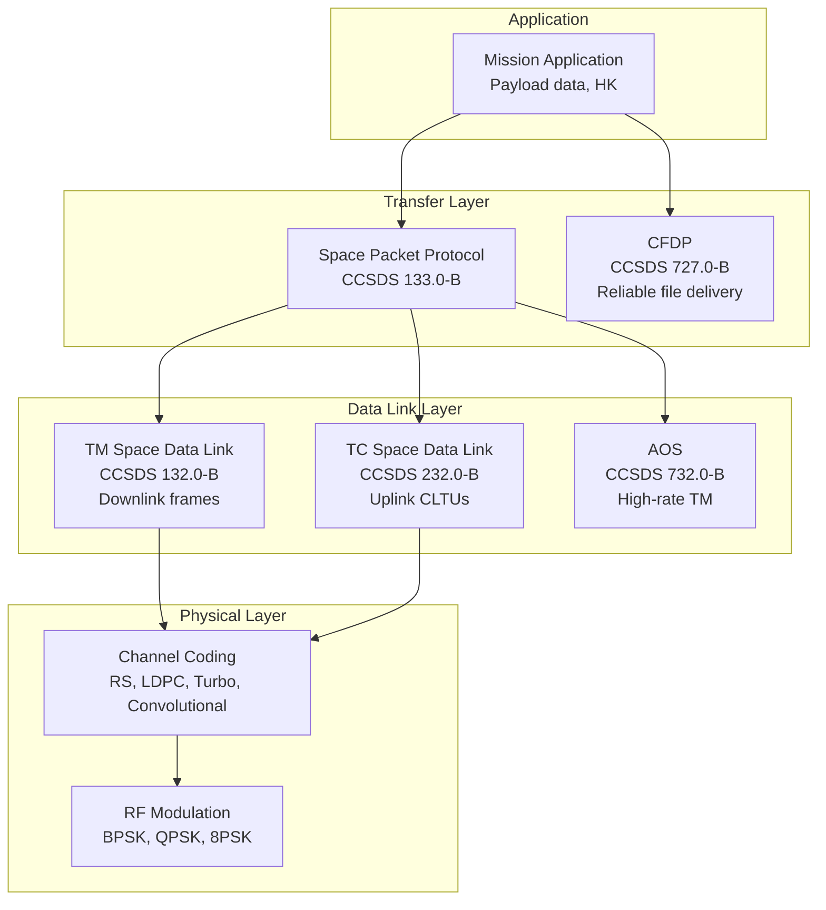

# ECSS Space Software Standards — European Space Engineering

**Topic:** ECSS-E-ST-40C (Space Engineering — Software), ECSS-Q-ST-80C (Software Product Assurance), CCSDS Protocols  
**Standards:** ECSS-E-ST-40C Rev 1 (2022), ECSS-Q-ST-80C Rev 1 (2022), CCSDS Blue Books  
**SDO:** ECSS (European Cooperation for Space Standardization), ESA, CCSDS  
**Audience:** Space software engineers, ESA project engineers, QA/PA engineers, mission software developers  
**Prerequisites:** Software engineering fundamentals, lifecycle models, reliability concepts, satellite system basics

---

## Chapter 1 — Historical Context & Origin Story

### 1.1 ECSS Evolution

| Year | Event |
|------|-------|
| 1993 | ECSS organization established (ESA + national agencies + industry) |
| 1996 | First ECSS standards published |
| 2000 | PSS-05 (ESA SW standard) superseded by ECSS-E-40 |
| 2003 | ECSS-E-40B (first major revision) |
| 2009 | ECSS-E-ST-40C published (current numbering scheme) |
| 2009 | ECSS-Q-ST-80C published (SW product assurance) |
| 2017 | ECSS-E-ST-40C Revision 1 draft |
| 2022 | ECSS-E-ST-40C Rev 1 published (agile, model-based updates) |
| 2022 | ECSS-Q-ST-80C Rev 1 published |
| 2024 | Growing adoption for NewSpace, ESA Agenda 2025 |

### 1.2 ECSS Standard Numbering

| Prefix | Meaning |
|--------|---------|
| ECSS-E | Engineering standards (technical) |
| ECSS-Q | Quality/Product Assurance standards |
| ECSS-M | Management standards |
| ECSS-S | Sustainability standards |
| -ST- | Standard (mandatory requirements) |
| -HB- | Handbook (guidance, non-mandatory) |

---

## Chapter 2 — Standard Architecture & Structure

### 2.1 ECSS Space Software Standards Relationship

```mermaid
graph TB
    subgraph "Management"
        M10[ECSS-M-ST-10<br/>Project Planning]
        M40[ECSS-M-ST-40<br/>Configuration Management]
    end
    
    subgraph "Engineering"
        E10[ECSS-E-ST-10<br/>System Engineering]
        E40[ECSS-E-ST-40C<br/>Software Engineering<br/>(WHAT to develop)]
        E70[ECSS-E-ST-70<br/>Ground Segment]
    end
    
    subgraph "Quality/PA"
        Q80[ECSS-Q-ST-80C<br/>Software Product Assurance<br/>(HOW to assure quality)]
        Q40[ECSS-Q-ST-40<br/>Safety]
        Q30[ECSS-Q-ST-30<br/>Dependability]
    end
    
    subgraph "Communications"
        CCSDS[CCSDS Protocols<br/>Telemetry, Telecommand<br/>File transfer, proximity]
    end
    
    E10 --> E40
    E40 --> Q80
    E40 --> E70
    Q80 --> Q40
    E40 --> CCSDS
    M10 --> E40
    M40 --> E40
```

### 2.2 ECSS-E-ST-40C Structure

| Chapter | Content |
|---------|---------|
| 1-3 | Scope, references, terms |
| 4 | Software lifecycle processes |
| 5 | Software engineering process |
| 5.2 | Requirements analysis |
| 5.3 | Architectural design |
| 5.4 | Detailed design and coding |
| 5.5 | Integration |
| 5.6 | Validation |
| 5.7 | Acceptance |
| 6 | Software maintenance |
| 7 | Reuse |
| 8 | Specific processes (model-based, agile — Rev 1) |

### 2.3 Software Criticality Categories

| Category | Criticality | Example | Rigor |
|----------|-------------|---------|-------|
| A | Catastrophic | Loss of crew/vehicle | Maximum (formal verification) |
| B | Critical | Loss of mission / severe degradation | High |
| C | Major | Significant mission performance loss | Moderate |
| D | Minor | Inconvenience, workaround available | Standard |

---

## Chapter 3 — Technical Deep Dive

### 3.1 ECSS-E-ST-40C Lifecycle Model

```mermaid
graph TB
    subgraph "Engineering Phases"
        REQ[Requirements Engineering<br/>TS/RB documents<br/>Functional + performance]
        ARCH[Architectural Design<br/>ADD document<br/>Components, interfaces]
        DD[Detailed Design & Coding<br/>DDD document<br/>Algorithms, data structures]
        INT[Integration<br/>Component → subsystem<br/>Interface verification]
        VAL[Validation<br/>System-level testing<br/>Requirements verification]
        ACC[Acceptance<br/>Customer acceptance<br/>Delivery]
    end
    
    REQ --> ARCH --> DD --> INT --> VAL --> ACC
    
    subgraph "Supporting Processes"
        CM[Configuration Management]
        VV[Verification & Validation]
        QA[Quality Assurance]
        REV[Reviews (SRR, PDR, CDR, QR, AR)]
    end
```

### 3.2 Key Reviews (ECSS Milestones)

| Review | Name | Phase | Purpose |
|--------|------|-------|---------|
| SRR | Software Requirements Review | After requirements | Requirements complete and correct? |
| PDR | Preliminary Design Review | After architecture | Architecture adequate? |
| CDR | Critical Design Review | After detailed design | Ready for coding/integration? |
| QR | Qualification Review | After validation | Software qualified? |
| AR | Acceptance Review | Before delivery | Customer accepts? |

### 3.3 ECSS-Q-ST-80C (Software Product Assurance)

| Process | Content |
|---------|---------|
| Planning | Software PA Plan (activities, metrics, criteria) |
| Quality requirements | Criticality-dependent quality attributes |
| Configuration management | Baselines, change control, status accounting |
| Verification | Static analysis, review, testing |
| Validation | Against user needs (system-level) |
| Problem reporting | Anomaly tracking, resolution, statistics |
| Metrics | Complexity, defect density, test coverage |
| Supplier management | COTS, subcontracted software assessment |
| Traceability | Requirements → design → code → test |

### 3.4 Criticality-Dependent Requirements

| Activity | Cat A | Cat B | Cat C | Cat D |
|----------|-------|-------|-------|-------|
| Formal methods | Required | Recommended | — | — |
| Static analysis | Mandatory | Mandatory | Required | Optional |
| Code review | 100% | 100% | Sampling | Optional |
| Unit testing | 100% coverage | High coverage | Moderate | Basic |
| MC/DC coverage | Required | Recommended | — | — |
| Regression testing | Full | Full | Impacted areas | Basic |
| Independence (V&V) | Full (separate team) | Partial | — | — |
| FDIR analysis | Required | Required | — | — |

### 3.5 CCSDS (Consultative Committee for Space Data Systems)

| Protocol | Function | Blue Book |
|----------|----------|-----------|
| TM Space Data Link | Telemetry framing (downlink) | CCSDS 132.0-B |
| TC Space Data Link | Telecommand framing (uplink) | CCSDS 232.0-B |
| AOS (Advanced Orbiting Systems) | TM for high data rate | CCSDS 732.0-B |
| Proximity-1 | Short-range (orbiter ↔ lander) | CCSDS 211.0-B |
| CFDP (File Delivery Protocol) | Reliable file transfer | CCSDS 727.0-B |
| SPP (Space Packet Protocol) | Application data unit | CCSDS 133.0-B |
| DTN (Delay Tolerant Networking) | Store-and-forward | CCSDS 734.2-B |
| SOIS (Spacecraft Onboard IF) | Internal bus standardization | CCSDS 850-series |
| MO (Mission Operations) | Monitoring & control | CCSDS 520-series |

**CCSDS TM Frame Structure:**

| Field | Bytes | Description |
|-------|-------|-------------|
| Sync marker | 4 | ASM (Attached Sync Marker): 1ACFFC1D |
| Version | 2 bits | Version number |
| Spacecraft ID | 10 bits | Spacecraft identification |
| Virtual Channel ID | 3 bits | Multiplexing channel |
| Frame count | 8 bits | Sequential counter |
| Data field | Variable | Telemetry packets |
| CRC/CLTU | 2-4 | Error detection |
| Total frame | 1115 bytes (typical) | Configurable |

---

## Chapter 4 — Implementation Guide

### 4.1 Space Software Development Environment

| Tool Category | Examples |
|---------------|---------|
| Language (flight SW) | C, Ada, C++ (restricted), Rust (emerging) |
| Language (ground segment) | Python, Java, C++, JavaScript |
| RTOS | RTEMS, VxWorks, FreeRTOS, LEON-specific BSPs |
| Processor (flight) | LEON3/4 (SPARC), RAD750 (PowerPC), ARM Cortex-R (radiation-tolerant) |
| Static analysis | Polyspace, SPARK/Ada (formal), PC-Lint, Coverity |
| Configuration mgmt | Git (increasingly), SVN (legacy), ClearCase (legacy) |
| Testing framework | CppUTest, Google Test, TASTE (ESA) |
| Modeling | MATLAB/Simulink, Enterprise Architect, TASTE |
| Requirements | DOORS, Jama Connect, Polarion |

### 4.2 ESA TASTE Toolchain

| Component | Function |
|-----------|----------|
| TASTE | The Assert Set of Tools for Engineering |
| AADL/SDL modeling | System architecture modeling |
| Code generation | Auto-generate from models (Ada, C) |
| Interface view | Define data exchanges between functions |
| Deployment view | Map functions to processors |
| Build system | Automated compilation for target |
| Simulator | Run on PC before hardware |

### 4.3 Radiation Effects on Software

| Effect | Mechanism | Mitigation |
|--------|-----------|------------|
| SEU (Single Event Upset) | Ionizing particle flips memory bit | ECC memory, TMR (Triple Modular Redundancy) |
| SET (Single Event Transient) | Transient on logic output | Temporal filtering, guard bands |
| SEL (Single Event Latch-up) | Parasitic thyristor activation | Current limiting, power cycling (watchdog) |
| TID (Total Ionizing Dose) | Cumulative radiation damage | Radiation-hardened components, shielding |
| SEFI (Single Event Functional Interrupt) | Processor enters wrong state | Watchdog timer, cold reboot capability |

**Software FDIR (Fault Detection, Isolation, Recovery):**

| Level | Response | Example |
|-------|----------|---------|
| Application | Retry operation | Sensor read retry |
| Function | Switch to redundant unit | Primary → backup CPU |
| Subsystem | Isolate and reconfigure | Disable failed payload |
| System | Safe mode | Reduce to minimum operations |
| Ground | Manual intervention | Operator commands recovery |

---

## Chapter 5 — Certification & Audit

### 5.1 ESA Review Process

| Review | Deliverables | Board |
|--------|-------------|-------|
| SRR | SRS, ICD, PA Plan, V&V Plan | ESA + Prime + Independent |
| PDR | ADD, Interface specs, Test plan | ESA + Prime |
| CDR | DDD, Code, Unit test results | ESA + Prime |
| QR | Validation results, Anomaly status | ESA + Independent |
| AR | Complete delivery package, SAS | ESA Customer |

### 5.2 ESA Software Assurance (PA) Audits

| Audit Type | Frequency | Scope |
|-----------|-----------|-------|
| Process audit | Quarterly | Compliance with ECSS-Q-ST-80C |
| Code quality audit | Per delivery | Static analysis, coding standards |
| CM audit | Per baseline | Configuration control, traceability |
| Supplier audit | Per contract | Subcontractor ECSS compliance |
| Anomaly audit | Monthly | Problem resolution, trend analysis |

---

## Chapter 6 — Regional & Domain Variants

| Standard | Domain | Relationship to ECSS |
|----------|--------|---------------------|
| NASA-STD-8739.8A | NASA (US) | Parallel standard (different approach) |
| DO-178C | Aviation | Higher rigor (not tailorable same way) |
| IEC 61508 | Industrial | Generic safety standard (ECSS references) |
| ISO/IEC 12207 | General SW | ECSS based on ISO 12207 lifecycle |
| ISO/IEC 15288 | System engineering | ECSS-E-ST-10 maps to 15288 |
| GSFC-STD-8719.13 | NASA GSFC | NASA safety standard (US approach) |
| JAXA JERG series | JAXA (Japan) | Japanese space engineering standards |
| ISRO standards | ISRO (India) | Indian space development standards |

### Comparison: ECSS vs NASA

| Aspect | ECSS (ESA) | NASA |
|--------|-----------|------|
| Approach | Process-prescriptive | More outcome-focused |
| Tailoring | Formal tailoring per project | Project-by-project |
| Reviews | SRR/PDR/CDR/QR/AR (formal) | SRR/PDR/CDR/TRR/FRR |
| Criticality | Cat A/B/C/D | Class A/B/C/D |
| Formal methods | Cat A required | NPR 7150.2 (recommended for Class A) |
| PA independence | Required (Cat A/B) | IV&V for Class A (Goddard) |
| Languages | Ada preferred (legacy), C | C, C++, Python |
| COTS guidance | ECSS-Q-ST-80C Annex | NPR 7150.2 Chapter 8 |
| Agile | Rev 1 includes guidance | Increasing adoption |

---

## Chapter 7 — Comparison: Space vs Aviation Software

| Dimension | Space (ECSS) | Aviation (DO-178C) |
|-----------|-------------|-------------------|
| Operating environment | Radiation, vacuum, thermal extremes | Vibration, temp, HIRF, lightning |
| Update capability | Limited (ground command, patches) | Field-loadable software |
| Testing opportunities | Often one shot (launch) | Extensive ground + flight test |
| Redundancy approach | Cold/hot spare, voting, FDIR | Dual/triple redundant channels |
| Lifecycle | 10-25+ years | 20-40+ years |
| Volume | Low (often 1-few units) | Medium-high (fleet of aircraft) |
| Certification authority | ESA/customer review | FAA/EASA (regulatory) |
| Standard structure | ECSS-E-ST-40C (engineering) + ECSS-Q-ST-80C (PA) | DO-178C (combined) |
| Tailoring | Extensive (per-project) | Limited (DAL-based) |
| Formal methods | Required for Cat A | DO-333 supplement (optional) |
| Autonomy requirement | Essential (communication delays) | Pilot in loop (mostly) |
| Verification environment | Often simulation-heavy (no flight test pre-launch) | Rig + aircraft integration + flight test |

---

## Chapter 8 — Mermaid Architecture Diagrams

### 8.1 Typical Spacecraft Software Architecture

```mermaid
graph TB
    subgraph "Application Layer"
        AOCS[AOCS<br/>Attitude & Orbit Control]
        PL[Payload Management<br/>Instruments]
        TC_APP[TC Handler<br/>Telecommand processing]
        TM_APP[TM Generator<br/>Telemetry packaging]
        FDIR_APP[FDIR<br/>Fault Detection &<br/>Recovery]
    end
    
    subgraph "Service Layer"
        TIME[Time Management<br/>OBT (On-Board Time)]
        EVT[Event/Alarm Service]
        MEM[Memory Management<br/>EDAC, scrubbing]
        FC[Function Management<br/>Mode management]
    end
    
    subgraph "Platform Layer"
        BSP[BSP<br/>Board Support Package]
        RTOS_L[RTOS<br/>RTEMS / VxWorks]
        DRV[Device Drivers<br/>SpaceWire, MIL-STD-1553, CAN]
    end
    
    subgraph "Hardware"
        OBC[OBC Processor<br/>LEON3/4 (SPARC)]
        RAM_HW[RAM<br/>EDAC protected]
        IO[I/O Interfaces<br/>SpaceWire, 1553, UART]
    end
    
    AOCS --> TIME
    PL --> FC
    TC_APP --> EVT
    TM_APP --> MEM
    FDIR_APP --> FC
    TIME --> BSP
    EVT --> RTOS_L
    MEM --> RTOS_L
    FC --> RTOS_L
    BSP --> OBC
    RTOS_L --> OBC
    DRV --> IO
```

### 8.2 CCSDS Protocol Stack



---

## Chapter 9 — Case Studies & Failure Analysis

### 9.1 Ariane 5 Flight 501 (1996)

| Aspect | Detail |
|--------|--------|
| Failure | Self-destruction 37 seconds after launch |
| Root cause | Software exception: 64-bit float → 16-bit integer overflow in SRI (inertial reference) |
| Code reuse | SRI software reused from Ariane 4 without re-validation |
| Why overflow | Ariane 5 had higher trajectory values than Ariane 4 (larger numbers) |
| ECSS lesson | Reuse requires re-validation in new context (ECSS-E-ST-40C §7) |
| Software PA lesson | Range analysis needed for all data conversions |
| Operational data | Backup SRI had identical software → same failure |

### 9.2 Mars Climate Orbiter (1999)

| Aspect | Detail |
|--------|--------|
| Failure | Orbital insertion too low → burned up in atmosphere |
| Root cause | Unit mismatch: Lockheed Martin sent impulse data in pound-seconds; JPL expected Newton-seconds |
| SW engineering lesson | Interface specification must include units unambiguously |
| ECSS relevance | ECSS-E-ST-40C requires explicit ICD (Interface Control Document) with full data definitions |
| Mitigation | SI units mandatory in all ECSS-compliant software interfaces |

---

## Chapter 10 — Future Evolution & Industry Trends

| Trend | Timeline | Description |
|-------|----------|-------------|
| ECSS-E-ST-40C Rev 2 | 2025+ | Further agile/DevOps integration |
| NewSpace adoption | Now | Streamlined ECSS for small satellites |
| Model-based SE | Growing | SysML/AADL → automated code generation |
| AI/ML in space | 2024+ | Autonomous operations, onboard ML inference |
| Radiation-tolerant COTS | Growing | Commercial processors with software mitigation |
| RISC-V for space | 2025+ | Open-source processor architecture |
| Cybersecurity for space | Growing | ECSS-E-ST-40C security extensions |
| Cloud-based ground segment | Now | Containerized, scalable ground systems |
| In-orbit servicing SW | Emerging | Docking, refueling, inspection autonomy |
| Mega-constellation SW | Now | Batch manufacturing, fleet management |

---

## Chapter 11 — Interview Questions & Career Guide

### Tier 1: Entry-Level

**Q1:** What is the difference between ECSS-E-ST-40C and ECSS-Q-ST-80C?  
**A:** **ECSS-E-ST-40C (Engineering):** Defines WHAT to do in software development: lifecycle phases (requirements → design → code → integration → validation → acceptance), technical activities at each phase, deliverables (SRS, ADD, DDD, test specs), reviews (SRR, PDR, CDR, QR, AR). Covers: requirements engineering, architecture, detailed design, coding, integration, validation, maintenance, reuse. **ECSS-Q-ST-80C (Quality/Product Assurance):** Defines HOW to assure software quality: quality planning, verification methods (static analysis, reviews, testing), metrics and measurements, problem reporting and resolution, configuration management, traceability requirements, supplier control, criticality-dependent requirements. **Relationship:** ECSS-E-ST-40C defines the engineering process. ECSS-Q-ST-80C defines the oversight/assurance of that process. Both must be applied together. Analogy: E-40 tells developers what to build and how to build it. Q-80 tells PA engineers how to verify it was built correctly. **Together they form a complete framework:** project planning uses both, reviews check compliance with both, delivery requires evidence for both.

### Tier 2: Mid-Level

**Q2:** Explain the FDIR (Fault Detection, Isolation, Recovery) concept for spacecraft software and how it relates to ECSS.  
**A:** **What is FDIR:** A hierarchical system within spacecraft software that autonomously detects failures, isolates the faulty component, and recovers to a safe/operational state — because ground intervention may take minutes to hours (communication delay + operator response). **ECSS requirement:** ECSS-E-ST-40C requires FDIR to be designed and validated as part of the software engineering process. ECSS-Q-ST-80C requires FDIR to be analyzed for criticality and tested. **Hierarchy (5 levels):** Level 0 (Hardware): Watchdog timer, overcurrent protection, ECC memory correction. Automatic, no software involvement. Level 1 (Unit/SW function): Software detects anomaly within its own function. Example: AOCS sensor reading out of range → switch to redundant sensor. Response: immediate (milliseconds), fully autonomous. Level 2 (Subsystem): Subsystem-level reconfiguration. Example: Failed reaction wheel → reconfigure attitude control to use remaining wheels. Response: seconds, autonomous. Level 3 (System/Safe Mode): System-wide response to serious fault. Example: Multiple failures → enter safe mode (minimum functionality, sun-pointing, link to ground). Response: seconds to minutes, autonomous. Level 4 (Ground intervention): Ground operators diagnose and command recovery. Example: After safe mode → ground investigates, uploads patches, commands recovery. Response: hours to days. **Key design principles:** (a) Each level tries to handle the fault before escalating. (b) FDIR must NOT interfere with normal operations (avoid false positives). (c) FDIR itself must be highly reliable (simpler than application code). (d) FDIR state machine must be deterministic and testable.

### Tier 3: Senior

**Q3:** You're leading software development for a Cat B science instrument on an ESA planetary mission. Describe your ECSS-compliant approach.  
**A:** **1. Project setup (ECSS-M-ST-10):** Software Management Plan: lifecycle model (V-model with iterations), team organization, tool chain, schedule. PA Plan (ECSS-Q-ST-80C): criticality assessment confirms Cat B, define quality activities, metrics, audit schedule. **2. Requirements phase (ECSS-E-ST-40C §5.2):** Input: instrument specification, system-level ICD (CCSDS packet structure), mission scenarios. Output: Software Requirements Specification (SRS): functional requirements (science modes, calibration, compression), performance (throughput, latency), interface (SpaceWire, CCSDS SPP), FDIR requirements. Traceability: every requirement traced to system-level source. Review: SRR with ESA + instrument PI + independent reviewer. **3. Architecture (§5.3):** Choose: RTEMS on LEON3 (radiation-tolerant, ECSS heritage). Architecture: BSP → RTOS → services (time, event, HK) → application (science modes). Interfaces: SpaceWire driver → CCSDS packet layer → application data. FDIR: local FDIR (sensor monitoring, memory scrubbing), escalation to platform. Output: Architectural Design Document (ADD). Review: PDR. **4. Detailed design & coding (§5.4):** Language: C (MISRA-C:2012 subset for space, per ECSS-Q-ST-80C). Coding standards: ESA C coding standard, max function length, mandatory comments. Output: Detailed Design Document (DDD), source code. Static analysis: Polyspace (no orange/red findings for Cat B). Code review: 100% coverage by independent engineer (Cat B requirement). Review: CDR. **5. Integration & test (§5.5-5.6):** Unit testing: 100% function coverage, 90%+ branch coverage (Cat B). Integration testing: interface testing with CCSDS simulator. Validation: system-level test with instrument simulator (all science modes, FDIR scenarios). Requirements verification matrix: every requirement has test/analysis evidence. Regression: automated test suite (run on every build). **6. Qualification & delivery (§5.7):** Qualification Review (QR): all tests pass, anomalies resolved or waived, PA audit clean. Delivery: flight software + source + documentation + test evidence. Acceptance Review (AR): customer (ESA) formally accepts. **7. Key Cat B specifics:** Static analysis: mandatory (all findings resolved). Code review: 100% (Cat B requires full coverage). Testing: high coverage (not MC/DC required, but branch coverage expected). Independence: PA engineer independent from development team. Formal methods: recommended but not required (would be required for Cat A). FDIR: required (analyzed and tested).

---

## Chapter 12 — Cheat Sheet & Quick Reference

### ECSS Software Standards Quick Reference

```
ECSS-E-ST-40C:  Software ENGINEERING (what to do)
ECSS-Q-ST-80C:  Software PRODUCT ASSURANCE (how to assure quality)
ECSS-E-ST-10:   System engineering (parent context)
ECSS-M-ST-10:   Project planning/management
ECSS-M-ST-40:   Configuration management
```

### Criticality Categories

```
Cat A: Catastrophic (loss of crew/vehicle)  → Formal methods, full independence
Cat B: Critical (loss of mission)           → 100% code review, high test coverage
Cat C: Major (significant degradation)      → Moderate rigor, sampling reviews
Cat D: Minor (inconvenience)                → Standard development practices
```

### ECSS Review Sequence

```
SRR → PDR → CDR → QR → AR
  ↑      ↑      ↑     ↑     ↑
 Req   Arch   Design  Val   Accept
```

### CCSDS Protocol Quick Reference

```
Telemetry (downlink):  CCSDS 132.0-B (TM Space Data Link)
Telecommand (uplink):  CCSDS 232.0-B (TC Space Data Link)
Packets:               CCSDS 133.0-B (Space Packet Protocol)
File transfer:         CCSDS 727.0-B (CFDP)
High-rate TM:          CCSDS 732.0-B (AOS)
Proximity:             CCSDS 211.0-B (relay link)
```

### Space Software FDIR Levels

```
Level 0: Hardware (watchdog, ECC, overcurrent)
Level 1: Unit SW (sensor switching, retry)
Level 2: Subsystem (reconfiguration)
Level 3: System (safe mode)
Level 4: Ground (operator intervention)
```

---

*End of Document — 11_ECSS_Space_Software.md*
