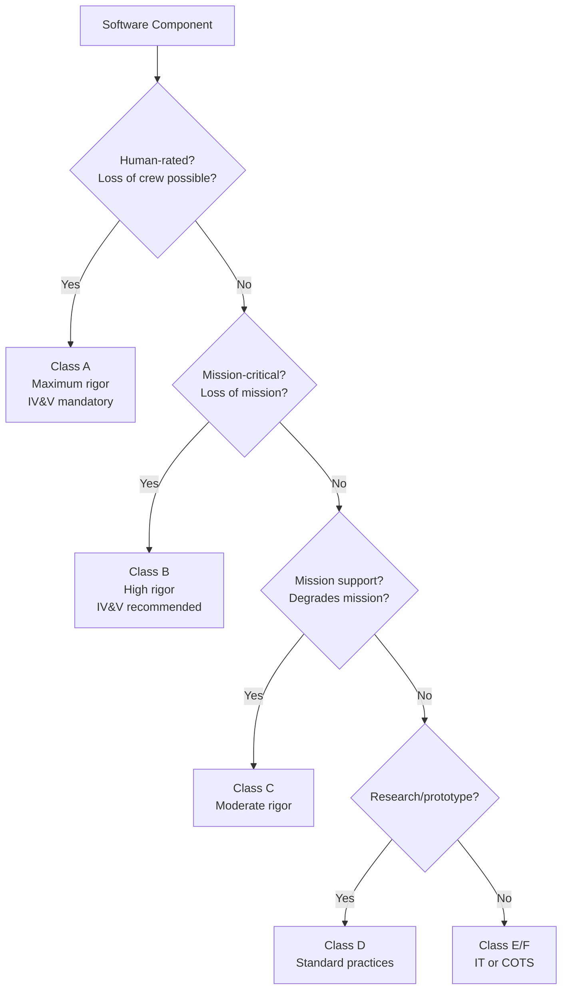

# NASA Software Safety & Engineering Standards

**Topic:** NASA-STD-8739.8A (Software Assurance & Safety), NPR 7150.2 (Software Engineering), JPL Coding Standards  
**Standards:** NASA-STD-8739.8A (2022), NPR 7150.2D (2021), JPL Institutional Coding Standard for C (2009), NASA-STD-8719.13 (Software Safety)  
**SDO:** NASA (National Aeronautics and Space Administration)  
**Audience:** NASA software engineers, safety engineers, IV&V analysts, JPL/GSFC mission developers, contractor engineers  
**Prerequisites:** Software engineering fundamentals, C/C++ programming, real-time systems, space mission awareness

---

## Chapter 1 — Historical Context & Origin Story

### 1.1 NASA Software Standards Evolution

| Year | Event |
|------|-------|
| 1986 | Challenger disaster → heightened safety awareness |
| 1996 | Ariane 5 Flight 501 (ESA, but impacted NASA thinking) |
| 1998 | Mars Climate Orbiter lost (unit conversion error) |
| 1999 | Mars Polar Lander lost (premature engine shutdown) |
| 2003 | Columbia disaster → NASA safety culture reform |
| 2004 | NPR 7150.2 (first edition — software engineering) |
| 2009 | JPL C Coding Standard published (Power of Ten rules) |
| 2014 | NASA-STD-8739.8 published (software assurance) |
| 2019 | NPR 7150.2C (updated for agile/DevSecOps) |
| 2021 | NPR 7150.2D (current — expanded guidance) |
| 2022 | NASA-STD-8739.8A (current — software assurance & safety) |

### 1.2 NASA Organization for Software

| Center | Specialty |
|--------|-----------|
| JPL (Jet Propulsion Lab) | Deep space, Mars missions, autonomous systems |
| GSFC (Goddard Space Flight Center) | Earth science, Hubble, JWST |
| JSC (Johnson Space Center) | Human spaceflight, ISS, Orion |
| MSFC (Marshall Space Flight Center) | Launch vehicles, SLS |
| ARC (Ames Research Center) | AI/ML, UAVs, mission planning |
| KSC (Kennedy Space Center) | Ground systems, launch operations |
| IV&V Facility (Fairmont, WV) | Independent V&V for Class A/B missions |

---

## Chapter 2 — Standard Architecture & Structure

### 2.1 NASA Software Standards Hierarchy

```mermaid
graph TB
    subgraph "Policy"
        NPD[NPD 7120.4<br/>NASA Engineering Policy<br/>(top-level direction)]
    end
    
    subgraph "Requirements"
        NPR[NPR 7150.2D<br/>NASA Software Engineering<br/>Requirements<br/>(WHAT to do)]
        STD[NASA-STD-8739.8A<br/>Software Assurance &<br/>Software Safety<br/>(Assurance requirements)]
        SAFETY[NASA-STD-8719.13<br/>Software Safety Standard<br/>(Safety-specific)]
    end
    
    subgraph "Center Standards"
        JPL_C[JPL Coding Standard<br/>(C language rules)]
        GSFC_STD[GSFC 580-series<br/>(Center procedures)]
        JSC_STD[JSC standards<br/>(Human spaceflight)]
    end
    
    subgraph "Handbooks"
        HB[NASA-HDBK-2203<br/>Software Assurance &<br/>Safety Guidebook]
        SARP[SARP<br/>Software Assurance<br/>Research Program]
    end
    
    NPD --> NPR
    NPD --> STD
    STD --> SAFETY
    NPR --> JPL_C
    NPR --> GSFC_STD
    STD --> HB
```

### 2.2 NPR 7150.2D Structure

| Chapter | Content |
|---------|---------|
| 1 | Policy, applicability, waivers |
| 2 | Software classification (Class A-F) |
| 3 | Software lifecycle |
| 4 | Software planning |
| 5 | Software requirements |
| 6 | Software design |
| 7 | Software implementation |
| 8 | Software testing |
| 9 | Software maintenance |
| 10 | COTS/MOTS/GOTS/OSS/reuse |
| 11 | Software safety |
| 12 | Software metrics |
| 13 | Configuration management |
| 14 | Software assurance |

### 2.3 NASA Software Classification

| Class | Criticality | Examples | Rigor |
|-------|-------------|---------|-------|
| A | Human-rated, loss of crew | Orion GN&C, ISS ECLSS | Maximum |
| B | Robotic mission, loss of mission | Mars rovers, JWST | High |
| C | Support/not mission-critical | Science analysis tools | Moderate |
| D | Prototype/research | Lab code, simulations | Standard |
| E | Institutional (IT) | Email, web apps | IT security standards |
| F | Commercial-off-shelf | COTS used as-is | Assessment only |

---

## Chapter 3 — Technical Deep Dive

### 3.1 JPL Power of Ten Rules

| Rule # | Rule | Rationale |
|--------|------|-----------|
| 1 | Restrict to simple control flow (no goto, setjmp, recursion) | Analyzability |
| 2 | Fixed upper bound on all loops | Prevents infinite loops |
| 3 | No dynamic memory allocation after initialization | Prevents memory fragmentation/leaks |
| 4 | No function longer than ~60 lines (one printed page) | Readability, testability |
| 5 | Minimum 2 assertions per function (runtime checks) | Defensive programming |
| 6 | Declare data at smallest scope possible | Minimize data exposure |
| 7 | Check return value of all non-void functions; check all function parameters | Error detection |
| 8 | Limit preprocessor use (no conditional compilation in code body) | Testability (one version) |
| 9 | Restrict pointer use: max 1 level of dereferencing, no function pointers unless necessary | Safety, analyzability |
| 10 | Compile with all warnings on, use static analysis — zero warnings policy | Catch errors early |

### 3.2 NASA-STD-8739.8A — Software Assurance Requirements

| Activity | Class A | Class B | Class C |
|----------|---------|---------|---------|
| Software Assurance Plan | Required | Required | Tailored |
| Static code analysis | Required (all code) | Required | Recommended |
| Peer review | Required (100%) | Required (all critical) | Sampling |
| Unit testing | Required | Required | Required |
| Integration testing | Required | Required | Required |
| System testing | Required | Required | Required |
| Independent assessment (IV&V) | Required | Recommended | — |
| Safety analysis | Required | Required | If safety-relevant |
| Metrics reporting | Required | Required | Tailored |
| Problem reporting | Required | Required | Required |
| Configuration management | Required | Required | Required |
| Formal inspection | Required (critical modules) | Recommended | — |

### 3.3 NASA Software Safety (NASA-STD-8719.13)

| Safety Concept | Detail |
|---------------|--------|
| Software safety criticality | Based on hazard severity + software contribution |
| Hazard analysis | Software hazard analysis (SHA) — identify SW-caused hazards |
| Safety-critical commands | Commands that could cause harm if sent erroneously |
| Inhibits | Software inhibits (barriers preventing hazardous commands) |
| Two-fault tolerant | Class A requires survival of any 2 failures |
| Command authentication | Critical commands require operator confirmation |
| Safe state | Software must be able to reach safe state from any state |
| Fail-safe design | Failure defaults to safe condition |

**NASA "Three inhibit" rule:**
- Any catastrophic hazard must have at least 3 independent inhibits (barriers)
- For human-rated systems (Class A): 2 of 3 inhibits must be independent of software
- Software alone cannot be the sole barrier against a catastrophic hazard

### 3.4 IV&V (Independent Verification & Validation)

| Aspect | Detail |
|--------|--------|
| Location | NASA IV&V Facility, Fairmont, WV |
| Purpose | Independent assessment of mission-critical software |
| Applicability | Class A missions (mandatory), Class B (recommended) |
| Activities | Requirements analysis, design analysis, code analysis, test analysis |
| Independence | Separate organization, separate budget, separate reporting |
| Tools | Static analysis, requirements modeling, simulation |
| Missions | Mars 2020, Orion, SLS, JWST, ISS |

---

## Chapter 4 — Implementation Guide

### 4.1 NASA Development Environment

| Category | Typical Choices |
|----------|-----------------|
| Flight language | C (most common), C++ (restricted), Python (ground/scripts) |
| RTOS | VxWorks (most missions), RTEMS (growing), cFS/OSAL |
| Framework | cFS (Core Flight System) — open-source, reusable |
| Processor (flight) | RAD750 (Mars rovers), LEON (growing), ARM (CubeSats) |
| Static analysis | CodeSonar (GrammaTech), Coverity, PC-Lint, SPARK/Ada |
| CI/CD | Jenkins, GitLab CI, GitHub Actions (ground systems) |
| Requirements | DOORS (legacy), Jama Connect (newer), Polarion |
| Testing | Pytest (ground), CppUTest (flight), GSFC 580 procedures |
| CM | Git (standard), ClearCase (legacy) |

### 4.2 cFS (Core Flight System)

| Component | Function |
|-----------|----------|
| OSAL | Operating System Abstraction Layer (VxWorks, RTEMS, Linux) |
| PSP | Platform Support Package (board-specific) |
| cFE | Core Flight Executive (services framework) |
| cFE-ES | Executive Services (app management, performance) |
| cFE-SB | Software Bus (publish/subscribe messaging) |
| cFE-EVS | Event Services (logging, alerting) |
| cFE-TBL | Table Services (parameter management) |
| cFE-TIME | Time Services (spacecraft clock) |
| Apps | Mission-specific applications (CFDP, HK, DS, etc.) |

```mermaid
graph TB
    subgraph "cFS Architecture"
        subgraph "Mission Apps"
            AOCS_APP[AOCS App]
            COMM_APP[Comms App]
            PL_APP[Payload App]
        end
        
        subgraph "cFE Services"
            SB[Software Bus<br/>(pub/sub)]
            ES[Executive Services<br/>(app lifecycle)]
            EVS[Event Services<br/>(logging)]
            TBL[Table Services<br/>(parameters)]
            TIME_S[Time Services<br/>(clock)]
        end
        
        subgraph "Platform"
            OSAL_L[OSAL<br/>(OS abstraction)]
            PSP_L[PSP<br/>(hardware abstraction)]
            RTOS_N[VxWorks / RTEMS / Linux]
        end
    end
    
    AOCS_APP --> SB
    COMM_APP --> SB
    PL_APP --> SB
    SB --> ES
    SB --> EVS
    ES --> OSAL_L
    OSAL_L --> PSP_L
    PSP_L --> RTOS_N
```

### 4.3 JPL Coding Standard Compliance

| Tool | Purpose |
|------|---------|
| CodeSonar | Static analysis (deep path analysis) |
| Coverity | Defect detection (buffer overflow, null deref) |
| PC-Lint/FlexeLint | MISRA + JPL rules checking |
| Clang-tidy | Open-source linter (configurable) |
| IKOS | Abstract interpretation (NASA-developed) |
| Custom scripts | Rule-specific compliance checking |

---

## Chapter 5 — Certification & Audit

### 5.1 NASA Software Reviews

| Review | Phase | Key Questions |
|--------|-------|---------------|
| SRR (Software Requirements Review) | Requirements | Requirements complete? Testable? Traceable? |
| SDR (Software Design Review) | Architecture | Architecture adequate? Interfaces defined? |
| CDR (Critical Design Review) | Detailed design | Ready for coding? Risks addressed? |
| TRR (Test Readiness Review) | Pre-test | Test environment ready? Procedures complete? |
| FRR (Flight Readiness Review) | Pre-launch | Software ready for flight? All anomalies resolved? |
| PLAR (Post-Launch Assessment Review) | Operations | In-orbit performance nominal? |

### 5.2 NASA Software Assurance Audit

| Audit Area | Class A Expectations |
|-----------|---------------------|
| Process compliance | NPR 7150.2D requirements implemented |
| Coding standards | JPL/center standards enforced |
| Static analysis | Zero critical/high findings, documented waivers |
| Peer review coverage | 100% of safety-critical code |
| Test coverage | >95% branch, MC/DC for safety-critical |
| Problem reports | All resolved or waived with rationale |
| CM compliance | All code baselined, changes controlled |
| Safety analysis | SHA complete, inhibits verified |
| IV&V integration | IV&V findings addressed |
| Metrics | Defect density, code churn, test progress tracked |

---

## Chapter 6 — Regional & Domain Variants

| Standard | Organization | Scope |
|----------|-------------|-------|
| NPR 7150.2D | NASA-wide | Software engineering requirements |
| NASA-STD-8739.8A | NASA-wide | Software assurance |
| NASA-STD-8719.13 | NASA-wide | Software safety |
| JPL D-60411 | JPL | Institutional C coding standard |
| GSFC 580 series | Goddard | Center software procedures |
| JSC 65892 | Johnson | Human spaceflight software |
| ECSS-E-ST-40C | ESA | European equivalent |
| DO-178C | FAA/EASA | Aviation equivalent |
| MIL-STD-498 | DoD | Military software development |
| IEEE 12207 | International | General lifecycle (NASA maps to this) |

### NASA vs Other Agencies

| Aspect | NASA | ESA (ECSS) | ISRO |
|--------|------|-----------|------|
| Classification | Class A-F | Cat A-D | Similar to ECSS |
| Primary standard | NPR 7150.2D | ECSS-E-ST-40C | ISRO procedures |
| PA standard | NASA-STD-8739.8A | ECSS-Q-ST-80C | Internal QA |
| IV&V | Mandatory (Class A) | Independent PA | Internal |
| Language preference | C | Ada/C | C/Ada |
| Framework | cFS (open-source) | TASTE | Internal |
| RTOS | VxWorks | RTEMS (growing) | RTEMS/internal |
| Heritage | 60+ years spaceflight | 30+ years spaceflight | 50+ years |

---

## Chapter 7 — Comparison: NASA vs DO-178C vs ECSS

| Dimension | NASA (NPR 7150.2D) | DO-178C | ECSS-E-ST-40C |
|-----------|--------------------|---------|--------------| 
| Domain | Space (all NASA) | Aviation | Space (ESA) |
| Tailoring | Extensive (per class) | Limited (per DAL) | Moderate (per project) |
| Classification | A-F (6 levels) | A-E (5 DALs) | A-D (4 categories) |
| Formal methods | Encouraged (Class A) | DO-333 supplement | Required (Cat A) |
| IV&V | Mandatory (Class A) | Not mandated (built-in) | Required (Cat A/B) |
| Coverage metric | Branch + MC/DC (critical) | MC/DC (DAL A) | MC/DC (Cat A) |
| Coding standard | JPL/center-specific | Not prescribed | ESA coding standard |
| Reuse guidance | Chapter 10 (explicit) | §12.1 (previously developed) | Chapter 7 (detailed) |
| Open source | cFS (NASA-developed) | Not applicable | Growing (TASTE) |
| Agile/DevOps | NPR 7150.2D allows | DO-178C allows (intent) | Rev 1 includes |
| Safety analysis | SHA + inhibits + 3-fault | FTA + FMEA (ARP4761A) | FMECA + FDIR |
| Authority | NASA centers (internal) | FAA/EASA (external) | ESA (contractual) |

---

## Chapter 8 — Mermaid Architecture Diagrams

### 8.1 NASA Software Classification Decision



### 8.2 NASA Safety Inhibit Architecture

```mermaid
graph TB
    subgraph "Catastrophic Hazard Protection"
        HAZ[Hazardous Function<br/>e.g., Pyrotechnic fire command]
        
        INH1[Inhibit 1<br/>Hardware switch<br/>(physical, independent)]
        INH2[Inhibit 2<br/>Hardware interlock<br/>(mechanical/electrical)]
        INH3[Inhibit 3<br/>Software command<br/>(authenticated, sequenced)]
        
        SAFE[Hazard PREVENTED<br/>unless all 3 inhibits<br/>are deliberately removed]
    end
    
    HAZ --> INH1
    INH1 -->|"Removed by crew"| INH2
    INH2 -->|"Removed by enable signal"| INH3
    INH3 -->|"Removed by SW command"| FIRE[Function executes]
    
    INH1 -->|"Active"| SAFE
    INH2 -->|"Active"| SAFE
    INH3 -->|"Active"| SAFE
```

---

## Chapter 9 — Case Studies & Failure Analysis

### 9.1 Mars Polar Lander (1999)

| Aspect | Detail |
|--------|--------|
| Mission | Mars south pole landing |
| Failure | Contact lost during descent, crash confirmed |
| Root cause (most probable) | Premature engine shutdown: leg deployment sensor generated spurious signal interpreted as touchdown |
| Software issue | Software read touchdown sensor during leg deployment (not masked) |
| Testing gap | End-to-end descent test never run with actual flight hardware sequence |
| NPR 7150.2 response | Mandatory system-level integration testing for all Class A/B |
| Lesson | Sensor behavior during ALL phases must be tested in context |

### 9.2 Mars Rover Spirit — Flash Memory Anomaly (2004)

| Aspect | Detail |
|--------|--------|
| Issue | Spirit repeatedly rebooting (60+ times) after Sol 18 |
| Root cause | Flash file system full → software exception → reboot → reload from flash → same exception → loop |
| Resolution | Ground commanded boot from RAM (bypass flash). Deleted unnecessary files. Patched file system handler. |
| Software lesson | Error handling for resource exhaustion must NOT use the exhausted resource |
| Current practice | cFS includes table-driven fault management with multiple recovery strategies |

### 9.3 JWST Software (Success Case)

| Aspect | Detail |
|--------|--------|
| Challenge | Must work perfectly at L2 (1.5M km from Earth, no servicing) |
| Software size | ~1 million lines of code |
| Class | A (loss of mission would be catastrophic to science community) |
| IV&V | Full IV&V by NASA IV&V Facility |
| Testing | Extensive simulation (cryo-vacuum test, deployment rehearsals) |
| Autonomy | High (communication delay, thermal management, fault protection) |
| Result | Flawless deployment (344 single-point-of-failure mechanisms) |
| Key factor | Rigorous NPR 7150.2 compliance + extensive rehearsal |

---

## Chapter 10 — Future Evolution & Industry Trends

| Trend | Timeline | Description |
|-------|----------|-------------|
| DevSecOps at NASA | Now | Continuous integration for ground systems |
| AI/ML for autonomy | Growing | Autonomous operations (Perseverance, Europa) |
| Rust for flight software | Emerging | Memory safety without garbage collection |
| RISC-V processors | 2025+ | Open-source flight processors (HPSC) |
| Model-based engineering | Growing | Auto-generated code from models |
| CubeSat/SmallSat standards | Now | Lightweight NPR 7150.2 tailoring |
| Artemis program | 2024+ | Human spaceflight software (Gateway, HLS) |
| Commercial crew/cargo | Now | NASA oversight of SpaceX/Boeing software |
| Open-source flight SW | Growing | cFS widely adopted (even outside NASA) |
| Quantum computing | Research | Future mission planning, optimization |

---

## Chapter 11 — Interview Questions & Career Guide

### Tier 1: Entry-Level

**Q1:** What are the JPL Power of Ten rules and why are they important for flight software?  
**A:** **The Power of Ten** is JPL's restricted coding standard for safety-critical C code (published by Gerard Holzmann, 2006). It has 10 rules designed to make code analyzable and verifiable: (1) **No goto, setjmp, recursion:** Simple control flow → analyzable, bounded execution. (2) **Fixed loop bounds:** All loops have provable termination → no infinite loops possible. (3) **No dynamic memory after init:** Prevents heap fragmentation, memory leaks in long missions. (4) **Short functions (≤60 lines):** Each function testable, reviewable on one page. (5) **≥2 assertions per function:** Runtime checks catch errors early (defensive programming). (6) **Smallest scope for data:** Minimize variable lifetime → reduce coupling. (7) **Check all returns/parameters:** Never ignore error codes → detect failures immediately. (8) **Minimal preprocessor:** No conditional compilation in code → only one version exists to test. (9) **Restrict pointers:** Max 1 dereference level → prevents pointer arithmetic errors. (10) **Zero warnings + static analysis:** All compiler warnings = errors; static analysis mandatory. **Why important:** Space missions cannot be debugged after launch. Software runs for years/decades. One bug can lose a billion-dollar mission. These rules make code mathematically analyzable (static analysis can prove properties). They enable automated tools to verify correctness.

### Tier 2: Mid-Level

**Q2:** Explain NASA's software classification system and how it determines development rigor.  
**A:** **Classification system (NPR 7150.2D Chapter 2):** NASA classifies software into Classes A-F based on consequence of failure: **Class A (Human-rated):** Consequence: loss of crew or loss of human-rated vehicle. Examples: Orion GN&C, ISS ECLSS, SLS flight software. Requirements: full IV&V (mandatory), 100% peer review, static analysis, MC/DC coverage for safety-critical, formal safety analysis (SHA), three-inhibit rule, maximum CM rigor. **Class B (Robotic mission-critical):** Consequence: loss of mission (robotic). Examples: Mars rovers, JWST, Europa Clipper. Requirements: IV&V recommended, high test coverage, static analysis, comprehensive FDIR, formal reviews (SRR/PDR/CDR/TRR/FRR). **Class C (Mission support):** Consequence: significant mission degradation but not total loss. Examples: Secondary instruments, non-critical ground tools. Requirements: moderate rigor, tailored testing, CM required. **Class D (Prototype/research):** Consequence: inconvenience, no mission impact. Examples: Lab prototypes, algorithm research code. Requirements: basic good practices, version control. **Class E/F (IT/COTS):** Institutional software or unmodified commercial software. Standard IT security practices or assessment-only. **How classification drives rigor:** Higher class → more process gates, more independence, more coverage, more formality. Each chapter of NPR 7150.2D specifies requirements "for Class A," "for Class A/B," etc. Projects can request waivers but must justify to center software authority.

### Tier 3: Senior

**Q3:** You're chief software engineer for a Class A deep space mission. How do you structure the software team and processes to meet NPR 7150.2D while managing a 5-year development timeline?  
**A:** **1. Organization structure:** (a) Development team (prime + subcontractors): responsible for design, code, unit/integration test. (b) Software Assurance team (independent): separate reporting chain, responsible for PA activities (NPR 8739.8A). (c) IV&V team (NASA IV&V Facility): fully independent, separate budget, begins at SRR. (d) Safety team: software safety engineer embedded with systems safety. (e) CM team: dedicated configuration management (full-time for Class A). **2. Process framework:** Base: NPR 7150.2D (all Class A requirements apply). Lifecycle: Incremental (not waterfall, not pure agile). Each increment → full verification cycle. 4-6 increments over 5 years (building up functionality). Reviews per NPR: SRR → SDR → CDR → TRR → FRR per increment + system-level. **3. Technical approach:** (a) Architecture: cFS-based (proven framework, reduces risk). OSAL + PSP provide hardware abstraction. Mission apps developed incrementally. (b) Coding: C (JPL standard), MISRA-C:2012 as baseline + Power of Ten rules. Static analysis: CodeSonar + Coverity (zero critical findings policy). (c) Testing strategy: Unit: 100% function, >95% branch, MC/DC for safety-critical paths. Integration: automated test suite (run daily via CI). System: high-fidelity simulator (hardware-in-loop for Phase C/D). V&V: requirements verification matrix (100% traced + verified). (d) Safety: Software Hazard Analysis at each design phase. Three-inhibit analysis for all catastrophic hazards. FDIR design + verification (tested at system level). **4. Risk management:** (a) Heritage code: maximize reuse from previous missions (cFS, proven drivers). Reused code still requires re-V&V in new context (MPL lesson). (b) Long timeline: technology refresh midstream (5 years → processor may change). Architecture abstraction (OSAL/PSP) enables processor swap. (c) Team continuity: 5-year program → key personnel retention critical. Cross-training, documentation, pair programming for knowledge sharing. **5. Metrics (NPR 7150.2D Chapter 12):** Track: defect density (target <0.1 defects/KLOC at delivery), code churn, peer review coverage, test coverage, problem report aging, schedule progress. Report monthly to project management + NASA center software authority. **6. Key Class A-specific requirements:** Two-fault tolerant (survive any 2 failures). No single software failure causes catastrophic hazard. All safety-critical software paths: MC/DC verified. Formal inspection for safety-critical modules. Full IV&V engagement (parallel analysis throughout development). FRR: must demonstrate software is ready for flight (no open critical PRs).

---

## Chapter 12 — Cheat Sheet & Quick Reference

### NASA Software Standards

```
NPR 7150.2D:         Software Engineering Requirements (process)
NASA-STD-8739.8A:    Software Assurance & Safety (quality)
NASA-STD-8719.13:    Software Safety (hazard analysis)
NASA-HDBK-2203:      Software Assurance Guidebook (guidance)
JPL D-60411:         C Coding Standard (Power of Ten)
```

### Software Classification

```
Class A: Human-rated      → IV&V mandatory, maximum rigor, 3-inhibit
Class B: Mission-critical → IV&V recommended, high rigor
Class C: Mission support  → Moderate rigor, tailored
Class D: Research/proto   → Basic practices
Class E: Institutional IT → IT security standards
Class F: COTS as-is       → Assessment only
```

### JPL Power of Ten (Summary)

```
1. No goto, setjmp, recursion
2. Fixed loop bounds (provable termination)
3. No dynamic memory after init
4. Functions ≤ 60 lines
5. ≥ 2 assertions per function
6. Smallest scope for data
7. Check ALL return values + parameters
8. Minimal preprocessor (#define OK, no #ifdef in code)
9. Restrict pointers (1 level max)
10. Zero warnings + mandatory static analysis
```

### NASA Three-Inhibit Rule

```
Catastrophic hazard requires ≥ 3 independent inhibits:
  - At least 2 must be hardware/independent of software
  - Software alone is NEVER the sole barrier
  - All inhibits must be independently verifiable
  - Inhibit removal requires deliberate action
```

### NASA Review Sequence

```
SRR → SDR → CDR → TRR → FRR → PLAR
 ↑      ↑      ↑      ↑      ↑      ↑
Req   Design  Detail  Test   Flight PostLaunch
```

### cFS Application Pattern

```
App Init:    Register with cFE-ES, subscribe to SB messages
Main Loop:   Wait for SB message → process → send response
Housekeeping: Periodic telemetry (HK packet)
Commands:    Process ground commands (from SB)
Tables:      Load/update parameters without code change
Events:      Log significant events (EVS)
```

---

*End of Document — 12_NASA_Software_Safety.md*
