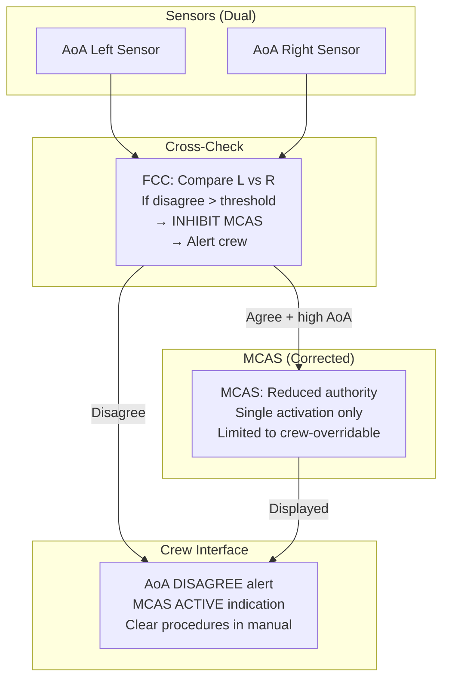

# Boeing 737 MAX — MCAS Case Study & Certification Reform

**Topic:** Boeing 737 MAX MCAS Analysis, Certification Failures, Regulatory Reform, Lessons Learned  
**Standards/Regulations:** FAR 25.1309, AC 25.1309-1A, DO-178C (as applied), ODA (14 CFR Part 21 Subpart O)  
**Context:** Lion Air Flight 610 (Oct 2018), Ethiopian Airlines Flight 302 (Mar 2019) — 346 fatalities  
**Audience:** Safety engineers, certification engineers, system architects, aviation professionals, regulatory specialists  
**Prerequisites:** FAR Part 25 basics, DO-178C concepts, ARP4754A/4761A safety assessment, flight dynamics fundamentals

---

## Chapter 1 — Historical Context & Origin Story

### 1.1 Timeline of Events

| Date | Event |
|------|-------|
| 2011 | Boeing announces 737 MAX program (re-engine 737 NG) |
| 2012 | LEAP-1B engine selected (larger diameter than CFM56) |
| 2013 | FAA approves amended type certificate basis for 737 MAX |
| 2015 | MCAS introduced during flight testing (pitch-up tendency at high AoA) |
| 2016 | MCAS scope expanded from flaps-up, high-speed to all flight conditions |
| 2017 Mar | 737 MAX 8 FAA Type Certificate (TC) issued |
| 2017 May | First delivery (Southwest Airlines) |
| 2018 Oct 29 | Lion Air Flight 610 (JT610) — 189 fatalities |
| 2018 Nov | Boeing issues bulletin; FAA issues AD on AoA disagree |
| 2019 Mar 10 | Ethiopian Airlines Flight 302 (ET302) — 157 fatalities |
| 2019 Mar 13 | Worldwide grounding (first by China, then all authorities) |
| 2019 Oct | JATR (Joint Authorities Technical Review) report |
| 2020 Jan | Congressional investigation final report |
| 2020 Nov 18 | FAA ungrounds 737 MAX (with modifications) |
| 2021 Jan | EASA independently clears 737 MAX |
| 2020 Dec | Aircraft Certification, Safety, and Accountability Act signed |
| 2022+ | Ongoing certification reform implementation |

### 1.2 Why the 737 MAX Exists

| Business Pressure | Detail |
|-------------------|--------|
| Airbus A320neo announcement (2010) | Airbus offered re-engined A320 — efficient, same type rating |
| Market share threat | Airlines considering A320neo; Boeing losing orders |
| Boeing's response | Re-engine 737 (cheaper/faster than clean-sheet design) |
| Schedule pressure | Must deliver quickly to compete (2017 EIS target) |
| Type rating goal | Same pilot type rating as 737 NG (no simulator training) |
| Economic driver | Simulator training costs airlines ~$1M per pilot pair |

---

## Chapter 2 — Technical Analysis: The MCAS System

### 2.1 Why MCAS Was Needed

| Issue | Detail |
|-------|--------|
| LEAP-1B engine | Larger diameter (69.4" vs 61") than CFM56 |
| Forward mounting | Engines mounted further forward and higher on wing |
| Aerodynamic effect | At high angle-of-attack (AoA), engine nacelle generates lift forward of CG |
| Pitch-up tendency | Aircraft nose pitches up more than expected (non-linear) |
| Handling qualities | Violated FAR 25.143 (stick force gradient must not lighten) |
| Certification requirement | Must feel like 737 NG (same type rating) |

### 2.2 MCAS Design

| Parameter | Original Design (2015) | Final Design (as certified 2017) |
|-----------|----------------------|--------------------------------|
| Activation condition | Flaps up, high AoA, high speed (dive recovery) | Flaps up, high AoA (any speed) |
| Input sensor | Single AoA vane (left OR right, alternating by flight) | Single AoA vane |
| Authority | 0.6° stabilizer per activation | 2.5° stabilizer per activation |
| Repetition | One-shot | Repeating (5-second intervals) |
| Cumulative limit | ~0.6° total | Could drive full nose-down (virtually unlimited) |
| Pilot indication | None (no annunciation of MCAS activation) | None |
| Disagree alert | Optional (linked to AoA indicator purchase) | Optional (only if AoA indicator purchased) |

### 2.3 MCAS Architecture

```mermaid
graph TB
    subgraph "Sensor"
        AOA[AoA Vane<br/>(single sensor)<br/>Left OR Right per flight]
    end
    
    subgraph "Processing"
        FCC[Flight Control Computer<br/>MCAS Algorithm<br/>If AoA > threshold<br/>AND flaps up<br/>→ Command nose-down]
    end
    
    subgraph "Output"
        STAB[Horizontal Stabilizer<br/>Electric trim motor<br/>2.5° per activation<br/>Repeats every 5 sec]
    end
    
    subgraph "Pilot Interface"
        NO_IND[No MCAS Indication<br/>No annunciation<br/>No dedicated alert]
        COLUMN[Control Column<br/>Cutout switches<br/>(electric trim disconnect)]
    end
    
    AOA -->|"Single-source data"| FCC
    FCC -->|"Trim command"| STAB
    STAB -->|"Aircraft pitches down"| PILOT[Pilot must recognize<br/>and counteract]
```

---

## Chapter 3 — What Went Wrong: Multi-Dimensional Analysis

### 3.1 Engineering Failures

| Category | Failure |
|----------|---------|
| Single-sensor dependency | MCAS relied on ONE AoA sensor (no redundancy, no cross-check) |
| Authority creep | Design grew from 0.6° to 2.5° without re-classifying severity |
| Severity classification | Classified as "Major" (should have been "Hazardous" or "Catastrophic") |
| Common mode not analyzed | Erroneous AoA → repeated uncommanded nose-down → catastrophic |
| FMEA gap | Single AoA failure mode not properly traced to aircraft-level effect |
| No crew indication | Pilots had no way to know MCAS was commanding nose-down |
| Repetitive activation | Cumulative stabilizer runaway not analyzed as single failure condition |

### 3.2 Safety Assessment Failures

| Assessment Step | What Should Have Happened | What Actually Happened |
|-----------------|--------------------------|----------------------|
| FHA | "MCAS uncommanded activation" classified Catastrophic | Classified as "Major" |
| PSSA | Identified single AoA as vulnerability → require dual-sensor | Single sensor accepted |
| CCA | Common Mode: AoA sensor → MCAS → stabilizer (no independence) | Not identified as issue |
| SSA | Verified probability meets target | Flawed: based on pilot mitigation assumption |
| Pilot assumption | Assumed pilot would immediately recognize and counteract | Pilots could not identify MCAS |

### 3.3 Certification Process Failures

| Process Issue | Detail |
|---------------|--------|
| ODA self-oversight | Boeing ODA approved MCAS changes with limited FAA review |
| Incremental changes | Each change reviewed in isolation; cumulative effect not assessed |
| System safety review | FAA specialists not involved in MCAS severity reclassification |
| Training determination | Boeing strongly advocated no simulator training (same type rating) |
| AoA disagree alert | Safety-relevant feature sold as optional (linked to paid indicator) |
| JATR finding | "Inadequate regulatory oversight" |

### 3.4 Organizational Failures

| Factor | Detail |
|--------|--------|
| Schedule pressure | MAX must beat A320neo to market |
| Cost pressure | Minimize changes (same type rating = no simulator = airline savings) |
| Cultural | "Move back" culture (avoid conflict with programs) |
| Regulatory capture | FAA too reliant on Boeing ODA; reduced FAA engineering staffing |
| Information asymmetry | FAA didn't have full visibility into MCAS changes |
| Pilot communication | MCAS not in pilot manual, not in training |

---

## Chapter 4 — The Accidents

### 4.1 Lion Air Flight 610 (JT610) — 29 Oct 2018

| Phase | Event |
|-------|-------|
| Pre-flight | Aircraft had AoA vane replaced day before; mis-calibrated (+21° error) |
| Previous flight | Same aircraft: MCAS activated repeatedly; crew fought it (maintenance not informed) |
| Takeoff | Normal takeoff from Jakarta |
| 2 minutes | Left AoA sensor sends erroneous data (+21° error) |
| MCAS activates | Aircraft pitches nose-down (2.5° stabilizer) |
| Pilot response | Pull back on column, electric trim nose-up (temporarily overrides) |
| 5 seconds later | MCAS activates again (resets after trim input) |
| Repeated cycle | 21 MCAS activations over ~10 minutes |
| Final | Pilots could not counteract; aircraft dove into Java Sea at 450 kts |
| Fatalities | 189 |

### 4.2 Ethiopian Airlines Flight 302 (ET302) — 10 Mar 2019

| Phase | Event |
|-------|-------|
| Takeoff | Normal takeoff from Addis Ababa |
| ~1 minute | Left AoA vane stuck (bird strike or debris) |
| MCAS activates | Aircraft pitches nose-down |
| Pilot response | Followed Boeing bulletin (electric trim cutout switches) |
| Problem | With cutout switches OFF, manual trim wheel extremely difficult (high airspeed) |
| Desperation | Re-enabled electric trim briefly to try trimming → MCAS reactivated |
| Final | Unable to recover; aircraft dove into ground at 575 mph |
| Fatalities | 157 |
| Key difference | Pilots followed Boeing procedure, but procedure was unworkable at high speed |

---

## Chapter 5 — The Fix: 737 MAX Return to Service

### 5.1 Design Changes

| Change | Before | After |
|--------|--------|-------|
| AoA input | Single sensor | Both AoA sensors (cross-check) |
| AoA disagree | Optional (paid feature) | Standard (always active) |
| MCAS activation | Repeating (unlimited) | Single activation, limited authority |
| Authority | 2.5° per activation | Reduced, cannot exceed what pilot can overcome |
| Pilot indication | None | MCAS activation displayed, AoA disagree alert |
| Flight control law | MCAS fires if one AoA high | MCAS only if both AoA agree (within limits) |
| Failure response | AoA disagree → MCAS still active | AoA disagree → MCAS inhibited |

### 5.2 Training Changes

| Before | After |
|--------|-------|
| No simulator training (difference training on iPad) | Simulator training required (MCAS recovery) |
| MCAS not mentioned in pilot manual | Full MCAS description in pilot manual |
| No specific MCAS procedure | Specific MCAS runaway procedure |
| Same type rating basis: "it flies like a 737 NG" | Same type rating, but differences training expanded |

### 5.3 Software Changes

| Aspect | Detail |
|--------|--------|
| FCC software | Major revision (DO-178C DAL A re-verification) |
| AoA comparison | Software cross-checks both sensors |
| Limit logic | Software limits MCAS to single application with bounded authority |
| Display software | AoA disagree indication + MCAS active indication |
| Flight envelope protection | Enhanced speed trim algorithm |
| Testing | Full FAA certification flight test re-evaluation |
| DO-178C level | DAL A (appropriate for Catastrophic failure condition) |

---

## Chapter 6 — Regulatory Reform

### 6.1 Aircraft Certification, Safety, and Accountability Act (2020)

| Provision | Detail |
|-----------|--------|
| Enhanced FAA oversight of ODA | More FAA direct involvement in critical systems |
| ODA UM protections | Unit Members can raise safety concerns to FAA directly |
| Whistleblower protection | Legal protection for ODA employees reporting safety issues |
| System safety assessment reform | Enhanced review of safety assessment assumptions |
| Human factors requirements | Mandatory consideration of pilot interaction |
| Multi-failure analysis | Must consider previously "extremely improbable" combinations |
| Foreign authority engagement | Better communication with EASA, TCCA, etc. |
| FAA staffing | Mandate to hire more FAA certification engineers |

### 6.2 JATR Recommendations (Implemented)

| Recommendation | Status |
|---------------|--------|
| Review assumptions in safety analyses | Implemented |
| Ensure adequate FAA staffing | In progress |
| Improve ODA oversight procedures | Implemented |
| Review training and human factors | Implemented |
| International coordination for complex systems | Improved |
| Standard operating procedures for novel systems | Developed |

---

## Chapter 7 — Lessons Learned for Systems Engineers

### 7.1 Safety Assessment Lessons

| Lesson | Application |
|--------|-------------|
| Single-sensor criticality | Never classify single-sensor system as "Major" if downstream effect could be Catastrophic |
| Authority creep | When system authority increases, re-evaluate severity classification |
| Cumulative effect | Repeating functions must be analyzed for cumulative worst-case |
| Pilot assumption limits | Cannot assume pilot will correctly diagnose unmarked automated system failure |
| Common mode analysis | Single sensor → same-source data → no independence → AND gate invalid |
| FMEA traceability | Trace every sensor failure mode to aircraft-level consequence |

### 7.2 Certification Process Lessons

| Lesson | Application |
|--------|-------------|
| ODA independence | Self-oversight requires genuine independence (no pressure) |
| Incremental review inadequacy | Cumulative changes need holistic safety review |
| Regulatory access | Authority must see all safety-relevant changes |
| Optional safety features | Safety-relevant functions must not be optional/paid upgrades |
| Training integration | Any new automation must be in training + manuals |
| International coordination | Complex systems need multi-authority review |

### 7.3 Organizational Lessons

| Lesson | Application |
|--------|-------------|
| Schedule vs safety | Schedule pressure must never override safety assessment rigor |
| Financial conflicts | Commercial interests (same type rating) can bias safety decisions |
| Information flow | Bad news must flow freely to decision-makers |
| Culture | "Speak up" culture must be protected and rewarded |
| Independent review | External review catches blind spots (JATR) |

---

## Chapter 8 — Mermaid Architecture Diagrams

### 8.1 MCAS Failure Chain (Accident Sequence)

```mermaid
graph TB
    subgraph "Initiating Event"
        AOA_F[AoA Sensor Failure<br/>Erroneous high AoA<br/>(maintenance error or damage)]
    end
    
    subgraph "System Response"
        FCC_MCAS[FCC: MCAS Algorithm<br/>Sees high AoA → commands<br/>nose-down stabilizer trim]
        REPEAT[MCAS Repeats<br/>Every 5 seconds<br/>2.5° per activation]
    end
    
    subgraph "Barriers (Failed)"
        NO_CROSS[No cross-check<br/>(single sensor)]
        NO_IND_B[No crew indication<br/>(MCAS not annunciated)]
        NO_LIMIT[No cumulative limit<br/>(unlimited authority)]
    end
    
    subgraph "Outcome"
        DIVE[Aircraft in nose-down dive<br/>Stabilizer fully nose-down<br/>Unrecoverable]
        CRASH[Controlled flight<br/>into terrain<br/>346 fatalities]
    end
    
    AOA_F --> FCC_MCAS
    FCC_MCAS --> REPEAT
    NO_CROSS -->|"Barrier absent"| FCC_MCAS
    NO_IND_B -->|"Barrier absent"| REPEAT
    NO_LIMIT -->|"Barrier absent"| REPEAT
    REPEAT --> DIVE --> CRASH
```

### 8.2 Fix: Corrected Architecture



---

## Chapter 9 — Comparison with Other Automation Failures

| Incident | System | Root Cause | Parallel to MCAS |
|----------|--------|-----------|-----------------|
| AF447 (2009) | Pitot tubes → autopilot | Sensor failure → confusion | Sensor failure → uncommanded action |
| Qantas QF72 (2008) | ADIRU → flight control | Erroneous data → pitch-down | Erroneous data → uncommanded pitch |
| Turkish 1951 (2009) | Radio altimeter → autothrottle | -8ft reading → idle thrust | Sensor error → inappropriate response |
| Asiana 214 (2013) | Autothrottle mode | Mode confusion | Automation opacity |
| **737 MAX (2018-19)** | **AoA → MCAS** | **Single sensor → catastrophic** | **Central case** |

**Common patterns:**
1. Single-source sensor data driving critical automation
2. Pilot unaware of automation state (opacity)
3. Automation authority exceeding pilot override capability
4. Safety assessment underestimating failure consequence

---

## Chapter 10 — Future Implications

| Area | Impact |
|------|--------|
| New Type Certificates | Much greater scrutiny of automation + sensor redundancy |
| ODA oversight | FAA more hands-on, especially for safety-critical systems |
| AI/ML in flight | "MCAS precedent" — how to certify intelligent systems |
| eVTOL certification | Lessons applied to highly automated air taxis |
| Single-pilot operations | Must prove automation more rigorously (MCAS shows risk) |
| International coordination | Multi-authority review standard for complex systems |
| Training requirements | Simulator training for any new automation |
| Safety culture | Industry-wide push for psychological safety in reporting |
| Software transparency | Greater regulator access to SW design decisions |
| Failure classification | More conservative initial classification (assume worst) |

---

## Chapter 11 — Interview Questions & Career Guide

### Tier 1: Entry-Level

**Q1:** What was MCAS and why did it cause the 737 MAX accidents?  
**A:** **MCAS (Maneuvering Characteristics Augmentation System):** An automated flight control function that pushed the 737 MAX nose down when it detected high angle-of-attack (AoA). It was added because the MAX's larger engines changed the aircraft's aerodynamics (pitch-up tendency at high AoA). **Why it caused accidents:** (1) Single sensor: MCAS used only ONE AoA sensor (no redundancy or cross-check). (2) Sensor failure: In both accidents, the AoA sensor gave erroneous data (misinstalled or damaged). (3) Repeated activation: MCAS activated every 5 seconds, pushing nose down 2.5° each time (cumulative). (4) No indication: Pilots received NO alert that MCAS was commanding nose-down. (5) Excessive authority: MCAS could drive the stabilizer full nose-down (unrecoverable). (6) Pilot training: Pilots were not trained on MCAS and didn't know it existed. **Result:** Erroneous sensor → MCAS repeatedly pushed nose down → pilots couldn't understand or overcome → controlled flight into terrain.

### Tier 2: Mid-Level

**Q2:** What were the safety assessment failures that allowed MCAS to be certified with these vulnerabilities?  
**A:** **1. Severity misclassification:** MCAS uncommanded activation was classified as "Major" (probability < 10⁻⁵/fh). It should have been "Hazardous" or "Catastrophic" (< 10⁻⁷ or 10⁻⁹). The misclassification meant: less rigorous design requirements (DAL C instead of A/B), single-sensor was acceptable (for "Major"), limited pilot indication required. **2. Flawed pilot assumption:** The safety assessment assumed: "Pilot will recognize uncommanded nose-down and apply trim cutout within 4 seconds." Reality: Pilots had no MCAS indication, no training, and the situation was confusing (multiple alerts: stick shaker, overspeed, altitude disagree). Assumption violated: AC 25.1309 allows pilot credit, but pilot MUST have: clear indication, training, and adequate time — none present. **3. Common mode not analyzed:** Single AoA sensor → MCAS → stabilizer = no independence. Same sensor feeds both initial activation AND repeated activations. CMA (Common Mode Analysis) should have flagged: common data source → common failure mode defeats ALL barriers. **4. Authority creep without re-assessment:** MCAS grew from 0.6° (low authority, one-shot) to 2.5° (high authority, repeating). Each incremental change reviewed separately. Cumulative effect never holistically re-assessed. Should have triggered FHA re-evaluation at system level. **5. ODA review gaps:** Boeing ODA specialists approved changes. FAA system safety engineers not engaged for MCAS evolution. No independent challenge to Boeing's severity classification.

### Tier 3: Senior

**Q3:** As a system safety architect, how would you redesign MCAS properly and what certification approach would you use?  
**A:** **1. Functional Hazard Assessment (correct):** "MCAS uncommanded activation (continuous nose-down)" → Catastrophic. Justification: pilot evidence shows this condition led to loss of aircraft (empirical proof). DAL A required for MCAS software. Probability target: < 10⁻⁹/fh. **2. Architecture (redesigned):** (a) Dual AoA input: Use both left and right AoA sensors. Cross-comparison: if disagree > threshold → MCAS inhibited + crew alert. This eliminates single-sensor as failure mode. (b) Authority limiting: Physical hard limit on MCAS stabilizer authority (cannot exceed what pilot can override with column force). One-shot activation with manual reset (no repeating). (c) Pilot monitoring: Clear "MCAS ACTIVE" annunciation on PFD. AoA disagree alert (always active, never optional). MCAS status in EICAS. (d) Override: Column force always overrides MCAS (force fighting → MCAS yields). Trim cutout accessible AND effective at all speeds. **3. Safety assessment (correct):** FTA top event: "MCAS uncommanded activation." AND gate: AoA sensor A fails AND AoA sensor B fails AND monitoring fails. Probability: 10⁻⁵ × 10⁻⁵ × 10⁻³ = 10⁻¹³ (well below 10⁻⁹). CCA: ZSA — sensors physically separated (different sides of aircraft). PRA — bird strike unlikely to hit both simultaneously. CMA — different maintenance actions per sensor (staggered). **4. DO-178C implementation:** DAL A for all MCAS code paths. MC/DC coverage on comparison logic + activation logic. Formal verification of authority limiting function. Requirements: REQ-MCAS-001: "MCAS shall use both AoA sensors and shall inhibit if disagree > 5°." REQ-MCAS-002: "MCAS cumulative authority shall not exceed 1.0° in any single activation." REQ-MCAS-003: "MCAS shall annunciate to flight crew within 1 second of activation." **5. Certification approach:** Independent safety assessment (not ODA for MCAS severity finding). Direct FAA specialist review of FHA classification. Multi-authority coordination (EASA + TCCA + ANAC review). Full flight crew assessment: workload analysis, simulator evaluation. Operational evaluation: line pilots evaluate procedures in simulator.

---

## Chapter 12 — Cheat Sheet & Quick Reference

### MCAS Failure Summary

```
Root cause:     Single AoA sensor → erroneous data → MCAS activates
System failure: Repeated activation (5s intervals) → cumulative nose-down
Barrier 1:      No sensor redundancy (single-point failure)
Barrier 2:      No crew indication (could not diagnose)
Barrier 3:      No authority limit (could not override)
Classification: Should be CATASTROPHIC (was classified MAJOR)
Outcome:        346 fatalities across two accidents
```

### Key Lessons (One-Liners)

```
1. Single sensor + safety-critical function = unacceptable
2. Severity classification must reflect worst realistic consequence
3. Pilot mitigation credit requires: indication + training + time
4. Repeating functions need cumulative worst-case analysis
5. Optional safety features must not exist (safety is mandatory)
6. Authority creep requires re-evaluation of entire safety case
7. Self-certification (ODA) needs genuine independence for critical findings
8. Schedule/cost pressure is not justification for reduced safety rigor
```

### Regulatory Reforms

```
Before 737 MAX:                    After 737 MAX:
  ODA mostly self-governed    →     Enhanced FAA oversight
  Incremental change review   →     Holistic system review
  Pilot assumed capable       →     Human factors rigorously assessed
  Optional safety features    →     Safety features mandatory
  Single-authority review     →     Multi-authority coordination
  Limited whistleblower       →     Legal protection for safety concerns
```

### Comparison: Original vs Fixed MCAS

```
                    ORIGINAL              FIXED
AoA input:          1 sensor              2 sensors + cross-check
Activation:         Repeating (5s)        Single, limited
Authority:          2.5°/activation       Reduced, bounded
Indication:         None                  MCAS ACTIVE display
AoA disagree:       Optional (paid)       Always active
Training:           None (not in manual)  Simulator required
Severity class:     Major (wrong)         Catastrophic (correct)
DAL:                C (insufficient)      A (appropriate)
```

---

*End of Document — 13_Boeing_737_MAX_Case_Study.md*
