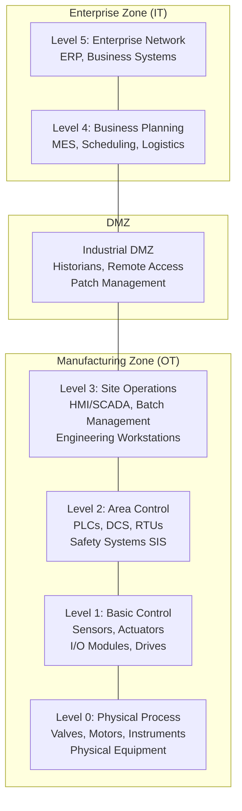
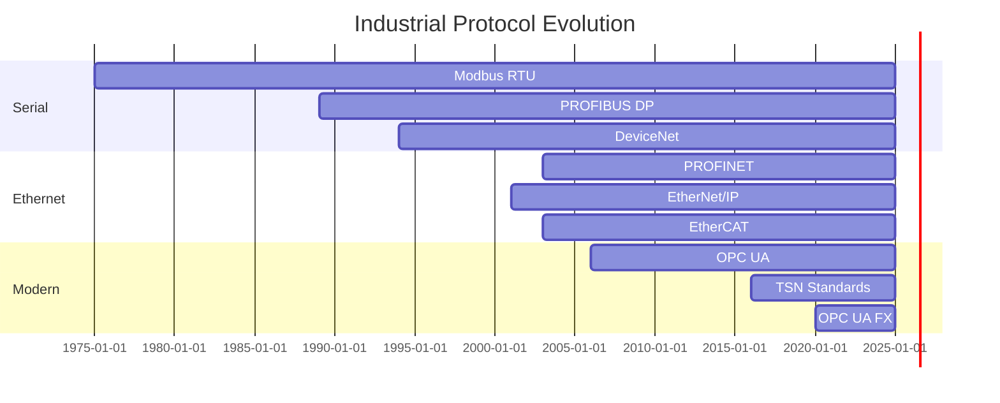

# Industrial Automation & OT/IT Landscape

**Topic:** Industrial Control Systems (ICS), Operational Technology (OT), IT/OT Convergence Overview  
**Standards:** IEC 62443 series, IEC 61131, OPC UA (IEC 62541), PROFINET, EtherCAT, TSN (IEEE 802.1)  
**SDO:** IEC, ISA, IEEE, ODVA, PI (PROFIBUS/PROFINET International), ETG (EtherCAT Technology Group)  
**Audience:** ICS/OT engineers, automation architects, cybersecurity professionals, Industry 4.0 practitioners  
**Prerequisites:** Networking fundamentals, basic PLC/SCADA awareness, industrial process understanding

---

## Chapter 1 — Historical Context & Origin Story

### 1.1 Evolution of Industrial Automation

| Era | Period | Characteristics |
|-----|--------|-----------------|
| Mechanical | Pre-1950 | Relay logic, pneumatic controls, cam-operated |
| Electronic | 1950-1968 | Transistor controllers, analog instrumentation |
| PLC Revolution | 1968-1985 | Modicon 084 (first PLC), ladder logic, discrete I/O |
| Fieldbus | 1985-2000 | Digital communication (PROFIBUS, Foundation Fieldbus, DeviceNet) |
| Industrial Ethernet | 2000-2015 | PROFINET, EtherNet/IP, EtherCAT, Modbus TCP |
| Industry 4.0 | 2015-present | OPC UA, TSN, cloud, edge computing, digital twins |
| Industry 5.0 | Emerging | Human-centric, sustainable, resilient manufacturing |

### 1.2 Key Milestones

| Year | Event |
|------|-------|
| 1968 | Modicon 084 — first PLC (Dick Morley, Bedford Associates) |
| 1975 | Modbus protocol — first open serial industrial protocol |
| 1979 | PROFIBUS project begins (Germany, 21 companies) |
| 1993 | IEC 61158 (fieldbus international standard) |
| 1996 | IEC 61131-3 — PLC programming languages standardized |
| 2001 | OPC DA widely deployed (COM/DCOM-based) |
| 2003 | EtherCAT introduced (Beckhoff) |
| 2006 | OPC UA specification published (platform-independent) |
| 2010 | Stuxnet discovered — ICS security paradigm shift |
| 2013 | Industrie 4.0 platform launched (Germany) |
| 2017 | TRITON/TRISIS — first SIS-targeted attack |
| 2020 | OPC UA FX — field-level OPC UA (pub/sub) |
| 2023 | TSN adoption accelerating for converged networks |

---

## Chapter 2 — Standard Architecture & Structure

### 2.1 Industrial Automation Hierarchy (Purdue Model / ISA-95)



### 2.2 Standards Landscape Mapping

| Layer | Standards/Protocols |
|-------|-------------------|
| Enterprise (L5) | TCP/IP, HTTP/REST, MQTT, AMQP |
| Business (L4) | ISA-95 (IEC 62264), B2MML |
| Operations (L3) | OPC UA, SQL, MQTT, OPC DA (legacy) |
| Control (L2) | PROFINET, EtherCAT, EtherNet/IP, Modbus TCP |
| Field (L1) | PROFIBUS, DeviceNet, IO-Link, HART, AS-i |
| Process (L0) | 4-20mA, NAMUR, discrete I/O, encoders |
| Cross-layer: Security | IEC 62443 (all levels) |
| Cross-layer: Safety | IEC 61508 → PROFIsafe, FSoE, CIP Safety |
| Cross-layer: Time | IEEE 802.1AS (TSN), IEEE 1588 (PTP) |

### 2.3 Major Protocol Families

| Family | Protocols | Organization |
|--------|-----------|-------------|
| PROFINET/PROFIBUS | PROFINET RT/IRT, PROFIBUS DP/PA, PROFIsafe | PI (Profibus International) |
| CIP (Common Industrial Protocol) | EtherNet/IP, DeviceNet, ControlNet, CIP Safety | ODVA |
| EtherCAT | EtherCAT, FSoE (Safety), EAP (Automation Protocol) | ETG (EtherCAT Technology Group) |
| OPC | OPC UA, OPC DA (legacy), OPC UA FX | OPC Foundation |
| Modbus | Modbus RTU, Modbus TCP, Modbus Plus | Modbus.org (now OPC Foundation) |
| CC-Link | CC-Link IE Field, CC-Link IE TSN | CLPA |
| SERCOS | SERCOS III | IGS (International SERCOS Group) |

---

## Chapter 3 — Technical Deep Dive

### 3.1 Protocol Performance Comparison

| Protocol | Cycle Time | Jitter | Bandwidth | Topology |
|----------|-----------|--------|-----------|----------|
| EtherCAT | 12.5 μs (typ) | <1 μs | 100 Mbps (effective ~90%) | Line (logical ring) |
| PROFINET IRT | 250 μs (min) | <1 μs | 100 Mbps | Star/line/ring |
| PROFINET RT | 1-10 ms | ~100 μs | 100 Mbps | Standard Ethernet |
| EtherNet/IP | 1-10 ms | ~500 μs | 100 Mbps/1 Gbps | Star/tree |
| Modbus TCP | 10-100 ms | ~ms-level | 100 Mbps | Star |
| PROFIBUS DP | 1-5 ms | ~10 μs | 12 Mbps | Line (RS-485) |
| CC-Link IE TSN | 31.25 μs | <1 μs | 1 Gbps | Flexible |
| SERCOS III | 31.25 μs | <1 μs | 100 Mbps | Ring |
| OPC UA Pub/Sub + TSN | <250 μs | <1 μs | 1 Gbps+ | Flexible |

### 3.2 Key Architectural Concepts

| Concept | Description |
|---------|-------------|
| Determinism | Guaranteed message delivery within bounded time |
| Isochronous | Constant cycle time with synchronized clocks |
| Producer-Consumer | Data-driven model (EtherNet/IP, OPC UA Pub/Sub) |
| Master-Slave | Polling model (PROFIBUS, Modbus RTU) |
| Processing on the fly | Read/insert data without store-and-forward (EtherCAT) |
| Zones and Conduits | IEC 62443 network segmentation model |
| Defense in Depth | Multiple security layers (OT security strategy) |
| Safety Function | SIL-rated function over communication network |
| Black Channel | Safety layer independent of underlying protocol |

### 3.3 IT vs OT Characteristics

| Dimension | IT | OT |
|-----------|----|----|
| Priority | Confidentiality | Availability |
| Uptime requirement | 99.9% (three-nines) | 99.999% (five-nines) |
| Lifecycle | 3-5 years | 15-30 years |
| Patching | Regular (monthly) | Rare (annual shutdowns) |
| Protocol age | Modern (HTTP/TLS) | Legacy (Modbus 1975, PROFIBUS 1989) |
| Authentication | Standard (AD, LDAP, MFA) | Often none (Modbus, older PROFINET) |
| Encryption | Ubiquitous (TLS 1.3) | Rare (growing with OPC UA) |
| Real-time | Soft (web apps) | Hard (μs-level determinism) |
| Safety | Data integrity | Human safety (SIL, PLe) |
| Failure mode | Restart acceptable | Fail-safe to safe state |

---

## Chapter 4 — Implementation Guide

### 4.1 Choosing an Industrial Protocol

| Factor | Consideration |
|--------|---------------|
| Application | Motion control → EtherCAT/SERCOS; Process → PROFINET/EtherNet/IP |
| Cycle time | <100μs → EtherCAT; 1ms → PROFINET IRT; 10ms → EtherNet/IP |
| Vendor ecosystem | Siemens → PROFINET; Rockwell → EtherNet/IP; Beckhoff → EtherCAT |
| Topology | Flexible → EtherNet/IP, PROFINET; Line → EtherCAT |
| Safety | PROFIsafe, CIP Safety, FSoE (all SIL 3 capable) |
| Security | OPC UA has built-in security; legacy protocols need wrapping |
| Integration | Multi-vendor → OPC UA (information model); single-vendor → native |
| Future | TSN convergence favors OPC UA FX + TSN |

### 4.2 Industrial Network Architecture

```mermaid
graph TB
    subgraph "Cloud/Enterprise"
        CLOUD[Cloud Services<br/>Analytics, AI/ML]
        ERP_S[ERP<br/>(SAP, Oracle)]
    end
    
    subgraph "Edge Layer"
        EDGE[Edge Gateway<br/>OPC UA Server<br/>MQTT Broker<br/>Protocol Conversion]
    end
    
    subgraph "Control Layer"
        PLC1[PLC/DCS<br/>PROFINET Controller]
        PLC2[PLC<br/>EtherCAT Master]
        SCADA[SCADA/HMI<br/>OPC UA Client]
    end
    
    subgraph "Field Layer"
        IO1[Remote I/O<br/>PROFINET Device]
        DRV[Servo Drives<br/>EtherCAT Slave]
        SENS[Smart Sensors<br/>IO-Link Master]
        VFD[VFD<br/>Modbus TCP]
    end
    
    CLOUD --> EDGE
    ERP_S --> EDGE
    EDGE --> PLC1
    EDGE --> PLC2
    EDGE --> SCADA
    PLC1 --> IO1
    PLC2 --> DRV
    PLC1 --> SENS
    PLC1 --> VFD
```

### 4.3 Security Implementation

| Layer | Control |
|-------|---------|
| Physical | Locked cabinets, access control, tamper detection |
| Network | VLANs, firewalls, unidirectional gateways |
| Host | Whitelisting, endpoint detection, hardening |
| Application | OPC UA certificates, authentication, role-based access |
| Data | Encryption in transit (TLS), integrity checking |
| Monitoring | IDS/IPS (OT-aware: Nozomi, Claroty, Dragos) |
| Governance | IEC 62443 CSMS, patch management, incident response |

---

## Chapter 5 — Certification & Compliance

### 5.1 IEC 62443 Certification Scheme

| Certification | Scope | Body |
|--------------|-------|------|
| IEC 62443-4-1 (SDL) | Product development process | ISASecure (ISCI), TÜV |
| IEC 62443-4-2 (Component) | Product technical security (SL1-4) | ISASecure, TÜV |
| IEC 62443-3-3 (System) | System security capabilities | ISASecure |
| IEC 62443-2-4 (Service) | Integration/maintenance service providers | ISASecure |
| ISASecure EDSA | Embedded Device Security Assurance | ISCI |
| ISASecure SSA | System Security Assurance | ISCI |
| ISASecure SDLA | Software Development Lifecycle Assessment | ISCI |

### 5.2 Industrial Safety Certifications

| Standard | Scope | Certification Bodies |
|----------|-------|---------------------|
| IEC 61508 SIL | Safety Integrity Level (generic) | TÜV, Exida, UL |
| IEC 62061 SIL CL | Machine safety (complex systems) | TÜV |
| ISO 13849 PL | Machine safety (performance level) | TÜV |
| IEC 61131-6 | PLC functional safety | TÜV |
| Safety protocol (PROFIsafe, FSoE, CIP Safety) | Network safety | TÜV, ODVA |

---

## Chapter 6 — Regional & Domain Variants

| Region | Dominant Protocol | Notes |
|--------|-------------------|-------|
| Germany/Europe | PROFINET, PROFIBUS | Siemens ecosystem; PI organization |
| North America | EtherNet/IP, DeviceNet | Rockwell/Allen-Bradley; ODVA |
| Japan | CC-Link IE, MECHATROLINK | Mitsubishi, Yaskawa dominance |
| Global (motion) | EtherCAT | Beckhoff; dominant in motion/packaging |
| Global (interoperability) | OPC UA | Vendor-neutral; growing adoption |
| Process industry | HART, Foundation Fieldbus, PROFIBUS PA | Slower migration to Ethernet |
| Power/Energy | IEC 61850, DNP3 | See Category 31 |
| Building | BACnet, KNX, LON | See Category 10 |

---

## Chapter 7 — Comparison with Competing Approaches

| Dimension | PROFINET | EtherNet/IP | EtherCAT | OPC UA + TSN |
|-----------|----------|-------------|-----------|--------------|
| Organization | PI | ODVA | ETG | OPC Foundation + IEEE |
| Base protocol | Modified Ethernet | Standard Ethernet/IP | Modified Ethernet | Standard Ethernet |
| Real-time | RT (1ms) / IRT (250μs) | CIP Sync (~1ms) | 12.5μs cycles | TSN (sub-μs jitter) |
| Topology | Star/line/ring | Star/tree | Line (logical ring) | Flexible |
| Max nodes | 256 per controller | Practically unlimited | 65,535 | Unlimited |
| Safety | PROFIsafe (SIL 3) | CIP Safety (SIL 3) | FSoE (SIL 3) | TBD (work in progress) |
| Security | v2.4+ (TLS, certificates) | CIP Security (2019+) | Limited (EAP) | Built-in (TLS, X.509) |
| Information model | GSD/GSDML | EDS files | ESI (XML) | Rich OPC UA model |
| Vendor base | 1,700+ companies | 600+ companies | 6,000+ members | 900+ members |
| Motion | PROFIdrive | CIP Motion | Distributed clocks | TSN + OPC UA Motion |

---

## Chapter 8 — Mermaid Architecture Diagrams

### 8.1 IEC 62443 Defense-in-Depth

```mermaid
graph TB
    subgraph "Layer 7: Policies & Procedures"
        GOV[Security Management System<br/>IEC 62443-2-1]
    end
    
    subgraph "Layer 6: Physical Security"
        PHYS[Access control, cameras<br/>Locked panels, tamper detect]
    end
    
    subgraph "Layer 5: Network Security"
        NET[Zones & conduits<br/>Firewalls, VLANs, DMZ<br/>IEC 62443-3-2]
    end
    
    subgraph "Layer 4: Host Security"
        HOST[Hardening, whitelisting<br/>AV, endpoint protection]
    end
    
    subgraph "Layer 3: Application Security"
        APP[Authentication, RBAC<br/>OPC UA security model<br/>IEC 62443-4-2]
    end
    
    subgraph "Layer 2: Data Security"
        DATA[Encryption, integrity<br/>TLS, certificates]
    end
    
    subgraph "Layer 1: Component Security"
        COMP[Secure boot, firmware signing<br/>Secure development (62443-4-1)]
    end
    
    GOV --> PHYS --> NET --> HOST --> APP --> DATA --> COMP
```

### 8.2 Protocol Timeline



---

## Chapter 9 — Case Studies & Failure Analysis

### 9.1 Stuxnet (2010) — ICS Security Wake-Up Call

| Aspect | Detail |
|--------|--------|
| Target | Iran Natanz uranium enrichment (Siemens S7-315/S7-417 PLCs) |
| Attack | Modified centrifuge speed commands while reporting normal to SCADA |
| Entry | USB drive → Windows 0-days → WinCC/Step 7 → PLC |
| Impact | ~1,000 centrifuges destroyed; set program back years |
| Lesson | Air-gapped OT is not immune; supply chain attack vector |
| IEC 62443 response | Accelerated adoption; SL3+ for critical infrastructure |

### 9.2 TRITON/TRISIS (2017) — Safety System Attack

| Aspect | Detail |
|--------|--------|
| Target | Schneider Electric Triconex SIS (Safety Instrumented System) |
| Attack | Injected malicious code into SIS controller firmware |
| Intent | Disable safety system → allow unsafe conditions → physical damage |
| Discovery | Accidental SIS trip revealed attack (attacker error) |
| Impact | Near-miss; could have caused explosion/chemical release |
| Lesson | SIS must be isolated from control network; firmware integrity |

---

## Chapter 10 — Future Evolution & Industry Trends

| Trend | Timeline | Description |
|-------|----------|-------------|
| OPC UA + TSN convergence | Now-2027 | Single converged network for IT + OT |
| 5G for industry | Growing | Wireless deterministic communication |
| Edge computing | Now | Data processing at control layer |
| Digital twins | Growing | Real-time virtual replicas of physical systems |
| AI/ML in control | Emerging | Predictive maintenance, adaptive control |
| Zero Trust OT | Growing | Never trust, always verify (even inside OT) |
| Cloud-connected OT | Now | Hybrid architectures (cloud analytics + edge control) |
| Ethernet-APL | 2022+ | 2-wire Ethernet to field (process industry replacement for 4-20mA) |
| IEC 62443 Edition 2 | 2024+ | Updated for cloud, remote access, AI |
| Autonomous systems | 2025+ | Self-optimizing production systems |

---

## Chapter 11 — Interview Questions & Career Guide

### Tier 1: Entry-Level

**Q1:** Explain the Purdue Model and why it matters for OT security.  
**A:** The Purdue Model (ISA-95/IEC 62264) defines 6 levels of industrial automation: Level 0 (physical process/sensors/actuators) → Level 1 (basic control: PLCs, I/O) → Level 2 (area control: SCADA, HMI, SIS) → Level 3 (site operations: MES, historians) → DMZ (industrial demilitarized zone) → Level 4-5 (enterprise: ERP, business). **Why it matters for security:** (1) Segmentation basis: each level has different security requirements (IEC 62443 zones). (2) Traffic filtering: firewalls between levels restrict protocol flows. (3) No direct L5→L1 traffic: enterprise cannot directly reach control devices. (4) DMZ purpose: all cross-boundary communication goes through DMZ services (no direct paths). (5) Incident containment: compromise at one level cannot freely move to others. IEC 62443-3-2 formalizes this into "zones" (groups of assets with same security requirements) and "conduits" (controlled communication paths between zones).

### Tier 2: Mid-Level

**Q2:** Compare EtherCAT, PROFINET IRT, and EtherNet/IP for a multi-axis motion control application requiring <100μs synchronization.  
**A:** **EtherCAT:** Best for high-performance motion. Line topology with "processing on the fly" — frames pass through each slave, data inserted/extracted in hardware (no store-and-forward delay). Distributed clocks provide <1μs jitter. 12.5μs minimum cycle achievable. No switches needed (saves cost). Ideal for: servo drives, high-speed packaging, CNC. **PROFINET IRT:** Uses scheduled/reserved Ethernet time slots (isochronous real-time). Requires special hardware (ASIC/FPGA in switches and devices). 250μs minimum cycle, <1μs jitter. Star/line topology with managed switches. Ideal for: Siemens TIA ecosystem, combined process + motion. **EtherNet/IP (CIP Sync):** Standard Ethernet with IEEE 1588 time synchronization. CIP Motion profile for servo control. Typically 1ms cycle (can reach 500μs with optimized hardware). More jitter than EtherCAT/PROFINET IRT (network switch latency). Ideal for: Rockwell ecosystems, applications not requiring extreme performance. **Recommendation for <100μs sync:** EtherCAT is the clear winner — only protocol that reliably achieves 12.5-50μs cycles with sub-μs jitter using commodity hardware. PROFINET IRT achievable at 250μs with specialized infrastructure. EtherNet/IP CIP Sync cannot reliably achieve <100μs.

### Tier 3: Senior

**Q3:** Design a brownfield IEC 62443 security architecture for a manufacturing plant with legacy Modbus and PROFIBUS devices, new PROFINET islands, and cloud analytics requirements.  
**A:** **1. Assessment (IEC 62443-3-2):** Inventory all assets by level. Identify crown jewels (SIS, critical processes). Risk assessment: threat scenarios vs. legacy vulnerabilities (Modbus has zero authentication). Define target Security Levels per zone. **2. Zone architecture:** Zone 1 (Safety): SIS on isolated network, unidirectional gateway to monitoring. SL-T: 3. Zone 2 (Legacy control): Modbus/PROFIBUS devices behind protocol-aware firewall (e.g., Tofino). No direct external access. SL-T: 2. Zone 3 (Modern control): PROFINET island with OPC UA gateway. Certificate-based authentication. SL-T: 3. Zone 4 (DMZ): OPC UA aggregation server, historian mirror, patch server, jump box. Zone 5 (Enterprise): Standard IT security. **3. Conduit design:** Legacy → DMZ: Protocol break (data diode or OPC UA gateway reads Modbus, converts). PROFINET → DMZ: OPC UA server on PLC (S7-1500) or gateway. DMZ → Cloud: MQTT over TLS (outbound only, no inbound to OT). All conduits: application-layer firewall inspection (DPI). **4. Legacy mitigation:** Modbus: Deploy OT-aware IDS (Dragos/Nozomi) for anomaly detection since encryption impossible. Network micro-segmentation (per device VLAN where feasible). PROFIBUS: Air-gapped from IP network; only monitored via gateway. Compensating controls: physical access control, change detection. **5. Monitoring:** OT IDS at each zone boundary. SIEM integration (zone 4 → zone 5). Anomaly detection on Modbus traffic (unusual function codes, write to holding registers). Asset inventory continuous (detect rogue devices). **6. Governance (IEC 62443-2-1):** CSMS: roles, responsibilities, incident response. Patch management: scheduled during maintenance windows (IEC 62443-2-3). Security awareness training for OT operators. Regular penetration testing (with safety guardrails).

---

## Chapter 12 — Cheat Sheet & Quick Reference

### Purdue Model Quick Reference

```
Level 5: Enterprise (ERP, email, internet)
Level 4: Business (MES, scheduling, logistics)
  ──── Industrial DMZ ────
Level 3: Operations (SCADA, HMI, historians)
Level 2: Control (PLC, DCS, RTU, SIS)
Level 1: Field (I/O, sensors, actuators, drives)
Level 0: Process (physical equipment, valves, motors)
```

### Protocol Selection Guide

```
High-speed motion (<100μs):  EtherCAT
Siemens ecosystem (1ms):     PROFINET RT/IRT
Rockwell ecosystem (1ms):    EtherNet/IP
Process industry (10ms+):    PROFINET / Modbus TCP / HART
Smart sensors:               IO-Link
Legacy serial:               Modbus RTU, PROFIBUS
Future converged:            OPC UA + TSN
```

### IEC 62443 Security Levels

```
SL 0: No specific security requirements
SL 1: Protection against casual/unintentional violation
SL 2: Protection against intentional violation (simple means)
SL 3: Protection against sophisticated attack (IACS-specific)
SL 4: Protection against state-sponsored attack
```

### Key Differences IT vs OT

```
IT: Confidentiality first    OT: Availability first
IT: Patch monthly            OT: Patch annually (or never)
IT: 3-5 year lifecycle       OT: 15-30 year lifecycle
IT: Restart OK               OT: Fail-safe to safe state
IT: Standard auth (AD)       OT: Often none (legacy)
IT: Software-defined         OT: Hardware-driven
```

---

*End of Document — 00_Industrial_OT_IT_Landscape.md*
