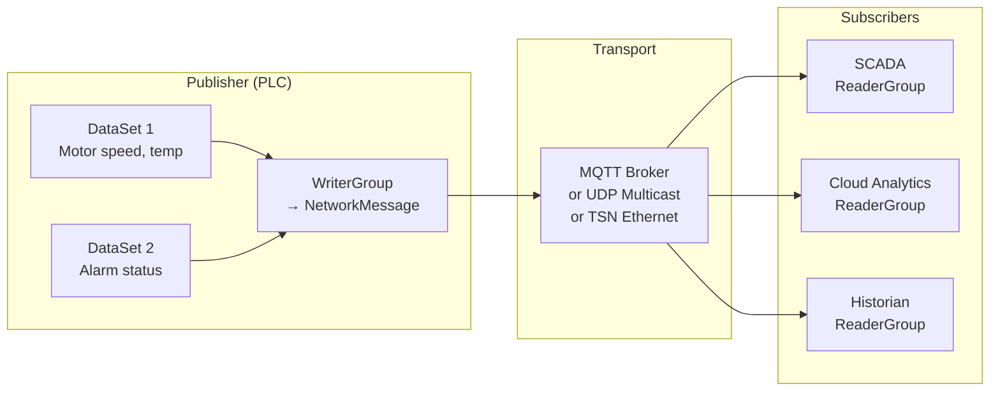
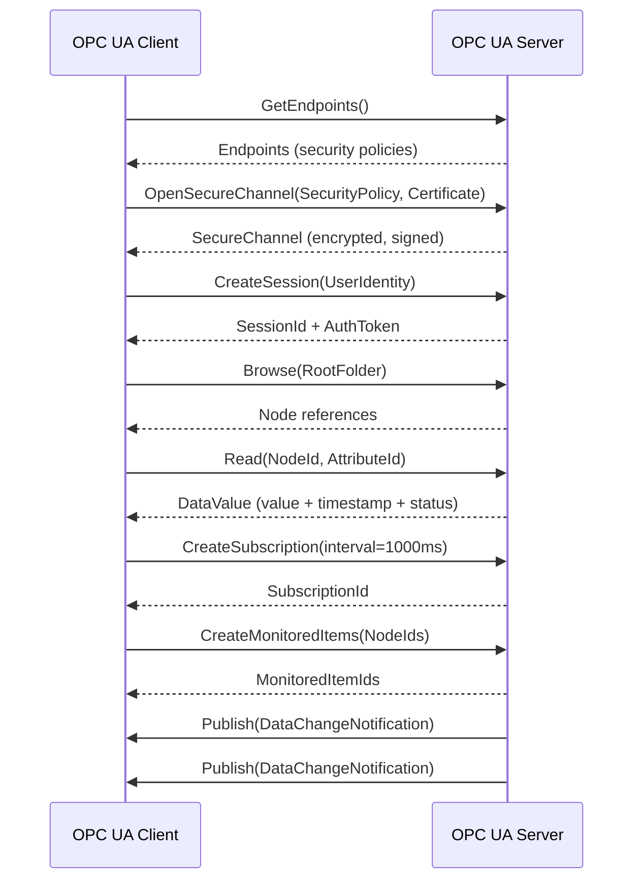

# OPC UA — Open Platform Communications Unified Architecture (IEC 62541)

**Topic:** OPC UA (Unified Architecture) — Complete Protocol Analysis  
**Standards:** IEC 62541-1 through 62541-100, OPC UA FX (Field Exchange), OPC 10000 series  
**SDO:** OPC Foundation (International)  
**Audience:** Automation architects, IIoT developers, SCADA engineers, system integrators, Industry 4.0 practitioners  
**Prerequisites:** Client-server architecture, XML/JSON basics, PKI/TLS, industrial protocol awareness

---

## Chapter 1 — Historical Context & Origin Story

### 1.1 From OPC Classic to OPC UA

| Year | Event |
|------|-------|
| 1996 | OPC DA (Data Access) — first OPC specification (Microsoft COM/DCOM) |
| 1998 | OPC HDA (Historical Data Access) + OPC A&E (Alarms & Events) |
| 2000 | OPC widely adopted (>20,000 products); DCOM security issues emerging |
| 2003 | OPC Foundation begins UA design (platform-independent replacement) |
| 2006 | OPC UA 1.0 specification released |
| 2008 | OPC UA SDK available (C, .NET, Java) |
| 2010 | IEC 62541 series published (international standard) |
| 2015 | OPC UA Pub/Sub specification (Part 14) |
| 2017 | OPC UA companion specifications proliferate (PackML, euromap, etc.) |
| 2019 | OPC UA over TSN demonstrations |
| 2020 | OPC UA FX (Field Exchange) — controller-to-controller, field level |
| 2022 | OPC UA CloudLib (cloud-based information model repository) |
| 2023 | OPC UA + 5G demonstrations; FX profiles for motion/safety |
| 2024 | OPC UA FX 1.0 published; TSN integration maturing |

### 1.2 Why OPC UA Was Created

| Problem with OPC Classic | OPC UA Solution |
|-------------------------|-----------------|
| Windows-only (COM/DCOM) | Platform-independent (Linux, embedded, cloud) |
| Security vulnerabilities (DCOM) | Built-in security (TLS, X.509 certificates, authentication) |
| No information modeling | Rich information model (semantic data + relationships) |
| Point-to-point only | Client-Server + Pub/Sub + Request/Reply |
| Difficult to configure | Discovery services, auto-configuration |
| No vertical integration | Cloud-to-sensor potential (field to enterprise) |
| Proprietary extensions everywhere | Standardized companion specifications |

---

## Chapter 2 — Standard Architecture & Structure

### 2.1 OPC UA Specification Structure (IEC 62541)

| Part | Title | Content |
|------|-------|---------|
| Part 1 | Overview and Concepts | Architecture overview |
| Part 2 | Security Model | Authentication, encryption, certificates |
| Part 3 | Address Space Model | Node classes, references, type system |
| Part 4 | Services | 37 services (read, write, subscribe, browse, etc.) |
| Part 5 | Information Model | Base types, object model, data types |
| Part 6 | Mappings | Transport bindings (TCP, HTTPS, WebSocket) |
| Part 7 | Profiles | Feature conformance units and profiles |
| Part 8 | Data Access | Real-time data access (DA successor) |
| Part 9 | Alarms & Conditions | Event notification (A&E successor) |
| Part 10 | Programs | Program/state machine modeling |
| Part 11 | Historical Access | Time-series data (HDA successor) |
| Part 12 | Discovery | GDS (Global Discovery Server) |
| Part 13 | Aggregates | Data aggregation (min, max, avg, etc.) |
| Part 14 | PubSub | Publish-Subscribe communication |
| Part 100 | Device Interface | Field device modeling (IO-Link, PROFINET) |

### 2.2 OPC UA Architecture Layers

```mermaid
graph TB
    subgraph "Application Layer"
        APP[Application<br/>Information Model<br/>(companion specs)]
    end
    
    subgraph "OPC UA Services Layer"
        DISC[Discovery<br/>Services]
        SESS[Session<br/>Services]
        NODE[NodeManagement<br/>Services]
        VIEW[View<br/>Services]
        QUERY[Query<br/>Services]
        ATTR[Attribute<br/>Services]
        METH[Method<br/>Services]
        MON[MonitoredItem<br/>Services]
        SUB[Subscription<br/>Services]
    end
    
    subgraph "Communication Layer"
        CS[Client-Server<br/>(request/response)]
        PS[Pub/Sub<br/>(one-to-many)]
    end
    
    subgraph "Transport Layer"
        TCP[OPC UA TCP<br/>(opc.tcp://)]
        HTTPS[HTTPS<br/>(https://)]
        WS[WebSocket<br/>(wss://)]
        MQTT_T[MQTT<br/>(pub/sub transport)]
        AMQP_T[AMQP<br/>(pub/sub transport)]
        UDP[UDP<br/>(multicast pub/sub)]
    end
    
    subgraph "Security Layer"
        SEC[Security Channel<br/>TLS 1.2/1.3<br/>X.509 Certificates<br/>Signing + Encryption]
    end
    
    APP --> DISC
    APP --> SESS
    APP --> ATTR
    APP --> SUB
    CS --> TCP
    CS --> HTTPS
    PS --> MQTT_T
    PS --> UDP
    TCP --> SEC
    HTTPS --> SEC
```

---

## Chapter 3 — Technical Deep Dive

### 3.1 Address Space (Information Model)

| Node Class | Description | Example |
|-----------|-------------|---------|
| Object | Container for variables and methods | TemperatureSensor |
| Variable | Data item (value + timestamp + quality) | Temperature = 72.5°F |
| Method | Callable function (with input/output arguments) | Reset(), Calibrate(offset) |
| ObjectType | Type definition for objects | TemperatureSensorType |
| VariableType | Type definition for variables | AnalogItemType |
| DataType | Data type definition | Float, String, CustomStruct |
| ReferenceType | Relationship between nodes | HasComponent, Organizes |
| View | Filtered subset of address space | OperatorView, MaintenanceView |

### 3.2 Reference Types

| Reference | Meaning | Example |
|-----------|---------|---------|
| HasComponent | Parent contains child | Machine HasComponent Motor |
| HasProperty | Attribute of node | Motor HasProperty SerialNumber |
| Organizes | Logical grouping | Folder Organizes Objects |
| HasTypeDefinition | Instance → Type | Motor1 HasTypeDefinition MotorType |
| HasSubtype | Type inheritance | BaseObjectType HasSubtype DeviceType |
| HasInterface | Implements interface | Motor HasInterface IMaintenanceType |

### 3.3 Security Model

| Layer | Mechanism |
|-------|-----------|
| Transport | TLS 1.2/1.3 (encryption + integrity) |
| Authentication (Application) | X.509 certificates (application instance certificate) |
| Authentication (User) | Username/password, X.509 user certificate, Kerberos token |
| Authorization | Role-based access control (RBAC) — per-node permissions |
| Auditing | Audit events logged for security-relevant operations |
| Certificate management | GDS (Global Discovery Server) — automated certificate lifecycle |

**Security Policies:**

| Policy | Encryption | Signature | Status |
|--------|-----------|-----------|--------|
| None | None | None | Testing only (NEVER production) |
| Basic128Rsa15 | 128-bit AES | RSA-SHA1 | Deprecated |
| Basic256 | 256-bit AES | RSA-SHA1 | Deprecated |
| Basic256Sha256 | 256-bit AES | RSA-SHA256 | Current (minimum recommended) |
| Aes128_Sha256_RsaOaep | 128-bit AES | RSA-SHA256 OAEP | Current |
| Aes256_Sha256_RsaPss | 256-bit AES | RSA-SHA256 PSS | Best practice |

### 3.4 Pub/Sub (Part 14)

| Concept | Description |
|---------|-------------|
| Publisher | Sends data to network (e.g., PLC publishing I/O data) |
| Subscriber | Receives data from network (e.g., HMI consuming values) |
| WriterGroup | Collection of datasets from one publisher |
| DataSetWriter | Maps specific data to network message |
| ReaderGroup | Subscriber configuration for receiving data |
| NetworkMessage | Wire format (UADP binary or JSON) |
| Transport | MQTT, AMQP, or UDP multicast |



### 3.5 OPC UA FX (Field Exchange)

| Feature | Detail |
|---------|--------|
| Purpose | OPC UA at field level (controller-to-controller, controller-to-device) |
| Transport | TSN Ethernet (deterministic), UDP pub/sub |
| Cycle time | <250μs (with TSN) |
| Connection types | Controller-to-Controller (C2C), Controller-to-Device (C2D) |
| Profiles | Base (non-real-time), Real-Time (TSN), Safety (future) |
| Vs. PROFINET/EtherCAT | Vendor-neutral alternative; same network for IT + OT data |

---

## Chapter 4 — Implementation Guide

### 4.1 OPC UA Stack Options

| Stack | Language | License | Use Case |
|-------|----------|---------|----------|
| open62541 | C | MPL 2.0 (open) | Embedded devices, PLCs |
| Eclipse Milo | Java | EPL 2.0 (open) | Enterprise, cloud |
| OPC Foundation .NET | C# | Commercial/GPL | Windows enterprise |
| FreeOpcUa | Python | LGPL | Prototyping, testing |
| node-opcua | Node.js | MIT | Edge gateways, web |
| Prosys SDK | Java/.NET | Commercial | Production-grade |
| Unified Automation | C/C++/.NET | Commercial | High-performance |
| S2OPC | C | Apache 2.0 | Safety/security certified |

### 4.2 Information Model Design

| Best Practice | Detail |
|---------------|--------|
| Use companion specs | Don't reinvent — use PackML, Euromap, PLCopen, DI |
| Type-first design | Define ObjectTypes before instances |
| Namespace separation | Your types in your namespace (ns=2+) |
| Minimal custom types | Extend standard types rather than creating from scratch |
| Semantic modeling | Use references to express relationships (not just folders) |
| Methods for actions | Use Methods (not variables) for operations |
| Events for notifications | Use Events (not polling) for state changes |
| Version management | Use ModelVersion + NodeVersion for change tracking |

### 4.3 Companion Specifications (Selected)

| Companion Spec | Domain | Key Content |
|---------------|--------|-------------|
| PackML (ISA-TR88) | Packaging machinery | State machine, OEE, unit control |
| Euromap 77/83 | Plastics/rubber | Injection molding machine interface |
| PLCopen | Motion control | Axes, groups, coordinated motion |
| MDIS | Subsea oil & gas | Valves, chokes, manifolds |
| IA (I4.0) | Asset Administration Shell | AAS ↔ OPC UA mapping |
| PADIM | Process industry | Device integration (replacing FDI) |
| MTConnect | CNC/machining | Machine tool monitoring |
| Robotics | Industrial robots | Robot interface (VDMA/OPC) |
| Weihenstephan | Food & beverage | Filling/packaging KPIs |
| CNC Systems | Machine tools | Tool, spindle, axis information |

---

## Chapter 5 — Certification & Compliance

### 5.1 OPC UA Certification

| Level | Requirement |
|-------|------------|
| Self-assessment | CTT (Compliance Test Tool) passed; vendor declares conformance |
| OPC Foundation certified | Tested at OPC Foundation test lab; listed in catalog |
| Full profile certification | All CUs in profile tested + interoperability verified |

### 5.2 Conformance Units (CU)

| Profile | Description | Minimum CUs |
|---------|-------------|-------------|
| Nano Embedded Device Server | Smallest (sensor gateway) | 7 CUs |
| Micro Embedded Device Server | Small embedded (IO module) | 15 CUs |
| Embedded UA Server | PLC/controller | 30+ CUs |
| Standard UA Server | Full-featured (HMI, SCADA) | 50+ CUs |
| Discovery Server | GDS/LDS | Discovery CUs |
| Pub/Sub | Publisher/Subscriber | Pub/Sub CUs |

### 5.3 Security Certification

| Aspect | Requirement |
|--------|------------|
| Security Policy | Must support at least Basic256Sha256 |
| Certificate validation | Must validate certificate chain, CRL/OCSP |
| Session security | Must enforce session timeout, max concurrent sessions |
| Audit | Must generate audit events for security operations |
| IEC 62443-4-2 | OPC UA components can be certified per SL |

---

## Chapter 6 — Regional & Domain Variants

| Region/Domain | OPC UA Usage |
|---------------|-------------|
| Germany (Industrie 4.0) | OPC UA is THE communication standard for I4.0 |
| China (Made in China 2025) | OPC UA adopted; Chinese companion specs |
| Japan (Connected Industries) | OPC UA + CC-Link IE TSN cooperation |
| USA (Smart Manufacturing) | CESMII/SMLC uses OPC UA for interoperability |
| Process industry | NAMUR (NOA concept: OPC UA as second channel) |
| Automotive | VW/BMW factory OPC UA backbone |
| Pharmaceutical | ISA-88/PackML companion spec for batch |
| Energy | IEC 61850 ↔ OPC UA mapping for substations |
| Building automation | BACnet ↔ OPC UA gateway (emerging) |

---

## Chapter 7 — Comparison: OPC UA vs Alternatives

| Dimension | OPC UA | MQTT | REST/HTTP | PROFINET | Modbus TCP |
|-----------|--------|------|-----------|----------|------------|
| Model | Rich information model | Topic-based (no model) | Resource-based | GSD/GSDML device model | Register-based (no model) |
| Security | Built-in (TLS, X.509, RBAC) | TLS (optional) | TLS/OAuth | v2.4+ (TLS) | None |
| Real-time | Via TSN (OPC UA FX) | No | No | IRT (250μs) | No |
| Discovery | Built-in (GDS, LDS) | None (broker knows) | None | DCP | None |
| Semantics | Full (types, references) | None (payload-agnostic) | Limited (schema) | Limited (GSD) | None (registers) |
| Interoperability | Cross-vendor by design | Payload is custom | API-defined | PROFINET-only | Universal (simple) |
| Complexity | High | Low | Low | Medium | Very low |
| Use case | Interop + security + model | Telemetry + IoT | Web + cloud | Field bus control | Legacy connectivity |
| Adoption | Growing rapidly | Ubiquitous (IoT) | Ubiquitous (web) | Manufacturing | Universal (legacy) |

---

## Chapter 8 — Mermaid Architecture Diagrams

### 8.1 OPC UA Client-Server Communication



### 8.2 OPC UA in Industrial Architecture

```mermaid
graph TB
    subgraph "Cloud"
        AZURE[Azure IoT Hub<br/>OPC UA Pub/Sub → MQTT]
        ANALYTICS[Analytics<br/>OPC UA Client]
    end
    
    subgraph "Edge"
        EDGE_GW[OPC UA Edge Gateway<br/>Aggregation Server<br/>Store & Forward]
    end
    
    subgraph "Plant Floor"
        PLC1[Siemens S7-1500<br/>OPC UA Server<br/>(built-in)]
        PLC2[Beckhoff TwinCAT<br/>OPC UA Server]
        ROBOT[KUKA Robot<br/>OPC UA Companion]
        LEGACY[Legacy PLC<br/>Modbus → OPC UA<br/>Gateway]
    end
    
    AZURE --> EDGE_GW
    ANALYTICS --> EDGE_GW
    EDGE_GW --> PLC1
    EDGE_GW --> PLC2
    EDGE_GW --> ROBOT
    EDGE_GW --> LEGACY
```

---

## Chapter 9 — Case Studies

### 9.1 Volkswagen — OPC UA Factory Backbone

| Aspect | Detail |
|--------|--------|
| Scope | 120+ factories worldwide |
| Use case | Unified machine communication (body shop, paint, assembly) |
| Before | Proprietary protocols per vendor; data silos |
| After | OPC UA as mandatory interface for all new equipment |
| Information model | VW-specific companion spec (extends PackML) |
| Benefits | 30% reduction in integration time; cross-plant analytics |
| Security | X.509 certificates, RBAC, TLS mandatory |

### 9.2 BMW — OPC UA + TSN for Production

| Aspect | Detail |
|--------|--------|
| Goal | Converged network for real-time control + IT data |
| Architecture | OPC UA Pub/Sub over TSN (IEEE 802.1) |
| Performance | <1ms communication for robot coordination |
| Benefit | Single Ethernet infrastructure (reduced cabling, simplified management) |
| Challenge | TSN switch availability, profile standardization |

---

## Chapter 10 — Future Evolution & Industry Trends

| Trend | Timeline | Description |
|-------|----------|-------------|
| OPC UA FX maturity | 2024-2026 | Field-level adoption (replacing proprietary fieldbuses) |
| OPC UA + TSN convergence | 2024+ | Deterministic Ethernet with OPC UA semantics |
| OPC UA Safety | 2025+ | Safety communication over OPC UA (PROFIsafe equivalent) |
| Quantum-safe OPC UA | 2027+ | Post-quantum algorithms for long-lifecycle OT |
| OPC UA + 5G | Growing | Wireless OPC UA with TSN-like guarantees |
| Edge computing | Now | OPC UA as edge aggregation layer |
| Digital twins | Growing | OPC UA information model as digital twin backbone |
| AI/ML integration | Emerging | Companion specs for AI model deployment |
| Asset Administration Shell | Growing | AAS (I4.0) fully based on OPC UA mapping |
| Simplified embedded | Growing | OPC UA Nano profile for constrained sensors |

---

## Chapter 11 — Interview Questions & Career Guide

### Tier 1: Entry-Level

**Q1:** What is OPC UA and what advantages does it offer over OPC Classic?  
**A:** **OPC UA (Unified Architecture)** is the modern industrial communication standard (IEC 62541) that replaces OPC Classic (DA, HDA, A&E). Key advantages: (1) **Platform-independent:** Runs on Windows, Linux, embedded RTOS, cloud — OPC Classic was Windows-only (COM/DCOM). (2) **Built-in security:** TLS encryption, X.509 certificate authentication, role-based access — OPC Classic used DCOM (known security issues). (3) **Rich information model:** Objects, types, references, methods — not just flat tag lists. Data has semantic meaning + relationships. (4) **Multiple transports:** TCP binary (fastest), HTTPS (firewall-friendly), WebSocket (web), MQTT/AMQP (pub/sub for IoT). (5) **Pub/Sub support:** One-to-many communication for scalable distribution — OPC Classic was only client-server. (6) **Companion specifications:** Standardized domain models (PackML for packaging, Euromap for plastics, etc.) — interoperability across vendors. (7) **Scalability:** From embedded sensors (Nano profile) to cloud enterprise systems on same infrastructure.

### Tier 2: Mid-Level

**Q2:** Design an OPC UA information model for a manufacturing cell with 3 CNC machines, one robot, and a conveyor.  
**A:** **Namespace:** `ns=2; uri=http://example.com/ManufacturingCell` **Type hierarchy:** BaseObjectType → DeviceType (from DI companion spec) → {CNCMachineType, RobotType, ConveyorType}. **CNCMachineType (extends DeviceType):** Variables: SpindleSpeed (AnalogItemType, RPM), FeedRate (AnalogItemType, mm/min), CurrentProgram (String), MachineState (PackML state machine: Idle/Execute/Held/Complete). Objects: ToolMagazine (contains Tool[] — each with ToolId, WearPercent, LifeRemaining), Axes[] (X, Y, Z, A, B — each with Position, Velocity, Torque). Methods: LoadProgram(programName), StartCycle(), StopCycle(), HomeAxes(). Events: AlarmEvent (severity, condition, acknowledgement). **RobotType:** Variables: JointPositions[6] (Float[]), TCPPose (Float[6] — x,y,z,rx,ry,rz), ProgramState. Methods: MoveTo(pose), GripperOpen(), GripperClose(). **ConveyorType:** Variables: Speed, Direction, PartPresent (Boolean). Methods: Start(), Stop(), SetSpeed(speed). **ManufacturingCellType:** HasComponent → CNC1 (CNCMachineType), CNC2, CNC3, Robot1 (RobotType), Conveyor1 (ConveyorType). HasProperty → CellId, Location, ShiftSchedule. Views: OperatorView (state, alarms), MaintenanceView (wear, diagnostics), ProductionView (OEE, counts). **Subscriptions:** SCADA subscribes to state changes (1000ms). MES subscribes to production events. Maintenance system subscribes to alarm events.

### Tier 3: Senior

**Q3:** Architect an OPC UA deployment for a multi-site manufacturing company with 50 plants, brownfield legacy equipment, cloud analytics, and IEC 62443 SL-3 security requirement.  
**A:** **1. Architecture pattern — Hierarchical aggregation:** Site level: OPC UA aggregation server per plant (connects to all local PLCs/devices). Regional level: OPC UA relay/gateway in regional data center (aggregates 5-10 sites). Cloud level: Cloud connector (Azure IoT Hub / AWS IoT SiteWise) — OPC UA Pub/Sub → MQTT/AMQP. **2. Brownfield integration:** Modern PLCs (Siemens S7-1500, Beckhoff, B&R): Built-in OPC UA server — direct connection. Legacy PLCs (S7-300, Allen-Bradley PLC5, Mitsubishi Q): OPC UA gateway appliance (e.g., Softing, Kepware) — protocol conversion (Modbus/PROFIBUS → OPC UA). Non-networked devices: IO-Link masters with OPC UA interface, or RTU with OPC UA gateway. **3. Information model strategy:** Enterprise-wide companion spec: Define company ObjectTypes for standard equipment categories. Inherit from existing companion specs (DI, PackML, PLCopen). NodeId naming convention: `ns=2; s=Plant01.Line03.CNC02.SpindleSpeed`. CloudLib: Register enterprise model in OPC UA CloudLib for version control. **4. Security (SL-3 per IEC 62443):** Certificate management: Enterprise GDS (Global Discovery Server) — automated certificate issuance/renewal. Application authentication: every OPC UA server/client has unique X.509 certificate (no shared certificates). User authentication: integration with corporate AD via Kerberos tokens. Authorization: RBAC — Operator (read + limited write), Engineer (full), Viewer (read-only). Encryption: Aes256_Sha256_RsPss minimum policy (no None or deprecated). Network: OPC UA traffic in dedicated VLAN; TLS even on internal network (zero trust). Audit: all security events logged to central SIEM; correlation across sites. **5. Pub/Sub for cloud analytics:** Each aggregation server publishes DataSets via OPC UA Pub/Sub → MQTT broker (per site). MQTT broker → cloud ingestion (encrypted, authenticated). DataSet definition: standardized across plants (same variable names, semantics). Benefits: decoupled from client connections; efficient for high-volume telemetry. **6. Availability (SL-3 FR7):** Redundant OPC UA servers (hot standby per site). Store-and-forward at edge (survives WAN outage). Redundant paths: primary + backup network links to regional center. **7. Governance:** Central OPC UA team: owns information model, security policies, compliance. Per-site OT team: manages local connectivity, gateway configuration. Change management: model version control via ModelVersion node; staged rollout.

---

## Chapter 12 — Cheat Sheet & Quick Reference

### OPC UA Communication Patterns

```
Client-Server:    Request/Response (browse, read, write, call, subscribe)
Pub/Sub:          One-to-many (publisher sends, subscribers receive)
Pub/Sub + MQTT:   Via broker (internet-scale, cloud-friendly)
Pub/Sub + UDP:    Multicast (low-latency, local network)
Pub/Sub + TSN:    Deterministic Ethernet (field-level, <250μs)
```

### Node Classes

```
Object:        Container (folder-like, has components)
Variable:      Data point (value + timestamp + quality)
Method:        Callable function (input/output args)
ObjectType:    Type definition for Objects
VariableType:  Type definition for Variables
DataType:      Custom data structures
ReferenceType: Relationship definitions
View:          Filtered address space subset
```

### Security Quick Reference

```
Transport:        TLS 1.2+ (always encrypted in production)
App auth:         X.509 application certificates (mutual)
User auth:        Username/pwd, X.509 user cert, Kerberos, JWT
Authorization:    RBAC (roles map to node permissions)
Minimum policy:   Basic256Sha256 (never None in production)
Best policy:      Aes256_Sha256_RsaPss
Certificate mgmt: GDS (Global Discovery Server) for automation
Audit:            Enabled for all security events
```

### Key OPC UA Services

```
Discovery:    FindServers, GetEndpoints
Session:      CreateSession, ActivateSession, CloseSession
Browse:       Browse, BrowseNext, TranslateBrowsePaths
Read/Write:   Read, Write, HistoryRead, HistoryUpdate
Subscribe:    CreateSubscription, CreateMonitoredItems, Publish
Method:       Call (invoke server-side methods)
```

### OPC UA vs OPC Classic

```
                OPC Classic         OPC UA
Platform:       Windows only        Any (Linux, embedded, cloud)
Security:       DCOM (broken)       TLS + X.509 + RBAC
Model:          Flat tags           Rich semantic model
Transport:      DCOM RPC            TCP/HTTPS/WS/MQTT/UDP
Communication:  Client-Server       Client-Server + Pub/Sub
Extensibility:  Vendor-proprietary  Companion specifications
Certification:  Limited             OPC Foundation CTT
```

---

*End of Document — 02_OPC_UA_IEC_62541.md*
