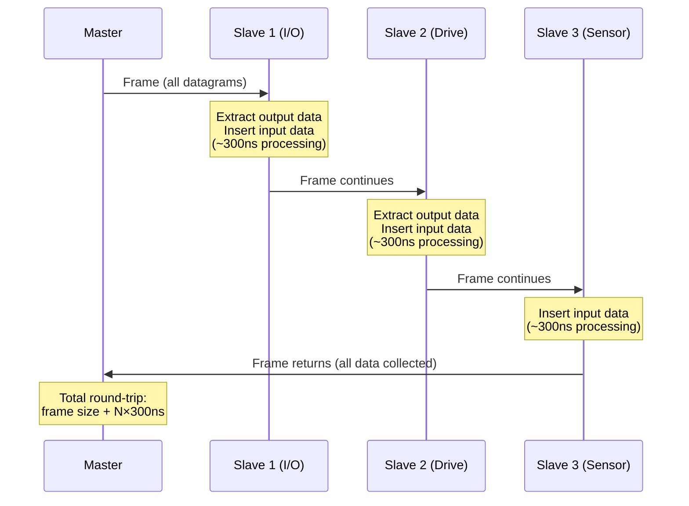
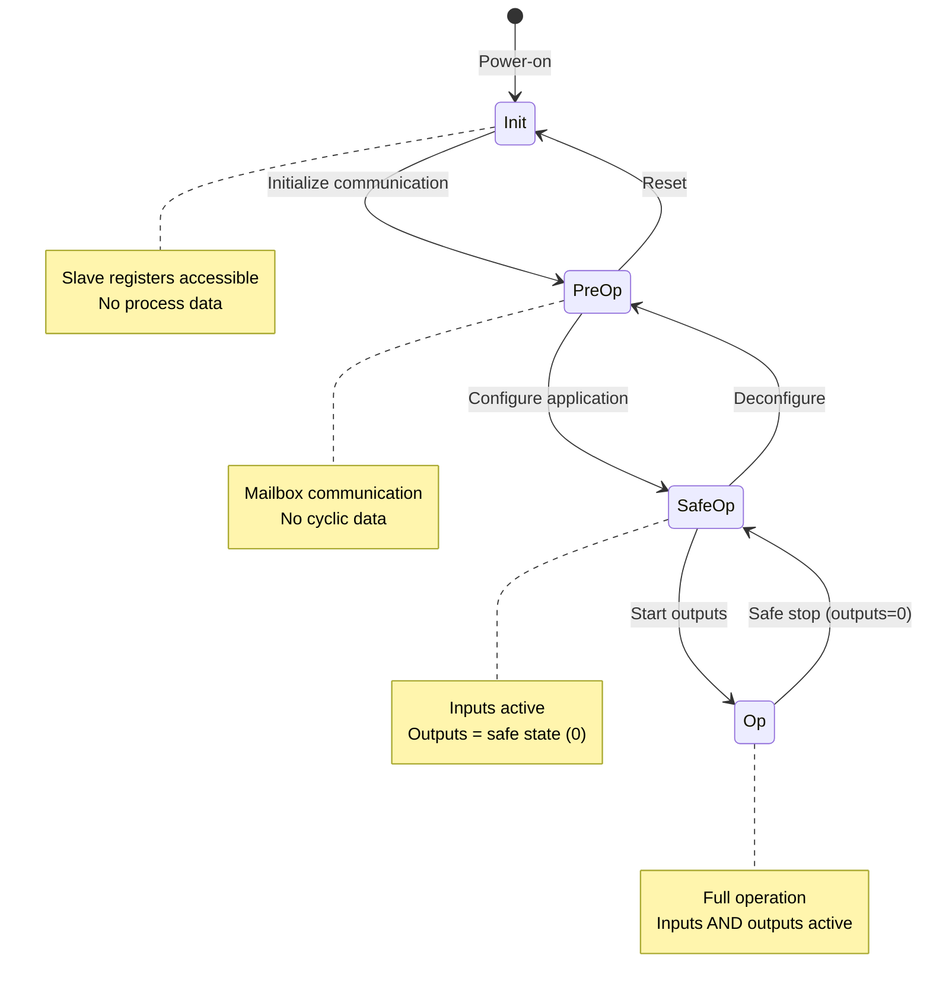

# PROFINET & EtherCAT — Industrial Real-Time Ethernet

**Topic:** PROFINET (IEC 61784-2 CP 3/4), EtherCAT (IEC 61784-2 Type 12) — Complete Protocol Analysis  
**Standards:** IEC 61158, IEC 61784-2, IEC 61784-3 (safety), PROFINET specification V2.4, EtherCAT (ETG specifications)  
**SDO:** PI (PROFIBUS & PROFINET International), ETG (EtherCAT Technology Group)  
**Audience:** Automation engineers, control system designers, motion control engineers, network architects  
**Prerequisites:** Ethernet fundamentals, real-time concepts, PLC programming basics, OSI model

---

## Chapter 1 — Historical Context & Origin Story

### 1.1 PROFINET Evolution

| Year | Event |
|------|-------|
| 1989 | PROFIBUS DP specification (predecessor) |
| 1999 | PROFINET concept announced by Siemens/PI |
| 2003 | PROFINET V1.0 — based on TCP/IP (CBA concept) |
| 2004 | PROFINET IO — real-time class 1 (RT) |
| 2005 | PROFINET IRT (Isochronous Real-Time) — class 3 |
| 2007 | IEC 61158/61784 inclusion |
| 2010 | PROFINET dominates European market |
| 2014 | PROFINET with TSN (research begins) |
| 2019 | PROFINET over TSN specification |
| 2023 | 50 million PROFINET nodes installed |
| 2024 | PROFINET V2.4MU4 (security, TSN integration) |

### 1.2 EtherCAT Evolution

| Year | Event |
|------|-------|
| 2003 | EtherCAT introduced by Beckhoff at Hannover Messe |
| 2004 | EtherCAT Technology Group (ETG) founded |
| 2005 | IEC standardization begins |
| 2007 | IEC 61158 / IEC 61784-2 Type 12 published |
| 2010 | FSoE (Functional Safety over EtherCAT) certified |
| 2012 | EtherCAT P (power + data on one cable) |
| 2014 | EtherCAT G (1 Gbps) specification |
| 2019 | 6,000+ ETG member companies |
| 2023 | EtherCAT G implementation devices available |
| 2024 | EtherCAT dominant in motion control globally |

---

## Chapter 2 — Standard Architecture & Structure

### 2.1 PROFINET Architecture

```mermaid
graph TB
    subgraph "PROFINET Classes"
        subgraph "NRT (Non-Real-Time)"
            NRT_D[Standard TCP/IP<br/>HTTP, FTP, SNMP<br/>Configuration, diagnostics]
        end
        
        subgraph "RT (Real-Time, Class 1)"
            RT_D[PROFINET RT<br/>Cycle: 1-10 ms<br/>Priority-based scheduling<br/>VLAN 802.1Q tagging<br/>Standard switches OK]
        end
        
        subgraph "IRT (Isochronous RT, Class 3)"
            IRT_D[PROFINET IRT<br/>Cycle: 250 μs min<br/>Reserved time slots<br/>Hardware synchronization<br/>Special ASIC/FPGA needed]
        end
    end
    
    subgraph "Device Model"
        IO_CTRL[IO Controller<br/>(PLC)]
        IO_DEV[IO Device<br/>(field device)]
        IO_SUP[IO Supervisor<br/>(engineering tool)]
    end
    
    IO_CTRL --> IO_DEV
    IO_SUP --> IO_CTRL
    IO_SUP --> IO_DEV
```

### 2.2 EtherCAT Architecture

```mermaid
graph LR
    subgraph "EtherCAT Topology"
        MASTER[EtherCAT Master<br/>(controller/PC)]
        S1[Slave 1<br/>I/O Module]
        S2[Slave 2<br/>Servo Drive]
        S3[Slave 3<br/>Sensor]
        S4[Slave 4<br/>I/O Module]
    end
    
    MASTER -->|"Frame passes through<br/>each slave (process on fly)"| S1
    S1 --> S2
    S2 --> S3
    S3 --> S4
    S4 -->|"Frame returns to master"| MASTER
```

### 2.3 Comparison at Architecture Level

| Aspect | PROFINET | EtherCAT |
|--------|----------|----------|
| OSI Layer 2 | Modified Ethernet (EtherType 0x8892) | Modified Ethernet (EtherType 0x88A4) |
| Processing | Store-and-forward (switches) | Processing on the fly (slaves) |
| Topology | Star, line, ring, tree | Line (logical ring), tree (branches) |
| Infrastructure | Managed switches (IRT needs special) | No switches needed (slaves are infrastructure) |
| Master | PLC (Siemens, etc.) | Any PC or embedded controller |
| Clock sync | PTCP (Precision Transparent Clock Protocol) | Distributed Clocks (DC) |
| Configuration | GSDML (XML device description) | ESI (EtherCAT Slave Information, XML) |

---

## Chapter 3 — Technical Deep Dive

### 3.1 PROFINET RT Frame

| Field | Size | Content |
|-------|------|---------|
| Destination MAC | 6 bytes | Multicast or unicast |
| Source MAC | 6 bytes | Sender MAC |
| VLAN Tag (802.1Q) | 4 bytes | Priority 6 (RT), VLAN ID |
| EtherType | 2 bytes | 0x8892 (PROFINET) |
| FrameID | 2 bytes | Identifies data relationship |
| User Data | Variable | Process data (I/O) |
| Cycle Counter | 2 bytes | Sequence tracking |
| Data Status | 1 byte | Valid/invalid, run/stop |
| Transfer Status | 1 byte | Provider/consumer status |

### 3.2 PROFINET IRT Mechanism

| Concept | Detail |
|---------|--------|
| Time slots | Communication cycle divided into IRT phase + RT/NRT phase |
| IRT phase | Reserved bandwidth for deterministic traffic (guaranteed delivery) |
| RT/NRT phase | Standard Ethernet traffic (best-effort within remaining bandwidth) |
| Synchronization | PTCP: sub-μs synchronization across all devices |
| Hardware requirement | ERTEC ASIC (Siemens), FPGA, or TPS-1 (TI) in every switch port |
| Forwarding | Cut-through at bit level (minimal latency per hop) |

### 3.3 EtherCAT Frame Processing

| Concept | Detail |
|---------|--------|
| Processing on the fly | Slaves read/insert data while frame passes through (no buffering) |
| Datagram types | LRD (logical read), LWR (logical write), LRW (logical read/write) |
| Logical addressing | 4GB logical address space mapped to physical slave memory |
| FMMU | Fieldbus Memory Management Unit — maps logical↔physical addresses |
| SyncManager | Controls data exchange between EtherCAT and slave application |
| Distributed Clocks | Hardware timestamp in every slave (< 1μs jitter) |
| Frame efficiency | One Ethernet frame addresses ALL slaves (no per-device overhead) |
| Processing delay | ~300ns per slave (wire passes through, data extracted in hardware) |

### 3.4 Performance Comparison

| Metric | PROFINET RT | PROFINET IRT | EtherCAT |
|--------|-------------|--------------|----------|
| Min cycle time | 1 ms | 250 μs | 12.5 μs |
| Jitter | ~100 μs | < 1 μs | < 1 μs |
| Typical cycle (100 axes) | 4 ms | 1 ms | 250 μs |
| Bandwidth efficiency | ~50% (switch overhead) | ~60% | ~90% (processing on fly) |
| Max data per cycle | Limited by switch buffering | Time-slot constrained | ~1,486 bytes/frame (multiple frames OK) |
| Sync accuracy | ~1 ms (RT) / ~100 ns (IRT) | <100 ns | <100 ns (DC) |
| Nodes (practical) | 256 per controller | 256 per controller | 65,535 per master |

### 3.5 Safety Protocols

| Feature | PROFIsafe | FSoE (EtherCAT Safety) |
|---------|-----------|----------------------|
| Standard | IEC 61784-3-3 | IEC 61784-3-12 |
| Safety level | SIL 3, Cat 4, PLe | SIL 3, Cat 4, PLe |
| Principle | Black channel (safety layer over PROFINET) | Black channel (safety layer over EtherCAT) |
| CRC | 24-bit CRC (safety data) | 16-bit CRC + sequence counter |
| Watchdog | Configurable timeout | Configurable timeout |
| Connection monitoring | Consecutive number + time monitoring | Connection ID + watchdog |
| Residual error | < 10⁻⁸ per hour (SIL 3) | < 10⁻⁸ per hour (SIL 3) |
| Certification | TÜV certified | TÜV certified |

---

## Chapter 4 — Implementation Guide

### 4.1 PROFINET Implementation

| Step | Activity |
|------|----------|
| 1 | Select hardware: ERTEC 200P (ASIC) or FPGA for IRT; standard NIC for RT |
| 2 | Create GSDML file (XML device description) |
| 3 | Implement PROFINET stack (Siemens V5.x stack, or Hilscher, Phoenix, etc.) |
| 4 | Define I/O data format (modules, submodules, parameter records) |
| 5 | Implement application interface (cyclic data exchange, alarms) |
| 6 | Test with Siemens TIA Portal or equivalent IO Controller |
| 7 | PI certification testing (Automated RT Tester — ART) |
| 8 | Submit for PI certification (mandatory for logo use) |

### 4.2 EtherCAT Implementation

| Step | Activity |
|------|----------|
| 1 | Select EtherCAT slave controller (ET1100, LAN9252, AX58100, FPGA) |
| 2 | Define PDO mapping (Process Data Objects — input/output data) |
| 3 | Create ESI file (EtherCAT Slave Information — XML) |
| 4 | Implement slave firmware (state machine: Init→PreOp→SafeOp→Op) |
| 5 | Implement application logic (data processing, I/O handling) |
| 6 | Test with TwinCAT, CODESYS, or open-source master (SOEM, IgH) |
| 7 | ETG conformance testing (mandatory for trademark use) |

### 4.3 Choosing Between PROFINET and EtherCAT

| Use Case | Recommendation | Reason |
|----------|---------------|--------|
| High-speed motion (servo, CNC) | EtherCAT | Fastest cycle, best jitter, no switch cost |
| Mixed automation (process + discrete) | PROFINET | Flexible topology, coexists with IT |
| Siemens TIA ecosystem | PROFINET | Native integration, single tool |
| Multi-vendor motion | EtherCAT | Widest drive support, open master |
| Process control + safety | PROFINET + PROFIsafe | Process industry standard |
| Semiconductor/packaging | EtherCAT | Ultra-fast, deterministic, cost-effective |
| Existing PROFIBUS brownfield | PROFINET | PROFIBUS/PROFINET proxy gateway |
| PC-based control (Beckhoff, TwinCAT) | EtherCAT | Native support, best performance |

---

## Chapter 5 — Certification & Testing

### 5.1 PROFINET Certification

| Level | Requirement |
|-------|------------|
| Conformance Class A (CC-A) | Basic PROFINET RT (no IRT) |
| Conformance Class B (CC-B) | RT + diagnostic, topology detection |
| Conformance Class C (CC-C) | IRT (isochronous real-time) |
| Conformance Class D (CC-D) | PROFINET over TSN |
| PROFIsafe | Additional safety certification (TÜV) |
| NetLoad Class | I, II, III (network stress resistance) |

**Testing tools:** PI ART (Automated RT Tester), Siemens PRONETA, Wireshark (PROFINET dissector)

### 5.2 EtherCAT Certification

| Level | Requirement |
|-------|------------|
| ETG Conformance Test | Mandatory for trademark use |
| EtherCAT Test Center | Official testing at ETG-approved labs |
| FSoE certification | Additional TÜV certification for safety devices |
| EtherCAT P | Additional testing for power + data |

**Testing tools:** ETG Conformance Test Tool (CTT), EtherCAT Master Class 2 for diagnostics, Wireshark (EtherCAT dissector)

---

## Chapter 6 — Regional & Domain Variants

| Region | Dominant Protocol | Notes |
|--------|-------------------|-------|
| Germany | PROFINET (60%+) | Siemens dominance; PI headquartered in Karlsruhe |
| Europe (general) | PROFINET + EtherCAT | Strong in automotive, packaging |
| North America | EtherNet/IP (Rockwell) + EtherCAT | EtherCAT growing in motion |
| Japan | CC-Link IE + EtherCAT | MECHATROLINK declining; EtherCAT strong in semiconductor |
| China | PROFINET + EtherCAT | Both growing; government push for domestics |
| Korea | EtherCAT | Samsung, SK Hynix semiconductor fabs |
| Semiconductor | EtherCAT (dominant) | SEMI standards reference EtherCAT |
| Packaging | EtherCAT + PROFINET | High-speed motion favors EtherCAT |
| Automotive (factory) | PROFINET | Body shop, paint shop (Siemens TIA) |
| Machine tools (CNC) | EtherCAT + PROFINET | Depends on controller vendor |
| Robotics | EtherCAT (internal) | Internal robot bus; PROFINET external I/O |

---

## Chapter 7 — Comparison: PROFINET vs EtherCAT vs EtherNet/IP

| Dimension | PROFINET | EtherCAT | EtherNet/IP |
|-----------|----------|----------|-------------|
| Organization | PI (~1,700 members) | ETG (~6,400 members) | ODVA (~600 members) |
| Real-time method | Priority (RT) / Scheduling (IRT) | Processing on the fly | CIP Sync (IEEE 1588) |
| Switch requirement | Standard (RT), Special (IRT) | None (slaves ARE infrastructure) | Standard managed switches |
| Min cycle time | 250 μs (IRT) / 1 ms (RT) | 12.5 μs | ~500 μs (CIP Sync) |
| Jitter | <1 μs (IRT) / ~100 μs (RT) | <1 μs | ~μs level (1588) |
| Topology | Star, line, ring, tree | Line, tree (star via junctions) | Star, tree (any Ethernet) |
| Safety | PROFIsafe (SIL 3) | FSoE (SIL 3) | CIP Safety (SIL 3) |
| Motion | PROFIdrive | Distributed Clocks + CoE | CIP Motion |
| Configuration | GSDML (XML) | ESI (XML) | EDS (text/XML) |
| Vendor | Siemens-led | Beckhoff-originated | Rockwell/ODVA-led |
| Open master | Limited (paid stacks) | Open-source (SOEM, IgH EtherLab) | Limited |
| Market (2023) | #1 Industrial Ethernet (38%) | #2 Industrial Ethernet (21%) | #3 Industrial Ethernet (17%) |
| TSN roadmap | PROFINET over TSN (native) | EtherCAT G (separate approach) | EtherNet/IP over TSN |

---

## Chapter 8 — Mermaid Architecture Diagrams

### 8.1 PROFINET IRT Time Division

```mermaid
gantt
    title PROFINET Communication Cycle (1ms example)
    dateFormat X
    axisFormat %L

    section IRT Phase
    IRT Slot 1 (Servo) :0, 125
    IRT Slot 2 (Drive) :125, 250
    IRT Slot 3 (Safety) :250, 375

    section RT Phase
    RT Data (I/O modules) :375, 625
    
    section Open Phase
    TCP/IP (diagnostics, config) :625, 1000
```



### 8.2 EtherCAT Frame Flow



### 8.3 EtherCAT State Machine



---

## Chapter 9 — Case Studies

### 9.1 KUKA Robotics — EtherCAT Internal Bus

| Aspect | Detail |
|--------|--------|
| Application | KR C5 robot controller internal servo communication |
| Why EtherCAT | 6 axes @ 250μs cycle → EtherCAT only option for jitter <1μs |
| Architecture | EtherCAT master in controller, slaves in each axis drive |
| Performance | 125 μs cycle time, 6 axes synchronized within 100 ns |
| Safety | FSoE for safe torque off, safe stop, safe reduced speed |
| Benefit | Reduced cabling (one Ethernet cable per arm segment) |

### 9.2 Volkswagen Body Shop — PROFINET

| Aspect | Detail |
|--------|--------|
| Application | Body-in-White (BIW) welding line, 200+ robots |
| Architecture | Siemens S7-1500 PLCs, PROFINET RT for I/O, SCALANCE switches |
| Scale | 2,000+ PROFINET devices per line |
| Diagnostics | Full topology view, device replacement without engineering |
| Safety | PROFIsafe for emergency stop, light curtains, safe motion |
| Integration | OPC UA uplink to MES; PROFINET at field level |

---

## Chapter 10 — Future Evolution & Industry Trends

| Trend | PROFINET | EtherCAT |
|-------|----------|----------|
| TSN | PROFINET over TSN (converged network) | EtherCAT G (1 Gbps, parallel with TSN) |
| Speed | 1 Gbps (TSN-based) | EtherCAT G (1 Gbps), EtherCAT G10 (10 Gbps research) |
| Security | TLS, certificates, OPC UA integration | EAP (EtherCAT Automation Protocol) improvements |
| APL (2-wire Ethernet) | PROFINET via APL (process industry) | Not applicable (APL is process-focused) |
| OPC UA integration | OPC UA server in every PROFINET device (growing) | OPC UA over EtherCAT (mailbox-based) |
| AI/Edge | PROFINET + edge computing (Siemens Industrial Edge) | TwinCAT AI (Beckhoff ML on EtherCAT) |
| Wireless | 5G URLLC for PROFINET (pilot projects) | Not primary focus (wired strength) |

---

## Chapter 11 — Interview Questions & Career Guide

### Tier 1: Entry-Level

**Q1:** Explain the difference between PROFINET RT and PROFINET IRT.  
**A:** **PROFINET RT (Real-Time, Conformance Class B):** Uses standard Ethernet switches with IEEE 802.1Q VLAN priority tagging (priority 6). Frames are prioritized over normal traffic but NOT scheduled. Achieves 1-10ms cycle times with ~100μs jitter. Standard managed switches work fine. Good for: general factory I/O, temperature, pressure, discrete control. **PROFINET IRT (Isochronous Real-Time, Conformance Class C):** Uses TIME-SCHEDULED communication. The cycle is divided into reserved IRT slots (guaranteed bandwidth, zero contention) and open phases (for RT + TCP/IP). Requires SPECIAL hardware in switches and devices (ERTEC ASIC, FPGA with PROFINET IP). Achieves 250μs minimum cycle with <1μs jitter. All devices synchronized via PTCP. Good for: motion control (servos), printing presses, high-speed packaging. **Key difference:** RT relies on priority (might be delayed by other traffic); IRT reserves time slots (guaranteed delivery regardless of other traffic). RT uses standard switches; IRT needs special ASIC-equipped switches.

### Tier 2: Mid-Level

**Q2:** How does EtherCAT achieve such low cycle times compared to other Industrial Ethernet protocols?  
**A:** **EtherCAT's speed comes from 3 key innovations:** (1) **Processing on the fly:** Unlike store-and-forward (PROFINET/EtherNet/IP switches buffer entire frame), EtherCAT slaves read/write data WHILE the frame passes through the slave's Ethernet port. Each slave adds only ~300ns delay (vs ~5-10μs for a switch). For 100 slaves: EtherCAT = 30μs total processing delay; Switch-based = 500μs-1ms. (2) **Single frame addresses all slaves:** One Ethernet frame contains datagrams for ALL slaves. Master sends one frame → it passes through every slave in sequence → returns with all input data collected. Other protocols: need separate frames per device (or per group), multiplied by switch latency. (3) **Distributed Clocks (DC):** Each slave has a hardware clock synchronized to <100ns accuracy. Outputs are applied simultaneously across all slaves at a precise timestamp, regardless of frame arrival time. No need to schedule per-device delivery. **Performance math example (32 servo drives, 8 bytes each):** Frame size: 14 (Eth header) + 2 (EtherCAT header) + 32 × (12 + 8) (datagrams) = 656 bytes. Wire time @ 100Mbps: 656 × 8 / 100M = 52.5μs. Processing: 32 × 300ns = 9.6μs. Total round-trip: ~62μs → can run at 100μs cycle time easily. Compare PROFINET IRT: 32 devices × scheduled slots = minimum ~250μs cycle.

### Tier 3: Senior

**Q3:** Design a high-performance multi-axis motion control system (64 axes, 125μs cycle, SIL 3 safety) — justify protocol choice and architecture.  
**A:** **Protocol choice: EtherCAT** — only protocol that achieves 125μs with 64 axes + safety within one cycle. PROFINET IRT maxes at 250μs for this scale; EtherNet/IP cannot achieve this determinism. **Architecture:** Master: Industrial PC (Beckhoff CX2040 or equivalent, Intel Core i7, TwinCAT 3.1 real-time). Network: Single EtherCAT segment — 64 servo drives (Beckhoff AX5000 or equivalent) in line topology. Each drive: position/velocity/torque command (12 bytes out) + actual position/velocity/torque/status (16 bytes in) = 28 bytes/axis. Total process data: 64 × 28 = 1,792 bytes. Frame size: ~1,850 bytes (with headers). Wire time: 1850 × 8 / 100Mbps = 148μs. With 64 × 300ns processing: +19.2μs. Total: ~167μs. Problem: >125μs. **Solution:** Use 2 EtherCAT frames per cycle (split into 2 datagrams of 32 axes each), or use EtherCAT with 2 ports (faster processing) or EtherCAT G (1 Gbps) → wire time drops to 14.8μs. With EtherCAT G: total ~34μs, well within 125μs. **Safety (FSoE):** Safety function: Safe Torque Off (STO), Safe Stop 1 (SS1), Safely-Limited Speed (SLS) per axis. FSoE piggybacks on standard EtherCAT (black channel). Safety PLC: Beckhoff EL6910 (TwinSAFE) or dedicated safety controller. Safety communication within same 125μs cycle (no separate network). Watchdog: 10× cycle time (1.25ms) — if missed → safe state. Residual error rate: <10⁻⁸/h (SIL 3 requirement met). **Distributed Clocks configuration:** DC reference clock: first slave in chain. Sync pulse: every 125μs (SYNC0). All 64 drives apply output simultaneously at SYNC0 edge (<100ns skew). Position interpolation: drives interpolate between 125μs command updates internally. **Diagnostic architecture:** TwinCAT Scope (real-time data recording). EtherCAT diagnostics: CRC errors, lost frames, slave status (per port). Redundancy option: cable redundancy (ring topology via master's second port). **Development approach:** (1) Start at 1ms cycle, verify all 64 axes stable. (2) Reduce to 500μs, verify jitter. (3) Reduce to 125μs, optimize master scheduling. (4) Add FSoE, verify safety response time. (5) Load test: induce worst-case motion profiles + safety trigger simultaneously.

---

## Chapter 12 — Cheat Sheet & Quick Reference

### PROFINET Classes

```
NRT:  Standard TCP/IP traffic (config, diagnostics) — no guarantee
RT:   Priority-tagged frames — 1-10ms cycle — standard switches
IRT:  Time-scheduled slots — 250μs min — special hardware required
TSN:  PROFINET over TSN — converged network (future standard)
```

### EtherCAT Key Concepts

```
Processing on the fly:  Frame passes through slaves without buffering
Distributed Clocks:     Hardware sync <100ns across all slaves
FMMU:                   Logical↔physical address mapping
SyncManager:            Data exchange control (slave↔application)
State Machine:          Init → PreOp → SafeOp → Op
PDO:                    Process Data Object (cyclic I/O)
SDO:                    Service Data Object (parameter access, mailbox)
CoE:                    CANopen over EtherCAT (object dictionary)
```

### Quick Protocol Selection

```
Need <100μs cycle + motion?     → EtherCAT
Need Siemens TIA integration?   → PROFINET (RT or IRT)
Need flexible topology?         → PROFINET RT (any Ethernet switch)
Need lowest cost per node?      → EtherCAT (no switches)
Need process + discrete mix?    → PROFINET RT
Need SIL 3 safety?             → PROFIsafe OR FSoE (both SIL 3)
Need open-source master?        → EtherCAT (SOEM / IgH EtherLab)
```

### Market Share (2023 Industrial Ethernet)

```
PROFINET:      38% (#1)
EtherNet/IP:   17% (#2)  (Note: some sources swap #2/#3)
EtherCAT:      21% (#2 or #3 by source)
Modbus TCP:     5%
POWERLINK:      4%
CC-Link IE:     3%
Others:        12%
```

---

*End of Document — 03_PROFINET_EtherCAT.md*
