# Time-Sensitive Networking (TSN) — IEEE 802.1

**Topic:** TSN (Time-Sensitive Networking) — IEEE 802.1 Standards for Deterministic Ethernet  
**Standards:** IEEE 802.1AS-2020, 802.1Qbv, 802.1Qav, 802.1Qbu, 802.1Qcc, 802.1CB, 802.1Qch, 802.1CM  
**SDO:** IEEE 802.1 Working Group (TSN Task Group)  
**Audience:** Network architects, industrial automation engineers, automotive Ethernet designers, 5G engineers  
**Prerequisites:** Ethernet switching, QoS concepts, time synchronization, real-time system requirements

---

## Chapter 1 — Historical Context & Origin Story

### 1.1 From AVB to TSN

| Year | Event |
|------|-------|
| 2005 | IEEE 802.1 Audio/Video Bridging (AVB) Task Group formed |
| 2009 | IEEE 802.1Qav (Credit-Based Shaper for AV streams) |
| 2011 | IEEE 802.1AS (generalized Precision Time Protocol — gPTP) |
| 2012 | AVB Task Group renamed to TSN Task Group (scope expanded) |
| 2014 | Industrial interest: OPC Foundation + IEEE begin collaboration |
| 2015 | IEEE 802.1Qbv (Time-Aware Shaper — scheduled traffic) |
| 2016 | IEEE 802.1Qbu (Frame Preemption) |
| 2017 | IEEE 802.1CB (Frame Replication & Elimination for Reliability) |
| 2018 | IEEE 802.1Qcc (Stream Reservation Protocol enhancements) |
| 2018 | IEEE 802.1CM (TSN for Fronthaul — 5G Open RAN) |
| 2020 | IEEE 802.1AS-2020 (revised gPTP — hot standby, multiple domains) |
| 2021 | TSN + OPC UA demonstrations at industrial trade shows |
| 2022 | First TSN industrial switches commercially available |
| 2023 | CC-Link IE TSN deployed; automotive TSN accelerating |
| 2024 | PROFINET over TSN, EtherNet/IP over TSN maturing |

### 1.2 Why TSN Was Created

| Problem | TSN Solution |
|---------|-------------|
| Standard Ethernet is best-effort | Deterministic, bounded latency with TSN shapers |
| Separate networks for each protocol (PROFINET, EtherCAT, etc.) | Converged network: IT + OT on same wire |
| Proprietary real-time mechanisms | Open IEEE standard, multi-vendor interoperable |
| No standard time synchronization for industry | gPTP (802.1AS) provides sub-μs sync |
| No redundancy without proprietary protocols | 802.1CB provides seamless redundancy |
| Audio/video needs bounded latency | Originally solved for A/V, extended to industry |

---

## Chapter 2 — Standard Architecture & Structure

### 2.1 TSN Standards Map

```mermaid
graph TB
    subgraph "Time Synchronization"
        AS[IEEE 802.1AS-2020<br/>gPTP<br/>Generalized Precision<br/>Time Protocol]
    end
    
    subgraph "Traffic Shaping (Scheduling)"
        QBV[IEEE 802.1Qbv<br/>Time-Aware Shaper<br/>(TAS: gate schedules)]
        QAV[IEEE 802.1Qav<br/>Credit-Based Shaper<br/>(CBS: bandwidth reservation)]
        QBU[IEEE 802.1Qbu<br/>Frame Preemption<br/>(express vs preemptable)]
        QCH[IEEE 802.1Qch<br/>Cyclic Queuing &<br/>Forwarding]
    end
    
    subgraph "Reliability"
        CB[IEEE 802.1CB<br/>Frame Replication &<br/>Elimination (FRER)]
        QCI[IEEE 802.1Qci<br/>Per-Stream Filtering<br/>& Policing (PSFP)]
    end
    
    subgraph "Configuration"
        QCC[IEEE 802.1Qcc<br/>Stream Reservation<br/>(centralized/distributed/hybrid)]
        YANG[IEEE 802.1Qcp<br/>YANG Data Models<br/>(NETCONF/RESTCONF)]
    end
    
    subgraph "Profiles"
        CM[IEEE 802.1CM<br/>TSN for Fronthaul<br/>(5G)]
        DP[IEEE 802.1DP<br/>TSN for Automotive<br/>(in-vehicle)]
        DG[IEC/IEEE 60802<br/>TSN Profile for<br/>Industrial Automation]
    end
    
    AS --> QBV
    AS --> QAV
    QBV --> QCC
    CB --> QCC
```

### 2.2 TSN Standard Summary Table

| Standard | Name | Function |
|----------|------|----------|
| 802.1AS-2020 | gPTP | Time synchronization (<1μs across network) |
| 802.1Qbv | TAS | Gate schedule for guaranteed bandwidth windows |
| 802.1Qav | CBS | Credit-based bandwidth reservation (AVB/SR Class) |
| 802.1Qbu | Frame Preemption | High-priority frames interrupt low-priority |
| 802.1Qcc | SRP Enhancement | Centralized network configuration (CNC/CUC) |
| 802.1CB | FRER | Redundancy: duplicate frames on separate paths |
| 802.1Qci | PSFP | Per-stream policing (detect misbehavior) |
| 802.1Qch | CQF | Cyclic queuing for ultra-low jitter |
| 802.1CM | Fronthaul | TSN profile for 5G fronthaul |
| 60802 | IA Profile | TSN profile for industrial automation |
| 802.1DP | Automotive | TSN profile for in-vehicle Ethernet |

---

## Chapter 3 — Technical Deep Dive

### 3.1 IEEE 802.1AS (gPTP) — Time Synchronization

| Feature | Detail |
|---------|--------|
| Based on | IEEE 1588-2008 (PTP) — Layer 2 profile |
| Accuracy | <1 μs end-to-end across bridged network |
| Mechanism | Best Master Clock Algorithm (BMCA) selects grandmaster |
| Correction | Peer delay measurement (802.1AS) or end-to-end (1588) |
| Hot standby | 802.1AS-2020 supports redundant grandmasters (seamless failover) |
| Domains | Multiple time domains (independent time references) |
| Sync interval | Configurable (125ms typical) |

**gPTP Process:**
1. Grandmaster election (BMCA — priority, clock quality, port state)
2. Sync messages: Grandmaster → all bridges (propagation delay corrected at each hop)
3. Peer delay measurement: each link measures propagation delay
4. Correction field: accumulated delay correction through network
5. All end stations synchronized to <1μs of grandmaster

### 3.2 IEEE 802.1Qbv — Time-Aware Shaper (TAS)

| Concept | Detail |
|---------|--------|
| Gate mechanism | Each egress port has 8 queues; each queue has a "gate" (open/closed) |
| Gate Control List (GCL) | Timetable: which gates are open at which time |
| Cycle time | Repeating schedule (e.g., 1ms industrial cycle) |
| Guard band | Gap before critical window (ensures no frame overflow) |
| Effect | Deterministic: scheduled traffic has guaranteed bandwidth + bounded latency |

```mermaid
gantt
    title 802.1Qbv Gate Schedule Example (1ms cycle)
    dateFormat X
    axisFormat %L μs

    section Queue 7 (Critical)
    Scheduled Traffic (Gate OPEN) :0, 200
    Gate CLOSED :200, 1000

    section Queue 5 (Audio/Video)
    Gate CLOSED :0, 200
    Reserved BW (Gate OPEN) :200, 600
    Gate CLOSED :600, 1000

    section Queue 0 (Best Effort)
    Gate CLOSED :0, 600
    Best Effort (Gate OPEN) :600, 1000
```



### 3.3 IEEE 802.1Qbu — Frame Preemption

| Feature | Detail |
|---------|--------|
| Mechanism | High-priority (express) frame interrupts low-priority (preemptable) frame |
| Min preemptable size | 64 bytes (minimum Ethernet frame) |
| Continuation | Interrupted frame continues after express frame completes |
| Benefit | Reduces worst-case latency for express traffic (don't wait for 1518-byte frame) |
| Latency reduction | From 123μs (1518B@100Mbps) to ~6μs (worst case with preemption) |
| Standard | Maps to IEEE 802.3br (MAC Merge sublayer) |

### 3.4 IEEE 802.1CB — Frame Replication & Elimination (FRER)

| Feature | Detail |
|---------|--------|
| Mechanism | Duplicate frames sent on multiple disjoint paths |
| Elimination | Receiver removes duplicates (sequence number) |
| Benefit | Zero-loss failover (no recovery time, no retransmission) |
| Topology | Requires redundant paths (dual switches, dual links) |
| Use case | Safety-critical, automotive, industrial automation |
| Latency impact | None (both copies arrive, faster one used) |

### 3.5 IEEE 802.1Qcc — Configuration Models

| Model | Description | Use Case |
|-------|-------------|----------|
| Fully Distributed | Talkers/Listeners negotiate via SRP (802.1Qat) | Simple A/V networks |
| Centralized (CNC/CUC) | Central Network Controller computes all paths/schedules | Industrial automation |
| Hybrid | Mix of centralized and distributed | Large networks with islands |

**Centralized model (Industrial):**
- CUC (Centralized User Configuration): application-level stream requirements
- CNC (Centralized Network Controller): computes paths, schedules, reserves bandwidth
- Protocol: NETCONF/RESTCONF with YANG models (802.1Qcp)

---

## Chapter 4 — Implementation Guide

### 4.1 TSN Hardware Requirements

| Component | Requirement |
|-----------|------------|
| Switch ASIC | TSN-capable (TAS, gPTP, CBS, preemption support) |
| PHY | IEEE 802.3 (standard Ethernet PHY, 100M/1G/2.5G/10G) |
| Clock | Hardware PTP clock in switch + endpoints |
| CPU/FPGA | Schedule computation (for CNC) or table execution |
| Available silicon | Marvell 88Q5072 (automotive), NXP SJA1105 (industrial), Intel i225/i226 (PC) |
| Switch vendors | Hirschmann, Belden, Moxa, Cisco IE, Siemens SCALANCE |
| Endpoint NIC | Intel i225-LM/i226-LM (supports gPTP + TAS + preemption) |

### 4.2 TSN Profile for Industrial Automation (IEC/IEEE 60802)

| Parameter | Value |
|-----------|-------|
| Cycle time | 31.25 μs – 100 ms (configurable) |
| Jitter | <1 μs |
| Latency | Bounded (deterministic per stream) |
| Redundancy | 802.1CB (FRER) mandatory for critical streams |
| Sync accuracy | <1 μs (802.1AS) |
| Configuration | Centralized (CNC + CUC) |
| Speed | 100 Mbps, 1 Gbps (mandatory), 10 Gbps (optional) |
| Safety | Under development (safety over TSN) |
| Protocol coexistence | OPC UA, PROFINET, EtherNet/IP on same network |

### 4.3 Integration with Industrial Protocols

| Protocol | TSN Integration |
|----------|----------------|
| OPC UA FX | Native (designed for TSN from start — pub/sub over TSN) |
| PROFINET | PROFINET over TSN (CC-D, PI specification) |
| EtherNet/IP | EtherNet/IP over TSN (ODVA specification) |
| CC-Link IE | CC-Link IE TSN (deployed, 1 Gbps + TSN) |
| EtherCAT | Not planning TSN (EtherCAT G is separate approach) |
| SERCOS | Considering TSN (future roadmap) |

---

## Chapter 5 — Certification & Conformance

### 5.1 TSN Conformance Testing

| Aspect | Detail |
|--------|--------|
| Test organization | Avnu Alliance (primary), UNH-IOL (University of New Hampshire) |
| Test specification | Avnu TSN certification program |
| Profiles tested | Industrial, Automotive, Professional AV |
| Key tests | gPTP accuracy, TAS schedule compliance, FRER failover time |
| Certification mark | Avnu Alliance certified |

### 5.2 Industry Profile Certification

| Profile | Certifying Body | Status |
|---------|----------------|--------|
| IEC/IEEE 60802 (Industrial) | Avnu + PI + ODVA | Development (expected 2025) |
| 802.1DP (Automotive) | IEEE + OEM requirements | Development |
| AVB (Audio/Video) | Avnu Alliance | Deployed |
| 802.1CM (5G Fronthaul) | O-RAN Alliance | Deployed |

---

## Chapter 6 — Regional & Domain Variants

| Domain | TSN Usage |
|--------|-----------|
| Professional Audio/Video | AVB (original use case) — Dante, AES67 compatible |
| Industrial Automation | OPC UA FX + TSN; PROFINET/TSN; CC-Link IE TSN |
| Automotive | In-vehicle Ethernet backbone (replacing CAN for some domains) |
| 5G (Fronthaul) | 802.1CM for O-RAN eCPRI/fronthaul timing |
| Aerospace | Investigation phase (replacing AFDX for some applications) |
| Power Grid | Under evaluation (IEC 61850 over TSN) |
| Railway | Investigation (TCMS — Train Communication Management System) |
| Building Automation | Future (converged building network) |

---

## Chapter 7 — Comparison: TSN vs Proprietary Real-Time Ethernet

| Dimension | TSN | PROFINET IRT | EtherCAT |
|-----------|-----|--------------|----------|
| Standard body | IEEE (open, multi-industry) | PI (industrial-specific) | ETG (industrial-specific) |
| Approach | Enhance standard Ethernet | Modify Ethernet switching | Custom frame processing |
| Switch requirement | TSN-capable (IEEE standard) | PROFINET ASIC (proprietary) | No switches (slaves) |
| Multi-protocol | Yes (OPC UA + PROFINET + IT on same wire) | PROFINET only (dedicated) | EtherCAT only |
| Speed | 100M to 10G+ | 100M (1G with TSN variant) | 100M (1G with EtherCAT G) |
| Interoperability | Multi-vendor by design | PI-certified devices only | ETG-certified devices only |
| Jitter | <1 μs (Qbv), <100ns (CQF) | <1 μs | <1 μs |
| Redundancy | 802.1CB (standard, seamless) | MRP/MRPD (proprietary) | Cable redundancy (master) |
| Configuration | CNC/CUC (automated) | STEP 7 / TIA Portal | TwinCAT / master config |
| Convergence | All traffic on one network | Separate network (typical) | Dedicated segment |
| Maturity (industrial) | Early deployment (2023+) | Mature (20 years) | Mature (20 years) |

---

## Chapter 8 — Mermaid Architecture Diagrams

### 8.1 Converged TSN Network Architecture

```mermaid
graph TB
    subgraph "Enterprise/IT"
        ERP[ERP System]
        WEB[Web Services]
    end
    
    subgraph "TSN Network (Converged)"
        TSN_SW1[TSN Switch 1<br/>802.1Qbv + 802.1AS<br/>+ 802.1CB]
        TSN_SW2[TSN Switch 2<br/>(redundant path)]
        CNC[Central Network<br/>Controller (CNC)<br/>Computes schedules]
    end
    
    subgraph "Endpoints (all on same TSN network)"
        PLC_T[PLC<br/>OPC UA FX<br/>Scheduled traffic]
        DRIVE_T[Servo Drive<br/>PROFINET/TSN<br/>Isochronous]
        CAM[Vision Camera<br/>Best-effort<br/>(high bandwidth)]
        HMI_T[HMI/SCADA<br/>OPC UA Client<br/>Non-real-time]
    end
    
    ERP --> TSN_SW1
    WEB --> TSN_SW1
    TSN_SW1 --> TSN_SW2
    CNC --> TSN_SW1
    CNC --> TSN_SW2
    TSN_SW1 --> PLC_T
    TSN_SW1 --> DRIVE_T
    TSN_SW2 --> CAM
    TSN_SW2 --> HMI_T
    
    PLC_T -.->|"FRER: duplicate path"| TSN_SW2
```

### 8.2 TSN Time-Aware Shaper (802.1Qbv) Detail

```mermaid
graph TB
    subgraph "Egress Port — 8 Priority Queues"
        Q7[Queue 7<br/>Scheduled (Critical)]
        Q6[Queue 6<br/>Reserved]
        Q5[Queue 5<br/>Audio/Video]
        Q0[Queue 0<br/>Best Effort]
        
        GCL[Gate Control List<br/>(time-triggered schedule)]
        
        GATE[Gate Array<br/>Open/Close per queue<br/>per time slot]
    end
    
    subgraph "Transmission Selection"
        TX[Transmit to Wire<br/>(only from OPEN queues)]
    end
    
    Q7 --> GATE
    Q6 --> GATE
    Q5 --> GATE
    Q0 --> GATE
    GCL -->|"Controls"| GATE
    GATE --> TX
```

---

## Chapter 9 — Case Studies

### 9.1 CC-Link IE TSN — First Industrial TSN Deployment

| Aspect | Detail |
|--------|--------|
| Organization | CLPA (CC-Link Partner Association) + Mitsubishi Electric |
| Achievement | First industrial protocol shipped with TSN (2019/2020) |
| Speed | 1 Gbps TSN Ethernet |
| Cycle time | 31.25 μs minimum |
| Use case | Semiconductor manufacturing, automotive assembly (Japan/Asia) |
| Significance | Proved TSN viable for industrial real-time at field level |

### 9.2 Automotive TSN — In-Vehicle Networking

| Aspect | Detail |
|--------|--------|
| Problem | ADAS/autonomous driving needs deterministic, high-bandwidth backbone |
| Solution | 100BASE-T1 / 1000BASE-T1 Ethernet with TSN (802.1AS + 802.1Qbv) |
| Application | Zonal architecture: camera/radar/lidar data to central compute |
| Performance | <100μs latency for safety-critical ADAS data |
| Players | BMW, VW, GM, Continental, NXP, Marvell |
| Standard | IEEE 802.1DP (automotive TSN profile) |

---

## Chapter 10 — Future Evolution & Industry Trends

| Trend | Timeline | Description |
|-------|----------|-------------|
| IEC/IEEE 60802 publication | 2025 | Final industrial automation TSN profile |
| Multi-vendor interop events | Ongoing | Plugfests proving cross-vendor TSN |
| OPC UA FX + TSN products | 2024-2026 | Field devices with OPC UA over TSN |
| Automotive mass deployment | 2025+ | TSN backbone in new vehicle platforms |
| 5G + TSN integration (3GPP) | 2024+ | TSN-5G bridge for wireless determinism |
| TSN over Wi-Fi (802.11be — Wi-Fi 7) | 2025+ | Time-sensitive wireless |
| 10G/25G TSN | Growing | High-speed TSN for data-intensive apps |
| Safety over TSN | 2025+ | Functional safety communication profile |
| Simplified configuration | Growing | Auto-configuration reducing CNC complexity |
| DetNet (IETF) | Parallel | Layer 3 deterministic networking (TSN = Layer 2) |

---

## Chapter 11 — Interview Questions & Career Guide

### Tier 1: Entry-Level

**Q1:** What is TSN and why does industry need it?  
**A:** **TSN (Time-Sensitive Networking)** is a set of IEEE 802.1 standards that add deterministic communication capabilities to standard Ethernet. It guarantees bounded latency, zero frame loss, and time synchronization — things standard Ethernet cannot provide. **Why industry needs it:** (1) **Convergence:** Today, factories have separate networks for each protocol (PROFINET on one cable, EtherNet/IP on another, IT on a third). TSN allows ALL traffic on ONE Ethernet network — control traffic gets guaranteed time slots, IT traffic uses remaining bandwidth. (2) **Open standard:** PROFINET IRT and EtherCAT achieve real-time with proprietary modifications. TSN achieves it through IEEE standards — any vendor's switch can interoperate. (3) **Scalability:** TSN works at 100 Mbps, 1 Gbps, and 10 Gbps — scales to future bandwidth needs. (4) **Multi-domain:** Same TSN technology used in industrial, automotive, audio/video, and 5G — economies of scale for silicon. **Key TSN mechanisms:** 802.1AS (time sync <1μs), 802.1Qbv (scheduled traffic — guaranteed windows), 802.1CB (redundancy — duplicate for zero-loss), 802.1Qbu (preemption — interrupt low-priority with high-priority).

### Tier 2: Mid-Level

**Q2:** Explain how 802.1Qbv (Time-Aware Shaper) provides deterministic communication, including guard bands.  
**A:** **802.1Qbv adds time-triggered gates to Ethernet switch egress ports:** Each port has 8 priority queues (matching 802.1Q priority). Each queue has a binary "gate" (open or closed). A Gate Control List (GCL) defines the schedule: which gates are open at which time. **How it works (example: 1ms cycle, 100Mbps port):** Slot 1 (0-200μs): Queue 7 gate OPEN, all others CLOSED. Only scheduled critical traffic transmits. Guaranteed bandwidth, no contention. Slot 2 (200-700μs): Queue 5 + Queue 3 OPEN. Audio/video and medium priority. Slot 3 (700-1000μs): Queue 0 OPEN. Best-effort traffic (email, web, diagnostics). **Guard band:** Problem: a best-effort frame started at 699μs (Queue 0) might still be in-flight when Slot 1 starts at 1000μs (wraps to 0μs). If we let it complete, the critical traffic in Slot 1 is delayed. Solution: the guard band is a time period BEFORE the critical slot where no new non-critical frames can START transmission. Guard band size ≈ maximum frame transmission time at that speed. At 100Mbps: max frame (1518 bytes) takes 121.4μs. So guard band = 125μs before critical slot. Effect: Queue 0 gate actually closes 125μs before Queue 7 opens. The wire is idle (or finishing last frame) before critical traffic starts. **Result:** Critical traffic always starts on time (within <1μs of scheduled slot). Bounded latency: each hop adds maximum 1 cycle time delay. For 5-hop network with 1ms cycle: max latency = 5ms (deterministic, predictable).

### Tier 3: Senior

**Q3:** Design a TSN-based converged network for a smart factory that must support: motion control (250μs), SCADA (10ms), video inspection (high bandwidth), and IT/cloud connectivity — all on one physical network.  
**A:** **1. Traffic classification:** Class A — Motion control: 250μs cycle, <1μs jitter, 64 servo drives (PLC ↔ drives). Class B — SCADA/HMI: 10ms polling, 100+ I/O points. Class C — Video inspection: 4 cameras × 1Gbps each (non-real-time but bandwidth-hungry). Class D — IT/Cloud: OPC UA to cloud, web, MQTT telemetry (best-effort). **2. Network design:** Speed: 1 Gbps TSN (motion + SCADA + IT) with 10G TSN uplinks for video aggregation. Topology: ring (for FRER redundancy) with star extensions. Switches: 16-port 1G TSN + 2×10G uplink (e.g., Hirschmann, Belden, Siemens). Total: 8 switches (4 per ring path for redundancy). **3. 802.1Qbv schedule (1ms base cycle on 1G port):** Slot 1 (0-50μs): Gate Q7 OPEN — motion control frames (250μs sub-cycle means Q7 opens 4× per ms). Motion frames: 64 drives × 24 bytes = 1,536 bytes → 12.3μs wire time. Fits easily in 50μs window. Slot 2 (50-100μs): Gate Q6 OPEN — SCADA (every 10th cycle = 10ms). Slot 3 (100-900μs): Gate Q4 + Q3 OPEN — Video (credit-based shaper 802.1Qav for bandwidth reservation). Allocate 800μs/1000μs = 80% bandwidth for video streams. Slot 4 (900-975μs): Gate Q0 OPEN — Best effort (IT, cloud, MQTT). Guard band (975-1000μs): all gates CLOSED (except Q7 which opens at 0). **4. 802.1AS configuration:** Grandmaster: dedicated GPS-PTP grandmaster (Meinberg, Oscilloquartz). Sync interval: 125ms (standard). Accuracy target: <500ns end-to-end (sufficient for 250μs cycle). Hot standby: second grandmaster on separate path (802.1AS-2020 failover). **5. 802.1CB (FRER) for motion critical path:** Duplicate motion frames on two disjoint paths (Ring A and Ring B). Elimination at endpoints: first copy used, duplicate discarded. Result: single link/switch failure = zero frame loss, zero recovery time. **6. CNC/CUC architecture:** CUC (Central User Configuration): receives stream requirements from PLC + SCADA + video system. CNC (Central Network Controller): computes GCL for all switches, provisions 802.1CB paths. Interface: NETCONF/YANG (802.1Qcp) to push configuration to switches. Failover: if CNC fails, switches maintain last-known schedule (static operation). **7. Video handling (bandwidth):** 4×1Gbps cameras exceed single 1G link capacity. Solution: aggregate cameras on 10G uplink to vision processing server. On 1G segments: only processed results (small, best-effort). CBS (802.1Qav) reserves bandwidth for video on 10G links (idleSlope configuration). **8. Security:** 802.1Qci (Per-Stream Filtering): police each stream — detect if device sends outside its schedule. MACsec (802.1AE): encrypt link-layer (optional, adds latency — use for IT/cloud paths). OPC UA security (TLS + X.509): application-layer encryption for cloud connectivity. IEC 62443 zones: TSN segments mapped to security zones via 802.1Qci + VLAN. **9. Commissioning sequence:** (a) Deploy switches, verify gPTP sync (<500ns). (b) Configure CNC with stream definitions. (c) Start motion (verify jitter with oscilloscope/analyzer). (d) Add SCADA streams. (e) Add video (verify no impact on motion jitter). (f) Enable best-effort. (g) Load test: worst-case all streams simultaneously.

---

## Chapter 12 — Cheat Sheet & Quick Reference

### TSN Standards Quick Reference

```
Time Sync:     802.1AS-2020 (gPTP)     — Sub-μs sync across network
Scheduling:    802.1Qbv (TAS)          — Gate control: who transmits when
Shaping:       802.1Qav (CBS)          — Bandwidth reservation (credit-based)
Preemption:    802.1Qbu                — High-priority interrupts low-priority
Redundancy:    802.1CB (FRER)          — Duplicate frames, zero-loss failover
Policing:      802.1Qci (PSFP)        — Detect misbehaving streams
Config:        802.1Qcc (SRP+)        — Centralized stream management
YANG models:   802.1Qcp               — NETCONF/RESTCONF configuration
```

### TSN Profiles

```
IEC/IEEE 60802:  Industrial Automation (OPC UA, PROFINET, EtherNet/IP)
IEEE 802.1CM:    5G Fronthaul (O-RAN eCPRI)
IEEE 802.1DP:    Automotive (in-vehicle Ethernet)
Avnu AVB:        Professional Audio/Video
```

### Guard Band Calculation

```
Guard Band = Max Frame Size / Link Speed
  @100 Mbps: 1518 × 8 / 100M = 121.4 μs
  @1 Gbps:   1518 × 8 / 1G   = 12.1 μs
  @10 Gbps:  1518 × 8 / 10G  = 1.2 μs

With 802.1Qbu (preemption):
  Guard Band = Min Frame Size / Link Speed
  @100 Mbps: 64 × 8 / 100M = 5.1 μs (dramatic improvement!)
  @1 Gbps:   64 × 8 / 1G   = 0.5 μs
```

### CNC Configuration Model

```
Application → CUC: "I need 250μs cyclic stream, PLC↔Drive, 48 bytes"
CUC → CNC: Stream requirement (talker, listener, interval, size, priority)
CNC: Computes path + schedule (GCL) for each switch port
CNC → Switches: NETCONF push of 802.1Qbv GCL + 802.1CB FRER config
CNC → CUC: "Stream configured, ready"
CUC → Application: "Proceed with communication"
```

---

*End of Document — 05_TSN_IEEE_802_1.md*
