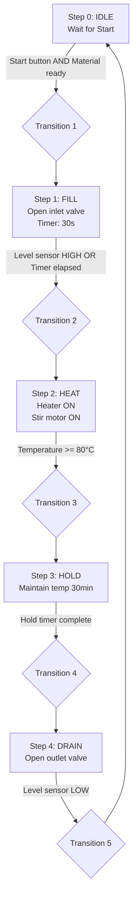
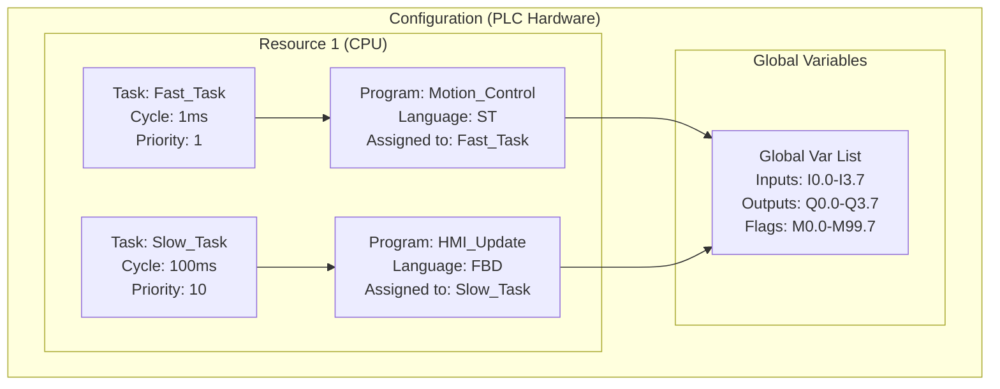
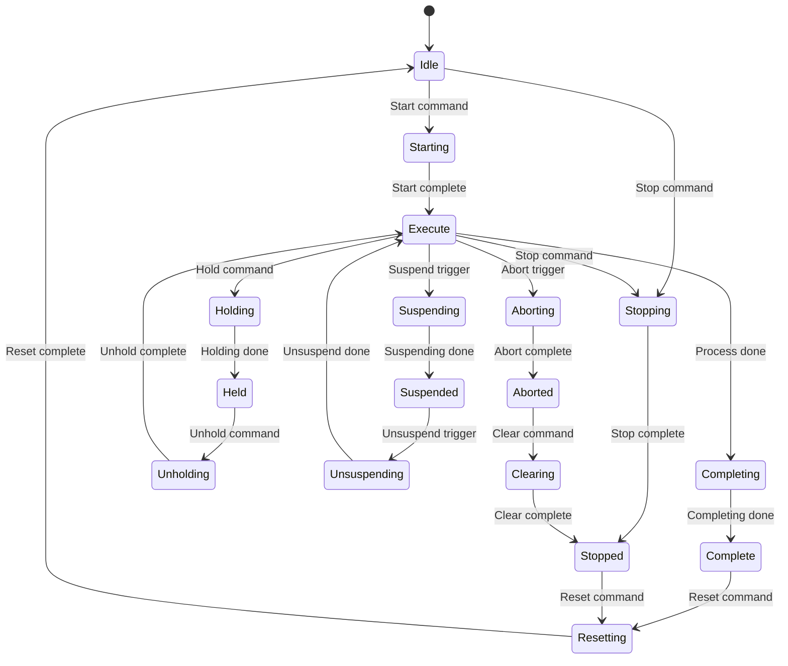

# IEC 61131 — PLC Programming Languages & Standards

**Topic:** IEC 61131-3 Programming Languages (LD, FBD, ST, IL, SFC), IEC 61131-2 (Hardware), 61131-6 (Safety)  
**Standards:** IEC 61131-1 through 61131-9 series  
**SDO:** IEC TC 65 (Industrial-Process Measurement, Control & Automation), PLCopen  
**Audience:** PLC programmers, automation engineers, control system designers, safety PLC developers  
**Prerequisites:** Basic programming concepts, industrial control fundamentals, Boolean logic

---

## Chapter 1 — Historical Context & Origin Story

### 1.1 Timeline

| Year | Event |
|------|-------|
| 1968 | First PLC: Modicon 084 (ladder logic, hardwired replacement) |
| 1970s | PLC vendors: Allen-Bradley, Siemens, Mitsubishi — each with proprietary languages |
| 1979 | IEC TC 65 begins PLC standardization work |
| 1993 | IEC 61131-3 First Edition (5 languages standardized) |
| 1998 | PLCopen founded (promote IEC 61131-3 adoption) |
| 2003 | IEC 61131-3 Second Edition (object-oriented extensions proposed) |
| 2005 | PLCopen Motion Control library (standardized motion over 61131-3) |
| 2013 | IEC 61131-3 Third Edition (OOP: classes, interfaces, methods, namespaces) |
| 2014 | IEC 61131-6 (Functional Safety for PLCs) |
| 2020 | CODESYS 3.5 (market-leading IEC 61131-3 platform) |
| 2024 | IEC 61131-3 widely adopted but vendor extensions still common |

### 1.2 Why Standardization Was Needed

| Problem (Pre-1993) | Solution (IEC 61131-3) |
|--------------------|-----------------------|
| Every PLC vendor had proprietary language | 5 standardized languages |
| Engineers needed retraining per vendor | Common concepts across all PLCs |
| No code reuse across platforms | Function Blocks portable (in theory) |
| No structured programming in PLCs | Structured Text + Function Blocks |
| Safety PLCs had no programming standard | IEC 61131-6 addresses FuSa PLCs |

---

## Chapter 2 — Standard Architecture & Structure

### 2.1 IEC 61131 Series

| Part | Title | Content |
|------|-------|---------|
| Part 1 | General Information | Overview, definitions, equipment categories |
| Part 2 | Equipment Requirements | Hardware: environmental, electrical, functional testing |
| Part 3 | Programming Languages | 5 languages + program organization units (POUs) |
| Part 4 | User Guidelines | Application guidelines (not widely referenced) |
| Part 5 | Communications | Messaging (MMS-based, largely obsolete) |
| Part 6 | Functional Safety | Safety PLC programming requirements |
| Part 7 | Fuzzy Control | Fuzzy logic programming (niche) |
| Part 8 | Guidelines for Application | Programming guidelines (withdrawn) |
| Part 9 | Single-Drop Digital Communication (SDCI) | IO-Link (became separate standard) |

### 2.2 IEC 61131-3 Structure

```mermaid
graph TB
    subgraph "Program Organization Units (POUs)"
        PROG[Program<br/>(top-level, has tasks)]
        FB[Function Block<br/>(stateful, instances)]
        FUN[Function<br/>(stateless, no memory)]
    end
    
    subgraph "5 Programming Languages"
        LD[Ladder Diagram<br/>(LD) — graphical]
        FBD[Function Block Diagram<br/>(FBD) — graphical]
        ST[Structured Text<br/>(ST) — textual]
        IL[Instruction List<br/>(IL) — textual<br/>(deprecated Ed.3)]
        SFC[Sequential Function Chart<br/>(SFC) — graphical/textual]
    end
    
    subgraph "Data & Configuration"
        VAR[Variables<br/>(typed, scoped)]
        DT[Data Types<br/>(INT, REAL, BOOL,<br/>struct, enum, array)]
        TASK[Tasks<br/>(cyclic, event-triggered)]
        CONFIG[Configuration<br/>(resources, access paths)]
    end
    
    PROG --> FB
    PROG --> FUN
    FB --> LD
    FB --> FBD
    FB --> ST
    FB --> SFC
    FUN --> ST
    FUN --> IL
    PROG --> TASK
```

---

## Chapter 3 — Technical Deep Dive

### 3.1 The Five Languages

| Language | Type | Style | Primary Use |
|----------|------|-------|-------------|
| LD (Ladder Diagram) | Graphical | Relay logic emulation | Discrete logic (electricians) |
| FBD (Function Block Diagram) | Graphical | Signal flow / data flow | Process control (analog) |
| ST (Structured Text) | Textual | High-level (Pascal-like) | Complex algorithms, math |
| IL (Instruction List) | Textual | Assembly-like | Low-level, compact (deprecated) |
| SFC (Sequential Function Chart) | Hybrid | Petri-net (steps + transitions) | Sequential/batch processes |

### 3.2 Ladder Diagram (LD) Example

```
     |                                            |
     |    I0.0        I0.1         Q0.0          |
     |----| |----+----| |----+----( )------------|
     |           |            |                   |
     |    Q0.0   |            |                   |
     |----| |----+            |                   |
     |                                            |
```
**Interpretation:** Q0.0 = (I0.0 OR Q0.0) AND I0.1 (Start/Stop with latch)

### 3.3 Structured Text (ST) Example

```pascal
// PID Controller Implementation
FUNCTION_BLOCK PID_Controller
VAR_INPUT
    Setpoint : REAL;
    ProcessVariable : REAL;
    Kp : REAL := 1.0;
    Ki : REAL := 0.1;
    Kd : REAL := 0.01;
    CycleTime : TIME := T#100ms;
END_VAR
VAR_OUTPUT
    Output : REAL;
END_VAR
VAR
    Error : REAL;
    PrevError : REAL;
    Integral : REAL;
    Derivative : REAL;
    dt : REAL;
END_VAR

dt := TIME_TO_REAL(CycleTime) / 1000.0;
Error := Setpoint - ProcessVariable;
Integral := Integral + (Error * dt);
Derivative := (Error - PrevError) / dt;
Output := (Kp * Error) + (Ki * Integral) + (Kd * Derivative);

// Anti-windup
IF Output > 100.0 THEN
    Output := 100.0;
    Integral := Integral - (Error * dt);
ELSIF Output < 0.0 THEN
    Output := 0.0;
    Integral := Integral - (Error * dt);
END_IF;

PrevError := Error;
```

### 3.4 Sequential Function Chart (SFC) Example



### 3.5 Data Types (IEC 61131-3)

| Category | Types |
|----------|-------|
| Boolean | BOOL |
| Integer | SINT, INT, DINT, LINT, USINT, UINT, UDINT, ULINT |
| Real | REAL (32-bit), LREAL (64-bit) |
| Time | TIME, DATE, TIME_OF_DAY, DATE_AND_TIME |
| String | STRING, WSTRING |
| Bit string | BYTE, WORD, DWORD, LWORD |
| Derived | STRUCT, ENUM, ARRAY, SUBRANGE |
| User-defined | TYPE ... END_TYPE |

### 3.6 Object-Oriented Extensions (IEC 61131-3 Ed.3)

| Feature | Description |
|---------|-------------|
| Method | Functions within Function Blocks |
| Interface | Abstract contracts (like Java interfaces) |
| Inheritance | EXTENDS keyword for FB inheritance |
| Polymorphism | Interface references, method overriding |
| Namespace | Package-like organization of POUs |
| THIS | Self-reference within methods |
| SUPER | Parent FB reference |

---

## Chapter 4 — Implementation Guide

### 4.1 Major IEC 61131-3 Platforms

| Platform | Vendor | Supported PLCs | Languages |
|----------|--------|---------------|-----------|
| TIA Portal (STEP 7) | Siemens | S7-1200, S7-1500 | LD, FBD, ST, SCL, SFC (Graph) |
| Studio 5000 | Rockwell | ControlLogix, CompactLogix | LD, FBD, ST, SFC |
| CODESYS | 3S-Smart | 400+ device manufacturers | All 5 + CFC |
| TwinCAT 3 | Beckhoff | CX/C-series, EtherCAT | All 5 + C/C++ |
| Sysmac Studio | Omron | NJ/NX series | LD, ST, FBD, SFC |
| GX Works3 | Mitsubishi | iQ-R, iQ-F | LD, ST, FBD, SFC |
| Unity Pro / EcoStruxure | Schneider | Modicon M340/M580 | All 5 |
| Automation Studio | B&R | X20, X90, ACOPOS | All 5 + C |
| PLCnext | Phoenix Contact | PLCnext controllers | All 5 + C++ |

### 4.2 Best Practices

| Practice | Detail |
|----------|--------|
| Language selection | LD for discrete logic; ST for algorithms; FBD for analog; SFC for sequences |
| Modular design | One FB per machine module (PackML-style) |
| Naming convention | Hungarian notation or camelCase with prefix (bStart, rTemperature, iCount) |
| State machines | Use ENUM + CASE statement (ST) or SFC for sequential control |
| Error handling | Status WORD output on every FB (0=OK, ≠0 = error code) |
| Reusable libraries | PLCopen motion, PackML states, standard FB libraries |
| Version control | Text-based export (ST preferred for diff/merge) |
| Testing | Simulation mode, unit test frameworks (CODESYS Test Manager) |

### 4.3 PLCopen Libraries

| Library | Function |
|---------|----------|
| PLCopen Motion | MC_MoveAbsolute, MC_MoveRelative, MC_Stop, MC_Home |
| PLCopen Safety | SF_EmergencyStop, SF_SafelyLimitedSpeed, SF_GuardMonitor |
| PLCopen OPC UA | UA_Connect, UA_Read, UA_Write, UA_MethodCall |
| PLCopen Communication | SEND, RECEIVE, CONNECT, DISCONNECT |
| PackML (ISA-TR88) | State machine: Idle→Execute→Complete→Stopped |

---

## Chapter 5 — Certification & Compliance

### 5.1 IEC 61131-2 Hardware Certification

| Test Category | Examples |
|---------------|---------|
| Environmental | Temperature (-20 to +60°C), humidity, vibration, shock |
| EMC | IEC 61000-4 series (ESD, surge, fast transients, radiated) |
| Electrical | Power supply (voltage dips, interruptions) |
| Functional | Cycle time accuracy, I/O response time, memory retention |
| Safety (61131-6) | Safe state behavior, diagnostic coverage, proof test intervals |

### 5.2 IEC 61131-6 Functional Safety

| Aspect | Detail |
|--------|--------|
| Scope | PLC programming for safety functions (SIL 1-3 per IEC 61508) |
| Language restrictions | Subset of 61131-3 languages with restrictions |
| Allowed languages | FBD (primary), LD (restricted), ST (highly restricted for safety) |
| Prohibited (safety) | Pointers, recursion, dynamic memory, unrestricted loops |
| Certified safety PLCs | Siemens S7-1500F, Allen-Bradley GuardLogix, Pilz PSS, HIMA HIMax |
| Libraries | Pre-certified safety FBs (PLCopen Safety) |
| V&V | Formal verification, 100% test coverage, independent review |

---

## Chapter 6 — Regional & Domain Variants

| Region | Preferred Language | Platform |
|--------|-------------------|----------|
| Germany/Europe | ST + FBD | Siemens TIA Portal, CODESYS, Beckhoff TwinCAT |
| North America | LD (dominant) | Rockwell Studio 5000, Allen-Bradley |
| Japan | LD + SFC | Mitsubishi GX Works, Omron Sysmac |
| Process industry | FBD + SFC | DCS (Emerson DeltaV, Yokogawa, ABB 800xA) |
| Motion/Packaging | ST + FBD | Beckhoff TwinCAT, B&R Automation Studio |
| Safety | FBD (restricted) | Siemens F-systems, Pilz, HIMA |
| Building automation | FBD + LD | Beckhoff, WAGO, Phoenix Contact |

---

## Chapter 7 — Comparison of IEC 61131-3 Languages

| Dimension | LD | FBD | ST | IL | SFC |
|-----------|----|----|----|----|-----|
| Type | Graphical | Graphical | Textual | Textual | Hybrid |
| Origin | Relay logic | Signal flow | Pascal/Ada | Assembly | Petri-net (Grafcet) |
| Best for | Discrete logic | Analog/process | Algorithms, math | Legacy (deprecated) | Sequential control |
| Readability | High (electricians) | High (control engineers) | High (programmers) | Low | High (process view) |
| Debugging | Visual (energized paths) | Visual (signal values) | Breakpoints, watches | Breakpoints | Step-by-step |
| OOP support | No | Limited | Full (Ed.3) | No | No |
| Safety PLC | Restricted use | Primary (safety) | Very restricted | Not for safety | Not for safety |
| Version control | Difficult (graphical) | Difficult | Easy (text diff) | Easy | Moderate |
| Complex logic | Limited | Moderate | Excellent | Limited | Moderate |
| Market usage | ~40% (dominant) | ~25% | ~25% (growing) | ~2% (declining) | ~8% |

---

## Chapter 8 — Mermaid Architecture Diagrams

### 8.1 IEC 61131-3 Program Architecture



### 8.2 Function Block Instantiation

```mermaid
graph LR
    subgraph "FB Type: TON (Timer On Delay)"
        IN_T[IN: BOOL] --> TON_BLOCK[TON<br/>Timer logic]
        PT_T[PT: TIME] --> TON_BLOCK
        TON_BLOCK --> Q_T[Q: BOOL]
        TON_BLOCK --> ET_T[ET: TIME]
    end
    
    subgraph "Instance: Motor_Start_Delay"
        I1[Start_Button] -->|"IN"| INST[Motor_Start_Delay<br/>(TON instance)]
        T1[T#5s] -->|"PT"| INST
        INST -->|"Q"| O1[Motor_Run]
        INST -->|"ET"| O2[Elapsed_Display]
    end
```

### 8.3 PackML State Machine (ISA-TR88)



---

## Chapter 9 — Case Studies

### 9.1 Pharmaceutical Batch — SFC + ST Implementation

| Aspect | Detail |
|--------|--------|
| Application | Pharmaceutical batch reactor (ISA-88 / PackML compliant) |
| Languages | SFC for batch sequence, ST for PID loops, FBD for analog I/O |
| PLC | Siemens S7-1500 + TIA Portal V17 |
| Compliance | 21 CFR Part 11 (electronic batch records), GAMP 5 |
| Benefit | SFC matches P&ID flow; clear step visualization for operators |
| Validation | IQ/OQ/PQ per GAMP 5 (Category 5 — bespoke software) |

### 9.2 High-Speed Packaging — ST + Motion

| Aspect | Detail |
|--------|--------|
| Application | 600 bottles/minute filling line (coordinated motion) |
| Platform | Beckhoff TwinCAT 3 (IEC 61131-3 + PLCopen Motion) |
| Language | ST exclusively (complex cam profiles, interpolation) |
| Cycle time | 250μs (EtherCAT + TwinCAT NC) |
| PLCopen FBs | MC_MoveAbsolute, MC_CamIn, MC_GearIn (electronic gearing) |
| Benefit | Platform-independent motion code; same logic on B&R/Omron |

---

## Chapter 10 — Future Evolution & Industry Trends

| Trend | Timeline | Description |
|-------|----------|-------------|
| ST becoming dominant | Now | Textual code easier for version control, CI/CD |
| IL deprecated | Now | Removed from Ed.3; not implemented in new platforms |
| OOP in PLCs | Growing | Classes, interfaces, design patterns in industrial code |
| Model-Based Design | Growing | Simulink/MATLAB → IEC 61131-3 code generation |
| Python/C++ alongside | Growing | TwinCAT C++, PLCnext C++, Python for data science on PLC |
| Cloud IDE | Emerging | Browser-based PLC programming (Siemens Xcelerator) |
| AI/ML on PLC | Emerging | TensorFlow Lite on PLC, ONNX runtime |
| Digital twin | Growing | Simulation using same IEC 61131-3 code |
| Standardized testing | Growing | PLCopen unit test standard; CI for PLC code |
| IEC 61499 | Parallel | Event-driven distributed control (complement to 61131) |

---

## Chapter 11 — Interview Questions & Career Guide

### Tier 1: Entry-Level

**Q1:** What are the 5 IEC 61131-3 programming languages and when would you use each?  
**A:** (1) **LD (Ladder Diagram):** Graphical language resembling electrical relay circuits. Use for: simple discrete logic (start/stop, interlocks, combinatorial logic). Popular with: electricians/maintenance technicians who think in relay terms. Limitation: poor for math, loops, complex algorithms. (2) **FBD (Function Block Diagram):** Graphical language with interconnected function blocks (signal flow). Use for: analog/process control (PID loops, signal conditioning, scaling). Popular with: control/instrumentation engineers. Strength: visual data flow; easy to trace signal path. (3) **ST (Structured Text):** High-level textual language (Pascal/Ada-like syntax). Use for: complex algorithms, math, state machines, data processing. Popular with: software engineers, complex applications. Strength: full programming power (loops, conditionals, arrays, OOP in Ed.3). (4) **IL (Instruction List):** Low-level textual language (assembly-like). Use for: legacy code; compact memory footprint. Status: DEPRECATED in IEC 61131-3 Edition 3. Not recommended for new development. (5) **SFC (Sequential Function Chart):** Hybrid graphical (steps + transitions). Use for: sequential/batch processes (ISA-88), state machines, startup sequences. Popular with: process engineers; excellent for visualizing batch flow. Strength: clearly shows process sequence; natural for batch/recipe control.

### Tier 2: Mid-Level

**Q2:** Explain the difference between Functions, Function Blocks, and Programs in IEC 61131-3. Give examples of when to use each.  
**A:** **Function (FUN):** (a) Stateless: no internal memory between calls (same inputs always produce same output). (b) Single output value (plus optional VAR_OUTPUT). (c) Like a mathematical function. (d) Example: `SCALE_LINEAR(Input, InMin, InMax, OutMin, OutMax) → REAL`. Use for: conversions, calculations, data transformations, string operations. Analogy: pure function in functional programming. **Function Block (FB):** (a) Stateful: has internal memory (VAR) that persists between calls. (b) Multiple instances (each with own state). (c) Has inputs, outputs, AND internal variables. (d) Example: `TON (Timer On Delay)` — internal elapsed time persists between scans. `PID_Controller` — integral term accumulates over time. Use for: timers, counters, PID loops, state machines, communication handlers, motor controllers. Analogy: class instance in OOP (FB type = class; FB instance = object). **Program (PROG):** (a) Top-level execution unit assigned to a TASK. (b) Has access to I/O variables (direct addressing). (c) Only one instance per resource (not instantiated like FBs). (d) Contains logic that calls Functions and Function Block instances. Use for: main program structure; top-level control logic that ties everything together. Analogy: `main()` function in C; the entry point for a task. **Relationship:** Program CONTAINS instances of Function Blocks. Function Blocks CALL Functions. Programs are assigned to Tasks (cyclic or event-triggered). A Configuration has Resources; Resources have Tasks; Tasks run Programs.

### Tier 3: Senior

**Q3:** You're designing a software architecture for a multi-machine production line (5 machines, each with conveyor, robot, vision) using IEC 61131-3 with OOP (Ed.3). How do you structure the code for maintainability and reuse?  
**A:** **1. Architecture pattern: Object-Oriented + PackML state machine** Base FB: `FB_MachineModule` (abstract) — implements PackML states (Idle, Execute, Complete, etc.). Derived FBs: `FB_Conveyor EXTENDS FB_MachineModule`, `FB_Robot EXTENDS FB_MachineModule`, `FB_VisionStation EXTENDS FB_MachineModule`. Each machine: `FB_Machine EXTENDS FB_MachineModule` — contains instances of Conveyor, Robot, Vision. Line level: `FB_ProductionLine` — coordinates 5 machines. **2. Interface-based design:** `I_Controllable` interface: `Start()`, `Stop()`, `Reset()`, `GetState() → E_PackMLState`. `I_Diagnosable` interface: `GetDiagCode() → UINT`, `GetDiagText() → STRING`. All machine modules implement both interfaces. Line coordinator works with `I_Controllable` references (polymorphism). **3. State machine implementation (in each FB_MachineModule):**
```
METHOD Execute : BOOL    // Called cyclically
CASE eState OF
    E_PackMLState.Idle:     M_Idle();
    E_PackMLState.Starting: M_Starting();
    E_PackMLState.Execute:  M_Execute();  // OVERRIDE in derived FB
    E_PackMLState.Completing: M_Completing();
    ...
END_CASE
```
Each derived class OVERRIDES `M_Execute()` with machine-specific logic. **4. Library structure:** `Lib_MachineFramework`: base classes, interfaces, PackML states (reusable across projects). `Lib_Drives`: FB wrappers for PLCopen motion (vendor-independent). `Lib_Vision`: camera interface FBs (abstract + vendor-specific implementations). `Lib_Safety`: PLCopen Safety FB wrappers. `App_Line1`: specific production line instantiation and parameterization. **5. Naming and organization:** Namespaces: `Company.Framework.PackML`, `Company.Drives.Servo`, `Company.App.Line1`. Naming: `FB_` prefix for Function Blocks, `I_` for interfaces, `E_` for enums, `ST_` for structs. **6. Testing strategy:** Unit tests: CODESYS Test Manager or custom test FB framework. Each FB tested in isolation (inject inputs, verify outputs/state). Integration tests: simulated I/O (no hardware needed for logic verification). CI pipeline: text-based ST files in Git → automated build → test → report. **7. Deployment (multi-PLC):** Each machine: one PLC (S7-1500, Beckhoff, or CODESYS-based). Line coordinator: separate PLC (or one machine PLC hosts coordinator). Communication: OPC UA or PROFINET between PLCs. Same library compiled for each PLC (consistent behavior). **8. Benefits:** New machine addition: instantiate `FB_Machine`, configure interfaces. Maintenance: each module independently debuggable (PackML states visible). Reuse: same `FB_Conveyor` across 50 projects (library). Testing: unit tests catch regressions before deployment.

---

## Chapter 12 — Cheat Sheet & Quick Reference

### IEC 61131-3 Data Types

```
BOOL:    TRUE/FALSE (1 bit)
SINT:    -128 to 127 (8-bit signed)
INT:     -32768 to 32767 (16-bit signed)
DINT:    -2³¹ to 2³¹-1 (32-bit signed)
LINT:    -2⁶³ to 2⁶³-1 (64-bit signed)
REAL:    IEEE 754 single (32-bit float)
LREAL:   IEEE 754 double (64-bit float)
TIME:    T#1h30m45s100ms (duration)
STRING:  'Hello World' (max 255 chars default)
```

### Structured Text Syntax

```pascal
// Variable declaration
VAR
    bStart : BOOL := FALSE;
    rTemp  : REAL;
    iCount : INT;
END_VAR

// Control structures
IF condition THEN ... ELSIF ... ELSE ... END_IF;
CASE variable OF 1: ...; 2: ...; ELSE ...; END_CASE;
FOR i := 0 TO 10 BY 1 DO ... END_FOR;
WHILE condition DO ... END_WHILE;
REPEAT ... UNTIL condition; END_REPEAT;
```

### Function Block Declaration

```pascal
FUNCTION_BLOCK FB_Motor
VAR_INPUT
    bEnable : BOOL;
    rSpeed  : REAL;
END_VAR
VAR_OUTPUT
    bRunning : BOOL;
    bFault   : BOOL;
END_VAR
VAR
    // internal state
    eState : E_MotorState;
END_VAR
```

### Language Selection Guide

```
Discrete logic (simple):     LD (Ladder Diagram)
Analog / signal processing:  FBD (Function Block Diagram)
Complex algorithms:          ST (Structured Text)
Sequential processes:        SFC (Sequential Function Chart)
DO NOT USE:                  IL (deprecated)
Safety PLCs:                 FBD (restricted subset)
```

### PLCopen Motion Commands

```
MC_Power:         Enable/disable axis
MC_Home:          Home/reference axis
MC_MoveAbsolute:  Move to absolute position
MC_MoveRelative:  Move relative distance
MC_MoveVelocity:  Continuous velocity mode
MC_Stop:          Controlled stop
MC_GearIn:        Electronic gearing
MC_CamIn:         Electronic cam (table-based)
MC_GroupEnable:   Enable coordinated group
```

---

*End of Document — 06_IEC_61131_PLC_Programming.md*
