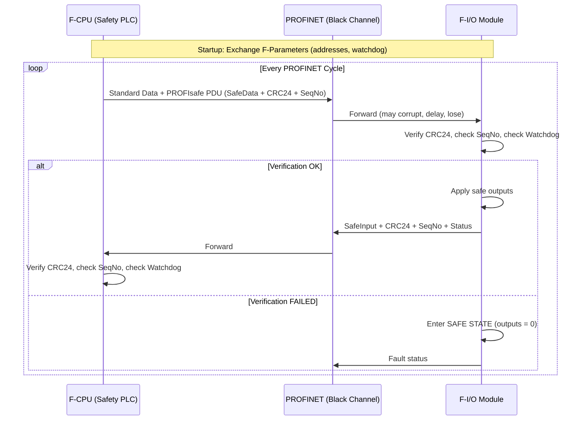
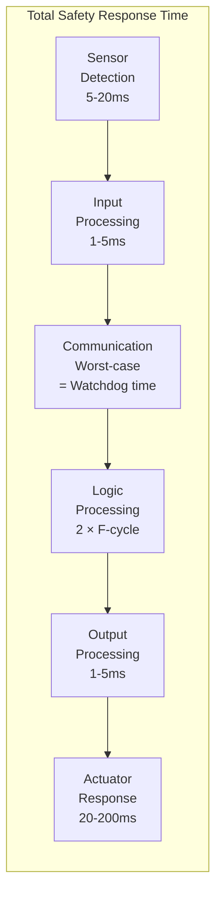

# Safety Network Protocols — PROFIsafe, FSoE, CIP Safety, openSAFETY

**Topic:** Functional Safety Communication over Industrial Networks (Black Channel Principle)  
**Standards:** IEC 61784-3 (Safety Communication), IEC 61508, IEC 62061, ISO 13849  
**SDO:** PI International (PROFIsafe), ETG (FSoE), ODVA (CIP Safety), B&R/EPSG (openSAFETY)  
**Audience:** Safety engineers, functional safety consultants, automation system designers, TÜV assessors  
**Prerequisites:** IEC 61508 basics, PLC programming, PROFINET/EtherCAT/EtherNet/IP fundamentals

---

## Chapter 1 — Historical Context & Origin Story

### 1.1 Timeline

| Year | Event |
|------|-------|
| 1998 | IEC 61508 published (generic functional safety) |
| 1999 | PROFIsafe V1.0 (first safety over fieldbus — PROFIBUS) |
| 2003 | CIP Safety specification (DeviceNet Safety) |
| 2004 | FSoE (Safety over EtherCAT) developed by ETG |
| 2005 | openSAFETY introduced by B&R (open protocol) |
| 2007 | PROFIsafe over PROFINET (Ethernet-based safety) |
| 2008 | IEC 61784-3 published (safety communication profiles) |
| 2010 | CIP Safety over EtherNet/IP (Ethernet-based) |
| 2012 | PROFIsafe V2.6 (enhanced, PROFINET integrated) |
| 2018 | FSoE over EtherCAT G |
| 2023 | Safety over TSN (research/development — not yet deployed) |
| 2024 | All major protocols certified SIL 3, Cat 4, PLe |

### 1.2 The Black Channel Principle

| Concept | Detail |
|---------|--------|
| Definition | Safety layer is independent of underlying communication channel |
| Assumption | Communication channel may corrupt, lose, repeat, delay, or insert messages |
| Principle | Safety protocol detects ALL transmission errors using its own mechanisms |
| Benefit | No certification of underlying network required for safety |
| Standard | IEC 61784-3 defines safety mechanisms required |
| Analogy | Safety protocol is a "safe tunnel" through an "unsafe channel" |

```mermaid
graph LR
    subgraph "Safety Application A"
        SA[Safe Controller<br/>(F-CPU / Safety PLC)]
    end
    
    subgraph "Black Channel (untrusted)"
        BC[Standard Network<br/>PROFINET / EtherCAT /<br/>EtherNet/IP / any<br/>May corrupt, lose,<br/>delay messages]
    end
    
    subgraph "Safety Application B"
        SB[Safe I/O Module<br/>(F-Module)]
    end
    
    SA -->|"Safety PDU<br/>(CRC + sequence +<br/>watchdog + codename)"| BC
    BC -->|"Safety PDU<br/>(verified at receiver)"| SB
```

---

## Chapter 2 — Standard Architecture & Structure

### 2.1 IEC 61784-3 Safety Communication Profiles

| Profile | Protocol | Organization |
|---------|----------|-------------|
| CPF 3/4 | PROFIsafe (over PROFIBUS/PROFINET) | PI International |
| CPF 2 | CIP Safety (over DeviceNet/EtherNet/IP) | ODVA |
| CPF 12 | FSoE (over EtherCAT) | ETG |
| CPF 17 | openSAFETY (over any fieldbus) | EPSG / B&R |
| CPF 11 | POWERLINK Safety (openSAFETY-based) | EPSG |

### 2.2 Safety Integrity Levels Achieved

| Protocol | SIL (IEC 61508) | PL (ISO 13849) | Cat (ISO 13849) | SIL CL (IEC 62061) |
|----------|-----------------|----------------|-----------------|---------------------|
| PROFIsafe | SIL 3 | PLe | Category 4 | SIL CL 3 |
| FSoE | SIL 3 | PLe | Category 4 | SIL CL 3 |
| CIP Safety | SIL 3 | PLe | Category 4 | SIL CL 3 |
| openSAFETY | SIL 3 | PLe | Category 4 | SIL CL 3 |

### 2.3 Error Detection Mechanisms

| Threat (IEC 61784-3) | Description | Detection Mechanism |
|---------------------|-------------|---------------------|
| Corruption | Data bits changed during transmission | CRC (strong polynomial) |
| Repetition | Old message replayed | Sequence counter |
| Deletion | Message lost / not received | Watchdog timer |
| Insertion | Spurious message injected | Connection ID + source/dest addresses |
| Re-sequencing | Messages arrive out of order | Sequence number checking |
| Delay | Message received too late | Watchdog timer |
| Masquerade | Wrong source pretends to be safe device | CRC over addresses + unique connection ID |

---

## Chapter 3 — Technical Deep Dive

### 3.1 PROFIsafe

| Parameter | Detail |
|-----------|--------|
| CRC | 24-bit CRC (over safety data + control) |
| Sequence number | Consecutive number (virtual consecutive number in V2) |
| Watchdog | Configurable (per F-device), typical 50-200ms |
| F-Parameters | F_Source_Add (source safety address), F_Dest_Add, F_WD_Time |
| Codename | CRC seed unique per safety connection (F_iPar_CRC) |
| Status/Control | 1 byte status (device) + 1 byte control (controller) |
| Data size | 1-123 bytes safety data per telegram |
| Residual error | $P_{residual} < 10^{-7}$ per hour (exceeds SIL 3 requirement) |

**PROFIsafe Frame Structure:**

| Field | Size | Purpose |
|-------|------|---------|
| Safety User Data | 1-123 bytes | Safe process data |
| Control/Status Byte | 1 byte | iParameter_valid, Activate_FV, Toggle bits |
| CRC | 3 bytes (24-bit) | Integrity of entire safety frame |

### 3.2 FSoE (Functional Safety over EtherCAT)

| Parameter | Detail |
|-----------|--------|
| CRC | 16-bit CRC (per data channel) |
| Sequence number | 16-bit connection ID (checked per cycle) |
| Watchdog | Configurable per slave (FSoE timeout) |
| Connection | Session ID established at startup |
| Data size | 1-254 bytes safety data |
| Reset | Safe state until operator reset (after error) |
| Residual error | $P_{residual} < 10^{-9}$ (better than SIL 3 requirement) |
| Integration | Uses EtherCAT mailbox (SDO-like) for FSoE frames |

**FSoE Frame:**

| Field | Size | Purpose |
|-------|------|---------|
| Command | 2 bytes | FSoE command (data, session, reset) |
| Connection ID | 2 bytes | Unique connection identifier |
| Safety Data | N bytes | Safe I/O data |
| CRC | 2 bytes | 16-bit CRC over frame |

### 3.3 CIP Safety

| Parameter | Detail |
|-----------|--------|
| CRC | Two CRCs: CRC-S1 (16-bit) + CRC-S2 (16-bit) complement |
| Sequence number | 16-bit rolling counter |
| Watchdog | Safety Network Number + configurable timeout |
| Connection ID | Safety Network Number (SNN) + node address |
| Data format | Time stamp, time correction, cross-checking |
| Redundancy | Type 2 connections: producer sends 2 independent copies |
| Residual error | $P_{residual} < 10^{-8}$ per hour (SIL 3 compliant) |

**CIP Safety Modes:**

| Type | Description | Use Case |
|------|-------------|----------|
| Type 1 (Unicast) | Single connection, single path | Standard safety connection |
| Type 2 (Multicast) | Redundant data paths (dual CRCs) | High-availability safety |

### 3.4 openSAFETY

| Parameter | Detail |
|-----------|--------|
| CRC | Two 8-bit CRCs (sub-frame 1 + sub-frame 2) |
| Principle | Dual-channel in software: two sub-frames with complementary data |
| Watchdog | Per-connection timeout |
| Transport independence | Runs over ANY fieldbus (PROFINET, EtherNet/IP, POWERLINK, etc.) |
| Data | Each frame has 2 sub-frames (diverse redundancy in one frame) |
| Open source | Protocol specification is open (Apache 2.0 license) |
| Residual error | $P_{residual} < 10^{-8}$ per hour |

---

## Chapter 4 — Implementation Guide

### 4.1 Safety System Architecture

```mermaid
graph TB
    subgraph "Safety Controller"
        FCPU[F-CPU / Safety PLC<br/>Dual-channel processing<br/>Program comparison<br/>Self-test diagnostics]
    end
    
    subgraph "Safety I/O"
        FIO1[F-Module: E-Stop<br/>Dual-channel input<br/>Discrepancy monitoring<br/>Short-circuit detection]
        FIO2[F-Module: Light Curtain<br/>OSSD output monitoring<br/>Cross-fault detection]
        FIO3[F-Module: Safe Drive<br/>STO, SS1, SLS<br/>Safe encoder feedback]
    end
    
    subgraph "Safety Protocol (Black Channel)"
        NET[Standard Network<br/>PROFIsafe / FSoE / CIP Safety<br/>(CRC + sequence + watchdog)]
    end
    
    FCPU --> NET
    NET --> FIO1
    NET --> FIO2
    NET --> FIO3
```

### 4.2 PROFIsafe Implementation (Siemens)

| Step | Activity |
|------|----------|
| 1 | Configure F-CPU in TIA Portal (enable safety mode) |
| 2 | Assign unique F_Source_Add and F_Dest_Add to each F-module |
| 3 | Configure F_WD_Time (watchdog) per device (based on process safety time) |
| 4 | Program safety logic in F-FBD or F-LD (restricted language subset) |
| 5 | Generate safety signature (CRC of safety program) |
| 6 | Safety acceptance test (verify correct behavior) |
| 7 | Document: safety program printout, signature, F-parameter list |
| 8 | Commission: online with hardware, test each safety function |

### 4.3 Safety Response Time Calculation

$$T_{response} = T_{sensor} + T_{input\_processing} + T_{communication} + T_{logic} + T_{output\_processing} + T_{actuator}$$

| Component | Typical Value | Depends On |
|-----------|---------------|-----------|
| $T_{sensor}$ | 5-20 ms | Sensor technology (light curtain: 14ms for 1m) |
| $T_{input\_processing}$ | 1-5 ms | F-module processing + discrepancy time |
| $T_{communication}$ | Watchdog time (worst case) | Protocol + network cycle + watchdog |
| $T_{logic}$ | 2 × PLC cycle time (worst case) | F-CPU cycle time |
| $T_{output\_processing}$ | 1-5 ms | F-module output switching |
| $T_{actuator}$ | 20-200 ms | Mechanical (brake: 50ms, valve: 200ms) |

**Watchdog time (PROFIsafe):**
$$F\_WD\_Time ≥ 2 × (PROFINET\_cycle + F\_module\_response + communication\_delay)$$

---

## Chapter 5 — Certification & Compliance

### 5.1 Certification Requirements

| Level | Requirement |
|-------|------------|
| Protocol certification | TÜV-certified protocol implementation (stack) |
| Device certification | IEC 61508 SIL 3 (hardware + software) per TÜV/Exida |
| System integration | Validated per IEC 62061 or ISO 13849 (integrator responsibility) |
| Safety function test | Proof test at intervals (per SIL calculation) |
| Re-certification | Required if safety-relevant changes made |

### 5.2 Certification Bodies

| Body | Region | Programs |
|------|--------|----------|
| TÜV SÜD | Global | IEC 61508 SIL, ISO 13849, IEC 62061 |
| TÜV Rheinland | Global | Same scope |
| TÜV NORD | Global | Same scope |
| Exida | Global | SIL certification, FMEDA |
| UL | North America | Machine safety, NRTL |
| BG (DGUV) | Germany | Machine safety, type examination |

### 5.3 Documentation Requirements

| Document | Content |
|----------|---------|
| Safety Requirements Specification (SRS) | Safety functions, SIL/PL targets, response times |
| FMEDA (components) | Failure Mode Effects & Diagnostic Analysis — SFF, DC |
| Safety Manual | Installation, commissioning, maintenance instructions |
| V&V Report | Verification & validation evidence |
| Safety program printout | Complete listing with safety signature/CRC |
| F-Parameter documentation | All safety addresses, watchdog times, configuration |
| Proof test procedure | Periodic testing instructions + intervals |

---

## Chapter 6 — Regional & Domain Variants

| Domain | Preferred Protocol | Typical Safety Functions |
|--------|-------------------|------------------------|
| Automotive manufacturing | PROFIsafe (Siemens dominant) | E-Stop, light curtains, safe speed monitoring |
| Semiconductor | FSoE (EtherCAT/Beckhoff dominant) | Safe torque off, safe position |
| Packaging/food | FSoE or PROFIsafe | Guard door monitoring, E-stop |
| North America (discrete) | CIP Safety (Rockwell dominant) | E-Stop, GuardLogix interlock |
| Process industry | PROFIsafe (via PROFINET/PA) | SIS integration, valve control |
| Robotics | FSoE (internal) + PROFIsafe (cell level) | Safe speed, safe zone, collaborative |
| Machine tools | FSoE or PROFIsafe | Safe spindle speed, safe axis position |
| Mobile machines | CIP Safety or openSAFETY | Safe motion, operator protection |

---

## Chapter 7 — Comparison of Safety Protocols

| Dimension | PROFIsafe | FSoE | CIP Safety | openSAFETY |
|-----------|-----------|------|-----------|------------|
| Organization | PI International | ETG | ODVA | EPSG (open) |
| Underlying network | PROFIBUS, PROFINET | EtherCAT | DeviceNet, EtherNet/IP | Any (network-independent) |
| CRC | 24-bit | 16-bit | 2×16-bit (complementary) | 2×8-bit (dual sub-frame) |
| Safety level | SIL 3, PLe, Cat 4 | SIL 3, PLe, Cat 4 | SIL 3, PLe, Cat 4 | SIL 3, PLe, Cat 4 |
| Residual error | <10⁻⁷/h | <10⁻⁹/h | <10⁻⁸/h | <10⁻⁸/h |
| Max safe data | 123 bytes | 254 bytes | 250 bytes | 254 bytes |
| Configuration | TIA Portal (Siemens) | TwinCAT (Beckhoff) | Studio 5000 (Rockwell) | Automation Studio (B&R) |
| Cross-vendor | Limited (PI ecosystem) | Good (ETG ecosystem) | Limited (ODVA ecosystem) | Designed for cross-vendor |
| Open source | No (PI members) | No (ETG members) | No (ODVA members) | Yes (Apache 2.0) |
| Market share | #1 (largest installed base) | #2 (growing fast) | #3 (North America) | #4 (niche) |

---

## Chapter 8 — Mermaid Architecture Diagrams

### 8.1 PROFIsafe Communication



### 8.2 Safety Response Time Components



---

## Chapter 9 — Case Studies

### 9.1 Collaborative Robot Cell — Dual Safety Protocol

| Aspect | Detail |
|--------|--------|
| Application | Human-robot collaboration (cobot cell) with external safety PLC |
| Internal (robot) | FSoE between robot controller and servo drives (safe speed, safe position) |
| External (cell) | PROFIsafe between safety PLC and perimeter devices (light curtain, E-stop) |
| Safety functions | Speed monitoring (SLS), safe zone monitoring, E-Stop (SIL 3) |
| Integration | Robot safety controller has PROFIsafe interface to cell safety PLC |
| Response time | <150ms (light curtain detection to robot stop) |
| Certification | TÜV SÜD — IEC 62061 SIL 3, ISO 10218-2, ISO/TS 15066 |

### 9.2 High-Speed Press — FSoE Safety

| Aspect | Detail |
|--------|--------|
| Application | Mechanical press, 600 strokes/min (100ms cycle) |
| Safety function | Safe top dead center monitoring (safe position), safe speed monitoring |
| Protocol | FSoE over EtherCAT (12.5μs cycle, well within safety timing) |
| Challenge | Safety response time must be <50ms (operator hand in die area) |
| Solution | EtherCAT 250μs cycle + FSoE watchdog 5ms + safety PLC 2ms = ~9ms total |
| Mechanism | Safe encoder on press shaft → FSoE to safety controller → stop valve |

---

## Chapter 10 — Future Evolution & Industry Trends

| Trend | Timeline | Description |
|-------|----------|-------------|
| Safety over TSN | 2025+ | Safety communication on converged TSN network |
| OPC UA Safety | 2025+ | Safety communication profile for OPC UA |
| Increased SIL | Research | SIL 4 for autonomous vehicles/systems |
| AI + Safety | Emerging | AI-assisted safety function monitoring (not safety-critical itself) |
| Wireless safety | Growing | WirelessHART safety, 5G URLLC for safety (research) |
| Cloud-connected safety | Growing | Safety diagnostics/analytics to cloud (non-safety path) |
| IEC 63283 | Development | Updated safety communication standard (successor to IEC 61784-3) |
| Safe motion (advanced) | Growing | Safe limited force (ISO/TS 15066), safe workspace |
| Digital twin safety | Emerging | Simulation-based safety validation |
| Cybersecurity + safety | Growing | IEC 63074 (safety + security convergence) |

---

## Chapter 11 — Interview Questions & Career Guide

### Tier 1: Entry-Level

**Q1:** What is the black channel principle in safety communication and why is it important?  
**A:** **Black channel principle:** The safety communication protocol treats the underlying network (PROFINET, EtherCAT, Ethernet, etc.) as an "untrusted" channel — a "black box" that may corrupt, delay, lose, repeat, insert, or reorder messages at any time. The safety protocol adds its OWN error detection mechanisms (CRC, sequence numbers, watchdog timers, connection IDs) that are sufficient to detect all these faults to the required SIL level. **Why important:** (1) **No network certification needed:** The underlying Ethernet/PROFINET/EtherCAT does NOT need to be certified for safety (only the safety layer needs TÜV certification). This dramatically simplifies system design. (2) **Technology independence:** Safety layer can run over ANY transport (current or future) without re-certification. PROFIsafe works over PROFIBUS and PROFINET — same safety certification. (3) **Standard infrastructure:** Use standard (non-safety) switches, cables, connectors. Only the endpoints (F-CPU, F-modules) need safety certification. (4) **Cost:** No special safety-rated network infrastructure required. Standard Ethernet + safety protocol endpoints = SIL 3 system. **Error detection mechanisms (IEC 61784-3):** CRC detects corruption, sequence number detects repetition/deletion/resequencing, watchdog timer detects delay/deletion, connection ID/address encoding detects masquerade/insertion.

### Tier 2: Mid-Level

**Q2:** Calculate the safety response time for an E-Stop function using PROFIsafe over PROFINET.  
**A:** **Given system:** PROFINET cycle time: 4ms. PROFIsafe watchdog: 20ms (= 5 × PROFINET cycles). F-CPU cycle time: 8ms. E-Stop sensor: 2ms (hardware contact bounce + filtering). F-I/O output processing: 3ms. Contactor (actuator): 30ms (mechanical opening time). **Calculation:** $T_{response} = T_{sensor} + T_{input} + T_{comm} + T_{logic} + T_{output} + T_{actuator}$. $T_{sensor}$ = 2ms (E-stop button debounce). $T_{input}$ = 4ms (worst case: just missed PROFINET cycle, must wait for next). Actually, worst case input = 1 PROFINET cycle (event occurs just after device sends) = 4ms. $T_{comm}$ = 1 × PROFINET cycle (field→controller) = 4ms. But PROFIsafe watchdog is the WORST CASE. If a message is lost, we wait up to watchdog time before declaring fault: Worst-case communication = F_WD_Time = 20ms. $T_{logic}$ = 2 × F-CPU cycle = 2 × 8ms = 16ms (worst case: event arrives just after F-CPU scan start, processed next scan, output applied scan after). $T_{output}$ = 1 × PROFINET cycle (controller→field) + F-module processing = 4ms + 3ms = 7ms. $T_{actuator}$ = 30ms (contactor). **Total worst-case:** $T_{response}$ = 2 + 4 + 20 + 16 + 7 + 30 = **79ms**. **Safety distance calculation (ISO 13855):** $S = (K × T) + C$ where K = 1600 mm/s (hand speed), T = 0.079s, C = 8mm (intrusion factor). $S = 1600 × 0.079 + 8 = 134.4mm$. E-Stop must be reached within 134mm of hazard zone at this response time. **Optimization:** Reduce PROFINET cycle to 1ms → reduces T_comm + T_input. Reduce F-CPU cycle to 4ms → reduces T_logic. Result: ~42ms (significantly better).

### Tier 3: Senior

**Q3:** Design a safety architecture for a flexible manufacturing cell that must support mixed safety protocols (machines with PROFIsafe and FSoE) under a single safety coordinator.  
**A:** **Challenge:** Cell has: 2 Siemens robots (PROFIsafe), 1 Beckhoff motion system (FSoE), shared safety functions (E-Stop, perimeter guarding). Unified safety response needed across heterogeneous protocols. **Architecture option 1 — Safety PLC as coordinator:** Central safety PLC: Siemens S7-1500F (PROFIsafe native). PROFIsafe devices: direct connection (robots, light curtains, E-stop modules). Beckhoff FSoE devices: via FSoE-to-PROFIsafe gateway (e.g., Beckhoff EL6910 TwinSAFE with PROFINET F-device interface). OR: Beckhoff safety system has its own local safety, and communicates safe state to Siemens via safe-to-safe coupling (PROFIsafe → Beckhoff safety input). **Architecture option 2 — Distributed safety with safe coupling:** Each subsystem has its own safety controller: Subsystem 1 (Siemens): S7-1516F + PROFIsafe I/O + robots. Subsystem 2 (Beckhoff): EL6910 TwinSAFE + FSoE drives + local safety I/O. Cell-level coordination: Safe coupling between S7-1516F ↔ EL6910 via PROFIsafe safe I/O module on Beckhoff. Shared E-Stop: wired to BOTH safety controllers (parallel, hardwired — guaranteed simultaneous). **Detailed design (Option 2 preferred):** (1) E-Stop circuit: hardwired (series) to both safety PLCs. Each PLC independently monitors E-Stop. Response: each PLC independently brings its subsystem to safe state. No protocol dependency for E-Stop (hardwired = fastest + most reliable). (2) Perimeter (light curtain): Connected to Siemens F-CPU via PROFIsafe. Siemens sends "zone safe" / "zone violated" as PROFIsafe output to Beckhoff (via safe coupling). Beckhoff TwinSAFE receives as safe input → triggers local safe response if violated. Delay: Siemens F-cycle + PROFINET cycle + Beckhoff F-cycle = additional ~20ms. Acceptable if safety distance accounts for cross-communication delay. (3) Safe coupling design: Siemens S7-1500F: 2× PROFIsafe digital outputs → "subsystem 1 safe" signal. Beckhoff EL6910: reads via PROFIsafe F-module on PROFINET (EL6910 supports PROFINET). Cross-monitoring: each system monitors the other's "safe" signal. If either goes unsafe → both go to safe state. (4) Safety response time (cross-system): $T_{cross} = T_{subsystem1} + T_{coupling} + T_{subsystem2}$. Where $T_{coupling}$ ≈ 20ms (PROFIsafe watchdog between systems). Must include in overall safety distance calculation. (5) Commissioning: Each subsystem safety-accepted independently (TÜV assessment per subsystem). Cross-coupling validated as separate safety function. System-level safety assessment per IEC 62061 (SIL CL of combined function). (6) Documentation: Overall SRS (Safety Requirements Specification) for cell. Per-subsystem safety program documentation + signatures. Cross-coupling safety function specification + proof test procedure. Timing analysis showing worst-case meets required safety distance.

---

## Chapter 12 — Cheat Sheet & Quick Reference

### Safety Protocol Comparison

```
Protocol      Network        CRC        SIL    Residual Error
PROFIsafe     PROFINET/PB    24-bit     SIL 3  <10⁻⁷/h
FSoE          EtherCAT       16-bit     SIL 3  <10⁻⁹/h
CIP Safety    EtherNet/IP    2×16-bit   SIL 3  <10⁻⁸/h
openSAFETY    Any            2×8-bit    SIL 3  <10⁻⁸/h
```

### Black Channel Error Detection

```
Threat             Detection Mechanism
Corruption    →    CRC (cyclic redundancy check)
Repetition    →    Sequence number (consecutive counter)
Deletion      →    Watchdog timer (timeout = error)
Insertion     →    Connection ID + address verification
Resequencing  →    Sequence number checking
Delay         →    Watchdog timer
Masquerade    →    CRC over addresses + unique ID
```

### Safety Response Time Formula

```
T_response = T_sensor + T_input + T_communication + T_logic + T_output + T_actuator

Where:
  T_sensor:  Device detection time (datasheet)
  T_input:   Worst-case = 1× bus cycle (just missed)
  T_comm:    Normal = 1× bus cycle; Fault = watchdog time
  T_logic:   2 × safety PLC cycle time
  T_output:  1× bus cycle + module processing
  T_actuator: Mechanical response (brake, valve, contactor)
```

### Safety Distance (ISO 13855)

```
S = (K × T) + C

Where:
  S = minimum safety distance (mm)
  K = approach speed (1600 mm/s for hand, 2000 mm/s for walk)
  T = total response time (seconds)
  C = intrusion distance (8mm for finger detection)
```

### Safe Drive Functions (IEC 61800-5-2)

```
STO:  Safe Torque Off (remove torque, no braking)
SS1:  Safe Stop 1 (controlled deceleration, then STO)
SS2:  Safe Stop 2 (controlled stop, monitoring maintained)
SOS:  Safe Operating Stop (standstill monitoring)
SLS:  Safely-Limited Speed (monitor speed limit)
SLP:  Safely-Limited Position (monitor position window)
SLT:  Safely-Limited Torque (monitor torque limit)
SDI:  Safe Direction (monitor rotation direction)
SBC:  Safe Brake Control (safe brake engagement)
```

---

*End of Document — 07_Safety_Network_Protocols.md*
