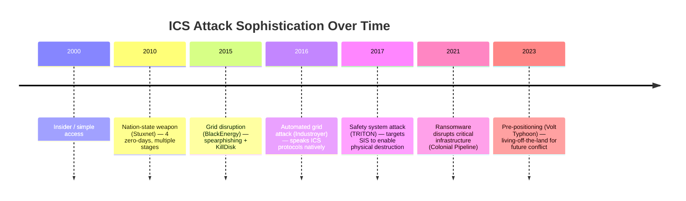
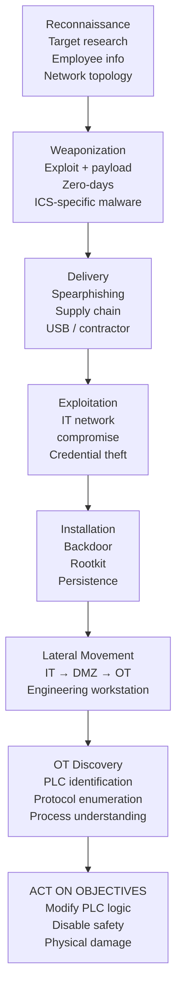
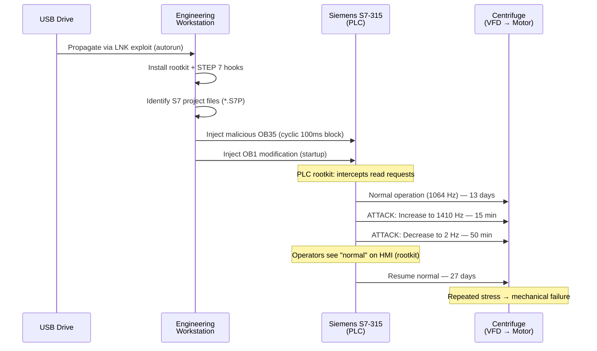
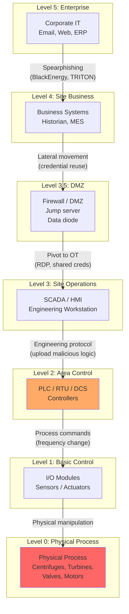
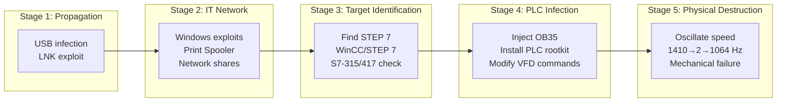

# ICS Attack Case Studies — Stuxnet, TRITON, Industroyer, and Beyond

**Topic:** Major Cyber Attacks on Industrial Control Systems — Tactics, Impact & Lessons  
**Standards:** IEC 62443, NIST SP 800-82, NERC CIP, MITRE ATT&CK for ICS  
**SDO:** CISA, ICS-CERT, MITRE, NIST, ENISA  
**Audience:** OT security engineers, ICS security analysts, CISO/plant managers, incident response teams  
**Prerequisites:** ICS/SCADA architecture fundamentals, Purdue Model, basic networking

---

## Chapter 1 — Historical Context & Origin Story

### 1.1 Timeline of Major ICS Attacks

| Year | Attack | Target | Impact |
|------|--------|--------|--------|
| 2000 | Maroochy Shire (Australia) | Sewage system | 800,000L raw sewage released (insider) |
| 2010 | **Stuxnet** | Iran Natanz centrifuges | ~1,000 centrifuges destroyed |
| 2014 | German Steel Mill (BSI) | Blast furnace | Physical destruction — could not shut down |
| 2014 | Havex / Dragonfly | Energy sector (supply chain) | Espionage via trojanized vendor software |
| 2015 | **BlackEnergy** | Ukraine power grid (3 utilities) | 230,000 customers lost power (6 hours) |
| 2016 | **Industroyer/CrashOverride** | Ukraine Ukrenergo substation | Automated grid attack — power outage |
| 2017 | **TRITON/TRISIS** | Saudi Arabia petrochemical (SIS) | Targeted Safety Instrumented System |
| 2019 | EKANS/Snake Ransomware | Honda, Enel, others | ICS-aware ransomware (kills OT processes) |
| 2021 | **Oldsmar** | Florida water treatment | Attempted increase NaOH to 11,100 ppm |
| 2021 | **Colonial Pipeline** | US fuel pipeline | 5,500-mile pipeline shut down (ransomware) |
| 2022 | Industroyer2 | Ukraine (Sandworm/GRU) | Attempted grid attack (thwarted) |
| 2023 | **Volt Typhoon** | US critical infrastructure | China pre-positioning for disruption |
| 2023 | CyberAv3ngers | US water systems (Unitronics) | Iranian-linked, exploited default passwords |

### 1.2 Attack Evolution



---

## Chapter 2 — Attack Framework & Taxonomy

### 2.1 MITRE ATT&CK for ICS Tactics

| Tactic | Description | Examples |
|--------|-------------|---------|
| Initial Access | Entry into OT network | Spearphishing, supply chain compromise, VPN exploitation |
| Execution | Running malicious code | Script execution, engineering workstation compromise |
| Persistence | Maintaining access | Firmware modification, hardcoded credentials |
| Evasion | Avoiding detection | Rootkit (Stuxnet), mimicking legitimate traffic |
| Discovery | Mapping OT assets | Network scanning, PLC/RTU enumeration |
| Lateral Movement | Pivoting through OT | RDP, SMB, shared credentials |
| Collection | Gathering intelligence | OPC data capture, historian extraction |
| Command & Control | Remote control | Encrypted channels, legitimate cloud services |
| Inhibit Response | Preventing response | Disabling alarms, historian manipulation, blocking HMI |
| Impair Process Control | Manipulating process | Modify setpoints, send unauthorized commands |
| Impact | Physical damage/disruption | Equipment destruction, safety system bypass, outage |

### 2.2 ICS Kill Chain (Adapted)



---

## Chapter 3 — Technical Deep Dive (Major Attacks)

### 3.1 Stuxnet (2010)

| Aspect | Detail |
|--------|--------|
| Target | Iran Natanz uranium enrichment — Siemens S7-315/S7-417 PLCs |
| Attribution | US/Israel (Operation Olympic Games) |
| Zero-days | 4 Windows zero-days (LNK, Print Spooler, Win32k, Task Scheduler) |
| Propagation | USB drive → LAN → STEP 7 project infection → PLC upload |
| PLC attack | Modified OB35 (100ms cyclic interrupt) to change centrifuge speed |
| Speed manipulation | Normal: 1,064 Hz. Attack: oscillated 1,410 Hz → 2 Hz → 1,064 Hz |
| Stealth | Rootkit on PLC: intercepted monitoring reads, reported normal values |
| Damage | ~1,000 IR-1 centrifuges destroyed (mechanical failure from resonance) |
| Sophistication | 500KB+ code, multiple modules, valid stolen certificates |
| Lesson | Air-gapped networks are not immune; supply chain is attack vector |

**Attack Sequence:**



### 3.2 TRITON/TRISIS (2017)

| Aspect | Detail |
|--------|--------|
| Target | Saudi Arabian petrochemical plant — Schneider Triconex SIS |
| Attribution | Russia (TEMP.Veles / XENOTIME / Central Scientific Research Institute) |
| Goal | Disable Safety Instrumented System to enable physical destruction |
| Entry | IT network compromise → lateral movement → engineering workstation |
| Payload | Custom framework (TRITON) to communicate with Triconex via TriStation protocol |
| Attack | Replaced SIS logic to allow unsafe conditions without shutdown |
| Discovery | SIS entered safe state (firmware bug in payload) — triggered investigation |
| Implication | First known attack on a safety system — intent to cause catastrophic damage |
| Near-miss | If successful: explosion/toxic release (no safety shutdown) |

**TRITON Architecture:**

```mermaid
graph TB
    subgraph "Attacker"
        C2[Command & Control<br/>(external)]
    end
    
    subgraph "IT Network"
        IT[Compromised IT systems<br/>(initial access)]
    end
    
    subgraph "DMZ"
        DMZ[Jump server<br/>(lateral movement)]
    end
    
    subgraph "OT Network"
        EWS[Engineering Workstation<br/>(Triconex TRITON framework)]
    end
    
    subgraph "Safety System"
        SIS[Schneider Triconex<br/>Safety Controller<br/>(Triple Modular Redundant)]
    end
    
    C2 -->|"Remote access"| IT
    IT -->|"Credential theft"| DMZ
    DMZ -->|"RDP / lateral"| EWS
    EWS -->|"TriStation protocol<br/>(proprietary, no auth)"| SIS
    
    style SIS fill:#ff6666
```

### 3.3 Industroyer/CrashOverride (2016)

| Aspect | Detail |
|--------|--------|
| Target | Ukraine Ukrenergo transmission substation (Pivnichna 330kV) |
| Attribution | Russia (Sandworm / GRU Unit 74455) |
| Innovation | Speaks native ICS protocols: IEC 60870-5-101, IEC 60870-5-104, IEC 61850, OPC DA |
| Attack | Opened circuit breakers via protocol commands (automated) |
| Wiper | Deployed wiper malware (to destroy evidence + prevent remote recovery) |
| Impact | ~75 minutes power outage (manual restoration required) |
| Significance | Most sophisticated grid-targeting malware (modular, protocol-aware) |
| Lesson | ICS protocols have NO authentication — any network access = control |

### 3.4 Colonial Pipeline (2021)

| Aspect | Detail |
|--------|--------|
| Target | Colonial Pipeline (5,500 miles — 45% US East Coast fuel supply) |
| Attacker | DarkSide ransomware gang (Russia-based criminal) |
| Entry | Compromised VPN password (single-factor, possibly reused/leaked) |
| Impact | 6-day pipeline shutdown, fuel shortages, $4.4M ransom paid |
| Note | OT systems NOT directly attacked — IT shutdown led to OT shutdown |
| Lesson | IT/OT interdependence; lack of segmentation means IT attack = OT impact |
| Policy impact | DHS/TSA Pipeline Security Directive (mandatory requirements) |

### 3.5 Volt Typhoon (2023-present)

| Aspect | Detail |
|--------|--------|
| Attribution | China (PRC state-sponsored APT) |
| Target | US critical infrastructure (water, energy, telecom, transportation) |
| Technique | Living-off-the-land (LOTL): uses legitimate OS tools (no custom malware) |
| Entry | Known vulnerabilities in internet-facing devices (Fortinet, Citrix, Cisco) |
| Goal | Pre-positioning for future conflict (not immediate damage) |
| Dwell time | 5+ years in some networks (undetected) |
| Impact | Capability to disrupt critical infrastructure during geopolitical crisis |
| Lesson | Continuous monitoring essential; patching perimeter devices critical |

---

## Chapter 4 — Implementation Guide (Defensive)

### 4.1 ICS-Specific Defense Strategies

| Attack Pattern | Defense |
|----------------|---------|
| Spearphishing (initial access) | Security awareness training, email filtering, sandboxing |
| VPN/remote access exploitation | MFA on ALL remote access, VPN segmentation, zero trust |
| Lateral movement (IT→OT) | Network segmentation (zones/conduits per IEC 62443) |
| Engineering workstation compromise | Hardened workstations, application whitelisting, USB control |
| PLC logic modification | Change detection, code signing (where available), monitoring |
| Protocol exploitation (no auth) | Network monitoring (DPI for ICS protocols), access control |
| Safety system attack | Separate safety network, physical key switches, monitoring |
| Supply chain compromise | Vendor assessment, SBOM, integrity verification |
| Living-off-the-land | Behavioral monitoring, endpoint detection, log analysis |
| Ransomware | Offline backups, network segmentation, incident response plan |

### 4.2 Detection Methods

| Detection Type | Tools/Techniques |
|----------------|-----------------|
| Network monitoring | Dragos Platform, Nozomi Guardian, Claroty, Darktrace OT |
| PLC logic monitoring | Verify PLC program hash, configuration change alerts |
| Protocol deep inspection | Monitor for unauthorized ICS protocol commands |
| Anomaly detection | Baseline process values, alert on deviations |
| Endpoint detection | CrowdStrike Falcon for OT, SentinelOne |
| Log analysis | SIEM with OT-specific parsers (Splunk, QRadar) |
| Threat intelligence | CISA ICS-CERT advisories, Dragos threat intel |
| Asset inventory | Automated OT asset discovery (passive scanning only!) |

---

## Chapter 5 — Compliance & Regulatory Response

### 5.1 Regulatory Impact of Major Attacks

| Attack | Regulatory Response |
|--------|-------------------|
| Stuxnet (2010) | Heightened focus on nuclear facility cybersecurity (IAEA) |
| Ukraine 2015/2016 | EU NIS Directive (2016), increased grid security requirements |
| TRITON (2017) | CISA alerts on SIS security, safety system isolation guidance |
| Colonial Pipeline (2021) | TSA Pipeline Security Directive (2021), mandatory requirements |
| Oldsmar (2021) | CISA water/wastewater guidance, EPA proposed cyber requirements |
| Volt Typhoon (2023) | Executive orders on critical infrastructure, CISA BOD 23-02 |
| CyberAv3ngers (2023) | CISA advisory on Unitronics PLCs, default credential elimination |

### 5.2 Standards & Frameworks

| Standard | Scope |
|----------|-------|
| IEC 62443 | Industrial automation & control system security |
| NIST SP 800-82 | Guide to ICS Security (rev 3) |
| NERC CIP (v5-7) | North American electric grid (mandatory) |
| TSA Pipeline Directive | US pipeline operators (mandatory since 2021) |
| NIS2 Directive (EU) | EU critical infrastructure cybersecurity (2024) |
| NIST CSF 2.0 | Cybersecurity Framework (voluntary, widely adopted) |
| MITRE ATT&CK for ICS | Threat modeling and detection framework |

---

## Chapter 6 — Regional & Domain Variants

| Sector | Major Attack Examples | Primary Threat |
|--------|----------------------|----------------|
| Electric Grid | BlackEnergy, Industroyer, Industroyer2 | Russia (Sandworm) |
| Oil & Gas | TRITON, Shamoon, Colonial Pipeline | Russia, Iran, criminal |
| Water/Wastewater | Oldsmar, CyberAv3ngers | Iran, opportunistic |
| Nuclear | Stuxnet | Nation-state (US/Israel) |
| Manufacturing | EKANS, NotPetya (Maersk, Merck) | Russia, criminal |
| Transportation | Ukraine railways (2022) | Russia |
| Telecom | Volt Typhoon | China |
| Defense/Government | SolarWinds (IT, fed into OT awareness) | Russia (SVR) |

---

## Chapter 7 — Comparison of Attack Sophistication

| Dimension | Stuxnet | TRITON | Industroyer | Colonial Pipeline | Volt Typhoon |
|-----------|---------|--------|-------------|-------------------|--------------|
| Attacker | Nation-state (US/IL) | Nation-state (RU) | Nation-state (RU) | Criminal | Nation-state (CN) |
| Objective | Destroy centrifuges | Enable explosion | Grid outage | Ransom ($$$) | Pre-position |
| Sophistication | Extreme (4 zero-days) | Very high (SIS-specific) | High (ICS protocols) | Low (VPN password) | Medium (LOTL) |
| Custom malware | Yes (500KB+) | Yes (TRITON framework) | Yes (modular) | No (ransomware-as-service) | No (living-off-the-land) |
| ICS knowledge | Deep (S7 PLC + physics) | Deep (Triconex SIS) | Deep (grid protocols) | None (IT only) | Limited (reconnaissance) |
| Physical damage | Yes (centrifuges) | Attempted (prevented) | Temporary (outage) | None (IT → OT shutdown) | Potential (future) |
| Detection difficulty | Very hard (rootkit) | Accidental (SIS fault) | Post-incident | Easy (ransomware note) | Very hard (LOTL) |
| Dwell time | ~1 year | Months | Months | Days | 5+ years |
| Recovery | Months | Days (SIS failsafe) | Hours (manual) | Days | Ongoing |

---

## Chapter 8 — Mermaid Architecture Diagrams

### 8.1 ICS Attack Vectors (Purdue Model)



### 8.2 Stuxnet Multi-Stage Attack



---

## Chapter 9 — Case Studies — Lessons Learned

### 9.1 TRITON — Why Safety Systems Need Isolation

| Lesson | Detail |
|--------|--------|
| **SIS must be isolated** | SIS engineering workstation was on same network as DCS |
| **TriStation had no authentication** | Proprietary protocol, security through obscurity failed |
| **Physical key switches matter** | Triconex key in "PROGRAM" mode allowed remote logic changes |
| **Network monitoring would detect** | TriStation traffic on OT network was unusual (would trigger alert) |
| **Defense-in-depth** | Single point of failure: if EWS compromised, SIS compromised |
| **Accidental detection** | Bug in attacker's code caused SIS fault → investigation → discovery |
| **Implication** | If attack succeeded: no safety shutdown during hazardous event → explosion |

### 9.2 Colonial Pipeline — IT/OT Dependency

| Lesson | Detail |
|--------|--------|
| **Single-factor VPN** | Entry was one compromised password (no MFA) |
| **IT shutdown → OT impact** | OT was not directly attacked but shut down "out of caution" |
| **No OT visibility** | Company couldn't verify OT was safe → precautionary shutdown |
| **Segmentation failure** | Billing systems (IT) intertwined with pipeline operations |
| **Backup strategy** | $4.4M paid because recovery from backup would take too long |
| **$2.3M recovered** | FBI traced Bitcoin wallet (partial recovery) |
| **Policy result** | TSA mandatory pipeline security requirements (first-ever) |

### 9.3 Volt Typhoon — The Pre-Positioning Threat

| Lesson | Detail |
|--------|--------|
| **Living-off-the-land** | No custom malware — uses built-in OS tools (PowerShell, WMI, netsh) |
| **Perimeter devices** | Entry via known vulnerabilities in edge appliances (Fortinet, Citrix) |
| **Long dwell time** | 5+ years undetected (very patient adversary) |
| **Strategic intent** | Not stealing data — preparing capability for future conflict |
| **Detection challenge** | Standard EDR/antivirus won't detect legitimate tool usage |
| **Response** | Requires behavioral monitoring, threat hunting, zero trust architecture |
| **Geopolitical** | Taiwan contingency — disrupt US military logistics infrastructure |

---

## Chapter 10 — Future Evolution & Threat Trends

| Trend | Timeline | Description |
|-------|----------|-------------|
| AI-powered attacks | Emerging | LLM for reconnaissance, automated exploit generation |
| Ransomware → OT direct | Growing | ICS-aware ransomware (not just encrypting IT files) |
| Safety system targeting | Growing | TRITON was first; expect more SIS attacks |
| Supply chain compromise | Growing | Firmware backdoors, trojanized updates (SolarWinds model) |
| Cloud/OT convergence risk | Growing | Cloud-connected OT creates new attack surface |
| Pre-positioning (nation-state) | Now | Volt Typhoon model — dormant until activated |
| Destructive attacks on scale | Potential | Coordinated multi-utility attack (grid collapse scenario) |
| Autonomous OT attack tools | Research | Fully automated PLC exploitation frameworks |
| OT-specific ransomware | Growing | EKANS/Snake model — kills ICS processes before encrypting |
| Satellite/space systems | Emerging | Attacks on satellite ground stations (e.g., Viasat 2022) |
| Quantum computing | 2030+ | Decrypt intercepted ICS communications retroactively |

---

## Chapter 11 — Interview Questions & Career Guide

### Tier 1: Entry-Level

**Q1:** Describe how Stuxnet attacked the Iranian nuclear facility. What made it unique?  
**A:** **Entry method:** Spread via USB drives (air-gapped network → USB was only vector). Used 4 Windows zero-day exploits for propagation. Legitimate digital certificates (stolen from Realtek/JMicron) to sign drivers. **Target identification:** Only activated on systems with Siemens STEP 7/WinCC. Further filtered: only attacked S7-315 connected to Vacon/Fararo Paya variable frequency drives (VFDs). If not exact target configuration → remained dormant. **PLC attack (the actual weapon):** Injected malicious code into OB35 (100ms cyclic block) and OB1 (main program). Modified VFD frequency commands: normally 1,064 Hz, periodically oscillated to 1,410 Hz then 2 Hz. Each cycle lasted ~minutes; repeated over months (slow, intermittent damage). **Stealth (PLC rootkit):** Intercepted any read requests from STEP 7 to the PLC. Returned "clean" code to monitoring systems (operators saw normal program). Process values on HMI showed normal operation. **Result:** ~1,000 centrifuges destroyed (bearings/rotors failed from stress). Iranian engineers blamed manufacturing quality for months. **What made it unique:** (1) First known cyberweapon causing physical destruction. (2) Extreme target precision (only Iran's specific centrifuge configuration). (3) Multi-year development (estimated $1M+ and cross-agency collaboration). (4) PLC-level rootkit (never seen before). (5) Demonstrated that cyber can achieve military objectives without kinetic strike.

### Tier 2: Mid-Level

**Q2:** After the TRITON/TRISIS incident, what changes would you recommend to protect Safety Instrumented Systems?  
**A:** **1. Network isolation for SIS:** Physically separate SIS network from DCS/control network. Dedicated firewall with deny-all + explicit allow rules (only SIS engineering traffic). NO shared switches, cables, or VLANs between SIS and DCS. Unidirectional gateway (data diode) for SIS monitoring data → out only. **2. Engineering workstation hardening:** Dedicated SIS engineering workstation (NOT shared with DCS). Application whitelisting (only Triconex/SIS engineering software). Removed/disabled USB ports (or strict USB control). Full disk encryption + BitLocker. No internet access, no email client. **3. Physical controls:** Triconex key switch: ALWAYS in "RUN" mode (not "PROGRAM") during operations. "PROGRAM" mode only during authorized maintenance windows. Document who has key access (physical security). **4. Authentication & access control:** Network access control (802.1X) on SIS network segment. Multi-factor authentication for SIS engineering software access. Role-based access: only certified SIS engineers can modify logic. Audit trail: log ALL connections to SIS controllers. **5. Monitoring & detection:** Deploy OT-specific IDS on SIS network (e.g., Claroty, Dragos). Alert on ANY TriStation protocol traffic (should be rare). Monitor for new connections to SIS controller IP addresses. Baseline legitimate traffic patterns; alert on anomalies. **6. Change management:** Safety program changes require: MOC (Management of Change) process. Independent verification (V&V) of any SIS logic modification. Comparison of SIS program against known-good baseline (checksum). Regular SIS program integrity checks (automated hash comparison). **7. Supply chain:** Verify firmware integrity of SIS controllers. Monitor vendor security advisories (Schneider PSIRT). Test patches in staging environment before production SIS. **8. Incident response:** SIS-specific incident response plan. If SIS compromise suspected: IMMEDIATELY initiate safe shutdown via separate means. Preserve forensic evidence (memory dumps, network captures). **9. Standards compliance:** IEC 62443-3-3 SR 5.1 (network segmentation). IEC 61511 (SIS lifecycle safety — clause 11 addresses cybersecurity). ISA-TR84.00.09 (cybersecurity for SIS).

### Tier 3: Senior

**Q3:** You're the OT Security Architect for a utility operating 50 substations. Based on Industroyer/CrashOverride TTPs, design a detection and response strategy.  
**A:** **Industroyer TTPs to defend against:** (1) Speaks native ICS protocols (IEC 60870-5-101, 104, IEC 61850, OPC DA). (2) Opens circuit breakers via legitimate protocol commands. (3) Deploys wiper to destroy evidence and prevent remote recovery. (4) Disables protective relays during attack. (5) Modular architecture: different payloads for different substations. **Detection strategy:** (A) **Protocol-level monitoring (each substation):** Deploy passive network sensor (Dragos/Nozomi) on SPAN port of OT switch. Deep packet inspection for IEC 104/61850: alert on unauthorized commands. Baseline: which IP addresses send control commands to RTUs/relays. Alert on: new source IP issuing breaker open commands. Alert on: unusual timing of switching operations (outside maintenance window). Alert on: bulk/sequential breaker operations (Industroyer opened many in sequence). (B) **Behavioral analytics:** Correlate SCADA events with expected operations (outage management system). If breaker opens without corresponding work order → immediate alert. Time-of-day analysis: operations at 3 AM with no scheduled maintenance = suspicious. Velocity check: >N breakers opening within T seconds → automated alert + operator call. (C) **Endpoint detection (engineering workstations + SCADA servers):** Application whitelisting (only authorized SCADA software + OS processes). Monitor for: new executables, unknown DLLs, unsigned drivers. File integrity monitoring on SCADA application directories. Watch for: data exfiltration patterns, wiper indicators (rapid file overwriting). (D) **Network segmentation monitoring:** Each substation: separate VPN/MPLS segment to control center. Inter-substation traffic: should be ZERO (alert if any detected). IT→OT boundary: full packet capture on DMZ interfaces. DNS monitoring: SCADA systems should NOT make external DNS queries. (E) **Wiper detection:** Monitor for: rapid sequential file deletion or overwriting. Volume Shadow Copy deletion (common wiper precursor). Registry key modifications disabling Windows recovery. **Response strategy:** (1) **Automated response (high-confidence alerts):** If mass breaker operations detected: immediately alert operators + switch to manual control. Isolate affected substation network (automated firewall rule). Alert neighboring substations to heightened readiness. (2) **Manual response escalation:** < 5 min: Security analyst validates alert, confirms IOCs. < 15 min: Incident commander decision on network isolation scope. < 30 min: Coordination with grid operator for load management. < 1 hour: If confirmed attack → disconnect all remote access, switch ALL to local. (3) **Recovery:** Pre-positioned clean backups of all RTU/relay configurations (offline). Ability to operate ALL 50 substations in local (manual) mode. Hardened recovery images for SCADA servers (known-good state). Practice: tabletop exercises quarterly, live recovery drill annually. (4) **Architecture improvements:** Each substation: local HMI/control capability (survives network loss). Control center: redundant (primary + backup at separate location). Communication: diverse paths (fiber + radio backup). Protective relay settings: locally locked (requires physical access to change). IEC 62351 (authentication for IEC 61850/104 — where supported). Network recorder: 30-day full packet capture for forensics. (5) **Threat intelligence integration:** Subscribe to CISA ICS-CERT, Dragos WorldView, E-ISAC. Correlate known Sandworm indicators with internal logs (YARA rules, Snort sigs). Hunt quarterly for known Industroyer/Industroyer2 indicators.

---

## Chapter 12 — Cheat Sheet & Quick Reference

### Major ICS Attacks Summary

```
STUXNET (2010)
  Target: Iran nuclear centrifuges (Siemens S7-315/417)
  Method: USB → Windows exploits → STEP 7 → PLC rootkit → VFD manipulation
  Impact: ~1000 centrifuges destroyed
  Lesson: Air gap doesn't protect; supply chain is vector

TRITON/TRISIS (2017)
  Target: Saudi petrochemical Safety Instrumented System (Schneider Triconex)
  Method: IT → OT → engineering workstation → TriStation → SIS logic replacement
  Impact: Near-miss (SIS failsafe triggered accidentally)
  Lesson: Isolate SIS; physical key switches; no auth in protocols

INDUSTROYER (2016)
  Target: Ukraine power grid (IEC 104, IEC 61850, OPC DA)
  Method: Malware speaks native ICS protocols → opens circuit breakers
  Impact: ~75 min outage at transmission level
  Lesson: ICS protocols have NO authentication; network access = control

COLONIAL PIPELINE (2021)
  Target: US fuel pipeline (IT ransomware → OT precautionary shutdown)
  Method: Compromised VPN (single-factor, leaked credential)
  Impact: 6-day shutdown, fuel shortages, $4.4M ransom
  Lesson: MFA everywhere; IT/OT segmentation; tested backups

VOLT TYPHOON (2023+)
  Target: US critical infrastructure (water, energy, telecom)
  Method: Living-off-the-land (legitimate OS tools, no custom malware)
  Impact: Pre-positioned for future disruption (5+ year dwell)
  Lesson: Behavioral monitoring; patch perimeter; hunt proactively
```

### ICS Defense Priority Actions

```
1. Network segmentation (IT/OT/SIS separation)
2. Multi-factor authentication on ALL remote access
3. OT-specific network monitoring (passive, protocol-aware)
4. Patch perimeter/edge devices (VPN, firewalls, gateways)
5. Disable default credentials (EVERY device)
6. Application whitelisting on engineering workstations
7. Offline/tested backups (30-day recovery capability)
8. PLC/RTU program integrity monitoring
9. Incident response plan (OT-specific, rehearsed)
10. Threat intelligence (CISA ICS-CERT, sector ISAC)
```

### MITRE ATT&CK for ICS — Key Techniques

```
Technique ID   Name                        Example Attack
T0817          Drive-by Compromise          Watering hole (Dragonfly)
T0862          Supply Chain Compromise      Havex, SolarWinds
T0886          Remote Services              Colonial Pipeline (VPN)
T0855          Unauthorized Command         Industroyer (open breaker)
T0836          Modify Parameter             Stuxnet (speed setpoint)
T0857          System Firmware              Stuxnet PLC rootkit
T0881          Service Stop                 EKANS (kill ICS processes)
T0882          Theft of Operational Info    Reconnaissance phase
T0879          Damage to Property           Stuxnet centrifuges
T0880          Loss of Safety               TRITON SIS attack
```

---

*End of Document — 08_ICS_Attack_Case_Studies.md*
