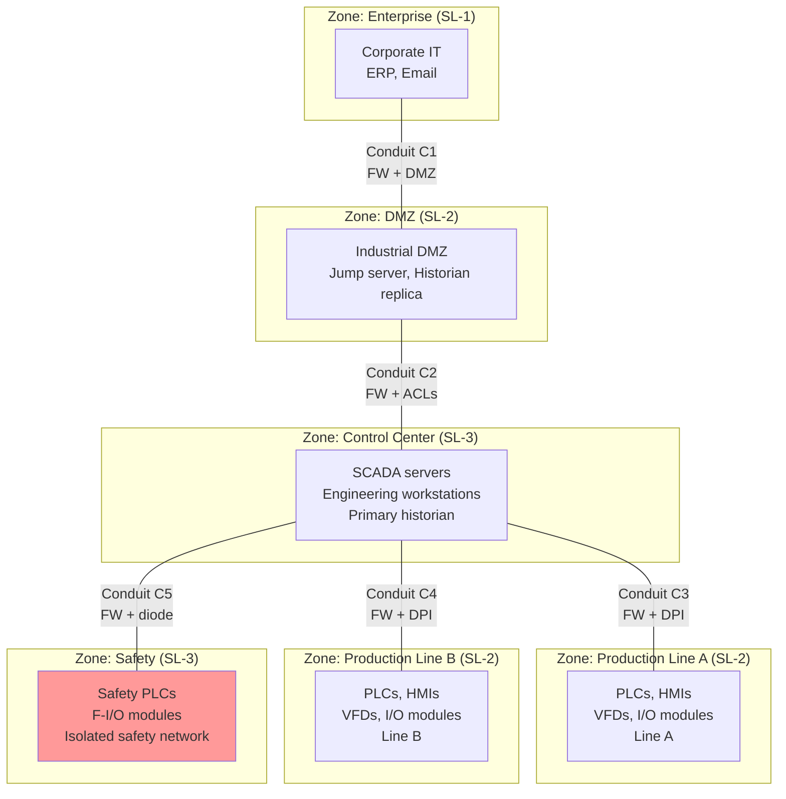
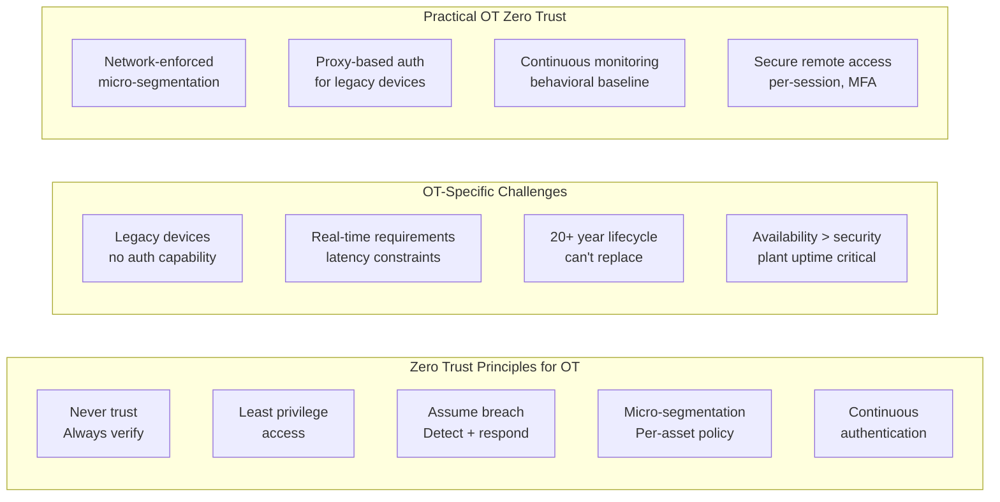

# OT Security Architecture — Defense-in-Depth, Zones, Conduits & Monitoring

**Topic:** Operational Technology Security Architecture, Network Segmentation & Continuous Monitoring  
**Standards:** IEC 62443, NIST SP 800-82, ISA/IEC 62443-3-2 (Zones & Conduits), NERC CIP  
**SDO:** ISA/IEC, NIST, CISA, NERC (electric sector)  
**Audience:** OT security architects, network engineers, ICS security analysts, CISO teams  
**Prerequisites:** Purdue Model, TCP/IP networking, ICS/SCADA basics, IEC 62443 fundamentals

---

## Chapter 1 — Historical Context & Origin Story

### 1.1 Timeline

| Year | Event |
|------|-------|
| 1995 | Purdue Reference Model (ISA-95) published — defines OT network levels |
| 2003 | NIST SP 800-82 Rev 0 (first US government ICS security guide) |
| 2007 | IEC 62443 development begins (formerly ISA-99) |
| 2009 | NERC CIP v1 enforced (mandatory for electric utilities) |
| 2013 | IEC 62443-3-2 (Security risk assessment, zones & conduits) |
| 2015 | Ukraine grid attack → renewed focus on OT segmentation |
| 2017 | TRITON → SIS isolation becomes critical requirement |
| 2019 | NIST SP 800-82 Rev 3 draft (updated guidance) |
| 2020 | Dragos/Nozomi/Claroty mainstream adoption in critical infrastructure |
| 2021 | Colonial Pipeline → TSA Pipeline Security Directive |
| 2022 | Zero Trust for OT concept papers (CISA, NIST) |
| 2023 | CISA Cross-Sector CPGs (Cybersecurity Performance Goals) |
| 2024 | OT-specific SIEM/SOAR platforms mature |

### 1.2 Evolution of OT Security Thinking

| Era | Approach | Assumption |
|-----|----------|-----------|
| Pre-2010 | Air gap | OT is isolated from IT; security not needed |
| 2010-2015 | Perimeter defense | Firewall between IT and OT is sufficient |
| 2015-2020 | Defense-in-depth | Multiple layers; zones and conduits |
| 2020-present | Zero Trust + monitoring | Assume breach; continuous verification; visibility |

---

## Chapter 2 — Standard Architecture & Structure

### 2.1 Purdue Model (ISA-95/IEC 62264)

```mermaid
graph TB
    subgraph "Level 5: Enterprise Network"
        L5[Internet, Cloud<br/>Corporate email, web<br/>Remote offices]
    end
    
    subgraph "Level 4: Site Business Planning"
        L4[ERP (SAP), email<br/>Business intelligence<br/>IT infrastructure]
    end
    
    subgraph "Level 3.5: Industrial DMZ"
        DMZ[Jump server (hardened)<br/>Historian replica<br/>Patch server<br/>AV update server<br/>Data diode (optional)]
    end
    
    subgraph "Level 3: Site Operations"
        L3[SCADA server<br/>Historian (primary)<br/>Engineering workstation<br/>OT domain controller]
    end
    
    subgraph "Level 2: Area Supervisory"
        L2[HMI stations<br/>PLC/DCS controllers<br/>Area control room]
    end
    
    subgraph "Level 1: Basic Control"
        L1[PLCs, RTUs<br/>Safety controllers (SIS)<br/>Motor drives (VFD)]
    end
    
    subgraph "Level 0: Physical Process"
        L0[Sensors, actuators<br/>Valves, motors, pumps<br/>Physical process]
    end
    
    L5 ---|"Corporate FW"| L4
    L4 ---|"IT/OT FW (DMZ)"| DMZ
    DMZ ---|"OT FW"| L3
    L3 --- L2
    L2 --- L1
    L1 --- L0
```

### 2.2 IEC 62443 Zones & Conduits

| Concept | Definition |
|---------|-----------|
| Zone | Grouping of assets with common security requirements (same SL-T) |
| Conduit | Communication path between zones (controlled, monitored) |
| Security Level (SL) | 1-4 target; determines controls required |
| Channel | Individual communication link within a conduit |

**Zone Properties:**

| Property | Description |
|----------|-------------|
| Zone boundary | Defined perimeter (physical or logical) |
| Security Level Target (SL-T) | Required security level (1-4) |
| Security Level Capability (SL-C) | Achievable level with implemented controls |
| Assets | All devices/software within zone |
| Access points | Controlled entry/exit points |
| Trust level | Internal trust assumptions |

### 2.3 Security Levels (IEC 62443-3-3)

| SL | Threat | Description | Typical Zone |
|----|--------|-------------|-------------|
| SL 1 | Casual/accidental | Prevent unintentional violations | Remote I/O, field instruments |
| SL 2 | Intentional (low resources) | Prevent intentional attack with simple means | Control system (L2-L3) |
| SL 3 | Intentional (moderate resources) | Prevent sophisticated attack with moderate resources | Critical control, SIS |
| SL 4 | Intentional (extended resources) | Prevent nation-state level attack | Nuclear, military, highest criticality |

---

## Chapter 3 — Technical Deep Dive

### 3.1 Defense-in-Depth Layers

| Layer | Components | Function |
|-------|-----------|----------|
| Physical security | Locks, cameras, fencing, access cards | Prevent unauthorized physical access |
| Network perimeter | Industrial firewalls, data diodes | Control traffic between zones |
| Network segmentation | VLANs, subnets, ACLs | Isolate zones, limit lateral movement |
| Host security | Whitelisting, patching, hardening | Protect individual endpoints |
| Application security | Authentication, authorization, encryption | Secure ICS applications |
| Data security | Backup, integrity monitoring | Protect configuration and process data |
| Monitoring & detection | IDS/IPS, SIEM, anomaly detection | Detect and respond to threats |
| Policies & procedures | Change management, training, IR plans | Human + process controls |

### 3.2 Industrial DMZ Design

```mermaid
graph LR
    subgraph "IT Network (Level 4-5)"
        IT_SRV[IT Systems<br/>Email, ERP]
    end
    
    subgraph "Industrial DMZ (Level 3.5)"
        FW1[Firewall 1<br/>(IT-facing)]
        JUMP[Jump Server<br/>(MFA + session recording)]
        HIST_R[Historian Replica<br/>(read-only copy)]
        PATCH[Patch Management<br/>(staging server)]
        AV[AV/EDR Update<br/>Server]
        FW2[Firewall 2<br/>(OT-facing)]
    end
    
    subgraph "OT Network (Level 3)"
        OT_SRV[SCADA / Historian<br/>Eng Workstation]
    end
    
    IT_SRV --> FW1
    FW1 --> JUMP
    FW1 --> HIST_R
    JUMP --> FW2
    PATCH --> FW2
    AV --> FW2
    FW2 --> OT_SRV
    
    OT_SRV -->|"Historian push<br/>(one-way)"| HIST_R
```

**DMZ Rules:**

| Rule | Implementation |
|------|---------------|
| No direct IT↔OT traffic | All traffic traverses DMZ (broken path) |
| Initiation direction | OT initiates outbound to DMZ; IT initiates inbound to DMZ |
| No persistent storage of credentials | Jump server has MFA, session-only access |
| Data diode (optional) | Hardware-enforced one-way from OT→DMZ for historian data |
| Separate firewalls | Different vendors/platforms for FW1 and FW2 (defense diversity) |

### 3.3 Network Segmentation Strategies

| Strategy | Method | Use Case |
|----------|--------|----------|
| Physical separation | Separate switches, cables, fiber | SIS isolation, highest security |
| VLAN segmentation | 802.1Q with ACLs | Cost-effective zone separation |
| Firewall per zone | Industrial FW (Fortinet, Palo Alto, Cisco) | Controlled conduits |
| Micro-segmentation | Per-device firewall rules | Critical controllers (newer approach) |
| Data diode | Hardware one-way (Waterfall, Owl, Fox-IT) | Air gap with data export |
| Software-defined | SDN for OT (emerging) | Dynamic segmentation |

### 3.4 Unidirectional Security Gateways (Data Diodes)

| Aspect | Detail |
|--------|--------|
| Principle | Hardware-enforced one-way data transfer (fiber optic TX only, no RX) |
| Use case | Export historian/log data from OT to IT; no return path possible |
| Vendors | Waterfall Security, Owl Cyber Defense, Fox-IT, Advenica |
| Protocols supported | OPC UA, Modbus, syslog, database replication, file transfer |
| Compliance | Required by some nuclear regulations; recommended for SIS |
| Limitation | No bidirectional communication (remote access impossible through diode) |
| Cost | $30K-$100K+ per installation (hardware + software + integration) |

### 3.5 OT-Specific Firewalls

| Feature | Industrial FW | Standard IT FW |
|---------|--------------|---------------|
| ICS protocol inspection | DPI for Modbus, S7, EtherNet/IP, DNP3 | Not available |
| OT-specific rules | Allow read register, block write register | Generic port/IP only |
| Environmental | DIN rail, -40°C to +70°C, no fans | Rack mount, office environment |
| Fail mode | Fail-open option (for availability) | Fail-closed (for security) |
| Latency | <1ms (real-time compatible) | Acceptable for IT workloads |
| Vendors | Fortinet FortiGate Rugged, Palo Alto OT, Cisco IE, Tofino | N/A |

---

## Chapter 4 — Implementation Guide

### 4.1 Zone & Conduit Design Process (IEC 62443-3-2)

| Step | Activity | Output |
|------|----------|--------|
| 1 | Identify system under consideration (SuC) | System scope document |
| 2 | Perform initial risk assessment | Threat/vulnerability identification |
| 3 | Partition into zones | Zone diagram with asset groupings |
| 4 | Define conduits | Conduit specifications (protocols, data flows) |
| 5 | Assign Security Levels (SL-T) | SL per zone (based on risk) |
| 6 | Document requirements | Zone/conduit requirements specification |
| 7 | Select countermeasures | Security controls per zone |
| 8 | Verify SL-C ≥ SL-T | Gap analysis and remediation |

### 4.2 Typical Zone Design (Manufacturing Plant)



### 4.3 OT Monitoring Deployment

| Component | Placement | Function |
|-----------|-----------|----------|
| Network sensor | SPAN/mirror port on OT switches (Level 2-3) | Passive protocol analysis |
| Collector | DMZ or Level 3 | Aggregate sensor data, send to management |
| Management console | Level 4 or DMZ | Analyst UI, alerting, reporting |
| Integration | SIEM (Splunk, QRadar) | Correlate OT alerts with IT security events |
| Asset inventory | Auto-discovered from network sensor | Complete OT asset visibility |

---

## Chapter 5 — Compliance & Standards Mapping

### 5.1 Framework Comparison

| Control Area | IEC 62443 | NIST SP 800-82 | NERC CIP | CISA CPG |
|-------------|-----------|----------------|----------|----------|
| Segmentation | FR 5 (Restricted Data Flow) | 5.5 (Network Architecture) | CIP-005 (ESP/BES) | 2.F (Network Segmentation) |
| Access control | FR 1 (Identification & Auth) | 5.3 (Access Control) | CIP-004/007 | 1.A (MFA) |
| Monitoring | FR 6 (Timely Response) | 5.7 (Monitoring) | CIP-007 (Security Event Monitoring) | 3.A (Logging) |
| Incident response | FR 6 (Timely Response) | 6.0 (Incident Response) | CIP-008 | 4.A (Incident Response) |
| Patching | FR 3 (System Integrity) | 5.4 (Patch Management) | CIP-007-6 R2 | 2.G (Patch Management) |
| Remote access | FR 5 (Restricted Data Flow) | 5.5.2 (Remote Access) | CIP-005-7 | 2.H (Remote Access) |

### 5.2 IEC 62443 Foundational Requirements

| FR | Name | Key Controls |
|----|------|-------------|
| FR 1 | Identification & Authentication Control | Unique accounts, MFA, credential management |
| FR 2 | Use Control | Authorization, role-based access (RBAC) |
| FR 3 | System Integrity | Communication integrity, malware protection |
| FR 4 | Data Confidentiality | Encryption (in transit + at rest where applicable) |
| FR 5 | Restricted Data Flow | Zone boundaries, conduit controls, least privilege |
| FR 6 | Timely Response to Events | Audit logging, monitoring, incident response |
| FR 7 | Resource Availability | Redundancy, DoS protection, backup/recovery |

---

## Chapter 6 — Regional & Domain Variants

| Domain | Regulatory Driver | Specific Architecture Requirements |
|--------|-------------------|-----------------------------------|
| Electric Grid (US) | NERC CIP v5-7 | Electronic Security Perimeter (ESP), BES cyber assets |
| Electric Grid (EU) | NIS2 Directive | Network & Information Systems security |
| Oil & Gas (US) | TSA Pipeline Directive | Network segmentation, MFA, 24/7 monitoring |
| Water | EPA + CISA guidance | Basic segmentation (many small utilities) |
| Nuclear | 10 CFR 73.54 (US), IEC 62645 | Air gap (Level 0-3 isolated), data diodes mandatory |
| Pharmaceutical | 21 CFR Part 11 + GxP | Validated systems, audit trails, integrity |
| Automotive manufacturing | IEC 62443, customer requirements | Segmentation per line; robot safety isolation |
| Chemical | CFATS (US), Seveso (EU) | SIS isolation, integrated safety/security |

---

## Chapter 7 — Comparison of OT Monitoring Platforms

| Dimension | Dragos | Nozomi Networks | Claroty | Microsoft Defender for IoT |
|-----------|--------|-----------------|---------|--------------------------|
| Founded | 2016 | 2013 | 2015 | 2020 (acquired CyberX) |
| Focus | Threat detection + response | Visibility + anomaly detection | Full OT security | Cloud-integrated OT/IoT |
| Deployment | On-premise sensors | On-premise + cloud | On-premise + SaaS | On-premise + Azure |
| Protocol support | 200+ industrial protocols | 200+ protocols | 400+ protocols | 100+ protocols |
| Threat intelligence | Diamond Model (Threat Groups) | N/A (third-party integration) | Limited | Microsoft TI (broad) |
| Key strength | ICS threat expertise | Scalability, AI/ML | Comprehensive platform | Azure/M365 integration |
| Pricing model | Per-sensor + platform | Per-asset | Per-asset | Per-device (Azure subscription) |
| Asset discovery | Passive + active (optional) | Passive + smart polling | Passive + active queries | Passive |
| Integration | Splunk, QRadar, ServiceNow | SIEM, SOAR, firewalls | SIEM, NAC, firewalls | Azure Sentinel, Defender |

---

## Chapter 8 — Mermaid Architecture Diagrams

### 8.1 Complete OT Security Architecture

```mermaid
graph TB
    subgraph "External"
        INET[Internet / Cloud]
        VPN[Remote Access<br/>(MFA + jump server)]
    end
    
    subgraph "IT Network"
        ITSW[IT Core Switch]
        SIEM[SIEM / SOC<br/>(Splunk, QRadar)]
        AD[Active Directory<br/>(IT domain)]
    end
    
    subgraph "Industrial DMZ"
        FW_IT[Firewall (IT-side)<br/>Vendor A]
        JUMP[Jump Server<br/>(MFA, session record)]
        HIST_R[Historian Replica<br/>(one-way sync)]
        PATCH[OT Patch Staging]
        FW_OT[Firewall (OT-side)<br/>Vendor B]
    end
    
    subgraph "OT Network - Level 3"
        OTSW[OT Core Switch]
        SCADA[SCADA Server]
        HIST[Historian (Primary)]
        EWS[Engineering WS<br/>(whitelisting)]
        OT_MON[OT Monitoring<br/>(Dragos/Nozomi sensor)]
        OT_AD[OT Domain Controller<br/>(separate forest)]
    end
    
    subgraph "OT Network - Level 2 (Zone A)"
        SW_A[Zone A Switch]
        PLC_A[PLCs / RTUs]
        HMI_A[HMI Panels]
    end
    
    subgraph "OT Network - Level 2 (Zone B)"
        SW_B[Zone B Switch]
        PLC_B[PLCs / RTUs]
        HMI_B[HMI Panels]
    end
    
    subgraph "Safety Network (Isolated)"
        FW_SIS[Safety Firewall<br/>(or data diode)]
        SIS[Safety PLC<br/>(F-CPU)]
        SIS_IO[F-I/O Modules]
    end
    
    INET --> VPN
    VPN --> FW_IT
    ITSW --> FW_IT
    SIEM --> FW_IT
    FW_IT --> JUMP
    FW_IT --> HIST_R
    FW_IT --> PATCH
    JUMP --> FW_OT
    PATCH --> FW_OT
    FW_OT --> OTSW
    OTSW --> SCADA
    OTSW --> HIST
    OTSW --> EWS
    OTSW --> OT_MON
    OTSW --> SW_A
    OTSW --> SW_B
    SW_A --> PLC_A
    SW_A --> HMI_A
    SW_B --> PLC_B
    SW_B --> HMI_B
    OTSW --> FW_SIS
    FW_SIS --> SIS
    SIS --> SIS_IO
    HIST -->|"One-way push"| HIST_R
    OT_MON -->|"Alerts"| SIEM
    
    style SIS fill:#ff9999
    style FW_SIS fill:#ff9999
```

### 8.2 Zero Trust for OT (Emerging)



---

## Chapter 9 — Case Studies

### 9.1 Electric Utility — NERC CIP Compliant Architecture

| Aspect | Detail |
|--------|--------|
| Organization | US utility with 30 substations + 2 control centers |
| Regulation | NERC CIP v5/v6 (mandatory, enforced with $1M+/day penalties) |
| Architecture | Electronic Security Perimeter (ESP) around BES Cyber Assets |
| DMZ | Dual-firewall DMZ between corporate and control center |
| Remote access | CIP-005: MFA + intermediate system + session monitoring |
| Monitoring | NERC CIP-007: security event monitoring, log retention (90 days) |
| Segmentation | Each substation: separate ESP with defined access points |
| Compliance cost | ~$5-10M initial implementation + $2-3M annual maintenance |
| Audit | Annual self-certification + triennial NERC audit |

### 9.2 Chemical Plant — IEC 62443 Implementation

| Aspect | Detail |
|--------|--------|
| Plant | Large chemical manufacturing (Seveso Tier 2 — EU) |
| Standard | IEC 62443-3-2 (zone/conduit design) + IEC 62443-3-3 (SL verification) |
| Zones defined | 8 zones: Enterprise, DMZ, Control Center, Process Area A/B/C, SIS, Utilities |
| SL assignments | SIS: SL-3; Process Areas: SL-2; DMZ: SL-2; Enterprise: SL-1 |
| SIS isolation | Physical separation (dedicated switches + data diode for monitoring) |
| Monitoring | Nozomi Guardian sensors on each zone boundary (5 sensors total) |
| Key finding | During monitoring deployment, discovered 47 unauthorized connections |
| ROI | Reduced insurance premium by 15% ($800K/year) with certified architecture |
| Timeline | 18 months (design → implementation → verification → certification) |

---

## Chapter 10 — Future Evolution & Industry Trends

| Trend | Timeline | Description |
|-------|----------|-------------|
| Zero Trust for OT | 2024-2027 | Identity-centric (not perimeter-centric) security for OT |
| Cloud-connected OT security | Now | Nozomi/Claroty SaaS, Defender for IoT (Azure) |
| AI-powered threat detection | Growing | ML baselines for process behavior anomaly detection |
| Extended Detection & Response (XDR) for OT | Growing | Converged IT+OT detection in single platform |
| OT SOAR (automation) | Growing | Automated response playbooks for OT incidents |
| Secure Access Service Edge (SASE) for OT | Emerging | Cloud-delivered security for distributed OT sites |
| IEC 62443 Edition 2 | 2024-2025 | Updated standards reflecting cloud, remote access realities |
| Automated compliance | Growing | Continuous compliance monitoring (not annual audit) |
| Quantum-resistant crypto | 2028+ | Post-quantum algorithms for OT communications |
| Digital twin for security testing | Growing | Simulate attacks on digital twin (not live plant) |

---

## Chapter 11 — Interview Questions & Career Guide

### Tier 1: Entry-Level

**Q1:** Explain the Purdue Model and why it's important for OT security.  
**A:** **Purdue Model (ISA-95/IEC 62264):** A reference architecture that divides industrial networks into hierarchical levels. **Levels:** Level 0: Physical process (sensors, actuators, motors, valves). Level 1: Basic control (PLCs, RTUs, safety controllers — direct process control). Level 2: Area supervisory (HMI, area controllers — operator interaction). Level 3: Site operations (SCADA servers, historian, engineering workstations). Level 3.5: Industrial DMZ (buffer zone between IT and OT). Level 4: Site business (ERP, MES, business planning). Level 5: Enterprise/Internet (corporate network, cloud). **Why important for security:** (1) **Segmentation guidance:** Defines WHERE to place security boundaries (between levels). (2) **Traffic flow rules:** Communication should primarily flow vertically between adjacent levels (not skip levels). (3) **DMZ requirement:** Level 3.5 ensures NO direct path exists between IT (L4-5) and OT (L0-3). (4) **Security policies:** Different security requirements at each level (availability priority increases going down). (5) **Risk containment:** If Level 4 (IT) is compromised, the Purdue Model structure prevents direct access to Level 1-2 (controllers). (6) **Common language:** Provides shared vocabulary between OT engineers, IT security, and management for discussing architecture. **Key principle:** No traffic should traverse from Level 5 directly to Level 1. Every connection must pass through appropriate security controls at each boundary.

### Tier 2: Mid-Level

**Q2:** Design the network segmentation for a manufacturing plant with 3 production lines, a safety system, and remote vendor access requirements.  
**A:** **Architecture design:** **Zones (IEC 62443-3-2):** Zone 1 — Enterprise IT (SL-1): Corporate network, ERP, email servers. Zone 2 — Industrial DMZ (SL-2): Jump server (MFA), historian replica, patch staging server, AV update mirror. Zone 3 — Control Center (SL-2): SCADA servers, primary historian, engineering workstations, OT domain controller. Zone 4a — Production Line 1 (SL-2): PLCs, HMIs, VFDs, I/O modules for Line 1. Zone 4b — Production Line 2 (SL-2): PLCs, HMIs, VFDs, I/O modules for Line 2. Zone 4c — Production Line 3 (SL-2): PLCs, HMIs, VFDs, I/O modules for Line 3. Zone 5 — Safety System (SL-3): Safety PLCs (F-CPU), safety I/O (F-modules), physically isolated network. Zone 6 — Vendor Remote Access (SL-2): Isolated jump server in DMZ, time-limited sessions. **Conduits:** C1 (Enterprise → DMZ): Firewall (Vendor A), allow: HTTPS to historian replica, RDP to jump server (with MFA). C2 (DMZ → Control Center): Firewall (Vendor B), allow: engineering tools via jump server, patch distribution, AV updates. C3 (Control Center → Production Lines): Industrial firewall with DPI, allow: S7comm/EtherNet/IP (read+write from SCADA), deny: direct PLC-to-PLC across lines. C4 (Control Center → Safety): Data diode (hardware one-way), safety data export only. No write-back possible. C5 (Production Lines): Inter-line isolated (no direct communication between Line 1↔2↔3). C6 (Vendor Remote): DMZ jump server → vendor-specific VLAN, time-limited (max 4hr), session recorded, pre-approved change ticket required. **Implementation specifics:** Physical separation: Safety zone = dedicated switches and fiber (no shared infrastructure). Production lines: separate VLANs on industrial switches (Layer 3 ACLs between them). DMZ: dual-homed (two firewalls from different vendors). Monitoring: passive network sensor on EACH production line + control center switch (SPAN ports). **Remote vendor access procedure:** (1) Vendor submits change request + maintenance window. (2) Plant operations approves. (3) Vendor authenticates to jump server (MFA). (4) Session is recorded (video + commands). (5) Vendor accesses ONLY their designated device (ACL per vendor). (6) Maximum session: 4 hours, then auto-disconnect. (7) Changes verified by plant engineer after vendor session.

### Tier 3: Senior

**Q3:** You've been asked to implement continuous OT monitoring for a distributed water utility (50 remote sites, limited staff). What architecture and technology would you deploy?  
**A:** **Challenge specifics:** 50 remote pump stations/treatment plants. Limited cybersecurity staff (2-3 people for ALL sites). Budget constrained (public utility). Mix of legacy (Modbus RTU) and modern (Ethernet) equipment. Availability critical (public health). **Architecture:** **1. Sensor deployment strategy:** Tier 1 (10 critical sites — treatment plants): Dedicated network sensor (Nozomi Guardian / Dragos) at each site. Full DPI: Modbus TCP, DNP3, EtherNet/IP, OPC UA. Local storage: 7-day packet capture. Tier 2 (40 remote pump stations): Lightweight sensor / network TAP at each site. Traffic mirrored to central collector via secure tunnel (WireGuard/IPsec). Reduced inspection (focus on known-good baseline deviations). **2. Central architecture:** 
```
[50 Remote Sites] → [Encrypted tunnel] → [Central Collector (DMZ)] → [Management Platform]
                                                                              ↓
                                                                        [SIEM/SOC]
                                                                              ↓
                                                                    [Alert → Analyst (2-3 staff)]
```
Central management console: cloud-hosted SaaS platform (Nozomi Vantage or Claroty xDome). Reduces on-premise infrastructure management burden. Secure connection: sensors → encrypted upload to cloud platform. SOC integration: alerts forward to managed security service provider (MSSP) for 24/7 coverage. **3. Detection priorities (water sector-specific):** Chemical dosing changes: alert if setpoint for chlorine/NaOH exceeds safe range (Oldsmar-type attack). Unauthorized PLC programming: any WRITE to PLC from unexpected source IP. Remote access anomalies: connections outside maintenance windows. HMI command injection: manual valve operations outside normal patterns. RTU communication loss: could indicate tampering or DoS. **4. Staffing model (2-3 people):** Tier 1 (day-to-day): MSSP handles 24/7 alert triage and escalation. Tier 2 (internal): 2 analysts handle escalated alerts, perform weekly threat hunts. Tier 3 (as-needed): Retainer with Dragos/Nozomi for incident response (if major incident). **5. Cost optimization:** Shared infrastructure: single cloud platform for all 50 sites. Managed service: MSSP for 24/7 monitoring ($10-15K/month vs. hiring 5 people). Phased deployment: critical 10 sites first (6 months), remaining 40 (next 12 months). Open-source augmentation: Zeek/Suricata on Linux sensors for budget sites (if needed). **6. Governance:** Alert handling SLA: Critical = 15 min response, High = 1 hour, Medium = 4 hours. Monthly reporting to utility board (executive dashboard). Quarterly tabletop exercise (IR rehearsal). Annual penetration test (OT-safe, non-disruptive). Integration with physical security (camera correlation with cyber alerts). **7. Compliance alignment:** CISA Cross-Sector CPGs (voluntarily adopt — demonstrate due diligence). AWWA (American Water Works Association) cybersecurity guidance. State PUC reporting requirements (if applicable). EPA recommendations (potential future mandate post-CyberAv3ngers).

---

## Chapter 12 — Cheat Sheet & Quick Reference

### Purdue Model Quick Reference

```
Level 5:  Internet / Cloud / Corporate Remote
Level 4:  Enterprise IT (ERP, Email, Business)
  ------- Corporate Firewall -------
Level 3.5: Industrial DMZ (jump server, historian replica, patch staging)
  ------- OT Firewall -------
Level 3:  Site Operations (SCADA, Historian, Engineering WS)
Level 2:  Area Supervisory (HMI, Area Controllers)
Level 1:  Basic Control (PLCs, RTUs, Safety Controllers)
Level 0:  Physical Process (Sensors, Actuators, Motors)
```

### IEC 62443 Zone Design Checklist

```
□ Identify all assets (devices, software, data flows)
□ Group assets by security requirements → zones
□ Assign Security Level Target (SL-T) per zone
□ Define conduits (all inter-zone communication paths)
□ Document allowed protocols/ports per conduit
□ Implement firewalls/ACLs at zone boundaries
□ Deploy monitoring sensors on each conduit
□ Verify SL-Capability ≥ SL-Target (gap analysis)
□ Document residual risk (accepted by asset owner)
□ Schedule periodic review (annually minimum)
```

### OT Monitoring Deployment Checklist

```
□ Asset inventory complete (know what's on the network)
□ Passive sensor deployed (SPAN port, no inline)
□ Protocol baselines established (30-day learning)
□ Alert rules configured (high/med/low severity)
□ Integration with SIEM (forward high-severity)
□ Incident response playbook exists (OT-specific)
□ Staff trained on platform (analyst workflow)
□ False positive tuning complete (reduce noise)
□ Reporting dashboard active (executive + technical)
□ Retention policy defined (packet capture + logs)
```

### Network Segmentation Rules

```
RULE 1: No direct IT ↔ OT traffic (must traverse DMZ)
RULE 2: SIS must be physically isolated from control network
RULE 3: Production zones isolated from each other (no lateral)
RULE 4: Remote access via jump server only (MFA + recording)
RULE 5: All zone boundaries monitored (IDS/sensor)
RULE 6: Default deny on all firewalls (explicit allow only)
RULE 7: Different firewall vendors for IT-side and OT-side
RULE 8: Outbound from OT → DMZ (not IT pulling from OT)
RULE 9: Vendor access: time-limited, pre-approved, recorded
RULE 10: Regular rule review (quarterly) — remove unused rules
```

---

*End of Document — 09_OT_Security_Architecture.md*
