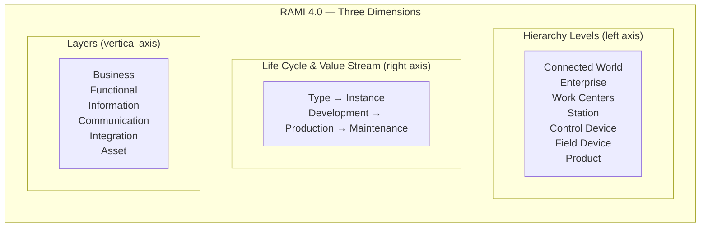

# IT/OT Convergence — Industry 4.0, Edge Computing, Cloud for OT & NAMUR NOA

**Topic:** Information Technology / Operational Technology Convergence, Smart Manufacturing  
**Standards:** NAMUR NOA, RAMI 4.0, IEC 62443, MQTT (ISO/IEC 20922), OPC UA (IEC 62541)  
**SDO:** NAMUR, Plattform Industrie 4.0, IIC (Industrial Internet Consortium), IEEE, IEC  
**Audience:** Automation architects, digital transformation leads, Industry 4.0 engineers, IoT solution architects  
**Prerequisites:** Purdue Model, OT/ICS fundamentals, basic cloud computing, networking concepts

---

## Chapter 1 — Historical Context & Origin Story

### 1.1 Timeline

| Year | Event |
|------|-------|
| 2006 | First "Industry 4.0" concepts discussed (Germany — Hannover Messe) |
| 2011 | Industrie 4.0 officially announced (German government strategy) |
| 2013 | Plattform Industrie 4.0 working group formed |
| 2013 | RAMI 4.0 (Reference Architecture Model) proposed |
| 2014 | Industrial Internet Consortium (IIC) founded (US — GE, IBM, Intel, Cisco) |
| 2015 | NAMUR Open Architecture (NOA) concept introduced |
| 2017 | Edge computing for OT gains traction (fog computing) |
| 2018 | OPC UA over TSN specification development |
| 2019 | 5G Release 16 (URLLC for industrial) |
| 2020 | NAMUR NOA specification published (NE 175, NE 176) |
| 2021 | Industry 5.0 concept (EU — human-centric, sustainable, resilient) |
| 2022 | AWS/Azure/GCP offer dedicated OT connectivity services |
| 2023 | Digital Product Passport (EU regulation for manufacturing) |
| 2024 | Converged IT/OT networks over TSN becoming production-ready |

### 1.2 The IT/OT Convergence Challenge

| Dimension | IT (Information Technology) | OT (Operational Technology) |
|-----------|---------------------------|----------------------------|
| Priority | Confidentiality > Integrity > Availability | Availability > Integrity > Confidentiality |
| Lifecycle | 3-5 years (refresh cycle) | 15-30 years (installed base) |
| Patching | Regular (monthly Patch Tuesday) | Rare (annual shutdown windows) |
| Downtime tolerance | Hours acceptable (maintenance) | Seconds/minutes = production loss |
| Environment | Climate-controlled data center | Factory floor (dust, temp, vibration) |
| Protocols | TCP/IP, HTTP, SQL | Modbus, S7comm, EtherNet/IP, PROFINET |
| Skills | IT administrators, developers | Control engineers, electricians |
| Change management | ITIL, agile | MOC (Management of Change), strict |
| Security model | Zero trust, frequent updates | Air gap, stability-first |
| Vendor relationship | Multi-vendor, interchangeable | Single vendor, long-term (Siemens, Rockwell) |

---

## Chapter 2 — Standard Architecture & Structure

### 2.1 RAMI 4.0 (Reference Architecture Model Industrie 4.0)



### 2.2 NAMUR Open Architecture (NOA)

| Concept | Detail |
|---------|--------|
| Problem | Process industry data trapped in DCS/PLC; can't easily access for analytics |
| Solution | Second (non-intrusive) communication channel for monitoring & optimization |
| Principle | Core Process Control (CPC) remains unchanged; NOA adds a parallel data path |
| Key constraint | NOA channel must NOT affect safety or control (read-only from field) |
| Diode concept | One-way data flow from OT to IT/cloud (Security by design) |
| Transport | OPC UA, MQTT, APL (Advanced Physical Layer — Ethernet to field) |

```mermaid
graph TB
    subgraph "NAMUR NOA Architecture"
        subgraph "Core Process Control (CPC) — UNCHANGED"
            DCS[DCS / Safety System<br/>Existing control<br/>IEC 61511 / IEC 61508]
            FIELD_CPC[Field Devices<br/>(4-20mA / HART / FF)]
        end
        
        subgraph "NOA Channel (Monitoring & Optimization)"
            NOA_GW[NOA Gateway<br/>(one-way / read-only)]
            EDGE[Edge Device<br/>(data aggregation)]
            CLOUD[Cloud/Enterprise<br/>Analytics, ML/AI<br/>Predictive maintenance]
        end
        
        subgraph "NOA Field (Additional Sensors)"
            NOA_FIELD[NOA Sensors<br/>(vibration, acoustic<br/>corrosion — Ethernet-APL)]
        end
    end
    
    FIELD_CPC --> DCS
    FIELD_CPC -->|"HART secondary<br/>(passthrough)"| NOA_GW
    NOA_FIELD -->|"Ethernet-APL<br/>OPC UA"| NOA_GW
    NOA_GW -->|"ONE-WAY<br/>(no write-back)"| EDGE
    EDGE -->|"MQTT / OPC UA<br/>(encrypted)"| CLOUD
    
    style DCS fill:#aaffaa
    style NOA_GW fill:#ffdd88
```

### 2.3 Industry 4.0 vs. Industry 5.0

| Aspect | Industry 4.0 | Industry 5.0 |
|--------|-------------|-------------|
| Focus | Automation, efficiency, data | Human-centricity, sustainability, resilience |
| Technology | IoT, AI, Big Data, Cloud | Human-robot collaboration, circular economy, AI |
| Worker role | Operator of automated systems | Augmented worker (AI-assisted decision making) |
| Sustainability | Not primary concern | Core pillar (EU Green Deal alignment) |
| Resilience | Efficiency optimization | Supply chain resilience, sovereignty |
| Origin | Germany (2011) | EU Commission (2021) |

---

## Chapter 3 — Technical Deep Dive

### 3.1 Edge Computing for OT

| Aspect | Detail |
|--------|--------|
| Definition | Computing at or near the OT data source (factory floor, substation) |
| Purpose | Reduce latency, enable local analytics, reduce cloud bandwidth |
| Form factors | Industrial PC (Beckhoff, Siemens IPC), ruggedized server, gateway |
| Platforms | Azure IoT Edge, AWS Greengrass, Siemens Industrial Edge, AVEVA Edge |
| Use cases | Real-time quality inspection, predictive maintenance, local dashboards |
| Connectivity | Uplink to cloud (MQTT, AMQP), downlink to OT (OPC UA, Modbus) |
| Security | TPM, secure boot, certificate-based auth, encrypted communication |

**Edge Computing Architecture:**

```mermaid
graph LR
    subgraph "Field Level"
        PLC[PLC / Controller]
        SENSOR[Smart Sensors<br/>IO-Link, HART]
    end
    
    subgraph "Edge Level"
        EDGE_DEV[Edge Device<br/>(Industrial PC)]
        EDGE_RT[Edge Runtime<br/>(Docker/K3s)]
        APP1[App: Data Collection<br/>(OPC UA client)]
        APP2[App: ML Inference<br/>(anomaly detection)]
        APP3[App: Local Dashboard<br/>(Grafana)]
    end
    
    subgraph "Cloud Level"
        IOT[IoT Hub / Platform<br/>(Azure/AWS/private)]
        LAKE[Data Lake<br/>(historian + raw)]
        ML[ML Training<br/>(retrain models)]
        DASH[Enterprise Dashboard<br/>(Power BI / Grafana)]
    end
    
    PLC -->|"OPC UA"| APP1
    SENSOR -->|"MQTT"| APP1
    APP1 --> APP2
    APP2 --> APP3
    EDGE_DEV --> EDGE_RT
    EDGE_RT --> APP1
    EDGE_RT --> APP2
    EDGE_RT --> APP3
    
    APP1 -->|"MQTT/AMQP<br/>(filtered data)"| IOT
    IOT --> LAKE
    LAKE --> ML
    ML -->|"Updated model"| APP2
    LAKE --> DASH
```

### 3.2 MQTT for Industrial IoT

| Parameter | Detail |
|-----------|--------|
| Standard | ISO/IEC 20922 (MQTT v3.1.1), OASIS MQTT v5.0 |
| Architecture | Publish/Subscribe via broker (decoupled producers/consumers) |
| QoS levels | 0 (at-most-once), 1 (at-least-once), 2 (exactly-once) |
| Industrial use | Telemetry from edge to cloud, Sparkplug B topic namespace |
| Sparkplug B | Industrial MQTT specification (Eclipse Foundation) — standardized topics, payload, state management |
| Security | TLS 1.3, client certificates, ACLs per topic |
| Brokers | HiveMQ, EMQX, Mosquitto, AWS IoT Core, Azure IoT Hub |
| Bandwidth | Very low overhead (2-byte fixed header minimum) |
| Latency | Sub-second delivery typical |
| NOT suitable for | Real-time control (<10ms), safety-critical communication |

**Sparkplug B Topic Namespace:**

```
spBv1.0/{group_id}/NBIRTH/{edge_node_id}     → Node birth (online announcement)
spBv1.0/{group_id}/NDATA/{edge_node_id}       → Node data (telemetry)
spBv1.0/{group_id}/NDEATH/{edge_node_id}      → Node death (offline)
spBv1.0/{group_id}/DBIRTH/{edge_node_id}/{device_id}  → Device birth
spBv1.0/{group_id}/DDATA/{edge_node_id}/{device_id}   → Device data
spBv1.0/{group_id}/DCMD/{edge_node_id}/{device_id}    → Device command
```

### 3.3 Cloud Connectivity for OT

| Cloud Provider | OT/IoT Service | Key Features |
|---------------|---------------|-------------|
| Microsoft Azure | Azure IoT Hub + Defender for IoT | Device twin, edge runtime, OT monitoring |
| AWS | AWS IoT Core + Greengrass | Rules engine, shadow, local ML |
| Google Cloud | Cloud IoT Core (deprecated) → Chronicle | Data ingestion, analytics |
| Siemens | MindSphere / Insights Hub | Native OT integration, asset management |
| PTC | ThingWorx | Industrial IoT platform, AR integration |
| AVEVA | AVEVA Connect | Process industry digital twin |

### 3.4 5G for Industrial Applications

| 5G Feature | Industrial Relevance |
|------------|---------------------|
| eMBB (enhanced Mobile Broadband) | AR/VR for maintenance, video analytics |
| URLLC (Ultra-Reliable Low-Latency) | Motion control (<1ms, 99.9999% reliability) |
| mMTC (massive Machine Type Communication) | Thousands of sensors per cell |
| Network slicing | Dedicated "slice" for each application type |
| Private 5G (3GPP Release 16+) | On-premise base station (factory-owned) |
| TSN over 5G (research) | Deterministic wireless (future) |
| Security | SIM-based auth, encryption, network isolation |
| Current status | URLLC mostly R&D; eMBB deployed; mMTC growing |

---

## Chapter 4 — Implementation Guide

### 4.1 IT/OT Convergence Maturity Model

| Level | Name | Characteristics |
|-------|------|----------------|
| 1 | Isolated | Air-gapped OT; no connectivity to IT; manual data transfer |
| 2 | Connected | Basic connectivity (historian → IT via DMZ); one-way data |
| 3 | Visible | OT asset inventory; passive monitoring; centralized logging |
| 4 | Integrated | Bidirectional data flow; edge analytics; cloud dashboards |
| 5 | Optimized | AI/ML-driven optimization; digital twin; autonomous operations |

### 4.2 Convergence Implementation Roadmap

| Phase | Duration | Activities |
|-------|----------|-----------|
| Phase 1: Assessment | 3-6 months | OT asset inventory, network mapping, risk assessment |
| Phase 2: Segmentation | 6-12 months | Zone/conduit design, DMZ implementation, monitoring |
| Phase 3: Connectivity | 6-12 months | Edge deployment, OPC UA/MQTT gateways, cloud pilot |
| Phase 4: Analytics | 6-12 months | Data lake, dashboards, first ML models (predictive maintenance) |
| Phase 5: Optimization | Ongoing | Closed-loop optimization, digital twin, advanced AI |

### 4.3 Organizational Changes

| Challenge | Solution |
|-----------|---------|
| IT team doesn't understand OT constraints | Cross-training: IT staff embedded in OT for 3 months |
| OT team fears IT "breaking" their systems | Joint ownership model; OT has veto on changes affecting process |
| Separate budgets | Converged IT/OT budget for shared infrastructure |
| Different tools/vendors | Standardize on platforms spanning both (ServiceNow, Splunk) |
| Conflicting priorities | RACI matrix defining who decides what (availability vs. patching) |
| Reporting structure | Chief Digital Officer or converged CIO/COO role |

---

## Chapter 5 — Security Considerations for Converged Networks

### 5.1 Risks of IT/OT Convergence

| Risk | Example | Mitigation |
|------|---------|-----------|
| Expanded attack surface | Cloud connection exposes OT to internet threats | Zero-trust architecture, MFA, monitoring |
| Lateral movement | IT compromise → pivot to OT via shared network | Segmentation (zones/conduits), micro-segmentation |
| Patching conflicts | IT auto-patching disrupts OT application | Separate patch management; staging + testing for OT |
| Credential reuse | Same AD domain for IT and OT | Separate OT domain (trust but no direct auth path) |
| Shadow OT | Plant engineers deploy unauthorized IoT devices | OT asset discovery (passive scanning), network policies |
| Cloud dependency | Cloud outage → loss of OT analytics/visibility | Edge computing (operate independently if cloud offline) |
| Supply chain | Cloud vendor compromise affects OT data | End-to-end encryption, data sovereignty controls |

### 5.2 Security Architecture for Converged Environment

```mermaid
graph TB
    subgraph "Cloud (SaaS/PaaS)"
        CLOUD_SEC[Cloud Security<br/>CASB, DLP, encryption]
        IOT_HUB[IoT Hub<br/>(device auth, TLS)]
        ANALYTICS[Analytics Platform<br/>(ML/AI)]
    end
    
    subgraph "Corporate IT"
        IT_SEC[IT Security Stack<br/>EDR, SIEM, firewall]
        IT_NET[IT Network]
    end
    
    subgraph "DMZ (IT/OT Boundary)"
        FW_N[Next-Gen Firewall<br/>(DPI for IT & OT protocols)]
        JUMP[Jump Server (MFA)]
        BROKER[MQTT Broker<br/>(DMZ-hosted, ACLs)]
    end
    
    subgraph "OT Network"
        OT_SEC[OT Security<br/>Dragos/Nozomi sensor]
        EDGE[Edge Gateway<br/>(local processing)]
        PLC_NET[Controllers<br/>(PLC/DCS)]
    end
    
    CLOUD_SEC --> IOT_HUB
    IOT_HUB --> ANALYTICS
    
    IT_NET --> IT_SEC
    IT_SEC --> FW_N
    FW_N --> JUMP
    FW_N --> BROKER
    
    BROKER -->|"Publish (one-way)"| IOT_HUB
    EDGE -->|"MQTT TLS"| BROKER
    PLC_NET -->|"OPC UA"| EDGE
    OT_SEC --> PLC_NET
    
    style PLC_NET fill:#aaffaa
```

---

## Chapter 6 — Regional & Domain Variants

| Region/Country | IT/OT Convergence Approach |
|---------------|---------------------------|
| Germany | Industrie 4.0 (RAMI 4.0), strong OT vendor ecosystem (Siemens, Bosch, SAP) |
| USA | Industrial Internet Consortium (IIC), NIST frameworks, cloud-first (AWS/Azure) |
| Japan | Society 5.0, Connected Industries (METI), strong robotics integration |
| China | Made in China 2025, Industrial Internet (state-driven), domestic cloud |
| South Korea | Smart Factory Program (government-subsidized digital transformation) |
| EU (broad) | Industry 5.0 (human-centric + sustainable), Digital Europe Programme |
| Process Industry | NAMUR NOA (conservative, read-only first), Ethernet-APL for field |
| Discrete Manufacturing | MES/MOM integration, real-time OEE dashboards, digital twin |

---

## Chapter 7 — Comparison of Convergence Approaches

| Dimension | NAMUR NOA | Industry 4.0 / RAMI | IIC / IIRA | OPC UA + TSN |
|-----------|-----------|---------------------|-----------|-------------|
| Origin | Process industry (chemical) | German government initiative | US industry consortium | Standards bodies (IEC, OPC Foundation) |
| Philosophy | Read-only (non-intrusive) | Full digital integration | Architecture framework | Converged communication |
| Risk appetite | Very conservative (SIS untouched) | Moderate (pilot-first) | Moderate to high | Technology-driven |
| Security model | One-way (diode principle) | Zones/conduits (IEC 62443) | Security-by-design | Built-in (OPC UA security) |
| Best for | Brownfield process plants | Greenfield smart factories | Cross-industry reference | Network convergence |
| Connectivity | OPC UA + MQTT (via gateway) | Full stack (from ERP to field) | Flexible (any technology) | Deterministic Ethernet |
| Control impact | None (parallel channel only) | Potential (closed-loop AI) | Potential | Direct (real-time control) |
| Adoption | Process industry (growing) | Discrete manufacturing (widespread) | Declining (IIC → DTC) | Growing (standards-driven) |

---

## Chapter 8 — Mermaid Architecture Diagrams

### 8.1 Full IT/OT Converged Architecture

```mermaid
graph TB
    subgraph "Enterprise / Cloud"
        ERP[ERP System<br/>(SAP, Oracle)]
        BI[Business Intelligence<br/>(Power BI)]
        ML_CLOUD[ML Platform<br/>(Azure ML, SageMaker)]
        TWIN[Digital Twin<br/>(simulation)]
    end
    
    subgraph "IT Network"
        MES[MES / MOM<br/>(Manufacturing Operations)]
        SIEM[Security Operations<br/>(SOC + SIEM)]
    end
    
    subgraph "Industrial DMZ"
        MQTT_B[MQTT Broker<br/>(HiveMQ)]
        OPC_AGG[OPC UA Aggregation<br/>Server]
        HIST_R[Historian Replica]
    end
    
    subgraph "Edge Layer"
        EDGE1[Edge Node 1<br/>(Line A — ML inference)]
        EDGE2[Edge Node 2<br/>(Line B — quality AI)]
        EDGE3[Edge Node 3<br/>(Utilities — pred. maintenance)]
    end
    
    subgraph "OT Network — Control"
        SCADA[SCADA / DCS]
        PLC1[PLC Line A]
        PLC2[PLC Line B]
        PLC3[PLC Utilities]
    end
    
    subgraph "Field Level"
        S1[Sensors + Actuators<br/>(Line A)]
        S2[Sensors + Actuators<br/>(Line B)]
        S3[Sensors + Actuators<br/>(Utilities)]
    end
    
    ERP <-->|"API"| MES
    BI <-->|"SQL/API"| HIST_R
    ML_CLOUD -->|"Model deploy"| EDGE1
    ML_CLOUD -->|"Model deploy"| EDGE2
    TWIN <-->|"Simulation data"| OPC_AGG
    
    MES <-->|"Production orders"| OPC_AGG
    SIEM <-->|"OT alerts"| MQTT_B
    
    OPC_AGG <-->|"OPC UA"| SCADA
    MQTT_B <-->|"MQTT TLS"| EDGE1
    MQTT_B <-->|"MQTT TLS"| EDGE2
    MQTT_B <-->|"MQTT TLS"| EDGE3
    
    EDGE1 <-->|"OPC UA"| PLC1
    EDGE2 <-->|"OPC UA"| PLC2
    EDGE3 <-->|"OPC UA"| PLC3
    
    PLC1 <--> S1
    PLC2 <--> S2
    PLC3 <--> S3
    
    SCADA <--> PLC1
    SCADA <--> PLC2
    SCADA <--> PLC3
```

### 8.2 NAMUR NOA — Second Channel Concept

```mermaid
graph TB
    subgraph "Monitoring & Optimization (M+O)"
        CLOUD_MO[Cloud Analytics<br/>Predictive maintenance<br/>Process optimization]
    end
    
    subgraph "NOA Aggregation"
        NOA_SVR[NOA Server<br/>(OPC UA aggregation)]
    end
    
    subgraph "NOA Verification of Request (VoR)"
        VOR[Verification of Request<br/>Human approval for<br/>any write-back]
    end
    
    subgraph "Core Process Control (CPC) — Protected"
        DCS_CTRL[DCS Controller<br/>(unchanged, certified)]
    end
    
    subgraph "Field Level"
        FIELD_EXISTING[Existing instruments<br/>(4-20mA + HART)]
        FIELD_NEW[New NOA sensors<br/>(Ethernet-APL, wireless)]
    end
    
    FIELD_EXISTING -->|"CPC path<br/>(control)"| DCS_CTRL
    FIELD_EXISTING -->|"NOA path<br/>(HART passthrough)"| NOA_SVR
    FIELD_NEW -->|"NOA path only<br/>(monitoring)"| NOA_SVR
    NOA_SVR -->|"Read-only<br/>telemetry"| CLOUD_MO
    CLOUD_MO -->|"Optimization<br/>suggestion"| VOR
    VOR -->|"Approved change<br/>(human verified)"| DCS_CTRL
    
    style DCS_CTRL fill:#aaffaa
    style VOR fill:#ffdd88
```

---

## Chapter 9 — Case Studies

### 9.1 BASF — NAMUR NOA Pilot (Process Industry)

| Aspect | Detail |
|--------|--------|
| Company | BASF (world's largest chemical company) |
| Challenge | 500,000+ field instruments; only 10% of HART data utilized by DCS |
| NOA implementation | HART multiplexer → OPC UA gateway → edge → cloud analytics |
| Use case | Valve predictive maintenance (detect stiction, degradation) |
| Result | 30% reduction in unplanned valve maintenance; $2M annual savings (pilot plant) |
| Scale | Rolling out to 6 large production sites (2024-2026) |
| Key learning | CPC (DCS) completely untouched; NOA adds value without risk |
| Security | One-way gateway (hardware-enforced); OT team accepted because no write-back |

### 9.2 BMW — Discrete Manufacturing Edge + Cloud

| Aspect | Detail |
|--------|--------|
| Company | BMW (automotive OEM — Spartanburg, Munich, Dingolfing plants) |
| Platform | Microsoft Azure + Siemens Industrial Edge |
| Architecture | PLCs → Edge (quality AI) → Azure (analytics, digital twin) |
| Use case 1 | Vision AI for body-in-white weld quality inspection (edge inference <50ms) |
| Use case 2 | Digital twin of paint shop (energy optimization — 15% energy saving) |
| Use case 3 | Predictive maintenance on CNC spindles (vibration ML model) |
| Scale | 3,000+ edge devices across 30 plants |
| Data volume | 1 TB/day per plant uploaded to cloud (filtered at edge) |
| Security | Siemens Industrial Edge hardened runtime + Azure IoT security stack |

---

## Chapter 10 — Future Evolution & Industry Trends

| Trend | Timeline | Description |
|-------|----------|-------------|
| Unified Namespace (UNS) | Now | Single source of truth (MQTT broker as central data bus) |
| Digital twin at scale | 2024-2027 | Physics-based + data-driven twins for every asset |
| Autonomous operations | 2025-2030 | AI-driven closed-loop control (lights-out factories) |
| Ethernet-APL to field | 2024-2026 | 10 Mbit Ethernet to every field instrument (replacing 4-20mA) |
| 5G private networks (production) | 2025+ | Wireless AGVs, mobile robots, flexible manufacturing |
| TSN convergence | 2025-2027 | Single network for control + monitoring + safety (deterministic) |
| Generative AI for OT | Emerging | Natural language plant operations, AI-generated PLC code |
| Sustainable manufacturing | Now | Energy monitoring, carbon tracking, circular economy data |
| Data spaces (Gaia-X, Catena-X) | 2024+ | Sovereign data exchange across supply chain |
| Quantum-safe OT communications | 2028+ | Post-quantum cryptography for long-life OT assets |

---

## Chapter 11 — Interview Questions & Career Guide

### Tier 1: Entry-Level

**Q1:** What are the main challenges of IT/OT convergence and how do organizations typically address them?  
**A:** **Key challenges:** (1) **Different priorities:** IT prioritizes Confidentiality (CIA triad), OT prioritizes Availability (AIC). Patching an OT system requires production shutdown vs. IT servers can reboot anytime. **Solution:** Separate patch management processes; OT patches during planned maintenance only; risk-based prioritization. (2) **Different lifecycles:** IT refreshes every 3-5 years; OT runs 15-30 years. Legacy PLCs (Windows XP-based HMIs) cannot run modern security tools. **Solution:** Compensating controls (network segmentation, application whitelisting instead of patching). (3) **Protocol mismatch:** IT uses TCP/IP, HTTP/REST, SQL. OT uses proprietary protocols (Modbus, S7comm, EtherNet/IP) often without encryption or authentication. **Solution:** Protocol gateways (OPC UA as middleware), deep packet inspection for OT protocols. (4) **Organizational silos:** IT and OT teams report to different executives (CIO vs. VP Operations), have different budgets, different vendors, different skill sets. **Solution:** Cross-functional teams, shared responsibility (RACI), converged governance. (5) **Security culture:** OT teams historically relied on air gap (physical isolation). Connecting to IT/cloud introduces unfamiliar risks. **Solution:** IEC 62443 (provides OT-native security framework), education, start with read-only monitoring (NAMUR NOA approach). (6) **Real-time constraints:** OT often requires deterministic communication (<1ms for motion control). IT tools/services may introduce unacceptable latency. **Solution:** Edge computing (local processing), TSN for deterministic Ethernet, separate control traffic from monitoring traffic. **Typical approach (phased):** Phase 1: Visibility (passive monitoring, asset inventory — no changes to OT). Phase 2: Segmentation (firewalls, zones/conduits — improve security posture). Phase 3: Connectivity (edge + cloud for analytics — non-control data first). Phase 4: Integration (closed-loop optimization — requires extensive validation).

### Tier 2: Mid-Level

**Q2:** Explain NAMUR NOA and why it's considered a safe approach to digitalization in process industries.  
**A:** **NAMUR NOA (Network of Automation — Open Architecture):** A concept developed by NAMUR (user association of automation technology in process industries — members include BASF, Bayer, Shell, Dow). **Problem it solves:** Process plants have millions of field instruments with rich diagnostic data (HART, intelligent devices). But only 5-10% of available data reaches operators/engineers because DCS systems were designed for control, not monitoring. Digitalization requires access to this data for predictive maintenance, optimization, and analytics. **But:** Any change to the certified DCS/SIS control system requires expensive revalidation (IEC 61511, safety concerns). Plant managers refuse to touch working control systems for "nice-to-have" analytics. **NOA solution — Second Channel Principle:** (1) **Core Process Control (CPC):** The existing DCS and Safety System remains COMPLETELY UNCHANGED. No modifications, no additional load, no new connections that could affect control. This is the inviolable principle. (2) **NOA Channel:** A SECOND, PARALLEL communication path that extracts data NON-INTRUSIVELY: HART passthrough (reads diagnostic registers without touching 4-20mA control signal). New sensors (vibration, acoustic, corrosion) connected ONLY to NOA path. OPC UA as information model (structured, interoperable data). (3) **One-way data flow:** NOA channel is designed to be READ-ONLY from the field. Data flows: Field → NOA aggregation → Edge → Cloud/Enterprise. No commands flow from NOA back to field devices. (4) **Verification of Request (VoR):** If optimization suggests a change to CPC (setpoint adjustment): The request goes to a VoR (Verification of Request) module. A human operator reviews and approves the change. Only then is it applied through the EXISTING CPC engineering interface. This prevents autonomous changes from NOA affecting safety. **Why it's considered safe:** (a) No modification to certified control/safety systems. (b) Physical one-way (hardware diode possible for highest security). (c) If NOA fails → CPC continues operating normally (no dependency). (d) Gradual adoption: start with monitoring only → prove value → earn trust. (e) Accepted by process safety community (does not invalidate SIL certification). (f) NAMUR members (BASF, Bayer, etc.) validated the concept with their safety teams. **Technical components:** Field: Ethernet-APL (Advanced Physical Layer) — 2-wire Ethernet to field instruments. Protocol: OPC UA (information model) + MQTT (transport to cloud). Edge: Local data processing, gateway functions, protocol translation. Cloud: Analytics, ML/AI models, fleet-wide comparison, predictive maintenance. **Real example:** Valve diagnostics — HART data (stem position, travel, seat leakage) extracted via NOA, ML model detects degradation 6 weeks before failure, maintenance scheduled during next planned outage.

### Tier 3: Senior

**Q3:** Design a converged IT/OT architecture for a greenfield smart factory (discrete manufacturing, 10 production lines) that must support real-time control, edge AI, cloud analytics, and meet IEC 62443 SL-2 requirements.  
**A:** **Requirements:** 10 production lines (machining, assembly, quality inspection). Real-time control: <5ms cycle time for motion (servo drives). Edge AI: vision-based quality inspection (<100ms inference). Cloud: enterprise dashboards, digital twin, predictive maintenance. Security: IEC 62443 SL-2 across all zones, SL-3 for safety systems. **Architecture design:** **Network backbone: TSN (Time-Sensitive Networking).** Single physical Ethernet infrastructure (25GbE backbone, 1GbE to devices). TSN (IEEE 802.1): time-aware shaping separates traffic classes. Class A: Real-time control (guaranteed <5ms, zero loss) — PLC ↔ drives. Class B: Safety communication (PROFIsafe/FSoE — deterministic). Class C: Edge/monitoring (OPC UA telemetry — non-critical, best-effort). Class D: IT/enterprise (HTTP, SSH, file transfer — lowest priority). **Physical layout per production line:** Each line: industrial managed switch (TSN-capable, Cisco IE/Hirschmann). Line switch → backbone (redundant ring, MRP/HSR). All lines converge at central aggregation switches (core OT network). **Compute tiers:** (1) **PLC tier** (per line): Beckhoff CX series or Siemens S7-1500. TwinCAT 3 / TIA Portal (IEC 61131-3 + PLCopen Motion). EtherCAT for servo drives (250μs cycle for motion). (2) **Edge tier** (per line): Industrial PC (16-core, GPU — NVIDIA Jetson or Intel Xeon + T4). Docker/K3s runtime (Siemens Industrial Edge or Azure IoT Edge). Applications: vision AI (defect detection), local OEE, anomaly detection. Local data buffer: 7-day store-and-forward if cloud unreachable. (3) **On-premise server** (plant-wide): Historian (OSIsoft PI or InfluxDB) — 2-year online storage. MES (Manufacturing Execution System) — production scheduling. OT monitoring (Nozomi/Dragos) — passive network analysis. OT domain controller (separate from IT AD — one-way trust). (4) **Cloud** (Azure/AWS): IoT Hub (device management, telemetry ingestion). Data Lake (raw + curated data — years of history). ML platform (model training → deploy to edge). Digital twin (plant simulation — what-if analysis). Enterprise dashboards (KPIs visible to management). **Security architecture (IEC 62443 SL-2):** Zones: Zone 1 (SL-1): Enterprise IT. Zone 2 (SL-2): DMZ (jump server, MQTT broker, historian replica). Zone 3 (SL-2): Plant operations (SCADA, historian, MES, edge management). Zone 4a-j (SL-2): Each production line (isolated from each other). Zone 5 (SL-3): Safety system (physically separated, data diode out). Conduits: Industrial next-gen firewall at each zone boundary. DPI for S7comm, EtherNet/IP, OPC UA (protocol-aware rules). ACLs: each line can ONLY talk to central SCADA/historian (not to other lines). Remote access: jump server in DMZ (MFA, session recording, time-limited). Monitoring: passive sensor per zone + central management + SIEM forwarding. Identity: IEC 62443 FR1 — unique accounts, role-based (engineer/operator/admin). OPC UA: built-in security (X.509 certificates, encrypted sessions). MQTT: TLS 1.3 + client certificate per edge device. **Data flow:** Control path: PLC ↔ EtherCAT ↔ drives (real-time, TSN Class A, local). Monitoring path: PLC → OPC UA → Edge → MQTT → Cloud (non-real-time). Safety path: Safety PLC → PROFIsafe → F-I/O (isolated, TSN Class B). Management path: Edge management from DMZ → edges (controlled, authenticated). **Availability design:** PLC: redundant (hot standby) for critical lines. Network: ring topology with sub-50ms failover (MRP). Edge: each line independent — line operates even if edge/cloud offline. Cloud: edge caches 7 days — no production impact from cloud outage. Historian: local primary + cloud backup (3-2-1 backup rule). **Compliance verification:** Annual IEC 62443 assessment (verify SL-C ≥ SL-T). Automated compliance scanning (CIS benchmarks for industrial OS). Quarterly penetration testing (OT-safe, non-disruptive). Continuous monitoring (anomaly alerts → SOC).

---

## Chapter 12 — Cheat Sheet & Quick Reference

### IT/OT Convergence Key Concepts

```
NAMUR NOA:      Read-only second channel; CPC untouched; VoR for write-back
RAMI 4.0:       German Industry 4.0 reference architecture (3D model)
Industry 5.0:   Human-centric, sustainable, resilient (EU 2021)
UNS:            Unified Namespace (MQTT broker as single source of truth)
Digital Twin:   Virtual replica of physical asset (simulation + optimization)
Edge Computing: Process data locally (low latency, reduced bandwidth)
TSN:            Deterministic Ethernet (IEEE 802.1) — converged network
Ethernet-APL:   2-wire Ethernet to field instruments (replacing 4-20mA)
Sparkplug B:    Industrial MQTT specification (standardized topics/payloads)
```

### Protocol Selection Guide

```
Use Case                          Protocol
Real-time control (<5ms)      →   EtherCAT, PROFINET IRT, TSN
Process monitoring            →   OPC UA (pub/sub or client/server)
Cloud telemetry               →   MQTT (Sparkplug B) over TLS
Enterprise integration        →   REST API / GraphQL / OPC UA
Safety communication          →   PROFIsafe, FSoE, CIP Safety
Legacy device integration     →   Modbus TCP/RTU gateway → OPC UA
Field instrument diagnostics  →   HART (passthrough via NOA)
```

### Edge Computing Decision Tree

```
Need real-time response (<100ms)?
  YES → Process at edge (local ML inference)
  NO  → Can process in cloud (batch analytics)

Need to operate offline?
  YES → Edge must cache + run independently
  NO  → Cloud processing acceptable

Data volume too large for WAN?
  YES → Filter/aggregate at edge, send summary
  NO  → Stream raw to cloud
  
Regulatory (data sovereignty)?
  YES → Keep data on-premise (edge/local server)
  NO  → Cloud storage acceptable
```

### Security Checklist for IT/OT Convergence

```
□ Separate OT domain (no shared credentials with IT)
□ MFA on ALL remote/cross-boundary access
□ DMZ between IT and OT (no direct traffic)
□ OPC UA with security enabled (certificates, encryption)
□ MQTT with TLS + client certificates
□ Edge devices: secure boot, TPM, hardened OS
□ Cloud: IAM, encrypted at rest, network isolation
□ Passive OT monitoring deployed
□ Incident response plan covers both IT and OT
□ Regular assessment (IEC 62443 SL verification)
```

---

*End of Document — 10_IT_OT_Convergence.md*
