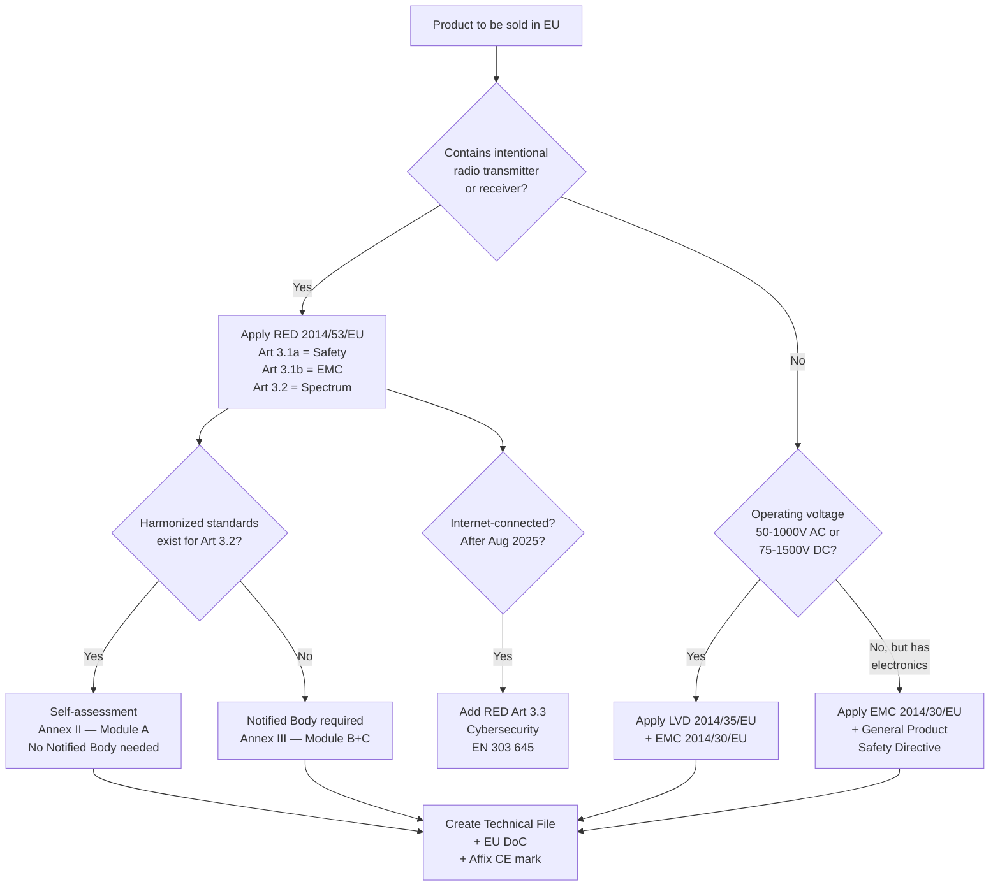
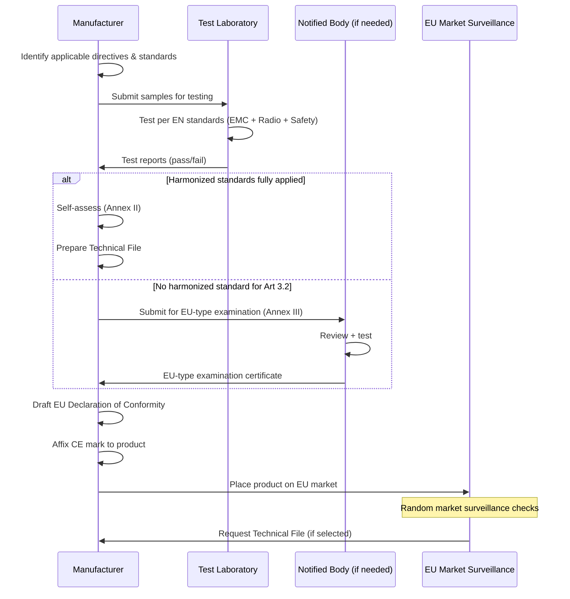

# CE Marking — Radio Equipment Directive (RED), LVD & EMC Directive

**Topic:** European Conformity (CE) Marking for Electronic Products — RED 2014/53/EU, LVD 2014/35/EU, EMC 2014/30/EU  
**Standards:** EN 300 328, EN 301 893, EN 303 687, EN 62368-1, EN 55032, EN 55035, EN 301 489-x  
**SDO:** European Commission, ETSI, CENELEC, CEN, EU Notified Bodies  
**Audience:** Regulatory engineers, product compliance managers, EU market access specialists  
**Prerequisites:** Basic RF/EMC theory, product safety concepts, EU Single Market understanding

---

## Chapter 1 — Historical Context & Origin Story

### 1.1 Timeline

| Year | Event |
|------|-------|
| 1985 | "New Approach" Directives — CE marking concept introduced |
| 1993 | CE marking first required (European Single Market Act) |
| 1995 | LVD Directive 73/23/EEC applicable (electrical safety) |
| 1996 | EMC Directive 89/336/EEC fully enforced |
| 1999 | R&TTE Directive 1999/5/EC (first radio equipment directive) |
| 2004 | EMC Directive 2004/108/EC (updated) |
| 2014 | RED 2014/53/EU published (replaces R&TTE, effective June 2016) |
| 2014 | LVD 2014/35/EU recast |
| 2014 | EMC Directive 2014/30/EU recast |
| 2016 | RED fully enforced (13 June 2016) |
| 2022 | RED Article 3.3 delegated acts adopted (cybersecurity for IoT) |
| 2024 | EU Cyber Resilience Act (CRA) published — complements RED |
| 2025 | RED §3.3(d)(e)(f) enforcement begins (August 2025) |
| 2025 | UKCA mark mandatory for UK market (previously recognized CE) |

### 1.2 CE Marking Scope

| Aspect | Detail |
|--------|--------|
| What CE means | Conformité Européenne (European Conformity) |
| Legal basis | EU regulation framework (New Legislative Framework 768/2008/EC) |
| Geographic scope | EU 27 member states + EEA (Norway, Iceland, Liechtenstein) + Switzerland (partial) |
| Responsibility | Manufacturer (or EU Authorized Representative) |
| Self-declaration | Yes (for most products) — manufacturer assesses conformity |
| Third-party (Notified Body) | Required only for specific cases (e.g., some RED Art 3.2 assessments) |
| Enforcement | Market surveillance authorities in each member state |
| Penalties | Product withdrawal, fines (varies by country — up to €10M+ in some states) |

---

## Chapter 2 — Standard Architecture & Structure

### 2.1 Applicable Directives for Electronics

```mermaid
graph TB
    PRODUCT[Electronic Product]
    
    PRODUCT --> Q1{Contains radio<br/>transmitter/receiver?}
    Q1 -->|"Yes"| RED[Radio Equipment Directive<br/>RED 2014/53/EU<br/>Art 3.1a Safety<br/>Art 3.1b EMC<br/>Art 3.2 Spectrum]
    Q1 -->|"No"| Q2{Operating voltage<br/>50-1000V AC or<br/>75-1500V DC?}
    
    Q2 -->|"Yes"| LVD[Low Voltage Directive<br/>LVD 2014/35/EU]
    Q2 -->|"No"| EXEMPT_LVD[LVD not applicable<br/>Safety still needed<br/>(General Product Safety)]
    
    PRODUCT --> EMC_Q{Generates/affected by<br/>electromagnetic disturbance?}
    EMC_Q -->|"Yes, AND no radio"| EMC_DIR[EMC Directive<br/>2014/30/EU]
    EMC_Q -->|"Has radio"| RED_EMC[EMC covered by<br/>RED Art 3.1b]
    
    PRODUCT --> ROHS[RoHS Directive<br/>2011/65/EU<br/>Always applicable to EEE]
    
    PRODUCT --> Q3{Internet-connected<br/>radio equipment?}
    Q3 -->|"Yes (from 2025)"| RED33[RED Article 3.3<br/>Cybersecurity<br/>d,e,f delegated acts]
```

### 2.2 RED Essential Requirements

| Article | Requirement | Harmonized Standards |
|---------|-------------|---------------------|
| 3.1(a) | Safety (health, safety, including electrical safety) | EN 62368-1, EN 50663 (low-voltage), EN 50665 |
| 3.1(b) | EMC (protection of electromagnetic environment) | EN 301 489-1 (generic), EN 301 489-17 (2.4/5 GHz WLAN/BT) |
| 3.2 | Effective use of radio spectrum | EN 300 328 (2.4 GHz), EN 301 893 (5 GHz), EN 303 687 (6 GHz) |
| 3.3(a) | Accessories (charger interoperability — USB-C mandate) | EN IEC 62680-1-2 (USB Type-C) |
| 3.3(d) | Network and personal data protection (privacy) | EN 303 645 (IoT security) — Delegated Act 2022/30 |
| 3.3(e) | Protection from fraud | EN 303 645 |
| 3.3(f) | Network protection from harm | EN 303 645 |

---

## Chapter 3 — Technical Deep Dive

### 3.1 Radio Equipment Standards (ETSI)

| Standard | Scope | Key Tests |
|----------|-------|-----------|
| EN 300 328 V2.2.2 | 2.4 GHz wideband (Wi-Fi, BT) | Power, PSD, frequency tolerance, OBW, spurious, receiver blocking |
| EN 301 893 V2.1.1 | 5 GHz RLAN (Wi-Fi 5/6) | Power, DFS, TPC, adaptivity, receiver category |
| EN 303 687 | 6 GHz (Wi-Fi 6E/7) — WAS/RLAN | LPI: 200 mW/23 dBm EIRP, VLP: 25 mW |
| EN 300 220 | Sub-GHz SRD (868 MHz LoRa, Sigfox) | Duty cycle, power (<25 mW ERP), listen-before-talk |
| EN 300 330 | Inductive NFC/RFID (13.56 MHz) | Field strength limits, fundamental + harmonics |
| EN 303 345 | Broadcast receivers (DAB, FM) | Sensitivity, selectivity, blocking |
| EN 301 908 | IMT cellular (4G/5G) | 3GPP conformance (referenced) |
| EN 303 446 | Combined radio + non-radio (device testing) | Multi-radio assessment |

### 3.2 EMC Standards for Electronics

**Emissions (EN 55032 — CISPR 32):**

| Test | Limit | Frequency |
|------|-------|-----------|
| Conducted emissions (AC mains) | Class B: 66→56 dBμV (QP), 56→46 dBμV (Avg) | 150 kHz — 30 MHz |
| Radiated emissions (3m) | Class B: 40 dBμV/m (30-230 MHz), 47 dBμV/m (230-1000 MHz) | 30 MHz — 6 GHz |
| Telecom port emissions | Class B: varies per port type | 150 kHz — 30 MHz |

**Immunity (EN 55035 — CISPR 35):**

| Test | Standard | Level | Criterion |
|------|----------|-------|-----------|
| ESD | IEC 61000-4-2 | ±4 kV contact, ±8 kV air | B (temporary degradation OK) |
| Radiated immunity | IEC 61000-4-3 | 3 V/m (80-2700 MHz) | A (normal performance) |
| EFT/Burst | IEC 61000-4-4 | 1 kV (signal), 2 kV (power) | B |
| Surge | IEC 61000-4-5 | 1 kV line-line, 2 kV line-earth | B |
| Conducted immunity | IEC 61000-4-6 | 3 V (150 kHz — 80 MHz) | A |
| Power frequency magnetic field | IEC 61000-4-8 | 3 A/m (50 Hz) | A |
| Voltage dips/interruptions | IEC 61000-4-11 | Per class; 0% 0.5 cycle, 70% 25 cycles | B/C |

### 3.3 RED Article 3.3 — Cybersecurity (Effective 2025)

| Sub-article | Requirement | Products Affected |
|-------------|------------|-------------------|
| 3.3(d) | Privacy & personal data protection | Internet-connected RE that processes personal data |
| 3.3(e) | Protection against fraud | Internet-connected RE that handles financial transactions |
| 3.3(f) | Protection from harm to network/service | ALL internet-connected radio equipment |

**EN 303 645 (Cyber Security for Consumer IoT) — Key Provisions:**

| Provision | Requirement |
|-----------|------------|
| No universal default passwords | Each device must have unique credentials |
| Vulnerability disclosure policy | Published process for reporting security issues |
| Keep software updated | Mechanism for secure updates; publish support period |
| Securely store sensitive data | Credentials encrypted at rest |
| Communicate securely | TLS/DTLS for sensitive data in transit |
| Minimize exposed attack surface | Disable unused ports/services |
| Ensure software integrity | Secure boot; verify update authenticity |
| Ensure personal data security | GDPR-aligned data handling |
| Resilient to outages | Function with network interruption |
| Examine telemetry data | Allow user to audit data collection |
| Allow easy deletion of data | User can delete personal data from device |
| Easy installation and maintenance | Security-relevant setup guidance |
| Validate input data | No buffer overflows from malformed input |

---

## Chapter 4 — Implementation Guide

### 4.1 CE Marking Process (Step-by-Step)

```mermaid
graph TB
    S1[Step 1: Identify applicable<br/>EU Directives] --> S2[Step 2: Identify harmonized<br/>standards for each]
    S2 --> S3[Step 3: Design product<br/>to meet requirements]
    S3 --> S4[Step 4: Assess conformity<br/>(testing + documentation)]
    S4 --> S5[Step 5: Create Technical<br/>Documentation / File]
    S5 --> S6[Step 6: Draft EU Declaration<br/>of Conformity (DoC)]
    S6 --> S7[Step 7: Affix CE mark<br/>to product]
    S7 --> S8[Step 8: Register EU Authorized<br/>Representative (if non-EU mfr)]
    S8 --> S9[Step 9: Maintain compliance<br/>(post-market surveillance)]
```

### 4.2 Conformity Assessment Procedures (RED)

| Procedure | Module | When Used |
|-----------|--------|-----------|
| Internal production control | Annex II (Module A) | If harmonized standards exist AND manufacturer uses them fully |
| EU-type examination + production | Annex III (Module B+C) | If NO harmonized standard exists for Art 3.2 |
| Full quality assurance | Annex IV (Module H) | Alternative to Module B+C (ISO 9001 based) |

**In practice:** Most products use Annex II (self-assessment) because harmonized standards exist for common technologies (Wi-Fi, BT, LTE, etc.).

### 4.3 Technical Documentation Contents

| Section | Contents |
|---------|---------|
| General description | Product description, photos, intended use |
| Design documentation | Schematics, PCB layout, block diagram, BOM |
| Standards applied | List of harmonized standards claimed |
| Test reports | EMC, radio, safety test results |
| Risk assessment | RF exposure assessment, safety risk analysis |
| User information | Manual/instructions (in language of destination market) |
| Quality control | Manufacturing quality system description |
| DoC | EU Declaration of Conformity (signed) |
| Label | CE mark mockup, product identification |

### 4.4 EU Declaration of Conformity (Template)

```
EU DECLARATION OF CONFORMITY

1. Product: [Product name/model]
2. Manufacturer: [Name, address]
3. This declaration is issued under the sole responsibility of the manufacturer.
4. Object of declaration: [Product description, type/batch/serial]
5. The object described above is in conformity with the relevant Union 
   harmonisation legislation:
   - Radio Equipment Directive 2014/53/EU
   - RoHS Directive 2011/65/EU
6. References to relevant harmonised standards:
   - EN 300 328 V2.2.2
   - EN 301 489-1 V2.2.3
   - EN 301 489-17 V3.2.4
   - EN 62368-1:2014+A11:2017
   - EN 50581:2012
7. Notified Body: [If applicable — name, number, certificate ref]
8. Additional information:
   Signed for and on behalf of: [Company]
   Place and date: [City, Date]
   Name/function: [Name, Title]
   Signature: _______________
```

---

## Chapter 5 — Certification & Compliance

### 5.1 Notified Bodies

| Role | When Needed |
|------|-------------|
| Not needed | Harmonized standards fully applied (Annex II — manufacturer self-declares) |
| Required (Annex III) | No harmonized standard covers Art 3.2 (spectrum efficiency) |
| Required (Annex IV) | Manufacturer chooses full QA route |
| Required (specific) | Certain product categories (e.g., maritime, aviation radio) |

### 5.2 EU Type Approval Numbers

| Database | URL | Purpose |
|----------|-----|---------|
| NANDO | ec.europa.eu/growth/tools-databases/nando | Find Notified Bodies by directive/standard |
| REDCA | ec.europa.eu/redca | Radio Equipment Compliance database |
| ICSMS | Single Market Portal | Market surveillance incident tracking |
| RAPEX | Safety Gate | Rapid alert for dangerous non-food products |

### 5.3 Post-Market Surveillance Requirements

| Obligation | Detail |
|-----------|--------|
| Keep Technical File | 10 years after last product placed on market |
| Traceability | Type, batch, or serial number on product |
| Corrective action | If product found non-compliant → withdraw/recall |
| Report to authorities | If product presents risk → inform market surveillance authority |
| Cooperation | Must cooperate with authority requests (provide documentation) |

---

## Chapter 6 — Regional Variants (CE vs. UKCA vs. Other EU Marks)

| Mark | Territory | Directives/Regulations |
|------|-----------|----------------------|
| CE | EU 27 + EEA (30 countries) | RED, LVD, EMC, RoHS, etc. |
| UKCA | United Kingdom (England, Scotland, Wales) | UK Radio Equipment Regulations 2017 (mirrors RED) |
| UKNI | Northern Ireland | CE mark still accepted (Windsor Framework) |
| Swiss compliance | Switzerland | Ordinance on Telecom (similar to RED, but separate assessment) |
| Turkey | Türkiye | "CE" mark accepted via Customs Union (most directives recognized) |

**UKCA Key Differences from CE:**

| Aspect | CE (EU) | UKCA (UK) |
|--------|---------|-----------|
| Legal basis | RED 2014/53/EU | UK Radio Equipment Regulations 2017 (SI 2017/1206) |
| Conformity assessment | EU Notified Body (if needed) | UK Approved Body (for Module B/H) |
| Authorized Representative | EU AR (for non-EU manufacturers) | UK Responsible Person (for non-UK manufacturers) |
| Declaration | EU DoC | UK Declaration of Conformity |
| Standards | EN (ETSI) harmonized | Designated Standards (same EN content, different legal status) |
| Database | REDCA | Ofcom database |
| Timeline | Already required | Mandatory from 2025 (transition ended) |

---

## Chapter 7 — Comparison of EU Directives

| Dimension | RED | LVD | EMC Directive |
|-----------|-----|-----|---------------|
| Scope | Radio equipment (intentional TX/RX) | Electrical equipment 50-1000V AC / 75-1500V DC | All electrical/electronic equipment |
| Does NOT apply when | Equipment excluded (listed in Art 1.2) | Equipment covered by another directive (RED covers LVD content) | Equipment covered by RED (Art 3.1b covers EMC) |
| Safety | Art 3.1(a) — covers safety | Full scope | N/A |
| EMC | Art 3.1(b) — covers EMC | N/A | Full scope (emissions + immunity) |
| Radio performance | Art 3.2 — spectrum efficiency | N/A | N/A |
| Cybersecurity | Art 3.3 (from 2025) | N/A | N/A |
| Self-assessment | Annex II (if harmonized std exists) | Module A (internal production control) | Module A |
| Typical harmonized std | EN 300 328, EN 301 893 | EN 62368-1 | EN 55032 + EN 55035 |
| CE mark | Required | Required | Required |

---

## Chapter 8 — Mermaid Architecture Diagrams

### 8.1 CE Marking Decision Tree



### 8.2 RED Conformity Assessment Flow



---

## Chapter 9 — Case Studies

### 9.1 Smart Speaker — Full RED + Art 3.3 Compliance

| Aspect | Detail |
|--------|--------|
| Product | Wi-Fi + BT smart speaker with voice assistant |
| Directives | RED (Wi-Fi + BT radio), RoHS, WEEE, Battery Regulation |
| RED Art 3.1a | EN 62368-1 (safety — low voltage from adapter) |
| RED Art 3.1b | EN 301 489-17 (EMC for WLAN/BT) |
| RED Art 3.2 | EN 300 328 (2.4 GHz Wi-Fi + BT), EN 301 893 (5 GHz Wi-Fi) |
| RED Art 3.3 | EN 303 645 (cybersecurity — required from Aug 2025) |
| Challenge | Art 3.3: unique passwords, secure OTA updates, vulnerability disclosure |
| Timeline | 10 weeks (testing + documentation + 3.3 assessment) |
| Assessment route | Annex II (self-assessment — all harmonized standards available) |
| Key lesson | EN 303 645 requires documented software development process |

### 9.2 Industrial IoT Gateway — CE vs. UKCA Dual Compliance

| Aspect | Detail |
|--------|--------|
| Product | Industrial IoT gateway (Wi-Fi + LTE + Ethernet) |
| Markets | EU + UK (post-Brexit — need both CE and UKCA) |
| Challenge | Same product, two separate compliance regimes |
| Strategy | Single test campaign at accredited lab (recognized by both EU NB and UK AB) |
| CE filing | EU DoC + Technical File + EU AR appointment |
| UKCA filing | UK DoC + Technical File + UK Responsible Person appointment |
| Cost premium | +$5,000 for dual filing (documentation + representative) |
| Standards | Same EN standards (recognized as designated standards in UK) |
| Marking | Both CE and UKCA marks on product (legal in both markets) |

---

## Chapter 10 — Future Evolution & Industry Trends

| Trend | Timeline | Description |
|-------|----------|-------------|
| RED §3.3 full enforcement | August 2025 | Cybersecurity mandatory for all internet-connected radio equipment |
| EU Cyber Resilience Act (CRA) | 2025-2027 | Broader than RED §3.3 — covers ALL digital products (not just radio) |
| USB-C mandate | December 2024 | All small electronics must use USB-C (RED Art 3.3(a) delegated act) |
| UKCA divergence from CE | 2025+ | UK standards may diverge from EU harmonized standards over time |
| AI Act implications | 2025-2026 | High-risk AI embedded in products → additional conformity assessment |
| Digital Product Passport | 2027+ | Sustainability/lifecycle data required for market access |
| EN 303 645 v2 | 2025 | Updated IoT security standard (more detailed requirements) |
| Ecodesign for Sustainable Products | 2025-2030 | Repairability, recyclability, energy efficiency for electronics |
| Single charger expansion | 2026+ | May extend beyond phones to laptops, other device categories |
| Automated conformity tools | Growing | AI-assisted compliance documentation and testing |

---

## Chapter 11 — Interview Questions & Career Guide

### Tier 1: Entry-Level

**Q1:** Explain the difference between the Radio Equipment Directive (RED), Low Voltage Directive (LVD), and EMC Directive. When does each apply?  
**A:** **Radio Equipment Directive (RED 2014/53/EU):** Applies to ANY product that intentionally transmits or receives radio waves (electromagnetic waves <3000 GHz propagated without artificial guide). Covers: Wi-Fi routers, Bluetooth devices, mobile phones, LoRa sensors, NFC readers, RFID tags, walkie-talkies, etc. Key: RED covers safety (Art 3.1a), EMC (Art 3.1b), AND radio performance (Art 3.2) — it's a "super directive" for radio products. When RED applies: LVD does NOT apply separately (safety covered by RED). EMC Directive does NOT apply separately (EMC covered by RED). **Low Voltage Directive (LVD 2014/35/EU):** Applies to electrical equipment with rated voltage 50-1000V AC or 75-1500V DC. Covers: power supplies, appliances, fixed installations, industrial equipment. Does NOT apply if: product is covered by RED (radio equipment), or below voltage threshold, or in excluded categories (medical, lifts, etc.). **EMC Directive (2014/30/EU):** Applies to apparatus that may generate electromagnetic disturbance OR whose performance may be affected by disturbance. Covers: any electronic equipment without intentional radio (PCs, monitors, LED lighting, motor drives). Does NOT apply if: product is covered by RED (RED Art 3.1b handles EMC). **Summary decision:** Has intentional radio? → RED (covers safety + EMC + radio). No radio, 50-1000V? → LVD + EMC Directive (both apply). No radio, below 50V? → EMC Directive only (+ General Product Safety for safety aspects). **Note:** RoHS Directive applies to ALL electrical/electronic equipment regardless of which technical directive applies.

### Tier 2: Mid-Level

**Q2:** Your product uses a pre-certified Wi-Fi module but you still need CE marking. What testing is required and what can you skip?  
**A:** **Scenario:** Product (host device) integrates a CE-certified Wi-Fi module with its own RED compliance and DoC. **What you CAN use from the module certification:** (1) Radio performance (Art 3.2): If module is used within its certified conditions (same antenna type/gain, same power settings, same frequency range), you can reference the module's Art 3.2 compliance. No additional RF testing needed for the Wi-Fi radio itself. (2) Module manufacturer's test report can be included in YOUR technical file as evidence. **What you STILL MUST do:** (1) **EMC testing of the complete host product (Art 3.1b):** The module was tested standalone or in a reference host. YOUR product has different PCB layout, different cables, different peripherals, different power supply. Radiated emissions from host may differ significantly → full CISPR 32 / EN 55032 test required. Immunity testing (EN 55035) of complete product → required. EN 301 489-17 (EMC for WLAN equipment) on complete product → required. (2) **Safety assessment (Art 3.1a):** If host has mains connection (AC adapter) → EN 62368-1 safety testing of host. If battery-powered (below 50V) → simplified safety assessment (ES1 level per 62368-1). Includes battery safety (IEC 62133) if lithium battery integrated. (3) **RF exposure (if portable <20cm from body):** SAR assessment for the complete product (module position + body proximity). Even if module has SAR data, host integration changes spacing/reflection. New SAR test or simulation may be required. (4) **Co-location assessment:** If host has multiple radios (Wi-Fi module + BLE + NFC + cellular), simultaneous operation RF exposure assessment required. (5) **RED Art 3.3 (if internet-connected, from 2025):** Module certification does NOT cover host product cybersecurity. Host manufacturer must demonstrate EN 303 645 compliance for the COMPLETE product (firmware security, update mechanism, default passwords, etc.). (6) **RoHS compliance:** Separate obligation for the complete product (module + host combined). **Documentation:** Create YOUR OWN EU Declaration of Conformity for the complete product. Reference module certification (FCC ID/CE cert) in your technical file. Your DoC must list all applicable directives and standards. **Key principle:** Module certification proves the radio module itself meets RED Art 3.2. But the HOST product is a new product that must be independently assessed for safety, EMC, and cybersecurity as a complete system.

### Tier 3: Senior

**Q3:** Your company is launching a Wi-Fi 6E smart home hub (6 GHz + 5 GHz + 2.4 GHz + BLE + Thread + Zigbee). The product must comply with RED including Article 3.3 by August 2025. Describe the complete conformity assessment strategy.  
**A:** **Product:** Multi-radio smart home hub. Radios: Wi-Fi 6E (2.4/5/6 GHz), BLE 5.3, Thread (802.15.4), Zigbee (802.15.4). **1. Applicable requirements:** RED Art 3.1(a): Safety → EN 62368-1. RED Art 3.1(b): EMC → EN 301 489-1 (generic), EN 301 489-17 (WLAN + BLE). RED Art 3.2: Spectrum → EN 300 328 (2.4 GHz: Wi-Fi + BLE + Thread + Zigbee), EN 301 893 (5 GHz: Wi-Fi), EN 303 687 (6 GHz: Wi-Fi 6E). RED Art 3.3(d)(e)(f): Cybersecurity → EN 303 645 (Cyber Security for Consumer IoT). RoHS: 2011/65/EU → EN 50581. **2. Radio standards assessment:** Wi-Fi 6E (6 GHz — EN 303 687): EU permits 5945-6425 MHz ONLY. Maximum: 200 mW EIRP (23 dBm) — Low Power Indoor (LPI). Very Low Power (VLP): 25 mW EIRP (14 dBm) — wearable/client. Unlike US, EU does NOT permit Standard Power (outdoor AP) in 6 GHz yet. DFS: NOT required in 6 GHz (no radar in this band in EU). AFC: NOT required in EU for LPI (unlike US for standard power). Wi-Fi 5 GHz (EN 301 893): DFS required in 5.25-5.35 + 5.47-5.725 GHz. TPC (Transmit Power Control) required: must reduce by ≥3 dB. Master/slave adaptivity requirements. 2.4 GHz (EN 300 328): All four radios (Wi-Fi, BLE, Thread, Zigbee) share 2.4 GHz band. Adaptive frequency hopping (AFH) required for BLE. Medium utilization factor assessment for Wi-Fi. **3. Article 3.3 compliance strategy:** (a) Provision 1 — No default passwords: Generate unique credential per device during manufacturing (burned into secure element). First-time setup forces user to create account (no "admin/admin"). (b) Provision 2 — Vulnerability disclosure: Publish security contact + process on company website. Monitor CVE databases for components used. (c) Provision 3 — Software updates: Secure OTA update mechanism (code signing + TLS download). Publish minimum support period (e.g., "security updates until 2030"). Automatic update notification to user. (d) Provision 4 — Secure communication: All cloud communication via TLS 1.2+ (preferably 1.3). Local communication: Matter/Thread uses CASE (Certificate Authenticated Session Establishment). (e) Provision 5 — Minimize attack surface: Disable unused network services by default. No open debugging ports in production firmware. Firewall on device: only essential ports open. (f) Provision 6 — Secure storage: Credentials stored in secure element or encrypted filesystem. Symmetric keys derived from device-unique seed. (g) Provision 7 — Ensure software integrity: Secure boot chain (hardware root of trust → bootloader → OS → application). Verify OTA update signature before applying. (h) Provision 8 — Personal data: GDPR-aligned privacy notice. User can delete personal data from device (factory reset). Data minimization: only collect what's needed. (i) Documentation: Self-assessment against EN 303 645 (clause-by-clause evidence). Include in Technical File: security architecture document, threat model, test evidence. **4. Testing plan:** Week 1-3: EN 300 328 + EN 301 893 + EN 303 687 (all radio performance tests). Week 2-4: DFS testing for 5 GHz (KDB 905462 equivalent per ETSI EN 301 893). Week 3-5: EN 301 489-17 (EMC for complete product — emissions + immunity). Week 4-5: EN 62368-1 safety assessment (adapter/power supply). Week 5-6: RF exposure assessment (simultaneous multi-radio SAR or MPE). Week 1-6 (parallel): EN 303 645 assessment (cybersecurity review — documentation-based + penetration test). **5. Conformity assessment route:** Annex II (Module A) — self-assessment applicable because: EN 300 328, EN 301 893, EN 303 687 are published harmonized standards. All Art 3.2 requirements have harmonized standards → no Notified Body needed. EN 303 645 is harmonized standard for Art 3.3 → self-assessment. **6. Documentation package:** Technical File: 200+ pages (design docs, test reports, risk assessment, 303 645 evidence). EU DoC: one declaration covering all directives (RED + RoHS). Labels: CE mark, WEEE symbol, product identification. EU Authorized Representative: appointed (if manufacturer outside EU). **7. Cost estimate:** RF testing (3 bands + DFS): €15,000-€20,000. EMC testing: €5,000-€8,000. Safety: €3,000-€5,000. RF exposure: €3,000-€5,000. EN 303 645 assessment: €5,000-€10,000 (includes pen test). Documentation preparation: €5,000-€10,000. **Total: €36,000-€58,000.** **8. Risk mitigation:** 6 GHz regulatory uncertainty: EU may expand to outdoor/higher power (future — plan firmware update path). EN 303 645 interpretation: engage with test house early (requirement interpretation varies). Multi-radio co-existence: test all radios simultaneously (worst-case emission scenario). DFS: known challenge — engage experienced lab; pre-test to validate radar detection.

---

## Chapter 12 — Cheat Sheet & Quick Reference

### CE Marking Essential Directives

```
Radio product (Wi-Fi, BT, cellular):  → RED 2014/53/EU (covers safety + EMC + radio)
Non-radio, 50-1000V AC:               → LVD 2014/35/EU + EMC 2014/30/EU
Non-radio, <50V:                       → EMC 2014/30/EU only (+ GPS Directive for safety)
ALL electronic products:               → RoHS 2011/65/EU (always)
Battery-containing:                    → Battery Regulation 2023/1542
Internet-connected radio (2025+):      → RED Art 3.3 (EN 303 645 cybersecurity)
```

### EU Radio Standards Quick Reference

```
Band            Standard          Max Power        Notes
2.4 GHz         EN 300 328        100 mW EIRP     (20 dBm; Wi-Fi, BT, Zigbee)
5.15-5.35 GHz   EN 301 893        200 mW EIRP     DFS + TPC required (indoor)
5.47-5.725 GHz  EN 301 893        1 W EIRP        DFS + TPC required
5.725-5.875 GHz EN 301 893        2 W EIRP (outdoor) / 200 mW (SRD at 5.8)
5.945-6.425 GHz EN 303 687        200 mW EIRP     LPI (indoor only); VLP: 25 mW
868 MHz (SRD)   EN 300 220        25 mW ERP       Duty cycle or LBT/AFA
Sub-GHz LoRa    EN 300 220        25 mW ERP       Duty cycle ≤1% (or ≤10% with LBT)
NFC (13.56 MHz) EN 300 330        Field strength  limits per distance
```

### CE Technical File Checklist

```
□ Product description (general description, photos, intended use)
□ Design drawings (schematics, PCB layout, mechanical)
□ List of harmonized standards applied
□ Test reports (EMC, radio performance, safety)
□ RF exposure assessment (SAR or MPE)
□ Quality system description
□ EU Declaration of Conformity (signed, dated)
□ User manual (in language of destination market)
□ Label/marking (CE mark, compliance info, WEEE, battery)
□ Risk assessment (safety + cybersecurity per EN 303 645)
□ [2025+] EN 303 645 evidence (cybersecurity self-assessment)
□ RoHS documentation (material declarations, EN 50581)
```

### RED Article 3.3 Quick Compliance

```
□ Unique credentials per device (no shared defaults)
□ Secure firmware update mechanism (signed, encrypted)
□ Published support period (minimum security update timeframe)
□ Vulnerability disclosure process (published on website)
□ TLS for all internet communication (≥TLS 1.2)
□ Secure boot (verified boot chain)
□ Minimized attack surface (unused services disabled)
□ User data deletion capability (factory reset)
□ Input validation (prevent injection/overflow)
□ Document all of the above in Technical File
```

---

*End of Document — 02_CE_Marking_RED_LVD_EMC.md*
