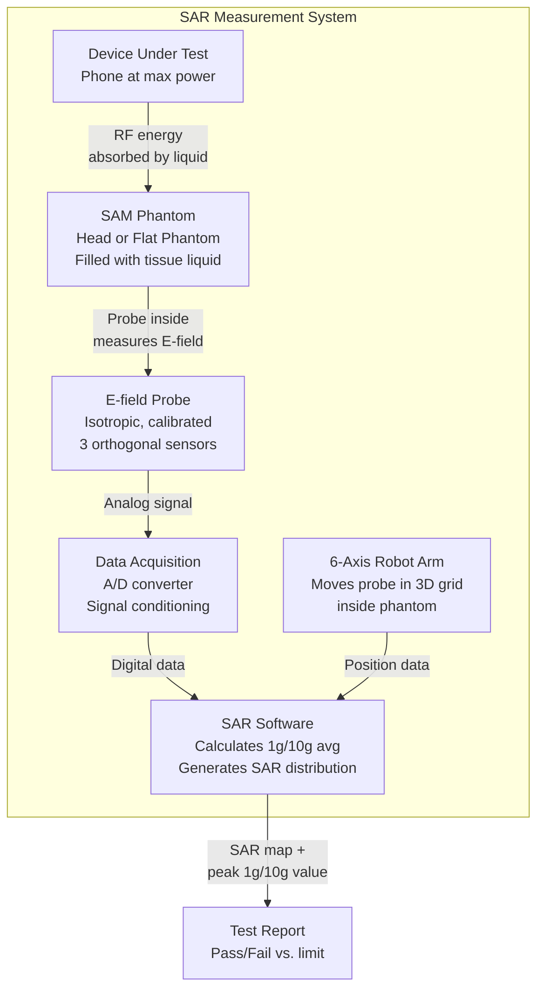
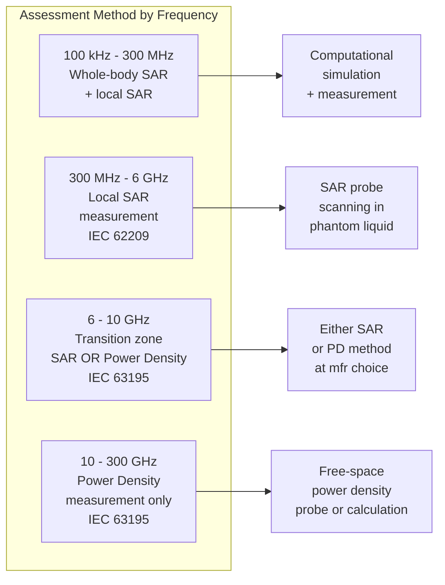

# SAR & Human Exposure Limits — RF Safety for Consumer Devices

**Topic:** Specific Absorption Rate (SAR), RF Exposure Limits, Power Density Assessment  
**Standards:** FCC OET Bulletin 65, IEEE C95.1-2019, ICNIRP 2020, IEC 62209, EN 50566, EN 62311  
**SDO:** FCC, IEEE ICES, ICNIRP, IEC TC 106, CENELEC  
**Audience:** RF safety engineers, antenna designers, regulatory compliance engineers, EMF assessment specialists  
**Prerequisites:** RF/antenna fundamentals, electromagnetic field theory basics

---

## Chapter 1 — Historical Context & Origin Story

### 1.1 Timeline

| Year | Event |
|------|-------|
| 1966 | ANSI C95.1 first published (10 mW/cm² occupational exposure limit) |
| 1982 | ANSI/IEEE C95.1 revision (frequency-dependent limits) |
| 1991 | IEEE C95.1-1991 (basis for FCC limits adopted in 1996) |
| 1996 | FCC adopts SAR limit: 1.6 W/kg (1g tissue avg) for portable devices |
| 1998 | ICNIRP publishes guidelines (2.0 W/kg, 10g tissue avg) — EU basis |
| 2001 | EU Council Recommendation 1999/519/EC (adopts ICNIRP limits) |
| 2005 | IEEE C95.1-2005 (major revision, two-tier limits) |
| 2010 | IEC 62209-1 (head SAR measurement) updated |
| 2013 | IEC 62209-2 (body SAR measurement at ≤200 MHz — 6 GHz) |
| 2016 | FCC KDB 447498 (SAR test procedures for devices >6 GHz) |
| 2019 | IEEE C95.1-2019 (harmonizes with ICNIRP 2020; adds >6 GHz) |
| 2020 | ICNIRP 2020 guidelines (updated for 5G mmWave; adds power density limits >6 GHz) |
| 2021 | IEC 62209-3 (vector probe measurement system for SAR) |
| 2022 | FCC KDB 648474 (5G mmWave power density assessment procedures) |
| 2024 | IEC/IEEE 62209-1528 (combined head/body SAR — replaces 62209-1 and -2) |

### 1.2 SAR Limits: US vs. International

| Jurisdiction | SAR Limit | Averaging Mass | Averaging Volume | Standard Reference |
|-------------|-----------|---------------|-----------------|-------------------|
| USA (FCC) | 1.6 W/kg | 1 gram | Cube of tissue | FCC 47 CFR §2.1093; OET Bulletin 65 |
| EU (ICNIRP) | 2.0 W/kg (head/trunk) | 10 grams | Contiguous tissue | EU 1999/519/EC; EN 62209-1 |
| EU (limbs) | 4.0 W/kg | 10 grams | Limb tissue | ICNIRP 1998/2020 |
| Japan (ARIB) | 2.0 W/kg | 10 grams | Same as ICNIRP | Radio Law Article 14-2 |
| Korea (MSIT) | 1.6 W/kg | 1 gram | Same as FCC | Korean Radio Wave Act |
| Canada (ISED) | 1.6 W/kg | 1 gram | Same as FCC | RSS-102 |
| Australia (ARPANSA) | 2.0 W/kg | 10 grams | Same as ICNIRP | RPS 3 |
| India (DoT) | 1.6 W/kg | 1 gram | Same as FCC | EMF guidelines 2012 |
| China (MIIT) | 2.0 W/kg | 10 grams | Same as ICNIRP | GB 21288-2005 |

---

## Chapter 2 — Standard Architecture & Structure

### 2.1 RF Exposure Assessment Framework

```mermaid
graph TB
    DEVICE[RF Transmitting Device]
    
    DEVICE --> Q1{Portable?<br/>Used within 20cm of body}
    Q1 -->|"Yes<br/>(phone, wearable,<br/>tablet, laptop)"| SAR_REQ[SAR Assessment Required<br/>IEC 62209 / FCC KDB]
    
    Q1 -->|"No"| Q2{Mobile?<br/>20cm-200cm from body<br/>(vehicle-mounted)}
    Q2 -->|"Yes"| MPE_MOBILE[MPE Assessment<br/>Power Density Calc<br/>OET Bulletin 65]
    
    Q2 -->|"No"| Q3{Fixed/Infrastructure?<br/>>200cm from public}
    Q3 -->|"Yes"| MPE_FIXED[MPE Assessment<br/>Exclusion Zone Calc<br/>OET Bulletin 65]
    
    SAR_REQ --> Q4{Frequency?}
    Q4 -->|"≤6 GHz"| SAR_MEAS[SAR Measurement<br/>IEC/IEEE 62209-1528<br/>Probe scanning in phantom]
    Q4 -->|">6 GHz<br/>(5G mmWave)"| PD_MEAS[Power Density<br/>Assessment<br/>IEC/IEEE 63195<br/>FCC KDB 648474]
    
    DEVICE --> Q5{Total output power<br/>of ALL transmitters}
    Q5 -->|"Below exemption<br/>thresholds"| EXEMPT[SAR-Exempt<br/>No testing required<br/>(file calculation only)]
```

### 2.2 Key Standards Relationships

| Standard | Scope |
|----------|-------|
| FCC OET Bulletin 65 | US: methods for evaluating compliance with RF exposure limits |
| FCC 47 CFR §2.1093 | US: portable device SAR limit (1.6 W/kg) |
| FCC 47 CFR §1.1307(b) | US: when RF exposure evaluation is required (categorical exclusion thresholds) |
| IEC/IEEE 62209-1528 | International: SAR measurement (head + body, 100 MHz — 6 GHz) |
| IEC/IEEE 63195-1 | Power density measurement (>6 GHz — for 5G mmWave) |
| IEC/IEEE 63195-2 | Power density computational methods (>6 GHz) |
| EN 50566 | EU: SAR for hand-held/body-mounted (harmonized under RED) |
| EN 62311 | EU: assessment of electronic equipment related to human exposure (general) |
| EN 50665 | EU: methods for assessment (harmonized under RED — low-power) |
| IEEE C95.1-2019 | International: safety levels for human exposure (reference standard) |
| ICNIRP 2020 | International guidelines (EU/most countries adopt this) |
| IEC 62232 | Base station EMF assessment (not portable) |

---

## Chapter 3 — Technical Deep Dive

### 3.1 SAR Fundamentals

**Definition:** SAR (Specific Absorption Rate) = rate of RF energy absorption per unit mass of body tissue.

$$SAR = \frac{\sigma |E|^2}{\rho} \quad \text{(W/kg)}$$

Where:
- $\sigma$ = tissue conductivity (S/m)
- $|E|$ = electric field magnitude inside tissue (V/m)
- $\rho$ = tissue mass density (kg/m³)

**Averaging:**

$$SAR_{avg} = \frac{1}{m} \int_V \frac{\sigma(r) |E(r)|^2}{\rho(r)} \, dm$$

Where $m$ = averaging mass (1g for FCC, 10g for ICNIRP).

### 3.2 Frequency Bands and Assessment Methods

| Frequency Range | Assessment Method | Standard | Device Examples |
|----------------|-------------------|----------|----------------|
| 100 kHz — 6 GHz | SAR (volumetric absorption) | IEC/IEEE 62209-1528 | Phones, tablets, laptops, wearables |
| 6 GHz — 300 GHz | Power Density (surface absorption) | IEC/IEEE 63195 | 5G mmWave (28 GHz, 39 GHz), Wi-Fi 6E |
| 30 MHz — 6 GHz (>20cm) | MPE (incident power density) | OET 65 / EN 62311 | Mobile devices, access points |
| >300 GHz | Not yet standardized | — | Emerging THz applications |

### 3.3 SAR Measurement System

| Component | Purpose |
|-----------|---------|
| SAM Phantom (Specific Anthropomorphic Mannequin) | Hollow shell shaped like human head/torso |
| Tissue-simulating liquid | Dielectric properties matching human tissue at test frequency |
| E-field probe (isotropic) | Measures electric field inside phantom (three orthogonal dipoles) |
| Robotic arm | Scans probe through phantom liquid in 3D grid |
| Data acquisition system | Records E-field at each point; calculates SAR |
| Device holder | Positions DUT at specified distance from phantom |

**Tissue Properties (head/body at key frequencies):**

| Frequency | εr (relative permittivity) | σ (conductivity, S/m) | ρ (density, kg/m³) |
|-----------|---------------------------|----------------------|---------------------|
| 900 MHz | 41.5 | 0.97 | 1000 |
| 1800 MHz | 40.0 | 1.40 | 1000 |
| 2450 MHz | 39.2 | 1.80 | 1000 |
| 5 GHz | 35.3 | 3.5 | 1000 |

### 3.4 SAR Testing Positions

**Head SAR (phone at ear):**

| Position | Description |
|----------|-------------|
| Cheek (touch) | Phone touching cheek of SAM phantom |
| Tilt (15°) | Phone tilted 15° from cheek position |
| Left and Right | Both sides of head tested |

**Body SAR:**

| Position | Distance |
|----------|----------|
| Body-worn (no holster specified) | 5mm separation from flat phantom |
| Body-worn (with holster) | At specified separation distance |
| Hotspot (laptop on lap) | As specified by manufacturer use case |

### 3.5 Power Density (>6 GHz)

For frequencies above 6 GHz (5G mmWave, Wi-Fi 6E at 6 GHz):

$$S_{inc} = \frac{P_{EIRP}}{4\pi d^2} \quad \text{(W/m² — far-field)}$$

**ICNIRP 2020 Limits (>6 GHz):**

| Exposure Type | Frequency | Limit | Averaging Area | Averaging Time |
|---------------|-----------|-------|----------------|----------------|
| General public (whole body) | 2-300 GHz | 10 W/m² | 20 cm² | 30 min |
| General public (local) | 6-300 GHz | — | 4 cm² (any 4 cm² area) | 6 min |
| General public (local peak) | >30 GHz | 20 W/m² | 1 cm² | 6 min (instantaneous limit) |
| Occupational | 2-300 GHz | 50 W/m² | 20 cm² | 6 min |

**FCC Limits (>6 GHz):**

| Scenario | Limit | Averaging Area | Averaging Time |
|----------|-------|----------------|----------------|
| General population/uncontrolled | 10 W/m² (at frequencies 6-100 GHz) | 4 cm² | 30 min |
| Occupational/controlled | 50 W/m² | 4 cm² | 6 min |
| Spatial peak (any 1 cm²) | Not to exceed 2× limit | 1 cm² | — |

### 3.6 SAR Exemption Thresholds (FCC)

| Configuration | Threshold (per FCC §2.1093) | If Below Threshold |
|---------------|---------------------------|-------------------|
| Portable (<20cm from body) | See table below per frequency | Routine environmental evaluation NOT required |
| Mobile (>20cm from body) | Higher thresholds per OET 65 | Calculation-based evaluation may suffice |

**FCC Categorical Exclusion (no SAR test needed if below):**

| Frequency | Power Threshold (Portable) |
|-----------|---------------------------|
| 450 MHz | No exclusion (must evaluate) |
| 835 MHz | No exclusion for phones |
| 1900 MHz | No exclusion for phones |
| 2.4 GHz (Wi-Fi) | 3.2 mW (simultaneous TX from all antennas) |
| 5 GHz (Wi-Fi) | 6.4 mW |
| BLE (2.4 GHz) | Typically exempt (≤10 mW EIRP) |
| NFC (13.56 MHz) | Typically exempt (very low power + frequency) |

**Practical Note:** Most phones, tablets, and laptops with Wi-Fi + BT + Cellular ALWAYS require SAR testing because total power exceeds thresholds.

---

## Chapter 4 — Implementation Guide

### 4.1 SAR Compliance Design Strategy

| Design Phase | RF Exposure Considerations |
|--------------|---------------------------|
| Antenna placement | Position antennas AWAY from user (phone: bottom for hand, top for head) |
| Antenna type | MIMO antennas: worst-case simultaneous operation assessment |
| Ground plane | Larger ground plane → more shielding between antenna and body |
| Power control | Implement power back-off when SAR sensors detect body proximity |
| Proximity sensors | Capacitive/IR sensors to detect head/body and reduce power |
| Multi-radio | Sum SAR from all simultaneous transmitters (Wi-Fi + BT + Cellular) |
| Materials | Dielectric spacer between antenna and body surface |
| Shielding | EMI shield between antenna and internal components (reduces SAR toward body) |

### 4.2 SAR Testing Procedure (Step-by-Step)

```mermaid
graph TB
    S1[Step 1: Identify all TX<br/>modes and frequencies] --> S2[Step 2: Determine test<br/>configurations (head/body/hotspot)]
    S2 --> S3[Step 3: Configure DUT<br/>at max power per mode]
    S3 --> S4[Step 4: Position DUT<br/>against phantom<br/>(cheek/tilt/body positions)]
    S4 --> S5[Step 5: Area scan<br/>(coarse grid 15-20mm)<br/>find peak SAR location]
    S5 --> S6[Step 6: Zoom scan<br/>(fine grid 5-8mm)<br/>at peak location]
    S6 --> S7[Step 7: Measure SAR values<br/>at fine grid points<br/>(E-field probe in liquid)]
    S7 --> S8[Step 8: Post-processing<br/>Calculate 1g/10g avg SAR<br/>using cube/contiguous algorithm]
    S8 --> S9[Step 9: Apply measurement<br/>uncertainty budget]
    S9 --> S10[Step 10: Compare to limit<br/>FCC: 1.6 W/kg (1g)<br/>ICNIRP: 2.0 W/kg (10g)]
```

### 4.3 Multi-Transmitter SAR Assessment

| Approach | Method | When Used |
|----------|--------|-----------|
| Summation | SAR_total = SAR_TX1 + SAR_TX2 + ... | Conservative; always valid |
| Measured simultaneously | Test all radios transmitting at once | Most accurate but complex setup |
| Time-averaged | Weight by duty cycle | For bursty transmissions (Wi-Fi, BT) |
| Scaled addition | Measure each, add with scaling factors | FCC KDB 447498 D01 method |

**FCC KDB 447498 — Multi-Transmitter SAR:**

$$SAR_{total} = \sum_{i=1}^{N} SAR_i \times \text{(time-averaged factor)}$$

For devices with multiple antennas separated by >5cm: independent assessment may apply.
For co-located antennas (<5cm): full summation required.

### 4.4 Power Density Assessment (>6 GHz — 5G mmWave)

| Step | Method |
|------|--------|
| 1. Calculate beam peak EIRP | From antenna gain + max TX power |
| 2. Calculate power density at evaluation distance | $S = P_{EIRP} / (4\pi d^2)$ for far-field |
| 3. Apply beam-scanning duty factor | For phased arrays: reduce by scanning pattern |
| 4. Apply time-averaging | 30-minute (general) or 6-minute (occupational) |
| 5. Compare to limit | 10 W/m² (general public), 50 W/m² (occupational) |

---

## Chapter 5 — Certification & Regulatory Filing

### 5.1 FCC SAR Filing (US)

| Element | Requirement |
|---------|-------------|
| FCC Form 731 | Equipment Authorization Application |
| SAR test report | Per KDB 447498; accredited test lab (A2LA or NVLAP) |
| Test lab | Must be FCC-recognized (listed on FCC website) |
| Phantom | SAM phantom per IEEE 1528 / IEC 62209 |
| Probe calibration | Annual calibration traceable to NIST |
| System validation | Validate with known source (dipole + flat phantom) |
| Reporting | Worst-case SAR values per band + configuration |
| Public display | SAR values must be available to public (FCC ID search) |

### 5.2 EU RF Exposure (RED Compliance)

| Element | Standard |
|---------|----------|
| Harmonized standard (portable <6 GHz) | EN 50566 (SAR for hand-held) |
| Harmonized standard (general assessment) | EN 62311 (human exposure general) |
| Harmonized standard (low-power) | EN 50665 (determination method for low-power) |
| SAR measurement | EN 62209-1 (head), EN 62209-2 (body) |
| Limit | ICNIRP 2020: 2.0 W/kg (10g, head/trunk), 4.0 W/kg (10g, limbs) |
| Declaration | Included in EU DoC (RED Art 3.1a: safety includes RF exposure) |
| Notified Body | Not required (harmonized standards exist — self-assessment) |

### 5.3 Other Markets

| Market | SAR Standard | Key Differences |
|--------|-------------|-----------------|
| Canada (ISED) | RSS-102 | Same as FCC (1.6 W/kg, 1g) |
| Japan (MIC) | ARIB STD-T56 | 2.0 W/kg (10g) — ICNIRP |
| Korea (MSIT) | KS C 9900 | 1.6 W/kg (1g) — same as FCC |
| Australia (ACMA) | AS/NZS 2772.1 | 2.0 W/kg (10g) — ICNIRP |
| India (DoT) | SAR guidelines 2012 | 1.6 W/kg (1g) — same as FCC |
| Brazil (ANATEL) | Resolution 680 | 2.0 W/kg (10g) — ICNIRP |
| China (MIIT) | YD/T 1644 | 2.0 W/kg (10g) — ICNIRP |

---

## Chapter 6 — Regional Variants

### 6.1 FCC vs. ICNIRP Comparison

| Parameter | FCC (US/Korea/India/Canada) | ICNIRP (EU/Japan/China/Australia) |
|-----------|---------------------------|----------------------------------|
| SAR limit (head/trunk) | 1.6 W/kg | 2.0 W/kg |
| Averaging mass | 1 gram | 10 grams |
| Averaging shape | Cube (any 1g cube) | Contiguous tissue (10g region) |
| Strictness | Stricter (smaller averaging → higher peak) | Less strict (larger averaging → smooths peaks) |
| Power density (>6 GHz) | 10 W/m² (general), 4 cm² | 10 W/m² (general), varies by area |
| Time averaging (local) | 30 min (general) | 6 min (general for local exposure) |
| Exclusion power | Varies by frequency (OET 65 tables) | EN 62479 thresholds |
| Report format | FCC specific (KDB guidance) | IEC/IEEE 62209 format |

### 6.2 Impact of 1g vs. 10g Averaging

| Scenario | 1g SAR (FCC) | 10g SAR (ICNIRP) | Difference |
|----------|-------------|------------------|-----------|
| Small antenna (phone @ ear) | 1.5 W/kg | 0.8 W/kg | 10g averages over larger volume → lower value |
| Large antenna (laptop Wi-Fi) | 0.3 W/kg | 0.25 W/kg | Less difference with larger antenna |
| Hotspot (small patch antenna) | 1.4 W/kg | 0.6 W/kg | Significant reduction with 10g |

**Key insight:** A device that passes ICNIRP (2.0 W/kg, 10g) may FAIL FCC (1.6 W/kg, 1g) because 1g averaging captures local peaks. Design must target 1.6 W/kg (1g) for global compliance.

---

## Chapter 7 — Comparison of RF Exposure Standards

| Dimension | IEEE C95.1-2019 | ICNIRP 2020 | FCC OET 65 | IEC 62209 |
|-----------|----------------|-------------|-----------|-----------|
| Type | Full exposure standard | Guidelines | Compliance bulletin | Measurement standard |
| Scope | All frequencies (0-300 GHz) | All frequencies (100 kHz-300 GHz) | Compliance methods (US) | SAR measurement procedure |
| Limits | Two-tier (action level + ERL) | Two-tier (occupational + general) | Adopts IEEE 1991 limits | Doesn't set limits (measurement only) |
| SAR | Both 1g and 10g (dual) | 10g only | 1.6 W/kg (1g) per 47 CFR | Measures for any limit |
| Power density | Frequency-dependent | Frequency-dependent | Tables per band | N/A |
| Enforcement | Not regulatory (reference) | Not regulatory (guideline) | FCC regulatory requirement | Used by regulators |
| 5G mmWave | Addressed (>6 GHz) | Addressed (power density) | KDB 648474 | IEC/IEEE 63195 |

---

## Chapter 8 — Mermaid Architecture Diagrams

### 8.1 SAR Test System Architecture



### 8.2 Multi-Radio SAR Assessment Decision Tree

```mermaid
graph TB
    START[Multi-radio device<br/>Wi-Fi + BT + Cellular + NFC]
    
    START --> STEP1[Identify all TX modes<br/>and max power per band]
    STEP1 --> STEP2{Any single TX<br/>below exclusion<br/>threshold?}
    
    STEP2 -->|"Yes (e.g., BLE 0dBm)"| EXCLUDE[Exclude from SAR test<br/>Document calculation]
    STEP2 -->|"No"| MUST_TEST[Must include<br/>in SAR assessment]
    
    MUST_TEST --> STEP3{Antenna separation<br/>>5cm between TX?}
    STEP3 -->|"Yes"| INDEPENDENT[Test each TX independently<br/>at its antenna location<br/>SAR_total = max of each]
    STEP3 -->|"No (<5cm)"| STEP4{Can test<br/>simultaneously?}
    
    STEP4 -->|"Yes"| SIMUL[Simultaneous test<br/>All TX active<br/>Most accurate]
    STEP4 -->|"No"| SUM[Test each individually<br/>SAR_total = Σ SAR_i<br/>Conservative summation]
    
    INDEPENDENT --> COMPARE[Compare peak SAR<br/>to limit (1.6 or 2.0)]
    SIMUL --> COMPARE
    SUM --> COMPARE
    EXCLUDE --> COMPARE
```

### 8.3 Frequency-Dependent Assessment Method



---

## Chapter 9 — Case Studies

### 9.1 Smartphone SAR Optimization — Exceeding Limits

| Aspect | Detail |
|--------|--------|
| Product | 5G smartphone (Sub-6 + mmWave + Wi-Fi 6E + BT 5.3) |
| Problem | Initial SAR at head position: 1.9 W/kg (1g) — exceeds FCC 1.6 limit |
| Root cause | Main cellular antenna too close to ear speaker; high gain toward head |
| Solution 1 | Antenna redesign: shift antenna feed point 3mm lower |
| Result 1 | SAR reduced to 1.7 W/kg — still borderline |
| Solution 2 | Proximity sensor + power back-off algorithm |
| Implementation | Capacitive sensor detects head → modem reduces TX power by 1.5 dB |
| Result 2 | SAR: 1.45 W/kg (1g) — passes with 10% margin |
| Lesson | SAR reduction by power control is common — most phones dynamically adjust |
| Multi-radio | Simultaneous Wi-Fi + Cellular SAR: 1.55 W/kg (additive at body position) |
| Timeline | 3 SAR test iterations (6 weeks total at test lab) |
| Cost | $25,000 per full SAR test campaign (phone = many bands/positions) |

### 9.2 5G mmWave Base Station — Power Density Compliance

| Aspect | Detail |
|--------|--------|
| Product | Small-cell 5G mmWave base station (28 GHz, 64-element phased array) |
| Challenge | High EIRP (65 dBm beam peak) but very narrow beam |
| Assessment | Power density at closest public access point (2m from antenna) |
| Calculation | $S = \frac{P_{EIRP}}{4\pi d^2} = \frac{3162 \text{ W}}{4\pi(2)^2} = 63 \text{ W/m}^2$ (beam peak) |
| Problem | 63 W/m² exceeds general public limit of 10 W/m² |
| Mitigation 1 | Time-averaging: beam scans across users → actual duty factor per direction = 5% |
| Effective PD | 63 × 0.05 = 3.15 W/m² — passes with margin |
| Mitigation 2 | Exclusion zone: mark 0.5m radius as controlled area (restricted access) |
| Mitigation 3 | Power reduction at close range (beam-tracking reduces power when user is near) |
| Documentation | Filed RF exposure report with FCC (§1.1307 environmental evaluation) |
| Lesson | mmWave seems dangerous (high EIRP) but rapid power decay + beam scanning make compliance achievable |

---

## Chapter 10 — Future Evolution & Industry Trends

| Trend | Timeline | Description |
|-------|----------|-------------|
| ICNIRP 2020 full adoption | 2024-2026 | Countries transitioning from 1998 guidelines to 2020 version |
| 5G mmWave expansion (FR2) | Now-2028 | More devices at 28/39/47 GHz → power density assessment demand grows |
| Sub-THz (100-300 GHz) | 2027+ | 6G research → new assessment methods needed (skin absorption) |
| Computational SAR (replacing measurement) | 2025+ | IEC/IEEE standards for simulation-based SAR (reduce testing cost) |
| Fast SAR measurement | Now | Array-based systems (SPEAG cSAR3D) → minutes vs. hours |
| Wearable-specific methods | 2025 | New IEC standards for smartwatches, hearables, AR/VR glasses |
| Multi-device exposure | Research | Combined exposure from phone + watch + earbuds + laptop |
| AI-based SAR optimization | Growing | ML-driven antenna placement optimization during design |
| Reconfigurable Intelligent Surfaces | 2027+ | New EMF assessment challenges for passive reflecting elements |
| Harmonization (FCC → ICNIRP) | Unlikely near-term | US 1.6 W/kg (1g) remains different from international 2.0 W/kg (10g) |

---

## Chapter 11 — Interview Questions & Career Guide

### Tier 1: Entry-Level

**Q1:** What is SAR and why are there two different limits (1.6 W/kg vs. 2.0 W/kg)?  
**A:** **SAR (Specific Absorption Rate)** measures how much RF energy is absorbed by body tissue when exposed to a radio-frequency electromagnetic field. Unit: Watts per kilogram (W/kg). **Why two different limits:** (1) **FCC (USA): 1.6 W/kg averaged over 1 gram of tissue.** Adopted in 1996, based on IEEE C95.1-1991. The 1-gram averaging volume captures localized heating peaks (hot spots). More conservative. Used by: USA, Canada, Korea, India. (2) **ICNIRP: 2.0 W/kg averaged over 10 grams of tissue.** ICNIRP guidelines 1998/2020. The 10-gram averaging volume smooths out peaks over a larger region. The higher numerical limit (2.0 vs. 1.6) combined with larger averaging mass means ICNIRP is actually LESS strict in practice. Used by: EU, Japan, China, Australia, Brazil, and most of the world. **Why the difference persists:** Historical: FCC adopted IEEE 1991 limits before ICNIRP published in 1998. Political: changing limits requires regulatory proceedings (expensive, controversial). Practical: industry has adapted to designing for both (target FCC limit for global products). **Safety basis:** Both limits provide approximately 50× safety factor below the threshold where biological effects (tissue heating of 1°C) are observed in controlled studies. The debate is about conservative vs. adequate margin — not about safety.

### Tier 2: Mid-Level

**Q2:** Your wearable device (smartwatch with Wi-Fi + BLE + NFC) passes body SAR but fails when tested at the wrist position. How do you resolve this?  
**A:** **Scenario:** Smartwatch with multiple radios tested per IEC 62209-2 (body-worn). Flat phantom test at 5mm separation passes (1.2 W/kg, 1g). But wrist-specific test (limb phantom) shows localized peak of 1.8 W/kg (1g) near antenna edge. **Root cause analysis:** (1) Wrist is thin (small cross-section) → RF energy concentrates in smaller tissue volume. (2) Antenna proximity to skin is minimal on watch (direct contact typical). (3) Watch antenna radiates in plane toward body (unlike phone which radiates perpendicular). **Resolution approach:** (1) **Verify test validity:** Is wrist phantom appropriate? FCC KDB for wearables specifies flat phantom at 0mm-5mm separation for body-worn. Check if limb-specific test is actually REQUIRED (some markets accept flat phantom only). For FCC: flat phantom at operating distance is typically sufficient. For some EU notified body reports: limb-specific SAR (4.0 W/kg 10g limit applies for limbs — potentially passes!). (2) **Apply correct limit for limbs (ICNIRP):** ICNIRP limb limit = 4.0 W/kg (10g average). If measured 10g SAR at wrist = e.g., 2.5 W/kg → PASSES ICNIRP limb limit. For FCC (1.6 W/kg, 1g, no limb differentiation): must meet 1.6 regardless of body location. (3) **Design solutions if FCC limit exceeded at wrist:** (a) **Reduce power:** Wi-Fi TX at wrist → reduce from 17 dBm to 14 dBm (3 dB reduction ≈ 50% SAR reduction). Impact: 0.9 W/kg — passes. Trade-off: shorter Wi-Fi range (typically acceptable for watch → phone connection at <2m). (b) **Antenna redesign:** Change antenna type from PIFA to slot antenna with radiation directed AWAY from skin (toward watch face). Add ground plane between antenna and caseback (absorbs energy toward body). (c) **Duty-cycle management:** Wi-Fi uses 10% duty cycle in practice (TX bursts). Time-average SAR over 6-minute window (per exposure rules). Effective SAR = 1.8 × 0.10 = 0.18 W/kg (with proper time-averaging justification). (d) **Proximity sensing:** Capacitive sensor in caseback detects wrist contact → reduce power. When watch is OFF wrist: full power (no human exposure issue). (4) **Practical recommendation:** Most likely solution: combination of power reduction (14 dBm) + documentation of duty-cycle averaging (Wi-Fi is not 100% TX duty). File time-averaged SAR report showing effective exposure well below limit. **Testing cost:** Each SAR test iteration: $3,000-$5,000 for a wearable (fewer configurations than phone).

### Tier 3: Senior/Expert

**Q3:** Design the RF exposure compliance strategy for a Wi-Fi 7 (802.11be) access point with 16×16 MIMO beamforming at both 5 GHz (320 MHz channels) and 6 GHz bands. Address both portable (wall-mounted at head height) and mobile/fixed classifications.  
**A:** **Product:** Wi-Fi 7 AP with beamforming: 5 GHz band: 160/320 MHz channels, 16×16 MIMO, 36 dBm EIRP max (regulatory max per EN 301 893). 6 GHz band: 320 MHz channels, 16×16 MIMO, 23 dBm EIRP (LPI per EN 303 687). Additional: 2.4 GHz 4×4, BLE for management. **1. Device classification:** (a) Is this "portable" (<20 cm from body)? Wall-mounted at head height → YES, persons may be within 20 cm. FCC: must evaluate as portable if device is designed to be used within 20 cm of any person. Classification: **PORTABLE** for SAR/PD assessment. (b) Alternative: if minimum distance of 20 cm can be ensured (e.g., recessed ceiling mount with exclusion zone marking) → "mobile" classification → MPE calculation only. **Decision: assess both ways.** Report worst-case. **2. Assessment method by band:** 2.4 GHz (< 6 GHz): SAR measurement per IEC/IEEE 62209-1528 (body position). 5 GHz (< 6 GHz): SAR measurement per IEC/IEEE 62209-1528. 6 GHz (AT boundary): SAR or Power Density acceptable per FCC KDB 447498 D01 v06. Choose PD (simpler for >5.9 GHz; FCC allows PD method above 6 GHz). For EU: EN 50566/EN 62311 → SAR below 6 GHz, PD from 6 GHz. **3. Beamforming impact on SAR/PD:** Without beamforming: energy spreads omnidirectionally → lower peak SAR toward any single person. With beamforming: energy concentrates toward connected client → higher instantaneous exposure toward that client. **FCC approach (KDB 447498, 905462):** (a) For SAR testing: configure antenna to maximum gain toward phantom (worst-case beamforming). Test at maximum EIRP in the direction of the phantom. This represents: the AP is beamforming directly at a person at closest distance. (b) Duty-cycle consideration: Wi-Fi is TDD (time-division duplex). AP transmits only during its TX slots (not 100% duty). Effective duty cycle for single client: ~30-50% depending on traffic. For multi-client: beam serves different directions → time-averaging per direction. FCC allows time-averaging if properly documented (mean exposure over averaging period). (c) Practical calculation:
```
Max beam EIRP (5 GHz): 36 dBm = 4 W
Distance to person (wall-mount): assume 20 cm minimum
Power density at 20 cm: S = 4 / (4π × 0.2²) = 8.0 W/m²
With 50% duty factor: 4.0 W/m²
FCC limit (uncontrolled): 10 W/m² → PASSES
```
(d) BUT: 20 cm is borderline for "portable" vs. "mobile" classification. If classified portable: must do SAR measurement (not just MPE calculation). SAR at 5 GHz with 4W EIRP toward flat phantom at 0mm: likely FAILS (very high SAR). Resolution: specify minimum separation distance (20 cm) in installation guide + use power back-off when proximity detected. **4. Simultaneous multi-radio assessment:** All radios may transmit simultaneously: 2.4 GHz (20 dBm) + 5 GHz (36 dBm) + 6 GHz (23 dBm) + BLE (10 dBm). Antennas are physically separated (different antenna arrays). If separation >5 cm: assess each independently (most APs meet this). If <5 cm (unlikely for AP): summation required. **5. Regulatory filing strategy:** **For FCC:** File RF exposure report (OET 65 format). Include: (a) MPE calculation at minimum distance for each band. (b) SAR measurement for portable scenario (if minimum distance <20 cm cannot be guaranteed). (c) Beamforming worst-case: configure for maximum gain in direction of phantom. (d) Document time-averaging and duty-cycle assumptions (with reference to Wi-Fi MAC protocol). (e) Professional installation clause: "Must be installed with minimum 20 cm separation from persons" → shifts to Mobile classification (MPE only, no SAR required). **For EU (RED Art 3.1a):** EN 62311 assessment for general RF exposure compliance. EN 50665: if product can show compliance by computation only (low power threshold per table). For 5 GHz at 36 dBm EIRP: exceeds EN 50665 thresholds → must evaluate per EN 62311. Declare compliance in DoC under RED Art 3.1(a). **6. Cost and timeline:** SAR testing (2.4 + 5 GHz): $15,000-$20,000 (multiple beamforming configurations). Power density (6 GHz): $5,000-$8,000. MPE calculations: $2,000-$3,000 (engineering time). Total RF exposure compliance: $22,000-$31,000. Duration: 4-6 weeks for testing + report. **7. Risk mitigation:** Professional installation requirement (most APs): documented 20 cm minimum distance → avoids SAR testing entirely. Best approach: include installation distance requirement AND file MPE calculation. Alternative for consumer (self-installed) AP: must evaluate as portable → SAR required → implement power control at close range.

---

## Chapter 12 — Cheat Sheet & Quick Reference

### SAR Limits at a Glance

```
FCC (USA/Canada/Korea/India):  1.6 W/kg, averaged over 1 gram
ICNIRP (EU/Japan/China/Aus):   2.0 W/kg (head/trunk), 10 gram average
ICNIRP (limbs):                4.0 W/kg, 10 gram average
> 6 GHz (all):                 Power density 10 W/m² (general public)
```

### When SAR Testing is Required

```
Portable device (<20 cm from body):
  - Power above exemption threshold → SAR TEST REQUIRED
  - Power below threshold → Calculation OK (no test)

Mobile device (20 cm - 200 cm):
  - MPE calculation OK (no SAR test)
  - Demonstrate minimum separation distance in manual

Fixed/infrastructure (>200 cm):
  - MPE calculation + exclusion zone marking
```

### SAR Reduction Techniques

```
□ Move antenna away from body contact surface
□ Add ground plane between antenna and body
□ Reduce TX power (power back-off with proximity sensor)
□ Use time-averaging (Wi-Fi: bursty TX → lower effective SAR)
□ Change antenna pattern (direct energy away from body)
□ Increase antenna-to-body separation (thicker housing)
□ Implement dynamic SAR management (sensor + firmware)
```

### FCC SAR Exemption Thresholds (Portable, Key Frequencies)

```
Frequency       Power Threshold (exempt if BELOW)
300 MHz         Not exempt (must evaluate for portable)
450 MHz         Not exempt
835 MHz         Not exempt (cellular always evaluated)
1900 MHz        Not exempt (cellular always evaluated)
2.4 GHz         ~ 3.2 mW (devices below this are SAR-exempt)
5 GHz           ~ 6.4 mW
5.9-7.1 GHz     ~ 6-8 mW (frequency-dependent per OET 65)
>6 GHz          Power density limits apply instead of SAR
BLE (1 mW typ)  Usually exempt (below threshold)
NFC (13.56 MHz) Usually exempt (extremely low coupling to body)
```

### Power Density Quick Calculation (Far-Field)

```
S (W/m²) = P_EIRP (W) / (4π × d² (m²))

Example: 1W EIRP at 1m distance = 1 / (4π × 1) = 0.08 W/m²
Example: 4W EIRP at 0.2m = 4 / (4π × 0.04) = 8.0 W/m²
FCC general public limit: 10 W/m² (6-100 GHz)
```

---

*End of Document — 04_SAR_Human_Exposure_Limits.md*
