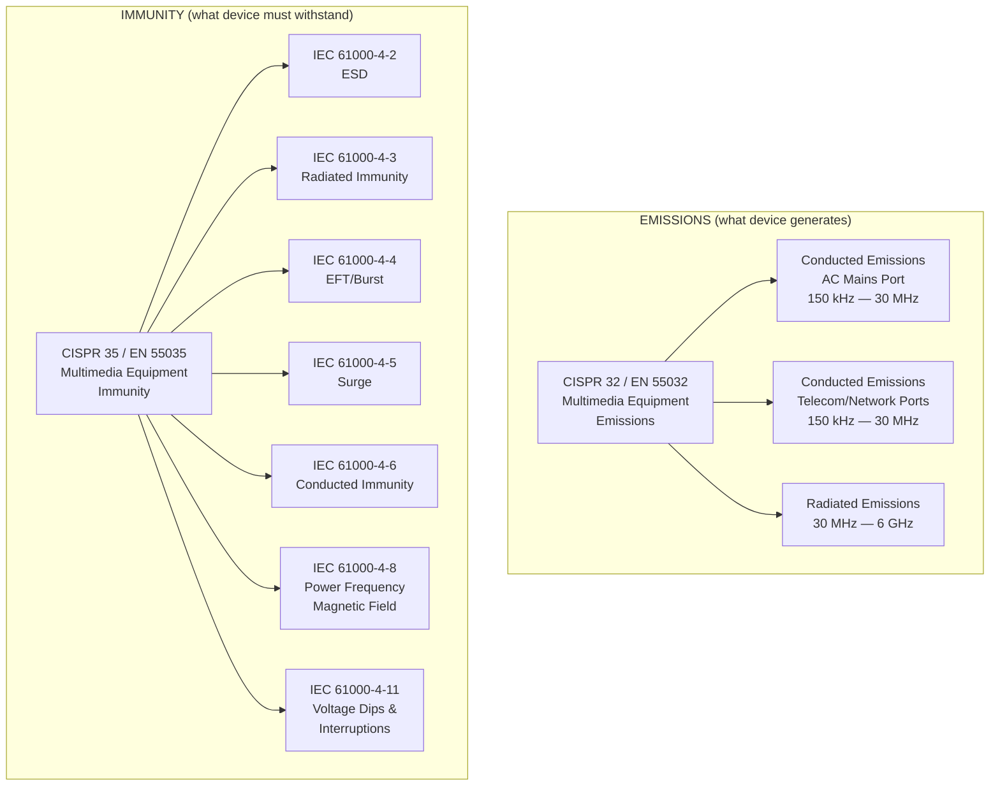
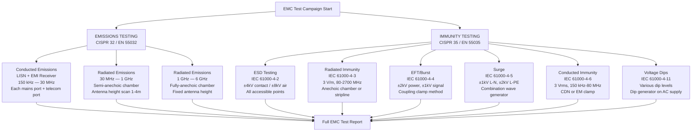

# EMC Standards — CISPR 32, CISPR 35 & IEC 61000 Series

**Topic:** Electromagnetic Compatibility (EMC) for Multimedia Equipment — Emissions & Immunity  
**Standards:** CISPR 32:2015+A1:2020, CISPR 35:2016+A1:2020, IEC 61000 series (4-2, 4-3, 4-4, 4-5, 4-6, 4-8, 4-11)  
**SDO:** IEC CISPR (Comité International Spécial des Perturbations Radioélectriques), IEC TC 77  
**Audience:** EMC design engineers, test engineers, compliance engineers, product development teams  
**Prerequisites:** Basic electromagnetic theory, signal integrity fundamentals, RF measurement basics

---

## Chapter 1 — Historical Context & Origin Story

### 1.1 Timeline

| Year | Event |
|------|-------|
| 1934 | CISPR founded (International Special Committee on Radio Interference) |
| 1975 | CISPR 13 (sound/TV receivers — immunity) |
| 1985 | CISPR 22 published (IT equipment — emissions) — the foundational standard |
| 1993 | EU EMC Directive 89/336/EEC enforced (CE marking mandatory) |
| 1997 | CISPR 24 published (IT equipment — immunity) |
| 2004 | EU EMC Directive 2004/108/EC (updated framework) |
| 2012 | CISPR 32 Edition 1 published (replaces CISPR 13 + CISPR 22) |
| 2014 | EU EMC Directive 2014/30/EU (current version) |
| 2016 | CISPR 35 published (replaces CISPR 13 immunity + CISPR 24) |
| 2015 | CISPR 32 Edition 2 (EN 55032:2015 in EU — mandatory from 2017) |
| 2017 | EN 55032:2015 DOW (Date Of Withdrawal for EN 55022) |
| 2020 | CISPR 32 Amendment 1; CISPR 35 Amendment 1 |
| 2021 | EN 55032:2015+A1:2020 and EN 55035:2017+A11:2020 current EU harmonized |
| 2024 | CISPR 32 Edition 3 under development (addresses 5G coexistence) |

### 1.2 CISPR Family Consolidation

| Old Standard | Scope | Replaced By |
|-------------|-------|-------------|
| CISPR 22 | IT equipment emissions | CISPR 32 |
| CISPR 13 (emissions part) | Sound/TV broadcast receivers emissions | CISPR 32 |
| CISPR 24 | IT equipment immunity | CISPR 35 |
| CISPR 13 (immunity part) | Sound/TV broadcast receivers immunity | CISPR 35 |
| CISPR 20 | Sound/TV receivers (immunity to conducted disturbances) | CISPR 35 |

---

## Chapter 2 — Standard Architecture & Structure

### 2.1 EMC Framework for Consumer Electronics



### 2.2 Equipment Classes (CISPR 32)

| Class | Environment | Limit Stringency | Examples |
|-------|-------------|-----------------|----------|
| Class A | Commercial, industrial, business | Less strict (higher limits) | Office servers, industrial PCs, studio equipment |
| Class B | Residential, domestic | Strict (lower limits — more protection) | Consumer electronics, home routers, personal computers, TVs |

**Key rule:** If sold to consumers (residential use possible), must meet **Class B**.

---

## Chapter 3 — Technical Deep Dive

### 3.1 CISPR 32 — Conducted Emissions Limits (AC Mains)

**Class B Limits (Residential — EN 55032 Table A.2):**

| Frequency Range | Quasi-Peak (QP) Limit | Average Limit |
|----------------|----------------------|---------------|
| 150 kHz — 500 kHz | 66 → 56 dBμV (linear decrease) | 56 → 46 dBμV |
| 500 kHz — 5 MHz | 56 dBμV | 46 dBμV |
| 5 MHz — 30 MHz | 60 dBμV | 50 dBμV |

**Class A Limits (Commercial — EN 55032 Table A.1):**

| Frequency Range | Quasi-Peak (QP) Limit | Average Limit |
|----------------|----------------------|---------------|
| 150 kHz — 500 kHz | 79 dBμV | 66 dBμV |
| 500 kHz — 5 MHz | 73 dBμV | 60 dBμV |
| 5 MHz — 30 MHz | 73 dBμV | 60 dBμV |

### 3.2 CISPR 32 — Radiated Emissions Limits

**Class B Limits (at 10m distance — EN 55032 Table A.4):**

| Frequency Range | QP Limit (10m) | QP Limit (3m equivalent) |
|----------------|----------------|--------------------------|
| 30 MHz — 230 MHz | 30 dBμV/m | 40 dBμV/m |
| 230 MHz — 1 GHz | 37 dBμV/m | 47 dBμV/m |

**Class A Limits (at 10m distance):**

| Frequency Range | QP Limit (10m) |
|----------------|----------------|
| 30 MHz — 230 MHz | 40 dBμV/m |
| 230 MHz — 1 GHz | 47 dBμV/m |

**Above 1 GHz (CISPR 32 Annex A — for devices with internal sources >1 GHz):**

| Frequency | Class B Limit (3m) | Measurement |
|-----------|-------------------|-------------|
| 1 — 3 GHz | 50 dBμV/m (avg), 70 dBμV/m (peak) | Average detector |
| 3 — 6 GHz | 54 dBμV/m (avg), 74 dBμV/m (peak) | Average detector |

### 3.3 CISPR 35 — Immunity Test Levels

| Test | Standard | Port/Location | Test Level | Performance Criterion |
|------|----------|--------------|------------|----------------------|
| ESD | IEC 61000-4-2 | Enclosure (contact) | ±4 kV | B |
| ESD | IEC 61000-4-2 | Enclosure (air) | ±8 kV | B |
| Radiated immunity | IEC 61000-4-3 | Enclosure | 3 V/m (80-1000 MHz) | A |
| Radiated immunity | IEC 61000-4-3 | Enclosure | 3 V/m (1.4-2.7 GHz) | A |
| EFT/Burst | IEC 61000-4-4 | AC power port | ±2 kV | B |
| EFT/Burst | IEC 61000-4-4 | Signal/telecom port | ±1 kV | B |
| Surge | IEC 61000-4-5 | AC power (L-N) | ±1 kV | B |
| Surge | IEC 61000-4-5 | AC power (L/N-PE) | ±2 kV | B |
| Conducted immunity | IEC 61000-4-6 | Signal/telecom ports | 3 Vrms (150 kHz-80 MHz) | A |
| Power frequency MF | IEC 61000-4-8 | Enclosure | 3 A/m (50/60 Hz) | A |
| Voltage dips | IEC 61000-4-11 | AC power port | 0% (0.5 cycle) | B/C |
| Voltage dips | IEC 61000-4-11 | AC power port | 70% reduction (25 cycles) | B |

### 3.4 Performance Criteria Definitions

| Criterion | Definition |
|-----------|-----------|
| A | Normal performance during AND after test. No degradation. |
| B | Temporary degradation or loss of function DURING test. Self-recovers after test. No operator intervention needed. No data loss. |
| C | Temporary loss of function. May require operator intervention (power cycle, reset). No hardware damage. |
| D | Not recoverable. Hardware damage or permanent data loss. (NOT ACCEPTABLE — product fails.) |

### 3.5 IEC 61000 Series — Key Standards

| Standard | Title | Key Content |
|----------|-------|-------------|
| IEC 61000-4-2 | ESD | Electrostatic discharge immunity test |
| IEC 61000-4-3 | Radiated immunity | RF electromagnetic field immunity |
| IEC 61000-4-4 | EFT/Burst | Electrical fast transient / burst immunity |
| IEC 61000-4-5 | Surge | Power line surge immunity |
| IEC 61000-4-6 | Conducted immunity | RF conducted disturbance immunity |
| IEC 61000-4-8 | Power frequency MF | 50/60 Hz magnetic field immunity |
| IEC 61000-4-11 | Voltage dips/interruptions | Mains voltage quality immunity |
| IEC 61000-6-1 | Generic immunity (residential) | For products without product-specific standard |
| IEC 61000-6-3 | Generic emissions (residential) | For products without product-specific standard |

---

## Chapter 4 — Implementation Guide

### 4.1 EMC Design Guidelines

| Design Area | Best Practice |
|-------------|--------------|
| PCB layout | Solid ground plane under all signal traces; minimize loop area |
| Power supply filtering | Common-mode choke on AC input; X/Y capacitors at entry |
| Decoupling | 100nF ceramic + 10μF bulk at every IC power pin |
| Clock signals | Series resistors (22-33Ω) on clock outputs; avoid routing near board edges |
| I/O connectors | Filter every cable entry/exit (ferrite bead, common-mode choke, or TVS) |
| ESD protection | TVS diodes on all user-accessible ports (USB, HDMI, Ethernet) |
| Shielding | Metal enclosure or conductive coating; bond shield to ground at multiple points |
| Cable management | Keep cables short; use shielded cables for high-speed signals |
| Grounding | Single-point ground for low-frequency; multi-point for high-frequency |
| Spread spectrum clocking | Reduce peak emissions by 5-8 dB (smears energy across bandwidth) |

### 4.2 EMC Test Setup — Conducted Emissions

```mermaid
graph LR
    subgraph "Conducted Emissions Test Setup"
        EUT[Equipment Under Test<br/>Normal operation]
        LISN[LISN<br/>(Line Impedance<br/>Stabilization Network)<br/>50Ω/50μH per line]
        RECEIVER[EMI Receiver<br/>or Spectrum Analyzer<br/>with QP + AVG detectors]
        GP[Ground Plane<br/>(2m × 2m minimum)]
    end
    
    EUT -->|"AC Mains"| LISN
    LISN -->|"RF output port<br/>(50Ω coax)"| RECEIVER
    EUT --- GP
    LISN --- GP
    
    style LISN fill:#ffcc00
```

**LISN Parameters:**
- 50Ω impedance, 50μH inductance (per CISPR 16-1-2)
- One LISN per line (L + N + PE if applicable)
- Measurement on each line individually (worst-case reported)

### 4.3 EMC Test Setup — Radiated Emissions

| Parameter | Requirement |
|-----------|-------------|
| Test site | Semi-anechoic chamber (SAC) or Open-Area Test Site (OATS) |
| Distance | 3m (Class B) or 10m (preferred; 3m with conversion factor) |
| Antenna height scan | 1m — 4m (find maximum by varying receive antenna height) |
| Turntable | 360° rotation of EUT (find worst-case azimuth) |
| Antenna | Biconical (30-300 MHz) + Log-periodic (200 MHz-1 GHz) + Horn (>1 GHz) |
| Floor | Conductive ground plane (or absorber-lined for >1 GHz) |
| Receiver | EMI receiver per CISPR 16-1-1 (QP, AVG, Peak detectors) |

### 4.4 Common EMC Failures and Fixes

| Failure | Typical Cause | Fix |
|---------|---------------|-----|
| Conducted 150-500 kHz | Switching power supply fundamental | Increase X-capacitor (470nF→2.2μF) + CM choke |
| Conducted 5-30 MHz | SMPS high-order harmonics | Add Y-capacitor (2.2nF); snubber on switch |
| Radiated 30-100 MHz | Cable common-mode current | Add ferrite clamp on cable; improve cable shielding |
| Radiated 100-300 MHz | PCB trace resonance / poor grounding | Improve ground plane; add stitching vias |
| Radiated 300 MHz-1 GHz | IC clock harmonics radiating from traces | Series termination resistor; spread-spectrum clock |
| Radiated 1-3 GHz | High-speed digital (USB 3.x, HDMI, DDR) | Shielding; controlled impedance traces; connector filtering |
| ESD failure (port) | No TVS protection on exposed pins | Add TVS diode (capacitance-appropriate for data rate) |
| EFT failure | Fast transients coupling through power supply | Add common-mode choke + Y-cap on power entry |
| Surge failure | No MOV/TVS on power input | Add MOV (275V AC) + gas discharge tube |

---

## Chapter 5 — Certification & Compliance

### 5.1 EMC Compliance Path (EU)

| Step | Action |
|------|--------|
| 1 | Identify product category → CISPR 32/35 (multimedia equipment) |
| 2 | Determine Class A or B (residential capable → Class B) |
| 3 | Pre-compliance testing (in-house or pre-compliance lab) |
| 4 | Full compliance testing at accredited lab (ISO 17025) |
| 5 | EMC test report (per CISPR 32 + CISPR 35) |
| 6 | Include in Technical File for CE marking |
| 7 | Self-declare conformity (EMC Directive or RED Art 3.1b) |

### 5.2 EMC Test Reports

| Content | Detail |
|---------|--------|
| DUT description | Model, serial, firmware version, configuration |
| Test configuration | Peripherals connected, operating mode |
| Standards applied | EN 55032:2015+A1:2020, EN 55035:2017+A11:2020 |
| Test equipment | Receiver model, antenna type, LISN, calibration dates |
| Test results | Measured levels vs. limits (graphs + tables) |
| Margin | Minimum 3 dB margin recommended for production variation |
| Photographs | Test setup, EUT configuration, cable routing |
| Uncertainty | Measurement uncertainty budget (not added to result per CISPR) |

### 5.3 Lab Accreditation

| Accreditation | Region | Meaning |
|--------------|--------|---------|
| ISO 17025 (ILAC MRA) | Global | Lab quality management for testing |
| A2LA | USA | US accreditation body (recognized by FCC) |
| UKAS | UK | UK accreditation service |
| DAkkS | Germany | German accreditation body |
| NVLAP | USA | NIST lab accreditation (alternative to A2LA) |
| CNAS | China | China national accreditation service |

---

## Chapter 6 — Regional Variants

### 6.1 Emissions Standards by Region

| Region | Emissions Standard | Basis |
|--------|-------------------|-------|
| EU (CE marking) | EN 55032:2015+A1:2020 | CISPR 32 |
| USA (FCC) | 47 CFR Part 15 Subpart B | Based on CISPR 22 (legacy), ANSI C63.4 test method |
| Canada (ISED) | ICES-003 | Based on CISPR 32 |
| Japan (VCCI) | VCCI V-3/2021.04 (voluntary) | Based on CISPR 32 |
| Korea (KCC) | KN 32 | Based on CISPR 32 |
| China (CCC) | GB/T 9254.1 | Based on CISPR 32 |
| Australia (ACMA) | AS/NZS CISPR 32 | Direct adoption of CISPR 32 |

### 6.2 FCC Part 15B vs. CISPR 32 Differences

| Parameter | FCC Part 15B | CISPR 32 (EN 55032) |
|-----------|-------------|---------------------|
| Conducted limits | Similar to Class B (slightly different breakpoints) | CISPR 32 Table A.2 |
| Radiated limits (3m) | 40 dBμV/m (30-88 MHz), 43.5 (88-216), 46 (216-960), 54 (>960 MHz) | 40 dBμV/m (30-230 MHz), 47 (230-1000 MHz) |
| Measurement distance | 3m (default for Class B) | 10m (with 3m alternative) |
| Above 1 GHz | Required if clock >108 MHz (FCC KDB 558074) | Required if internal source >1 GHz (CISPR 32 Annex A) |
| Test method | ANSI C63.4 | CISPR 16-2-3 |
| Detector | QP + Average | QP + Average |
| Verification vs. Certification | Class B ≤ unintentional: Supplier's DoC | Self-declaration (EU) |

### 6.3 Key Differences in Immunity Requirements

| Region | Immunity Requirement | Mandatory? |
|--------|---------------------|-----------|
| EU (CE marking) | EN 55035 (CISPR 35) | Yes (EMC Directive or RED Art 3.1b) |
| USA (FCC) | None (FCC does not require immunity testing) | No |
| Canada | None for most products | No |
| Japan | VCCI references CISPR 35 (voluntary) | Voluntary |
| Korea | KN 35 | Yes (KC certification) |
| China | GB/T 17618 (immunity for IT) | Yes for CCC products |
| Australia | AS/NZS CISPR 35 | Yes |

**Important:** FCC does NOT require immunity testing — only emissions. But EU requires BOTH. Design for EU compliance to cover all markets.

---

## Chapter 7 — Comparison with Related Standards

| Dimension | CISPR 32 | CISPR 11 | CISPR 14-1 | FCC Part 15B |
|-----------|----------|----------|-----------|-------------|
| Product type | Multimedia (IT, A/V, telecom) | ISM equipment (industrial, scientific, medical) | Household appliances | Unintentional radiators (IT) |
| Examples | Computers, TVs, routers, speakers | Microwave ovens, welders, MRI | Vacuum cleaners, washers, drills | PCs, monitors, peripherals |
| Radiated limit (Class B, 3m) | 40/47 dBμV/m | 30/37 dBμV/m (Group 1) | 40/47 dBμV/m | 40/43.5/46/54 dBμV/m |
| Conducted limit (Class B) | 66→56/56 dBμV | Similar | 66→56/56 dBμV | 48→66 dBμV (different breakpoints) |
| Above 1 GHz | Yes (Annex A) | Yes (Annex C) | Not typically | Yes (if clock >108 MHz) |
| Immunity | CISPR 35 | None (separate) | CISPR 14-2 | None required |
| Status | Current | Current | Current | Current |

---

## Chapter 8 — Mermaid Architecture Diagrams

### 8.1 EMC Test Sequence



### 8.2 Conducted Emissions Troubleshooting

```mermaid
graph TB
    FAIL[Conducted Emissions<br/>EXCEEDS LIMIT]
    
    FAIL --> Q1{Which frequency<br/>range fails?}
    
    Q1 -->|"150-500 kHz"| FIX1[Increase X-capacitor<br/>Add CM choke inductance<br/>Adjust PFC boost frequency]
    Q1 -->|"500 kHz - 5 MHz"| FIX2[Add Y-capacitor (2.2nF)<br/>Snubber on MOSFET<br/>Gate drive optimization]
    Q1 -->|"5-30 MHz"| FIX3[Improve layout<br/>Shorter trace to LISN<br/>Add HF ferrite on input<br/>Second-stage LC filter]
    
    FAIL --> Q2{Differential-mode<br/>or Common-mode?}
    Q2 -->|"DM (L-N difference)"| FIX_DM[X-capacitor<br/>Series inductance<br/>(differential-mode filter)]
    Q2 -->|"CM (L and N same)"| FIX_CM[Y-capacitors<br/>Common-mode choke<br/>Improve earth bonding]
```

### 8.3 EMC Filter Architecture (Power Supply Input)

```mermaid
graph LR
    subgraph "Typical EMC Input Filter"
        MAINS[AC Mains<br/>L, N, PE] 
        MOV[MOV<br/>275V<br/>(Surge protection)]
        GDT[GDT<br/>Gas Discharge<br/>(Optional: harsh)]
        FUSE[Fuse<br/>(Overcurrent)]
        CM1[CM Choke 1<br/>10-30 mH<br/>(Low-freq CM)]
        CX1[X-Cap<br/>0.1-1 μF<br/>(DM filter)]
        CY1[Y-Cap<br/>2.2 nF<br/>(CM filter L-PE)]
        CM2[CM Choke 2<br/>1-5 mH<br/>(High-freq CM)]
        CX2[X-Cap<br/>0.1 μF<br/>(DM HF)]
        RECT[Bridge<br/>Rectifier]
    end
    
    MAINS --> MOV --> FUSE --> CM1 --> CX1 --> CY1 --> CM2 --> CX2 --> RECT
```

---

## Chapter 9 — Case Studies

### 9.1 USB-C Docking Station — Radiated Emissions Failure

| Aspect | Detail |
|--------|--------|
| Product | USB-C dock (HDMI 2.1, USB 3.2, GbE, PD 100W) |
| Failure | Radiated emissions exceed Class B by 8 dB at 480 MHz |
| Investigation | 480 MHz = 3rd harmonic of USB 2.0 (480 Mbps ÷ 2 = 240 MHz fundamental × 2 ≈ not this). Actually: 480 MHz correlates with HDMI TMDS clock (148.5 MHz × 3.2 ≈ 475 MHz) |
| Root cause | HDMI signal traces run near enclosure edge; common-mode current on HDMI cable |
| Fix 1 | Add common-mode choke on HDMI output (impedance at 480 MHz: 1 kΩ) |
| Fix 2 | Reroute HDMI traces away from enclosure slot (reduce aperture coupling) |
| Fix 3 | Improve HDMI connector shield grounding (360° ground contact) |
| Result | 480 MHz emission reduced by 12 dB — now 4 dB below limit (margin OK) |
| Cost | $3,000 (re-test) + $15,000 (PCB respin) + 3 weeks delay |
| Lesson | High-speed video signals (HDMI, DisplayPort) are #1 cause of radiated emissions >300 MHz |

### 9.2 Smart Home Hub — ESD Failure at USB Port

| Aspect | Detail |
|--------|--------|
| Product | Smart home hub (Zigbee + Wi-Fi + Ethernet + USB host) |
| Failure | ESD at USB Type-A port (±4 kV contact) → device resets (Criterion C) |
| Required | Performance Criterion B (temporary degradation OK, self-recovery) |
| Investigation | ESD couples through USB shield → into USB transceiver IC → resets SoC |
| Root cause | No TVS diode on USB data lines; USB shield directly connected to ground plane |
| Fix 1 | Add TVS array (USBLC6-2SC6) on USB D+/D- lines (0.5 pF per line) |
| Fix 2 | Connect USB shield to chassis ground via 1 nF capacitor (blocks DC, passes RF) |
| Fix 3 | Add 100pF capacitor on SoC reset line (prevent false reset from fast transient) |
| Result | ESD at ±8 kV air — device continues operating (Criterion A achieved) |
| Cost | $0.50 BOM increase + 1 week re-test |
| Lesson | Every user-accessible port MUST have ESD protection. Budget during design, not after. |

---

## Chapter 10 — Future Evolution & Industry Trends

| Trend | Timeline | Description |
|-------|----------|-------------|
| CISPR 32 Edition 3 | 2025-2026 | Address 5G NR coexistence, update above-1GHz requirements |
| CISPR 35 Amendment 2 | 2025 | Updated radiated immunity to cover 5G bands (3.5 GHz, 26 GHz) |
| Automotive EMC convergence | Growing | CISPR 25 (automotive) aligning with CISPR 32 for in-vehicle IT |
| Above 6 GHz emissions | 2025+ | New requirements for devices with 5G mmWave / Wi-Fi 7 (6 GHz) |
| Time-domain EMC testing | Research | Faster testing using FFT-based receivers (already in CISPR 16-1-1 Am.2) |
| AI-assisted EMC design | Growing | ML tools predict EMC performance during PCB layout phase |
| GaN power supply EMC | Now | GaN switching at >1 MHz creates new conducted emission challenges |
| USB4 / Thunderbolt 5 EMC | 2024-2026 | 80-120 Gbps data rates → emissions at >10 GHz |
| Wireless charging EMC | 2025+ | Qi2 (MPP) and resonant WPT → new conducted/radiated profiles |
| Simulation-based compliance | Growing | Computational EMC replacing some measurements (regulatory acceptance pending) |
| Reverberation chamber | Growing | Mode-stirred chambers for faster immunity testing (CISPR acceptance) |

---

## Chapter 11 — Interview Questions & Career Guide

### Tier 1: Entry-Level

**Q1:** Explain the difference between conducted emissions and radiated emissions. How are they measured?  
**A:** **Conducted Emissions:** Electromagnetic interference conducted through wires (power cord, signal cables) back into the electrical network. **Frequency range:** 150 kHz — 30 MHz (these frequencies travel well on wires but don't radiate efficiently). **How measured:** LISN (Line Impedance Stabilization Network) is connected between the DUT and AC mains. LISN provides: (a) constant 50Ω impedance for measurement, (b) isolation from mains noise, (c) RF measurement port for EMI receiver. EMI receiver measures voltage (dBμV) at LISN RF output with both Quasi-Peak (QP) and Average (AVG) detectors. Result compared against limits (e.g., Class B: 56 dBμV QP at 500 kHz — 5 MHz). **Radiated Emissions:** Electromagnetic interference radiated through space (from PCB traces, cables acting as antennas, enclosure openings). **Frequency range:** 30 MHz — 6 GHz (these frequencies radiate efficiently from conductors and openings). **How measured:** EUT placed on turntable in semi-anechoic chamber (SAC). Receiving antenna at 3m or 10m distance. Antenna height scanned from 1m — 4m (maximize received signal). EUT rotated 360°. Measured in both horizontal and vertical polarizations. EMI receiver measures field strength (dBμV/m). Result compared against limits (e.g., Class B at 3m: 40 dBμV/m from 30-230 MHz). **Key conceptual difference:** Conducted = interference on WIRES (measured as voltage). Radiated = interference through AIR (measured as field strength).

### Tier 2: Mid-Level

**Q2:** Your product fails conducted emissions at 150-300 kHz by 6 dB. Walk through your systematic troubleshooting and fix approach.  
**A:** **Diagnosis process:** (1) **Identify the emission type (DM vs CM):** Method: Measure L (Line) and N (Neutral) conducted emissions separately. If L and N have same amplitude and phase: Common-mode (CM) dominant. If L and N differ (one is higher): Differential-mode (DM) dominant. At 150-300 kHz: usually DM (power supply switching fundamental or low-harmonic). (2) **Identify the source:** 150-300 kHz corresponds to switching power supply fundamental frequency. Check: SMPS switching frequency (e.g., 65 kHz PFC + 150 kHz LLC resonant). 150 kHz failure: likely the LLC/flyback converter fundamental or 2nd harmonic of PFC (65 kHz × 2 = 130 kHz → close). (3) **Fix approaches (in order of effectiveness):** **Fix A — Increase X-capacitor (DM filter):** Current: X2-rated 100nF capacitor across L-N. Increase to: 470nF or 1μF X2 capacitor. Expected improvement: 10-14 dB at 150 kHz (capacitor impedance drops as C increases). Cost: $0.10 extra. **Fix B — Add/increase common-mode choke (CM filter):** If emission is CM: Add CM choke with 10-30 mH inductance. At 150 kHz: Z_CM = 2π × 150k × 10mH = 9.4 kΩ → significant attenuation. Expected improvement: 6-10 dB depending on source impedance. Cost: $0.50-$1.50 (choke is relatively expensive). **Fix C — Add Y-capacitor (CM to ground):** Add 2.2 nF Y1/Y2 rated capacitor from L to PE and N to PE. Provides CM return path through earth before reaching LISN. Expected improvement: 3-6 dB at 150 kHz. Leakage current: 2.2nF × 2π × 50Hz × 240V = 0.17 mA (well within 0.5 mA limit). **Fix D — Optimize SMPS design:** Adjust switching frequency to above 150 kHz (moves fundamental out of CISPR band). Or: reduce switching edge rates (slower dV/dt = less harmonic content). Or: add snubber circuit across switching element (damps ringing). (4) **Verification:** Pre-compliance scan in-house (if available) to verify fix before booking full compliance test. Expect 3-6 dB production margin (component tolerances, temperature variation). Target: 6 dB below limit after fix (total 12 dB improvement needed: 6 dB over + 6 dB margin). (5) **Implementation priority:** If PCB change possible: Fix A (X-cap) + Fix B (CM choke) — most effective combination. If BOM-only change (no layout change): Fix A (larger X-cap in same footprint if possible). If next PCB revision: redesign filter section with proper staged LC network.

### Tier 3: Senior/Expert

**Q3:** Design a complete EMC strategy for a product with USB4 (40 Gbps), Wi-Fi 7, HDMI 2.1, and 500W GaN power supply. Address both emissions and immunity at the system architecture level.  
**A:** **Product:** High-performance docking station / mini-PC. Key EMC challenges: USB4 at 40 Gbps (PAM-3, 20 GHz fundamental). HDMI 2.1 (48 Gbps, 12 GHz TMDS clock). Wi-Fi 7 (intentional transmitter — excluded from emissions but creates co-existence issues). 500W GaN PSU (switching >1 MHz → conducted emissions challenge). **1. System-level EMC architecture:**
```
[AC Mains] → [EMC Filter Stage] → [GaN 500W PSU] → [DC Distribution]
                                                           ↓
[Shielded Main Board] ← → [USB4 Controller] → [USB4 Ports (shielded)]
                     ← → [HDMI 2.1 Controller] → [HDMI Port (shielded)]
                     ← → [Wi-Fi 7 Module] → [Antenna (intentional)]
```
**2. Conducted emissions (GaN PSU):** Challenge: GaN switches at 1-3 MHz (vs. silicon at 100-200 kHz). Harmonic content extends to >30 MHz with significant energy at 5-15 MHz. Higher dV/dt (100 V/ns for GaN vs. 10-20 V/ns for Si) → more CM noise. **Strategy:** Multi-stage EMC filter: Stage 1 (mains side): CM choke (20 mH) + X-cap (1 μF) — addresses 150-500 kHz. Stage 2: CM choke (3 mH) + Y-caps (2.2 nF each) — addresses 500 kHz-5 MHz. Stage 3 (near GaN stage): HF CM choke (100 μH ferrite) + ceramic X-cap (100 nF) — addresses 5-30 MHz. GaN-specific: Add RC snubber on drain (damps switching transient). Use common-mode EMI cancellation technique (aux winding on transformer). Shield GaN switching cell with local Faraday cage on PCB (prevents radiated coupling to adjacent circuits). **3. Radiated emissions (USB4 + HDMI 2.1):** Challenge: USB4 at 40 Gbps → fundamental at 20 GHz, significant harmonics at 5-15 GHz. HDMI 2.1 at 12 Gbps per lane → 6 GHz fundamental, harmonics to 18 GHz. These create CISPR 32 Annex A above-1 GHz emission challenges. **Strategy:** Full metal enclosure (die-cast aluminum) with EMC gaskets on all openings. Connector shielding: 360° ground contact for all high-speed connectors. Internal shielding: separate chamber for GaN PSU (prevents coupling to digital board). PCB design: Controlled impedance (85Ω USB4, 100Ω HDMI) — minimize reflections that create CM noise. USB4 connector: compliance with USB4 EMC design guide (Intel/USB-IF). Common-mode filters on USB4 and HDMI (integrated CMC in connector/retimer). USB4 retimer IC: places retimer near connector (reduces cable acting as antenna). **4. Immunity strategy:** ESD: TVS on every user-accessible port. USB4: specialized high-speed TVS (PUSB3FR4 — 0.2pF, no signal degradation at 20 GHz). HDMI: TVS array with <0.5 pF per pin. Ethernet: transformer provides inherent isolation + TVS on PHY side. Surge: MOV (275V) on AC input + TVS on DC bus. EFT: handled by multi-stage EMC filter (already designed for emissions). Radiated immunity: internal design robustness (proper decoupling, controlled impedance, no floating traces). **5. Wi-Fi 7 co-existence:** Challenge: Wi-Fi 7 intentional TX is exempt from EMISSIONS limits, but... Wi-Fi 7 at 6 GHz transmits at 23 dBm (200 mW) — this signal can desensitize: USB4 (if USB4 has any receiving function at overlapping frequencies), Other radios (BT), Adjacent equipment (neighbor's Wi-Fi). **Strategy:** RF isolation between Wi-Fi antenna and USB4/HDMI connectors: ≥40 dB. Physical separation + metal wall between RF section and digital section. EMC shielding can on Wi-Fi module (prevents Wi-Fi from coupling to USB4 traces). **6. Testing plan:** Pre-compliance (in-house): $5,000 (own chamber time). Conducted emissions: $3,000 (accredited lab, 1 day). Radiated emissions 30 MHz-1 GHz: $4,000 (SAC, 1.5 days). Radiated emissions 1-6 GHz: $3,000 (FAR, 1 day). Immunity full suite: $8,000 (3 days). Total formal compliance: $18,000-$22,000. Duration: 5-7 days of testing + 2 weeks for report. **7. Expected challenges and risk mitigation:** USB4 40 Gbps: very few compliance-passing products — engage USB-IF EMC working group. GaN >1 MHz: conducted emissions in 5-30 MHz is the hardest region (needs iterative filter tuning). HDMI 2.1: common-mode current on HDMI cable is primary radiated source above 1 GHz. Mitigation: allocate 2 PCB revision cycles for EMC optimization. Start pre-compliance testing at prototype stage (not production).

---

## Chapter 12 — Cheat Sheet & Quick Reference

### CISPR 32 Class B Limits (Consumer Electronics)

```
CONDUCTED (AC Mains, LISN measurement):
  150-500 kHz:  66→56 dBμV (QP), 56→46 dBμV (Avg)
  500 kHz-5 MHz: 56 dBμV (QP), 46 dBμV (Avg)
  5-30 MHz:      60 dBμV (QP), 50 dBμV (Avg)

RADIATED (3m distance):
  30-230 MHz:    40 dBμV/m (QP)
  230-1000 MHz:  47 dBμV/m (QP)
  1-3 GHz:       50 dBμV/m (Avg), 70 dBμV/m (Peak)
  3-6 GHz:       54 dBμV/m (Avg), 74 dBμV/m (Peak)
```

### CISPR 35 Immunity Quick Reference

```
Test          Standard        Level              Criterion
ESD (contact) 61000-4-2      ±4 kV              B
ESD (air)     61000-4-2      ±8 kV              B
Radiated      61000-4-3      3 V/m (80-2700MHz) A
EFT (power)   61000-4-4      ±2 kV              B
EFT (signal)  61000-4-4      ±1 kV              B
Surge (L-N)   61000-4-5      ±1 kV              B
Surge (L-PE)  61000-4-5      ±2 kV              B
Conducted     61000-4-6      3 Vrms (150k-80M)  A
Mag field     61000-4-8      3 A/m (50 Hz)      A
Dips          61000-4-11     0% for 0.5 cycle   B/C
```

### Performance Criteria

```
A = No degradation during or after test
B = Temporary degradation OK during test; self-recovers
C = Loss of function; may need user reset; no hardware damage  
D = Permanent damage (NEVER acceptable — product FAILS)
```

### EMC Design Checklist

```
□ Multi-stage EMC filter on AC input (CM choke + X-cap + Y-cap)
□ TVS/ESD protection on ALL user-accessible ports
□ Solid ground plane under all signal traces (no splits under high-speed)
□ 100nF + 10μF decoupling on every IC power pin
□ Controlled impedance for USB/HDMI/DDR/PCIe traces
□ Ferrite beads on cable entry points (or CM choke)
□ Metal or conductive-coated enclosure (shielding)
□ 360° ground contact on all shielded connectors
□ Spread-spectrum clocking on non-data clocks
□ Shortest possible trace length for high-speed signals
□ No traces routed near enclosure openings/slots
□ Cable shield grounded at connector (not pigtail)
```

### Quick DM vs. CM Diagnosis

```
Measure L and N ports on LISN separately:
  - Same amplitude, same phase → COMMON MODE
    Fix: Y-caps to ground, CM choke
  - Different amplitude → DIFFERENTIAL MODE  
    Fix: X-cap across L-N, series inductance
  - Both present → MIXED MODE
    Fix: Both X-cap AND CM choke + Y-caps
```

---

*End of Document — 05_EMC_Standards_CISPR.md*
