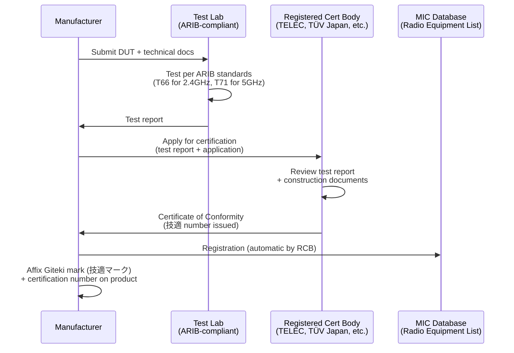

# Japan Market Access — MIC Radio Certification, VCCI EMC & PSE Safety

**Topic:** Japanese Regulatory Compliance for Consumer Electronics — Radio, EMC, and Electrical Safety  
**Standards:** Radio Law (MIC/TELEC), VCCI V-3/2021.04, PSE (Electrical Appliance and Material Safety Law), JIS C 62368-1  
**SDO:** MIC (Ministry of Internal Affairs and Communications), VCCI Council, METI (Ministry of Economy, Trade and Industry)  
**Audience:** Market access specialists, regulatory compliance engineers, product managers targeting Japan  
**Prerequisites:** Basic understanding of CE marking/FCC certification concepts, RF fundamentals

---

## Chapter 1 — Historical Context & Origin Story

### 1.1 Timeline

| Year | Event |
|------|-------|
| 1950 | Radio Law (電波法) established — MIC regulates all radio equipment |
| 1961 | Electrical Appliance and Material Safety Law (電安法) — PSE mark origins |
| 1985 | VCCI Council established (voluntary EMC compliance for IT equipment) |
| 1994 | TELEC (Telecom Engineering Center) designated as Registered Certification Body |
| 2000 | Radio Law reform — Giteki mark (技適マーク) system established |
| 2001 | PSE mark system launched (replaces T-mark and other safety marks) |
| 2004 | MIC expands self-conformity assessment (Technical Conformity Mark) |
| 2014 | VCCI transitions from CIB (Council for Information Technology Business) |
| 2016 | Radio Law Article 38-2-2 (designated standards for Wi-Fi SRD) |
| 2019 | 5G spectrum allocated (Sub-6 + mmWave: 3.7/4.5/28 GHz) |
| 2020 | Wi-Fi 6E 6 GHz band studies initiated |
| 2022 | VCCI updates to V-3/2021.04 (aligned with CISPR 32/35) |
| 2023 | 6 GHz band (5925-6425 MHz) approved for Wi-Fi 6E (Low Power Indoor) |
| 2024 | MIC streamlines foreign certification procedures |

### 1.2 Japan Regulatory Framework Overview

| Regulation | Authority | Scope | Mark |
|-----------|-----------|-------|------|
| Radio Law (電波法) | MIC (Ministry of Internal Affairs and Communications) | All radio transmitters/receivers | 技適マーク (Giteki mark) |
| VCCI Agreement | VCCI Council (voluntary industry body) | IT/multimedia EMC (emissions) | VCCI mark (voluntary) |
| Electrical Appliance Safety Law (電安法) | METI (Ministry of Economy, Trade and Industry) | Electrical safety (AC-powered) | PSE mark (◇PSE or 〇PSE) |
| Telecommunications Business Law | MIC | Telecom terminal equipment | JATE certification |
| Consumer Product Safety Law | METI | Product safety (general) | SG mark, ST mark (voluntary) |

---

## Chapter 2 — Standard Architecture & Structure

### 2.1 Regulatory Decision Tree for Japan

```mermaid
graph TB
    PRODUCT[Electronic Product<br/>for Japan Market]
    
    PRODUCT --> Q1{Contains intentional<br/>radio TX/RX?}
    Q1 -->|"Yes"| MIC[MIC Radio Law<br/>技適 (Giteki) Certification<br/>Required by law]
    Q1 -->|"No"| SKIP_MIC[No radio cert needed]
    
    PRODUCT --> Q2{IT/Multimedia<br/>equipment?}
    Q2 -->|"Yes"| VCCI[VCCI EMC Compliance<br/>Voluntary but effectively<br/>mandatory (market expects it)]
    Q2 -->|"No"| SKIP_VCCI[VCCI may not apply]
    
    PRODUCT --> Q3{AC-powered?<br/>Or contains AC adapter?}
    Q3 -->|"Yes (product itself<br/>or AC adapter)"| PSE[PSE Mark Required<br/>(METI — Electrical Safety)<br/>◇PSE or 〇PSE]
    Q3 -->|"Battery only,<br/>no AC adapter sold"| SKIP_PSE[PSE not required<br/>for battery-only device]
    
    PRODUCT --> Q4{Connects to<br/>telecom network?}
    Q4 -->|"Yes (PSTN/ISDN)"| JATE[JATE Certification<br/>(Telecom terminal)]
    Q4 -->|"No"| SKIP_JATE[JATE not needed]
```

### 2.2 MIC Radio Law — Category Structure

| Category | Description | Certification Body | Process |
|----------|-------------|-------------------|---------|
| Specified Radio Equipment | Equipment requiring certification by Registered Certification Body (RCB) | TELEC, TÜV Rheinland Japan, UL Japan, SGS Japan | Type approval → Giteki mark |
| Special Specified Radio Equipment | Certain low-power devices eligible for self-conformity | Manufacturer self-declares | Technical Conformity Mark (self-affixed) |
| Extremely Low Power Radio | Extremely low-power SRD (exempt from certification) | N/A | No certification needed (power limits apply) |

---

## Chapter 3 — Technical Deep Dive

### 3.1 MIC Radio Certification — Key Equipment Categories

| MIC Equipment Category | Frequency/Technology | Key Standard | Notes |
|----------------------|---------------------|-------------|-------|
| Article 2-1-19 | 2.4 GHz (Wi-Fi, BT) | ARIB STD-T66 | Specified Radio Equipment |
| Article 2-1-19-2 | 5 GHz WLAN (W52/W53/W56) | ARIB STD-T71 | DFS required for W53/W56 |
| Article 2-1-19-3 | 5 GHz (W52 only) Low Power | ARIB STD-T71 | Outdoor OK for W52 only |
| Article 2-1-19-5 | 6 GHz WLAN (Wi-Fi 6E) | ARIB STD-T71 (updated) | Indoor Low Power only (2023+) |
| Article 2-1-11-19 | Sub-GHz (920 MHz band) | ARIB STD-T108 | LoRa, Wi-SUN (Japan-specific 920 MHz) |
| Article 2-1-7 | Cellular (4G/5G) | 3GPP conformance | Via operator testing/certification |
| Article 2-1-11-3 | BLE (Bluetooth Low Energy) | ARIB STD-T66 | Same as Wi-Fi 2.4 GHz cert |
| Article 2-1-19-x | NFC (13.56 MHz) | ARIB STD-T82 | Low-power inductive |
| Article 2-1-11 | 315/400/429 MHz SRD | ARIB STD-T67/T93 | Key fobs, sensors |

### 3.2 ARIB Standards vs. ETSI/FCC

| Parameter | Japan (ARIB) | EU (ETSI) | US (FCC) |
|-----------|-------------|-----------|----------|
| 2.4 GHz max power | 10 mW/MHz (EIRP) ≈ 20 dBm total | 100 mW EIRP (20 dBm) | 1 W conducted (30 dBm) + antenna |
| 5 GHz W52 (5150-5250) | 200 mW (23 dBm) | 200 mW EIRP (indoor) | 1 W (30 dBm EIRP, indoor) |
| 5 GHz W53 (5250-5350) | 200 mW (DFS required) | 200 mW EIRP (DFS, indoor) | 250 mW (DFS required) |
| 5 GHz W56 (5470-5725) | 200 mW (DFS required) | 1 W EIRP (DFS) | 1 W (DFS required) |
| 6 GHz | 200 mW (LPI, indoor only) | 200 mW EIRP (LPI) | 1 W indoor / outdoor with AFC |
| 920 MHz (Japan-specific) | 20 mW (250 mW w/LBT) | 868 MHz (different band) | 915 MHz (different band) |
| Sub-GHz IoT | 920.5-928.1 MHz | 863-870 MHz | 902-928 MHz |

### 3.3 VCCI EMC Requirements

| Test | Standard Basis | Class | Limits |
|------|---------------|-------|--------|
| Conducted emissions (AC) | CISPR 32 (VCCI V-3) | Class B (ITE) | Same as CISPR 32 Class B |
| Radiated emissions | CISPR 32 (VCCI V-3) | Class B (ITE) | Same as CISPR 32 Class B |
| Above 1 GHz | CISPR 32 Annex A | Class B | Same as CISPR 32 |
| Immunity | Not required by VCCI | — | VCCI covers emissions ONLY |

**VCCI Classes:**

| VCCI Class | Equivalent | Target Environment |
|-----------|------------|-------------------|
| Class A (旧 Class 1) | CISPR 32 Class A | Commercial/industrial |
| Class B (旧 Class 2) | CISPR 32 Class B | Residential/domestic |

### 3.4 PSE Safety — Categories

| Category | Symbol | Requirements | Examples |
|----------|--------|-------------|----------|
| Category A (Specified Electrical Appliances) | ◇PSE (diamond) | Third-party testing by Registered Conformity Assessment Body (RCAB) | AC adapters/chargers (>10VA), certain cables, switches |
| Category B (Other Electrical Appliances) | 〇PSE (circle) | Self-declaration (manufacturer tests to JIS standards) | Desktop PCs, monitors, printers, LED lighting |

**PSE Safety Standards:**

| Product Type | Japanese Standard | International Equivalent |
|-------------|------------------|------------------------|
| IT/AV/Telecom equipment | JIS C 62368-1 | IEC 62368-1 |
| AC adapters/power supplies | JIS C 62368-1 | IEC 62368-1 |
| Household appliances | JIS C 9335-1 + part-2 | IEC 60335-1 |
| LED lighting | JIS C 8147 | IEC 61347 |
| Lithium batteries (in product) | JIS C 8714 | Based on IEC 62133 |

---

## Chapter 4 — Implementation Guide

### 4.1 MIC Radio Certification Process



### 4.2 Required Documentation for MIC

| Document | Content |
|---------|--------|
| Application form | Company info, product details, certification scope |
| Block diagram | RF chain from baseband to antenna |
| Circuit diagram | Schematic of RF section |
| Antenna details | Type, gain, pattern (if applicable) |
| Frequency/power table | All operating frequencies, channels, max power |
| Photos | Product external + internal (showing RF components) |
| Test report | Per applicable ARIB standard from accredited lab |
| Quality control | Manufacturing process description |
| FW version | Software/firmware version controlling RF parameters |

### 4.3 VCCI Registration Process

| Step | Action | Timeline |
|------|--------|----------|
| 1 | Join VCCI Council (company membership required) | 1-2 weeks |
| 2 | Test product to VCCI V-3 (= CISPR 32) at VCCI-recognized lab | 2-3 days testing |
| 3 | Submit test report to VCCI | — |
| 4 | VCCI reviews and registers product | 1-2 weeks |
| 5 | Affix VCCI mark on product and packaging | — |
| 6 | Annual fee + compliance maintenance | Ongoing |

### 4.4 PSE Compliance Process

**For ◇PSE (Diamond — Specified Products, e.g., AC adapters):**

| Step | Action |
|------|--------|
| 1 | Identify applicable technical standard (JIS C 62368-1) |
| 2 | Test at RCAB (Registered Conformity Assessment Body) — JET, JQA, UL Japan, TÜV |
| 3 | RCAB issues conformity certificate |
| 4 | File business notification with METI (reporting obligation) |
| 5 | Affix ◇PSE mark + RCAB symbol + manufacturer name |
| 6 | Keep records for inspection (factory + test data) |

**For 〇PSE (Circle — Other Products, e.g., PC, monitor):**

| Step | Action |
|------|--------|
| 1 | Self-test to applicable JIS standard (or use accredited lab) |
| 2 | Prepare technical file (test report + design docs) |
| 3 | File business notification with METI |
| 4 | Affix 〇PSE mark + manufacturer name |
| 5 | Maintain test records (3 years minimum) |

---

## Chapter 5 — Certification & Audit

### 5.1 MIC Registered Certification Bodies (RCBs)

| RCB | Notes |
|-----|-------|
| TELEC (Telecom Engineering Center) | Oldest RCB; most categories |
| TÜV Rheinland Japan | International presence; efficient for non-Japanese companies |
| UL Japan | Good for combined FCC + MIC projects |
| SGS Japan | Global testing network |
| Bureau Veritas Japan | European-linked |
| Intertek Japan | Full-service |

### 5.2 PSE Registered Conformity Assessment Bodies (RCABs)

| RCAB | Scope |
|------|-------|
| JET (Japan Electrical Safety & Environment Technology Laboratories) | All PSE categories |
| JQA (Japan Quality Assurance Organization) | All PSE categories |
| UL Japan | IT/AV equipment |
| TÜV Rheinland Japan | IT/AV equipment |
| TÜV SÜD Japan | General electronics |

### 5.3 Maintaining Compliance

| Obligation | Detail |
|-----------|--------|
| MIC: Design change notification | Any change affecting RF performance → re-test or engineering change report |
| MIC: Manufacturing quality | Must maintain consistent production (factory audit possible) |
| VCCI: Annual membership | Annual fee; must report any model changes |
| PSE: Business notification | Filed with METI; updated if product range changes |
| PSE: Factory inspection (◇PSE) | RCAB conducts periodic factory checks |
| Record retention | All test data retained for minimum 3 years (PSE) / indefinitely (MIC) |

---

## Chapter 6 — Regional Variants & Special Cases

### 6.1 Japan vs. Global Comparison

| Aspect | Japan | EU (CE) | US (FCC) |
|--------|-------|---------|----------|
| Radio certification | MIC (技適) — mandatory | RED (self-assessment or NB) | FCC certification/SDoC |
| EMC (emissions) | VCCI — voluntary but expected | EN 55032 — mandatory (CE) | FCC Part 15B — mandatory |
| EMC (immunity) | Not required | EN 55035 — mandatory | Not required |
| Electrical safety | PSE (◇ or 〇) — mandatory for AC | CE (EN 62368-1) — mandatory | UL/CSA listing — voluntary but required by retailers |
| SAR | ARIB STD-T56 (2 W/kg, 10g) | EN 50566 (2 W/kg, 10g) | FCC (1.6 W/kg, 1g) |
| Plug type | JIS C 8303 Type A (flat blade, 100V) | Schuko (CEE 7/7, 230V) | NEMA 1-15/5-15 (120V) |
| Mains voltage | 100V, 50/60 Hz (50 Hz East, 60 Hz West) | 230V, 50 Hz | 120V, 60 Hz |

### 6.2 Japan-Specific Requirements

| Requirement | Detail |
|-------------|--------|
| Japanese language manual | User manual MUST be in Japanese for consumer products |
| Voltage: 100V AC | Japan uses 100V (not 110V or 120V); adapters must support this |
| Dual frequency (50/60 Hz) | Eastern Japan: 50 Hz, Western Japan: 60 Hz — product must work with both |
| JIS standards | Japanese Industrial Standards — often equivalent to IEC but with national deviations |
| Importer of Record | Required: Japanese entity responsible for compliance (JIR) |
| Product labeling | Must include: manufacturer name (in Japanese), rated voltage/current, PSE/VCCI marks |

---

## Chapter 7 — Comparison with Competing Regional Schemes

| Dimension | Japan (MIC/VCCI/PSE) | EU (RED/EMC/LVD) | US (FCC/UL) | Korea (KCC/KC) |
|-----------|---------------------|-------------------|-------------|----------------|
| Radio mandatory? | Yes (MIC) | Yes (RED) | Yes (FCC) | Yes (KCC) |
| EMC mandatory? | No (VCCI voluntary) | Yes (EMC Dir) | Emissions only (FCC) | Yes (KC) |
| Immunity mandatory? | No | Yes | No | Yes |
| Safety mandatory? | Yes (PSE for AC) | Yes (LVD/RED) | No (but market requires UL) | Yes (KC) |
| Self-assessment radio? | Limited (Special Specified) | Yes (if harmonized std) | SDoC for low-risk | No (KCC always) |
| Typical timeline | 4-8 weeks (combined) | 6-10 weeks | 4-8 weeks | 4-8 weeks |
| Typical cost (full cert) | $15,000-$30,000 | $15,000-$25,000 | $10,000-$20,000 | $10,000-$20,000 |
| In-country testing required? | No (but Japanese test lab preferred) | No | No (accredited lab anywhere) | Testing in Korea-recognized lab |
| Language requirement | Yes (Japanese manual, labels) | Yes (local language) | English | Yes (Korean manual) |

---

## Chapter 8 — Mermaid Architecture Diagrams

### 8.1 Complete Japan Market Access Flow

```mermaid
graph TB
    START[Product Launch in Japan]
    
    START --> STEP1[Identify Required Certifications]
    STEP1 --> MIC_PATH[MIC Radio<br/>If radio TX/RX present]
    STEP1 --> VCCI_PATH[VCCI EMC<br/>If IT/multimedia equipment]
    STEP1 --> PSE_PATH[PSE Safety<br/>If AC-powered or adapter]
    STEP1 --> JATE_PATH[JATE<br/>If telecom terminal]
    
    MIC_PATH --> MIC_TEST[Test to ARIB standards<br/>at accredited lab]
    MIC_TEST --> MIC_RCB[Submit to RCB<br/>(TELEC/TÜV/UL)]
    MIC_RCB --> GITEKI[Giteki mark issued<br/>技適 number assigned]
    
    VCCI_PATH --> VCCI_JOIN[Join VCCI Council<br/>(company membership)]
    VCCI_JOIN --> VCCI_TEST[Test to VCCI V-3<br/>(= CISPR 32 Class B)]
    VCCI_TEST --> VCCI_REG[Register with VCCI<br/>Mark authorized]
    
    PSE_PATH --> PSE_CAT{Product category?}
    PSE_CAT -->|"Specified<br/>(AC adapter, cables)"| DIAMOND[◇PSE<br/>Third-party RCAB testing<br/>+ Certificate]
    PSE_CAT -->|"Other<br/>(PC, monitor, etc.)"| CIRCLE[〇PSE<br/>Self-assessment<br/>+ Business notification]
    
    GITEKI --> LAUNCH[Product launch in Japan]
    VCCI_REG --> LAUNCH
    DIAMOND --> LAUNCH
    CIRCLE --> LAUNCH
    
    LAUNCH --> LABEL[Japanese labeling<br/>技適 + VCCI + PSE marks<br/>+ Japanese manual]
```

### 8.2 Japanese Marking Requirements

```mermaid
graph LR
    subgraph "Product Label (Japan)"
        GITEKI_MARK[技適マーク<br/>+ R certification number<br/>e.g., R 001-A12345]
        VCCI_MARK[VCCI マーク<br/>Class B logo<br/>(if IT equipment)]
        PSE_MARK[PSE マーク<br/>◇PSE or 〇PSE<br/>+ RCAB symbol]
        INFO[Product Info<br/>• Manufacturer name (JP)<br/>• Model number<br/>• Ratings: 100V, 50/60Hz<br/>• Made in [country]]
    end
```

---

## Chapter 9 — Case Studies

### 9.1 IoT Gateway — Full Japan Compliance

| Aspect | Detail |
|--------|--------|
| Product | Smart home IoT gateway (Wi-Fi 2.4/5 GHz + BLE + Zigbee 920 MHz) |
| Challenges | Japan-specific 920 MHz band (not 868 or 915 MHz); requires separate ARIB cert |
| MIC certification | Three separate certifications: Wi-Fi (ARIB T66/T71), BLE (T66), 920 MHz (T108) |
| VCCI | Class B registration (product has Ethernet + USB ports — IT equipment) |
| PSE | 〇PSE for the gateway; ◇PSE for the AC adapter (supplied separately) |
| 920 MHz issue | Firmware must support Japan-specific channel plan (ch 33-60, 921.1-928.1 MHz) |
| Power: 920 MHz | 20 mW max (without LBT) or 250 mW (with LBT per ARIB T108) |
| Timeline | MIC: 6 weeks (testing + RCB review); VCCI: 3 weeks; PSE: 4 weeks. Total: 8 weeks (parallel) |
| Cost | MIC (3 certs): $18,000; VCCI: $3,000; PSE (adapter): $5,000. Total: $26,000 |
| Lesson | 920 MHz is Japan-unique — cannot reuse 868/915 MHz hardware/firmware |

### 9.2 USB-C Charger — PSE Diamond Certification

| Aspect | Detail |
|--------|--------|
| Product | 65W USB-C GaN charger (100-240V input) |
| Category | ◇PSE (Specified Electrical Appliance — AC adapter >10VA) |
| Standard | JIS C 62368-1 (equivalent to IEC 62368-1 with Japan deviations) |
| Japan deviations | Japan plug requirements (JIS C 8303 Type A); 100V-specific testing |
| Testing body | JET (Japan Electrical Safety & Environment Technology Laboratories) |
| Tests performed | Dielectric strength, leakage current, temperature rise, abnormal tests |
| Special: Japan 100V | Product must be tested at 100V (not just 120V or 240V) |
| Special: 50/60 Hz | PFC must work correctly at both 50 Hz AND 60 Hz |
| Duration | 4 weeks (testing) + 2 weeks (certificate issuance) |
| Cost | $8,000 (JET testing + certificate) |
| Ongoing | Annual factory inspection by JET; maintain production quality |

---

## Chapter 10 — Future Evolution & Industry Trends

| Trend | Timeline | Description |
|-------|----------|-------------|
| Wi-Fi 6E/7 expansion (6 GHz) | 2024-2026 | MIC expanding 6 GHz band (currently LPI only; outdoor under study) |
| 5G mmWave (28 GHz) | Now-2026 | Additional MIC certifications for consumer 5G devices |
| VCCI transition to mandatory? | Under discussion | Government considering making VCCI-equivalent EMC testing mandatory |
| IoT security requirements | 2025+ | MIC studying mandatory cybersecurity (following EU RED Art 3.3) |
| AI/ML device certification | Emerging | How to handle devices that change RF behavior through learning |
| Mutual recognition expansion | Ongoing | Japan-EU MRA discussions for radio equipment |
| Digital certification | 2025+ | Electronic Giteki mark (digital certificate instead of physical label) |
| 920 MHz evolution | Ongoing | More IoT applications; power level increases under study |
| PSE scope expansion | Gradual | More product categories being added to Specified list |
| Simplified foreign access | 2024+ | MIC streamlining process for non-Japanese manufacturers |

---

## Chapter 11 — Interview Questions & Career Guide

### Tier 1: Entry-Level

**Q1:** What are the three main certifications needed to sell a Wi-Fi router in Japan?  
**A:** (1) **MIC Radio Certification (技適 Giteki mark):** Mandatory for any product with intentional radio transmitter/receiver. For Wi-Fi router: ARIB STD-T66 (2.4 GHz) + ARIB STD-T71 (5 GHz). Obtained through Registered Certification Body (TELEC, TÜV Japan, etc.). Without Giteki mark: illegal to operate radio in Japan (penalty: imprisonment up to 1 year or fine up to ¥1,000,000). (2) **VCCI EMC Compliance (VCCI mark):** Technically voluntary but effectively mandatory for market acceptance. All major Japanese retailers (Yodobashi, Bic Camera, Amazon Japan) expect VCCI mark. Tests conducted/radiated emissions to VCCI V-3/2021.04 (equivalent to CISPR 32 Class B). Manufacturer must be VCCI Council member (annual fee). (3) **PSE Safety (PSE mark):** If router has AC power adapter: ◇PSE required for the adapter itself. If router is externally powered (adapter sold separately): PSE applies to the adapter, not the router. If router has internal AC power supply: 〇PSE for the router itself. Tests to JIS C 62368-1 (Japanese adoption of IEC 62368-1). **Additional:** Japanese-language user manual and proper product labeling (ratings in Japanese, 100V compatibility stated).

### Tier 2: Mid-Level

**Q2:** Your Wi-Fi 6E product certified in the US and EU needs Japan MIC certification. What are the key differences and what additional work is required?  
**A:** **Existing certifications:** FCC (US): FCC Part 15E (6 GHz UNII-5 to UNII-8). CE (EU): RED — EN 303 687 (6 GHz LPI/VLP). **Japan 6 GHz status (as of 2024):** Japan approved 5925-6425 MHz (500 MHz — same as EU UNII-5 equivalent). Power: 200 mW EIRP (LPI — indoor only). No Standard Power (outdoor) permitted (unlike US). No VLP category yet (unlike EU). **Key differences requiring attention:** (1) **Frequency range:** US: 5925-7125 MHz (full 1200 MHz). EU: 5945-6425 MHz (480 MHz). Japan: 5925-6425 MHz (500 MHz — slightly different start from EU). Action: verify firmware correctly limits to Japan-specific channel plan. (2) **Power limits:** US: up to 36 dBm EIRP (indoor, with AFC) or 30 dBm (LPI). EU: 23 dBm (200 mW) EIRP, LPI only. Japan: 23 dBm (200 mW) EIRP, LPI only (same as EU). Action: if US product configured for 30+ dBm, firmware must limit to 23 dBm for Japan. (3) **AFC (Automated Frequency Coordination):** US: required for Standard Power outdoor. EU: not required (LPI only, no outdoor). Japan: not required (LPI only currently). No additional AFC work for Japan. (4) **Testing standard:** US: FCC KDB 987594 (6 GHz test procedures). EU: EN 303 687 (ETSI standard). Japan: ARIB STD-T71 (updated for 6 GHz) — test method similar but specific Japanese requirements. Action: new test campaign per ARIB T71 at Japan-recognized lab. (5) **DFS:** Not required for 6 GHz in any market (no radar in 5925-6425 MHz). (6) **SAR/RF exposure:** Japan: 2.0 W/kg (10g) per ARIB STD-T56 — same as ICNIRP. If EU SAR report exists (10g averaging): can likely be referenced. New SAR test unlikely needed if EU test covers same configurations. (7) **Japan-specific testing:** Must test with Japan regulatory domain configured in firmware. Specific channel plan verification. Country code must be locked to "JP" (prevent users from selecting US high-power mode). (8) **Certification timeline:** MIC certification for 6 GHz (ARIB T71): 4-6 weeks at TELEC or TÜV Japan. Can use test data from EU lab if: lab is TELEC-recognized AND test method acceptable to RCB. In practice: partial re-test likely required (Japanese lab familiar with ARIB requirements). **Cost estimate:** Test lab (Japan): ¥1,500,000-¥2,500,000 ($10,000-$17,000). RCB certification fee: ¥200,000-¥500,000 ($1,400-$3,400). Total: approximately $12,000-$20,000 for 6 GHz addition to existing MIC cert.

### Tier 3: Senior

**Q3:** Design the complete market access strategy for launching a multi-radio automotive head unit (Wi-Fi 6, BLE 5.3, 5G cellular, V2X, GNSS) in Japan. Address all regulatory, safety, and market requirements.  
**A:** **Product:** Automotive head unit / infotainment system (OEM-supplied to vehicle manufacturer). Radios: Wi-Fi 6 (2.4/5 GHz), BLE 5.3, 5G NR (Sub-6: n77/n78/n79 + mmWave: n257), C-V2X (5.9 GHz — Japan 760 MHz ITS), GNSS (GPS/GLONASS/Galileo/QZSS). **1. MIC Radio Certification (技適):** Each radio requires separate certification: (a) Wi-Fi 6 (2.4/5 GHz): ARIB STD-T66 + T71. (b) BLE 5.3: ARIB STD-T66 (same standard as Wi-Fi 2.4 GHz band). (c) 5G NR Sub-6 (n77:3.7GHz, n78:3.5GHz, n79:4.5GHz): Certification through Japanese mobile operator + MIC. In practice: chipset/module vendor obtains Giteki for cellular modem. If using certified module: can claim module certification (host device simplified review). (d) 5G NR mmWave (n257: 28 GHz): Same as Sub-6 — through operator. Japan 28 GHz requires MIC Giteki. (e) C-V2X / ITS: Japan uses 760 MHz band for ITS (ARIB STD-T109). NOTE: Japan does NOT use 5.9 GHz DSRC like US/EU. Japan's ITS band is 755.5-764.5 MHz (700 MHz band). Hardware must support 760 MHz (Japan-unique — not compatible with US/EU 5.9 GHz V2X). (f) GNSS: Receiver only — no MIC certification needed (receive-only is exempt). **Strategy:** Use pre-certified modules for cellular (5G module from Qualcomm/MediaTek with existing Giteki). Wi-Fi/BLE: may also use pre-certified module or certify as part of head unit. V2X: Japan 760 MHz requires Japan-specific hardware + ARIB T109 certification. **2. VCCI EMC:** Head unit installed in vehicle → VCCI may not apply (vehicle is final product). But: if sold as aftermarket or if OEM requires VCCI → test to Class B. Automotive EMC: OEM likely requires CISPR 25 (vehicle component EMC) instead of CISPR 32. Both CISPR 25 and CISPR 32 testing recommended for maximum market access. **3. PSE Safety:** Head unit powered from vehicle 12V DC → PSE does NOT apply (no AC mains). If head unit includes AC adapter for bench testing/development → adapter needs PSE. For vehicle integration: JIS D 1601 (automotive electrical equipment) + JIS C 62368-1 for the computing element. **4. Automotive-specific Japanese requirements:** UN-R10 (ECE) → equivalent Japan regulation for vehicle EMC. UN-R155 (Cybersecurity management system) → required for type approval. UN-R156 (Software update management) → OTA update requirement. Type approval: vehicle manufacturer (OEM) handles type approval with MLIT (Ministry of Land, Infrastructure, Transport and Tourism). **5. Additional Japan requirements:** QZSS support: Japan's Quasi-Zenith Satellite System — expected for automotive GNSS in Japan. Japanese language UI: full Japanese localization required. Emergency notification: integration with Japan's Earthquake Early Warning system. **6. Timeline and cost:** MIC (Wi-Fi/BLE): 6 weeks, ¥2,000,000. MIC (V2X 760 MHz): 8 weeks, ¥3,000,000 (new cert, less precedent). 5G (operator-driven): 12-16 weeks (operator testing cycle). VCCI/CISPR 25: 4 weeks, ¥1,500,000. Total regulatory: 16-20 weeks (critical path: 5G carrier cert), ¥8,000,000-¥12,000,000 ($55,000-$80,000). **7. Key risks:** 760 MHz V2X: Japan-unique band — no hardware reuse from EU/US V2X (5.9 GHz). 5G mmWave: limited 28 GHz automotive module availability. Carrier certification: depends on Japanese operator schedule (NTT Docomo, KDDI, SoftBank, Rakuten). QZSS: if OEM requires QZSS-specific testing for accuracy verification.

---

## Chapter 12 — Cheat Sheet & Quick Reference

### Japan Certification Summary

```
Radio equipment:     技適 (Giteki) mark — MIC Radio Law — MANDATORY
EMC (IT/multimedia): VCCI mark — Voluntary but effectively required by market
Electrical safety:   PSE mark (◇ or 〇) — METI — MANDATORY for AC-powered
Telecom terminal:    JATE mark — MIC Telecom Law — If connects to PSTN
```

### MIC Key Standards

```
Technology          ARIB Standard    Frequency
Wi-Fi (2.4 GHz)    STD-T66         2400-2483.5 MHz
Wi-Fi (5 GHz)      STD-T71         5150-5725 MHz (W52/W53/W56)
Wi-Fi 6E (6 GHz)   STD-T71         5925-6425 MHz (LPI only)
BLE                 STD-T66         2400-2483.5 MHz
920 MHz IoT         STD-T108        920.5-928.1 MHz
NFC                 STD-T82         13.56 MHz
ITS/V2X (Japan)     STD-T109        755.5-764.5 MHz (760 MHz band)
```

### PSE Categories

```
◇PSE (Diamond): Specified Electrical Appliances
  → Third-party (RCAB) testing REQUIRED
  → Products: AC adapters, power cables, transformers, switches
  → Annual factory inspection

〇PSE (Circle): Other Electrical Appliances  
  → Self-assessment (manufacturer responsibility)
  → Products: PCs, monitors, printers, TVs, LED lights
  → Business notification to METI required
```

### Japan vs. US/EU Power Comparison

```
Parameter       Japan          US             EU
Mains voltage   100V           120V           230V
Frequency       50 Hz (East)   60 Hz          50 Hz
                60 Hz (West)
Plug type       Type A (JIS)   NEMA 1-15      Schuko CEE 7/7
Max current     15A (normal)   15A/20A        16A
```

### Japan Market Access Checklist

```
□ MIC Radio certification (技適) for all transmitters
□ VCCI membership + Class B registration (EMC)
□ PSE mark (◇ or 〇) for AC-powered components
□ Japanese-language user manual
□ Japanese labeling (ratings, manufacturer, marks)
□ Japan Importer of Record (JIR) appointed
□ 100V / 50-60 Hz compatibility verified
□ JIS C 8303 plug compatibility (or AC adapter)
□ ARIB SAR compliance (2.0 W/kg, 10g) if portable radio
□ Firmware locked to Japan regulatory domain (JP)
```

---

*End of Document — 06_Japan_MIC_VCCI_PSE.md*
